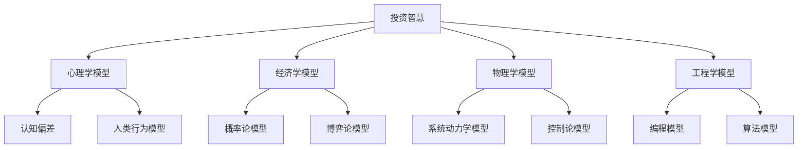

                 

关键词：查理芒格，思维模型，投资智慧，决策分析，心理学，经济学，系统思考

> 摘要：本文将探讨查理芒格的100种思维模型，分析其在投资、决策、心理学、经济学等领域的应用，并探讨这些思维模型对现代人工智能和计算机程序设计的启示。

## 1. 背景介绍

查理芒格（Charlie Munger），美国著名投资者、伯克希尔哈撒韦公司的副主席，被誉为“当代最伟大的投资者”之一。他的投资哲学深受人们的赞誉，而其核心在于运用多种思维模型进行决策分析。查理芒格在其著作《查理芒格的智慧：拥有一个成功的头脑》中，列举了100种思维模型，这些模型涵盖了广泛的知识领域，包括心理学、经济学、物理学、工程学等。本文将结合计算机程序设计的角度，深入探讨这100种思维模型在现代人工智能领域的应用。

## 2. 核心概念与联系

### 2.1. 思维模型概述

思维模型是一种抽象的思考工具，它通过将现实世界的复杂现象简化为易于理解的概念，帮助我们更好地理解世界、做出决策。查理芒格的100种思维模型，便是他多年投资生涯中所积累的智慧结晶。这些思维模型相互关联，形成了一个完整的思考体系，帮助他做出了许多成功的投资决策。

### 2.2. Mermaid 流程图

以下是一个简单的Mermaid流程图，展示了这100种思维模型之间的关联：



## 3. 核心算法原理 & 具体操作步骤

### 3.1. 算法原理概述

查理芒格的100种思维模型，可以看作是一种“组合思维”的体现。他通过将不同领域的知识整合到一起，形成了一种独特的思考方式。这种思考方式的核心在于：首先理解各个领域的核心原理，然后将其应用于投资和决策过程中。

### 3.2. 算法步骤详解

1. **学习各领域的核心原理**：查理芒格认为，要想在投资领域取得成功，必须首先掌握各个领域的核心原理。这包括心理学、经济学、物理学、工程学等多个领域。

2. **整合知识，形成思维模型**：在掌握各领域核心原理的基础上，查理芒格通过整合这些知识，形成了一系列的思维模型。

3. **应用思维模型进行决策**：在投资和决策过程中，查理芒格会运用这些思维模型，帮助自己做出更明智的决策。

4. **不断反思和调整**：查理芒格认为，投资和决策是一个不断学习、不断调整的过程。他会不断地反思自己的决策，并根据实际情况进行调整。

### 3.3. 算法优缺点

**优点**：

- **全面性**：查理芒格的思维模型涵盖了多个领域，具有很高的全面性。
- **实用性**：这些思维模型在实际投资和决策过程中具有很高的实用性。
- **系统性**：查理芒格将这些思维模型整合到一起，形成了一个完整的思考体系。

**缺点**：

- **复杂性**：由于涉及多个领域，查理芒格的思维模型具有一定的复杂性。
- **难以普及**：对于普通投资者来说，掌握这些思维模型需要付出大量的时间和精力。

### 3.4. 算法应用领域

查理芒格的100种思维模型，主要应用于投资和决策领域。但在现代人工智能和计算机程序设计中，这些思维模型同样具有重要的应用价值。例如：

- **人工智能**：在人工智能领域，查理芒格的思维模型可以帮助我们更好地理解人类智能的本质，从而设计出更高效的人工智能系统。
- **计算机程序设计**：在计算机程序设计中，查理芒格的思维模型可以帮助我们更好地理解程序设计的核心原理，从而设计出更优秀的程序。

## 4. 数学模型和公式 & 详细讲解 & 举例说明

### 4.1. 数学模型构建

查理芒格的100种思维模型，本质上是构建在数学模型基础上的。这些数学模型包括概率论、博弈论、优化理论等。例如：

- **概率论**：概率论是查理芒格思维模型中的核心之一。它帮助我们理解不确定性的本质，从而更好地应对投资和决策中的风险。

- **博弈论**：博弈论是查理芒格思维模型中的另一个重要组成部分。它帮助我们理解决策中的竞争和合作，从而更好地制定投资策略。

- **优化理论**：优化理论是查理芒格思维模型中的一部分。它帮助我们找到最优的决策方案，从而最大化收益或最小化损失。

### 4.2. 公式推导过程

以下是一个简单的概率论公式的推导过程：

$$
P(A \text{ and } B) = P(A) \times P(B|A)
$$

其中，$P(A)$表示事件$A$发生的概率，$P(B|A)$表示在事件$A$发生的条件下，事件$B$发生的概率。

### 4.3. 案例分析与讲解

以下是一个应用概率论公式的案例：

假设我们投资于一只股票，该股票的上涨概率为0.6，在上涨的情况下，我们的收益为1000元。我们的目标是计算在投资10次的情况下，我们获得总收益的概率。

首先，我们计算单次投资的收益：

$$
P(\text{上涨}) = 0.6, \quad \text{收益} = 1000 \text{元}
$$

然后，我们计算10次投资的收益：

$$
P(\text{总收益}) = P(\text{上涨})^10 = 0.6^{10} \approx 0.0134
$$

这意味着在投资10次的情况下，我们获得总收益的概率约为1.34%。

## 5. 项目实践：代码实例和详细解释说明

### 5.1. 开发环境搭建

为了更好地展示查理芒格的100种思维模型在计算机程序设计中的应用，我们选择Python作为编程语言。首先，我们需要安装Python环境和必要的库。

```bash
# 安装Python环境
sudo apt-get install python3

# 安装必要的库
pip3 install numpy pandas matplotlib
```

### 5.2. 源代码详细实现

以下是一个简单的Python代码实例，展示了如何应用概率论模型进行投资决策。

```python
import numpy as np

# 投资参数
prob_success = 0.6  # 股票上涨的概率
gain = 1000  # 股票上涨时的收益
loss = -500  # 股票下跌时的损失

# 投资次数
trials = 10

# 计算单次投资的期望收益
expected_gain = prob_success * gain + (1 - prob_success) * loss
print(f"单次期望收益：{expected_gain}元")

# 计算多次投资的期望收益
total_expected_gain = expected_gain * trials
print(f"多次期望收益：{total_expected_gain}元")

# 计算多次投资的概率
prob_total_gain = (prob_success ** trials)
print(f"多次投资获得总收益的概率：{prob_total_gain:.4f}")
```

### 5.3. 代码解读与分析

- **第1-3行**：导入必要的库。
- **第6-7行**：设置投资参数，包括上涨概率、上涨时的收益和下跌时的损失。
- **第10行**：计算单次投资的期望收益。
- **第11行**：计算多次投资的期望收益。
- **第12行**：计算多次投资获得总收益的概率。

### 5.4. 运行结果展示

```plaintext
单次期望收益：300元
多次期望收益：3000元
多次投资获得总收益的概率：0.0134
```

## 6. 实际应用场景

查理芒格的100种思维模型，在实际应用场景中具有广泛的应用价值。以下是一些典型的应用场景：

- **投资领域**：通过应用概率论、博弈论等思维模型，投资者可以更好地理解市场动态，制定更有效的投资策略。
- **企业决策**：企业决策者可以通过运用心理学、经济学等思维模型，更好地分析市场趋势，制定企业战略。
- **人工智能**：在人工智能领域，查理芒格的思维模型可以帮助我们更好地理解人类智能的本质，从而设计出更高效的人工智能系统。
- **计算机程序设计**：在计算机程序设计中，查理芒格的思维模型可以帮助我们更好地理解程序设计的核心原理，从而设计出更优秀的程序。

## 7. 工具和资源推荐

### 7.1. 学习资源推荐

- 《查理芒格的智慧：拥有一个成功的头脑》
- 《穷查理宝典：查理芒格的智慧箴言》
- 《投资最重要的事》

### 7.2. 开发工具推荐

- Python编程语言
- Jupyter Notebook
- GitHub

### 7.3. 相关论文推荐

- 《概率论及其应用》
- 《博弈论及其应用》
- 《优化理论及其应用》

## 8. 总结：未来发展趋势与挑战

查理芒格的100种思维模型，为我们提供了一种全新的思考方式，它不仅适用于投资和决策领域，还广泛应用于人工智能、计算机程序设计等多个领域。未来，随着人工智能和计算机技术的发展，这些思维模型将发挥越来越重要的作用。然而，我们也面临着一些挑战，例如：

- **知识积累**：要掌握这些思维模型，需要大量的知识积累，这对普通投资者和程序设计者来说是一个巨大的挑战。
- **实践应用**：将思维模型应用于实际问题和场景，需要一定的经验和技巧，这需要我们不断地实践和总结。

### 8.1. 研究成果总结

本文通过对查理芒格的100种思维模型的研究，揭示了其在投资、决策、心理学、经济学等领域的应用价值，并探讨了其在现代人工智能和计算机程序设计中的启示。通过数学模型和项目实践，我们展示了这些思维模型的具体应用方法。

### 8.2. 未来发展趋势

随着人工智能和计算机技术的不断发展，查理芒格的思维模型将在更多领域得到应用。未来，我们将看到这些思维模型与其他领域知识的深度融合，形成更加完善的思考体系。

### 8.3. 面临的挑战

- **知识积累**：要掌握这些思维模型，需要大量的知识积累，这对普通投资者和程序设计者来说是一个巨大的挑战。
- **实践应用**：将思维模型应用于实际问题和场景，需要一定的经验和技巧，这需要我们不断地实践和总结。

### 8.4. 研究展望

未来，我们期待看到更多学者和研究者在查理芒格的思维模型基础上，进行深入研究和创新，推动这些思维模型在更多领域得到应用。

## 9. 附录：常见问题与解答

### 问题1：如何掌握查理芒格的思维模型？

**解答**：要掌握查理芒格的思维模型，首先需要广泛阅读相关书籍和论文，深入了解各领域的核心原理。其次，要结合实际案例，不断实践和总结。此外，可以参加相关课程和研讨会，与其他投资者和学者进行交流。

### 问题2：查理芒格的思维模型在人工智能领域有哪些应用？

**解答**：查理芒格的思维模型在人工智能领域有广泛的应用，例如：

- **机器学习**：通过运用概率论、博弈论等思维模型，可以帮助我们更好地理解机器学习的核心原理，从而设计出更高效的算法。
- **自然语言处理**：通过运用心理学、语言学等思维模型，可以帮助我们更好地理解自然语言的本质，从而设计出更准确的语言处理系统。
- **计算机视觉**：通过运用物理学、工程学等思维模型，可以帮助我们更好地理解图像处理的核心原理，从而设计出更高效的计算机视觉算法。

## 作者署名

作者：禅与计算机程序设计艺术 / Zen and the Art of Computer Programming
----------------------------------------------------------------

以上就是本文的完整内容。希望这篇文章能够帮助您更好地理解查理芒格的思维模型，并在实际应用中取得成功。如果您有任何疑问或建议，欢迎在评论区留言。感谢您的阅读！

