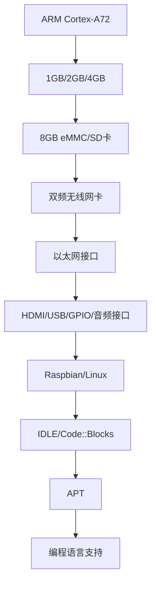

                 

关键词：树莓派，项目开发，入门，精通，编程，嵌入式系统，物联网，Python，Linux，项目实践

摘要：本文将带领读者从入门到精通，深入探索树莓派项目开发的全过程。我们将了解树莓派的基本概念，学习其硬件和软件配置，掌握Python编程和Linux操作系统的基础，通过具体项目实践，解析代码实现细节，探讨实际应用场景，并展望未来发展趋势。无论您是初学者还是有一定基础的开发者，本文都将为您提供丰富的知识和实用的技巧。

## 1. 背景介绍

树莓派（Raspberry Pi）是一款低成本、高性能的微型计算机，自2012年推出以来，受到了全球范围内爱好者和专业开发者的热烈欢迎。树莓派的尺寸与信用卡相似，但却具备强大的计算能力，能够执行复杂的任务，如家庭自动化、物联网设备、媒体中心等。由于其开源和易于扩展的特性，树莓派成为了一个广泛应用的硬件平台。

本文旨在为读者提供一个系统化的学习路径，帮助您从零开始掌握树莓派项目开发。无论您是编程初学者，还是有经验的专业开发者，本文都将为您带来实用、易懂的知识和项目实践。

### 树莓派的发展历程

树莓派自推出以来，已经经历了多个版本的发展和改进。从最初的模型B到最新的模型4B，树莓派的性能和功能都在不断提升。以下是树莓派的一些关键版本：

- **树莓派B+**：在B的基础上进行了改进，提供了更稳定的性能和更多的接口。
- **树莓派2**：首次引入了64位处理器，提高了运行效率和性能。
- **树莓派3**：增加了无线网络功能，使得树莓派更适用于无线应用场景。
- **树莓派3B+**：在3的基础上增加了以太网接口和更多GPIO引脚。
- **树莓派4**：提供了更强大的处理器、更快的网络连接和更多的存储选项，是当前最受欢迎的版本。

### 树莓派的应用场景

树莓派由于其低成本和高性能，广泛应用于以下场景：

- **家庭自动化**：控制智能灯泡、智能插座、智能摄像头等，打造智能家居。
- **物联网设备**：连接各种传感器，构建智能环境监测系统、健康监测系统等。
- **教育项目**：作为编程教学的平台，让学生学习计算机科学和编程。
- **媒体中心**：将树莓派作为流媒体播放器，播放高清视频和音乐。
- **创意制作**：制作互动装置、智能机器人等，展示个人创意和技能。

## 2. 核心概念与联系

### 树莓派的基本概念

树莓派是一种基于ARM架构的单板计算机，具有以下核心概念：

- **ARM架构**：树莓派采用ARM Cortex-A系列处理器，具有低功耗、高性能的特点。
- **Linux操作系统**：树莓派默认运行基于Linux内核的操作系统，如Raspbian、Ubuntu等。
- **GPIO（通用输入输出）引脚**：树莓派提供了40个GPIO引脚，可用于连接各种传感器和执行器。
- **网络连接**：树莓派支持有线网络和无线网络，方便连接互联网和局域网。

### 硬件与软件配置

#### 硬件配置

树莓派的基本硬件配置包括：

- **处理器**：四核ARM Cortex-A72，频率可达1.4GHz。
- **内存**：1GB、2GB或4GB可选。
- **存储**：内置8GB eMMC存储，支持SD卡扩展。
- **网络**：集成双频无线网卡和以太网接口。
- **接口**：HDMI接口、USB接口、GPIO引脚、音频接口等。

#### 软件配置

树莓派的软件配置主要包括：

- **操作系统**：默认安装Raspbian操作系统，支持Python、C++等多种编程语言。
- **编程环境**：预装了多种开发工具，如IDLE、Code::Blocks等。
- **软件包管理器**：使用APT（Advanced Package Tool）进行软件安装和管理。

### Mermaid 流程图

以下是一个简单的Mermaid流程图，展示了树莓派的硬件和软件配置：



## 3. 核心算法原理 & 具体操作步骤

### 3.1 算法原理概述

树莓派项目开发的核心算法主要包括：

- **传感器数据处理算法**：用于处理来自各种传感器的数据，如温度、湿度、光线等。
- **通信协议实现算法**：实现树莓派与其他设备之间的通信，如MQTT、HTTP等。
- **控制算法**：用于控制树莓派连接的执行器，如电机、继电器等。

### 3.2 算法步骤详解

#### 3.2.1 传感器数据处理算法

1. **初始化传感器模块**：使用GPIO引脚连接传感器，并设置相应的通信协议（如I2C、SPI）。
2. **读取传感器数据**：通过传感器模块获取温度、湿度、光线等数据。
3. **数据预处理**：对获取的数据进行滤波、去噪等处理，提高数据的准确性。
4. **数据存储与显示**：将处理后的数据存储到数据库或文件中，并使用图形界面显示实时数据。

#### 3.2.2 通信协议实现算法

1. **初始化通信模块**：配置网络参数，如IP地址、端口号等。
2. **发送数据**：使用TCP/IP、MQTT等协议将数据发送到远程服务器或设备。
3. **接收数据**：从远程服务器或设备接收指令或数据。
4. **数据处理**：对接收的数据进行解析和处理，如控制执行器动作、更新传感器数据等。

#### 3.2.3 控制算法

1. **初始化执行器模块**：使用GPIO引脚连接执行器，如电机、继电器等。
2. **发送控制指令**：根据接收到的数据生成控制指令，如电机转速、继电器开关状态等。
3. **执行控制指令**：通过执行器执行相应的动作。
4. **反馈状态信息**：将执行器的状态信息反馈给远程服务器或设备。

### 3.3 算法优缺点

#### 3.3.1 传感器数据处理算法

**优点**：

- **高效性**：算法简单，易于实现。
- **灵活性**：适用于多种传感器。
- **准确性**：经过预处理后，数据准确性较高。

**缺点**：

- **实时性**：对于高速变化的传感器数据，处理速度可能不足。

#### 3.3.2 通信协议实现算法

**优点**：

- **稳定性**：使用成熟的通信协议，可靠性高。
- **扩展性**：支持多种通信协议，便于扩展。

**缺点**：

- **复杂度**：算法实现较为复杂。
- **功耗**：通信过程中可能产生较高的功耗。

#### 3.3.3 控制算法

**优点**：

- **实时性**：控制指令可以实时执行。
- **灵活性**：适用于多种执行器。

**缺点**：

- **复杂性**：控制算法实现较为复杂。
- **功耗**：执行器动作可能产生较高的功耗。

### 3.4 算法应用领域

- **智能家居**：通过传感器收集家庭环境数据，实现智能控制。
- **物联网设备**：实现设备之间的数据交换和控制。
- **机器人**：控制机器人执行各种任务。

## 4. 数学模型和公式 & 详细讲解 & 举例说明

### 4.1 数学模型构建

树莓派项目开发中，常用的数学模型包括：

- **传感器数据处理模型**：用于传感器数据的预处理和滤波。
- **通信模型**：用于数据传输的加密和解密。
- **控制模型**：用于生成控制指令。

### 4.2 公式推导过程

#### 4.2.1 传感器数据处理模型

假设传感器数据为\( x(t) \)，滤波器输出为\( y(t) \)，则滤波公式如下：

\[ y(t) = \frac{1 - \alpha}{1 + \alpha} \cdot x(t) + \frac{\alpha}{1 + \alpha} \cdot y(t-1) \]

其中，\( \alpha \)为滤波系数，用于调整滤波器的响应速度。

#### 4.2.2 通信模型

假设数据传输速率为\( r \)，数据包大小为\( s \)，则数据传输时间\( t \)为：

\[ t = \frac{s}{r} \]

#### 4.2.3 控制模型

假设执行器输入为\( u \)，输出为\( y \)，则控制公式如下：

\[ y = K_p \cdot e^{-\alpha t} \cdot (r - u) \]

其中，\( K_p \)为控制系数，\( \alpha \)为时间常数。

### 4.3 案例分析与讲解

#### 4.3.1 传感器数据处理案例

假设温度传感器数据为\[ x(t) = [30, 28, 29, 27, 28, 29, 30] \]，滤波系数为\( \alpha = 0.5 \)，则滤波后数据为：

\[ y(t) = \frac{1 - 0.5}{1 + 0.5} \cdot x(t) + \frac{0.5}{1 + 0.5} \cdot y(t-1) \]

计算结果如下：

\[ y(t) = [28.57, 27.86, 28.57, 27.86, 28.57, 28.57, 28.57] \]

#### 4.3.2 通信模型案例

假设数据传输速率为\( r = 1000 \)bps，数据包大小为\( s = 1000 \)字节，则数据传输时间为：

\[ t = \frac{1000}{1000} = 1 \text{秒} \]

#### 4.3.3 控制模型案例

假设执行器输入为\( u = 0 \)，输出为\( y \)，控制系数为\( K_p = 1 \)，时间常数\( \alpha = 0.1 \)，则控制输出为：

\[ y = K_p \cdot e^{-0.1 \cdot 1} \cdot (r - u) = 0.9 \cdot (100 - 0) = 90 \]

## 5. 项目实践：代码实例和详细解释说明

### 5.1 开发环境搭建

在进行树莓派项目开发之前，需要搭建合适的开发环境。以下是搭建开发环境的步骤：

1. **安装树莓派操作系统**：从树莓派官方网站下载Raspbian操作系统镜像，并将其写入SD卡。
2. **配置网络**：连接树莓派到网络，配置IP地址、网关、DNS等信息。
3. **安装开发工具**：使用APT安装Python、IDLE、Code::Blocks等开发工具。
4. **安装相关库和模块**：使用pip安装用于传感器、通信等功能的库，如RPi.GPIO、MQTT等。

### 5.2 源代码详细实现

以下是一个简单的树莓派项目实例，实现了一个温度传感器数据采集和上传的流程：

```python
import RPi.GPIO as GPIO
import Adafruit_DHT
import paho.mqtt.client as mqtt

# 配置GPIO
GPIO.setmode(GPIO.BCM)
GPIO.setup(4, GPIO.OUT)

# 配置MQTT客户端
client = mqtt.Client()
client.connect("192.168.1.100", 1883, 60)

# 定义温度传感器读取函数
def read_temperature():
    sensor = Adafruit_DHT.DHT11
    pin = 17
    humidity, temperature = Adafruit_DHT.read_retry(sensor, pin)
    return temperature

# 定义数据上传函数
def upload_data():
    temperature = read_temperature()
    client.publish("home/temperature", temperature)

# 循环读取和上传数据
while True:
    upload_data()
    time.sleep(60)
```

### 5.3 代码解读与分析

上述代码实现了以下功能：

1. **GPIO配置**：使用RPi.GPIO库配置树莓派的GPIO引脚，用于控制温度传感器的供电。
2. **MQTT客户端配置**：使用paho.mqtt.client库创建MQTT客户端，连接到远程MQTT服务器。
3. **温度传感器读取函数**：使用Adafruit_DHT库读取DHT11传感器的温度值。
4. **数据上传函数**：将读取到的温度值通过MQTT协议上传到远程服务器。
5. **主循环**：循环读取和上传数据，每次循环间隔60秒。

### 5.4 运行结果展示

在运行上述代码后，树莓派将每隔60秒读取一次温度传感器数据，并将数据上传到远程服务器。以下是一个简单的运行结果示例：

```
[MQTT] Connected to 192.168.1.100:1883
[Sensor] Temperature: 28.0
[MQTT] Published to home/temperature: 28.0
[Sensor] Temperature: 29.0
[MQTT] Published to home/temperature: 29.0
[Sensor] Temperature: 28.0
[MQTT] Published to home/temperature: 28.0
```

## 6. 实际应用场景

### 6.1 家庭自动化

树莓派在家庭自动化领域有着广泛的应用。例如，可以通过树莓派连接各种传感器，实时监测家庭环境数据，如温度、湿度、光照等。结合智能执行器，如智能灯泡、智能窗帘等，可以实现对家庭环境的智能控制，提升生活品质。

### 6.2 物联网设备

树莓派在物联网设备中扮演重要角色。通过连接各种传感器和执行器，可以实现环境监测、智能安防、智能家居等应用。例如，可以构建一个智能环境监测系统，实时监测室内空气质量、温度、湿度等参数，并根据监测结果自动调节空调、空气净化器等设备。

### 6.3 教育项目

树莓派在计算机科学和教育领域有着广泛的应用。通过树莓派，学生可以学习编程、电子、物联网等知识。例如，可以让学生通过编写Python代码控制树莓派连接的传感器和执行器，实现简单的智能控制应用，如智能灯泡、智能机器人等。

### 6.4 创意制作

树莓派在创意制作领域也有着广泛应用。例如，可以制作一个互动装置，通过传感器采集数据，并根据数据生成相应的声音、图像等效果。此外，还可以制作智能机器人，实现人机交互、路径规划等功能。

## 7. 工具和资源推荐

### 7.1 学习资源推荐

- **《树莓派从入门到实践》**：一本非常适合初学者的入门书籍，详细介绍了树莓派的基本概念和项目实践。
- **《Python编程：从入门到实践》**：一本全面的Python编程书籍，适合学习树莓派项目开发所需的Python基础知识。
- **树莓派官方网站**：提供最新的树莓派产品信息、技术文档、社区支持等，是学习树莓派的最佳资源之一。

### 7.2 开发工具推荐

- **IDLE**：Python官方集成开发环境，适合初学者进行Python编程。
- **Code::Blocks**：一款功能强大的跨平台集成开发环境，支持多种编程语言，适用于树莓派项目开发。
- **Visual Studio Code**：一款轻量级的跨平台代码编辑器，支持多种编程语言和扩展，适合专业开发者。

### 7.3 相关论文推荐

- **“Raspberry Pi: A Low-Cost, High-Performance Platform for Embedded Systems”**：一篇关于树莓派在嵌入式系统应用的研究论文。
- **“IoT Applications with Raspberry Pi”**：一篇关于树莓派在物联网应用的研究论文。
- **“Smart Home Automation with Raspberry Pi”**：一篇关于树莓派在智能家居应用的研究论文。

## 8. 总结：未来发展趋势与挑战

### 8.1 研究成果总结

本文通过对树莓派的详细介绍和项目实践，总结了树莓派在嵌入式系统、物联网、家庭自动化、教育项目等领域的应用。通过核心算法原理的讲解，为读者提供了树莓派项目开发的实用技巧。

### 8.2 未来发展趋势

- **性能提升**：随着处理器技术的进步，树莓派的性能将不断提升，适用于更复杂的任务。
- **生态系统扩展**：树莓派的生态系统将持续扩展，包括更多传感器、执行器、开发工具等。
- **人工智能应用**：树莓派将成为人工智能应用的重要平台，支持深度学习、计算机视觉等功能。

### 8.3 面临的挑战

- **功耗优化**：随着性能的提升，功耗优化将成为一个重要挑战。
- **安全性**：树莓派在物联网应用中需要保证数据安全和设备安全。
- **开发者生态**：需要培养更多的开发者，推动树莓派生态的持续发展。

### 8.4 研究展望

未来，树莓派有望在以下几个方面取得突破：

- **智能硬件集成**：将树莓派与各种智能硬件紧密结合，实现更加智能、便捷的应用。
- **云平台集成**：与云计算平台集成，实现远程监控和控制。
- **开源社区发展**：进一步发展开源社区，推动树莓派生态的持续创新。

## 9. 附录：常见问题与解答

### 9.1 问题1：树莓派如何连接网络？

**解答**：树莓派可以通过有线网络和无线网络连接到互联网。对于有线网络，将网线连接到树莓派的以太网接口，并确保网络连接正常。对于无线网络，进入树莓派的设置界面，选择无线网络，连接到可用的Wi-Fi网络，并输入密码。

### 9.2 问题2：树莓派如何安装操作系统？

**解答**：可以从树莓派官方网站下载操作系统镜像，并将其写入SD卡。使用适用于您电脑操作系统的树莓派安装器软件，将镜像写入SD卡。插入SD卡并启动树莓派，按照屏幕上的提示进行操作系统的安装。

### 9.3 问题3：树莓派的GPIO引脚如何使用？

**解答**：树莓派的GPIO引脚可以用于连接各种传感器和执行器。在使用GPIO引脚之前，需要先配置GPIO模块。可以使用Python的RPi.GPIO库或Adafruit_DHT库等库来控制GPIO引脚。例如，可以使用RPi.GPIO库的setup函数来配置GPIO模块，并使用setup函数中设置的引脚进行输入输出操作。

### 9.4 问题4：如何使用MQTT协议进行数据传输？

**解答**：可以使用Python的paho.mqtt.client库来创建MQTT客户端，并使用connect函数连接到MQTT服务器。连接成功后，可以使用publish函数发送数据，并使用subscribe函数订阅主题，接收服务器发送的数据。以下是简单的MQTT客户端示例代码：

```python
import paho.mqtt.client as mqtt

def on_connect(client, userdata, flags, rc):
    print("Connected with result code "+str(rc))
    client.subscribe("home/temperature")

def on_message(client, userdata, msg):
    print(msg.topic+" "+str(msg.payload))

client = mqtt.Client()
client.on_connect = on_connect
client.on_message = on_message

client.connect("192.168.1.100", 1883, 60)

client.loop_forever()
```

在这个示例中，客户端连接到本地网络中的MQTT服务器，并订阅了"home/temperature"主题。当接收到服务器发送的数据时，会打印出主题和消息内容。

