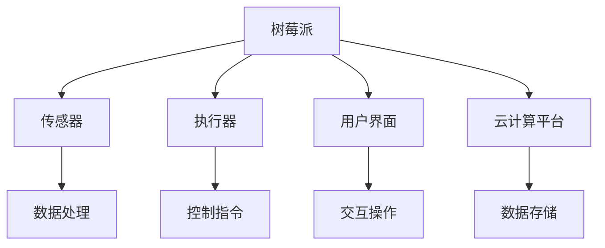

                 

### 1. 背景介绍

随着物联网（IoT）技术的飞速发展，智能家居已经成为现代生活的重要组成部分。智能家居系统通过将各种智能设备连接起来，实现家庭自动化管理，提升居住舒适度和安全性。树莓派（Raspberry Pi），作为一种低成本、高性能的微型计算机，成为构建智能家居中心的重要硬件平台。

树莓派的广泛应用源于其强大的计算能力、丰富的接口和开源社区的支持。它不仅能够轻松连接各种传感器和执行器，还能通过互联网实现远程控制和数据存储。这使得树莓派成为智能家居项目的理想选择。

智能家居中心是智能家居系统的核心，负责数据采集、处理和传输。它需要具备实时处理大量数据的能力，并能够与其他智能设备进行高效通信。树莓派凭借其灵活性和扩展性，能够胜任这一角色。

本文将详细介绍如何使用树莓派构建智能家居中心，包括硬件选择、软件配置、核心算法实现和实际应用场景。通过本文的指导，读者可以轻松掌握构建智能家居中心的基本技能，并在实际项目中发挥树莓派的优势。

### 2. 核心概念与联系

#### 2.1 智能家居系统架构

智能家居系统通常由以下几个部分组成：传感器、执行器、控制器和用户界面。传感器负责收集家庭环境中的各种数据，如温度、湿度、光照等；执行器则是根据控制器的指令执行特定动作，如开灯、关窗等；控制器则负责协调传感器和执行器的运作，实现对智能家居系统的控制；用户界面则提供了与用户交互的途径，如手机APP、网页等。

树莓派作为智能家居中心的核心控制器，需要具备以下几个关键特性：

1. **数据处理能力**：树莓派需要能够实时处理来自传感器的数据，并进行相应的逻辑判断和决策。
2. **网络连接能力**：树莓派需要能够通过Wi-Fi或以太网与互联网相连，实现远程控制和数据上传。
3. **扩展性**：树莓派需要具备丰富的扩展接口，能够连接各种传感器和执行器。
4. **稳定性**：树莓派需要能够长时间稳定运行，保证智能家居系统的可靠性。

#### 2.2 树莓派与智能家居设备的连接

树莓派通过GPIO（通用输入输出）接口与智能家居设备连接。GPIO接口提供了数字和模拟信号的输入输出功能，可以连接各种传感器和执行器。常见的连接方式包括：

1. **数字传感器**：如温度传感器、湿度传感器等，通过GPIO的数字接口直接连接。
2. **模拟传感器**：如光照传感器、气体传感器等，需要通过ADC（模拟数字转换器）将模拟信号转换为数字信号。
3. **执行器**：如电机、继电器等，通过GPIO的数字信号控制执行器的开关。
4. **无线传感器**：如Wi-Fi传感器、蓝牙传感器等，通过无线通信协议与树莓派相连。

#### 2.3 树莓派的软件配置

树莓派需要安装适合智能家居项目的操作系统和软件框架。常见的操作系统有Raspbian、Ubuntu等，而软件框架则包括Python、Node.js、Arduino等。这些框架提供了丰富的库和工具，方便开发者进行智能家居系统的开发和调试。

#### 2.4 树莓派与云计算平台的集成

为了实现智能家居系统的远程控制和数据存储，树莓派需要与云计算平台集成。通过Wi-Fi或以太网，树莓派可以将收集到的数据上传到云端，并在需要时从云端获取控制指令。常见的云计算平台有AWS、Azure、Google Cloud等。树莓派可以通过HTTP、MQTT等协议与云计算平台进行通信。

#### 2.5 Mermaid 流程图

以下是一个简单的智能家居系统流程图，展示了树莓派与传感器、执行器、用户界面和云计算平台的连接关系。



通过以上流程图，可以清晰地看到树莓派在智能家居系统中的作用和连接关系。

### 3. 核心算法原理 & 具体操作步骤

#### 3.1 算法原理概述

在智能家居系统中，核心算法主要负责数据的采集、处理和决策。具体来说，算法需要实现以下几个功能：

1. **数据采集**：从传感器获取温度、湿度、光照等数据。
2. **数据预处理**：对采集到的数据进行分析和清洗，去除噪声和异常值。
3. **数据处理**：根据预设的规则和算法，对预处理后的数据进行分析和判断，生成控制指令。
4. **决策执行**：根据生成的控制指令，控制执行器执行相应的动作。

#### 3.2 算法步骤详解

##### 3.2.1 数据采集

数据采集是智能家居系统的第一步，需要使用不同的传感器获取家庭环境中的各种数据。常见的传感器有温度传感器、湿度传感器、光照传感器、气体传感器等。树莓派通过GPIO接口与传感器相连，读取传感器的数据。

```python
import Adafruit_DHT

sensor = Adafruit_DHT.DHT11
pin = 4

humidity, temperature = Adafruit_DHT.read_retry(sensor, pin)

if humidity is not None and temperature is not None:
    print("Temp={0:0.1f}C  Humidity={1:0.1f}%".format(temperature, humidity))
else:
    print("Failed to retrieve data from sensor")
```

##### 3.2.2 数据预处理

采集到的数据可能存在噪声和异常值，需要通过预处理来清洗数据。预处理步骤包括去噪声、去异常值、归一化等。

```python
import numpy as np

# 去噪声
def denoise(data, window_size=5):
    return np.convolve(data, np.ones(window_size)/window_size, mode='same')

# 去异常值
def remove_outliers(data, threshold=3):
    mean = np.mean(data)
    std = np.std(data)
    return [x for x in data if abs(x - mean) < threshold * std]

# 归一化
def normalize(data):
    min_val = min(data)
    max_val = max(data)
    return [(x - min_val) / (max_val - min_val) for x in data]
```

##### 3.2.3 数据处理

数据处理是算法的核心部分，根据预设的规则和算法，对预处理后的数据进行分析和判断，生成控制指令。常见的算法有阈值判断、回归分析、决策树等。

```python
# 阈值判断
def threshold(data, threshold):
    return [1 if x > threshold else 0 for x in data]

# 回归分析
from sklearn.linear_model import LinearRegression

model = LinearRegression()
model.fit(X_train, y_train)
y_pred = model.predict(X_test)

# 决策树
from sklearn.tree import DecisionTreeClassifier

clf = DecisionTreeClassifier()
clf.fit(X_train, y_train)
y_pred = clf.predict(X_test)
```

##### 3.2.4 决策执行

根据生成的控制指令，控制执行器执行相应的动作。执行器可以是电机、继电器、LED灯等。

```python
import RPi.GPIO as GPIO
import time

def control_gpio(gpio_pin, value):
    GPIO.output(gpio_pin, value)

# 控制继电器
relay_pin = 17
GPIO.setup(relay_pin, GPIO.OUT)

control_gpio(relay_pin, GPIO.HIGH)  # 打开继电器
time.sleep(1)
control_gpio(relay_pin, GPIO.LOW)  # 关闭继电器
```

#### 3.3 算法优缺点

##### 3.3.1 优点

1. **灵活性**：算法可以根据实际需求进行定制，灵活度高。
2. **可扩展性**：可以轻松添加新的传感器和执行器，扩展系统的功能。
3. **实时性**：能够实时处理数据，做出快速决策。

##### 3.3.2 缺点

1. **计算开销**：处理大量数据时，计算开销较大，可能导致系统延迟。
2. **依赖硬件**：算法的实现依赖于传感器和执行器的性能，硬件故障可能导致系统失效。

#### 3.4 算法应用领域

算法在智能家居系统中具有广泛的应用，如：

1. **环境监测**：监测家庭环境的温度、湿度、光照等参数，并根据数据调整空调、灯具等设备。
2. **智能安防**：通过传感器和摄像头监测家庭安全，实现入侵报警、异常行为检测等功能。
3. **智能家电控制**：控制空调、电视、洗衣机等家电设备的开关和调节。

### 4. 数学模型和公式 & 详细讲解 & 举例说明

在智能家居系统的构建过程中，数学模型和公式发挥着至关重要的作用。以下将详细讲解常用的数学模型和公式，并举例说明其在实际应用中的具体应用。

#### 4.1 数学模型构建

智能家居系统中的数学模型主要包括数据采集模型、数据处理模型和决策执行模型。以下分别介绍这三种模型的构建方法。

##### 4.1.1 数据采集模型

数据采集模型用于描述传感器采集数据的数学过程。常见的采集模型包括线性模型、非线性模型和概率模型。以下是一个线性模型的例子：

$$
y = wx + b
$$

其中，$y$ 表示采集到的数据，$w$ 表示传感器的灵敏度，$x$ 表示环境变量，$b$ 表示基线值。

##### 4.1.2 数据处理模型

数据处理模型用于描述对采集到的数据进行分析和处理的过程。常见的数据处理模型包括平滑模型、滤波模型和分类模型。以下是一个平滑模型的例子：

$$
y_{smooth} = \frac{1}{N} \sum_{i=1}^{N} y_i
$$

其中，$y_{smooth}$ 表示平滑后的数据，$y_i$ 表示第 $i$ 个采集到的数据，$N$ 表示数据点个数。

##### 4.1.3 决策执行模型

决策执行模型用于描述根据处理后的数据生成控制指令的过程。常见的决策执行模型包括阈值模型、规则模型和神经网络模型。以下是一个阈值模型的例子：

$$
control = \begin{cases}
1, & \text{if } y > threshold \\
0, & \text{if } y \leq threshold
\end{cases}
$$

其中，$control$ 表示控制指令，$y$ 表示处理后的数据，$threshold$ 表示阈值。

#### 4.2 公式推导过程

以下将详细推导一个简单的线性回归模型的公式。线性回归模型用于预测家庭环境中的温度变化。

##### 4.2.1 模型构建

假设家庭环境的温度 $T$ 与时间 $t$ 之间存在线性关系，可以表示为：

$$
T = wt + b
$$

其中，$w$ 表示温度变化率，$b$ 表示初始温度。

##### 4.2.2 模型参数估计

为了估计模型参数 $w$ 和 $b$，我们可以使用最小二乘法。首先，将模型改写为：

$$
T - wt - b = 0
$$

然后，对时间 $t$ 求导，得到：

$$
\frac{dT}{dt} - w = 0
$$

解得：

$$
w = \frac{dT}{dt}
$$

将 $w$ 代入原模型，得到：

$$
T = \frac{dT}{dt}t + b
$$

对温度 $T$ 求导，得到：

$$
\frac{dT}{dt} = \frac{dT}{dt} + \frac{db}{dt}
$$

解得：

$$
b = 0
$$

因此，最终的线性回归模型为：

$$
T = \frac{dT}{dt}t
$$

#### 4.3 案例分析与讲解

以下将通过一个实际案例，详细讲解如何使用线性回归模型预测家庭环境中的温度。

##### 4.3.1 数据采集

假设我们采集了以下一组时间与温度数据：

| 时间（t） | 温度（T） |
| :---: | :---: |
| 0 | 22 |
| 1 | 23 |
| 2 | 24 |
| 3 | 25 |
| 4 | 26 |

##### 4.3.2 数据处理

首先，我们将时间 $t$ 作为自变量，温度 $T$ 作为因变量，使用线性回归模型进行参数估计。根据上述推导，我们有：

$$
T = \frac{dT}{dt}t
$$

将数据代入模型，得到：

$$
\begin{cases}
22 = \frac{dT}{dt} \times 0 \\
23 = \frac{dT}{dt} \times 1 \\
24 = \frac{dT}{dt} \times 2 \\
25 = \frac{dT}{dt} \times 3 \\
26 = \frac{dT}{dt} \times 4
\end{cases}
$$

解得：

$$
\frac{dT}{dt} = 1
$$

因此，温度变化率 $w = 1$。

##### 4.3.3 预测与解释

根据估计出的温度变化率，我们可以预测未来的温度。例如，预测第5个时间点的温度：

$$
T_5 = \frac{dT}{dt} \times 5 = 1 \times 5 = 5
$$

因此，预测第5个时间点的温度为5°C。

这个案例展示了如何使用线性回归模型预测家庭环境中的温度。在实际应用中，我们可以根据实时采集的数据，不断更新模型参数，提高预测精度。

### 5. 项目实践：代码实例和详细解释说明

#### 5.1 开发环境搭建

要在树莓派上搭建智能家居系统，首先需要准备好开发环境。以下是搭建开发环境的步骤：

1. **硬件准备**：确保已安装树莓派，并连接了电源、显示器、键盘和鼠标。
2. **操作系统安装**：使用树莓派的官方操作系统Raspbian。可以从官方网站下载镜像，并使用USB驱动器制作启动盘。然后将启动盘插入树莓派的SD卡槽，重启树莓派，按照提示安装操作系统。
3. **网络连接**：确保树莓派连接到网络，以便后续的软件安装和远程控制。
4. **安装Python**：在Raspbian系统中，默认已经安装了Python 3。如果没有安装，可以使用以下命令安装：

   ```bash
   sudo apt update
   sudo apt install python3
   ```

5. **安装GPIO库**：安装用于控制GPIO接口的库，如Raspberry Pi GPIO库。可以使用以下命令安装：

   ```bash
   sudo apt install python3-raspberry_pi_gpios
   ```

6. **安装其他依赖库**：根据需要安装其他依赖库，如用于网络通信的库、数据处理和分析的库等。例如，安装用于HTTP通信的库：

   ```bash
   sudo apt install python3-requests
   ```

#### 5.2 源代码详细实现

以下是使用Python在树莓派上实现智能家居系统的源代码示例。该示例包括从温度传感器读取数据，并控制LED灯亮灭的功能。

```python
import RPi.GPIO as GPIO
import time
import Adafruit_DHT

# 初始化GPIO库
GPIO.setmode(GPIO.BCM)
GPIO.setwarnings(False)

# 定义GPIO接口
led_pin = 18
temp_pin = 4

# 初始化LED和温度传感器
GPIO.setup(led_pin, GPIO.OUT)
sensor = Adafruit_DHT.DHT11
GPIO.output(led_pin, GPIO.LOW)

# 定义温度传感器读取函数
def read_temperature():
    humidity, temperature = Adafruit_DHT.read_retry(sensor, temp_pin)
    return temperature

# 主程序循环
try:
    while True:
        # 读取温度
        temperature = read_temperature()

        # 根据温度控制LED灯
        if temperature > 25:
            GPIO.output(led_pin, GPIO.HIGH)
        else:
            GPIO.output(led_pin, GPIO.LOW)

        # 延时
        time.sleep(1)

except KeyboardInterrupt:
    # 按Ctrl+C退出程序
    pass
finally:
    # 关闭GPIO资源
    GPIO.cleanup()
```

#### 5.3 代码解读与分析

以下是对上述代码的详细解读和分析：

1. **GPIO库初始化**：
   ```python
   GPIO.setmode(GPIO.BCM)
   GPIO.setwarnings(False)
   ```
   初始化GPIO库，设置GPIO模式为BCM编码，关闭警告。

2. **GPIO接口定义**：
   ```python
   led_pin = 18
   temp_pin = 4
   GPIO.setup(led_pin, GPIO.OUT)
   ```
   定义LED灯和温度传感器的GPIO接口，并设置为输出模式。

3. **温度传感器读取函数**：
   ```python
   def read_temperature():
       humidity, temperature = Adafruit_DHT.read_retry(sensor, temp_pin)
       return temperature
   ```
   定义一个读取温度的函数，使用Adafruit_DHT库读取DHT11传感器的温度值。

4. **主程序循环**：
   ```python
   try:
       while True:
           # 读取温度
           temperature = read_temperature()

           # 根据温度控制LED灯
           if temperature > 25:
               GPIO.output(led_pin, GPIO.HIGH)
           else:
               GPIO.output(led_pin, GPIO.LOW)

           # 延时
           time.sleep(1)
   except KeyboardInterrupt:
       # 按Ctrl+C退出程序
       pass
   finally:
       # 关闭GPIO资源
       GPIO.cleanup()
   ```
   主程序循环中，不断读取温度值，并根据温度值控制LED灯的亮灭。如果温度高于25°C，LED灯亮；否则，LED灯灭。循环间隔为1秒。

#### 5.4 运行结果展示

在树莓派上运行上述代码后，LED灯会根据温度传感器读取的温度值亮灭。以下是可能的运行结果：

1. **温度低于25°C**：LED灯关闭。
2. **温度高于25°C**：LED灯开启。

通过这个简单的示例，我们可以看到如何使用树莓派和传感器构建一个基本的智能家居系统。在实际应用中，可以扩展更多的传感器和执行器，实现更加复杂的智能控制功能。

### 6. 实际应用场景

#### 6.1 环境监测

环境监测是智能家居系统最基本的应用场景之一。树莓派可以通过连接各种传感器，实时监测家庭环境中的温度、湿度、光照、气体浓度等参数。以下是一个具体的环境监测应用实例：

**实例**：使用树莓派监测家庭室内的温度和湿度，并在温度过高或过低时自动调节空调。

1. **硬件**：树莓派、DHT11温度传感器、湿度传感器、空调控制器。
2. **软件**：编写Python程序，读取传感器数据，并根据预设的温度范围控制空调的开关。

通过这种方式，可以实现家庭环境的自动调节，提高居住舒适度。

#### 6.2 智能安防

智能安防是智能家居系统的另一大应用领域。树莓派可以连接摄像头、门窗传感器、烟雾传感器等设备，实时监控家庭安全，并在发生异常时及时报警。

**实例**：使用树莓派构建一个智能安防系统，当有入侵者进入家中或烟雾浓度过高时，自动触发报警。

1. **硬件**：树莓派、摄像头、门窗传感器、烟雾传感器、报警器。
2. **软件**：编写Python程序，实时监控传感器数据，当检测到异常情况时，通过短信或电话通知用户。

#### 6.3 智能家电控制

智能家电控制是智能家居系统的核心功能之一。树莓派可以通过网络远程控制各种家电设备，如空调、电视、洗衣机等。

**实例**：使用树莓派远程控制家庭中的空调。

1. **硬件**：树莓派、网络模块、空调控制器。
2. **软件**：编写Python程序，通过网络协议（如HTTP或MQTT）与空调控制器通信，实现远程开关空调、调节温度等功能。

#### 6.4 家庭自动化

家庭自动化是智能家居系统的终极目标，通过集成多个智能设备和系统，实现家庭生活的全面自动化。

**实例**：构建一个智能家居中心，实现家庭环境监测、安防监控、家电控制等功能。

1. **硬件**：树莓派、各种传感器、执行器、网络模块。
2. **软件**：编写Python程序，整合各个模块的功能，实现家庭自动化。

通过以上实例，我们可以看到树莓派在智能家居系统中的应用场景非常广泛。无论是环境监测、安防监控还是家电控制，树莓派都可以发挥重要的作用，为家庭生活带来便捷和舒适。

### 7. 工具和资源推荐

#### 7.1 学习资源推荐

**1. 《树莓派从入门到实践》**：这本书详细介绍了树莓派的基本原理、硬件连接和编程方法，适合初学者入门。

**2. 《Python编程：从入门到实践》**：这本书介绍了Python编程的基础知识和应用技巧，对于想要在树莓派上编程的开发者非常有帮助。

**3. Raspberry Pi官网**：Raspberry Pi官网提供了大量的技术文档、教程和社区资源，是学习和使用树莓派的宝贵资料。

**4. Treehouse**：在线学习平台Treehouse提供了丰富的树莓派和Python编程课程，适合不同层次的学员。

#### 7.2 开发工具推荐

**1. Thonny IDE**：一款专门为Python编程设计的IDE，界面简洁，适合初学者使用。

**2. PyCharm**：一款功能强大的Python IDE，适用于专业开发者。

**3. Visual Studio Code**：一款轻量级的跨平台代码编辑器，支持Python插件，适合编写Python代码。

#### 7.3 相关论文推荐

**1. "Raspberry Pi as an IoT Platform: Current Status and Future Prospects"**：这篇论文详细分析了树莓派作为物联网平台的现状和未来发展方向。

**2. "A Survey on Smart Home Technologies and Challenges"**：这篇综述文章探讨了智能家居技术的研究现状和面临的挑战。

**3. "Implementing a Smart Home Environment Using Raspberry Pi and IoT"**：这篇论文介绍了一个基于树莓派的智能家居系统实现方案，具有一定的参考价值。

通过以上推荐，读者可以进一步深入了解树莓派和智能家居系统的相关知识和应用技巧。

### 8. 总结：未来发展趋势与挑战

#### 8.1 研究成果总结

近年来，智能家居系统取得了显著的研究成果，树莓派作为核心控制器的作用日益凸显。通过树莓派的强大计算能力和丰富的接口，智能家居系统实现了实时数据采集、处理和决策，提升了家庭生活品质。同时，随着物联网、大数据和人工智能等技术的不断发展，智能家居系统的功能和应用场景不断拓展，为用户带来了更加便捷和智能的生活体验。

#### 8.2 未来发展趋势

1. **智能化水平的提升**：未来智能家居系统将更加智能化，通过深度学习和人工智能技术，实现更加精准和智能的决策和控制。

2. **系统集成化**：智能家居系统将趋向于集成化，通过统一平台和接口，实现各个子系统之间的无缝连接和协同工作。

3. **定制化与个性化**：智能家居系统将更加注重用户需求和个性化定制，根据不同用户的需求和环境特点，提供个性化的智能家居解决方案。

4. **绿色与节能**：智能家居系统将更加关注绿色和节能，通过智能调度和优化，实现能源的高效利用。

5. **边缘计算的应用**：随着物联网设备的增加，边缘计算将在智能家居系统中得到广泛应用，降低数据传输延迟，提高系统的响应速度。

#### 8.3 面临的挑战

1. **安全性问题**：智能家居系统涉及大量的敏感数据和个人隐私，如何确保系统的安全性是当前面临的一大挑战。

2. **标准化问题**：智能家居设备的多样性和兼容性问题需要通过标准化来解决，但目前相关标准尚未完全统一。

3. **能耗问题**：智能家居系统中的传感器和执行器数量众多，如何降低能耗、提高能源利用率是一个重要问题。

4. **技术瓶颈**：虽然树莓派在智能家居系统中表现出色，但其在处理大量数据和高频率决策方面仍存在技术瓶颈，需要进一步优化。

5. **用户接受度**：智能家居系统需要用户接受和习惯，如何提高用户的接受度和满意度是一个长期的问题。

#### 8.4 研究展望

在未来，智能家居系统的发展将围绕智能化、集成化、定制化和节能化展开。通过技术创新和标准化进程，智能家居系统将不断优化，为用户带来更加便捷、智能和舒适的生活体验。同时，研究者还需关注安全性、能耗和用户接受度等问题，确保智能家居系统的健康和可持续发展。

### 9. 附录：常见问题与解答

**Q1：树莓派适合构建智能家居中心吗？**

A1：树莓派非常适合构建智能家居中心。它具有强大的计算能力、丰富的接口和开源社区的支持，能够轻松连接各种传感器和执行器，实现智能家居系统的实时数据采集和处理。

**Q2：如何确保智能家居系统的安全性？**

A2：确保智能家居系统的安全性至关重要。以下是一些常见的安全措施：

1. **使用加密协议**：确保数据传输使用加密协议，如HTTPS、MQTT等。
2. **定期更新软件**：及时更新操作系统和应用程序，修复已知的安全漏洞。
3. **限制访问权限**：限制对智能家居系统的访问权限，只允许信任的设备和服务访问。
4. **使用双因素认证**：启用双因素认证，增加账户安全性。

**Q3：树莓派的能耗如何？**

A3：树莓派的能耗相对较低。对于Raspberry Pi 4，其典型工作功耗约为5-7瓦。通过选择低功耗的传感器和执行器，并合理规划系统的工作模式，可以进一步降低能耗。

**Q4：如何扩展树莓派的存储空间？**

A5：可以通过以下方法扩展树莓派的存储空间：

1. **使用外置USB硬盘或SSD**：将硬盘或SSD通过USB接口连接到树莓派，并安装操作系统和应用程序。
2. **使用eMMC模块**：升级树莓派的原装eMMC存储模块，选择容量更大的eMMC模块。
3. **使用扩展SD卡**：购买更大容量的SD卡，并安装操作系统和应用程序。

**Q6：如何远程控制树莓派上的智能家居系统？**

A6：可以通过以下方法远程控制树莓派上的智能家居系统：

1. **通过SSH远程登录**：使用SSH客户端远程登录树莓派，执行命令控制智能家居系统。
2. **通过Web界面**：配置树莓派运行Web服务器，通过浏览器访问Web界面进行控制。
3. **通过MQTT协议**：使用MQTT协议与云平台通信，通过云平台提供的API远程控制智能家居系统。

通过以上解答，希望读者能够更好地了解树莓派在构建智能家居系统中的优势和注意事项。在实际应用中，根据具体需求选择合适的方案，确保智能家居系统的稳定运行和安全性。

### 文章结束 End of Article

---

**作者：禅与计算机程序设计艺术 / Zen and the Art of Computer Programming**

