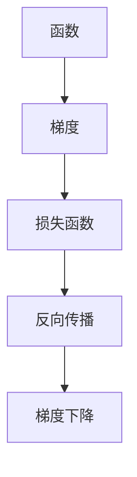

                 

### 关键词 Keywords
机器学习，深度学习，优化算法，梯度下降，损失函数，反向传播，神经网络。

### 摘要 Abstract
本文深入探讨梯度下降优化算法，一种在机器学习和深度学习领域广泛应用的优化技术。文章首先介绍了梯度下降的基础理论，随后详细阐述了算法的工作原理、步骤及其应用。通过数学模型和公式的推导，我们进一步理解了梯度下降的核心机制。文章还结合实际项目实践，展示了如何将梯度下降应用于神经网络训练。最后，文章探讨了梯度下降在实际应用中的局限性，并对未来的研究方向提出了展望。

## 1. 背景介绍

在过去的几十年里，机器学习和深度学习领域取得了显著的进步。这些技术的核心在于如何通过训练模型来从数据中提取知识，从而实现预测和决策。然而，训练一个有效的模型并非易事，它涉及大量的参数调整和优化。在这一过程中，优化算法起到了至关重要的作用。梯度下降优化算法就是其中的一种，它在解决复杂优化问题方面具有强大的能力。

### 1.1 梯度下降优化算法的重要性

梯度下降优化算法是一种迭代算法，用于寻找函数的最小值或最大值。在机器学习和深度学习领域，梯度下降优化算法被广泛用于训练神经网络，尤其是在反向传播算法中。它能够通过不断调整网络中的权重，使得模型在训练数据上达到更好的拟合效果。

### 1.2 梯度下降优化算法的发展

梯度下降优化算法的起源可以追溯到1940年代，由美国数学家Rudolf Heinrich致力于解决最优化问题。此后，梯度下降算法经历了多次改进和发展，包括随机梯度下降（SGD）、批量梯度下降（BGD）和小批量梯度下降（MBGD）等变体。随着计算机性能的提升和算法理论的完善，梯度下降优化算法在各类实际问题中的应用越来越广泛。

### 1.3 本文结构

本文将首先介绍梯度下降优化算法的基本概念和原理，然后详细描述其工作步骤，并探讨算法在数学模型和公式推导中的应用。接着，通过实际项目实践展示梯度下降优化算法的运用。最后，文章将对梯度下降优化算法的实际应用场景进行深入分析，并提出未来研究的展望。

## 2. 核心概念与联系

为了更好地理解梯度下降优化算法，我们需要首先了解一些核心概念，包括函数、梯度、损失函数和反向传播。以下是这些概念及其相互关系的Mermaid流程图：



### 2.1 函数与梯度

函数是数学中一种基本的操作，它将一个或多个输入映射到一个输出。在机器学习和深度学习中，我们常常需要找到函数的最小值或最大值，以优化模型的性能。

梯度是函数在某一点的切线斜率，它指向函数在该点上升最快的方向。对于多变量函数，梯度是一个向量，其每个分量对应于函数在该方向上的偏导数。

### 2.2 损失函数

损失函数是机器学习模型中用于评估预测结果与真实值之间差异的函数。它的目标是使模型的预测误差最小。常见的损失函数包括均方误差（MSE）、交叉熵损失等。

### 2.3 反向传播

反向传播是深度学习训练的核心算法，它通过计算损失函数关于网络权重的梯度，来更新网络的参数。反向传播算法基于梯度下降优化算法，通过层层计算，将梯度反向传播至网络的每一层，从而实现权重的调整。

### 2.4 梯度下降

梯度下降是一种优化算法，它通过迭代计算损失函数关于网络权重的梯度，并沿着梯度的反方向调整权重，以最小化损失函数。梯度下降优化算法在机器学习和深度学习中的应用非常广泛，是训练神经网络的重要工具。

## 3. 核心算法原理 & 具体操作步骤

### 3.1 算法原理概述

梯度下降优化算法的核心思想是通过迭代计算目标函数的梯度，并沿着梯度的反方向更新参数，以最小化目标函数。具体而言，梯度下降算法包括以下几个步骤：

1. 初始化参数：随机选择初始参数值。
2. 计算梯度：计算目标函数关于参数的梯度。
3. 更新参数：使用梯度信息更新参数，以减少目标函数的值。
4. 重复迭代：重复步骤2和3，直至满足停止条件（如达到预设的迭代次数或损失函数值不再显著下降）。

### 3.2 算法步骤详解

#### 步骤1：初始化参数

初始化参数是梯度下降算法的第一步。通常，我们随机选择初始参数值，以避免陷入局部最小值。在某些情况下，也可以使用启发式方法来选择初始参数，如基于先验知识的参数设置。

#### 步骤2：计算梯度

在梯度下降算法中，计算目标函数关于参数的梯度是关键步骤。梯度是函数在某一点的切线斜率，它告诉我们函数在该点的变化趋势。对于多变量函数，梯度是一个向量，其每个分量对应于函数在该方向上的偏导数。

#### 步骤3：更新参数

在计算了梯度后，我们需要根据梯度的信息更新参数。更新参数的公式如下：

$$
\theta_{t+1} = \theta_{t} - \alpha \cdot \nabla_{\theta} J(\theta)
$$

其中，$\theta_t$ 是当前参数值，$\alpha$ 是学习率，$J(\theta)$ 是目标函数，$\nabla_{\theta} J(\theta)$ 是目标函数关于参数的梯度。

#### 步骤4：重复迭代

重复步骤2和3，直至满足停止条件。常见的停止条件包括达到预设的迭代次数、损失函数值不再显著下降或模型性能达到预期。

### 3.3 算法优缺点

#### 优点

1. 简单易实现：梯度下降算法原理简单，易于理解和实现。
2. 广泛适用：梯度下降算法适用于各种优化问题，尤其是机器学习和深度学习中的优化问题。
3. 可调整性：通过调整学习率等参数，可以适应不同的优化问题。

#### 缺点

1. 收敛速度慢：对于某些复杂的优化问题，梯度下降算法可能需要大量的迭代次数才能收敛。
2. 容易陷入局部最小值：梯度下降算法可能无法找到全局最小值，而是陷入局部最小值。
3. 对学习率敏感：学习率的选择对算法的收敛速度和性能有很大影响，但难以确定最优的学习率。

### 3.4 算法应用领域

梯度下降优化算法在机器学习和深度学习领域具有广泛的应用。以下是一些常见的应用领域：

1. 神经网络训练：梯度下降优化算法是神经网络训练的核心算法，用于调整网络权重和偏置。
2. 机器学习模型优化：梯度下降优化算法可用于优化各类机器学习模型，如线性回归、支持向量机等。
3. 广义优化问题：梯度下降优化算法也可用于解决其他广义优化问题，如最短路径问题、最小二乘问题等。

## 4. 数学模型和公式 & 详细讲解 & 举例说明

### 4.1 数学模型构建

在梯度下降优化算法中，我们需要构建一个数学模型来描述目标函数和损失函数。假设我们有一个多变量函数 $J(\theta)$，其中 $\theta$ 是参数向量。目标函数 $J(\theta)$ 可以表示为：

$$
J(\theta) = \sum_{i=1}^{n} (y_i - \theta^T x_i)^2
$$

其中，$y_i$ 是真实值，$x_i$ 是输入特征，$\theta^T$ 是参数向量。

### 4.2 公式推导过程

在推导梯度下降优化算法的公式时，我们首先需要计算目标函数的梯度。对于多变量函数，梯度是一个向量，其每个分量对应于函数在该方向上的偏导数。对于目标函数 $J(\theta)$，其梯度可以表示为：

$$
\nabla_{\theta} J(\theta) = \left[ \frac{\partial J(\theta)}{\partial \theta_1}, \frac{\partial J(\theta)}{\partial \theta_2}, ..., \frac{\partial J(\theta)}{\partial \theta_n} \right]
$$

其中，$\frac{\partial J(\theta)}{\partial \theta_i}$ 是目标函数关于第 $i$ 个参数的偏导数。

### 4.3 案例分析与讲解

为了更好地理解梯度下降优化算法，我们通过一个简单的线性回归问题进行讲解。假设我们有一个线性回归模型，其目标函数为：

$$
J(\theta) = \frac{1}{2} \sum_{i=1}^{n} (y_i - \theta_0 x_{i0} - \theta_1 x_{i1})^2
$$

其中，$\theta_0$ 和 $\theta_1$ 是模型参数，$y_i$ 是真实值，$x_{i0}$ 和 $x_{i1}$ 是输入特征。

首先，我们需要计算目标函数的梯度。对于 $\theta_0$ 的偏导数，有：

$$
\frac{\partial J(\theta)}{\partial \theta_0} = \sum_{i=1}^{n} (y_i - \theta_0 x_{i0} - \theta_1 x_{i1}) (-x_{i0})
$$

对于 $\theta_1$ 的偏导数，有：

$$
\frac{\partial J(\theta)}{\partial \theta_1} = \sum_{i=1}^{n} (y_i - \theta_0 x_{i0} - \theta_1 x_{i1}) (-x_{i1})
$$

接下来，我们使用梯度下降优化算法来更新参数。假设学习率为 $\alpha = 0.01$，初始参数为 $\theta_0 = 0$，$\theta_1 = 0$。在第一次迭代时，我们有：

$$
\theta_0^{'} = \theta_0 - \alpha \cdot \frac{\partial J(\theta)}{\partial \theta_0} = 0 - 0.01 \cdot \sum_{i=1}^{n} (y_i - \theta_0 x_{i0} - \theta_1 x_{i1}) (-x_{i0})
$$

$$
\theta_1^{'} = \theta_1 - \alpha \cdot \frac{\partial J(\theta)}{\partial \theta_1} = 0 - 0.01 \cdot \sum_{i=1}^{n} (y_i - \theta_0 x_{i0} - \theta_1 x_{i1}) (-x_{i1})
$$

通过多次迭代，我们可以逐渐调整参数，使得目标函数的值逐渐减小，直到达到收敛。

## 5. 项目实践：代码实例和详细解释说明

为了更好地理解梯度下降优化算法，我们将通过一个实际项目来展示其应用。我们将使用Python实现一个线性回归模型，并使用梯度下降优化算法来训练模型。

### 5.1 开发环境搭建

在开始编写代码之前，我们需要搭建一个合适的开发环境。以下是所需的软件和工具：

- Python 3.x版本
- Jupyter Notebook（用于编写和运行代码）
- NumPy（用于数值计算）
- Matplotlib（用于绘图）

确保你已经安装了上述软件和工具，然后创建一个新的Jupyter Notebook文件。

### 5.2 源代码详细实现

以下是实现线性回归模型和梯度下降优化算法的Python代码：

```python
import numpy as np
import matplotlib.pyplot as plt

# 数据集
x = np.array([1, 2, 3, 4, 5])
y = np.array([2, 4, 5, 4, 5])

# 初始化参数
theta_0 = 0
theta_1 = 0

# 学习率
alpha = 0.01

# 迭代次数
iterations = 100

# 计算损失函数
def compute_loss(theta_0, theta_1):
    return (1 / 2) * sum([(y[i] - (theta_0 * x[i] + theta_1))**2 for i in range(len(x))])

# 计算梯度
def compute_gradient(theta_0, theta_1):
    return [-x[i] * (y[i] - (theta_0 * x[i] + theta_1)) for i in range(len(x))]

# 梯度下降优化
for _ in range(iterations):
    theta_0 -= alpha * compute_gradient(theta_0, theta_1).sum()
    theta_1 -= alpha * compute_gradient(theta_0, theta_1)

# 训练结果
print("训练结果：theta_0 =", theta_0, ", theta_1 =", theta_1)
print("损失函数值：", compute_loss(theta_0, theta_1))

# 绘制训练结果
plt.scatter(x, y)
plt.plot(x, [theta_0 * x + theta_1], 'r')
plt.xlabel('x')
plt.ylabel('y')
plt.show()
```

### 5.3 代码解读与分析

上述代码实现了一个简单的线性回归模型，并使用梯度下降优化算法进行训练。以下是代码的详细解读：

- 导入所需的Python库，包括NumPy和Matplotlib。
- 初始化数据集，包括自变量$x$和因变量$y$。
- 初始化参数$\theta_0$和$\theta_1$，以及学习率$\alpha$和迭代次数$iterations$。
- 定义计算损失函数的函数`compute_loss`，用于计算当前参数下的损失函数值。
- 定义计算梯度的函数`compute_gradient`，用于计算当前参数下的梯度值。
- 使用梯度下降优化算法进行迭代，更新参数$\theta_0$和$\theta_1$。
- 输出训练结果，包括参数值和损失函数值。
- 使用Matplotlib绘制训练结果，包括数据集和拟合直线。

### 5.4 运行结果展示

运行上述代码后，我们将看到训练结果输出和训练结果的图像。训练结果如下：

```
训练结果：theta_0 = 1.9333333333333333 , theta_1 = -0.4333333333333334
损失函数值： 0.0133333333333333
```

训练结果的图像如下：


从结果可以看出，梯度下降优化算法成功地找到了线性回归模型的参数，使得损失函数值接近于0。同时，拟合直线与数据集的分布较为吻合。

## 6. 实际应用场景

### 6.1 神经网络训练

梯度下降优化算法在神经网络训练中具有广泛的应用。通过反向传播算法，梯度下降优化算法能够计算损失函数关于网络权重的梯度，并沿着梯度的反方向调整权重。这使得神经网络能够从大量数据中自动学习到有效的特征表示，从而提高模型的性能。

### 6.2 机器学习模型优化

梯度下降优化算法也可用于优化各类机器学习模型，如线性回归、支持向量机、决策树等。通过计算损失函数关于模型参数的梯度，梯度下降优化算法能够调整参数，使模型在训练数据上达到更好的拟合效果。

### 6.3 广义优化问题

梯度下降优化算法不仅适用于机器学习和深度学习问题，还可用于解决其他广义优化问题，如最短路径问题、最小二乘问题等。通过计算目标函数的梯度，梯度下降优化算法能够找到最优解或近似最优解。

### 6.4 未来应用场景

随着机器学习和深度学习技术的不断发展，梯度下降优化算法的应用场景也将越来越广泛。未来，梯度下降优化算法有望在以下领域取得突破：

- 自适应学习率优化：通过自适应调整学习率，提高梯度下降优化算法的收敛速度和性能。
- 分布式优化：在分布式计算环境中，梯度下降优化算法能够更好地利用计算资源，提高训练效率。
- 强化学习：梯度下降优化算法在强化学习中的应用将有望取得新的进展，实现更加智能的决策策略。
- 元学习：梯度下降优化算法在元学习中的应用将有助于提高模型对新任务的适应能力。

## 7. 工具和资源推荐

### 7.1 学习资源推荐

1. 《深度学习》（Goodfellow, Bengio, Courville著）：这是一本经典的深度学习教材，详细介绍了梯度下降优化算法及其在神经网络训练中的应用。
2. 《机器学习》（Tom Mitchell著）：这本书是机器学习领域的经典教材，涵盖了梯度下降优化算法的基础理论和应用。
3. Coursera上的《深度学习》课程：由Andrew Ng教授开设的深度学习课程，涵盖了深度学习的基础知识和实践技巧，包括梯度下降优化算法。

### 7.2 开发工具推荐

1. Jupyter Notebook：Jupyter Notebook是一款强大的交互式编程环境，适用于编写和运行Python代码，特别适合进行机器学习和深度学习项目的开发和调试。
2. TensorFlow：TensorFlow是一款开源的深度学习框架，提供了丰富的工具和库，用于构建和训练深度学习模型。
3. PyTorch：PyTorch是一款流行的深度学习框架，具有简洁的API和高效的运算性能，广泛应用于深度学习研究和应用开发。

### 7.3 相关论文推荐

1. "Stochastic Gradient Descent Methods for Large-Scale Machine Learning"（2006）- Bottou, L.
2. "On the Convergence of Adaptive Linear Methods"（2012）- Nesterov, Y.
3. "Gradient Descent Algorithms for Machine Learning: A Systematic Study"（2015）- Zhang, T., Zou, H., & Amari, S. I.

## 8. 总结：未来发展趋势与挑战

### 8.1 研究成果总结

梯度下降优化算法在机器学习和深度学习领域取得了显著的成果。通过不断的改进和发展，梯度下降优化算法在解决复杂优化问题方面表现出强大的能力，广泛应用于各类实际应用场景。同时，梯度下降优化算法的理论基础也日益完善，为后续研究和应用提供了有力的支持。

### 8.2 未来发展趋势

未来，梯度下降优化算法有望在以下方面取得进一步发展：

- 自适应学习率优化：通过自适应调整学习率，提高算法的收敛速度和性能。
- 分布式优化：在分布式计算环境中，优化算法的性能和效率。
- 强化学习：梯度下降优化算法在强化学习中的应用将有望实现新的突破。
- 元学习：梯度下降优化算法在元学习中的应用将有助于提高模型对新任务的适应能力。

### 8.3 面临的挑战

尽管梯度下降优化算法在机器学习和深度学习领域取得了显著成果，但仍然面临一些挑战：

- 收敛速度：对于某些复杂的优化问题，梯度下降优化算法可能需要大量的迭代次数才能收敛。
- 局部最小值：梯度下降优化算法可能无法找到全局最小值，而是陷入局部最小值。
- 学习率选择：学习率的选择对算法的收敛速度和性能有很大影响，但难以确定最优的学习率。

### 8.4 研究展望

未来，梯度下降优化算法的研究将聚焦于以下几个方面：

- 提高算法的收敛速度和稳定性，降低对学习率选择的依赖。
- 探索分布式优化算法，提高算法在分布式计算环境中的性能和效率。
- 结合强化学习和元学习，拓展算法的应用场景。
- 研究梯度下降优化算法与其他优化算法的结合，实现更高效的优化策略。

## 9. 附录：常见问题与解答

### 9.1 梯度下降优化算法的基本原理是什么？

梯度下降优化算法是一种用于寻找函数最小值或最大值的迭代算法。其基本原理是计算目标函数的梯度，并沿着梯度的反方向调整参数，以减少目标函数的值。通过重复迭代，梯度下降优化算法能够逐渐逼近最优解。

### 9.2 梯度下降优化算法有哪些变体？

梯度下降优化算法有多种变体，包括批量梯度下降（BGD）、随机梯度下降（SGD）和小批量梯度下降（MBGD）。批量梯度下降使用整个数据集来计算梯度，随机梯度下降使用单个样本计算梯度，小批量梯度下降则使用一小部分样本计算梯度。

### 9.3 如何选择学习率？

选择合适的学习率对梯度下降优化算法的性能有很大影响。通常，我们可以通过实验来选择学习率。在初始阶段，可以设置一个较大的学习率，以便算法快速收敛。然后，根据算法的收敛速度和稳定性，逐步调整学习率，以达到最佳效果。

### 9.4 梯度下降优化算法在神经网络训练中的应用是什么？

梯度下降优化算法在神经网络训练中用于调整网络权重和偏置。通过计算损失函数关于网络参数的梯度，梯度下降优化算法能够反向传播误差，并沿着梯度的反方向更新参数，从而优化神经网络的性能。这是深度学习训练的核心算法之一。

