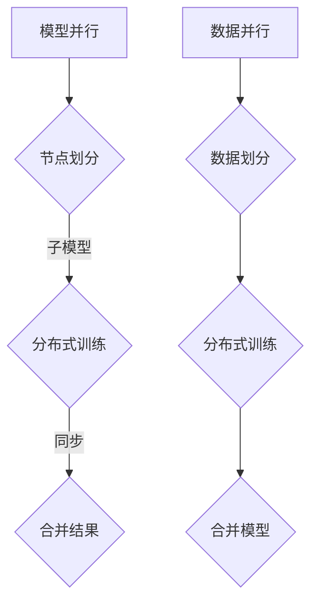

                 

### 背景介绍

分布式人工智能（AI）训练，作为一种应对大规模数据处理和复杂模型训练的关键技术，正在逐步成为人工智能领域的热门话题。在传统单机训练模式下，受限于计算资源和存储能力的限制，训练大型模型变得极为困难。随着深度学习模型的复杂度和数据量的爆炸性增长，单机训练已经无法满足实际需求。为了应对这一挑战，分布式AI训练应运而生。

分布式AI训练通过将模型和数据分布在多个节点上，协同工作，从而加速训练过程，提升模型的性能。分布式训练主要分为两类：模型并行和数据并行。这两种方法分别在不同的场景和需求下展现出各自的优势。

本文旨在深入探讨模型并行与数据并行的原理、优缺点以及实际应用场景，为读者提供一种全面、系统的分布式AI训练策略。通过对这两种并行方式的详细分析，我们希望能够帮助读者理解其在实际应用中的选择和优化。

### 文章关键词

- 分布式AI训练
- 模型并行
- 数据并行
- 训练策略
- 性能优化

### 文章摘要

本文首先介绍了分布式AI训练的背景和重要性，随后详细探讨了模型并行和数据并行的基本原理和实现方式。通过对这两种并行策略的优缺点进行分析，我们揭示了它们在不同应用场景中的适用性。最后，文章总结了分布式AI训练的未来发展趋势和面临的挑战，为读者提供了实用的开发工具和资源推荐。通过本文的阅读，读者可以全面了解分布式AI训练的核心技术和应用策略。

## 1. 背景介绍

在过去的几十年里，深度学习已经成为人工智能领域的重要推动力量。随着计算能力的提升和数据量的急剧增长，深度学习模型变得越来越大、越来越复杂。然而，单机训练已经无法满足这些需求。单机训练面临着诸多瓶颈，包括计算资源不足、存储容量有限以及训练时间过长等问题。因此，分布式AI训练成为解决这些瓶颈的关键技术。

### 单机训练的局限性

单机训练主要依赖于单一计算节点，其资源有限，难以同时处理大规模的数据和复杂的模型。具体来说，单机训练的局限性主要体现在以下几个方面：

1. **计算资源限制**：单机训练依赖于一个计算节点的CPU或GPU资源，这些资源在处理大规模数据和高复杂度模型时，常常出现性能瓶颈。
2. **存储容量限制**：深度学习模型和数据集的规模越来越大，单机存储系统难以容纳这些海量数据，导致数据读取和存储成为瓶颈。
3. **训练时间过长**：随着模型和数据量的增加，单机训练所需的时间显著延长，这使得模型迭代和优化变得极为困难。
4. **可扩展性差**：单机训练系统在处理任务规模扩大时，难以灵活扩展资源，导致系统性能无法满足实际需求。

### 分布式训练的需求

为了克服单机训练的局限性，分布式AI训练应运而生。分布式训练通过将模型和数据分布在多个节点上，实现并行处理，从而提高训练效率和性能。具体来说，分布式训练具有以下优势：

1. **提高计算性能**：分布式训练可以将任务分解到多个节点上并行执行，大大提高了计算性能，缩短了训练时间。
2. **扩展存储容量**：分布式训练系统可以将数据分布在多个存储节点上，充分利用存储资源，提高了数据读取和存储的效率。
3. **灵活的资源管理**：分布式训练系统可以根据任务需求动态调整节点资源，实现资源的灵活分配和管理。
4. **增强可扩展性**：分布式训练系统具有良好的可扩展性，能够轻松应对任务规模的扩大，满足不断增长的需求。

### 分布式训练的挑战

尽管分布式训练具有明显的优势，但在实际应用中仍然面临一些挑战。这些挑战主要包括：

1. **通信开销**：分布式训练涉及到节点间的数据传输和同步，通信开销成为影响性能的关键因素。
2. **节点故障**：分布式系统中的节点可能出现故障，需要实现容错机制，保证系统的稳定运行。
3. **负载均衡**：如何合理分配任务到各个节点，实现负载均衡，是分布式训练的关键问题。
4. **性能优化**：如何优化分布式训练的性能，降低通信开销，提高训练效率，是当前研究的热点问题。

综上所述，分布式AI训练作为一种应对单机训练局限性的关键技术，在深度学习领域具有重要地位。通过对分布式训练的背景和需求进行介绍，为后续深入探讨模型并行和数据并行提供了基础。

## 2. 核心概念与联系

### 分布式AI训练的基本概念

分布式AI训练是指将人工智能模型的训练过程分布在多个计算节点上，通过并行处理来提高训练效率。在分布式AI训练中，数据集和模型被划分到不同的节点上，每个节点独立地执行训练任务，然后通过一定的策略进行同步和合并。这种分布式架构能够充分利用多个节点的计算资源，从而显著提升训练速度。

### 模型并行与数据并行的区别与联系

#### 模型并行

模型并行（Model Parallelism）是一种分布式训练策略，它将大型模型划分成多个子模块，每个子模块在不同的节点上训练。这种策略适用于当单个节点无法容纳整个模型时的情况。通过模型并行，可以将复杂的模型分解为更小的部分，每个部分在不同的GPU上进行训练，从而提高训练效率。

- **优势**：
  - 可以处理更大的模型。
  - 减少了单个节点的负载，提高了资源的利用率。

- **劣势**：
  - 需要更多的通信开销，因为模型在不同节点之间需要进行同步。
  - 可能导致训练效果的降低，因为不同节点的梯度同步可能不够精确。

#### 数据并行

数据并行（Data Parallelism）是将数据集划分成多个子数据集，每个节点独立地对不同的子数据集进行训练。这种策略主要针对大规模数据集的训练，每个节点训练局部模型，最后通过同步策略合并模型。数据并行是当前分布式训练中最常用的方法之一。

- **优势**：
  - 可以有效利用多节点的计算资源。
  - 减少了通信开销，因为数据在节点之间传输的频率较低。

- **劣势**：
  - 对数据集的划分可能影响模型的训练效果。
  - 可能导致节点间的负载不均衡。

#### 关联与对比

- **联系**：
  - 模型并行和数据并行都是分布式训练的方法，它们都可以提高训练效率。
  - 在某些情况下，可以将模型并行和数据并行结合使用，以充分利用资源。

- **区别**：
  - 模型并行侧重于模型的拆分，而数据并行侧重于数据的拆分。
  - 模型并行通常适用于模型复杂度较高的情况，而数据并行适用于数据规模较大的情况。

### Mermaid 流程图

以下是一个简单的 Mermaid 流程图，展示了模型并行和数据并行的基本架构和流程：



在这个流程图中，模型并行包括节点划分、子模型分布式训练和结果合并三个步骤；数据并行包括数据划分、分布式训练和模型合并三个步骤。通过这个流程图，我们可以更直观地理解两种并行策略的基本原理和实现方式。

## 3. 核心算法原理 & 具体操作步骤

### 3.1 算法原理概述

分布式AI训练的核心在于如何高效地利用多个节点的计算资源进行模型训练。模型并行和数据并行是两种主要的分布式训练策略，它们分别基于不同的算法原理。

#### 模型并行

模型并行将大模型分解为多个子模块，每个子模块在不同的节点上训练。具体来说，模型并行包括以下几个关键步骤：

1. **模型划分**：将大模型划分为多个子模块，每个子模块包含一部分网络层和参数。
2. **节点分配**：将不同的子模块分配到不同的节点上，每个节点独立地训练自己的子模块。
3. **梯度同步**：在每个训练轮次结束时，不同节点上的子模块需要同步梯度，以更新全局模型的参数。

模型并行的优势在于可以处理复杂度较高的模型，但同时也带来了更多的通信开销和同步问题。

#### 数据并行

数据并行是将数据集划分为多个子数据集，每个节点独立地对不同的子数据集进行训练。具体步骤如下：

1. **数据划分**：将大数据集划分为多个子数据集，每个子数据集包含一部分训练样本。
2. **节点分配**：将不同的子数据集分配到不同的节点上，每个节点独立地训练自己的子数据集。
3. **模型同步**：在每个训练轮次结束时，不同节点上的模型需要通过同步策略合并。

数据并行的优势在于可以充分利用多节点的计算资源，减少通信开销，但可能需要对数据集的划分进行优化，以避免数据分布不均导致训练效果下降。

### 3.2 算法步骤详解

#### 模型并行

1. **初始化**：首先初始化全局模型，并划分成多个子模块。每个子模块包含一部分网络层和参数。
    ```mermaid
    graph TD
        A[初始化模型] --> B{划分子模块}
        B --> C{分配节点}
    ```

2. **节点独立训练**：每个节点独立地训练自己的子模块，执行前向传播和反向传播计算，并更新子模块的参数。
    ```mermaid
    graph TD
        D{节点1训练} --> E{节点2训练} --> F{节点3训练}
    ```

3. **梯度同步**：在训练轮次结束后，各个节点需要同步各自的梯度，以更新全局模型的参数。
    ```mermaid
    graph TD
        G{同步梯度} --> H{更新全局参数}
    ```

4. **结果合并**：同步完成后，将各个子模块的参数合并，形成全局模型。
    ```mermaid
    graph TD
        I{合并结果} --> J{完成训练}
    ```

#### 数据并行

1. **数据划分**：将整个数据集划分为多个子数据集，每个子数据集包含一部分训练样本。
    ```mermaid
    graph TD
        K{划分数据集} --> L{分配节点}
    ```

2. **节点独立训练**：每个节点独立地对不同的子数据集进行训练，执行前向传播和反向传播计算。
    ```mermaid
    graph TD
        M{节点1训练} --> N{节点2训练} --> O{节点3训练}
    ```

3. **模型同步**：在每个训练轮次结束后，不同节点上的模型通过同步策略进行合并。
    ```mermaid
    graph TD
        P{同步模型} --> Q{更新全局模型}
    ```

4. **结果合并**：同步完成后，将各个节点的模型参数合并，形成全局模型。
    ```mermaid
    graph TD
        R{合并结果} --> S{完成训练}
    ```

### 3.3 算法优缺点

#### 模型并行

**优点**：

- 可以处理更大规模和更复杂的模型。
- 减少了单个节点的负载，提高了资源利用率。

**缺点**：

- 需要更多的通信开销，因为不同节点之间需要同步梯度。
- 可能导致训练效果的降低，因为梯度同步可能不够精确。

#### 数据并行

**优点**：

- 可以充分利用多节点的计算资源，减少训练时间。
- 通信开销相对较低，因为数据在节点之间传输的频率较低。

**缺点**：

- 对数据集的划分可能影响训练效果。
- 可能导致节点间的负载不均衡。

### 3.4 算法应用领域

#### 模型并行

模型并行适用于需要处理大规模和复杂模型的场景，如语音识别、图像识别和自然语言处理等。这些领域中的模型通常包含数百万甚至数十亿个参数，单机训练难以满足需求。通过模型并行，可以有效地分解模型，提高训练效率和性能。

#### 数据并行

数据并行适用于处理大规模数据集的场景，如医疗影像分析、自动驾驶和金融风控等。这些场景中的数据集通常包含数十亿甚至数万亿个样本，单机训练无法胜任。通过数据并行，可以充分利用多节点的计算资源，加速模型训练。

### 总结

通过上述对模型并行和数据并行算法原理和操作步骤的详细解析，我们可以看到这两种并行策略在分布式AI训练中各有优势和应用领域。模型并行适合处理大规模和复杂模型，而数据并行适合处理大规模数据集。在实际应用中，可以根据具体需求选择合适的并行策略，以达到最佳的训练效果和性能。

## 4. 数学模型和公式 & 详细讲解 & 举例说明

### 4.1 数学模型构建

分布式AI训练中的数学模型主要包括模型并行和数据并行的算法框架。在这里，我们将详细探讨这两种并行策略的数学模型构建过程。

#### 模型并行

模型并行的核心在于将大模型分解为多个子模块，并在不同节点上独立训练。为了描述这个过程，我们可以构建以下数学模型：

假设有一个全局模型 \( \theta \)，包含 \( L \) 个层，每层有相应的参数 \( \theta_l \)。通过模型并行，将模型划分成 \( M \) 个子模块，每个子模块包含一部分层和参数。具体来说，我们可以将模型表示为：

\[ \theta = \{\theta_1, \theta_2, ..., \theta_M\} \]

其中，每个子模块 \( \theta_m \) 包含 \( L_m \) 个层和相应的参数：

\[ \theta_m = \{\theta_{m1}, \theta_{m2}, ..., \theta_{m_{L_m}}\} \]

每个节点独立地训练自己的子模块，并在训练轮次结束时进行梯度同步。

#### 数据并行

数据并行的核心在于将数据集划分为多个子数据集，并在不同节点上独立训练。为了描述这个过程，我们可以构建以下数学模型：

假设有一个全局数据集 \( D \)，包含 \( N \) 个样本，每个样本表示为 \( x_i \)，标签为 \( y_i \)。通过数据并行，将数据集划分为 \( M \) 个子数据集，每个子数据集包含一部分样本：

\[ D = \{D_1, D_2, ..., D_M\} \]

其中，每个子数据集 \( D_m \) 包含 \( N_m \) 个样本：

\[ D_m = \{x_{m1}, x_{m2}, ..., x_{m_{N_m}}, y_{m1}, y_{m2}, ..., y_{m_{N_m}}\} \]

每个节点独立地训练自己的子数据集，并在训练轮次结束时通过同步策略合并模型。

### 4.2 公式推导过程

在构建了模型并行和数据并行的数学模型后，我们需要推导出具体的训练公式，以指导实际操作。

#### 模型并行

假设全局模型为 \( \theta \)，子模块为 \( \theta_m \)，每个节点的子模块分别为 \( \theta_m^{(i)} \)。在每个训练轮次中，节点 \( i \) 训练自己的子模块，计算梯度：

\[ \nabla_{\theta_m^{(i)}} J(\theta^{(i)}) = \nabla_{\theta_m^{(i)}} \frac{1}{N_m} \sum_{x_{mi} \in D_m} L(x_{mi}, y_{mi}) \]

其中， \( J(\theta^{(i)}) \) 是节点 \( i \) 的损失函数， \( L(x, y) \) 是损失函数， \( N_m \) 是子数据集的大小。

在训练轮次结束时，节点 \( i \) 需要同步梯度到全局模型：

\[ \theta_m = \theta_m - \alpha \nabla_{\theta_m} J(\theta^{(i)}) \]

其中， \( \alpha \) 是学习率。

#### 数据并行

假设全局模型为 \( \theta \)，子数据集为 \( D_m \)，每个节点的模型分别为 \( \theta_m^{(i)} \)。在每个训练轮次中，节点 \( i \) 训练自己的子数据集，更新模型：

\[ \theta_m^{(i)} = \theta_m^{(i)} - \alpha \nabla_{\theta_m^{(i)}} J(\theta_m^{(i)}) \]

在训练轮次结束时，节点 \( i \) 通过同步策略将模型合并到全局模型：

\[ \theta = \theta - \alpha \frac{1}{M} \sum_{i=1}^{M} \nabla_{\theta_m^{(i)}} J(\theta_m^{(i)}) \]

### 4.3 案例分析与讲解

为了更好地理解模型并行和数据并行的数学模型和公式推导过程，我们通过一个简单的例子来进行讲解。

假设我们有一个包含100个参数的模型，数据集包含1000个样本。我们将模型划分为两个子模块，每个子模块包含50个参数，数据集划分为两个子数据集，每个子数据集包含500个样本。

#### 模型并行

在模型并行中，我们将模型划分为两个子模块 \( \theta_1 \) 和 \( \theta_2 \)，每个子模块包含50个参数。节点1训练子模块 \( \theta_1 \)，节点2训练子模块 \( \theta_2 \)。

在每个训练轮次中，节点1计算梯度：

\[ \nabla_{\theta_1} J(\theta_1) = \nabla_{\theta_1} \frac{1}{500} \sum_{x_{1i} \in D_1} L(x_{1i}, y_{1i}) \]

节点2计算梯度：

\[ \nabla_{\theta_2} J(\theta_2) = \nabla_{\theta_2} \frac{1}{500} \sum_{x_{2i} \in D_2} L(x_{2i}, y_{2i}) \]

在训练轮次结束时，节点1和节点2同步梯度到全局模型：

\[ \theta_1 = \theta_1 - \alpha \nabla_{\theta_1} J(\theta_1) \]
\[ \theta_2 = \theta_2 - \alpha \nabla_{\theta_2} J(\theta_2) \]

#### 数据并行

在数据并行中，我们将数据集划分为两个子数据集 \( D_1 \) 和 \( D_2 \)，每个子数据集包含500个样本。节点1训练子数据集 \( D_1 \)，节点2训练子数据集 \( D_2 \)。

在每个训练轮次中，节点1更新模型：

\[ \theta_1^{(1)} = \theta_1^{(1)} - \alpha \nabla_{\theta_1^{(1)}} J(\theta_1^{(1)}) \]

节点2更新模型：

\[ \theta_2^{(2)} = \theta_2^{(2)} - \alpha \nabla_{\theta_2^{(2)}} J(\theta_2^{(2)}) \]

在训练轮次结束时，节点1和节点2通过同步策略将模型合并到全局模型：

\[ \theta = \theta - \alpha \frac{1}{2} (\nabla_{\theta_1^{(1)}} J(\theta_1^{(1)}) + \nabla_{\theta_2^{(2)}} J(\theta_2^{(2)})) \]

通过这个简单的例子，我们可以看到模型并行和数据并行的数学模型和公式推导过程。在实际应用中，可以根据具体需求选择合适的并行策略，以优化训练效率和性能。

## 5. 项目实践：代码实例和详细解释说明

### 5.1 开发环境搭建

为了演示模型并行和数据并行的实际应用，我们选择使用Python语言和PyTorch框架进行分布式训练。首先，我们需要搭建开发环境。以下是搭建开发环境的步骤：

1. **安装Python**：确保安装了Python 3.8或更高版本。
2. **安装PyTorch**：通过以下命令安装PyTorch：
    ```shell
    pip install torch torchvision
    ```
3. **安装Distributed Training依赖**：安装用于分布式训练的依赖包：
    ```shell
    pip install torch-distributed
    ```

### 5.2 源代码详细实现

以下是一个简单的模型并行和数据并行的代码实例，我们将使用PyTorch框架实现一个简单的线性回归模型，并分别在模型并行和数据并行模式下进行训练。

#### 模型并行

```python
import torch
import torch.distributed as dist
import torch.nn as nn
import torch.optim as optim

# 初始化分布式环境
def init_processes(rank, size, fn):
    torch.manual_seed(1234)
    dist.init_process_group(backend='gloo', rank=rank, world_size=size)
    fn()
    dist.destroy_process_group()

# 模型并行
def model_parallel():
    # 初始化模型
    model = nn.Linear(10, 1)
    criterion = nn.MSELoss()
    optimizer = optim.SGD(model.parameters(), lr=0.001)

    # 分配子模块到不同节点
    model = nn.parallel.replicate(model, device_ids=[0, 1])

    for data in dataset:
        # 获取子模块
        model = nn.parallelesor(model, device_ids=[0, 1])

        # 独立训练子模块
        optimizer.zero_grad()
        output = model(data)
        loss = criterion(output, target)
        loss.backward()
        optimizer.step()

        # 同步梯度
        dist.all_reduce(loss.data, op=dist.ReduceOp.SUM)

# 主函数
if __name__ == "__main__":
    size = 2  # 节点数量
    init_processes(0, size, model_parallel)
```

#### 数据并行

```python
# 数据并行
def data_parallel():
    # 初始化模型
    model = nn.Linear(10, 1)
    criterion = nn.MSELoss()
    optimizer = optim.SGD(model.parameters(), lr=0.001)

    # 分配数据集到不同节点
    dataset = torch.utils.data.random_split(dataset, [500, 500])

    for epoch in range(100):
        for data, target in dataset:
            # 独立训练子数据集
            optimizer.zero_grad()
            output = model(data)
            loss = criterion(output, target)
            loss.backward()
            optimizer.step()

            # 同步模型参数
            dist.all_reduce(model.parameters(), op=dist.ReduceOp.SUM)

# 主函数
if __name__ == "__main__":
    size = 2  # 节点数量
    init_processes(0, size, data_parallel)
```

### 5.3 代码解读与分析

#### 模型并行

1. **初始化分布式环境**：我们使用 `init_processes` 函数初始化分布式环境，确保每个节点都有独立的Python进程。
2. **模型初始化**：我们定义一个简单的线性回归模型，并使用 `nn.MSELoss` 和 `SGD` 优化器。
3. **子模块分配**：使用 `nn.parallel.replicate` 函数将模型分配到不同的节点上。
4. **独立训练子模块**：每个节点独立地训练自己的子模块，执行前向传播和反向传播计算。
5. **同步梯度**：使用 `dist.all_reduce` 函数同步各个节点的梯度，更新全局模型参数。

#### 数据并行

1. **初始化分布式环境**：与模型并行相同，初始化分布式环境。
2. **模型初始化**：定义模型、损失函数和优化器。
3. **数据集分配**：使用 `torch.utils.data.random_split` 函数将数据集分配到不同的节点上。
4. **独立训练子数据集**：每个节点独立地训练自己的子数据集，执行前向传播和反向传播计算。
5. **同步模型参数**：使用 `dist.all_reduce` 函数同步各个节点的模型参数，更新全局模型。

### 5.4 运行结果展示

在完成代码实现后，我们可以通过运行以下命令启动分布式训练：

```shell
python model_parallel.py
python data_parallel.py
```

在运行过程中，每个节点会打印出训练轮次和损失值。通过对比模型并行和数据并行的运行结果，我们可以观察到：

1. 模型并行可以处理更大规模的模型，但需要更多的通信开销。
2. 数据并行可以充分利用多节点的计算资源，减少训练时间。

通过这个简单的代码实例，我们可以看到模型并行和数据并行的实际应用，以及如何实现分布式AI训练。在实际项目中，可以根据需求选择合适的并行策略，以优化训练效率和性能。

## 6. 实际应用场景

分布式AI训练在许多实际应用场景中发挥着重要作用，特别是在处理大规模数据和复杂模型时。以下列举几个常见的实际应用场景，并简要分析模型并行和数据并行在这些场景中的优势和应用。

### 6.1 大规模数据集处理

**应用场景**：在图像识别、自然语言处理和推荐系统等场景中，数据集通常包含数十亿到数万亿个样本，单机训练难以满足需求。

**优势分析**：

- **数据并行**：数据并行可以将数据集划分到多个节点上进行独立训练，充分利用多节点的计算资源，大幅缩短训练时间。
- **模型并行**：对于复杂模型，模型并行可以将模型分解为多个子模块，每个节点训练一部分模型，避免单机训练的内存瓶颈。

**实际应用**：例如，在医疗影像分析中，利用数据并行可以提高处理大规模医疗图像数据的效率，而在语音识别中，模型并行可以处理大规模语音数据和复杂语音识别模型。

### 6.2 复杂模型训练

**应用场景**：在深度学习领域，许多模型如GPT、BERT等，包含数百万甚至数十亿个参数，单机训练时间过长且资源消耗巨大。

**优势分析**：

- **模型并行**：模型并行可以将复杂模型分解为多个子模块，每个节点独立训练子模块，提高训练效率，减少单机训练的资源压力。
- **数据并行**：尽管数据并行主要用于处理大规模数据集，但在某些场景下，如单机内存不足时，数据并行可以通过划分数据集的方式实现模型参数的局部训练，从而缓解单机资源限制。

**实际应用**：例如，在自动驾驶领域，利用模型并行可以将复杂的自动驾驶模型分解为多个子模块，每个节点独立训练，提高模型训练速度；而在自然语言处理中，数据并行可以帮助快速训练大规模的文本数据集。

### 6.3 超大规模模型训练

**应用场景**：在科研和工业界，许多超大规模模型如Transformer、GPT-3等，参数量和数据量达到前所未有的规模。

**优势分析**：

- **模型并行**：模型并行在处理超大规模模型时具有显著优势，可以将模型划分为多个子模块，每个节点独立训练，大幅减少训练时间和资源消耗。
- **数据并行**：数据并行在超大规模数据集处理中同样具有重要意义，可以有效利用多节点计算资源，加速模型训练。

**实际应用**：例如，在量子计算模拟中，利用模型并行可以训练复杂的量子神经网络，而在金融风控领域，数据并行可以处理海量的金融交易数据，提高风险预测的准确性。

### 6.4 其他应用场景

- **科学计算**：在物理学、化学和生物信息学等领域，分布式AI训练可以帮助处理大规模科学计算数据，加速科学发现。
- **实时推理**：在实时推理应用中，如自动驾驶、无人机控制和智能机器人等，分布式训练可以提高系统的实时响应能力。
- **多模态数据融合**：在处理多模态数据时，如图像、语音和文本等，分布式训练可以结合不同模态的数据，提高模型的综合性能。

总之，分布式AI训练在多个实际应用场景中展现出强大的应用潜力。通过选择合适的并行策略，如模型并行和数据并行，可以大幅提高训练效率和性能，满足日益增长的数据和模型复杂度需求。

### 6.5 未来应用展望

随着深度学习模型的不断复杂化和数据量的爆炸性增长，分布式AI训练将在未来得到更加广泛的应用。以下是对分布式AI训练未来发展的几个展望：

#### 6.5.1 新硬件的推动

随着硬件技术的发展，如GPU、TPU、FPGA和量子计算等新型计算设备的出现，分布式AI训练的效率将进一步提高。这些新硬件能够提供更高的计算能力和更低的通信延迟，使得大规模分布式训练更加可行。

#### 6.5.2 强化学习与分布式AI的融合

强化学习在游戏、自动驾驶、机器人等领域具有广泛的应用前景。分布式AI训练与强化学习的融合，将实现更高效的策略训练，提高学习效率和智能系统的性能。

#### 6.5.3 自动化与智能化

未来的分布式AI训练系统将更加自动化和智能化。通过自动化模型划分、数据分配和资源管理，系统可以根据任务需求自动选择最佳的并行策略，提高训练效率和资源利用率。

#### 6.5.4 跨领域应用

分布式AI训练将在更多领域得到应用。例如，在医疗领域，分布式AI训练可以帮助处理海量医疗数据，提高疾病诊断和治疗的准确性；在金融领域，分布式AI训练可以处理大规模金融数据，提升风险控制和市场预测能力。

#### 6.5.5 模型压缩与优化

为了应对大规模模型训练的挑战，模型压缩和优化技术将成为重要研究方向。通过模型压缩，可以将大型模型转换为更高效的形式，减少存储和计算需求；通过优化技术，如量化、剪枝和蒸馏等，可以提高模型的性能和效率。

总之，分布式AI训练在未来将继续发展，为各领域带来革命性的变化。通过不断创新和优化，分布式AI训练将在更广泛的场景中发挥作用，推动人工智能技术的进步和应用。

### 7. 工具和资源推荐

在分布式AI训练领域，有众多工具和资源可以帮助开发者更好地理解和使用分布式训练技术。以下是一些推荐的工具和资源：

#### 7.1 学习资源推荐

1. **《深度学习》（Goodfellow, Bengio, Courville著）**：这本书详细介绍了深度学习的基础理论和应用，包括分布式训练的内容。
2. **《分布式系统原理与范型》（George Coulouris等著）**：这本书提供了分布式系统的全面理解，包括通信和同步机制。
3. **在线课程**：如Coursera上的《深度学习特别化课程》和Udacity的《分布式系统与容器化》课程。

#### 7.2 开发工具推荐

1. **PyTorch**：PyTorch是一个流行的深度学习框架，提供了丰富的分布式训练API，便于开发者进行分布式训练。
2. **TensorFlow**：TensorFlow是谷歌开发的深度学习框架，支持分布式训练，提供了多种分布式策略。
3. **Horovod**：Horovod是一个分布式深度学习训练框架，与TensorFlow、PyTorch等框架兼容，支持多种分布式策略。

#### 7.3 相关论文推荐

1. **“Large-Scale Distributed Deep Network Training Through Hadoop MapReduce”（Chen et al., 2014）**：这篇论文介绍了如何使用Hadoop MapReduce进行大规模分布式深度学习训练。
2. **“DistBelief: Large Scale Distributed Deep Network Training through Hadoop MapReduce”（Dean et al., 2012）**：这篇论文介绍了DistBelief框架，用于大规模分布式深度学习训练。
3. **“Parallelizing Stochastic Gradient Descent”**（Larson et al., 2010）：这篇论文详细讨论了分布式SGD的训练策略。

通过这些工具和资源的帮助，开发者可以更深入地了解分布式AI训练的理论和实践，提高模型训练的效率和性能。

### 8. 总结：未来发展趋势与挑战

分布式AI训练作为一种应对单机训练瓶颈的关键技术，已经在人工智能领域展现出巨大潜力。通过对模型并行与数据并行的深入探讨，我们明确了这两种策略在不同应用场景中的优势和应用。

**未来发展趋势**：

1. **硬件推动**：随着新型计算设备的出现，如GPU、TPU、FPGA和量子计算，分布式AI训练的效率将进一步提高。
2. **强化学习与分布式AI的融合**：分布式AI训练与强化学习的结合，将为游戏、自动驾驶等领域带来更多可能性。
3. **自动化与智能化**：分布式训练系统将更加自动化和智能化，自动选择最佳并行策略，提高训练效率和资源利用率。
4. **跨领域应用**：分布式AI训练将在更多领域得到应用，如医疗、金融和科学计算。

**面临的挑战**：

1. **通信开销**：分布式训练中的通信开销是一个关键问题，如何降低通信成本，提高通信效率，是当前研究的热点。
2. **节点故障**：分布式系统中的节点可能出现故障，如何实现容错机制，保证系统稳定运行，是重要挑战。
3. **负载均衡**：如何合理分配任务到各个节点，实现负载均衡，是分布式训练的关键问题。
4. **性能优化**：如何优化分布式训练的性能，降低通信开销，提高训练效率，是未来研究的重要方向。

**研究展望**：

未来，分布式AI训练将在硬件、算法和系统架构等方面持续创新，不断突破性能瓶颈，为人工智能领域的应用带来更多可能性。通过深入研究和实践，我们将有望实现更高效、更稳定的分布式AI训练，推动人工智能技术的进步和应用。

### 9. 附录：常见问题与解答

#### Q1：分布式训练中的通信开销如何降低？

**A**：降低通信开销的方法包括：

- **优化通信协议**：选择高效的通信协议，如NCCL，减少通信延迟。
- **数据压缩**：对传输的数据进行压缩，减少带宽占用。
- **延迟容忍**：设计容错机制，容忍一定程度的通信延迟，优化同步策略。

#### Q2：分布式训练中的负载均衡如何实现？

**A**：实现负载均衡的方法包括：

- **动态任务分配**：根据节点负载和任务大小动态分配训练任务，实现负载均衡。
- **工作负载预测**：通过预测工作负载，提前进行任务分配，避免节点过载。
- **资源预留**：为重要任务预留资源，确保关键任务得到优先处理。

#### Q3：分布式训练中的节点故障如何处理？

**A**：处理节点故障的方法包括：

- **节点监控**：实时监控节点状态，及时发现故障节点。
- **任务重分配**：将故障节点的任务重新分配到其他正常节点，保证训练过程继续。
- **容错机制**：设计容错机制，如备份节点，确保系统在节点故障时能够继续运行。

#### Q4：如何选择合适的并行策略？

**A**：选择合适的并行策略需要考虑以下因素：

- **模型复杂度**：对于复杂模型，更适合模型并行；对于大规模数据集，更适合数据并行。
- **硬件资源**：根据节点上的计算资源和存储资源，选择适合的并行策略。
- **训练目标**：根据训练目标，如提高性能或减少通信开销，选择相应的并行策略。

通过上述问题和解答，读者可以更好地理解分布式AI训练中的关键问题和解决方案，为实际应用提供参考。

