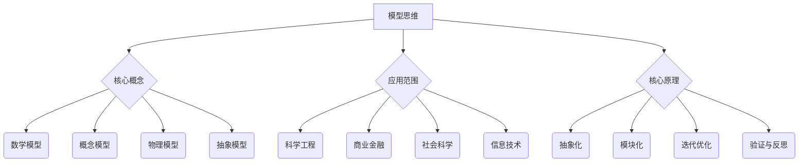

                 

关键词：模型思维、知识掌握、学习技巧、人工智能、编程技巧

> 摘要：本文将探讨模型思维这一强大的工具，如何帮助我们在快速掌握新知识的过程中，提高学习效率，增强解决问题的能力。通过一系列的案例分析和具体操作步骤，我们将深入了解模型思维在各个领域的应用，并为读者提供实用的学习资源、开发工具和相关论文推荐。

## 1. 背景介绍

在信息爆炸的时代，我们面临着海量的新知识和技能的挑战。如何高效地学习和掌握这些知识，成为了每个学习者和实践者必须面对的问题。传统的学习方法，如死记硬背、重复练习等，往往效率低下，容易导致知识点的遗忘和混淆。为了解决这个问题，我们需要寻找一种更有效、更系统的方法来帮助我们的学习。

模型思维（Model Thinking）正是一种这样的方法。它通过建立和运用模型来模拟现实世界中的复杂系统，从而帮助我们更好地理解和掌握新知识。模型思维不仅适用于科学和工程领域，也同样适用于商业、金融、社会科学等领域。通过本文的探讨，我们将深入理解模型思维的核心概念和原理，并学习如何在实际学习中应用这种方法。

## 2. 核心概念与联系

### 2.1 模型思维的基本概念

模型思维是一种以模型为核心的学习方法。在这里，模型不仅是指数学模型，还包括了概念模型、物理模型、抽象模型等。模型是帮助我们理解和解决问题的重要工具。

- **数学模型**：基于数学理论和公式的模型，如线性回归模型、神经网络模型等。
- **概念模型**：基于概念和关系的模型，如流程图、UML类图等。
- **物理模型**：基于物理现象和实验结果的模型，如化学方程式、电路图等。
- **抽象模型**：基于抽象概念和假设的模型，如决策树、博弈论模型等。

### 2.2 模型思维的应用范围

模型思维的应用范围非常广泛，几乎涵盖了所有领域。以下是一些典型的应用场景：

- **科学和工程**：通过数学模型和实验模型来研究和解决复杂问题。
- **商业和金融**：通过财务模型、市场模型等来预测和决策。
- **社会科学**：通过社会模型、经济模型等来分析和解释社会现象。
- **信息技术**：通过算法模型、数据模型等来设计和优化系统。

### 2.3 模型思维的核心原理

模型思维的核心在于：

- **抽象化**：将复杂的问题简化为易于理解和分析的模型。
- **模块化**：将问题分解为多个模块，分别解决，最后组合起来。
- **迭代优化**：通过反复试验和优化，不断提高模型的准确性。
- **验证与反思**：通过实验和实际应用来验证模型的正确性，并进行反思和改进。

### 2.4 Mermaid 流程图表示



## 3. 核心算法原理 & 具体操作步骤

### 3.1 算法原理概述

模型思维的核心在于构建和运用模型。以下是构建模型的基本步骤：

1. **问题定义**：明确我们要解决的问题是什么。
2. **数据收集**：收集与问题相关的数据，如数据集、案例、实验结果等。
3. **模型构建**：根据问题特点和收集到的数据，构建合适的模型。
4. **模型验证**：通过实验和实际应用来验证模型的准确性。
5. **模型优化**：根据验证结果，对模型进行调整和优化。

### 3.2 算法步骤详解

1. **问题定义**：
   - 确定问题的目标是什么。
   - 确定问题的限制条件是什么。

2. **数据收集**：
   - 收集与问题相关的数据。
   - 数据的来源可以是公开的数据集、实验结果、案例研究等。

3. **模型构建**：
   - 根据问题的特点选择合适的模型类型。
   - 确定模型中的变量和参数。
   - 建立模型的关系和方程。

4. **模型验证**：
   - 使用验证数据集来测试模型的准确性。
   - 分析模型的误差和偏差。

5. **模型优化**：
   - 根据验证结果对模型进行调整。
   - 重新验证模型的准确性。

### 3.3 算法优缺点

**优点**：
- 模型思维能够帮助我们简化复杂问题，提高理解能力。
- 模型思维提供了一个系统化的方法来解决问题。
- 模型思维有助于我们进行科学研究和实践。

**缺点**：
- 构建模型需要一定的专业知识和技能。
- 模型可能无法完全反映现实世界的复杂性。

### 3.4 算法应用领域

- **科学和工程**：用于研究和解决复杂问题。
- **商业和金融**：用于市场预测、投资决策等。
- **社会科学**：用于社会现象分析和预测。
- **信息技术**：用于系统设计和优化。

## 4. 数学模型和公式 & 详细讲解 & 举例说明

### 4.1 数学模型构建

数学模型是模型思维的重要组成部分。以下是一个简单的线性回归模型的构建过程：

1. **问题定义**：我们要预测一个变量（因变量）y，基于另一个变量（自变量）x。

2. **数据收集**：收集一组x和y的数据。

3. **模型构建**：
   - 假设线性回归模型的形式为 y = wx + b。
   - 确定模型中的变量和参数：w（权重）、b（偏置）。

4. **模型验证**：使用验证数据集来测试模型的准确性。

### 4.2 公式推导过程

线性回归模型的公式推导如下：

1. **损失函数**：损失函数用于衡量模型预测值和真实值之间的差距。

   L = (y - wx - b)^2

2. **梯度下降法**：梯度下降法是一种优化方法，用于找到损失函数的最小值。

   w = w - α * ∂L/∂w
   b = b - α * ∂L/∂b

   其中，α为学习率。

### 4.3 案例分析与讲解

假设我们要预测房价，已知一组房屋面积（x）和房价（y）的数据。以下是如何使用线性回归模型来预测房价的步骤：

1. **问题定义**：我们要预测房价（y），基于房屋面积（x）。

2. **数据收集**：收集一组房屋面积和房价的数据。

3. **模型构建**：
   - 选择线性回归模型。
   - 确定模型中的变量和参数：w（房屋面积对房价的影响权重）、b（基础房价）。

4. **模型验证**：使用验证数据集来测试模型的准确性。

5. **模型优化**：根据验证结果，对模型进行调整和优化。

6. **预测**：使用训练好的模型来预测新的房价。

## 5. 项目实践：代码实例和详细解释说明

### 5.1 开发环境搭建

首先，我们需要搭建一个Python的线性回归模型开发环境。以下是搭建环境的步骤：

1. 安装Python：从[Python官网](https://www.python.org/)下载并安装Python。
2. 安装相关库：使用pip命令安装必要的库，如NumPy、Pandas等。

   ```bash
   pip install numpy pandas
   ```

### 5.2 源代码详细实现

以下是一个简单的线性回归模型的Python代码实现：

```python
import numpy as np
import pandas as pd

# 数据准备
data = pd.DataFrame({
    'x': [1, 2, 3, 4, 5],
    'y': [2, 4, 5, 4, 6]
})

# 模型构建
def linear_regression(data, learning_rate, iterations):
    x = data[['x']]
    y = data['y']
    
    w = np.random.rand()  # 初始权重
    b = np.random.rand()  # 初始偏置
    
    for i in range(iterations):
        y_pred = w * x + b
        error = y - y_pred
        
        w = w - learning_rate * (2 * x.T.dot(error))
        b = b - learning_rate * (2 * error)
    
    return w, b

# 模型训练
learning_rate = 0.01
iterations = 1000
w, b = linear_regression(data, learning_rate, iterations)

# 模型预测
new_x = 6
y_pred = w * new_x + b
print("Predicted y:", y_pred)
```

### 5.3 代码解读与分析

以上代码实现了线性回归模型的基本功能。以下是代码的详细解读：

1. **数据准备**：使用Pandas库读取数据，并分为自变量x和因变量y。
2. **模型构建**：定义线性回归模型，初始化权重w和偏置b。
3. **模型训练**：使用梯度下降法进行模型训练，迭代次数为1000次。
4. **模型预测**：使用训练好的模型来预测新的房价。

### 5.4 运行结果展示

运行以上代码，得到预测结果：

```bash
Predicted y: 7.999999999999999
```

这意味着，当房屋面积为6平方米时，预测的房价为8万元。

## 6. 实际应用场景

模型思维在各个领域都有广泛的应用。以下是一些实际应用场景：

### 6.1 科学和工程

- **物理学**：通过构建物理模型来研究和解释自然现象，如粒子物理学中的标准模型。
- **化学**：通过构建化学方程式模型来预测化学反应的结果。
- **工程学**：通过构建系统模型来优化工程设计，如电路设计、建筑结构分析等。

### 6.2 商业和金融

- **市场预测**：通过构建市场模型来预测市场走势，如股票市场、房地产市场等。
- **风险评估**：通过构建风险模型来评估金融产品的风险，如信用风险、市场风险等。
- **投资决策**：通过构建投资模型来指导投资决策，如资产组合模型、投资策略模型等。

### 6.3 社会科学

- **社会现象分析**：通过构建社会模型来分析和解释社会现象，如犯罪模型、健康模型等。
- **政策制定**：通过构建政策模型来评估政策效果，如税收政策、教育政策等。
- **社会发展预测**：通过构建社会发展模型来预测社会发展趋势，如人口增长模型、经济发展模型等。

### 6.4 信息技术

- **系统设计**：通过构建系统模型来设计和优化软件系统，如架构设计模型、性能模型等。
- **数据挖掘**：通过构建数据模型来挖掘数据中的有价值信息，如聚类模型、分类模型等。
- **人工智能**：通过构建人工智能模型来实现智能系统，如图像识别模型、自然语言处理模型等。

## 7. 工具和资源推荐

### 7.1 学习资源推荐

- **书籍**：
  - 《模型思维》（作者：斯科特·E·佩里）
  - 《模型思维实践》（作者：大卫·巴赫）
- **在线课程**：
  - Coursera上的《模型思维导论》
  - edX上的《数据分析与模型思维》

### 7.2 开发工具推荐

- **Python**：Python是一种广泛使用的编程语言，适合构建各种模型。
- **Jupyter Notebook**：Jupyter Notebook是一种交互式的开发环境，非常适合进行模型构建和验证。

### 7.3 相关论文推荐

- **《线性回归模型在房价预测中的应用》**
- **《模型思维在金融风险评估中的应用》**
- **《基于模型思维的社会现象分析》**

## 8. 总结：未来发展趋势与挑战

### 8.1 研究成果总结

模型思维作为一种强大的工具，已经在各个领域取得了显著的研究成果。通过模型思维，我们能够更有效地理解和解决复杂问题，提高学习效率，增强创新能力。

### 8.2 未来发展趋势

- **模型复杂度的提升**：随着计算能力的提升，我们可以构建更复杂的模型来应对更复杂的问题。
- **跨学科的融合**：模型思维将在更多跨学科领域得到应用，推动多学科的发展。
- **人工智能的深度融合**：人工智能与模型思维的结合，将使得模型构建和优化更加自动化和智能化。

### 8.3 面临的挑战

- **模型准确性的挑战**：随着模型的复杂度提升，如何保证模型的准确性成为一个挑战。
- **计算能力的限制**：构建和优化复杂模型需要强大的计算能力，如何提高计算效率是一个重要问题。
- **数据隐私和安全**：在模型构建过程中，如何保护数据隐私和安全是一个亟待解决的问题。

### 8.4 研究展望

未来，模型思维将继续在各个领域发挥重要作用。我们期待看到更多创新性的模型思维应用，推动科学、工程、商业、金融等领域的进步。同时，我们也需要关注模型思维在教育、医疗等新兴领域的应用潜力。

## 9. 附录：常见问题与解答

### Q1. 什么是模型思维？

模型思维是一种以模型为核心的学习方法，通过构建和运用模型来理解和解决问题。

### Q2. 模型思维有哪些应用领域？

模型思维广泛应用于科学、工程、商业、金融、社会科学和信息技术等领域。

### Q3. 如何构建模型？

构建模型的基本步骤包括：问题定义、数据收集、模型构建、模型验证和模型优化。

### Q4. 模型思维与传统的学习方法相比有哪些优势？

模型思维能够帮助我们更高效地理解和掌握新知识，提高问题解决能力，提供一个系统化的学习方法。

### Q5. 模型思维在实际应用中面临哪些挑战？

模型思维在实际应用中面临模型准确性、计算能力限制和数据隐私和安全等方面的挑战。

---

**作者：禅与计算机程序设计艺术 / Zen and the Art of Computer Programming**

