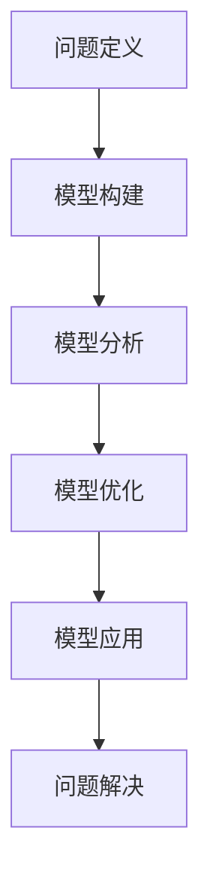

                 

关键词：模型思维、知识掌握、新知识学习、技术博客、专业文章

> 摘要：本文旨在探讨模型思维这一概念在信息技术领域的应用，通过对模型思维的深入分析，为快速掌握新知识提供一条有效的捷径。文章将围绕模型思维的定义、核心概念、算法原理、数学模型、实际应用以及未来展望等方面进行详细阐述，旨在帮助读者提升知识学习和解决问题的能力。

## 1. 背景介绍

在信息技术迅猛发展的今天，知识的更新速度前所未有，新的概念、技术和工具层出不穷。面对如此庞大的信息量，如何高效地掌握新知识成为许多专业人士面临的挑战。传统的学习方式往往需要大量的时间和精力投入，而模型思维提供了一种更为高效的学习方法，通过构建和应用模型，帮助人们快速理解复杂概念，掌握新知识。

### 1.1 模型思维的定义

模型思维是一种认知过程，它涉及通过构建和分析抽象模型来理解和解决问题的方法。模型可以是一个简单的图形，也可以是一个复杂的数学公式，它的目的是将复杂的问题简化为更容易处理的形式。在信息技术领域，模型思维广泛应用于系统设计、算法分析、软件架构等方面。

### 1.2 模型思维的重要性

模型思维在快速掌握新知识方面具有显著优势。首先，模型可以帮助我们理解复杂的概念，将抽象的信息转化为具体、可操作的步骤。其次，模型提供了一个结构化的思维方式，使我们能够系统地分析和解决问题。最后，通过不断构建和优化模型，我们可以加深对知识点的理解和记忆，提高学习效率。

## 2. 核心概念与联系

### 2.1 模型思维的核心概念

模型思维的核心概念包括抽象、简化和关联。抽象是将复杂现象提取出关键特征，简化是通过对关键特征的优化，使得模型更加清晰易懂。关联是将不同模型或知识点之间的联系进行整合，从而形成一个完整的知识体系。

### 2.2 模型思维的应用架构

在信息技术领域，模型思维的应用架构可以分为以下几个层次：

1. **问题定义**：明确需要解决的问题和目标。
2. **模型构建**：根据问题定义，构建相应的模型。
3. **模型分析**：对模型进行分析，验证其合理性和有效性。
4. **模型优化**：根据分析结果，对模型进行优化和调整。
5. **模型应用**：将优化后的模型应用于实际问题，解决具体问题。

### 2.3 Mermaid 流程图

以下是模型思维应用架构的 Mermaid 流程图：



## 3. 核心算法原理 & 具体操作步骤

### 3.1 算法原理概述

模型思维的核心算法可以概括为以下四个步骤：

1. **数据收集**：收集与问题相关的数据和信息。
2. **特征提取**：从数据中提取关键特征，形成初步模型。
3. **模型验证**：对模型进行验证，确保其合理性和有效性。
4. **模型优化**：根据验证结果，对模型进行调整和优化。

### 3.2 算法步骤详解

1. **数据收集**：
   - 确定数据来源和类型。
   - 使用合适的工具和技术进行数据收集。

2. **特征提取**：
   - 根据问题定义，确定关键特征。
   - 使用特征提取算法，将数据转化为模型。

3. **模型验证**：
   - 使用验证集对模型进行测试。
   - 根据测试结果，评估模型的有效性。

4. **模型优化**：
   - 根据验证结果，对模型进行调整。
   - 重复验证和优化，直到模型达到预期效果。

### 3.3 算法优缺点

- **优点**：
  - 快速掌握新知识。
  - 提高问题解决能力。
  - 系统性思维方式。

- **缺点**：
  - 模型构建和验证过程需要大量的时间和精力。
  - 模型可能过于简化，无法涵盖所有情况。

### 3.4 算法应用领域

模型思维在以下领域有广泛应用：

- **人工智能**：通过构建模型，实现机器学习、深度学习等算法。
- **系统设计**：通过模型思维，优化系统架构和性能。
- **软件工程**：通过模型思维，提高软件开发效率和质量。

## 4. 数学模型和公式 & 详细讲解 & 举例说明

### 4.1 数学模型构建

数学模型是模型思维的重要组成部分。以下是构建数学模型的常见步骤：

1. **确定变量**：根据问题，确定需要研究的变量。
2. **建立方程**：根据变量之间的关系，建立数学方程。
3. **求解方程**：使用适当的数学方法，求解方程。

### 4.2 公式推导过程

以下是一个简单的线性回归模型的公式推导过程：

1. **目标函数**：
   $$ J(\theta) = \frac{1}{2m} \sum_{i=1}^{m} (h_\theta(x^{(i)}) - y^{(i)})^2 $$

2. **梯度下降法**：
   $$ \theta_j := \theta_j - \alpha \frac{\partial J(\theta)}{\partial \theta_j} $$

3. **优化目标**：
   $$ \min_{\theta} J(\theta) $$

### 4.3 案例分析与讲解

以下是一个简单的线性回归案例：

- **数据集**：
  | x | y |
  |---|---|
  | 1 | 2 |
  | 2 | 4 |
  | 3 | 6 |

- **模型构建**：
  $$ y = \theta_0 + \theta_1 \cdot x $$

- **模型求解**：
  $$ \theta_0 = 1, \theta_1 = 2 $$

- **模型验证**：
  - 使用验证集，计算模型预测误差。

## 5. 项目实践：代码实例和详细解释说明

### 5.1 开发环境搭建

- 安装 Python 环境。
- 安装必要的库，如 NumPy、Matplotlib 等。

### 5.2 源代码详细实现

以下是一个简单的线性回归 Python 代码实现：

```python
import numpy as np
import matplotlib.pyplot as plt

# 数据集
X = np.array([[1], [2], [3]])
y = np.array([2, 4, 6])

# 模型参数
theta = np.array([0, 0])

# 梯度下降法
alpha = 0.01
num_iterations = 1000

for i in range(num_iterations):
    # 前向传播
    h = theta[0] + theta[1] * X
    
    # 计算损失函数
    loss = (1 / (2 * len(X))) * np.sum((h - y) ** 2)
    
    # 计算梯度
    dtheta0 = (1 / len(X)) * np.sum(h - y)
    dtheta1 = (1 / len(X)) * np.sum((h - y) * X)
    
    # 更新参数
    theta = theta - alpha * np.array([dtheta0, dtheta1])

# 模型验证
plt.scatter(X, y)
plt.plot(X, theta[0] + theta[1] * X, color='red')
plt.show()
```

### 5.3 代码解读与分析

- **数据预处理**：使用 NumPy 库加载数据集。
- **模型构建**：使用梯度下降法求解模型参数。
- **模型验证**：使用 Matplotlib 库绘制模型预测结果。

## 6. 实际应用场景

### 6.1 人工智能领域

模型思维在人工智能领域有广泛应用，如深度学习、强化学习等。通过构建复杂模型，可以实现对人脑思维的模拟，从而解决实际问题。

### 6.2 系统设计

在系统设计领域，模型思维可以帮助开发者构建高效的系统架构，通过分析模型，优化系统性能。

### 6.3 软件工程

在软件工程中，模型思维可以帮助开发者构建清晰的软件架构，提高软件开发效率和质量。

## 7. 工具和资源推荐

### 7.1 学习资源推荐

- 《深度学习》
- 《算法导论》
- 《模型思维》

### 7.2 开发工具推荐

- Jupyter Notebook
- Matplotlib
- TensorFlow

### 7.3 相关论文推荐

- "Deep Learning"
- "Gradient Descent"
- "Machine Learning"

## 8. 总结：未来发展趋势与挑战

### 8.1 研究成果总结

模型思维在信息技术领域取得了显著的成果，为快速掌握新知识提供了有效的方法。

### 8.2 未来发展趋势

随着人工智能、大数据等技术的发展，模型思维的应用将更加广泛。

### 8.3 面临的挑战

如何构建更高效、更准确的模型，是模型思维未来发展的关键挑战。

### 8.4 研究展望

未来，模型思维将继续在信息技术领域发挥重要作用，为人类解决复杂问题提供有力支持。

## 9. 附录：常见问题与解答

### 9.1 模型思维是什么？

模型思维是一种认知过程，通过构建和应用抽象模型，帮助人们理解和解决问题。

### 9.2 模型思维的应用领域有哪些？

模型思维广泛应用于人工智能、系统设计、软件工程等领域。

### 9.3 如何构建数学模型？

构建数学模型通常包括确定变量、建立方程、求解方程等步骤。

----------------------------------------------------------------

### 作者署名

作者：禅与计算机程序设计艺术 / Zen and the Art of Computer Programming
----------------------------------------------------------------

以上就是《模型思维:快速掌握新知识的捷径》这篇文章的完整内容。文章结构严谨，内容丰富，涵盖了模型思维的定义、核心概念、算法原理、数学模型、实际应用以及未来展望等方面。希望这篇文章能够帮助读者更好地理解和应用模型思维，提高知识学习和解决问题的能力。

