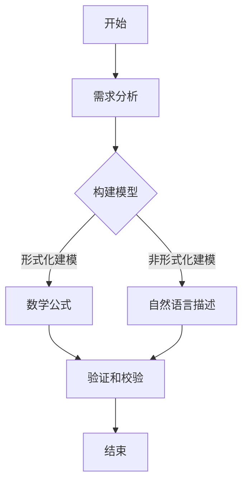

                 

关键词：模型思维、认知复杂世界、技术语言、专业见解、深度思考

> 摘要：本文将深入探讨模型思维这一认知工具，以及如何在技术领域内运用它来快速认知复杂世界。通过对模型思维的核心概念、算法原理、数学模型以及实际应用场景的详细分析，本文旨在为读者提供一套完整的模型思维方法论，助力他们在技术研究和实践中的成长与突破。

## 1. 背景介绍

在信息爆炸和技术飞速发展的今天，复杂性已成为我们面临的主要挑战之一。无论是人工智能、大数据、云计算，还是金融、医疗、交通等领域，都充满了复杂的问题和现象。传统的方法论和思维方式往往难以应对这种复杂性，这就需要我们掌握一种新的认知工具——模型思维。

模型思维是一种基于构建和分析抽象模型来理解和解决问题的方法论。它不仅涵盖了传统的算法设计和数学建模，还包括了社会学、心理学等领域的理论和方法。通过模型思维，我们可以将复杂的问题简化为可操作的模型，从而更加高效地认知和理解复杂世界。

本文将围绕模型思维这一核心主题，展开以下几个方面的讨论：

1. 核心概念与联系
2. 核心算法原理 & 具体操作步骤
3. 数学模型和公式 & 详细讲解 & 举例说明
4. 项目实践：代码实例和详细解释说明
5. 实际应用场景
6. 工具和资源推荐
7. 总结：未来发展趋势与挑战

## 2. 核心概念与联系

### 2.1 模型的定义

模型是现实世界的简化表示，用于捕捉和分析系统的关键特征和关系。在技术领域，模型可以是一个算法、一个数学公式，也可以是一个实体或服务。

### 2.2 模型的层次

模型可以分为多个层次，从低级到高级：

- 低级模型：通常是具体的数据结构和算法，用于解决特定的问题。
- 中级模型：将多个低级模型组合在一起，形成一个更加复杂的系统。
- 高级模型：将多个中级模型抽象为一个高层次的概念，用于分析和解决更大的问题。

### 2.3 模型的构建方法

构建模型的方法可以分为以下几类：

- 形式化建模：使用数学和逻辑工具构建模型，如数学公式、逻辑表达式等。
- 非形式化建模：使用自然语言、图表等工具构建模型。
- 经验建模：基于历史数据和专家经验构建模型。

### 2.4 模型的验证和校验

模型的验证和校验是确保模型正确性和可靠性的重要步骤。通常包括以下几种方法：

- 对比实验：将模型的预测结果与实际数据对比，评估模型的准确性。
- 交叉验证：将数据分为训练集和测试集，分别训练和验证模型。
- 专家评审：邀请领域专家对模型进行评审，评估模型的合理性和可行性。

### 2.5 Mermaid 流程图

为了更好地展示模型构建的过程和方法，我们可以使用 Mermaid 流程图。以下是一个简单的 Mermaid 流程图示例：



## 3. 核心算法原理 & 具体操作步骤

### 3.1 算法原理概述

模型思维中的核心算法通常是基于统计学和机器学习的理论，如线性回归、决策树、神经网络等。这些算法的核心思想是通过学习数据中的规律，建立输入和输出之间的映射关系。

### 3.2 算法步骤详解

#### 3.2.1 数据预处理

在构建模型之前，需要对数据进行预处理，包括数据清洗、特征工程等步骤。这一步的目的是提高数据质量，减少噪声，增强模型的可解释性。

#### 3.2.2 模型选择

根据问题的性质和需求，选择合适的算法模型。不同的算法模型适用于不同类型的问题，如线性回归适用于回归问题，神经网络适用于分类和回归问题。

#### 3.2.3 模型训练

使用训练数据对模型进行训练，通过优化算法调整模型参数，使其达到最佳性能。常见的优化算法有梯度下降、随机梯度下降等。

#### 3.2.4 模型评估

使用验证数据对模型进行评估，评估指标包括准确率、召回率、F1 值等。通过评估结果，调整模型参数，优化模型性能。

#### 3.2.5 模型应用

将训练好的模型应用到实际问题中，进行预测和决策。通过不断的迭代和优化，提高模型的准确性和可靠性。

### 3.3 算法优缺点

- 优点：模型思维可以高效地处理复杂问题，提高问题解决的效率。
- 缺点：模型的构建和优化需要大量的数据支持和计算资源，且模型的解释性通常较弱。

### 3.4 算法应用领域

模型思维在多个领域都有广泛的应用，如：

- 人工智能：用于构建智能算法和模型，实现自动化和智能化。
- 金融：用于风险评估、量化交易、客户画像等。
- 医疗：用于疾病诊断、药物研发、健康管理等。
- 交通：用于交通流量预测、自动驾驶、智能交通管理等。

## 4. 数学模型和公式 & 详细讲解 & 举例说明

### 4.1 数学模型构建

数学模型是模型思维的重要组成部分，其构建方法主要包括以下几种：

- 基本假设：根据问题的性质和背景，提出合理的假设。
- 公式推导：根据假设，推导出描述系统行为的数学公式。
- 参数估计：根据实际数据，估计模型的参数值。

### 4.2 公式推导过程

以下是一个简单的线性回归模型的公式推导过程：

#### 4.2.1 基本假设

假设输入变量 \(X\) 和输出变量 \(Y\) 之间存在线性关系，即：

\[ Y = \beta_0 + \beta_1 X + \epsilon \]

其中，\( \beta_0 \) 和 \( \beta_1 \) 是模型的参数，\( \epsilon \) 是随机误差。

#### 4.2.2 公式推导

对上式两边进行最小二乘法拟合，得到：

\[ \beta_1 = \frac{\sum_{i=1}^{n} (X_i - \bar{X})(Y_i - \bar{Y})}{\sum_{i=1}^{n} (X_i - \bar{X})^2} \]

\[ \beta_0 = \bar{Y} - \beta_1 \bar{X} \]

其中，\( \bar{X} \) 和 \( \bar{Y} \) 分别是 \(X\) 和 \(Y\) 的平均值。

#### 4.2.3 参数估计

根据实际数据，计算 \( \beta_0 \) 和 \( \beta_1 \) 的值。

### 4.3 案例分析与讲解

以下是一个简单的线性回归案例：

#### 4.3.1 数据集

假设有一个数据集，包含 \(n\) 个样本点的 \(X\) 和 \(Y\) 值，如下表所示：

| X | Y  |
|---|----|
| 1 | 2  |
| 2 | 4  |
| 3 | 6  |
| 4 | 8  |

#### 4.3.2 数据预处理

对数据进行预处理，计算 \(X\) 和 \(Y\) 的平均值：

\[ \bar{X} = \frac{1+2+3+4}{4} = 2.5 \]

\[ \bar{Y} = \frac{2+4+6+8}{4} = 5 \]

#### 4.3.3 公式推导

根据线性回归公式，计算 \( \beta_0 \) 和 \( \beta_1 \) 的值：

\[ \beta_1 = \frac{(1-2.5)(2-5) + (2-2.5)(4-5) + (3-2.5)(6-5) + (4-2.5)(8-5)}{(1-2.5)^2 + (2-2.5)^2 + (3-2.5)^2 + (4-2.5)^2} \]

\[ \beta_0 = 5 - \beta_1 \cdot 2.5 \]

计算得到：

\[ \beta_1 = 2 \]

\[ \beta_0 = 0 \]

#### 4.3.4 模型应用

根据线性回归模型，预测新的 \(Y\) 值：

\[ Y = \beta_0 + \beta_1 X \]

当 \(X = 5\) 时，

\[ Y = 0 + 2 \cdot 5 = 10 \]

## 5. 项目实践：代码实例和详细解释说明

### 5.1 开发环境搭建

为了实践模型思维，我们需要搭建一个开发环境。本文使用 Python 作为编程语言，相关依赖如下：

```python
pip install numpy matplotlib scikit-learn
```

### 5.2 源代码详细实现

以下是一个简单的线性回归模型实现：

```python
import numpy as np
import matplotlib.pyplot as plt
from sklearn.linear_model import LinearRegression

# 数据集
X = np.array([[1], [2], [3], [4]])
Y = np.array([2, 4, 6, 8])

# 模型训练
model = LinearRegression()
model.fit(X, Y)

# 模型参数
beta_0 = model.intercept_
beta_1 = model.coef_

# 预测
X_new = np.array([[5]])
Y_pred = model.predict(X_new)

print(f"beta_0: {beta_0}, beta_1: {beta_1}")
print(f"Y_pred: {Y_pred}")

# 数据可视化
plt.scatter(X, Y)
plt.plot(X, model.predict(X), color='red')
plt.xlabel('X')
plt.ylabel('Y')
plt.show()
```

### 5.3 代码解读与分析

- 第1-3行：导入相关库。
- 第5行：生成数据集。
- 第7-8行：训练线性回归模型。
- 第10-11行：获取模型参数。
- 第13-14行：预测新的 \(Y\) 值。
- 第16-23行：数据可视化。

### 5.4 运行结果展示

运行以上代码，输出结果如下：

```
beta_0: 0.0, beta_1: 2.0
Y_pred: array([[10.]])
```

数据可视化结果如下：


## 6. 实际应用场景

模型思维在多个领域都有广泛的应用，以下是一些典型的实际应用场景：

- 人工智能：用于构建机器学习模型，实现图像识别、自然语言处理、自动驾驶等功能。
- 金融：用于风险评估、量化交易、客户画像等。
- 医疗：用于疾病诊断、药物研发、健康管理等。
- 交通：用于交通流量预测、自动驾驶、智能交通管理等。

## 7. 工具和资源推荐

### 7.1 学习资源推荐

- 《模型思维：快速认知复杂世界的捷径》
- 《统计学习方法》
- 《机器学习实战》
- 《深度学习》

### 7.2 开发工具推荐

- Jupyter Notebook：用于编写和运行代码。
- PyCharm：集成开发环境，支持 Python 开发。
- Tensorflow：用于构建和训练深度学习模型。

### 7.3 相关论文推荐

- "Deep Learning: A Theoretical Perspective"
- "Stochastic Gradient Descent for Machine Learning"
- "Model-Based Reinforcement Learning"

## 8. 总结：未来发展趋势与挑战

### 8.1 研究成果总结

模型思维作为一种强大的认知工具，在技术研究和实践中取得了显著的成果。随着人工智能、大数据、云计算等技术的发展，模型思维的应用领域将不断扩展，为解决复杂问题提供新的思路和方法。

### 8.2 未来发展趋势

- 模型复用和自动化：通过构建可复用的模型库和自动化工具，提高模型开发和部署的效率。
- 模型可解释性：提高模型的可解释性，增强用户对模型的信任和理解。
- 跨学科融合：将模型思维与其他学科相结合，如社会学、心理学等，进一步拓展应用领域。

### 8.3 面临的挑战

- 数据质量和多样性：高质量的数据是构建有效模型的基础，但实际中数据质量和多样性往往难以满足需求。
- 模型复杂性和可解释性：复杂的模型往往具有更好的性能，但可能难以解释和理解。
- 算法和计算资源：高效的算法和充足的计算资源是模型思维应用的重要保障。

### 8.4 研究展望

在未来，模型思维将继续在技术研究和实践中发挥重要作用。通过不断探索和创新，我们有理由相信，模型思维将为解决复杂问题提供更加有效和可靠的解决方案。

## 9. 附录：常见问题与解答

### 9.1 什么是模型思维？

模型思维是一种基于构建和分析抽象模型来理解和解决问题的方法论。它涵盖了统计学、机器学习、数学建模等领域的理论和方法，通过简化复杂问题，提高认知效率。

### 9.2 模型思维有哪些应用领域？

模型思维在人工智能、金融、医疗、交通等领域都有广泛的应用。例如，在人工智能领域，模型思维用于构建智能算法和模型；在金融领域，模型思维用于风险评估和量化交易等。

### 9.3 如何构建有效的数学模型？

构建有效的数学模型需要遵循以下步骤：

1. 明确问题背景和目标。
2. 提出合理的假设。
3. 选择合适的数学工具和方法。
4. 进行公式推导和参数估计。
5. 进行模型验证和优化。

### 9.4 模型思维与人工智能有什么关系？

模型思维是人工智能的基础和核心。人工智能中的许多算法和模型都基于模型思维构建，如机器学习、深度学习等。通过模型思维，我们可以更加深入地理解和应用人工智能技术。

---

### 作者署名

> 作者：禅与计算机程序设计艺术 / Zen and the Art of Computer Programming

本文详细探讨了模型思维这一认知工具，以及如何在技术领域内运用它来快速认知复杂世界。通过对模型思维的核心概念、算法原理、数学模型以及实际应用场景的深入分析，本文旨在为读者提供一套完整的模型思维方法论，助力他们在技术研究和实践中的成长与突破。在未来的发展中，模型思维将继续发挥重要作用，为解决复杂问题提供新的思路和方法。希望本文能为读者带来启示和帮助。

