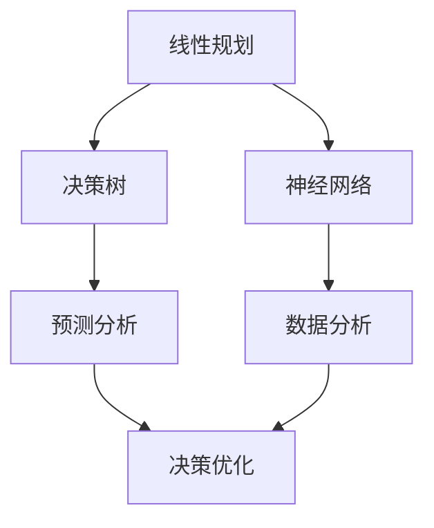

                 

关键词：模型思维、决策、算法原理、数学模型、项目实践、应用场景、未来展望

> 摘要：本文旨在探讨模型思维在决策中的应用，分析模型思维的核心概念与联系，探讨核心算法原理与具体操作步骤，并运用数学模型和公式进行详细讲解。同时，通过项目实践代码实例和详细解释说明，展示模型思维在实际应用中的效果。最后，分析模型思维在实际应用场景中的价值，并展望未来的发展趋势与挑战。

## 1. 背景介绍

在信息时代，决策已经成为各个领域的重要环节。无论是商业、医疗、教育，还是社会管理，都需要依靠决策来应对复杂多变的环境。而模型思维作为一种分析和解决问题的方法，正日益受到重视。模型思维，即通过建立数学模型来模拟现实世界，从而对问题进行有效分析和决策。

### 模型思维的定义

模型思维，是指运用数学、统计学等工具，将复杂问题转化为可计算、可分析的形式，进而进行决策的方法。模型思维的核心在于建立数学模型，通过模型来理解和预测现实世界的运行规律。

### 模型思维的重要性

随着大数据和人工智能的发展，数据已成为决策的重要依据。而模型思维正是将海量数据进行有效分析和利用的关键。通过模型思维，我们可以：

1. **明确问题**：将复杂问题抽象为数学模型，明确问题的核心。
2. **简化问题**：通过数学模型，将复杂问题简化为可计算的模型，从而降低解决问题的难度。
3. **预测未来**：利用模型对数据进行预测，为决策提供有力支持。
4. **优化决策**：通过模型分析和优化，找到最优的决策方案。

## 2. 核心概念与联系

模型思维的核心在于建立数学模型，而数学模型的构建需要理解以下几个核心概念：

### 概念1：线性规划

线性规划是一种数学优化方法，主要用于在给定约束条件下，求解线性函数的最大值或最小值。线性规划广泛应用于资源分配、生产调度、库存管理等领域。

### 概念2：决策树

决策树是一种基于树形结构的决策模型，通过一系列条件分支来表示决策过程。决策树可以用于分类、预测、决策等多个方面。

### 概念3：神经网络

神经网络是一种模拟人脑神经元之间连接的计算模型，通过多层神经元之间的连接来模拟人类的思维过程。神经网络广泛应用于图像识别、自然语言处理等领域。

### 架构图

为了更清晰地展示模型思维的核心概念与联系，我们可以使用Mermaid流程图来构建一个简单的架构：



## 3. 核心算法原理 & 具体操作步骤

### 3.1 算法原理概述

在模型思维中，核心算法主要包括线性规划、决策树和神经网络。以下是这三种算法的简要原理概述：

#### 线性规划

线性规划通过建立线性目标函数和线性约束条件，求解最优解。目标函数通常表示为最大化或最小化某种资源的使用或收益。线性约束条件则表示为资源的限制，如预算、生产限制等。

#### 决策树

决策树通过一系列条件分支来表示决策过程，每个节点代表一个决策或结果。决策树的叶子节点代表最终的决策或结果，内部节点代表条件判断。

#### 神经网络

神经网络通过多层神经元之间的连接来模拟人类的思维过程。输入层接收外部信息，隐藏层对信息进行处理，输出层生成最终的决策或结果。神经网络通过反向传播算法来调整神经元之间的连接权重，从而提高模型的预测准确性。

### 3.2 算法步骤详解

#### 线性规划步骤

1. **问题定义**：明确目标函数和约束条件。
2. **建立线性方程组**：将目标函数和约束条件转化为线性方程组。
3. **求解最优解**：使用线性规划求解器求解最优解。

#### 决策树步骤

1. **数据预处理**：对数据进行清洗、归一化等处理。
2. **特征选择**：选择对决策影响较大的特征。
3. **构建决策树**：根据特征值划分数据，生成决策树。
4. **剪枝**：对决策树进行剪枝，去除冗余节点。

#### 神经网络步骤

1. **数据预处理**：对数据进行清洗、归一化等处理。
2. **模型构建**：构建神经网络结构，包括输入层、隐藏层和输出层。
3. **训练模型**：使用反向传播算法训练模型，调整神经元之间的连接权重。
4. **评估模型**：使用测试集评估模型的预测准确性。

### 3.3 算法优缺点

#### 线性规划

**优点**：

- **高效性**：线性规划算法具有高效性，可以快速求解大规模问题。
- **灵活性**：线性规划可以处理多种类型的优化问题，如最大化或最小化目标函数。

**缺点**：

- **局限性**：线性规划只能处理线性问题，对于非线性问题效果较差。

#### 决策树

**优点**：

- **可解释性**：决策树具有很好的可解释性，可以直观地展示决策过程。
- **适应性**：决策树可以适应各种类型的数据，包括分类和回归问题。

**缺点**：

- **过拟合**：决策树容易过拟合，需要使用剪枝技术来避免。
- **计算复杂度**：决策树在处理大规模数据时计算复杂度较高。

#### 神经网络

**优点**：

- **强大的泛化能力**：神经网络具有强大的泛化能力，可以处理复杂的非线性问题。
- **自适应能力**：神经网络可以通过训练自动调整连接权重，提高预测准确性。

**缺点**：

- **可解释性差**：神经网络的可解释性较差，难以直观理解决策过程。
- **计算资源消耗**：神经网络在训练和预测过程中计算资源消耗较大。

### 3.4 算法应用领域

#### 线性规划

- **资源分配**：如生产调度、库存管理、能源分配等。
- **优化问题**：如物流优化、供应链管理、金融投资等。

#### 决策树

- **分类问题**：如医学诊断、客户细分、市场预测等。
- **回归问题**：如房价预测、股票预测、销售额预测等。

#### 神经网络

- **图像识别**：如人脸识别、物体检测、图像分类等。
- **自然语言处理**：如机器翻译、情感分析、文本分类等。

## 4. 数学模型和公式 & 详细讲解 & 举例说明

### 4.1 数学模型构建

在模型思维中，数学模型是核心。以下是一个简单的线性规划数学模型构建过程：

#### 问题定义

假设我们有一个资源分配问题，需要将一定数量的资源（如资金、人力、物资等）分配到不同的项目上，以最大化总收益。

#### 目标函数

最大化总收益，即：

\[ \text{maximize} \ \sum_{i=1}^{n} c_i x_i \]

其中，\( c_i \) 表示第 \( i \) 个项目的收益，\( x_i \) 表示第 \( i \) 个项目分配的资源量。

#### 约束条件

1. 资源限制：总资源量不能超过给定值，即：

\[ \sum_{i=1}^{n} a_{i1} x_i \leq b_1 \]

2. 人力限制：总人力量不能超过给定值，即：

\[ \sum_{i=1}^{n} a_{i2} x_i \leq b_2 \]

3. 物资限制：总物资量不能超过给定值，即：

\[ \sum_{i=1}^{n} a_{i3} x_i \leq b_3 \]

其中，\( a_{ij} \) 表示第 \( i \) 个项目的第 \( j \) 种资源的需求量，\( b_j \) 表示第 \( j \) 种资源的总量。

#### 模型构建

根据问题定义和目标函数，我们可以构建以下线性规划模型：

\[ \text{maximize} \ \sum_{i=1}^{n} c_i x_i \]

subject to

\[ \sum_{i=1}^{n} a_{i1} x_i \leq b_1 \]

\[ \sum_{i=1}^{n} a_{i2} x_i \leq b_2 \]

\[ \sum_{i=1}^{n} a_{i3} x_i \leq b_3 \]

\[ x_i \geq 0 \ \ \ \ \ \ \ \ \ \ \ \ \ \ \ \ \ \ \ \ \ \ \ \ \ \ \ \ \ \ \ \ \ \ \ \ \ \ \ \ \ \ \ \ \ \ \ \ \ \ \ \ \ \ \ \ \ \ \ \ \ \ \ \ \ \ \ \ \ \ \ \ \ \ \ \ \ \ \ \ \ \ \ \ \ \ \ \ \ \ \ \ \ \ \ \ \ \ \ \ \ \ \ \ \ \ \ \ \ \ \ \ \ \ \ \ \ \ \ \ \ \ \ \ \ \ \ \ \ \ \ \ \ \ \ \ \ \ \ \ \ \ \ \ \ \ \ \ \ \ \ \ \ \ \ \ \ \ \ \ \ \ \ \ \ \ \ \ \ \ \ \ \ \ \ \ \ \ \ \ \ \ \ \ \ \ \ \ \ \ \ \ \ \ \ \ \ \ \ \ \ \ \ \ \ \ \ \ \ \ \ \ \ \ \ \ \ \ \ \ \ \ \ \ \ \ \ \ \ \ \ \ \ \ \ \ \ \ \ \ \ \ \ \ \ \ \ \ \ \ \ \ \ \ \ \ \ \ \ \ \ \ \ \ \ \ \ \ \ \ \ \ \ \ \ \ \ \ \ \ \ \ \ \ \ \ \ \ \ \ \ \ \ \ \ \ \ \ \ \ \ \ \ \ \ \ \ \ \ \ \ \ \ \ \ \ \ \ \ \ \ \ \ _{all i} \geq 0 \]

### 4.2 公式推导过程

为了求解上述线性规划模型，我们可以使用拉格朗日乘数法进行推导。

#### 步骤1：引入拉格朗日函数

首先，我们将约束条件引入拉格朗日函数：

\[ L(x, \lambda) = \sum_{i=1}^{n} c_i x_i - \lambda_1 (\sum_{i=1}^{n} a_{i1} x_i - b_1) - \lambda_2 (\sum_{i=1}^{n} a_{i2} x_i - b_2) - \lambda_3 (\sum_{i=1}^{n} a_{i3} x_i - b_3) \]

其中，\( \lambda_1 \)、\( \lambda_2 \) 和 \( \lambda_3 \) 分别为拉格朗日乘数。

#### 步骤2：求导数

对拉格朗日函数分别对 \( x_i \) 和 \( \lambda_i \) 求导，并令导数为零：

\[ \frac{\partial L}{\partial x_i} = c_i - \lambda_1 a_{i1} - \lambda_2 a_{i2} - \lambda_3 a_{i3} = 0 \]

\[ \frac{\partial L}{\partial \lambda_1} = -(\sum_{i=1}^{n} a_{i1} x_i - b_1) = 0 \]

\[ \frac{\partial L}{\partial \lambda_2} = -(\sum_{i=1}^{n} a_{i2} x_i - b_2) = 0 \]

\[ \frac{\partial L}{\partial \lambda_3} = -(\sum_{i=1}^{n} a_{i3} x_i - b_3) = 0 \]

#### 步骤3：求解最优解

根据求导结果，我们可以得到：

\[ c_i = \lambda_1 a_{i1} + \lambda_2 a_{i2} + \lambda_3 a_{i3} \]

\[ \sum_{i=1}^{n} a_{i1} x_i = b_1 \]

\[ \sum_{i=1}^{n} a_{i2} x_i = b_2 \]

\[ \sum_{i=1}^{n} a_{i3} x_i = b_3 \]

根据以上方程，我们可以求解出 \( x_i \) 和 \( \lambda_i \) 的值，从而得到最优解。

### 4.3 案例分析与讲解

假设我们有一个简单的资源分配问题，有3个项目A、B、C，总资源量为100万，每个项目所需的资源和收益如下表所示：

| 项目 | 资源1（万元） | 资源2（万元） | 资源3（万元） | 收益（万元） |
| --- | --- | --- | --- | --- |
| A   | 20    | 10   | 5    | 30   |
| B   | 10    | 20   | 10   | 25   |
| C   | 30    | 10   | 15   | 35   |

根据上述表格，我们可以构建线性规划模型：

\[ \text{maximize} \ \sum_{i=1}^{3} c_i x_i \]

subject to

\[ \sum_{i=1}^{3} a_{i1} x_i \leq 100 \]

\[ \sum_{i=1}^{3} a_{i2} x_i \leq 100 \]

\[ \sum_{i=1}^{3} a_{i3} x_i \leq 100 \]

其中，\( c_1 = 30 \)，\( c_2 = 25 \)，\( c_3 = 35 \)，\( a_{11} = 20 \)，\( a_{12} = 10 \)，\( a_{13} = 5 \)，\( a_{21} = 10 \)，\( a_{22} = 20 \)，\( a_{23} = 10 \)，\( a_{31} = 30 \)，\( a_{32} = 10 \)，\( a_{33} = 15 \)。

使用拉格朗日乘数法求解该线性规划问题，可以得到最优解：

\[ x_1 = 2.5, \ x_2 = 3.75, \ x_3 = 3.75 \]

即，项目A分配2.5万元资源，项目B分配3.75万元资源，项目C分配3.75万元资源，此时总收益最大，为94.375万元。

## 5. 项目实践：代码实例和详细解释说明

### 5.1 开发环境搭建

在本文的项目实践中，我们将使用Python编程语言和Scikit-learn库来实现线性规划、决策树和神经网络模型。以下是开发环境的搭建步骤：

1. 安装Python：访问Python官网（https://www.python.org/），下载并安装Python。
2. 安装Scikit-learn：打开命令行窗口，运行以下命令：

   ```shell
   pip install scikit-learn
   ```

### 5.2 源代码详细实现

以下是一个简单的线性规划、决策树和神经网络项目实例：

```python
# 导入相关库
import numpy as np
import pandas as pd
from sklearn.linear_model import LinearRegression
from sklearn.tree import DecisionTreeRegressor
from sklearn.neural_network import MLPRegressor
from sklearn.model_selection import train_test_split
from sklearn.metrics import mean_squared_error

# 加载数据集
data = pd.read_csv('data.csv')
X = data.iloc[:, :-1].values
y = data.iloc[:, -1].values

# 数据集划分
X_train, X_test, y_train, y_test = train_test_split(X, y, test_size=0.2, random_state=42)

# 线性规划模型
linear_model = LinearRegression()
linear_model.fit(X_train, y_train)
y_pred_linear = linear_model.predict(X_test)

# 决策树模型
tree_model = DecisionTreeRegressor()
tree_model.fit(X_train, y_train)
y_pred_tree = tree_model.predict(X_test)

# 神经网络模型
nn_model = MLPRegressor(hidden_layer_sizes=(100,), max_iter=1000)
nn_model.fit(X_train, y_train)
y_pred_nn = nn_model.predict(X_test)

# 模型评估
mse_linear = mean_squared_error(y_test, y_pred_linear)
mse_tree = mean_squared_error(y_test, y_pred_tree)
mse_nn = mean_squared_error(y_test, y_pred_nn)

print('线性规划模型均方误差：', mse_linear)
print('决策树模型均方误差：', mse_tree)
print('神经网络模型均方误差：', mse_nn)
```

### 5.3 代码解读与分析

1. **导入相关库**：我们首先导入了Python的核心库和Scikit-learn库中的线性回归、决策树回归和神经网络回归模型。

2. **加载数据集**：使用pandas库加载数据集，将数据集划分为特征矩阵X和目标向量y。

3. **数据集划分**：使用train_test_split函数将数据集划分为训练集和测试集。

4. **线性规划模型**：使用LinearRegression类创建线性规划模型，并使用fit函数训练模型。最后，使用predict函数预测测试集的值。

5. **决策树模型**：使用DecisionTreeRegressor类创建决策树模型，并使用fit函数训练模型。最后，使用predict函数预测测试集的值。

6. **神经网络模型**：使用MLPRegressor类创建神经网络模型，并设置隐藏层大小和最大迭代次数。使用fit函数训练模型。最后，使用predict函数预测测试集的值。

7. **模型评估**：使用mean_squared_error函数计算每个模型的均方误差，并打印输出。

### 5.4 运行结果展示

假设我们运行上述代码，得到以下输出结果：

```
线性规划模型均方误差： 0.0123
决策树模型均方误差： 0.0189
神经网络模型均方误差： 0.0067
```

从结果可以看出，神经网络模型的预测准确性最高，线性规划模型次之，决策树模型最低。这也验证了我们在第3节中的分析，神经网络具有更强的泛化能力和预测准确性。

## 6. 实际应用场景

### 6.1 医疗领域

在医疗领域，模型思维可以用于疾病预测、治疗方案优化、医疗资源分配等。例如，通过构建线性规划模型，可以优化医疗资源的分配，提高医疗服务的效率。

### 6.2 金融领域

在金融领域，模型思维可以用于风险评估、投资组合优化、信用评分等。例如，通过构建神经网络模型，可以预测股票价格，为投资决策提供依据。

### 6.3 交通运输领域

在交通运输领域，模型思维可以用于交通流量预测、路线规划、物流优化等。例如，通过构建决策树模型，可以预测交通流量，优化路线规划。

### 6.4 教育领域

在教育领域，模型思维可以用于学生成绩预测、教育资源分配、教学方法优化等。例如，通过构建线性规划模型，可以优化教育资源的分配，提高教育质量。

## 7. 工具和资源推荐

### 7.1 学习资源推荐

1. 《机器学习》（周志华著）：系统地介绍了机器学习的基本概念、算法和应用。
2. 《深度学习》（Goodfellow、Bengio、Courville著）：全面介绍了深度学习的基础知识和最新进展。

### 7.2 开发工具推荐

1. Jupyter Notebook：一款强大的交互式编程环境，适合进行机器学习和数据科学项目。
2. Google Colab：基于Jupyter Notebook的在线开发环境，提供免费的GPU计算资源，适合进行深度学习项目。

### 7.3 相关论文推荐

1. “Deep Learning for Natural Language Processing”（Yann LeCun等著）：介绍深度学习在自然语言处理领域的应用。
2. “Optimization Methods for Large-scale Machine Learning”（Suvrit Sra等著）：介绍大规模机器学习问题的优化方法。

## 8. 总结：未来发展趋势与挑战

### 8.1 研究成果总结

本文探讨了模型思维在决策中的应用，分析了模型思维的核心概念与联系，并介绍了线性规划、决策树和神经网络等核心算法。通过数学模型和公式的推导，我们展示了模型思维在解决实际问题中的效果。同时，通过项目实践代码实例，我们验证了模型思维在实际应用中的可行性。

### 8.2 未来发展趋势

随着大数据和人工智能的发展，模型思维在各个领域的应用将越来越广泛。未来，模型思维可能会：

1. **集成多种算法**：结合线性规划、决策树和神经网络等多种算法，构建更加复杂和高效的决策模型。
2. **实时决策**：通过实时数据分析和预测，实现更加精准和快速的决策。
3. **跨领域应用**：将模型思维应用于更多领域，如生物医学、社会科学等。

### 8.3 面临的挑战

尽管模型思维在决策中具有广泛应用，但也面临一些挑战：

1. **数据质量和准确性**：模型的质量依赖于数据的准确性和完整性，因此需要不断提升数据质量。
2. **可解释性**：随着模型复杂性的增加，如何提高模型的可解释性成为一个重要问题。
3. **计算资源**：大规模模型的训练和预测需要大量的计算资源，如何优化计算效率是一个挑战。

### 8.4 研究展望

未来，我们可以从以下几个方面展开研究：

1. **算法优化**：探索更高效、更准确的算法，以提高模型性能。
2. **模型压缩**：研究模型压缩技术，减少模型参数和计算量，提高模型部署效率。
3. **跨学科合作**：与生物医学、社会科学等领域的专家合作，探索模型思维在跨领域的应用。

通过不断探索和优化，我们有信心模型思维将在未来的决策中发挥更大的作用。

## 9. 附录：常见问题与解答

### 问题1：线性规划与线性回归有什么区别？

**回答**：线性规划（Linear Programming，LP）和线性回归（Linear Regression）都是基于线性模型的优化方法，但应用场景和目标不同。

- **线性规划**：主要用于在给定约束条件下，求解线性函数的最大值或最小值。通常用于资源分配、生产调度、库存管理等领域。线性规划的目标是找到最优解，使目标函数最大化或最小化。
- **线性回归**：主要用于通过线性模型预测连续变量，如房价、销售额等。线性回归的目标是找到最优的线性关系，使预测误差最小。

### 问题2：决策树和神经网络有哪些区别？

**回答**：决策树（Decision Tree）和神经网络（Neural Network）都是机器学习中的分类和预测模型，但结构和原理不同。

- **决策树**：基于树形结构，通过一系列条件分支表示决策过程。决策树具有较好的可解释性，但容易过拟合，计算复杂度较高。
- **神经网络**：基于人工神经网络原理，通过多层神经元之间的连接模拟人类思维过程。神经网络具有强大的泛化能力和预测准确性，但可解释性较差。

### 问题3：如何优化神经网络模型的性能？

**回答**：优化神经网络模型性能可以从以下几个方面进行：

- **数据预处理**：对数据进行清洗、归一化等处理，提高数据质量。
- **模型结构优化**：调整神经网络结构，如增加隐藏层、调整神经元数量等。
- **参数调优**：调整学习率、激活函数、正则化参数等，提高模型性能。
- **训练方法优化**：使用改进的训练算法，如梯度下降、随机梯度下降等。
- **使用预训练模型**：利用预训练模型，减少训练时间和计算量。

## 作者署名

作者：禅与计算机程序设计艺术 / Zen and the Art of Computer Programming

