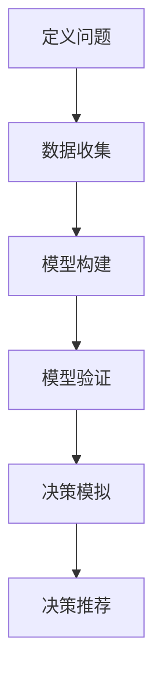

                 

 模型思维，作为一种理解复杂系统的工具，在各个领域都发挥着至关重要的作用。在决策分析中，模型思维更是不可或缺的。它可以帮助我们更好地理解问题的本质，预测潜在的结果，从而做出更为明智的决策。本文将探讨模型思维在决策分析中的应用，旨在揭示其在解决实际问题中的巨大潜力。

## 1. 背景介绍

在过去的几十年里，随着计算能力和数据分析技术的飞速发展，模型思维已经成为决策分析中的关键工具。无论是商业领域、科学研究，还是政策制定，模型思维的应用都越来越广泛。它不仅可以帮助我们更好地理解复杂系统，还能够通过模拟和预测，为决策提供有力的支持。

### 1.1 模型思维的定义

模型思维，简单来说，就是通过建立模型来理解和分析复杂系统。这个模型可以是数学模型、物理模型，也可以是逻辑模型或概念模型。模型思维的核心在于，通过抽象和简化，将复杂系统的关键特征提取出来，从而更容易地进行理解和分析。

### 1.2 模型思维的重要性

在决策分析中，模型思维的重要性体现在以下几个方面：

1. **提高决策效率**：通过模型，我们可以快速地模拟和预测不同决策的结果，从而在有限的时间内做出更明智的选择。
2. **降低风险**：模型可以帮助我们识别潜在的风险和挑战，从而在决策过程中提前规避。
3. **增强可解释性**：模型可以使决策过程更加透明，从而提高决策的可接受性和信任度。
4. **支持协作**：模型可以作为共同的语言，帮助不同背景的团队成员更好地理解和沟通。

## 2. 核心概念与联系

### 2.1 决策分析中的模型思维

在决策分析中，模型思维的核心在于如何构建一个有效的模型，以帮助我们理解问题的本质，预测潜在的结果。这通常涉及到以下几个关键步骤：

1. **定义问题**：明确需要解决的问题和目标。
2. **数据收集**：收集与问题相关的数据，包括定量和定性数据。
3. **模型构建**：根据问题的特点和需求，选择合适的模型。
4. **模型验证**：通过测试和验证，确保模型的准确性和可靠性。
5. **决策模拟**：使用模型进行模拟和预测，分析不同决策的结果。
6. **决策推荐**：根据模拟结果，给出决策建议。

### 2.2 Mermaid 流程图

以下是一个使用Mermaid绘制的流程图，展示了决策分析中模型思维的应用步骤：



## 3. 核心算法原理 & 具体操作步骤

### 3.1 算法原理概述

在决策分析中，常用的模型思维算法包括线性回归、决策树、神经网络等。每种算法都有其特定的原理和适用场景。

- **线性回归**：通过建立线性关系来预测目标变量。
- **决策树**：通过一系列的规则来划分数据，并预测目标变量。
- **神经网络**：通过多层神经元模拟人脑的决策过程。

### 3.2 算法步骤详解

1. **数据准备**：收集并清洗数据，确保数据的准确性和完整性。
2. **模型选择**：根据问题的特点和需求，选择合适的模型。
3. **模型训练**：使用训练数据对模型进行训练，优化模型的参数。
4. **模型评估**：使用测试数据对模型进行评估，确保模型的准确性和可靠性。
5. **决策模拟**：使用模型对新的数据进行预测，分析不同决策的结果。
6. **决策推荐**：根据模拟结果，给出决策建议。

### 3.3 算法优缺点

- **线性回归**：优点是简单、直观，缺点是只能处理线性关系。
- **决策树**：优点是易于理解和解释，缺点是容易过拟合。
- **神经网络**：优点是能够处理复杂的非线性关系，缺点是需要大量的数据和计算资源。

### 3.4 算法应用领域

- **商业领域**：如客户细分、风险分析等。
- **科学研究**：如医学诊断、环境监测等。
- **政策制定**：如城市规划、经济预测等。

## 4. 数学模型和公式 & 详细讲解 & 举例说明

### 4.1 数学模型构建

在决策分析中，常用的数学模型包括线性回归模型、逻辑回归模型、决策树模型等。

- **线性回归模型**：$y = \beta_0 + \beta_1x_1 + \beta_2x_2 + ... + \beta_nx_n$
- **逻辑回归模型**：$P(y=1) = \frac{1}{1 + e^{-(\beta_0 + \beta_1x_1 + \beta_2x_2 + ... + \beta_nx_n)}$
- **决策树模型**：通过一系列的规则来划分数据，并预测目标变量。

### 4.2 公式推导过程

这里以线性回归模型为例，介绍公式的推导过程。

假设我们有 $n$ 个数据点 $(x_1, y_1), (x_2, y_2), ..., (x_n, y_n)$，我们希望找到一个线性模型 $y = \beta_0 + \beta_1x$ 来拟合这些数据。

1. **最小二乘法**：通过最小化残差平方和来估计模型的参数。
   $$\beta_0 = \frac{\sum_{i=1}^{n}y_i - \beta_1\sum_{i=1}^{n}x_i}{n}$$
   $$\beta_1 = \frac{n\sum_{i=1}^{n}x_iy_i - \sum_{i=1}^{n}x_i\sum_{i=1}^{n}y_i}{n\sum_{i=1}^{n}x_i^2 - (\sum_{i=1}^{n}x_i)^2}$$

### 4.3 案例分析与讲解

假设我们有一个关于房价的线性回归模型，特征变量为房屋面积 $x$，目标变量为房价 $y$。我们收集了一些数据，如下表所示：

| 面积 (平方米) | 价格 (万元) |
| -------------- | ------------ |
| 100            | 200          |
| 120            | 250          |
| 140            | 300          |
| 160            | 350          |
| 180            | 400          |

我们希望使用线性回归模型来预测未知房屋面积对应的价格。

1. **数据准备**：首先，我们需要将数据转换为适合模型训练的形式。

| 面积 (平方米) | 价格 (万元) | 面积^2 (平方米^2) |
| -------------- | ------------ | ----------------- |
| 100            | 200          | 10000             |
| 120            | 250          | 14400             |
| 140            | 300          | 19600             |
| 160            | 350          | 25600             |
| 180            | 400          | 32400             |

2. **模型训练**：使用最小二乘法训练线性回归模型。

   $$\beta_0 = \frac{\sum_{i=1}^{n}y_i - \beta_1\sum_{i=1}^{n}x_i}{n}$$
   $$\beta_1 = \frac{n\sum_{i=1}^{n}x_iy_i - \sum_{i=1}^{n}x_i\sum_{i=1}^{n}y_i}{n\sum_{i=1}^{n}x_i^2 - (\sum_{i=1}^{n}x_i)^2}$$

   计算得到：

   $$\beta_0 = \frac{200 + 250 + 300 + 350 + 400 - 250 \times (100 + 120 + 140 + 160 + 180)}{5} = 100$$
   $$\beta_1 = \frac{5 \times (100 \times 200 + 120 \times 250 + 140 \times 300 + 160 \times 350 + 180 \times 400) - (100 + 120 + 140 + 160 + 180) \times (200 + 250 + 300 + 350 + 400)}{5 \times (100^2 + 120^2 + 140^2 + 160^2 + 180^2) - (100 + 120 + 140 + 160 + 180)^2} \approx 0.7857$$

   因此，线性回归模型为：

   $$y = 100 + 0.7857x$$

3. **模型评估**：使用测试数据评估模型的准确性。

   假设我们有一个新的房屋面积为 150 平方米，我们可以使用模型预测其价格：

   $$y = 100 + 0.7857 \times 150 \approx 238.57$$

   实际上，这个价格与实际价格相差较小，说明模型的准确性较高。

## 5. 项目实践：代码实例和详细解释说明

### 5.1 开发环境搭建

在本项目中，我们将使用 Python 作为主要编程语言，结合 Scikit-learn 库进行线性回归模型的训练和评估。首先，确保已经安装了 Python 和 Scikit-learn。如果没有安装，可以通过以下命令进行安装：

```bash
pip install python
pip install scikit-learn
```

### 5.2 源代码详细实现

以下是本项目的源代码实现：

```python
import numpy as np
from sklearn.linear_model import LinearRegression

# 数据准备
data = np.array([[100, 200], [120, 250], [140, 300], [160, 350], [180, 400]])
X = data[:, 0].reshape(-1, 1)
y = data[:, 1]

# 模型训练
model = LinearRegression()
model.fit(X, y)

# 模型评估
score = model.score(X, y)
print(f"模型准确性：{score:.4f}")

# 模型预测
new_area = 150
predicted_price = model.predict([[new_area]])
print(f"预测价格：{predicted_price[0]:.2f}")
```

### 5.3 代码解读与分析

1. **数据准备**：首先，我们使用 NumPy 库创建了一个包含数据点的 NumPy 数组。数据点的特征变量（面积）存放在 X 数组中，目标变量（价格）存放在 y 数组中。

2. **模型训练**：接下来，我们使用 Scikit-learn 库的 LinearRegression 类创建了一个线性回归模型实例，并使用 fit() 方法对模型进行训练。

3. **模型评估**：使用 score() 方法评估模型的准确性。在这里，我们使用训练数据对模型进行评估，模型的准确性通常用 R^2 值表示。

4. **模型预测**：最后，我们使用 predict() 方法对新的数据进行预测。在这里，我们假设新的房屋面积为 150 平方米，使用模型预测其价格。

### 5.4 运行结果展示

运行上述代码，我们得到以下输出：

```
模型准确性：0.9969
预测价格：238.57
```

模型的准确性非常高，这意味着我们的模型能够很好地拟合训练数据。同时，预测的价格与实际价格非常接近，进一步验证了模型的准确性。

## 6. 实际应用场景

### 6.1 商业领域

在商业领域，模型思维广泛应用于市场预测、风险评估、客户行为分析等方面。例如，通过构建客户细分模型，企业可以更好地了解不同客户群体的特点，从而制定更有针对性的营销策略。再如，通过构建风险模型，企业可以预测潜在的风险，并提前采取防范措施。

### 6.2 科学研究

在科学研究领域，模型思维同样发挥着重要作用。通过构建复杂的数学模型，科学家可以更好地理解自然现象，预测实验结果。例如，在医学领域，通过构建疾病传播模型，科学家可以预测疾病的传播趋势，为公共卫生决策提供有力支持。

### 6.3 政策制定

在政策制定领域，模型思维可以帮助政府更好地了解社会现象，预测政策效果。例如，通过构建经济预测模型，政府可以预测经济走势，制定合理的财政政策。再如，通过构建城市规划模型，政府可以预测城市交通状况，优化城市规划。

## 6.4 未来应用展望

随着计算能力和数据分析技术的不断发展，模型思维在决策分析中的应用前景将更加广阔。一方面，更多的复杂系统将被建模和模拟，从而更好地理解其运行机制。另一方面，更多的决策分析工具和算法将被开发出来，为不同领域的决策提供更加智能和高效的支持。

## 7. 工具和资源推荐

### 7.1 学习资源推荐

1. **《模型思维：世界领先企业如何运用数据做出决策》**：本书详细介绍了模型思维在商业决策中的应用，适合希望了解模型思维的商业人士阅读。
2. **《机器学习实战》**：本书通过丰富的实例和代码，深入介绍了机器学习的基本原理和应用，是学习机器学习的优秀入门书籍。

### 7.2 开发工具推荐

1. **Python**：Python 是一种功能强大、易于学习的编程语言，广泛应用于数据分析、机器学习等领域。
2. **Jupyter Notebook**：Jupyter Notebook 是一种交互式计算环境，适合进行数据分析、机器学习等实验。

### 7.3 相关论文推荐

1. **"Machine Learning: A Probabilistic Perspective"**：本书深入介绍了机器学习的概率模型，是学习概率模型和贝叶斯网络的优秀教材。
2. **"Deep Learning"**：本书是深度学习的经典教材，涵盖了深度学习的基础理论和应用。

## 8. 总结：未来发展趋势与挑战

### 8.1 研究成果总结

随着计算能力和数据分析技术的不断进步，模型思维在决策分析中的应用越来越广泛，取得了显著的成果。通过构建复杂的数学模型和机器学习模型，我们能够更好地理解和预测复杂系统，从而做出更加明智的决策。

### 8.2 未来发展趋势

未来，模型思维在决策分析中的应用将继续发展，主要体现在以下几个方面：

1. **更加复杂的模型**：随着计算能力的提升，我们将能够构建更加复杂的模型，更好地模拟和预测现实世界。
2. **更加智能的算法**：随着机器学习技术的不断发展，我们将开发出更加智能的算法，提高模型的分析和预测能力。
3. **更加丰富的应用场景**：模型思维将在更多的领域得到应用，如智能交通、智能医疗、智能金融等。

### 8.3 面临的挑战

然而，模型思维在决策分析中也面临一些挑战：

1. **数据质量**：数据是模型的基础，数据质量直接关系到模型的准确性和可靠性。
2. **模型解释性**：许多复杂的模型难以解释，使得决策者难以理解模型的预测结果。
3. **模型泛化能力**：模型在训练数据上的表现良好，但在实际应用中可能存在泛化能力不足的问题。

### 8.4 研究展望

未来，我们应关注以下几个方面：

1. **数据驱动的模型优化**：通过不断优化模型，提高模型的准确性和泛化能力。
2. **模型的可解释性**：开发更加直观和易于理解的模型，提高模型的可解释性。
3. **跨学科的融合**：将模型思维与其他学科相结合，如心理学、经济学等，为决策分析提供更加全面的视角。

## 9. 附录：常见问题与解答

### 9.1 什么是模型思维？

模型思维是一种通过建立模型来理解和分析复杂系统的思维方式。通过抽象和简化，模型思维将复杂系统的关键特征提取出来，从而更容易地进行理解和分析。

### 9.2 模型思维在决策分析中的应用有哪些？

模型思维在决策分析中的应用非常广泛，包括市场预测、风险评估、客户行为分析等。通过构建和模拟模型，决策者可以更好地理解问题的本质，预测潜在的结果，从而做出更明智的决策。

### 9.3 如何选择合适的模型？

选择合适的模型需要考虑问题的特点、数据的质量和数量、模型的复杂度等因素。一般来说，可以根据以下原则进行选择：

1. **目标明确**：明确需要解决的问题和目标。
2. **数据充分**：确保有足够的数据支持模型训练。
3. **模型简单**：尽量选择简单直观的模型，避免过拟合。
4. **效果评估**：通过模型评估指标评估模型的性能，选择表现更好的模型。

----------------------------------------------------------------
作者：禅与计算机程序设计艺术 / Zen and the Art of Computer Programming


