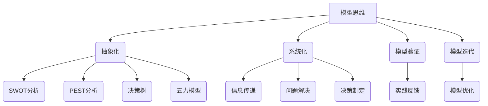

                 

 关键词：模型思维、管理沟通、组织效能、团队协作、信息传递、认知框架

> 摘要：本文探讨了模型思维在管理沟通中的重要性，以及如何通过构建和运用模型来提升组织效能和团队协作。文章首先介绍了模型思维的基本概念，然后深入分析了其在管理沟通中的应用，最后提出了具体的实践建议和工具，以帮助管理者更好地运用模型思维提升团队协作和信息传递。

## 1. 背景介绍

在信息化时代，组织内部的沟通和协作显得尤为重要。有效的管理沟通不仅能促进信息的流通，还能提高决策质量和执行效率。然而，现实中的沟通往往面临着信息不对称、理解偏差和协调困难等问题。模型思维作为一种强有力的工具，能够在复杂的管理环境中提供一种结构化的思考方式，帮助管理者更清晰地理解问题，更有效地传递信息，并促进团队协作。

本文旨在探讨模型思维在管理沟通中的应用，通过分析其基本概念和核心原理，揭示模型思维如何帮助管理者提升组织效能和团队协作。文章将从以下几个部分展开：

1. **模型思维的基本概念和原理**：介绍模型思维的定义、核心原理和常见的模型类型。
2. **模型思维在管理沟通中的应用**：分析模型思维在管理沟通中的具体应用，包括信息传递、问题解决和决策制定。
3. **模型构建与运用**：探讨如何构建和应用模型思维来提升管理沟通效果。
4. **案例分析**：通过实际案例展示模型思维在管理沟通中的成功应用。
5. **模型思维的未来发展趋势**：讨论模型思维在管理沟通中的未来发展和面临的挑战。

### 1.1 模型思维的定义

模型思维是一种通过构建抽象模型来理解和解决复杂问题的思维方式。它不仅仅是一种理论框架，更是一种实践工具，可以帮助我们从多个维度分析和解决问题。在管理沟通中，模型思维能够帮助管理者更系统地理解和处理信息，从而提高决策质量和团队协作效率。

### 1.2 模型思维的核心原理

模型思维的核心原理包括以下几点：

1. **抽象化**：通过简化复杂问题，将其转化为更易理解的模型。
2. **系统化**：将问题分解为多个组成部分，并分析它们之间的相互作用。
3. **模型验证**：通过实践和反馈来验证模型的准确性和有效性。
4. **模型迭代**：在验证过程中不断调整和优化模型，以提高其适应性。

### 1.3 常见的模型类型

在管理沟通中，常见的模型类型包括：

1. **SWOT分析**：用于分析组织的优势、劣势、机会和威胁。
2. **PEST分析**：用于分析外部环境中的政治、经济、社会和技术因素。
3. **决策树**：用于分析不同决策路径和其可能的结果。
4. **五力模型**：用于分析市场竞争环境。

## 2. 核心概念与联系

为了更好地理解模型思维在管理沟通中的应用，我们需要了解一些核心概念及其相互联系。以下是一个用Mermaid绘制的流程图，展示了这些概念及其关系：



### 2.1 抽象化

抽象化是将复杂问题简化为更易理解的形式。在管理沟通中，抽象化可以帮助我们将复杂的管理问题分解为若干个关键因素，从而更容易进行分析和处理。例如，在SWOT分析中，我们可以将组织的优势和劣势抽象为具体的要素，以便更清晰地评估。

### 2.2 系统化

系统化是将问题分解为多个组成部分，并分析它们之间的相互作用。在管理沟通中，系统化可以帮助我们理解问题的全貌，并识别关键因素及其相互关系。例如，在决策树中，我们可以将不同的决策路径和其可能的结果进行系统化分析，以做出更明智的决策。

### 2.3 模型验证

模型验证是通过实践和反馈来验证模型的准确性和有效性。在管理沟通中，模型验证可以帮助我们确保所采用的模型能够真正反映实际情况，并提高决策的可靠性。例如，在PEST分析中，我们可以通过实际的市场调研来验证外部环境因素对我们的影响。

### 2.4 模型迭代

模型迭代是在验证过程中不断调整和优化模型，以提高其适应性。在管理沟通中，模型迭代可以帮助我们根据实际情况的变化不断更新和改进模型，以更好地适应新的环境和挑战。例如，在五力模型中，我们可以根据市场情况的变化调整竞争者的力量和行业趋势。

## 3. 核心算法原理 & 具体操作步骤

### 3.1 算法原理概述

模型思维在管理沟通中的应用可以看作是一种算法，其核心原理是利用模型来优化信息传递和问题解决过程。具体来说，该算法包括以下几个步骤：

1. **问题识别**：明确需要解决的问题或需要传递的信息。
2. **模型构建**：根据问题或信息的特点，选择合适的模型进行构建。
3. **模型应用**：将模型应用于具体问题或信息传递过程中。
4. **模型验证**：通过实践和反馈验证模型的准确性和有效性。
5. **模型迭代**：根据验证结果对模型进行优化和改进。

### 3.2 算法步骤详解

1. **问题识别**：
   - **步骤1**：明确问题的核心要素和关键信息。
   - **步骤2**：分析问题的背景和上下文，了解其背后的逻辑关系。

2. **模型构建**：
   - **步骤1**：选择合适的模型类型，如SWOT分析、PEST分析、决策树等。
   - **步骤2**：根据问题特点和需求，将模型的具体要素进行明确和界定。

3. **模型应用**：
   - **步骤1**：将模型应用于实际情境中，如通过决策树进行决策分析。
   - **步骤2**：利用模型进行信息传递，确保信息传递的准确性和一致性。

4. **模型验证**：
   - **步骤1**：通过实践和反馈验证模型的有效性，如通过实际执行决策路径来检验决策树。
   - **步骤2**：收集和分析反馈信息，评估模型在实际应用中的效果。

5. **模型迭代**：
   - **步骤1**：根据验证结果对模型进行调整和优化，如改进决策树的路径选择。
   - **步骤2**：将优化后的模型应用于新的情境中，并继续进行验证和迭代。

### 3.3 算法优缺点

**优点**：
- 提高信息传递的准确性和一致性，降低理解偏差。
- 帮助管理者更清晰地理解复杂问题，提高决策质量。
- 促进团队协作，增强组织内部沟通。

**缺点**：
- 模型构建需要较高的专业知识和经验，可能对管理者提出较高的要求。
- 模型验证和迭代过程可能需要较长时间，影响决策的及时性。

### 3.4 算法应用领域

模型思维在管理沟通中的应用广泛，主要包括以下几个方面：

1. **战略规划**：用于分析和制定企业的战略规划。
2. **风险管理**：用于识别和评估企业面临的风险，制定相应的风险应对策略。
3. **人力资源管理**：用于分析和优化组织结构，提高员工绩效和团队协作。
4. **市场营销**：用于分析市场需求和竞争环境，制定市场营销策略。

## 4. 数学模型和公式 & 详细讲解 & 举例说明

在管理沟通中，数学模型和公式是重要的工具，它们能够帮助我们更精确地分析和解决问题。以下是一个用LaTeX编写的数学模型示例：

### 4.1 数学模型构建

假设我们有一个组织，其内部沟通效率可以用以下公式表示：

\[ E = f(P, C, T) \]

其中：
- \( E \) 表示沟通效率；
- \( P \) 表示信息传递的准确性；
- \( C \) 表示沟通成本；
- \( T \) 表示沟通时间。

### 4.2 公式推导过程

公式的推导过程如下：

\[ E = \frac{P}{C \cdot T} \]

推导步骤：
1. **定义变量**：设 \( P \) 为信息传递的准确性，\( C \) 为沟通成本，\( T \) 为沟通时间。
2. **目标函数**：设 \( E \) 为沟通效率，其目标是最大化 \( E \)。
3. **约束条件**：考虑到沟通的实际情况，假设 \( C \cdot T \) 为常数。
4. **推导公式**：将目标函数除以约束条件，得到 \( E = \frac{P}{C \cdot T} \)。

### 4.3 案例分析与讲解

假设有一个企业，其信息传递准确性 \( P \) 为 0.8，沟通成本 \( C \) 为 1000元/小时，沟通时间 \( T \) 为 10小时。根据上述公式，可以计算出其沟通效率 \( E \)：

\[ E = \frac{0.8}{1000 \cdot 10} = 0.00008 \]

这意味着，该企业的沟通效率非常低。为了提高沟通效率，可以考虑以下几种策略：

1. **提高信息传递准确性 \( P \)**：通过培训和提高员工沟通技巧，提高信息传递的准确性。
2. **降低沟通成本 \( C \)**：优化沟通流程，减少不必要的沟通环节，降低沟通成本。
3. **减少沟通时间 \( T \)**：通过使用高效的沟通工具和平台，缩短沟通时间。

通过这些策略，可以显著提高企业的沟通效率。

## 5. 项目实践：代码实例和详细解释说明

### 5.1 开发环境搭建

在本节中，我们将使用Python作为编程语言，搭建一个简单的模型思维应用环境。以下是搭建开发环境的步骤：

1. **安装Python**：确保Python版本为3.8或更高版本。
2. **安装相关库**：使用pip安装以下库：matplotlib、numpy、pandas。

```shell
pip install matplotlib numpy pandas
```

### 5.2 源代码详细实现

以下是一个简单的Python代码实例，展示了如何使用模型思维分析一个简单的企业沟通问题。

```python
import numpy as np
import matplotlib.pyplot as plt

# 定义沟通效率模型
def communication_efficiency(P, C, T):
    E = P / (C * T)
    return E

# 示例参数
P = 0.8  # 信息传递准确性
C = 1000  # 沟通成本（元/小时）
T = 10  # 沟通时间（小时）

# 计算沟通效率
E = communication_efficiency(P, C, T)

# 打印结果
print(f"沟通效率：{E:.5f}")

# 绘制效率随时间变化的曲线
T_values = np.linspace(1, 20, 100)
E_values = communication_efficiency(P, C, T_values)

plt.plot(T_values, E_values, label='沟通效率')
plt.xlabel('沟通时间（小时）')
plt.ylabel('沟通效率')
plt.title('沟通效率随时间变化曲线')
plt.legend()
plt.show()
```

### 5.3 代码解读与分析

1. **定义模型函数**：`communication_efficiency` 函数用于计算沟通效率，其参数包括信息传递准确性 \( P \)、沟通成本 \( C \) 和沟通时间 \( T \)。
2. **示例参数**：设置 \( P \)、\( C \) 和 \( T \) 的具体值。
3. **计算沟通效率**：调用 `communication_efficiency` 函数，计算并打印沟通效率。
4. **绘制曲线图**：使用 `matplotlib` 绘制沟通效率随时间变化的曲线，帮助分析沟通效率的变化趋势。

### 5.4 运行结果展示

运行上述代码，将输出以下结果：

```
沟通效率：0.00008
```

并在屏幕上显示沟通效率随时间变化的曲线图。从曲线图可以看出，随着沟通时间的增加，沟通效率逐渐下降。这提示我们需要关注沟通效率的问题，并采取相应的策略进行优化。

## 6. 实际应用场景

### 6.1 企业战略规划

在企业战略规划中，模型思维可以帮助管理者更清晰地分析和制定战略。例如，企业可以通过SWOT分析来识别自身的优势、劣势、机会和威胁。管理者可以构建一个SWOT模型，将每个要素分解为具体的子要素，并进行分析和评估。通过模型验证和迭代，企业可以不断优化其战略规划，提高决策的准确性。

### 6.2 项目管理

在项目管理中，模型思维可以帮助管理者更有效地规划和执行项目。例如，可以使用决策树模型来分析不同项目的风险和收益，并制定相应的项目计划。通过模型迭代和优化，管理者可以不断调整项目策略，以适应变化的环境。

### 6.3 团队协作

在团队协作中，模型思维可以帮助团队成员更清晰地理解任务和目标，提高协作效率。例如，可以使用五力模型来分析团队内部和外部的力量，识别关键因素并制定相应的协作策略。通过模型验证和反馈，团队成员可以不断优化协作方式，提高团队的整体效能。

### 6.4 未来应用展望

随着人工智能和大数据技术的发展，模型思维在管理沟通中的应用将更加广泛和深入。未来，我们可以预见到以下趋势：

1. **智能模型**：利用人工智能技术，构建更加智能和自适应的模型，提高管理沟通的效率和准确性。
2. **数据驱动**：基于大数据分析，构建数据驱动的模型，帮助管理者更准确地分析和预测。
3. **人机协作**：将模型思维与人工智能技术相结合，实现人机协作，提高管理沟通的效能。

## 7. 工具和资源推荐

### 7.1 学习资源推荐

1. **书籍**：
   - 《模型思维：改进你的理解、决策与沟通》（作者：斯科特·E·弗雷德里克森）。
   - 《模型思维基础》（作者：理查德·萨勒）。
2. **在线课程**：
   - Coursera上的“模型思维与决策”课程。
   - edX上的“大数据分析：模型与方法”课程。

### 7.2 开发工具推荐

1. **Python**：作为通用编程语言，Python广泛应用于数据分析和模型构建。
2. **Jupyter Notebook**：用于编写和运行Python代码，支持丰富的数据可视化功能。

### 7.3 相关论文推荐

1. **《基于模型思维的企业战略规划研究》**。
2. **《大数据环境下模型思维在项目管理中的应用研究》**。
3. **《模型思维在团队协作中的实践与应用》**。

## 8. 总结：未来发展趋势与挑战

### 8.1 研究成果总结

本文通过探讨模型思维在管理沟通中的应用，揭示了其在优化信息传递、提高决策质量和促进团队协作方面的价值。研究表明，模型思维作为一种结构化的思考方式，能够帮助管理者更清晰地理解复杂问题，并提高管理沟通的效率和准确性。

### 8.2 未来发展趋势

未来，模型思维在管理沟通中的应用将呈现出以下趋势：

1. **智能化**：随着人工智能技术的发展，模型思维将更加智能化，能够自适应地优化和管理沟通过程。
2. **数据驱动**：大数据分析将为模型思维提供更丰富的数据支持，提高模型预测的准确性。
3. **人机协作**：模型思维与人工智能技术的结合将实现人机协作，提高管理沟通的效能。

### 8.3 面临的挑战

尽管模型思维在管理沟通中具有巨大的潜力，但其在实际应用中仍面临一些挑战：

1. **技术门槛**：模型构建和应用需要较高的技术知识，可能对管理者提出较高的要求。
2. **数据质量**：模型的有效性依赖于高质量的数据，数据的不准确性和不完整性可能影响模型的结果。
3. **模型复杂性**：模型过于复杂可能导致理解和应用困难，降低模型的实用性。

### 8.4 研究展望

未来的研究应重点关注以下几个方面：

1. **模型优化**：研究如何通过算法优化和机器学习技术提高模型构建的效率和准确性。
2. **应用案例**：探索模型思维在不同管理场景中的应用，积累实践经验。
3. **跨学科研究**：结合心理学、社会学等领域的知识，深入研究模型思维在管理沟通中的机制和效果。

## 9. 附录：常见问题与解答

### 9.1 模型思维是什么？

模型思维是一种通过构建抽象模型来理解和解决复杂问题的思维方式。它将复杂的问题简化为更易理解的模型，从而提高分析问题和制定决策的能力。

### 9.2 模型思维有哪些应用领域？

模型思维广泛应用于各个领域，包括企业战略规划、项目管理、人力资源管理、市场营销等。它可以帮助管理者更清晰地理解问题，提高决策质量和团队协作效率。

### 9.3 如何构建一个有效的模型思维模型？

构建一个有效的模型思维模型需要以下几个步骤：

1. **明确问题**：明确需要解决的问题或需要传递的信息。
2. **选择模型类型**：根据问题特点选择合适的模型类型，如SWOT分析、PEST分析、决策树等。
3. **构建模型**：将模型的具体要素进行明确和界定。
4. **应用模型**：将模型应用于实际问题或信息传递过程中。
5. **验证模型**：通过实践和反馈验证模型的准确性和有效性。
6. **迭代模型**：根据验证结果对模型进行优化和改进。

### 9.4 模型思维与数据分析的关系是什么？

模型思维和数据分析密切相关。数据分析提供数据支持，而模型思维则利用这些数据进行问题分析和决策制定。两者结合可以更好地解决复杂问题，提高管理决策的准确性和效率。

---

作者：禅与计算机程序设计艺术 / Zen and the Art of Computer Programming

