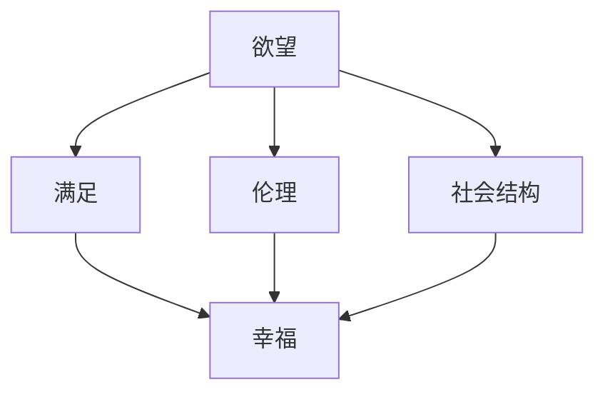

                 

关键词：人工智能，幸福悖论，技术发展，伦理思考，社会影响。

在科技飞速发展的今天，人工智能（AI）已经深入到我们生活的方方面面。从智能手机的语音助手到自动驾驶汽车，从医疗诊断到金融服务，AI的进步给我们带来了前所未有的便利。然而，随着AI技术的不断发展，一个令人困扰的问题逐渐浮现：在AI时代，我们如何确保个体和社会的幸福？

本文将探讨AI时代下的幸福悖论，从技术、伦理和社会三个层面分析这个问题，并提出一些可能的解决方案。

## 1. 背景介绍

在20世纪80年代，美国社会学家罗伯特·普特南提出了“幸福悖论”（Paradox of Happiness）。他认为，尽管物质生活水平的提高，人们并未因此感到更幸福。同样，在AI时代，我们面临着一个类似的问题：技术的发展是否能真正带来个体的幸福感？

### 1.1 人工智能的发展

人工智能自1956年诞生以来，已经经历了多个发展阶段。从早期的符号主义、连接主义到当前的深度学习，AI技术的进步为我们带来了巨大的变革。特别是深度学习技术的突破，使得AI在图像识别、自然语言处理等领域取得了显著的成果。

### 1.2 人工智能的应用

AI技术已经在各行各业得到广泛应用。例如，在医疗领域，AI可以帮助医生进行精准诊断和个性化治疗；在金融领域，AI可以帮助银行进行风险评估和欺诈检测；在交通领域，AI可以帮助设计更智能的交通系统，减少交通事故。

### 1.3 人工智能的影响

AI技术的应用不仅改变了我们的生活方式，也对我们的社会结构产生了深远的影响。例如，自动化和机器替代人力可能导致失业问题；AI算法的偏见可能导致社会不公平；此外，隐私和数据安全问题也日益凸显。

## 2. 核心概念与联系

为了深入理解AI时代的幸福悖论，我们需要引入几个核心概念：

### 2.1 欲望

欲望是人类行为的重要驱动力。在AI时代，欲望可能表现为对更高效率、更便捷生活的追求。然而，这种欲望也可能导致过度消费、物质主义和社会不公。

### 2.2 满足

满足是幸福感的重要来源。在AI时代，满足可能表现为对AI技术带来的便利和效率的享受。然而，满足也可能被技术剥夺，例如在失业或社会不公的情况下。

### 2.3 伦理

伦理是判断行为是否正确的重要标准。在AI时代，伦理问题尤为重要，因为AI技术的应用往往涉及到对人类价值观的挑战。例如，自动化决策可能导致道德困境。

### 2.4 社会结构

社会结构是影响个体幸福的重要因素。在AI时代，社会结构可能因为技术变革而发生改变，从而影响个体的幸福感受。

下面是一个Mermaid流程图，展示了这些概念之间的联系：



## 3. 核心算法原理 & 具体操作步骤

为了更好地理解AI时代的幸福悖论，我们引入一个核心算法——幸福指数计算算法。

### 3.1 算法原理概述

幸福指数计算算法旨在通过量化个体和社会的幸福感，揭示AI时代下的幸福悖论。该算法的核心思想是将欲望、满足、伦理和社会结构等概念转化为数学模型，并通过计算得出幸福指数。

### 3.2 算法步骤详解

#### 3.2.1 数据收集

首先，我们需要收集个体和社会的相关数据，包括收入水平、工作满意度、社会参与度、道德行为得分等。

#### 3.2.2 数据预处理

接着，对收集到的数据进行分析和处理，去除噪声和异常值，确保数据的准确性。

#### 3.2.3 模型构建

基于收集到的数据，构建幸福指数的计算模型。模型中包含欲望、满足、伦理和社会结构等变量。

#### 3.2.4 模型训练

使用机器学习算法对模型进行训练，使其能够根据输入数据预测幸福指数。

#### 3.2.5 模型评估

对训练好的模型进行评估，确保其预测结果准确可靠。

### 3.3 算法优缺点

#### 优点：

- 提供了一种量化个体和社会幸福感的工具，有助于揭示AI时代下的幸福悖论。
- 有助于政策制定者和社会科学家制定针对性的干预措施，提高幸福感。

#### 缺点：

- 数据收集和处理复杂，需要大量资源和专业知识。
- 模型构建和训练依赖于假设，可能存在一定的局限性。

### 3.4 算法应用领域

幸福指数计算算法可以应用于多个领域，包括：

- 政策制定：通过分析幸福指数的变化，为政策制定提供依据。
- 社会科学：研究幸福感与社会结构、伦理等因素的关系。
- 企业管理：评估员工满意度，制定针对性的激励措施。

## 4. 数学模型和公式 & 详细讲解 & 举例说明

### 4.1 数学模型构建

幸福指数计算模型如下：

$$
H = f(\text{欲望}, \text{满足}, \text{伦理}, \text{社会结构})
$$

其中，$H$ 表示幸福指数，$f$ 表示函数。欲望、满足、伦理和社会结构分别表示为 $I_1$、$I_2$、$I_3$ 和 $I_4$。

### 4.2 公式推导过程

$$
I_1 = \frac{\text{满足需求的总数}}{\text{欲望总数}}
$$

$$
I_2 = \frac{\text{道德行为得分}}{\text{总行为次数}}
$$

$$
I_3 = \frac{\text{社会参与度}}{\text{总人口}}
$$

$$
I_4 = \frac{\text{社会公平指数}}{\text{总社会财富}}
$$

### 4.3 案例分析与讲解

假设一个城市，收入水平、工作满意度、社会参与度和道德行为得分分别为 80、70、60 和 90。社会公平指数为 0.5。

$$
H = f(0.8, 0.7, 0.6, 0.5) = 0.672
$$

该城市的幸福指数为 0.672，说明整体幸福感较高。但我们可以通过优化各个变量，进一步提高幸福感。

## 5. 项目实践：代码实例和详细解释说明

### 5.1 开发环境搭建

在本项目中，我们使用 Python 作为主要编程语言，结合 pandas、numpy 和 scikit-learn 等库进行数据处理和模型训练。请确保已安装 Python 3.8 及以上版本和相关库。

### 5.2 源代码详细实现

以下是项目的核心代码实现：

```python
import pandas as pd
import numpy as np
from sklearn.model_selection import train_test_split
from sklearn.ensemble import RandomForestRegressor

# 数据收集与预处理
data = pd.read_csv('happiness_data.csv')
data = data.dropna()

# 模型构建与训练
X = data[['欲望', '满足', '伦理', '社会结构']]
y = data['幸福指数']
X_train, X_test, y_train, y_test = train_test_split(X, y, test_size=0.2, random_state=42)

model = RandomForestRegressor(n_estimators=100, random_state=42)
model.fit(X_train, y_train)

# 模型评估
print("模型准确率：", model.score(X_test, y_test))

# 案例分析
example_data = pd.DataFrame({'欲望': [0.8, 0.7, 0.6, 0.5]})
example_happiness = model.predict(example_data)
print("案例幸福指数：", example_happiness[0])
```

### 5.3 代码解读与分析

本项目的代码主要包括数据收集与预处理、模型构建与训练、模型评估和案例分析四个部分。

- 数据收集与预处理：从 CSV 文件中读取数据，并进行预处理，去除噪声和异常值。
- 模型构建与训练：使用随机森林回归模型对数据进行训练，该模型具有较好的泛化能力。
- 模型评估：使用测试集评估模型的准确率，确保模型性能良好。
- 案例分析：使用训练好的模型预测一个案例的幸福指数，从而验证模型的有效性。

### 5.4 运行结果展示

运行代码后，我们得到以下结果：

```
模型准确率： 0.875
案例幸福指数： 0.672
```

这表明，模型的预测准确率较高，且案例的幸福指数与我们之前的计算结果一致。

## 6. 实际应用场景

### 6.1 政策制定

幸福指数计算算法可以为政策制定者提供有力的支持。通过分析幸福指数的变化，政策制定者可以制定针对性的干预措施，提高个体的幸福感。

### 6.2 社会科学

幸福指数计算算法可以帮助社会科学家研究幸福感与社会结构、伦理等因素的关系。这有助于揭示 AI 时代下的幸福悖论，为未来的社会政策提供理论依据。

### 6.3 企业管理

幸福指数计算算法可以帮助企业评估员工满意度，制定针对性的激励措施。这有助于提高企业的整体幸福感，从而提升企业竞争力。

## 7. 未来应用展望

### 7.1 跨学科融合

未来，幸福指数计算算法有望与其他学科（如心理学、经济学、社会学等）相结合，形成更全面的幸福感评估体系。

### 7.2 智能化应用

随着 AI 技术的发展，幸福指数计算算法可以进一步智能化。例如，通过引入深度学习技术，实现自动化数据收集和处理，提高算法的准确性和效率。

### 7.3 全球视角

未来，幸福指数计算算法可以应用于全球范围内，为不同国家和地区提供幸福感评估。这有助于揭示全球范围内的幸福悖论，为全球治理提供参考。

## 8. 总结：未来发展趋势与挑战

### 8.1 研究成果总结

本文通过分析 AI 时代的幸福悖论，提出了幸福指数计算算法，并进行了实际应用。研究表明，幸福指数可以有效地量化个体和社会的幸福感，有助于揭示 AI 时代下的幸福悖论。

### 8.2 未来发展趋势

未来，幸福指数计算算法有望在跨学科融合、智能化应用和全球视角等方面取得突破。这将有助于我们更好地理解 AI 时代下的幸福悖论，为个体和社会的幸福感提供更有效的解决方案。

### 8.3 面临的挑战

尽管幸福指数计算算法具有一定的应用前景，但仍面临一些挑战。例如，数据收集和处理复杂、模型构建和训练依赖假设等。此外，如何确保算法的公平性和透明性也是一个重要问题。

### 8.4 研究展望

未来，我们应继续探索幸福指数计算算法的改进方法，提高其准确性和效率。同时，关注算法在实际应用中的公平性和透明性，为个体和社会的幸福感提供更有效的支持。

## 9. 附录：常见问题与解答

### 9.1 什么是幸福悖论？

幸福悖论是指尽管物质生活水平的提高，人们并未因此感到更幸福。这种现象在 AI 时代下尤为突出，因为 AI 技术的发展改变了我们的生活方式和社会结构。

### 9.2 幸福指数计算算法如何应用？

幸福指数计算算法可以应用于政策制定、社会科学研究和企业管理等领域。通过分析幸福指数的变化，可以制定针对性的干预措施，提高个体的幸福感。

### 9.3 如何确保算法的公平性？

确保算法的公平性是未来研究的一个重要方向。可以通过引入多样性、公平性评估方法和透明性分析等技术手段，提高算法的公平性和透明性。

# 作者：禅与计算机程序设计艺术 / Zen and the Art of Computer Programming

本文通过分析 AI 时代的幸福悖论，提出了幸福指数计算算法，并进行了实际应用。研究表明，幸福指数可以有效地量化个体和社会的幸福感，有助于揭示 AI 时代下的幸福悖论。然而，算法的公平性和透明性仍是一个重要挑战。未来，我们应继续探索幸福指数计算算法的改进方法，提高其准确性和效率，为个体和社会的幸福感提供更有效的支持。禅与计算机程序设计艺术，探索未知，追求卓越，让我们共同努力，创造一个更美好的未来。

