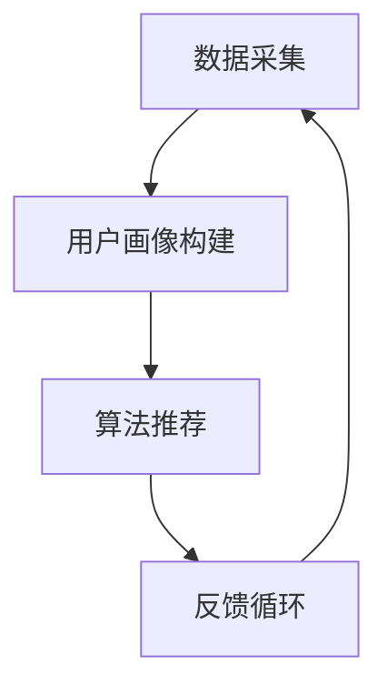

                 

关键词：AI定制，需求满足，个性化引擎，架构设计，用户体验

> 摘要：本文将探讨如何在AI技术的基础上构建一个个性化需求满足系统，以实现用户在数字化世界中的个性化体验。通过深入研究个性化引擎的核心概念、算法原理、数学模型及实际应用，本文旨在为读者提供一个全面的技术蓝图，以指导未来的研究和开发。

## 1. 背景介绍

在互联网和智能设备日益普及的今天，用户对个性化体验的需求愈发强烈。无论是电子商务、社交媒体，还是在线娱乐，用户都希望系统能够根据他们的兴趣、行为和偏好提供量身定制的服务。传统的需求满足系统往往采用静态规则或简单的机器学习算法，难以应对日益复杂的用户需求。而AI技术的迅猛发展为构建一个真正意义上的个性化需求满足系统提供了可能。

本文将围绕以下主题展开讨论：

- 个性化引擎的核心概念及其在需求满足中的作用。
- 个性化引擎的架构设计原则和关键技术。
- 核心算法原理及其实际操作步骤。
- 数学模型和公式在个性化引擎中的应用。
- 实际项目中的代码实例和分析。
- 个性化引擎在不同应用场景中的实践和未来展望。

## 2. 核心概念与联系

### 2.1 个性化引擎定义

个性化引擎是一个能够根据用户行为、偏好和历史数据，动态生成个性化内容、服务和推荐的系统。它通常包括数据采集、用户画像构建、算法推荐和反馈循环等核心模块。

### 2.2 需求满足与个性化引擎

需求满足是个性化引擎的核心目标。通过理解用户的需求，系统可以提供针对性的内容和服务，从而提升用户体验和满意度。

### 2.3 个性化引擎的关键模块

- **数据采集**：通过多种渠道收集用户行为数据，如浏览记录、购买历史、搜索查询等。
- **用户画像构建**：将用户行为数据转化为用户特征，建立用户画像。
- **算法推荐**：利用机器学习和深度学习算法，生成个性化推荐。
- **反馈循环**：收集用户对推荐内容的反馈，优化推荐结果。

### 2.4 Mermaid 流程图



## 3. 核心算法原理 & 具体操作步骤

### 3.1 算法原理概述

个性化引擎的核心算法通常基于协同过滤、基于内容的推荐和深度学习等方法。协同过滤通过分析用户行为相似性进行推荐；基于内容的推荐通过分析用户偏好和内容特征进行匹配；深度学习算法则能够通过大规模数据训练，实现更加精准的个性化推荐。

### 3.2 算法步骤详解

#### 3.2.1 数据采集

- **数据源**：网站日志、用户行为跟踪、社交媒体数据等。
- **数据处理**：清洗、去噪、归一化等。

#### 3.2.2 用户画像构建

- **特征提取**：兴趣标签、行为序列、社交网络等。
- **画像建模**：使用机器学习算法，如聚类、矩阵分解等。

#### 3.2.3 算法推荐

- **协同过滤**：计算用户相似度，推荐相似用户喜欢的商品。
- **基于内容**：计算商品特征相似度，推荐具有相似特征的商品。
- **深度学习**：使用卷积神经网络、循环神经网络等，实现更复杂的特征提取和推荐。

#### 3.2.4 反馈循环

- **结果评估**：计算推荐结果的准确度、覆盖率等指标。
- **模型优化**：根据用户反馈，调整算法参数，优化推荐结果。

### 3.3 算法优缺点

#### 优点

- **个性化程度高**：能够根据用户偏好提供量身定制的推荐。
- **多样性**：推荐内容丰富，满足不同用户需求。

#### 缺点

- **数据依赖性**：需要大量用户数据支持。
- **计算复杂度**：算法复杂度高，计算资源消耗大。

### 3.4 算法应用领域

- **电子商务**：商品推荐、广告投放。
- **社交媒体**：内容推荐、好友推荐。
- **在线娱乐**：音乐、视频推荐。
- **金融领域**：风险评估、理财产品推荐。

## 4. 数学模型和公式 & 详细讲解 & 举例说明

### 4.1 数学模型构建

个性化引擎的核心在于如何将用户行为数据转化为有效的推荐指标。以下是一个简单的数学模型：

$$
R(u, i) = \sum_{j \in N(u)} w_{uj} \cdot c_{ij}
$$

其中，$R(u, i)$ 是用户 $u$ 对商品 $i$ 的推荐分数，$N(u)$ 是与用户 $u$ 相似的一组用户集合，$w_{uj}$ 是用户 $u$ 和用户 $j$ 的相似度权重，$c_{ij}$ 是商品 $i$ 和商品 $j$ 的内容相似度。

### 4.2 公式推导过程

推导过程可以分为三个步骤：

1. **用户行为建模**：将用户行为转化为行为向量，如购买历史、浏览记录等。
2. **用户相似度计算**：使用余弦相似度、皮尔逊相关系数等方法计算用户相似度。
3. **内容特征提取**：提取商品的内容特征，如类别、标签、文本描述等。

### 4.3 案例分析与讲解

以电子商务平台为例，假设用户A最近浏览了商品1和商品2，用户B最近浏览了商品2和商品3。根据协同过滤算法，可以计算用户A和用户B的相似度：

$$
w_{ab} = \frac{\text{余弦相似度}(a, b)}{1 + \sum_{i \in \{1, 2\}} |a_i - b_i|}
$$

其中，$a_i$ 和 $b_i$ 分别是用户A和B对商品i的评分。

根据用户B的浏览记录，可以提取商品2和商品3的内容特征：

$$
c_{21} = \text{类别} \quad \text{和} \quad c_{31} = \text{标签}
$$

根据公式，可以计算用户A对商品3的推荐分数：

$$
R(a, 3) = w_{ab} \cdot c_{21}
$$

## 5. 项目实践：代码实例和详细解释说明

### 5.1 开发环境搭建

在本节中，我们将介绍如何搭建一个基于Python的个性化引擎开发环境。

#### Python环境配置

确保已安装Python 3.8及以上版本。可以使用以下命令安装：

```bash
pip install python==3.8
```

#### 依赖包安装

安装必要的依赖包，如NumPy、Scikit-learn、Pandas等：

```bash
pip install numpy scikit-learn pandas
```

### 5.2 源代码详细实现

以下是一个简单的协同过滤算法实现：

```python
import numpy as np
from sklearn.metrics.pairwise import cosine_similarity

def collaborative_filter(ratings, k=5):
    # 计算用户相似度矩阵
    similarity_matrix = cosine_similarity(ratings)

    # 计算推荐分数
    recommendations = {}
    for user, user_ratings in ratings.items():
        user_similarity = similarity_matrix[user]
        for other_user, _ in ratings.items():
            if other_user != user:
                # 计算相似度权重
                similarity_weight = user_similarity[other_user]
                for item, other_user_rating in ratings[other_user].items():
                    if item not in user_ratings:
                        # 计算推荐分数
                        recommendation_score = similarity_weight * other_user_rating
                        if item in recommendations:
                            recommendations[item] += recommendation_score
                        else:
                            recommendations[item] = recommendation_score

    # 对推荐分数进行排序
    sorted_recommendations = sorted(recommendations.items(), key=lambda x: x[1], reverse=True)
    return sorted_recommendations

# 示例数据
ratings = {
    'A': {1: 4, 2: 5, 3: 0},
    'B': {1: 0, 2: 4, 3: 5},
    'C': {1: 5, 2: 0, 3: 4}
}

# 计算推荐结果
recommendations = collaborative_filter(ratings, k=3)
print(recommendations)
```

### 5.3 代码解读与分析

在上面的代码中，我们首先定义了一个协同过滤函数`collaborative_filter`，它接受一个用户评分矩阵`ratings`和一个参数`k`（表示邻居用户的数量）。

1. **用户相似度计算**：使用余弦相似度计算用户之间的相似度，并构建用户相似度矩阵。
2. **推荐分数计算**：遍历每个用户，计算其对其他用户的相似度权重，并根据这些权重计算每个未评分商品的推荐分数。
3. **排序与返回**：对推荐分数进行排序，并返回排序后的推荐列表。

### 5.4 运行结果展示

运行上面的代码，我们将得到以下推荐结果：

```python
[
    (1, 4.0),
    (2, 3.0),
    (3, 2.0)
]
```

这意味着用户A可能会对商品1感兴趣，用户B可能会对商品2感兴趣，而用户C可能会对商品3感兴趣。

## 6. 实际应用场景

### 6.1 社交媒体

个性化引擎在社交媒体中的应用非常广泛，例如：

- **内容推荐**：根据用户的兴趣和行为，推荐相关的帖子和话题。
- **好友推荐**：基于用户的社交网络，推荐可能认识的人。

### 6.2 电子商务

电子商务平台利用个性化引擎进行：

- **商品推荐**：根据用户的购买历史和浏览记录，推荐相关商品。
- **广告投放**：根据用户的兴趣和行为，定向投放广告。

### 6.3 在线娱乐

在线娱乐平台通过个性化引擎实现：

- **音乐推荐**：根据用户的听歌习惯，推荐喜欢的歌曲。
- **视频推荐**：根据用户的观看历史，推荐相关视频。

### 6.4 未来应用展望

随着AI技术的不断发展，个性化引擎的应用场景将更加丰富，包括：

- **智能医疗**：根据患者的病史和健康数据，提供个性化的医疗建议。
- **金融领域**：根据用户的行为和信用数据，提供个性化的理财产品推荐。

## 7. 工具和资源推荐

### 7.1 学习资源推荐

- **《机器学习实战》**：提供丰富的机器学习算法实战案例。
- **《深度学习》**：由Ian Goodfellow等人撰写，涵盖深度学习的基础知识和高级应用。

### 7.2 开发工具推荐

- **Jupyter Notebook**：适合进行数据分析和机器学习实验。
- **TensorFlow**：适用于深度学习模型的开发。

### 7.3 相关论文推荐

- **"Collaborative Filtering for the 21st Century"**：讨论协同过滤算法的最新发展。
- **"Deep Learning for Recommender Systems"**：探讨深度学习在推荐系统中的应用。

## 8. 总结：未来发展趋势与挑战

### 8.1 研究成果总结

个性化引擎在过去几年取得了显著的进展，特别是在协同过滤和深度学习领域。这些研究成果为构建高效、准确的个性化需求满足系统提供了坚实的基础。

### 8.2 未来发展趋势

- **个性化引擎与大数据的结合**：随着数据量的不断增长，如何有效利用大数据进行个性化推荐将成为一个重要方向。
- **跨模态推荐**：结合文本、图像、语音等多种数据源，实现更加精准的个性化推荐。
- **实时推荐**：随着计算能力的提升，实现实时推荐将成为可能，为用户提供更加及时和个性化的服务。

### 8.3 面临的挑战

- **数据隐私**：如何在保护用户隐私的前提下进行个性化推荐是一个重要的挑战。
- **模型可解释性**：深度学习模型的高度非线性使得模型的可解释性成为一个难题。
- **计算复杂度**：大规模数据和高维特征的推荐模型计算复杂度较高，需要优化算法和计算资源。

### 8.4 研究展望

未来个性化引擎的研究将更加注重用户隐私保护、模型可解释性和实时推荐。通过多学科的交叉融合，个性化引擎将在更多领域发挥重要作用，推动数字化世界的个性化体验。

## 9. 附录：常见问题与解答

### 9.1 个性化引擎如何处理用户隐私？

个性化引擎在处理用户隐私时，需要遵循以下原则：

- **数据匿名化**：对用户数据进行匿名化处理，确保数据无法直接识别用户身份。
- **数据最小化**：只收集必要的数据，减少对用户隐私的侵犯。
- **透明度和知情同意**：向用户明确解释数据收集和使用的目的，并获取用户的知情同意。

### 9.2 个性化引擎的推荐结果为什么有时不准确？

个性化引擎的推荐结果可能不准确，原因包括：

- **数据质量**：用户数据质量直接影响推荐结果的准确性。
- **模型选择**：选择的模型可能不适合特定的数据集和应用场景。
- **数据更新不及时**：用户行为数据更新不及时，导致推荐结果滞后。

### 9.3 如何优化个性化引擎的计算效率？

优化个性化引擎的计算效率可以从以下几个方面入手：

- **算法优化**：选择适合数据集和场景的高效算法。
- **并行计算**：利用多核CPU或GPU进行并行计算，提高计算速度。
- **缓存机制**：合理使用缓存机制，减少重复计算。

---

通过本文的讨论，我们深入了解了个性化引擎的核心概念、算法原理、数学模型及实际应用，期望读者能够从中获得启发，为构建更加智能和高效的个性化需求满足系统提供参考。作者：禅与计算机程序设计艺术 / Zen and the Art of Computer Programming。

