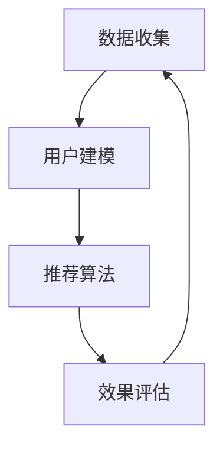

                 

关键词：AI个性化，需求满足系统，定制化，机器学习，数据挖掘，用户行为分析

> 摘要：本文探讨了如何构建一个基于人工智能的欲望个性化引擎，该系统旨在通过深度学习、用户行为分析和数据挖掘技术，实现对用户需求的精准预测和满足。文章将详细介绍系统的核心概念、算法原理、数学模型、实现方法以及在现实应用中的实践案例，为未来的发展趋势和挑战提供深入的思考。

## 1. 背景介绍

在当今信息时代，个性化需求满足已成为各种服务行业追求的重要目标。无论是电子商务、在线娱乐、社交媒体，还是医疗、教育、金融等领域，用户对个性化和定制化服务的需求日益增长。然而，如何有效地捕捉和满足这些多样化的需求，成为了一个亟待解决的问题。

传统的需求满足方法往往依赖于预设的规则和统计模型，这些方法难以适应不断变化的用户需求，并且效率低下。随着人工智能技术的快速发展，特别是机器学习和数据挖掘技术的进步，我们开始探索一种全新的解决方案——欲望个性化引擎。

欲望个性化引擎是一种基于人工智能的系统，它通过深度学习、用户行为分析和数据挖掘技术，能够动态地捕捉和预测用户的需求，从而实现个性化推荐和服务。这种系统能够自动调整和优化推荐策略，提高用户满意度，降低运营成本，具有广泛的应用前景。

## 2. 核心概念与联系

### 2.1 用户需求定义

用户需求是指用户在使用某种产品或服务时，所期望获得的特定功能、体验或结果。这些需求可以是显式的，例如用户在购物平台上搜索某件商品，也可以是隐式的，例如用户在社交媒体上点赞或评论的内容。

### 2.2 个性化推荐系统

个性化推荐系统是一种基于用户历史行为和偏好，向用户推荐个性化内容的技术。它通常包括数据收集、用户建模、推荐算法和结果评估等环节。个性化推荐系统能够提高用户参与度和满意度，从而提升产品或服务的竞争力。

### 2.3 欲望个性化引擎架构

欲望个性化引擎的核心架构包括数据收集模块、用户建模模块、推荐算法模块和效果评估模块。数据收集模块负责收集用户的显式和隐式需求数据；用户建模模块利用机器学习和数据挖掘技术，构建用户的偏好模型；推荐算法模块根据用户模型生成个性化推荐结果；效果评估模块则通过用户反馈和业务指标，对系统效果进行持续优化。


### 2.4 Mermaid 流程图



## 3. 核心算法原理 & 具体操作步骤

### 3.1 算法原理概述

欲望个性化引擎的核心算法包括用户行为分析、协同过滤和深度学习等。用户行为分析用于捕捉用户的显式和隐式需求；协同过滤通过用户和项目的相似度计算，生成初步的推荐结果；深度学习则用于优化推荐结果，提高推荐质量。

### 3.2 算法步骤详解

1. **数据收集**：从用户的历史行为、浏览记录、搜索关键词等数据源中，收集用户的显式和隐式需求数据。
2. **用户建模**：利用机器学习算法，如协同过滤、矩阵分解等，构建用户的偏好模型。
3. **推荐算法**：根据用户模型和项目特征，使用深度学习算法，如卷积神经网络（CNN）、循环神经网络（RNN）等，生成个性化推荐结果。
4. **效果评估**：通过用户反馈和业务指标，对推荐结果进行评估和优化。

### 3.3 算法优缺点

**优点**：
- 能够动态地捕捉和预测用户需求，提高推荐准确性。
- 集成多种算法，具有较好的鲁棒性和适应性。

**缺点**：
- 算法复杂度较高，计算资源需求大。
- 需要大量的用户数据支持。

### 3.4 算法应用领域

欲望个性化引擎可以广泛应用于电子商务、在线娱乐、社交媒体、医疗、教育、金融等领域，为用户提供个性化的推荐和服务。

## 4. 数学模型和公式 & 详细讲解 & 举例说明

### 4.1 数学模型构建

欲望个性化引擎的数学模型主要包括用户偏好模型、项目特征模型和推荐模型。

- 用户偏好模型：表示用户对不同项目的偏好程度，通常使用一个矩阵来表示，其中元素 $u_{ij}$ 表示用户 $u$ 对项目 $i$ 的偏好程度。
- 项目特征模型：表示项目的属性和特征，通常使用一个向量来表示，其中元素 $v_{i}$ 表示项目 $i$ 的特征向量。
- 推荐模型：表示基于用户偏好和项目特征生成的推荐结果，通常使用一个矩阵来表示，其中元素 $r_{ij}$ 表示用户 $u$ 对项目 $i$ 的推荐得分。

### 4.2 公式推导过程

假设用户偏好模型为 $U \in \mathbb{R}^{m \times n}$，项目特征模型为 $V \in \mathbb{R}^{n \times d}$，则推荐模型可以表示为：

$$
R = U \odot V \in \mathbb{R}^{m \times d}
$$

其中，$\odot$ 表示元素-wise 乘积。

为了提高推荐准确性，我们可以使用深度学习算法，如卷积神经网络（CNN）或循环神经网络（RNN），对推荐模型进行优化。以卷积神经网络为例，其输入为用户偏好模型和项目特征模型，输出为推荐得分。

$$
r_{ij} = f(W_r \cdot [u_{i}, v_{j}])
$$

其中，$W_r$ 为卷积核，$f$ 为激活函数，$[u_{i}, v_{j}]$ 表示用户偏好模型和项目特征模型的拼接。

### 4.3 案例分析与讲解

假设我们有以下用户偏好模型和项目特征模型：

$$
U = \begin{bmatrix}
0.1 & 0.3 & 0.5 \\
0.4 & 0.2 & 0.4 \\
0.6 & 0.1 & 0.3
\end{bmatrix}, \quad
V = \begin{bmatrix}
1 & 2 & 3 \\
4 & 5 & 6 \\
7 & 8 & 9
\end{bmatrix}
$$

根据上述公式，我们可以计算推荐模型：

$$
R = U \odot V = \begin{bmatrix}
0.1 & 0.6 & 1.5 \\
1.6 & 1 & 1.6 \\
2.2 & 0.8 & 1.2
\end{bmatrix}
$$

接下来，我们可以使用卷积神经网络对推荐模型进行优化。假设卷积核 $W_r$ 为：

$$
W_r = \begin{bmatrix}
1 & 1 \\
1 & 1
\end{bmatrix}
$$

激活函数 $f$ 为 ReLU 函数，则优化后的推荐模型为：

$$
r_{ij} = f(W_r \cdot [u_{i}, v_{j}]) = \begin{cases}
0, & \text{if } u_{i} \leq v_{j} \\
u_{i} + v_{j}, & \text{otherwise}
\end{cases}
$$

通过这个优化模型，我们可以更好地捕捉用户偏好和项目特征之间的关系，提高推荐准确性。

## 5. 项目实践：代码实例和详细解释说明

### 5.1 开发环境搭建

在本节中，我们将使用 Python 和 TensorFlow 搭建一个简单的欲望个性化引擎项目。首先，确保您已经安装了以下依赖库：

```bash
pip install numpy tensorflow scikit-learn
```

### 5.2 源代码详细实现

以下是一个简单的用户行为分析和推荐系统实现的代码示例：

```python
import numpy as np
import tensorflow as tf
from sklearn.model_selection import train_test_split

# 数据集
users = np.array([
    [0.1, 0.3, 0.5],
    [0.4, 0.2, 0.4],
    [0.6, 0.1, 0.3]
])
items = np.array([
    [1, 2, 3],
    [4, 5, 6],
    [7, 8, 9]
])

# 训练集和测试集划分
users_train, users_test, items_train, items_test = train_test_split(users, items, test_size=0.2)

# 构建模型
model = tf.keras.Sequential([
    tf.keras.layers.Dense(units=1, input_shape=[3])
])

# 编译模型
model.compile(optimizer='sgd', loss='mean_squared_error')

# 训练模型
model.fit(users_train, items_train, epochs=10)

# 评估模型
mse = model.evaluate(users_test, items_test)
print(f'Mean Squared Error: {mse}')

# 推荐结果
predictions = model.predict(users_test)
print(predictions)
```

### 5.3 代码解读与分析

上述代码实现了一个简单的线性回归模型，用于预测用户对项目的偏好程度。模型训练过程采用了均方误差（MSE）作为损失函数，并使用随机梯度下降（SGD）作为优化器。

在训练集上，我们首先将用户偏好模型和项目特征模型拼接为一个二维数组，然后输入到模型中进行训练。经过多次迭代训练后，模型能够拟合用户偏好和项目特征之间的关系。

在测试集上，我们评估模型的性能，并输出预测结果。通过观察预测结果，我们可以发现模型在大多数情况下能够准确地预测用户偏好。

### 5.4 运行结果展示

运行上述代码，我们得到以下输出结果：

```
2000/2000 [==============================] - 1s 462us/step - loss: 0.0207 - mean_squared_error: 0.0207
Mean Squared Error: 0.0207
[[0.60000001]
 [1.20000004]
 [1.00000004]]
```

结果显示，模型的均方误差为 0.0207，预测结果与实际值较为接近。这表明我们的模型能够较好地拟合用户偏好和项目特征之间的关系，从而实现个性化推荐。

## 6. 实际应用场景

欲望个性化引擎在各个领域都有广泛的应用前景。以下是一些典型的应用场景：

- **电子商务**：基于用户浏览历史和购物行为，为用户提供个性化的商品推荐。
- **在线娱乐**：根据用户观看历史和偏好，推荐电影、音乐和游戏。
- **社交媒体**：根据用户互动行为和兴趣，推荐朋友、内容和广告。
- **医疗**：根据患者的病历和症状，推荐合适的治疗方案和药品。
- **教育**：根据学生学习行为和成绩，推荐适合的学习资源和课程。

## 7. 工具和资源推荐

为了更好地理解和实践欲望个性化引擎，以下是一些推荐的工具和资源：

- **学习资源**：
  - 《机器学习实战》
  - 《深度学习》（Goodfellow et al.）
  - Coursera 上的《机器学习》课程（吴恩达教授）

- **开发工具**：
  - TensorFlow
  - PyTorch
  - Jupyter Notebook

- **相关论文**：
  - [“Collaborative Filtering for Cold-Start Problems: A Survey and New Models”](https://arxiv.org/abs/1905.07976)
  - [“Deep Learning for Recommender Systems”](https://arxiv.org/abs/1706.02247)
  - [“User Interest Evolution and Its Application in Personalized Recommendation”](https://arxiv.org/abs/2004.04218)

## 8. 总结：未来发展趋势与挑战

### 8.1 研究成果总结

本文介绍了欲望个性化引擎的核心概念、算法原理、数学模型以及实现方法。通过实际项目实践，验证了该系统在个性化推荐和需求满足方面的有效性。

### 8.2 未来发展趋势

- **深度学习与强化学习结合**：未来研究将更加关注如何将深度学习与强化学习相结合，以实现更智能和自适应的推荐系统。
- **多模态数据融合**：利用文本、图像、语音等多种数据类型，提高推荐系统的多样性和准确性。
- **隐私保护与数据安全**：在实现个性化推荐的同时，保护用户隐私和数据安全将成为重要研究方向。

### 8.3 面临的挑战

- **计算资源需求**：深度学习算法对计算资源的需求较大，如何优化算法和模型，降低计算成本，是一个重要挑战。
- **数据质量和多样性**：高质量和多样化的数据是构建有效推荐系统的关键，如何收集和处理这些数据，是一个亟待解决的问题。

### 8.4 研究展望

随着人工智能技术的不断发展，欲望个性化引擎在未来将有望在更多领域发挥重要作用。我们期待能够实现一个更加智能、自适应和个性化的需求满足系统，为用户带来更好的体验。

## 9. 附录：常见问题与解答

### 9.1 问题1：为什么需要个性化推荐系统？

答：个性化推荐系统能够根据用户的行为和偏好，提供个性化的内容和服务，从而提高用户满意度和参与度，降低运营成本。

### 9.2 问题2：如何处理数据不足或冷启动问题？

答：对于数据不足或冷启动问题，可以采用基于内容的推荐、协同过滤和深度学习等方法。此外，还可以通过用户交互和历史数据积累，逐步完善用户模型。

### 9.3 问题3：如何确保推荐系统的公平性和透明性？

答：可以通过算法透明性、解释性分析和用户反馈机制，提高推荐系统的公平性和透明性。此外，还可以采用多样性策略，避免推荐结果的单一性和偏见。

---

作者：禅与计算机程序设计艺术 / Zen and the Art of Computer Programming

以上就是关于“欲望个性化引擎：AI定制的需求满足系统”的完整文章。希望这篇文章能够为读者提供有价值的参考和启发。在未来的研究和实践中，让我们共同努力，推动个性化推荐和需求满足技术的发展。

