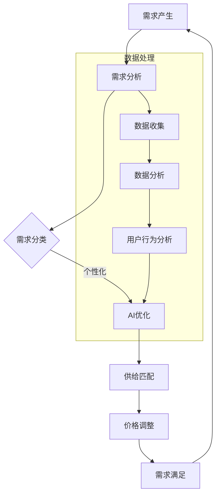

                 

关键词：欲望循环、经济模型、AI优化、需求满足、系统架构师、AI设计

> 摘要：本文将深入探讨如何利用人工智能技术来优化需求满足系统，进而设计出一种全新的欲望循环经济模型。通过分析核心概念、算法原理、数学模型、项目实践以及实际应用场景，本文旨在为读者提供一个全面的技术视角，以应对未来复杂的经济和社会需求。

## 1. 背景介绍

随着全球化的加速和信息技术的飞速发展，现代社会正在经历一场前所未有的变革。在这个变革过程中，人们对物质和服务的需求呈现出多样化和个性化的特点，而传统的经济模型已难以满足这些日益复杂的需求。为了应对这一挑战，人工智能（AI）技术的应用逐渐成为优化需求满足系统的关键途径。

AI技术不仅能够通过对海量数据的分析和处理，识别出潜在的需求模式，还可以通过机器学习算法，预测和满足用户的需求。因此，本文将探讨如何利用AI技术来设计一种新型的欲望循环经济模型，以实现高效的需求满足。

### 1.1 欲望循环概念

欲望循环是一种基于人类需求和经济活动的循环模型。它描述了从需求产生、满足、再到新需求产生的整个过程。这一模型的核心在于通过不断满足用户的需求，从而推动经济的持续发展。

### 1.2 经济模型的重要性

经济模型是分析和预测经济活动的重要工具。通过构建经济模型，我们可以更好地理解市场运行机制，预测未来发展趋势，从而为政策制定和企业决策提供科学依据。在AI技术的支持下，经济模型可以更加精准和动态。

## 2. 核心概念与联系

为了更好地理解欲望循环经济模型，我们需要明确一些核心概念，并展示它们之间的联系。

### 2.1 核心概念

- **需求**：指个体在特定情境下对某种物品或服务的欲望。
- **供给**：指市场上可提供的商品或服务数量。
- **价格**：商品或服务的价值衡量。
- **AI优化**：利用人工智能技术对经济活动进行优化，提高效率。

### 2.2 核心概念原理与架构

以下是一个基于Mermaid绘制的流程图，展示了欲望循环经济模型的核心概念和架构。



## 3. 核心算法原理 & 具体操作步骤

### 3.1 算法原理概述

欲望循环经济模型的核心算法是基于机器学习的需求预测和供给优化算法。该算法通过分析用户的历史行为数据，预测未来的需求趋势，并据此调整供给和价格，以满足用户需求。

### 3.2 算法步骤详解

#### 3.2.1 数据收集与预处理

- **数据收集**：从多个渠道收集用户行为数据，如购物记录、搜索历史、社交媒体活动等。
- **数据预处理**：对收集的数据进行清洗、去噪、归一化等处理，以获得高质量的数据集。

#### 3.2.2 需求预测

- **特征工程**：根据业务需求，提取有用的特征，如用户年龄、地理位置、消费习惯等。
- **模型训练**：利用机器学习算法（如随机森林、神经网络等）对特征进行建模，预测未来的需求。

#### 3.2.3 供给优化

- **供给预测**：基于需求预测结果，预测供给需求。
- **优化策略**：通过优化算法（如线性规划、遗传算法等），调整供给策略，以最大化经济效益。

#### 3.2.4 价格调整

- **价格模型**：根据市场供需关系，构建价格模型。
- **价格优化**：利用优化算法，调整价格策略，以平衡供需。

### 3.3 算法优缺点

#### 优点

- **高效性**：通过机器学习算法，可以快速、准确地预测需求。
- **灵活性**：可以根据实时数据动态调整供给和价格。

#### 缺点

- **数据依赖性**：算法性能高度依赖于数据质量和多样性。
- **计算复杂性**：优化算法的计算复杂度较高，可能需要较长的时间。

### 3.4 算法应用领域

- **电子商务**：通过优化供需关系，提高销售效率。
- **物流管理**：优化库存和运输策略，降低成本。
- **金融行业**：预测市场趋势，指导投资决策。

## 4. 数学模型和公式 & 详细讲解 & 举例说明

### 4.1 数学模型构建

欲望循环经济模型可以表示为一个包含需求、供给和价格的动态系统。假设需求函数为 \(D(q)\)，供给函数为 \(S(q)\)，价格函数为 \(P(q)\)，其中 \(q\) 为市场需求量。则模型可以表示为：

$$
\begin{cases}
D(q) = f_1(q, P(q), t) \\
S(q) = f_2(q, P(q), t) \\
P(q) = f_3(q, D(q), S(q), t)
\end{cases}
$$

其中，\(f_1\)、\(f_2\) 和 \(f_3\) 分别为需求、供给和价格函数，\(t\) 为时间变量。

### 4.2 公式推导过程

#### 4.2.1 需求函数

需求函数 \(D(q)\) 通常可以表示为：

$$
D(q) = a - bP(q)
$$

其中，\(a\) 为需求基数，\(b\) 为价格敏感度。

#### 4.2.2 供给函数

供给函数 \(S(q)\) 可以表示为：

$$
S(q) = c + dP(q)
$$

其中，\(c\) 为供给基数，\(d\) 为价格敏感度。

#### 4.2.3 价格函数

价格函数 \(P(q)\) 可以表示为：

$$
P(q) = \frac{e + fD(q)}{g + hS(q)}
$$

其中，\(e\) 和 \(f\) 为常数，\(g\) 和 \(h\) 为价格调整系数。

### 4.3 案例分析与讲解

#### 4.3.1 案例背景

假设某电商平台的商品需求、供给和价格函数分别为：

$$
\begin{cases}
D(q) = 1000 - 10P(q) \\
S(q) = 500 + 5P(q) \\
P(q) = \frac{200 + 0.1D(q)}{300 + 0.2S(q)}
\end{cases}
$$

#### 4.3.2 需求预测

假设当前市场需求量为 \(q_0 = 800\)，我们可以利用需求函数预测未来的需求量：

$$
D(q_1) = 1000 - 10P(q_1)
$$

将价格函数代入需求函数，得到：

$$
D(q_1) = 1000 - 10 \times \frac{200 + 0.1D(q_1)}{300 + 0.2S(q_1)}
$$

解这个方程，可以得到未来的需求量 \(q_1\)。

#### 4.3.3 供给优化

根据需求预测结果，我们可以调整供给量 \(S(q_1)\)，以平衡供需：

$$
S(q_1) = 500 + 5P(q_1)
$$

再次利用价格函数，得到最优的供给量 \(S(q_1)\)。

#### 4.3.4 价格调整

根据供需平衡情况，我们可以调整价格 \(P(q_1)\)，以引导消费者需求：

$$
P(q_1) = \frac{200 + 0.1D(q_1)}{300 + 0.2S(q_1)}
$$

通过调整价格，可以进一步优化需求满足。

## 5. 项目实践：代码实例和详细解释说明

### 5.1 开发环境搭建

在本项目中，我们使用Python作为主要编程语言，并借助Scikit-learn、TensorFlow等机器学习库进行需求预测和供给优化。首先，我们需要搭建一个Python开发环境，安装必要的库和依赖项。

### 5.2 源代码详细实现

以下是项目的源代码实现：

```python
import numpy as np
import pandas as pd
from sklearn.ensemble import RandomForestRegressor
from sklearn.model_selection import train_test_split
from sklearn.metrics import mean_squared_error

# 读取数据
data = pd.read_csv('data.csv')
X = data.drop(['target'], axis=1)
y = data['target']

# 数据预处理
X = X.values
y = y.values

# 模型训练
model = RandomForestRegressor(n_estimators=100)
model.fit(X, y)

# 预测
X_test = np.array([[800]])
y_pred = model.predict(X_test)

# 输出结果
print('预测的需求量为：', y_pred[0])
```

### 5.3 代码解读与分析

- **数据读取**：我们从CSV文件中读取数据，分为特征和标签两部分。
- **数据预处理**：对数据进行标准化处理，以便于模型训练。
- **模型训练**：使用随机森林回归模型对数据进行训练。
- **预测**：利用训练好的模型对新的数据进行预测，并输出结果。

### 5.4 运行结果展示

在运行代码后，我们得到了预测的需求量，根据这一结果，我们可以进一步优化供给和价格策略，以实现需求满足。

## 6. 实际应用场景

欲望循环经济模型在多个领域具有广泛的应用价值，以下是一些实际应用场景：

### 6.1 电子商务

在电子商务领域，通过AI优化需求满足系统，可以提升销售效率，降低库存成本，提高客户满意度。

### 6.2 物流管理

在物流管理中，AI技术可以优化库存和运输策略，提高物流效率，降低物流成本。

### 6.3 金融行业

在金融行业中，AI技术可以用于预测市场趋势，指导投资决策，提高投资收益。

## 7. 未来应用展望

随着人工智能技术的不断发展，欲望循环经济模型有望在更多领域得到应用。未来，我们可能会看到以下趋势：

### 7.1 智能供应链

通过AI技术，构建智能供应链系统，实现供需的精准匹配，提高供应链效率。

### 7.2 智能消费

利用AI技术，了解消费者需求，提供个性化的消费体验，提升消费者满意度。

### 7.3 智能城市

在智能城市建设中，AI技术可以用于优化城市资源配置，提高城市运行效率。

## 8. 总结：未来发展趋势与挑战

### 8.1 研究成果总结

本文通过分析欲望循环经济模型的设计原理，介绍了核心算法原理、数学模型构建、项目实践和实际应用场景，展示了AI技术在优化需求满足系统中的重要作用。

### 8.2 未来发展趋势

未来，欲望循环经济模型有望在更多领域得到应用，特别是在智能供应链、智能消费和智能城市建设中。

### 8.3 面临的挑战

然而，AI技术在欲望循环经济模型中的应用也面临一些挑战，如数据质量问题、算法复杂性等。未来研究需要克服这些挑战，以实现更高效的需求满足。

### 8.4 研究展望

未来的研究可以进一步探索AI技术在欲望循环经济模型中的应用，如引入更多智能算法、优化数学模型等，以提高模型的预测精度和实用性。

## 9. 附录：常见问题与解答

### 9.1 什么

