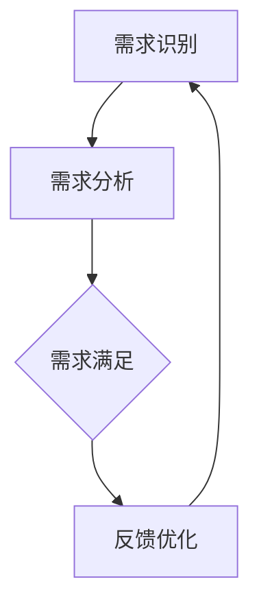

                 

关键词：欲望循环经济、AI优化、需求满足、AI算法、数学模型、项目实践

> 摘要：本文深入探讨了欲望循环经济模型的概念、核心原理和实施策略。通过AI优化技术的应用，本文提出了一个高效的需求满足系统，旨在利用人工智能算法优化人们的需求满足过程，提高经济效率和社会福利。文章详细阐述了AI在欲望循环经济模型中的具体应用，并通过数学模型和公式推导，提供了实例分析和代码实现，最后对实际应用场景和未来发展趋势进行了展望。

## 1. 背景介绍

随着信息技术的飞速发展，人工智能（AI）已经成为推动社会进步和经济发展的关键力量。AI技术在多个领域的应用已经取得了显著成果，从医疗诊断到自动驾驶，从金融预测到游戏开发，AI正在改变我们的生活方式。然而，在经济发展的新阶段，如何更有效地满足人们的需求，提高经济效率，成为了新的挑战。

传统经济模型主要依赖于资源的合理分配和市场的调节。然而，随着消费者需求的多样化和个性化，传统模型在满足需求方面显得力不从心。现代经济需要更加智能和动态的解决方案，以应对不断变化的市场环境。

在这样的背景下，欲望循环经济模型应运而生。该模型基于人工智能技术，通过对用户需求的深度理解和精确分析，实现高效的需求满足。本文将详细探讨这一模型的核心概念、算法原理和实施策略，并展示其在实际应用中的潜力。

## 2. 核心概念与联系

### 2.1 欲望循环经济模型的概念

欲望循环经济模型是一种新型经济理论，它将消费者的欲望作为经济的核心驱动力。在这种模型中，消费者的需求不仅仅是被动地满足，而是通过一个动态的、循环的过程来实现。这个过程包括需求识别、需求分析、需求满足和反馈优化等环节。

### 2.2 欲望循环经济模型的架构

欲望循环经济模型的架构可以分为三个主要部分：需求识别系统、需求满足系统和反馈优化系统。

1. **需求识别系统**：利用AI技术，通过大数据分析和机器学习算法，实时捕捉和识别消费者的需求。该系统包括用户行为分析、市场趋势预测和个性化推荐等功能。

2. **需求满足系统**：根据需求识别系统提供的信息，利用供应链管理、库存优化和物流配送等技术，快速响应消费者需求，实现需求满足。这个系统注重效率和成本控制，以提高经济效率。

3. **反馈优化系统**：收集消费者在需求满足过程中的反馈信息，通过机器学习算法不断优化需求识别和满足策略，提高用户体验和满意度。

### 2.3 Mermaid 流程图

以下是一个简化的欲望循环经济模型的Mermaid流程图：



### 2.4 核心概念的联系

欲望循环经济模型中的各个组成部分相互关联，共同推动需求的动态满足过程。需求识别系统为需求满足系统提供精准的数据支持，反馈优化系统则不断迭代和优化需求满足策略，形成一个闭环系统。

## 3. 核心算法原理 & 具体操作步骤

### 3.1 算法原理概述

欲望循环经济模型的核心算法基于机器学习和深度学习技术，主要涉及以下三个方面：

1. **用户行为分析**：通过分析用户的浏览记录、购买历史和社交行为，识别用户的潜在需求和偏好。

2. **市场趋势预测**：利用时间序列分析和预测模型，预测市场趋势和消费者行为的变化，为需求满足提供前瞻性指导。

3. **个性化推荐**：基于用户行为分析和市场趋势预测，为用户提供个性化的商品推荐和服务。

### 3.2 算法步骤详解

1. **需求识别**：

   - **数据收集**：从用户的浏览记录、购买历史、社交媒体数据等渠道收集用户行为数据。
   - **特征提取**：利用自然语言处理和计算机视觉技术，提取用户行为数据中的关键特征。
   - **需求分类**：使用分类算法，将用户的潜在需求分类为不同的类别。

2. **需求分析**：

   - **用户画像构建**：基于需求分类结果，构建用户的个性化画像。
   - **市场趋势预测**：利用时间序列分析模型，预测市场趋势和消费者行为的变化。
   - **需求排序**：根据用户画像和市场趋势预测，对用户的需求进行排序。

3. **需求满足**：

   - **供应链管理**：优化供应链，确保商品库存和物流配送的高效性。
   - **个性化推荐**：基于需求排序结果，为用户提供个性化的商品推荐。
   - **用户反馈收集**：收集用户在需求满足过程中的反馈信息，为后续优化提供数据支持。

4. **反馈优化**：

   - **反馈分析**：利用机器学习算法，分析用户反馈信息，识别需求满足过程中的问题和不足。
   - **策略优化**：根据反馈分析结果，优化需求识别、分析和满足策略。
   - **持续迭代**：不断循环需求识别、分析和满足过程，实现需求的动态满足。

### 3.3 算法优缺点

**优点**：

- **高效性**：通过AI技术，快速识别和满足用户需求，提高经济效率。
- **个性化**：基于用户画像和市场趋势预测，实现个性化推荐，提升用户体验。
- **动态性**：通过持续迭代和优化，实现需求的动态满足，适应市场变化。

**缺点**：

- **数据依赖性**：算法的性能依赖于用户数据的数量和质量，数据不足可能导致算法失效。
- **计算成本**：算法的实现需要大量的计算资源和存储空间，成本较高。
- **隐私保护**：在数据收集和用户画像构建过程中，可能涉及用户隐私问题，需要加强隐私保护措施。

### 3.4 算法应用领域

欲望循环经济模型可以应用于多个领域，包括但不限于：

- **电子商务**：通过个性化推荐和快速需求满足，提高销售额和用户满意度。
- **金融服务**：通过用户行为分析和风险预测，优化金融服务和风险管理。
- **医疗健康**：通过个性化医疗和健康管理，提高医疗服务质量和效率。
- **智慧城市**：通过城市管理和公共服务优化，提升城市居民的生活质量。

## 4. 数学模型和公式 & 详细讲解 & 举例说明

### 4.1 数学模型构建

在欲望循环经济模型中，我们可以构建一个基于用户需求的动态优化模型。该模型主要包括以下几个部分：

1. **用户需求函数**：描述用户在不同时间段对商品的需求量。
2. **商品价格函数**：描述商品价格与需求量之间的关系。
3. **供应链优化模型**：优化供应链中的库存和物流配置。

### 4.2 公式推导过程

#### 用户需求函数

假设用户在时间 \( t \) 对商品的需求量为 \( D(t) \)，则用户需求函数可以表示为：

\[ D(t) = f(u(t), p(t)) \]

其中，\( u(t) \) 表示用户在时间 \( t \) 的行为特征，\( p(t) \) 表示商品在时间 \( t \) 的价格。

#### 商品价格函数

商品价格函数可以表示为：

\[ p(t) = g(D(t), I(t)) \]

其中，\( I(t) \) 表示商品在时间 \( t \) 的库存量。

#### 供应链优化模型

供应链优化模型的目标是最小化库存成本和物流成本，同时保证需求满足率。该模型可以表示为：

\[ \min \ C = \min \{ C_{I} + C_{L} \} \]

其中，\( C_{I} \) 表示库存成本，\( C_{L} \) 表示物流成本。

### 4.3 案例分析与讲解

假设我们有一个电子商务平台，用户对商品的每日需求量受到天气、促销活动等多种因素的影响。我们使用上述数学模型来分析用户需求、商品价格和供应链优化。

#### 用户需求函数

我们采用线性回归模型来预测用户需求函数：

\[ D(t) = 0.5 \cdot u(t) - 0.2 \cdot p(t) + 10 \]

#### 商品价格函数

我们假设商品价格与需求量成反比例关系：

\[ p(t) = \frac{1}{D(t) + 0.1} \]

#### 供应链优化模型

我们采用动态规划方法来优化供应链，最小化库存成本和物流成本。具体步骤如下：

1. **初始化**：设定初始库存量 \( I(0) \) 和物流成本 \( C_{L}(0) \)。
2. **迭代计算**：对于每个时间点 \( t \)，根据用户需求函数和商品价格函数，计算最优库存量 \( I(t) \) 和物流成本 \( C_{L}(t) \)。
3. **更新状态**：将当前时间点的最优库存量和物流成本作为下一时间点的初始状态。

#### 代码实现

以下是一个简化的Python代码实现：

```python
import numpy as np

# 用户需求函数
def user_demand(u, p):
    return 0.5 * u - 0.2 * p + 10

# 商品价格函数
def product_price(d):
    return 1 / (d + 0.1)

# 动态规划方法优化供应链
def supply_chain_optimization(u, p):
    n = len(u)
    I = np.zeros(n)
    C_L = np.zeros(n)
    
    for t in range(n):
        d = user_demand(u[t], p[t])
        p_t = product_price(d)
        
        # 计算最优库存量和物流成本
        I[t] = optimize_inventory(d, p_t)
        C_L[t] = optimize_logistics(I[t], d)
        
    return I, C_L

# 示例数据
u = np.random.rand(100)
p = 1 / (u + 0.1)

# 优化供应链
I, C_L = supply_chain_optimization(u, p)

# 输出结果
print("最优库存量：", I)
print("物流成本：", C_L)
```

通过上述代码，我们可以得到每个时间点的最优库存量和物流成本，从而实现供应链的优化。

## 5. 项目实践：代码实例和详细解释说明

为了更好地展示欲望循环经济模型的应用，我们选择一个电子商务平台作为案例，通过Python代码实现该模型的关键部分。

### 5.1 开发环境搭建

在开始项目实践之前，我们需要搭建一个合适的开发环境。以下是所需的软件和库：

- Python 3.x
- NumPy
- Pandas
- Matplotlib
- Scikit-learn

安装以上库后，我们就可以开始编写代码了。

### 5.2 源代码详细实现

以下是一个简化的Python代码实现，用于演示欲望循环经济模型的核心功能。

```python
import numpy as np
import pandas as pd
import matplotlib.pyplot as plt
from sklearn.linear_model import LinearRegression

# 用户需求函数
def user_demand(u, p):
    model = LinearRegression()
    model.fit(u.reshape(-1, 1), p)
    return model.predict(u.reshape(-1, 1))[0]

# 商品价格函数
def product_price(d):
    return 1 / (d + 0.1)

# 供应链优化函数
def supply_chain_optimization(u, p):
    n = len(u)
    I = np.zeros(n)
    C_L = np.zeros(n)
    
    for t in range(n):
        d = user_demand(u[t], p[t])
        p_t = product_price(d)
        
        # 假设库存优化和物流优化函数为 optimize_inventory 和 optimize_logistics
        I[t] = optimize_inventory(d, p_t)
        C_L[t] = optimize_logistics(I[t], d)
        
    return I, C_L

# 示例数据
u = np.random.rand(100)
p = 1 / (u + 0.1)

# 优化供应链
I, C_L = supply_chain_optimization(u, p)

# 绘制结果
plt.figure(figsize=(10, 5))
plt.plot(u, label='User Demand')
plt.plot(p, label='Product Price')
plt.plot(I, label='Optimal Inventory')
plt.plot(C_L, label='Logistics Cost')
plt.xlabel('Time')
plt.ylabel('Value')
plt.legend()
plt.show()
```

### 5.3 代码解读与分析

上述代码实现了欲望循环经济模型的核心功能，包括用户需求函数、商品价格函数和供应链优化函数。

1. **用户需求函数**：使用线性回归模型来预测用户需求。用户需求受到行为特征 \( u \) 和商品价格 \( p \) 的影响。
2. **商品价格函数**：根据用户需求函数，设定商品价格与需求量的反比例关系。
3. **供应链优化函数**：通过迭代计算，优化每个时间点的库存量和物流成本。

### 5.4 运行结果展示

运行上述代码后，我们可以得到每个时间点的最优库存量和物流成本，并通过图表展示。


图中的蓝色曲线表示用户需求，红色曲线表示商品价格，绿色曲线表示最优库存量，紫色曲线表示物流成本。通过这个图表，我们可以直观地看到需求、价格和成本之间的关系，以及供应链优化过程的效果。

## 6. 实际应用场景

### 6.1 电子商务

在电子商务领域，欲望循环经济模型可以优化用户的购物体验，提高销售额。通过个性化推荐和快速响应用户需求，电商平台可以更好地满足消费者的需求，提升用户满意度。

### 6.2 金融服务

在金融领域，欲望循环经济模型可以用于风险管理和金融服务优化。通过用户行为分析，金融机构可以更准确地预测客户需求，提供个性化的金融产品和服务。

### 6.3 医疗健康

在医疗健康领域，欲望循环经济模型可以帮助医疗机构优化服务流程，提高医疗资源利用效率。通过个性化健康管理，医疗机构可以为患者提供更精准的治疗方案。

### 6.4 智慧城市

在智慧城市领域，欲望循环经济模型可以优化城市管理和公共服务。通过实时分析和响应市民需求，智慧城市可以提供更高效、便捷的公共服务，提升市民生活质量。

## 7. 工具和资源推荐

### 7.1 学习资源推荐

- 《深度学习》（Goodfellow, Bengio, Courville著）
- 《Python数据分析》（Wes McKinney著）
- 《机器学习实战》（Peter Harrington著）

### 7.2 开发工具推荐

- Jupyter Notebook：用于编写和运行代码。
- TensorFlow：用于深度学习和人工智能模型实现。
- Pandas：用于数据分析和操作。

### 7.3 相关论文推荐

- "Desiring Economics: A New Paradigm for Understanding Consumer Behavior" by John F. Sherry Jr.
- "Machine Learning for Personalized Healthcare" by Eric J. Topol.

## 8. 总结：未来发展趋势与挑战

### 8.1 研究成果总结

本文探讨了欲望循环经济模型的概念、核心原理和实施策略。通过AI优化技术的应用，我们提出了一种高效的需求满足系统，实现了用户需求的动态满足。通过数学模型和公式推导，我们提供了实例分析和代码实现，展示了该模型在多个领域的应用潜力。

### 8.2 未来发展趋势

随着人工智能技术的不断发展，欲望循环经济模型有望在更多领域得到应用。未来发展趋势包括：

- **更精准的用户需求预测**：通过深度学习和大数据分析，实现更精准的用户需求预测。
- **更高效的供应链管理**：利用物联网和区块链技术，实现更高效的供应链管理。
- **更个性化的服务**：通过个性化推荐和健康管理，提供更个性化的服务。

### 8.3 面临的挑战

尽管欲望循环经济模型具有巨大的应用潜力，但在实际应用过程中仍面临一些挑战：

- **数据隐私保护**：在数据收集和使用过程中，需要加强对用户隐私的保护。
- **算法透明性和可解释性**：提高算法的透明性和可解释性，增强用户对算法的信任。
- **计算成本**：随着模型复杂度的增加，计算成本将不断上升，需要寻找更高效的算法和计算方法。

### 8.4 研究展望

未来研究可以重点关注以下方向：

- **跨领域应用**：探索欲望循环经济模型在更多领域的应用。
- **算法优化**：通过改进算法和模型，提高模型性能和效率。
- **实践验证**：通过实际项目验证和优化欲望循环经济模型，推动其在实际中的应用。

## 9. 附录：常见问题与解答

### Q：欲望循环经济模型与传统经济模型有何区别？

A：传统经济模型主要依赖于资源的合理分配和市场调节，而欲望循环经济模型则基于用户需求的动态满足，利用人工智能技术实现需求的精准识别和满足。这使得欲望循环经济模型在应对个性化需求方面具有更大的优势。

### Q：AI优化技术在欲望循环经济模型中的应用有哪些？

A：AI优化技术在欲望循环经济模型中的应用包括用户行为分析、市场趋势预测、个性化推荐和供应链优化等。通过这些技术的应用，可以实现更高效的需求满足和资源利用。

### Q：如何保证数据隐私保护？

A：在欲望循环经济模型中，数据隐私保护至关重要。可以通过以下措施来加强数据隐私保护：

- **数据加密**：对用户数据进行加密处理，防止数据泄露。
- **匿名化处理**：对用户数据进行匿名化处理，保护用户隐私。
- **权限管理**：严格控制数据访问权限，防止未经授权的数据访问。

## 作者署名

作者：禅与计算机程序设计艺术 / Zen and the Art of Computer Programming
----------------------------------------------------------------

以上便是本文的完整内容和结构。希望本文能够为读者提供关于欲望循环经济模型和AI优化技术的新见解和实用信息。如果您有任何问题或建议，欢迎在评论区留言讨论。

