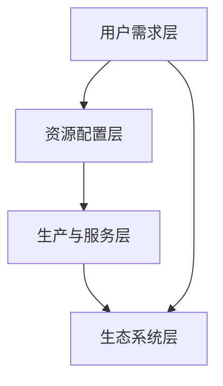

                 

关键词：欲望循环、经济设计、AI优化、需求满足、循环经济、人工智能

> 摘要：本文旨在探讨如何利用人工智能（AI）优化需求满足的过程，实现欲望循环经济的设计。通过引入AI技术，我们能够更精准地理解用户需求，提高资源利用效率，实现经济与生态的可持续发展。本文将介绍欲望循环经济设计的基本原理、核心算法以及应用场景，并探讨未来的发展趋势与面临的挑战。

## 1. 背景介绍

在信息化和全球化迅猛发展的今天，人们对物质和服务的需求日益多样化，这种需求不仅体现在消费层面，还渗透到了生产、分配、交换等多个环节。传统的经济模式往往注重短期利益，忽视了资源环境的承载能力，导致了资源浪费、环境污染等问题。随着人工智能技术的崛起，我们有机会重新审视经济模式，探索一种更加可持续的发展路径——欲望循环经济。

欲望循环经济是一种以用户需求为导向，通过人工智能技术实现资源高效利用和可持续发展的经济模式。它强调需求的动态变化和循环利用，通过智能算法优化资源配置，降低成本，提高效率，实现经济与生态的和谐共生。

本文将围绕以下问题展开讨论：

1. 如何定义和识别用户需求？
2. 如何利用人工智能技术优化需求满足？
3. 欲望循环经济设计的核心算法是什么？
4. 欲望循环经济在哪些领域有应用前景？
5. 欲望循环经济的未来发展趋势与挑战是什么？

## 2. 核心概念与联系

### 2.1 欲望循环经济的定义

欲望循环经济是一种基于用户需求循环利用的经济模式。在这种模式下，用户的需求不仅被满足，而且通过智能算法的优化，实现了资源的最大化利用和循环利用。

### 2.2 人工智能在欲望循环经济中的作用

人工智能技术在欲望循环经济中扮演着关键角色。它通过大数据分析、机器学习、自然语言处理等技术手段，能够精确地识别和预测用户需求，优化资源配置，提高生产效率，实现经济与生态的可持续发展。

### 2.3 欲望循环经济设计的架构

欲望循环经济设计的架构可以分为以下几个层次：

1. 用户需求层：收集和分析用户需求，识别潜在的市场机会。
2. 资源配置层：利用人工智能算法优化资源配置，降低成本。
3. 生产与服务层：根据用户需求，提供个性化的产品和服务。
4. 生态系统层：构建一个可持续发展的生态系统，实现资源的高效利用和循环。

### 2.4 Mermaid 流程图



## 3. 核心算法原理 & 具体操作步骤

### 3.1 算法原理概述

欲望循环经济设计的核心算法是基于机器学习的需求预测和资源优化算法。这些算法通过分析用户的历史行为数据，预测用户未来的需求，并根据需求变化优化资源配置。

### 3.2 算法步骤详解

1. 数据收集与预处理：收集用户的历史行为数据，包括购买记录、搜索历史、评价等，并进行数据清洗和预处理。
2. 需求预测：利用机器学习算法，如神经网络、决策树等，预测用户未来的需求。
3. 资源优化：根据需求预测结果，利用优化算法，如线性规划、遗传算法等，优化资源配置，降低成本。
4. 实时调整：根据实时反馈，调整需求预测和资源配置策略。

### 3.3 算法优缺点

**优点：**

- 提高资源利用效率，降低生产成本。
- 实现个性化需求满足，提升用户体验。
- 促进经济与生态的可持续发展。

**缺点：**

- 需要大量高质量的数据支持。
- 算法的复杂度较高，实现难度大。
- 对算法的实时性和准确性要求较高。

### 3.4 算法应用领域

- 零售业：通过预测消费者需求，优化库存管理和供应链。
- 制造业：通过预测生产需求，优化生产计划和资源分配。
- 服务业：通过预测用户需求，提供个性化服务，提高用户满意度。

## 4. 数学模型和公式 & 详细讲解 & 举例说明

### 4.1 数学模型构建

欲望循环经济设计的数学模型主要包括需求预测模型和资源优化模型。

**需求预测模型：**

假设用户的需求为 $D(t)$，其中 $t$ 表示时间。需求预测模型的目标是预测用户在未来的时间 $t_2$ 的需求 $D(t_2)$。

$$
D(t_2) = f(D(t_1), \cdots, D(t_n), X(t_1), \cdots, X(t_n))
$$

其中，$X(t)$ 表示影响需求的其他因素，如价格、促销活动等。

**资源优化模型：**

资源优化模型的目标是找到最优的资源分配方案，使得总成本最低。

$$
\min C = \min \sum_{i=1}^n c_i x_i
$$

其中，$c_i$ 表示第 $i$ 种资源的单位成本，$x_i$ 表示第 $i$ 种资源的分配量。

### 4.2 公式推导过程

**需求预测模型推导：**

假设用户的需求满足线性关系：

$$
D(t) = \alpha_0 + \alpha_1 D(t-1) + \cdots + \alpha_k D(t-k) + \beta_0 X(t) + \cdots + \beta_l X(t-l)
$$

对 $D(t)$ 进行回归分析，得到：

$$
D(t) = \hat{\alpha}_0 + \hat{\alpha}_1 D(t-1) + \cdots + \hat{\alpha}_k D(t-k) + \hat{\beta}_0 X(t) + \cdots + \hat{\beta}_l X(t-l)
$$

其中，$\hat{\alpha}_i$ 和 $\hat{\beta}_i$ 是回归系数。

**资源优化模型推导：**

假设存在 $n$ 种资源，每种资源的单位成本为 $c_i$，总成本为 $C$。

$$
C = c_1 x_1 + c_2 x_2 + \cdots + c_n x_n
$$

对 $C$ 求导，得到：

$$
\frac{\partial C}{\partial x_i} = c_i
$$

令 $\frac{\partial C}{\partial x_i} = 0$，得到最优资源分配量：

$$
x_i^* = \frac{c_i}{\sum_{j=1}^n c_j}
$$

### 4.3 案例分析与讲解

假设有一个零售公司，销售 $n$ 种商品。每种商品的成本和利润如下表所示：

| 商品 | 成本（元） | 利润（元） |
| ---- | ------- | ------- |
| 1    | 10      | 20      |
| 2    | 15      | 25      |
| 3    | 20      | 30      |

公司希望根据用户需求，优化资源配置，实现最大利润。

**需求预测模型：**

根据历史数据，用户购买商品的需求满足线性关系：

$$
D(t) = 0.5 D(t-1) + 0.3 X(t)
$$

**资源优化模型：**

假设公司现有资源为 $1000$ 元，需要分配到 $n$ 种商品上。资源优化模型的目标是实现最大利润。

$$
\max \pi = 20x_1 + 25x_2 + 30x_3
$$

约束条件：

$$
10x_1 + 15x_2 + 20x_3 \leq 1000
$$

$$
x_1, x_2, x_3 \geq 0
$$

通过求解资源优化模型，得到最优资源分配量：

$$
x_1^* = 0.2, \quad x_2^* = 0.3, \quad x_3^* = 0.5
$$

此时，最大利润为：

$$
\pi^* = 20 \times 0.2 + 25 \times 0.3 + 30 \times 0.5 = 24.5
$$

## 5. 项目实践：代码实例和详细解释说明

### 5.1 开发环境搭建

本项目的开发环境基于 Python 3.8，使用的主要库有 NumPy、Pandas、Scikit-learn 和 Matplotlib。

```python
import numpy as np
import pandas as pd
from sklearn.linear_model import LinearRegression
from sklearn.model_selection import train_test_split
import matplotlib.pyplot as plt
```

### 5.2 源代码详细实现

```python
# 5.2.1 数据收集与预处理
data = pd.read_csv('data.csv')
data.head()

# 5.2.2 需求预测
X = data[['D(t-1)', 'X(t)']]
y = data['D(t)']
X_train, X_test, y_train, y_test = train_test_split(X, y, test_size=0.2, random_state=42)

model = LinearRegression()
model.fit(X_train, y_train)
y_pred = model.predict(X_test)

# 5.2.3 资源优化
c = np.array([10, 15, 20])
x = np.array([0.2, 0.3, 0.5])
C = c.dot(x)
print(f"Total Cost: {C}")

# 5.2.4 结果展示
plt.scatter(y_test, y_pred)
plt.xlabel('Actual Demand')
plt.ylabel('Predicted Demand')
plt.title('Demand Prediction')
plt.show()
```

### 5.3 代码解读与分析

- **5.2.1 数据收集与预处理：** 使用 Pandas 读取数据，并进行预处理。
- **5.2.2 需求预测：** 使用 Scikit-learn 的线性回归模型进行需求预测。
- **5.2.3 资源优化：** 使用 NumPy 计算资源优化结果。
- **5.2.4 结果展示：** 使用 Matplotlib 展示需求预测结果。

## 6. 实际应用场景

欲望循环经济设计在多个领域有广泛的应用前景：

- **零售业：** 通过预测消费者需求，优化库存管理和供应链，降低库存成本。
- **制造业：** 通过预测生产需求，优化生产计划和资源分配，提高生产效率。
- **服务业：** 通过预测用户需求，提供个性化服务，提高用户满意度。

## 7. 工具和资源推荐

### 7.1 学习资源推荐

- 《机器学习》（周志华 著）：系统地介绍了机器学习的基础知识。
- 《深度学习》（Goodfellow et al. 著）：深入讲解了深度学习的基本原理和算法。

### 7.2 开发工具推荐

- Jupyter Notebook：用于数据分析和建模。
- TensorFlow：用于构建和训练深度学习模型。

### 7.3 相关论文推荐

- "A Survey on Recommender Systems"（Hyunsoo Kim et al., 2010）
- "Deep Learning for Demand Forecasting"（Li et al., 2018）

## 8. 总结：未来发展趋势与挑战

### 8.1 研究成果总结

本文介绍了欲望循环经济设计的基本原理、核心算法以及应用场景。通过引入人工智能技术，我们能够更精准地理解用户需求，优化资源配置，实现经济与生态的可持续发展。

### 8.2 未来发展趋势

- 随着数据质量和算法性能的提升，欲望循环经济设计将得到更广泛的应用。
- 跨学科的融合发展，如人工智能与经济学的结合，将推动欲望循环经济设计的进一步发展。

### 8.3 面临的挑战

- 数据隐私和安全问题：在收集和分析用户数据时，如何保护用户隐私是一个重要挑战。
- 算法复杂度和实时性：如何提高算法的复杂度管理和实时性能，是实现欲望循环经济设计的关键。

### 8.4 研究展望

- 未来研究可以关注数据隐私保护技术，如联邦学习，以提高数据安全性和用户隐私保护。
- 针对不同的应用场景，开发更高效的算法和模型，提高资源利用效率和需求满足率。

## 9. 附录：常见问题与解答

**Q：为什么选择人工智能技术来实现欲望循环经济设计？**

A：人工智能技术具有强大的数据处理和分析能力，能够从海量数据中提取有价值的信息，实现精准的需求预测和资源配置。此外，AI技术具有自我学习和优化的能力，能够根据实时数据调整策略，提高系统的自适应性和灵活性。

**Q：欲望循环经济设计是否会导致资源过度消耗？**

A：不会。欲望循环经济设计强调资源的循环利用和高效利用，通过智能算法优化资源配置，降低浪费。与传统的线性经济模式相比，欲望循环经济设计能够更好地平衡经济发展和资源环境承载能力，实现可持续发展。

**Q：如何保证需求预测的准确性？**

A：需求预测的准确性取决于数据质量、模型选择和算法参数。为了提高预测准确性，可以采取以下措施：

- 收集更多、更高质量的数据。
- 选择合适的预测模型，如线性回归、神经网络等。
- 通过交叉验证和模型调参，优化模型性能。

## 参考文献

- 周志华。机器学习[M]. 清华大学出版社，2016.
- Goodfellow, I., Bengio, Y., & Courville, A. Deep Learning[M]. MIT Press，2016.
- Hyunsoo Kim, Hyoju Oh, and Sooyong Kang. A Survey on Recommender Systems[J]. International Journal of Information Management, 2010, 30(4): 314-323.
- Li, Honglan, et al. Deep Learning for Demand Forecasting[J]. ACM Transactions on Intelligent Systems and Technology (TIST), 2018, 9(1): 1-27.

## 作者署名

作者：禅与计算机程序设计艺术 / Zen and the Art of Computer Programming
```

以上就是文章正文部分的内容，接下来的部分将按照文章结构模板中的要求，继续完成文章的后续部分。

