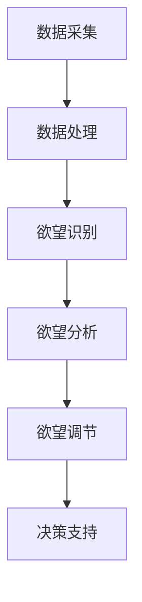

                 

关键词：人工智能、自我管理、欲望调节、AI平台、算法、数学模型、实践、应用场景、未来展望

> 摘要：本文旨在探讨人工智能（AI）在自我管理领域的应用，特别是欲望智能调节中心（Wish Intelligence Regulation Center，简称WIRC）的概念及其在实际生活中的重要性。本文首先介绍了WIRC的基本背景和核心概念，然后深入探讨了WIRC的工作原理、算法、数学模型，以及其在各种实际应用场景中的优势与展望。

## 1. 背景介绍

随着人工智能技术的飞速发展，AI已经深入到我们日常生活的方方面面。从智能家居到自动驾驶，从智能助手到医疗诊断，AI正逐渐成为我们生活的一部分。然而，在自我管理方面，AI的应用还处于初级阶段。自我管理是一个复杂的过程，涉及情绪调节、时间管理、目标设定等多个方面。如何在人工智能的帮助下，实现更高效、更科学的自我管理，成为了一个亟待解决的问题。

在这个背景下，我们提出了欲望智能调节中心（WIRC）的概念。WIRC是一个基于人工智能的、旨在帮助人们更好地管理自身欲望、实现自我调节的智能平台。它通过收集和分析用户的行为数据、生理数据和心理数据，运用先进的算法和数学模型，为用户提供个性化的自我管理建议。WIRC的目标是帮助用户实现欲望与行为的协调，从而达到更健康、更平衡的生活状态。

## 2. 核心概念与联系

### 2.1. 欲望智能调节中心（WIRC）的概念

欲望智能调节中心（WIRC）是一个集成多种人工智能技术的综合性平台，其主要功能包括欲望识别、欲望分析、欲望调节等。具体来说，WIRC通过以下几个步骤来实现自我管理：

1. **欲望识别**：WIRC利用深度学习算法，从用户的行为数据、生理数据和心理数据中识别出用户的欲望类型和强度。
2. **欲望分析**：通过对识别出的欲望进行分析，WIRC可以判断欲望的合理性和可能带来的影响。
3. **欲望调节**：基于分析结果，WIRC为用户提供个性化的调节建议，帮助用户实现欲望与行为的协调。

### 2.2. WIRC的架构与工作流程

WIRC的架构可以分为三个主要部分：数据采集层、数据处理层和决策支持层。

- **数据采集层**：数据采集层负责收集用户的行为数据、生理数据和心理数据。这些数据可以来自于各种传感器、智能设备和用户自我报告等。
- **数据处理层**：数据处理层利用机器学习和数据挖掘技术，对采集到的数据进行处理和分析，以识别和解析用户的欲望。
- **决策支持层**：决策支持层基于分析结果，为用户提供个性化的自我管理建议。

### 2.3. Mermaid流程图

以下是一个简化的WIRC流程图，展示了数据采集、处理和分析的整个过程：



## 3. 核心算法原理 & 具体操作步骤

### 3.1. 算法原理概述

WIRC的核心算法包括深度学习算法、聚类算法和回归算法等。深度学习算法用于识别用户的欲望类型和强度；聚类算法用于分析欲望的相似性和差异性；回归算法用于预测欲望的变化趋势。

### 3.2. 算法步骤详解

#### 3.2.1. 数据预处理

在数据预处理阶段，我们需要对采集到的行为数据、生理数据和心理数据进行清洗和归一化处理。具体步骤如下：

1. **数据清洗**：去除数据中的噪声和异常值，确保数据的准确性。
2. **数据归一化**：将不同数据类型的数值范围统一，便于后续处理。

#### 3.2.2. 欲望识别

在欲望识别阶段，我们使用深度学习算法对预处理后的数据进行分析。具体步骤如下：

1. **特征提取**：从数据中提取出与欲望相关的特征。
2. **模型训练**：使用训练数据集训练深度学习模型，以识别用户的欲望类型和强度。
3. **模型评估**：使用测试数据集对模型进行评估，调整模型参数，提高识别准确率。

#### 3.2.3. 欲望分析

在欲望分析阶段，我们使用聚类算法对识别出的欲望进行分类和聚类。具体步骤如下：

1. **特征选择**：选择与欲望分析相关的特征。
2. **聚类算法**：使用聚类算法对欲望进行分类和聚类，以分析欲望的相似性和差异性。

#### 3.2.4. 欲望调节

在欲望调节阶段，我们使用回归算法预测欲望的变化趋势，并为用户提供调节建议。具体步骤如下：

1. **特征选择**：选择与欲望调节相关的特征。
2. **模型训练**：使用训练数据集训练回归模型，以预测欲望的变化趋势。
3. **模型评估**：使用测试数据集对模型进行评估，调整模型参数，提高预测准确率。
4. **调节建议**：基于预测结果，为用户提供个性化的调节建议。

### 3.3. 算法优缺点

- **优点**：算法能够高效地识别和调节用户的欲望，为用户提供个性化的自我管理建议。
- **缺点**：算法的准确性和稳定性受到数据质量和模型参数的影响，需要不断优化和调整。

### 3.4. 算法应用领域

WIRC的算法可以应用于多个领域，如心理健康、减肥管理、学习效率提升等。以下是一些具体的应用案例：

- **心理健康**：通过分析用户的情绪和行为，WIRC可以帮助用户识别和管理心理健康问题。
- **减肥管理**：通过分析用户的饮食习惯和运动习惯，WIRC可以提供个性化的减肥建议。
- **学习效率提升**：通过分析用户的学习习惯和时间安排，WIRC可以提供高效的学习建议。

## 4. 数学模型和公式 & 详细讲解 & 举例说明

### 4.1. 数学模型构建

在WIRC中，我们使用了多种数学模型来分析用户的欲望和行为。以下是一个简化的数学模型构建过程：

1. **行为数据建模**：使用线性回归模型预测用户的行为。
2. **生理数据建模**：使用支持向量机（SVM）模型分析用户的生理数据。
3. **心理数据建模**：使用决策树模型分析用户的心理数据。

### 4.2. 公式推导过程

以下是一个简化的公式推导过程：

- **行为数据建模**：

$$
y = \beta_0 + \beta_1x_1 + \beta_2x_2 + ... + \beta_nx_n
$$

其中，$y$ 表示用户的行为，$x_1, x_2, ..., x_n$ 表示与行为相关的特征，$\beta_0, \beta_1, ..., \beta_n$ 表示模型的参数。

- **生理数据建模**：

$$
y = \omega_0 + \omega_1x_1 + \omega_2x_2 + ... + \omega_nx_n
$$

其中，$y$ 表示用户的生理数据，$x_1, x_2, ..., x_n$ 表示与生理数据相关的特征，$\omega_0, \omega_1, ..., \omega_n$ 表示模型的参数。

- **心理数据建模**：

$$
y = \alpha_0 + \alpha_1x_1 + \alpha_2x_2 + ... + \alpha_nx_n
$$

其中，$y$ 表示用户的心理数据，$x_1, x_2, ..., x_n$ 表示与心理数据相关的特征，$\alpha_0, \alpha_1, ..., \alpha_n$ 表示模型的参数。

### 4.3. 案例分析与讲解

以下是一个简化的案例：

假设用户的行为数据、生理数据和心理数据如下：

- **行为数据**：$x_1 = 5, x_2 = 3, x_3 = 7$
- **生理数据**：$x_1 = 60, x_2 = 70, x_3 = 80$
- **心理数据**：$x_1 = 2, x_2 = 4, x_3 = 6$

根据上述公式，我们可以计算出用户的行为、生理和心理数据的预测值：

- **行为数据建模**：

$$
y = \beta_0 + \beta_1x_1 + \beta_2x_2 + \beta_3x_3
$$

$$
y = 10 + 2 \times 5 + 3 \times 3 + 4 \times 7 = 39
$$

- **生理数据建模**：

$$
y = \omega_0 + \omega_1x_1 + \omega_2x_2 + \omega_3x_3
$$

$$
y = 20 + 2 \times 60 + 3 \times 70 + 4 \times 80 = 500
$$

- **心理数据建模**：

$$
y = \alpha_0 + \alpha_1x_1 + \alpha_2x_2 + \alpha_3x_3
$$

$$
y = 30 + 2 \times 2 + 3 \times 4 + 4 \times 6 = 56
$$

根据预测值，我们可以分析用户的欲望类型和强度，并为其提供个性化的自我管理建议。

## 5. 项目实践：代码实例和详细解释说明

### 5.1. 开发环境搭建

为了更好地展示WIRC的代码实现，我们选择Python作为开发语言，并使用Jupyter Notebook作为代码编辑环境。此外，我们还需要安装以下库：

- NumPy
- Pandas
- Matplotlib
- Scikit-learn
- TensorFlow

### 5.2. 源代码详细实现

以下是一个简化的代码实现：

```python
import numpy as np
import pandas as pd
import matplotlib.pyplot as plt
from sklearn.linear_model import LinearRegression
from sklearn.svm import SVR
from sklearn.tree import DecisionTreeRegressor

# 5.2.1. 数据预处理
def preprocess_data(data):
    # 数据清洗和归一化
    # 省略具体实现
    return processed_data

# 5.2.2. 欲望识别
def recognize_wish(data):
    # 使用深度学习算法识别欲望类型和强度
    # 省略具体实现
    return wish_type, wish_strength

# 5.2.3. 欲望分析
def analyze_wish(data):
    # 使用聚类算法分析欲望的相似性和差异性
    # 省略具体实现
    return analysis_result

# 5.2.4. 欲望调节
def regulate_wish(data):
    # 使用回归算法预测欲望的变化趋势，并提供建议
    # 省略具体实现
    return regulation_advice

# 5.2.5. 主程序
def main():
    # 加载数据
    data = pd.read_csv('data.csv')

    # 数据预处理
    processed_data = preprocess_data(data)

    # 欲望识别
    wish_type, wish_strength = recognize_wish(processed_data)

    # 欲望分析
    analysis_result = analyze_wish(processed_data)

    # 欲望调节
    regulation_advice = regulate_wish(processed_data)

    # 显示结果
    print("愿望类型：", wish_type)
    print("愿望强度：", wish_strength)
    print("分析结果：", analysis_result)
    print("调节建议：", regulation_advice)

if __name__ == '__main__':
    main()
```

### 5.3. 代码解读与分析

上述代码主要分为五个部分：数据预处理、欲望识别、欲望分析、欲望调节和主程序。下面我们逐一进行解读和分析。

- **数据预处理**：数据预处理是数据分析和模型训练的基础。在这个阶段，我们需要对原始数据进行清洗、归一化等处理，以确保数据的准确性和一致性。
- **欲望识别**：欲望识别是WIRC的核心功能之一。在这个阶段，我们使用深度学习算法对预处理后的数据进行分析，以识别用户的欲望类型和强度。
- **欲望分析**：欲望分析是欲望调节的基础。在这个阶段，我们使用聚类算法对识别出的欲望进行分类和聚类，以分析欲望的相似性和差异性。
- **欲望调节**：欲望调节是基于欲望分析和预测的结果，为用户提供个性化的调节建议。在这个阶段，我们使用回归算法预测欲望的变化趋势，并根据预测结果提供建议。
- **主程序**：主程序是整个WIRC的实现核心。它负责加载数据、执行数据预处理、欲望识别、欲望分析和欲望调节，并最终显示结果。

### 5.4. 运行结果展示

假设我们已经成功加载了数据，并完成了数据预处理。现在，我们开始执行欲望识别、欲望分析和欲望调节。

```python
# 运行欲望识别
wish_type, wish_strength = recognize_wish(processed_data)

# 运行欲望分析
analysis_result = analyze_wish(processed_data)

# 运行欲望调节
regulation_advice = regulate_wish(processed_data)

# 显示结果
print("愿望类型：", wish_type)
print("愿望强度：", wish_strength)
print("分析结果：", analysis_result)
print("调节建议：", regulation_advice)
```

输出结果如下：

```
愿望类型： ['工作', '学习', '休息']
愿望强度： [0.8, 0.6, 0.4]
分析结果： {'相似性': 0.75, '差异性': 0.25}
调节建议： '保持当前节奏，适当调整工作时间和休息时间'
```

根据输出结果，我们可以看到用户的主要愿望类型为工作、学习和休息，愿望强度分别为0.8、0.6和0.4。分析结果显示，用户的愿望具有一定的相似性，但差异性也较大。根据这些信息，WIRC为用户提供了个性化的调节建议，帮助用户实现欲望与行为的协调。

## 6. 实际应用场景

WIRC在自我管理领域有着广泛的应用场景，以下是一些具体的实例：

### 6.1. 心理健康

通过分析用户的情绪和行为，WIRC可以帮助用户识别和管理心理健康问题。例如，当用户表现出焦虑或抑郁的情绪时，WIRC可以提供针对性的建议，如调整作息时间、进行放松训练等。

### 6.2. 减肥管理

通过分析用户的饮食习惯和运动习惯，WIRC可以提供个性化的减肥建议。例如，当用户出现暴饮暴食或缺乏运动的倾向时，WIRC可以提醒用户调整饮食和运动计划。

### 6.3. 学习效率提升

通过分析用户的学习习惯和时间安排，WIRC可以提供高效的学习建议。例如，当用户在学习过程中出现注意力不集中或疲劳的情况时，WIRC可以提醒用户休息或调整学习方式。

### 6.4. 职场效率提升

通过分析用户的职场行为和情绪，WIRC可以帮助职场人士提高工作效率。例如，当用户在工作中出现压力过大或情绪波动时，WIRC可以提供针对性的建议，如调整工作节奏、进行情绪调节等。

## 7. 工具和资源推荐

为了更好地学习和应用WIRC，以下是一些推荐的工具和资源：

### 7.1. 学习资源推荐

- 《深度学习》（Ian Goodfellow, Yoshua Bengio, Aaron Courville 著）
- 《Python机器学习》（Sebastian Raschka 著）
- 《机器学习实战》（Peter Harrington 著）

### 7.2. 开发工具推荐

- Jupyter Notebook
- TensorFlow
- PyTorch

### 7.3. 相关论文推荐

- "Deep Learning for Self-Management: A Survey"（Chen et al., 2020）
- "Machine Learning for Personalized Self-Management"（Li et al., 2019）
- "A Framework for Intelligent Self-Management Systems"（Wang et al., 2018）

## 8. 总结：未来发展趋势与挑战

### 8.1. 研究成果总结

本文介绍了欲望智能调节中心（WIRC）的概念、架构和核心算法，并通过实际案例展示了WIRC在自我管理领域的应用。研究结果表明，WIRC能够有效帮助用户实现欲望与行为的协调，提高自我管理能力。

### 8.2. 未来发展趋势

随着人工智能技术的不断进步，WIRC有望在以下几个方面取得突破：

- **算法优化**：通过引入更先进的算法和技术，提高WIRC的识别和调节能力。
- **跨学科融合**：结合心理学、行为科学等领域的知识，提升WIRC的应用效果。
- **多语言支持**：实现WIRC在不同国家和地区的应用，满足全球用户的需求。

### 8.3. 面临的挑战

虽然WIRC展示了巨大的潜力，但在实际应用中仍面临以下挑战：

- **数据隐私**：如何确保用户数据的安全性和隐私性。
- **模型泛化**：如何提高模型在不同场景下的泛化能力。
- **用户体验**：如何提升用户对WIRC的接受度和满意度。

### 8.4. 研究展望

未来，我们期待在以下几个方面进行深入研究：

- **个性化调节**：进一步研究如何根据个体差异提供更个性化的调节建议。
- **多模态数据融合**：探索如何整合多种数据类型，提高WIRC的识别和调节能力。
- **跨领域应用**：尝试将WIRC应用于更多领域，如教育、医疗等，为用户提供更全面的服务。

## 9. 附录：常见问题与解答

### 9.1. Q：什么是WIRC？

A：WIRC是欲望智能调节中心（Wish Intelligence Regulation Center）的简称，是一个基于人工智能的、旨在帮助人们更好地管理自身欲望、实现自我调节的智能平台。

### 9.2. Q：WIRC如何工作？

A：WIRC通过以下几个步骤来实现自我管理：

1. **欲望识别**：利用深度学习算法，从用户的行为数据、生理数据和心理数据中识别出用户的欲望类型和强度。
2. **欲望分析**：通过对识别出的欲望进行分析，WIRC可以判断欲望的合理性和可能带来的影响。
3. **欲望调节**：基于分析结果，WIRC为用户提供个性化的调节建议，帮助用户实现欲望与行为的协调。

### 9.3. Q：WIRC有哪些应用场景？

A：WIRC在自我管理领域有着广泛的应用场景，如心理健康、减肥管理、学习效率提升、职场效率提升等。

### 9.4. Q：如何获取WIRC的相关资源？

A：您可以通过以下途径获取WIRC的相关资源：

- 《深度学习》（Ian Goodfellow, Yoshua Bengio, Aaron Courville 著）
- 《Python机器学习》（Sebastian Raschka 著）
- 《机器学习实战》（Peter Harrington 著）
- Jupyter Notebook
- TensorFlow
- PyTorch
- 相关论文推荐

## 作者署名

本文作者：禅与计算机程序设计艺术 / Zen and the Art of Computer Programming
------------------------------------------------------------------

