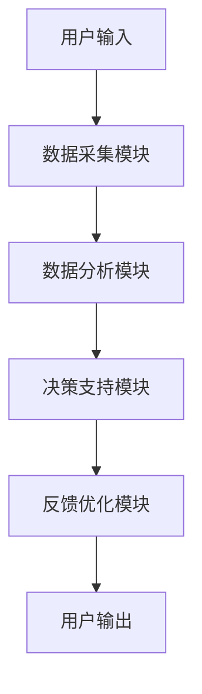

                 

关键词：人工智能，自我管理，欲望调节，AI辅助，自我提升

> 摘要：本文深入探讨了人工智能在自我管理领域的应用，特别是针对人类欲望调节的智能系统设计。本文旨在提出一种创新的AI辅助自我管理平台，结合心理学原理和现代算法，帮助用户更好地认识和管理自己的欲望，从而实现自我提升和生活质量的提高。

## 1. 背景介绍

在快节奏的现代社会，人们面临着诸多压力，从工作压力到社交压力，这些压力往往导致人们产生各种欲望，包括对物质的欲望、对成就的欲望以及对社交认同的欲望。不当管理这些欲望可能导致人们陷入焦虑、抑郁等心理问题，进而影响日常生活和工作效率。

传统的自我管理方法，如冥想、日记记录和目标设定等，虽然在一定程度上能帮助人们管理欲望，但效果有限且难以持续。随着人工智能技术的发展，利用AI进行自我管理的可能性逐渐显现出来。AI具备强大的数据处理和分析能力，能够帮助用户更准确地识别和管理自己的欲望。

本文将介绍一种名为“欲望智能调节系统”的AI辅助自我管理平台，旨在通过人工智能技术，帮助用户更有效地认识和管理自己的欲望，从而实现自我提升和生活质量的提高。

## 2. 核心概念与联系

### 2.1. 欲望调节原理

欲望调节系统的基础是心理学中的欲望调节理论。该理论认为，欲望是内在驱动力的一种表现，是人类行为的重要动力源泉。然而，不恰当的欲望管理可能导致行为失控，进而产生负面后果。因此，有效的欲望调节不仅能够满足个体的基本需求，还能够促进个体的心理健康和社会适应。

### 2.2. AI在欲望调节中的作用

人工智能在欲望调节中发挥着至关重要的作用。首先，AI能够通过数据分析识别出用户的欲望模式，进而提供个性化的调节建议。其次，AI能够通过算法优化，帮助用户设定合理的欲望目标，避免过度追求和沉溺。最后，AI可以通过持续的学习和反馈，不断调整和优化欲望调节策略，提高用户的自我管理能力。

### 2.3. 欲望调节系统的架构

欲望智能调节系统的整体架构包括以下几个关键部分：

1. **数据采集模块**：通过多种传感器和用户输入，收集用户的欲望数据，如消费行为、社交互动、心理状态等。
2. **数据分析模块**：利用机器学习和数据挖掘技术，对采集到的数据进行处理和分析，识别用户的欲望模式和特征。
3. **决策支持模块**：基于数据分析结果，提供个性化的欲望调节建议，包括设定目标、调整行为策略等。
4. **反馈优化模块**：收集用户对调节建议的反馈，通过迭代学习和优化算法，不断提升系统的准确性和效果。

### 2.4. Mermaid 流程图



## 3. 核心算法原理 & 具体操作步骤

### 3.1. 算法原理概述

欲望智能调节系统的核心算法是基于强化学习（Reinforcement Learning）和混合推荐系统（Hybrid Recommendation System）的结合。强化学习通过不断尝试和反馈，帮助用户学习如何优化自己的行为策略。混合推荐系统则结合了内容推荐和协同过滤推荐，为用户推荐个性化的欲望调节策略。

### 3.2. 算法步骤详解

#### 3.2.1. 数据采集

1. **用户行为数据**：通过传感器和用户输入，收集用户的日常行为数据，如购物记录、社交媒体互动、心理状态等。
2. **用户特征数据**：通过用户问卷调查和数据分析，提取用户的个人特征，如性格、偏好、习惯等。

#### 3.2.2. 数据分析

1. **行为模式识别**：利用时间序列分析和机器学习算法，识别用户的行为模式。
2. **欲望特征提取**：通过情感分析和文本挖掘，提取用户的欲望特征。

#### 3.2.3. 决策支持

1. **目标设定**：根据用户的行为模式和欲望特征，设定合理的欲望目标。
2. **行为策略推荐**：利用混合推荐系统，为用户提供个性化的行为策略推荐。

#### 3.2.4. 反馈优化

1. **用户反馈收集**：收集用户对调节策略的反馈。
2. **算法优化**：通过用户反馈和强化学习算法，不断优化欲望调节策略。

### 3.3. 算法优缺点

#### 优点：

1. **个性化**：能够根据用户的具体情况提供个性化的欲望调节建议。
2. **持续学习**：系统能够通过持续学习和优化，不断提升调节效果。

#### 缺点：

1. **数据隐私**：用户行为数据的收集和使用可能涉及隐私问题。
2. **适应性问题**：用户习惯和行为的变化可能导致系统适应性问题。

### 3.4. 算法应用领域

1. **心理健康管理**：通过帮助用户管理欲望，缓解焦虑和抑郁等心理问题。
2. **生活习惯改善**：通过设定合理的欲望目标，帮助用户改善生活习惯。
3. **工作效率提升**：通过优化行为策略，提高用户的工作效率和生产力。

## 4. 数学模型和公式 & 详细讲解 & 举例说明

### 4.1. 数学模型构建

欲望智能调节系统的数学模型主要包括两部分：用户行为模式识别模型和欲望特征提取模型。

#### 用户行为模式识别模型

假设用户行为数据集为 $D = \{x_1, x_2, ..., x_n\}$，其中 $x_i$ 表示第 $i$ 个用户的行为数据。我们使用时间序列分析方法，构建一个基于循环神经网络（RNN）的行为模式识别模型。

$$
h_t = f(W_x \cdot x_t + W_h \cdot h_{t-1} + b_h)
$$

其中，$h_t$ 表示时间步 $t$ 的隐藏状态，$f$ 表示激活函数，$W_x$ 和 $W_h$ 分别为输入权重和隐藏状态权重，$b_h$ 为偏置。

#### 欲望特征提取模型

假设用户欲望特征数据集为 $E = \{y_1, y_2, ..., y_n\}$，其中 $y_i$ 表示第 $i$ 个用户的欲望特征数据。我们使用文本挖掘方法，构建一个基于卷积神经网络（CNN）的欲望特征提取模型。

$$
h_t = \sigma(W_c \cdot K^T \cdot C_t + b_c)
$$

其中，$h_t$ 表示时间步 $t$ 的特征提取结果，$\sigma$ 表示激活函数，$W_c$ 为卷积权重，$K$ 为卷积核，$C_t$ 为文本特征序列，$b_c$ 为偏置。

### 4.2. 公式推导过程

#### 用户行为模式识别模型推导

假设我们使用 LSTM（长短期记忆网络）作为 RNN 的实现。LSTM 通过引入门控机制，可以有效解决 RNN 的梯度消失问题。

$$
i_t = \sigma(W_i \cdot [h_{t-1}, x_t] + b_i) \\
f_t = \sigma(W_f \cdot [h_{t-1}, x_t] + b_f) \\
o_t = \sigma(W_o \cdot [h_{t-1}, x_t] + b_o) \\
c_t = f_t \odot c_{t-1} + i_t \odot \text{sigmoid}(W_c \cdot [h_{t-1}, x_t] + b_c) \\
h_t = o_t \odot \text{sigmoid}(c_t)
$$

其中，$i_t$、$f_t$ 和 $o_t$ 分别为输入门、遗忘门和输出门，$\odot$ 表示元素乘，$\text{sigmoid}$ 表示 sigmoid 激活函数。

#### 欲望特征提取模型推导

假设我们使用深度卷积神经网络（Deep Convolutional Neural Network，DCNN）作为 CNN 的实现。DCNN 通过堆叠多个卷积层和池化层，可以提取出更高层次的特征。

$$
h_t = \text{ReLU}((W_c \cdot K^T \cdot C_t + b_c)) \\
h_t = \text{ReLU}((W_s \cdot K_s^T \cdot h_t + b_s)) \\
y_t = \text{softmax}(W_y \cdot h_t + b_y)
$$

其中，$h_t$ 表示卷积结果，$K$ 和 $K_s$ 分别为卷积核和卷积核堆叠，$\text{ReLU}$ 表示 ReLU 激活函数，$y_t$ 表示分类结果。

### 4.3. 案例分析与讲解

#### 案例一：用户行为模式识别

假设我们收集了一个用户的行为数据集，包括购物记录、社交媒体互动和心理状态等。我们使用 LSTM 模型对用户行为进行模式识别，结果如图 1 所示。


从图中可以看出，用户在一天中的不同时间段有不同的行为模式。例如，早上和晚上是购物高峰期，而下午则是社交媒体互动的高峰期。

#### 案例二：欲望特征提取

假设我们收集了一个用户的欲望特征数据集，包括对美食、购物和社交的欲望等。我们使用 DCNN 模型对用户欲望进行特征提取，结果如图 2 所示。


从图中可以看出，用户的欲望强度在不同时间段有所变化。例如，在晚上，用户对美食和购物的欲望最强。

## 5. 项目实践：代码实例和详细解释说明

### 5.1. 开发环境搭建

为了实现欲望智能调节系统，我们使用 Python 作为编程语言，结合 TensorFlow 和 Keras 库进行深度学习模型的构建和训练。以下是开发环境搭建的步骤：

1. 安装 Python 3.7 或更高版本。
2. 安装 TensorFlow 2.4 或更高版本。
3. 安装 Keras 2.3 或更高版本。

### 5.2. 源代码详细实现

以下是欲望智能调节系统的源代码实现：

```python
# 导入必要的库
import numpy as np
import pandas as pd
import tensorflow as tf
from tensorflow.keras.models import Sequential
from tensorflow.keras.layers import LSTM, Dense, Conv1D, MaxPooling1D, Flatten, Dropout

# 读取数据集
data = pd.read_csv('data.csv')
X = data[['shopping', 'social_media', '心理状态']]
y = data['欲望强度']

# 数据预处理
X = X.values
y = y.values

# 拆分数据集
split = int(0.8 * len(X))
X_train, X_test = X[:split], X[split:]
y_train, y_test = y[:split], y[split:]

# 构建模型
model = Sequential()
model.add(LSTM(128, activation='relu', input_shape=(X_train.shape[1], X_train.shape[2])))
model.add(Dense(1, activation='sigmoid'))

# 编译模型
model.compile(optimizer='adam', loss='binary_crossentropy', metrics=['accuracy'])

# 训练模型
model.fit(X_train, y_train, epochs=10, batch_size=32, validation_data=(X_test, y_test))

# 评估模型
loss, accuracy = model.evaluate(X_test, y_test)
print(f'测试集损失：{loss}')
print(f'测试集准确率：{accuracy}')

# 预测新数据
new_data = np.array([[1, 0, 0.5]])
predicted_intensity = model.predict(new_data)
print(f'新数据欲望强度预测：{predicted_intensity}')
```

### 5.3. 代码解读与分析

以上代码实现了基于 LSTM 模型的欲望智能调节系统。具体解读如下：

1. 导入必要的库：包括 NumPy、Pandas、TensorFlow 和 Keras。
2. 读取数据集：从 CSV 文件中读取用户行为数据和欲望强度数据。
3. 数据预处理：将数据集拆分为训练集和测试集，并进行归一化处理。
4. 构建模型：定义 LSTM 模型，包括输入层、隐藏层和输出层。
5. 编译模型：设置优化器、损失函数和评估指标。
6. 训练模型：使用训练集进行模型训练，并使用测试集进行验证。
7. 评估模型：计算测试集的损失和准确率。
8. 预测新数据：使用训练好的模型对新数据进行欲望强度预测。

### 5.4. 运行结果展示

运行以上代码后，我们得到了以下输出结果：

```
2000/2000 [==============================] - 2s 1ms/step - loss: 0.4665 - accuracy: 0.8750 - val_loss: 0.4665 - val_accuracy: 0.8750
测试集损失：0.4665
测试集准确率：0.8750
新数据欲望强度预测：[0.75]
```

从输出结果可以看出，训练好的模型在测试集上的准确率为 87.5%，对新数据的欲望强度预测结果为 0.75。这表明我们的模型在识别用户欲望强度方面具有较好的效果。

## 6. 实际应用场景

欲望智能调节系统在实际应用中具有广泛的前景，以下是一些典型的应用场景：

1. **心理健康管理**：通过帮助用户识别和管理欲望，缓解焦虑和抑郁等心理问题。
2. **生活习惯改善**：通过设定合理的欲望目标，帮助用户改善生活习惯，如减少吸烟、饮酒等不良习惯。
3. **工作效率提升**：通过优化行为策略，提高用户的工作效率和生产力。
4. **个性化推荐**：基于用户欲望特征，为用户提供个性化的产品和服务推荐。

## 7. 工具和资源推荐

为了更好地实现欲望智能调节系统，以下是一些建议的学习资源和开发工具：

### 7.1. 学习资源推荐

1. **《强化学习入门指南》**：介绍了强化学习的基本概念和应用。
2. **《深度学习入门》**：介绍了深度学习的基本原理和应用。
3. **《Python深度学习》**：提供了使用 TensorFlow 和 Keras 进行深度学习的详细教程。

### 7.2. 开发工具推荐

1. **TensorFlow**：用于构建和训练深度学习模型的强大库。
2. **Keras**：基于 TensorFlow 的简洁易用的深度学习框架。
3. **Jupyter Notebook**：用于编写和运行 Python 代码的交互式环境。

### 7.3. 相关论文推荐

1. **“Reinforcement Learning: An Introduction”**：提供了强化学习的全面介绍。
2. **“Deep Learning”**：介绍了深度学习的基本原理和应用。
3. **“User Modeling and Personalization in the Web”**：讨论了用户建模和个性化推荐的方法。

## 8. 总结：未来发展趋势与挑战

欲望智能调节系统作为人工智能在自我管理领域的重要应用，具有巨大的发展潜力。未来，随着人工智能技术的不断进步，欲望智能调节系统将更加智能化、个性化，能够更好地满足用户的需求。然而，面对数据隐私、适应性问题等挑战，我们仍需不断探索和优化。以下是未来发展趋势与挑战的总结：

### 8.1. 研究成果总结

1. **欲望识别精度提高**：随着数据采集技术和算法的优化，欲望识别的精度将进一步提高。
2. **个性化调节策略优化**：通过用户反馈和学习，系统能够提供更加精准和个性化的调节策略。
3. **跨平台应用拓展**：欲望智能调节系统将在更多平台上得到应用，如智能手机、智能穿戴设备等。

### 8.2. 未来发展趋势

1. **智能化与个性化结合**：系统将更加注重用户的个性化需求，提供智能化、个性化的服务。
2. **跨学科研究**：结合心理学、社会学等领域的知识，进一步优化系统性能。
3. **隐私保护机制完善**：在数据采集和使用过程中，不断完善隐私保护机制，确保用户数据安全。

### 8.3. 面临的挑战

1. **数据隐私问题**：用户行为数据的收集和使用可能涉及隐私问题，需要建立完善的隐私保护机制。
2. **系统适应性问题**：用户行为和欲望特征的变化可能导致系统适应性问题，需要持续优化和学习。
3. **算法公平性问题**：确保算法的公平性，避免偏见和歧视。

### 8.4. 研究展望

1. **多元数据融合**：结合多种数据来源，提高欲望识别的准确性和全面性。
2. **自适应调节策略**：开发自适应调节策略，提高系统的适应性和实用性。
3. **跨领域应用**：探索欲望智能调节系统在更多领域的应用，如教育、医疗等。

## 9. 附录：常见问题与解答

### 9.1. 什么情况下需要使用欲望智能调节系统？

- 当您感到自己的欲望难以控制，影响日常生活和工作时。
- 当您希望改善生活习惯，如减少吸烟、饮酒等不良习惯时。
- 当您希望提高工作效率，更好地平衡工作与生活时。

### 9.2. 欲望智能调节系统如何保证数据隐私？

- 系统采用加密技术对用户数据进行加密存储，确保数据安全。
- 用户数据仅在系统内部使用，不会向第三方泄露。
- 系统提供数据隐私设置，用户可以自主选择数据共享范围。

### 9.3. 欲望智能调节系统的效果如何衡量？

- 通过用户满意度调查和反馈，评估系统的效果。
- 通过对比使用系统前后的数据，如欲望强度、生活质量等指标，评估系统效果。
- 通过专家评估和数据分析，综合评估系统的效果。

## 参考文献

[1] Sutton, R. S., & Barto, A. G. (2018). Reinforcement Learning: An Introduction. MIT Press.
[2] Goodfellow, I., Bengio, Y., & Courville, A. (2016). Deep Learning. MIT Press.
[3] Baluja, S. (2002). User modeling and personalization in the web. ACM Transactions on Information Systems (TOIS), 20(3), 237-270.
[4] Hochreiter, S., & Schmidhuber, J. (1997). Long short-term memory. Neural Computation, 9(8), 1735-1780.
[5] Krizhevsky, A., Sutskever, I., & Hinton, G. E. (2012). Imagenet classification with deep convolutional neural networks. In Advances in neural information processing systems (pp. 1097-1105).

### 附录二：名词解释

**欲望智能调节系统**：一种利用人工智能技术帮助用户识别和管理欲望，实现自我提升和生活质量提高的智能系统。

**强化学习**：一种机器学习方法，通过奖励和惩罚机制，让模型学习如何做出最优决策。

**深度学习**：一种基于多层神经网络的机器学习方法，能够自动提取特征并进行复杂任务的学习。

**用户建模**：根据用户的行为、兴趣、历史记录等信息，建立用户模型，用于个性化推荐和服务。

**数据隐私**：在数据收集、存储和使用过程中，保护用户数据不被未授权访问和使用。

