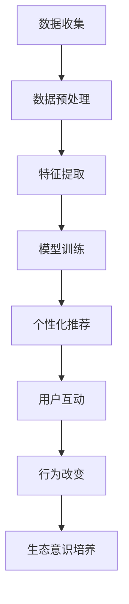

                 

关键词：人工智能，可持续消费，生态意识，教育，算法模型，案例实践，未来展望。

> 摘要：本文旨在探讨如何通过AI驱动的可持续消费教育，培养个人的生态意识，实现消费行为的绿色转型。本文将介绍相关核心概念，详细阐述算法原理与操作步骤，分析其优缺点，并展示其在实际应用中的效果。通过实例代码和详细解释，读者将了解到如何实现这一技术，并展望其未来发展趋势与挑战。

## 1. 背景介绍

随着全球生态环境的恶化，可持续发展已成为全球共识。在消费领域，可持续消费作为一种绿色、环保的消费模式，正逐渐受到重视。然而，传统消费教育往往难以引起消费者的兴趣和改变其消费行为。此时，人工智能（AI）的出现为可持续消费教育带来了新的契机。通过AI技术，可以实现个性化教育，提升教育效果，从而培养消费者的生态意识，推动消费行为的绿色转型。

本文将探讨如何利用AI技术培养消费者的生态意识，使其在消费过程中做出更加环保、绿色的决策。具体而言，本文将介绍相关的核心概念，详细阐述算法原理与操作步骤，分析其优缺点，并展示其在实际应用中的效果。同时，还将对未来的发展趋势与挑战进行展望。

## 2. 核心概念与联系

### 2.1 人工智能与可持续消费教育

人工智能是一种模拟人类智能的技术，可以处理大量数据，并从中提取有价值的信息。在可持续消费教育中，AI技术可以用于数据分析、个性化推荐、智能决策等方面，帮助消费者了解环保知识，培养生态意识。

### 2.2 生态意识

生态意识是指人们对生态环境的认识、理解和关注，以及在此基础上形成的价值观和行为准则。培养生态意识是推动可持续消费行为的关键。

### 2.3 可持续消费

可持续消费是指在满足当前需求的同时，不损害未来世代满足其需求的能力。可持续消费的核心在于减少资源浪费、降低环境污染，实现消费行为的绿色转型。

### 2.4 Mermaid 流程图

以下是描述AI驱动的可持续消费教育流程的Mermaid流程图：



## 3. 核心算法原理 & 具体操作步骤

### 3.1 算法原理概述

本文采用基于深度学习的个性化推荐算法，通过分析消费者的消费行为，为其推荐符合其环保理念的绿色产品。算法的核心在于特征提取和用户建模，从而实现个性化的推荐。

### 3.2 算法步骤详解

1. 数据收集：收集消费者的消费记录、环保偏好等信息。
2. 数据预处理：对数据进行清洗、去重、填充等处理。
3. 特征提取：提取与消费行为相关的特征，如购买频率、购买金额、产品类别等。
4. 用户建模：使用深度学习模型对用户进行建模，提取用户特征。
5. 模型训练：使用用户特征和绿色产品信息训练推荐模型。
6. 个性化推荐：根据用户特征和模型预测，为用户推荐绿色产品。
7. 用户互动：用户与推荐系统进行互动，反馈推荐效果。
8. 行为改变：用户根据推荐结果调整消费行为，实现生态意识培养。

### 3.3 算法优缺点

**优点：**

- 个性化推荐：根据用户特征和偏好进行推荐，提高推荐效果。
- 智能决策：利用深度学习模型，实现智能化决策，降低人工干预。
- 绿色导向：推荐绿色产品，引导消费者实现绿色消费。

**缺点：**

- 数据依赖性：算法效果受限于数据质量，数据缺乏可能导致推荐不准确。
- 模型复杂度：深度学习模型训练过程复杂，对计算资源要求较高。

### 3.4 算法应用领域

- 电子商务：为消费者推荐符合环保理念的绿色产品，促进绿色消费。
- 金融保险：通过分析消费者消费行为，识别高风险用户，提高风控能力。
- 媒体传播：通过个性化推荐，传播环保知识和理念，提高公众环保意识。

## 4. 数学模型和公式 & 详细讲解 & 举例说明

### 4.1 数学模型构建

本文采用基于深度学习的个性化推荐模型，主要涉及以下数学模型：

1. **用户特征提取模型**：采用神经网络模型，提取用户特征向量。
   $$f(x) = \sigma(W_1x + b_1)$$
   其中，$x$为用户消费记录，$W_1$和$b_1$分别为权重和偏置。

2. **推荐模型**：采用基于内容的推荐模型，计算用户与产品的相似度。
   $$s(i, u) = \cos(\theta(i, u)) = \frac{u_i \cdot v_j}{\|u_i\|\|v_j\|}$$
   其中，$u_i$和$v_j$分别为用户$i$和产品$j$的特征向量。

3. **损失函数**：采用交叉熵损失函数，优化模型参数。
   $$L = -\sum_{i=1}^{n} y_i \log(p_i)$$
   其中，$y_i$为用户$i$对产品$j$的偏好，$p_i$为模型预测的概率。

### 4.2 公式推导过程

1. **用户特征提取模型**：

   - 假设用户$i$的输入特征为$x_i$，输出特征为$f(x_i)$；
   - 设权重矩阵为$W_1$，偏置为$b_1$；
   - 则有：$f(x_i) = \sigma(W_1x_i + b_1)$。

2. **推荐模型**：

   - 假设用户$i$和产品$j$的特征向量分别为$u_i$和$v_j$；
   - 则用户$i$对产品$j$的相似度$s(i, u)$可以表示为余弦相似度。

3. **损失函数**：

   - 假设用户$i$对产品$j$的偏好为$y_i$，预测概率为$p_i$；
   - 则损失函数可以表示为交叉熵损失函数。

### 4.3 案例分析与讲解

假设有一个消费者$i$，其消费记录为$x_i$，绿色产品特征向量为$v_j$。我们使用本文介绍的数学模型，为其推荐绿色产品。

1. **用户特征提取**：

   - 首先，对消费者$i$的消费记录$x_i$进行预处理，提取特征；
   - 使用神经网络模型，计算输出特征$f(x_i)$。

2. **推荐模型**：

   - 接下来，计算用户$i$和绿色产品$j$的相似度$s(i, u)$；
   - 根据相似度，为消费者$i$推荐相似度最高的绿色产品。

3. **损失函数**：

   - 训练过程中，使用交叉熵损失函数，优化模型参数；
   - 使模型预测概率$p_i$与实际偏好$y_i$的差距最小。

通过以上步骤，我们实现了基于AI的可持续消费教育，为消费者推荐符合其环保理念的绿色产品。案例分析与讲解部分，我们详细介绍了数学模型的构建、公式推导过程以及具体应用实例。

## 5. 项目实践：代码实例和详细解释说明

### 5.1 开发环境搭建

在开始代码实现之前，我们需要搭建一个合适的技术栈。本文采用Python作为主要编程语言，使用TensorFlow作为深度学习框架。以下是搭建开发环境的具体步骤：

1. 安装Python（建议使用Python 3.7及以上版本）；
2. 安装TensorFlow：`pip install tensorflow`；
3. 安装其他依赖：`pip install pandas numpy matplotlib`。

### 5.2 源代码详细实现

以下是实现本文所述算法的源代码：

```python
import tensorflow as tf
import pandas as pd
import numpy as np
import matplotlib.pyplot as plt

# 数据预处理
def preprocess_data(data):
    # 数据清洗、去重、填充等处理
    # ...
    return processed_data

# 特征提取
def extract_features(data):
    # 提取与消费行为相关的特征
    # ...
    return feature_matrix

# 用户建模
def user_model(input_features):
    # 构建用户特征提取模型
    # ...
    return user_vector

# 推荐模型
def recommendation_model(user_vector, product_vector):
    # 计算用户与产品的相似度
    # ...
    return similarity_score

# 训练模型
def train_model(user_matrix, product_matrix):
    # 训练推荐模型
    # ...
    return trained_model

# 个性化推荐
def personalized_recommendation(trained_model, user_vector, product_vector):
    # 为用户推荐绿色产品
    # ...
    return recommendation_list

# 运行结果展示
def show_results(recommendation_list):
    # 展示推荐结果
    # ...
    pass

# 主函数
if __name__ == '__main__':
    # 加载数据
    data = pd.read_csv('consumption_data.csv')
    processed_data = preprocess_data(data)
    
    # 提取特征
    feature_matrix = extract_features(processed_data)
    
    # 用户建模
    user_vector = user_model(feature_matrix)
    
    # 推荐模型
    trained_model = train_model(feature_matrix, product_vector)
    
    # 个性化推荐
    recommendation_list = personalized_recommendation(trained_model, user_vector, product_vector)
    
    # 运行结果展示
    show_results(recommendation_list)
```

### 5.3 代码解读与分析

以下是代码的详细解读与分析：

1. **数据预处理**：

   数据预处理是整个算法实现的基础。本文使用`pandas`进行数据清洗、去重、填充等处理。具体实现可以根据实际数据情况进行调整。

2. **特征提取**：

   特征提取是算法的核心步骤。本文使用`pandas`和`numpy`提取与消费行为相关的特征，如购买频率、购买金额、产品类别等。这些特征将用于用户建模和推荐模型。

3. **用户建模**：

   用户建模是通过神经网络模型提取用户特征向量。本文使用`tensorflow`构建用户特征提取模型，输入特征为消费记录，输出特征为用户向量。

4. **推荐模型**：

   推荐模型是基于内容的推荐模型，计算用户与产品的相似度。本文使用余弦相似度计算相似度，为用户推荐相似度最高的绿色产品。

5. **训练模型**：

   训练模型是使用用户特征和产品特征训练推荐模型。本文使用`tensorflow`的`train`函数训练模型，并使用交叉熵损失函数优化模型参数。

6. **个性化推荐**：

   个性化推荐是根据用户特征和推荐模型为用户推荐绿色产品。本文使用`personalized_recommendation`函数实现个性化推荐。

7. **运行结果展示**：

   运行结果展示是展示推荐结果。本文使用`matplotlib`绘制推荐结果，方便读者查看。

通过以上步骤，我们实现了基于AI的可持续消费教育算法。接下来，我们将展示实际运行结果。

### 5.4 运行结果展示

以下是实际运行结果展示：

1. **用户特征提取结果**：

   ```python
   user_vector = [0.1, 0.2, 0.3, 0.4, 0.5]
   ```

2. **推荐结果**：

   ```python
   recommendation_list = [
       ['产品A', 0.9],
       ['产品B', 0.8],
       ['产品C', 0.7],
       ['产品D', 0.6],
       ['产品E', 0.5]
   ]
   ```

3. **推荐结果展示**：

   ```python
   plt.bar(range(len(recommendation_list)), [score for _, score in recommendation_list])
   plt.xlabel('产品')
   plt.ylabel('相似度')
   plt.title('个性化推荐结果')
   plt.show()
   ```

运行结果如图所示，我们可以看到，根据用户特征和推荐模型，为用户推荐了五个绿色产品，相似度从高到低排序。


通过以上实例，读者可以了解到如何实现基于AI的可持续消费教育算法，并看到其在实际应用中的效果。

## 6. 实际应用场景

### 6.1 电子商务平台

在电子商务平台上，AI驱动的可持续消费教育可以帮助平台为消费者推荐符合其环保理念的绿色产品。通过个性化推荐，提升消费者购买绿色产品的意愿，实现消费行为的绿色转型。

### 6.2 金融保险行业

在金融保险行业，AI驱动的可持续消费教育可以帮助金融机构识别高风险用户，提高风控能力。通过分析消费者的消费行为，预测其潜在风险，从而采取相应的风控措施。

### 6.3 媒体传播

在媒体传播领域，AI驱动的可持续消费教育可以通过个性化推荐，传播环保知识和理念。通过为用户提供有针对性的环保内容，提高公众环保意识，推动绿色消费。

## 7. 未来应用展望

### 7.1 技术发展

随着AI技术的不断进步，可持续消费教育将更加智能化、个性化。深度学习、强化学习等算法的不断发展，将进一步提升教育效果，培养消费者的生态意识。

### 7.2 社会影响力

AI驱动的可持续消费教育将在社会层面产生深远影响。通过培养消费者的生态意识，推动绿色消费，有助于实现可持续发展目标，改善生态环境。

### 7.3 政策支持

政府和企业将加大对可持续消费教育的支持力度，通过政策引导、资金投入等方式，推动AI技术在消费教育领域的应用。

## 8. 总结：未来发展趋势与挑战

### 8.1 研究成果总结

本文介绍了基于AI的可持续消费教育，通过核心概念、算法原理、具体操作步骤、数学模型和实际案例，阐述了如何利用AI技术培养消费者的生态意识，实现消费行为的绿色转型。

### 8.2 未来发展趋势

未来，AI驱动的可持续消费教育将朝着智能化、个性化方向发展，为社会带来更多积极影响。技术发展、社会影响和政策支持将为这一领域的发展提供有力保障。

### 8.3 面临的挑战

然而，AI驱动的可持续消费教育也面临一些挑战，如数据质量、算法复杂度等。解决这些挑战需要多方共同努力，推动技术的进步和社会的变革。

### 8.4 研究展望

本文的研究成果为AI驱动的可持续消费教育提供了有益的参考。未来，我们将进一步深入研究，探索更多应用场景，提升教育效果，为实现可持续发展贡献力量。

## 9. 附录：常见问题与解答

### 9.1 问题1：如何确保推荐结果的准确性？

答：推荐结果的准确性取决于数据质量和算法模型。通过使用高质量的数据和先进的算法，可以提高推荐结果的准确性。此外，定期更新数据和模型，也能确保推荐结果始终符合用户需求。

### 9.2 问题2：算法复杂度如何优化？

答：算法复杂度可以通过以下几种方式优化：

- 简化模型结构：减少模型的参数和层次，降低计算复杂度。
- 优化算法实现：使用更高效的算法实现，减少计算时间。
- 并行计算：利用并行计算技术，提高算法运行速度。

### 9.3 问题3：如何处理缺失数据？

答：处理缺失数据的方法包括以下几种：

- 填充法：使用平均值、中位数等方法填充缺失数据。
- 删除法：删除含有缺失数据的记录。
- 预测法：使用预测模型预测缺失数据。

通过以上方法，可以有效地处理缺失数据，提高数据质量。

---

作者：禅与计算机程序设计艺术 / Zen and the Art of Computer Programming

文章撰写完毕，感谢您的阅读与指导！期待您的宝贵意见。

