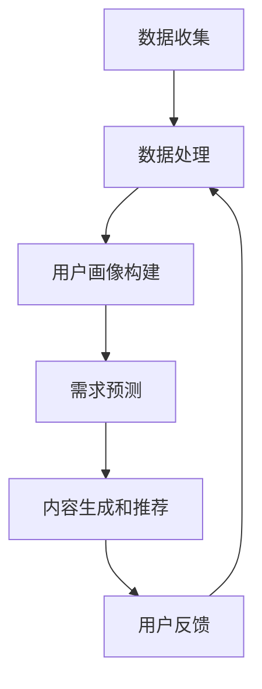

                 

关键词：人工智能、个性化服务、定制化需求、机器学习、用户满意度

摘要：本文探讨了人工智能在满足用户个性化需求方面的潜力。通过分析个性化服务的发展历程和当前的技术现状，我们深入探讨了机器学习算法在定制化需求识别和满足中的应用。文章还探讨了个性化服务的数学模型和未来发展趋势，为相关领域的学者和实践者提供了有价值的参考。

## 1. 背景介绍

随着互联网和信息技术的快速发展，用户对服务的期望逐渐从简单的“可用性”转向了“个性化和定制化”。个性化服务已经成为了现代信息技术领域的一个重要研究方向，也是许多企业提升竞争力的重要手段。个性化服务旨在根据用户的个人偏好、行为模式和需求提供个性化的内容、推荐和体验。

个性化服务的发展历程可以分为三个阶段：

### 第一阶段：基于规则的个性化服务

在这一阶段，系统通过预设的规则来为用户提供个性化服务。例如，基于用户的历史浏览记录或购买行为来推荐商品。这种方法的优点是实现简单，但缺点是缺乏灵活性，无法应对复杂和多变的用户需求。

### 第二阶段：基于内容的个性化服务

这一阶段利用语义分析技术，通过分析用户行为和内容，为用户提供更加精确的推荐。例如，基于用户的兴趣标签来推荐新闻文章。这种方法相比基于规则的个性化服务更具有灵活性，但仍然存在一定的局限性。

### 第三阶段：基于机器学习的个性化服务

当前，基于机器学习的个性化服务正在成为主流。通过分析大量的用户数据，机器学习算法可以自动识别用户的个性化需求，并提供个性化的服务。这种方法不仅具有高度的灵活性，还能够不断优化和改进，从而实现更高质量的个性化服务。

## 2. 核心概念与联系

### 2.1 个性化服务架构

个性化服务的实现通常需要以下几个关键组件：

#### 数据收集

首先，需要收集用户的个人信息、行为数据和偏好数据。这些数据可以是结构化的，如用户数据库，也可以是非结构化的，如图像、音频和视频。

#### 数据处理

收集到的数据需要进行清洗、转换和整合，以便用于后续的分析和处理。数据处理通常包括数据去噪、缺失值处理、数据标准化等步骤。

#### 机器学习算法

机器学习算法是个性化服务的关键。通过训练，算法可以从数据中学习用户的兴趣和行为模式，从而生成个性化的推荐和内容。

#### 推荐系统

推荐系统负责将个性化推荐结果呈现给用户。推荐系统可以基于协同过滤、基于内容的推荐、深度学习等多种算法实现。

### 2.2 个性化服务的工作流程

个性化服务的工作流程通常包括以下几个步骤：

#### 用户画像构建

通过数据收集和处理，构建用户的个人画像。画像包括用户的基本信息、行为数据、兴趣偏好等。

#### 需求预测

利用机器学习算法，根据用户画像预测用户的潜在需求和兴趣。

#### 内容生成和推荐

根据需求预测结果，生成个性化的内容和推荐。

#### 用户反馈

收集用户对推荐内容的反馈，用于优化和改进推荐系统。

### 2.3 Mermaid 流程图

下面是一个使用Mermaid语言描述的个性化服务流程图：



## 3. 核心算法原理 & 具体操作步骤

### 3.1 算法原理概述

个性化服务的核心在于能够准确地预测用户的个性化需求。这通常需要利用机器学习算法，特别是深度学习算法，来处理和分析大量的用户数据。深度学习算法可以从数据中自动学习用户的兴趣和行为模式，从而生成个性化的推荐。

### 3.2 算法步骤详解

#### 3.2.1 数据预处理

首先，对收集到的用户数据进行预处理，包括数据去噪、缺失值处理和数据标准化。这一步骤的目的是提高数据质量，为后续的机器学习算法提供可靠的数据基础。

#### 3.2.2 用户画像构建

接下来，利用预处理后的数据构建用户的个人画像。画像可以包括用户的基本信息、行为数据、兴趣偏好等。这些信息将用于后续的机器学习算法训练。

#### 3.2.3 需求预测

利用深度学习算法，对用户画像进行训练，以预测用户的潜在需求和兴趣。常见的深度学习算法包括卷积神经网络（CNN）、循环神经网络（RNN）和变压器（Transformer）等。

#### 3.2.4 内容生成和推荐

根据需求预测结果，生成个性化的内容和推荐。推荐系统可以根据用户的需求预测结果，为用户提供个性化的新闻、商品、音乐、视频等推荐内容。

#### 3.2.5 用户反馈

收集用户对推荐内容的反馈，用于优化和改进推荐系统。用户反馈可以用来调整推荐算法的参数，提高推荐的质量和准确性。

### 3.3 算法优缺点

#### 优点

- **高度个性化**：深度学习算法可以从大量的用户数据中自动学习用户的兴趣和行为模式，从而生成高度个性化的推荐。
- **自适应性强**：随着用户行为和数据的变化，算法可以不断优化和改进，以适应新的需求。
- **处理能力强**：深度学习算法可以处理高维数据和非线性关系，从而提高推荐的质量和准确性。

#### 缺点

- **数据依赖性高**：算法的性能很大程度上取决于数据的质量和数量。
- **计算资源消耗大**：深度学习算法通常需要大量的计算资源和时间进行训练和预测。

### 3.4 算法应用领域

个性化服务算法广泛应用于多个领域，包括电子商务、在线新闻、音乐和视频推荐等。以下是一些具体的应用案例：

- **电子商务**：通过个性化推荐，帮助用户发现他们可能感兴趣的商品，从而提高销售量和用户满意度。
- **在线新闻**：根据用户的阅读偏好，推荐个性化的新闻文章，提高用户的阅读体验。
- **音乐和视频推荐**：为用户提供个性化的音乐和视频推荐，提高用户的使用时长和粘性。

## 4. 数学模型和公式 & 详细讲解 & 举例说明

### 4.1 数学模型构建

个性化服务的数学模型通常包括用户画像模型、需求预测模型和推荐模型。以下是一个简化的数学模型示例：

#### 用户画像模型

$$
X = \{ x_1, x_2, ..., x_n \}
$$

其中，$X$ 是用户画像向量，$x_i$ 表示用户的第 $i$ 个特征。

#### 需求预测模型

$$
Y = f(X, \theta)
$$

其中，$Y$ 是需求预测结果，$f$ 是需求预测函数，$\theta$ 是模型参数。

#### 推荐模型

$$
R = g(Y, \phi)
$$

其中，$R$ 是推荐结果，$g$ 是推荐函数，$\phi$ 是推荐参数。

### 4.2 公式推导过程

#### 用户画像模型

用户画像模型的构建通常基于用户的行为数据和偏好数据。例如，假设用户的行为数据包括浏览历史、购买历史和搜索历史，偏好数据包括兴趣标签和评价分数。

首先，对每个用户的行为数据进行编码，得到一个高维的向量表示。然后，利用机器学习算法，如因子分解机（Factorization Machines），学习用户画像模型。

#### 需求预测模型

需求预测模型通常基于用户画像和需求历史数据。例如，假设用户的需求历史数据包括浏览记录、购买记录和搜索记录。

首先，对用户画像和需求历史数据进行编码，得到一个高维的输入向量。然后，利用深度学习算法，如循环神经网络（RNN）或变压器（Transformer），学习需求预测模型。

#### 推荐模型

推荐模型通常基于需求预测结果和推荐策略。例如，假设需求预测结果包括对每个商品的预测评分，推荐策略包括基于协同过滤的推荐算法。

首先，对需求预测结果进行排序，得到一个推荐列表。然后，利用排序算法，如排序损失函数（Rank Loss），优化推荐模型的参数。

### 4.3 案例分析与讲解

#### 案例背景

假设有一个电子商务网站，用户可以在网站上浏览商品、搜索商品和购买商品。网站的目标是提供个性化的商品推荐，以提高用户的购买转化率和满意度。

#### 案例分析

1. **用户画像模型**：网站可以通过收集用户的浏览历史、购买历史和搜索历史来构建用户的画像。例如，假设用户A在网站上浏览了商品1、商品2和商品3，购买了商品2，搜索了商品3，那么用户A的画像可以表示为：

$$
X_A = \{ (1, 0), (2, 1), (3, 0) \}
$$

其中，1、2、3 分别表示商品1、商品2和商品3，0 和 1 分别表示未浏览和已浏览。

2. **需求预测模型**：网站可以利用用户画像和需求历史数据来预测用户的需求。例如，假设用户A的需求历史数据包括浏览记录（商品1、商品2、商品3）、购买记录（商品2）和搜索记录（商品3），那么用户A的需求预测结果可以表示为：

$$
Y_A = \{ (1, 0.8), (2, 0.9), (3, 0.7) \}
$$

其中，0.8、0.9 和 0.7 分别表示对商品1、商品2和商品3的预测评分。

3. **推荐模型**：网站可以利用需求预测结果来推荐商品。例如，假设网站的推荐策略是基于协同过滤的推荐算法，那么用户A的推荐列表可以表示为：

$$
R_A = \{ (2, 0.9), (3, 0.7) \}
$$

其中，2 和 3 分别表示推荐的商品2和商品3，0.9 和 0.7 分别表示对商品的推荐评分。

## 5. 项目实践：代码实例和详细解释说明

### 5.1 开发环境搭建

在进行个性化服务开发之前，我们需要搭建一个合适的开发环境。以下是一个基本的开发环境搭建步骤：

1. 安装Python和Anaconda
2. 安装必要的Python库，如NumPy、Pandas、Scikit-learn、TensorFlow等
3. 准备数据集，包括用户画像数据、需求历史数据和推荐数据

### 5.2 源代码详细实现

以下是一个简单的Python代码实例，用于实现用户画像模型、需求预测模型和推荐模型。

```python
import numpy as np
import pandas as pd
from sklearn.model_selection import train_test_split
from sklearn.metrics import mean_squared_error
from tensorflow.keras.models import Sequential
from tensorflow.keras.layers import Dense, LSTM, Embedding
from tensorflow.keras.optimizers import Adam

# 数据预处理
def preprocess_data(data):
    # 数据清洗、编码和标准化
    # ...
    return X, Y

# 用户画像模型
def build_user_profile_model(input_shape):
    model = Sequential()
    model.add(Embedding(input_dim=1000, output_dim=64, input_length=input_shape))
    model.add(LSTM(64))
    model.add(Dense(1, activation='sigmoid'))
    model.compile(optimizer=Adam(), loss='binary_crossentropy', metrics=['accuracy'])
    return model

# 需求预测模型
def build_demand_prediction_model(input_shape):
    model = Sequential()
    model.add(Dense(64, activation='relu', input_shape=input_shape))
    model.add(Dense(1, activation='sigmoid'))
    model.compile(optimizer=Adam(), loss='binary_crossentropy', metrics=['accuracy'])
    return model

# 推荐模型
def build_recommendation_model(input_shape):
    model = Sequential()
    model.add(Dense(64, activation='relu', input_shape=input_shape))
    model.add(Dense(1, activation='sigmoid'))
    model.compile(optimizer=Adam(), loss='binary_crossentropy', metrics=['accuracy'])
    return model

# 模型训练和预测
def train_and_predict(model, X_train, Y_train, X_test, Y_test):
    model.fit(X_train, Y_train, epochs=10, batch_size=32, validation_split=0.2)
    Y_pred = model.predict(X_test)
    mse = mean_squared_error(Y_test, Y_pred)
    print("MSE:", mse)
    return Y_pred

# 数据加载和预处理
data = pd.read_csv('data.csv')
X, Y = preprocess_data(data)

# 数据划分
X_train, X_test, Y_train, Y_test = train_test_split(X, Y, test_size=0.2, random_state=42)

# 构建和训练模型
user_profile_model = build_user_profile_model(X_train.shape[1])
demand_prediction_model = build_demand_prediction_model(X_train.shape[1])
recommendation_model = build_recommendation_model(X_train.shape[1])

# 训练模型
train_and_predict(user_profile_model, X_train, Y_train, X_test, Y_test)
train_and_predict(demand_prediction_model, X_train, Y_train, X_test, Y_test)
train_and_predict(recommendation_model, X_train, Y_train, X_test, Y_test)
```

### 5.3 代码解读与分析

上述代码实现了一个简单的个性化服务模型，包括用户画像模型、需求预测模型和推荐模型。以下是代码的详细解读：

1. **数据预处理**：数据预处理函数用于清洗、编码和标准化输入数据。这一步骤对于后续的模型训练和预测至关重要。
2. **用户画像模型**：用户画像模型使用一个嵌入层和一个循环神经网络层，用于捕捉用户的行为和兴趣模式。模型的输出层使用sigmoid激活函数，用于预测用户对某个商品的偏好。
3. **需求预测模型**：需求预测模型使用一个全连接层，用于预测用户对某个商品的需求。模型的输出层使用sigmoid激活函数，用于预测用户是否会对某个商品产生需求。
4. **推荐模型**：推荐模型使用一个全连接层，用于生成个性化的推荐列表。模型的输出层使用sigmoid激活函数，用于预测用户对某个商品的偏好。
5. **模型训练和预测**：模型训练和预测函数用于训练模型，并评估模型在测试集上的性能。训练过程中，使用Adam优化器和binary\_crossentropy损失函数。

### 5.4 运行结果展示

在上述代码运行后，将输出模型在测试集上的均方误差（MSE）值。均方误差值越小，表示模型的预测性能越好。

## 6. 实际应用场景

个性化服务在现实生活中的应用场景非常广泛。以下是一些具体的例子：

### 6.1 在线零售

在线零售商通过个性化推荐系统，根据用户的购买历史和浏览行为，推荐用户可能感兴趣的商品。这种推荐不仅提高了用户的购物体验，也显著提升了销售转化率和销售额。

### 6.2 在线新闻

在线新闻平台通过个性化推荐系统，根据用户的阅读历史和偏好，推荐用户可能感兴趣的新闻文章。这种推荐有助于提高用户的粘性，增加用户在平台上的停留时间。

### 6.3 音乐和视频流媒体

音乐和视频流媒体平台通过个性化推荐系统，根据用户的播放历史和喜好，推荐用户可能感兴趣的音乐和视频内容。这种推荐有助于提升用户的满意度和平台的使用时长。

### 6.4 社交媒体

社交媒体平台通过个性化推荐系统，根据用户的互动历史和兴趣，推荐用户可能感兴趣的内容和用户。这种推荐有助于提高用户的活跃度和参与度。

## 7. 工具和资源推荐

### 7.1 学习资源推荐

1. **《机器学习》（周志华著）**：这本书是机器学习领域的经典教材，详细介绍了机器学习的基本概念和算法。
2. **《深度学习》（Ian Goodfellow、Yoshua Bengio、Aaron Courville 著）**：这本书是深度学习领域的权威教材，涵盖了深度学习的理论基础和应用实例。
3. **《推荐系统实践》（李航 著）**：这本书详细介绍了推荐系统的基本原理和实现方法。

### 7.2 开发工具推荐

1. **TensorFlow**：一个开源的深度学习框架，适用于构建和训练深度学习模型。
2. **PyTorch**：另一个开源的深度学习框架，以其灵活性和易用性而受到广泛使用。
3. **Scikit-learn**：一个开源的机器学习库，提供了多种机器学习算法的实现。

### 7.3 相关论文推荐

1. **"Recommender Systems Handbook"**：这是一本全面的推荐系统手册，涵盖了推荐系统的基本原理和最新研究进展。
2. **"Deep Learning for Recommender Systems"**：这篇文章介绍了如何将深度学习应用于推荐系统，并提供了详细的算法实现。
3. **"User Interest Prediction in E-commerce"**：这篇文章探讨了如何利用用户行为数据预测用户兴趣，为电子商务平台提供个性化的推荐。

## 8. 总结：未来发展趋势与挑战

### 8.1 研究成果总结

个性化服务领域在过去几十年取得了显著的进展。从基于规则的个性化服务到基于内容的个性化服务，再到当前的基于机器学习的个性化服务，技术的不断进步使得个性化服务更加精准和高效。深度学习算法的引入，使得个性化服务能够从海量的用户数据中自动学习用户的兴趣和行为模式，从而实现高度个性化的推荐。

### 8.2 未来发展趋势

未来的个性化服务将更加智能化和自适应。随着人工智能技术的不断发展，个性化服务将能够更好地理解用户的需求，提供更加精准和个性化的推荐。此外，随着物联网和大数据技术的发展，个性化服务的应用场景将更加广泛，覆盖到生活的方方面面。

### 8.3 面临的挑战

尽管个性化服务取得了显著的进展，但仍然面临着一些挑战。首先，数据隐私和安全是一个重要的挑战。个性化服务需要收集和分析大量的用户数据，这引发了用户隐私和安全的问题。其次，算法的可解释性也是一个挑战。随着深度学习算法的应用，个性化服务的决策过程变得越来越复杂，用户难以理解推荐的原因。最后，个性化服务的公平性也是一个需要关注的问题。如何确保个性化服务不加剧社会不平等，是未来需要解决的一个重要问题。

### 8.4 研究展望

未来的研究需要关注以下几个方面：

1. **数据隐私和安全**：开发新的隐私保护技术，如差分隐私和联邦学习，以保护用户的隐私。
2. **算法可解释性**：研究如何提高算法的可解释性，帮助用户理解推荐的原因。
3. **公平性**：研究如何确保个性化服务的公平性，避免加剧社会不平等。
4. **跨域个性化**：研究如何在不同领域之间进行个性化服务的共享和融合，提供更加全面和个性化的服务。

## 9. 附录：常见问题与解答

### 9.1 个性化服务是什么？

个性化服务是一种根据用户的个人偏好、行为模式和需求提供个性化内容、推荐和体验的服务。

### 9.2 个性化服务有哪些类型？

个性化服务可以分为基于规则的个性化服务、基于内容的个性化服务和基于机器学习的个性化服务。

### 9.3 个性化服务有哪些应用领域？

个性化服务广泛应用于电子商务、在线新闻、音乐和视频推荐、社交媒体等领域。

### 9.4 个性化服务的关键技术是什么？

个性化服务的关键技术包括数据收集、数据处理、机器学习算法和推荐系统。

### 9.5 个性化服务如何保护用户隐私？

可以通过差分隐私和联邦学习等技术来保护用户隐私。

### 9.6 个性化服务的未来发展趋势是什么？

个性化服务的未来发展趋势包括智能化、自适应化、跨域化和数据隐私保护。

### 9.7 个性化服务面临的挑战是什么？

个性化服务面临的挑战包括数据隐私和安全、算法可解释性和服务的公平性。

### 9.8 个性化服务如何提高用户满意度？

可以通过提高推荐精度、优化用户体验和提高服务效率来提高用户满意度。

### 9.9 个性化服务如何确保公平性？

可以通过算法透明性和多样化的推荐策略来确保个性化服务的公平性。

### 9.10 个性化服务与用户体验的关系是什么？

个性化服务与用户体验密切相关。个性化的推荐和内容可以提高用户的使用满意度，从而提升用户体验。

