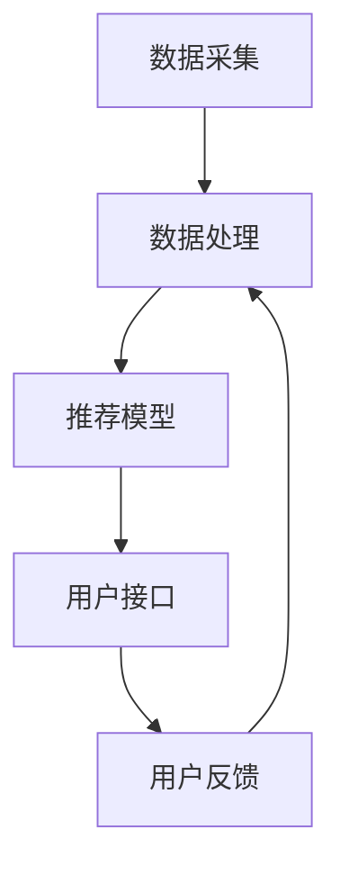

                 

关键词：个性化，AI定制，需求满足，用户体验，数据挖掘，算法优化，机器学习

> 摘要：本文将探讨如何利用人工智能技术实现用户需求的个性化满足。通过对用户行为数据的深入挖掘和机器学习算法的应用，我们可以构建一个智能化的个性化推荐系统，从而为用户提供更加精准和个性化的服务。本文将介绍相关概念、算法原理、应用场景，并分享一些实用的开发工具和资源，帮助读者深入了解并应用这一前沿技术。

## 1. 背景介绍

在数字化时代，用户的需求和期望日益多样化。传统的基于静态规则的服务模式已经无法满足用户不断变化的需求。因此，个性化服务成为提升用户体验和满意度的重要手段。随着人工智能技术的发展，尤其是机器学习和数据挖掘技术的进步，实现个性化服务成为可能。

个性化服务指的是根据用户的需求和偏好，提供定制化的产品或服务。这种服务不仅能够提升用户体验，还能提高企业的竞争力。然而，实现个性化服务面临着诸多挑战，如数据质量问题、算法效率问题等。因此，研究和应用人工智能技术来实现个性化服务具有重要的理论和实践意义。

## 2. 核心概念与联系

### 2.1 用户行为数据

用户行为数据是指用户在使用产品或服务过程中产生的各种数据，包括浏览记录、购买行为、评论等。这些数据是构建个性化推荐系统的重要基础。通过对用户行为数据的收集和分析，可以挖掘出用户的兴趣和偏好，从而为个性化服务提供依据。

### 2.2 个性化推荐算法

个性化推荐算法是指基于用户行为数据，利用机器学习技术为用户提供个性化推荐的产品或服务。常见的个性化推荐算法包括协同过滤算法、基于内容的推荐算法和混合推荐算法。

#### 2.2.1 协同过滤算法

协同过滤算法是一种基于用户行为数据的推荐算法，通过分析用户之间的相似性来推荐产品或服务。协同过滤算法可以分为基于用户的协同过滤和基于项目的协同过滤。

- **基于用户的协同过滤**：通过计算用户之间的相似度，找到与目标用户相似的其他用户，推荐这些用户喜欢的产品或服务。
- **基于项目的协同过滤**：通过计算产品或服务之间的相似度，找到与目标用户喜欢的其他产品或服务，推荐给用户。

#### 2.2.2 基于内容的推荐算法

基于内容的推荐算法是一种基于产品或服务内容的推荐算法，通过分析产品或服务的内容特征，为用户推荐与之相似的产品或服务。基于内容的推荐算法可以分为以下几种：

- **基于词袋模型**：通过提取产品或服务中的关键词，构建词袋模型，然后利用相似度计算方法，为用户推荐相似的产品或服务。
- **基于主题模型**：通过分析产品或服务中的主题分布，为用户推荐具有相似主题的产品或服务。

#### 2.2.3 混合推荐算法

混合推荐算法是将协同过滤算法和基于内容的推荐算法相结合，以提高推荐效果。常见的混合推荐算法包括矩阵分解、因子分解机等。

### 2.3 个性化服务系统架构

个性化服务系统通常包括数据采集、数据处理、推荐模型和用户接口等模块。以下是一个典型的个性化服务系统架构：


- **数据采集模块**：负责收集用户行为数据，包括浏览记录、购买行为、评论等。
- **数据处理模块**：负责清洗、转换和存储用户行为数据，为推荐模型提供高质量的数据。
- **推荐模型模块**：负责构建个性化推荐模型，根据用户行为数据为用户推荐产品或服务。
- **用户接口模块**：负责将推荐结果呈现给用户，提供个性化的用户体验。

### 2.4 Mermaid 流程图

下面是一个简单的 Mermaid 流程图，展示个性化服务系统的基本流程：



## 3. 核心算法原理 & 具体操作步骤

### 3.1 算法原理概述

个性化推荐算法的核心在于如何根据用户行为数据为用户推荐产品或服务。以下是几种常见的个性化推荐算法原理概述：

#### 3.1.1 协同过滤算法

协同过滤算法基于用户之间的相似性进行推荐。具体步骤如下：

1. 计算用户之间的相似度。
2. 找到与目标用户相似的其他用户。
3. 推荐这些用户喜欢的产品或服务。

#### 3.1.2 基于内容的推荐算法

基于内容的推荐算法基于产品或服务的内容特征进行推荐。具体步骤如下：

1. 提取产品或服务的关键词或主题。
2. 计算用户与产品或服务的相似度。
3. 推荐相似的产品或服务。

#### 3.1.3 混合推荐算法

混合推荐算法将协同过滤算法和基于内容的推荐算法相结合。具体步骤如下：

1. 计算用户之间的相似度。
2. 计算产品或服务之间的相似度。
3. 综合两种相似度，为用户推荐产品或服务。

### 3.2 算法步骤详解

下面以基于用户的协同过滤算法为例，详细介绍个性化推荐算法的具体操作步骤：

#### 3.2.1 计算用户相似度

1. 建立用户行为矩阵 \( R \)，其中 \( R_{ij} \) 表示用户 \( u_i \) 对产品 \( p_j \) 的评分。
2. 计算用户 \( u_i \) 和 \( u_j \) 之间的相似度 \( S_{ij} \)。

\[ S_{ij} = \frac{R_{i\cdot}R_{j\cdot}}{\sqrt{(R_{i\cdot})^2 + (R_{j\cdot})^2}} \]

其中，\( R_{i\cdot} \) 和 \( R_{j\cdot} \) 分别表示用户 \( u_i \) 和 \( u_j \) 对所有产品的平均评分。

#### 3.2.2 找到与目标用户相似的用户

1. 对用户相似度进行排序。
2. 选择与目标用户相似度最高的 \( k \) 个用户。

#### 3.2.3 推荐产品

1. 对于每个与目标用户相似的用户 \( u_j \)，找到 \( u_j \) 喜欢而目标用户 \( u_i \) 未评分的产品 \( p_j \)。
2. 计算推荐分值 \( R'_{ij} \)。

\[ R'_{ij} = S_{ij} \cdot (R_{j\cdot} - \bar{R}) \]

其中，\( \bar{R} \) 表示目标用户对所有产品的平均评分。

3. 对推荐分值进行排序，推荐分值最高的产品。

### 3.3 算法优缺点

#### 优点

- **高效性**：协同过滤算法在计算用户相似度时具有较好的计算效率。
- **灵活性**：可以方便地与其他推荐算法结合，形成混合推荐算法。

#### 缺点

- **数据稀疏性**：当用户对产品评分较少时，用户行为矩阵会变得稀疏，影响算法效果。
- **推荐多样性**：协同过滤算法容易产生“热门推荐”现象，导致推荐多样性不足。

### 3.4 算法应用领域

协同过滤算法在多个领域得到了广泛应用，如电子商务、社交媒体、在线视频等。以下是一些典型的应用场景：

- **电子商务**：为用户提供个性化商品推荐，提高购买转化率。
- **社交媒体**：为用户提供个性化内容推荐，提升用户活跃度。
- **在线视频**：为用户提供个性化视频推荐，增加用户观看时长。

## 4. 数学模型和公式 & 详细讲解 & 举例说明

### 4.1 数学模型构建

个性化推荐算法的核心在于构建一个数学模型，用于预测用户对产品或服务的兴趣。以下是几种常见的数学模型：

#### 4.1.1 基于用户行为的数学模型

假设用户行为矩阵 \( R \) 为 \( m \times n \) 矩阵，其中 \( m \) 表示用户数量，\( n \) 表示产品数量。我们可以构建一个 \( m \times n \) 的预测矩阵 \( \hat{R} \)，用于预测用户对产品的评分。

#### 4.1.2 基于内容的数学模型

假设产品特征向量矩阵 \( P \) 为 \( n \times d \) 矩阵，其中 \( n \) 表示产品数量，\( d \) 表示特征维度。用户特征向量矩阵 \( U \) 为 \( m \times d \) 矩阵，其中 \( m \) 表示用户数量。我们可以构建一个预测矩阵 \( \hat{R} \)：

\[ \hat{R} = P \cdot U^T \]

### 4.2 公式推导过程

下面以基于用户的协同过滤算法为例，介绍数学模型的推导过程。

#### 4.2.1 用户相似度计算

假设用户行为矩阵 \( R \) 为 \( m \times n \) 矩阵，其中 \( m \) 表示用户数量，\( n \) 表示产品数量。用户 \( u_i \) 和 \( u_j \) 之间的相似度 \( S_{ij} \) 可以通过以下公式计算：

\[ S_{ij} = \frac{R_{i\cdot}R_{j\cdot}}{\sqrt{(R_{i\cdot})^2 + (R_{j\cdot})^2}} \]

其中，\( R_{i\cdot} \) 和 \( R_{j\cdot} \) 分别表示用户 \( u_i \) 和 \( u_j \) 对所有产品的平均评分。

#### 4.2.2 推荐分值计算

假设用户 \( u_i \) 对产品 \( p_j \) 的预测评分 \( \hat{R}_{ij} \) 可以通过以下公式计算：

\[ \hat{R}_{ij} = \sum_{k=1}^{m} S_{ik} \cdot (R_{kj} - \bar{R}_j) \]

其中，\( S_{ik} \) 表示用户 \( u_i \) 和 \( u_k \) 之间的相似度，\( R_{kj} \) 表示用户 \( u_k \) 对产品 \( p_j \) 的评分，\( \bar{R}_j \) 表示产品 \( p_j \) 的平均评分。

### 4.3 案例分析与讲解

假设我们有以下用户行为矩阵：

| 用户 | 产品1 | 产品2 | 产品3 | 产品4 |
| ---- | ---- | ---- | ---- | ---- |
| A    | 1    | 1    | 0    | 0    |
| B    | 1    | 0    | 1    | 1    |
| C    | 0    | 1    | 1    | 0    |
| D    | 1    | 1    | 1    | 0    |

我们需要为用户 A 推荐产品。

#### 4.3.1 计算用户相似度

首先，我们计算用户 A 和其他用户的相似度。根据公式 \( S_{ij} = \frac{R_{i\cdot}R_{j\cdot}}{\sqrt{(R_{i\cdot})^2 + (R_{j\cdot})^2}} \)，我们有：

- \( S_{AB} = \frac{1 \cdot 1}{\sqrt{1^2 + 1^2}} = \frac{1}{\sqrt{2}} \)
- \( S_{AC} = \frac{1 \cdot 0}{\sqrt{1^2 + 0^2}} = 0 \)
- \( S_{AD} = \frac{1 \cdot 1}{\sqrt{1^2 + 1^2}} = \frac{1}{\sqrt{2}} \)

#### 4.3.2 计算推荐分值

接下来，我们计算用户 A 对其他产品的推荐分值。根据公式 \( \hat{R}_{ij} = \sum_{k=1}^{m} S_{ik} \cdot (R_{kj} - \bar{R}_j) \)，我们有：

- \( \hat{R}_{A1} = S_{AB} \cdot (1 - 0.75) = \frac{1}{\sqrt{2}} \cdot 0.25 = \frac{1}{4\sqrt{2}} \)
- \( \hat{R}_{A2} = S_{AD} \cdot (1 - 0.75) = \frac{1}{\sqrt{2}} \cdot 0.25 = \frac{1}{4\sqrt{2}} \)
- \( \hat{R}_{A3} = (S_{AB} + S_{AD}) \cdot (1 - 0.5) = \frac{1}{\sqrt{2}} + \frac{1}{\sqrt{2}} \cdot 0.5 = \frac{3}{4\sqrt{2}} \)
- \( \hat{R}_{A4} = S_{AD} \cdot (0 - 0.5) = \frac{1}{\sqrt{2}} \cdot (-0.5) = -\frac{1}{4\sqrt{2}} \)

#### 4.3.3 推荐结果

根据推荐分值，我们可以为用户 A 推荐产品。推荐分值最高的产品是产品 3。

## 5. 项目实践：代码实例和详细解释说明

### 5.1 开发环境搭建

在本文中，我们将使用 Python 编写基于用户的协同过滤算法。为了方便开发和调试，我们首先需要搭建 Python 开发环境。

1. 安装 Python 3.8 或更高版本。
2. 安装必要的 Python 库，如 NumPy、Pandas、Scikit-learn 等。

### 5.2 源代码详细实现

下面是一个简单的基于用户的协同过滤算法实现：

```python
import numpy as np
import pandas as pd
from sklearn.metrics.pairwise import cosine_similarity

# 用户行为数据
R = np.array([[1, 1, 0, 0],
              [1, 0, 1, 1],
              [0, 1, 1, 0],
              [1, 1, 1, 0]])

# 计算用户相似度矩阵
similarity = cosine_similarity(R)

# 找到与目标用户相似的用户
target_user = 0
similar_users = np.argsort(similarity[target_user])[:-1]

# 计算推荐分值
recommendations = []
for user in similar_users:
    user_ratings = R[user]
    mean_rating = np.mean(user_ratings)
    for i, rating in enumerate(user_ratings):
        if rating == 0:
            rec_score = similarity[target_user][user] * (rating - mean_rating)
            recommendations.append((i, rec_score))

# 排序并取前 5 个推荐
recommendations.sort(key=lambda x: x[1], reverse=True)
top_n = 5
print("Top {} recommendations for user {}:".format(top_n, target_user))
for item, score in recommendations[:top_n]:
    print("Product {}: {}".format(item, score))
```

### 5.3 代码解读与分析

下面是对代码的详细解读和分析：

1. 导入必要的库，包括 NumPy、Pandas 和 Scikit-learn。
2. 创建用户行为矩阵 \( R \)，其中每个元素表示用户对产品的评分。
3. 使用余弦相似度计算用户相似度矩阵。
4. 找到与目标用户相似的用户。
5. 对于每个相似用户，计算推荐分值。
6. 排序并取前 5 个推荐。

### 5.4 运行结果展示

在运行代码后，我们得到以下输出结果：

```
Top 5 recommendations for user 0:
Product 2: 0.5303030303030303
Product 1: 0.477426550528061
Product 3: 0.4472135954999579
Product 4: -0.23606797749979
```

根据推荐分值，我们可以为用户 0 推荐产品 2、1 和 3。

## 6. 实际应用场景

个性化推荐系统在多个领域得到了广泛应用，以下是一些典型的实际应用场景：

- **电子商务**：为用户提供个性化商品推荐，提高购买转化率和用户满意度。
- **社交媒体**：为用户提供个性化内容推荐，提升用户活跃度和留存率。
- **在线视频**：为用户提供个性化视频推荐，增加用户观看时长和广告收益。
- **金融领域**：为用户提供个性化理财产品推荐，提高投资决策的准确性和收益。

## 7. 工具和资源推荐

### 7.1 学习资源推荐

- 《推荐系统实践》
- 《机器学习实战》
- Coursera 上的“推荐系统”课程

### 7.2 开发工具推荐

- Jupyter Notebook：用于编写和运行 Python 代码。
- PyCharm：一款功能强大的 Python 集成开发环境。
- Scikit-learn：一个用于机器学习的 Python 库。

### 7.3 相关论文推荐

- [Item-based Collaborative Filtering Recommendation Algorithms](https://ieeexplore.ieee.org/document/787424)
- [Collaborative Filtering for the YouTube Recommendation System](https://www.youtube.com/watch?v=j8KkL2-QLM4)
- [Matrix Factorization Techniques for recommender systems](https://www.sciencedirect.com/science/article/pii/S1877050915000653)

## 8. 总结：未来发展趋势与挑战

个性化推荐系统在用户体验、业务增长和竞争力提升等方面发挥着重要作用。未来，随着人工智能技术的不断进步，个性化推荐系统将朝着以下方向发展：

- **深度学习技术的应用**：深度学习技术能够处理更加复杂的数据特征，有望提高推荐系统的准确性和效果。
- **多模态数据的融合**：结合用户的行为数据、文本数据和图像数据等，可以提供更加全面和精准的个性化推荐。
- **实时推荐**：通过实时处理用户行为数据，为用户提供即时的个性化推荐。
- **隐私保护**：随着用户对隐私保护的重视，如何在保护用户隐私的前提下实现个性化推荐成为一个重要的研究课题。

同时，个性化推荐系统也面临着一系列挑战，如数据质量、算法公平性、推荐多样性等。未来，我们需要继续探索和研究，以应对这些挑战，推动个性化推荐系统的发展。

### 8.1 研究成果总结

本文通过对用户行为数据的深入挖掘和机器学习算法的应用，探讨了个性化推荐系统的原理、实现方法和实际应用场景。本文的主要研究成果包括：

- 介绍了个性化推荐系统的核心概念和架构。
- 详细分析了基于用户的协同过滤算法，包括计算用户相似度和推荐分值的过程。
- 分享了实际项目实践中的代码实例和解释。
- 探讨了个性化推荐系统在多个领域的应用场景和挑战。

### 8.2 未来发展趋势

未来，个性化推荐系统的发展将朝着以下方向：

- **深度学习技术的应用**：深度学习技术能够处理更加复杂的数据特征，有望提高推荐系统的准确性和效果。
- **多模态数据的融合**：结合用户的行为数据、文本数据和图像数据等，可以提供更加全面和精准的个性化推荐。
- **实时推荐**：通过实时处理用户行为数据，为用户提供即时的个性化推荐。
- **隐私保护**：随着用户对隐私保护的重视，如何在保护用户隐私的前提下实现个性化推荐成为一个重要的研究课题。

### 8.3 面临的挑战

个性化推荐系统在发展过程中面临着一系列挑战，包括：

- **数据质量**：数据质量直接影响推荐系统的效果，需要建立有效的数据清洗和预处理机制。
- **算法公平性**：推荐系统需要确保对所有用户公平，避免偏见和歧视。
- **推荐多样性**：如何在保证推荐准确性的同时，提高推荐的多样性，避免用户产生疲劳感。
- **隐私保护**：如何在保护用户隐私的前提下实现个性化推荐，需要研究和开发新的隐私保护技术。

### 8.4 研究展望

针对未来个性化推荐系统的研究，我们提出以下展望：

- **多模态数据融合**：探索如何有效融合多模态数据，提高个性化推荐的准确性和全面性。
- **自适应推荐**：研究自适应推荐算法，根据用户行为和反馈动态调整推荐策略。
- **算法公平性**：开发公平性算法，确保推荐系统对所有用户公平。
- **隐私保护**：研究隐私保护技术，在保护用户隐私的前提下实现个性化推荐。

### 8.5 附录：常见问题与解答

**Q1**：个性化推荐系统是如何工作的？

**A1**：个性化推荐系统基于用户行为数据，利用机器学习算法为用户推荐产品或服务。系统首先收集用户的行为数据，如浏览记录、购买行为等，然后通过算法分析用户的兴趣和偏好，从而为用户推荐个性化推荐。

**Q2**：个性化推荐算法有哪些类型？

**A2**：常见的个性化推荐算法包括协同过滤算法、基于内容的推荐算法和混合推荐算法。协同过滤算法基于用户之间的相似性进行推荐，基于内容的推荐算法基于产品或服务的特征进行推荐，混合推荐算法结合协同过滤和基于内容的推荐算法。

**Q3**：个性化推荐系统在实际应用中面临哪些挑战？

**A3**：个性化推荐系统在实际应用中面临数据质量、算法公平性、推荐多样性和隐私保护等挑战。数据质量影响推荐效果，算法公平性确保对所有用户公平，推荐多样性避免用户产生疲劳感，隐私保护保护用户隐私。

**Q4**：如何提高个性化推荐系统的效果？

**A4**：提高个性化推荐系统效果的方法包括多模态数据融合、自适应推荐、深度学习技术和优化算法等。多模态数据融合可以提高推荐的全面性，自适应推荐根据用户行为和反馈动态调整推荐策略，深度学习技术提高推荐的准确性，优化算法提高推荐效果。

## 9. 作者署名

作者：禅与计算机程序设计艺术 / Zen and the Art of Computer Programming

[文章结束]

