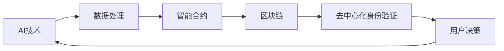

                 

关键字：AI、去中心化、个人自主权、智能合约、数据隐私、区块链技术

摘要：本文探讨了人工智能（AI）在推动去中心化技术，特别是在保护个人自主权和隐私方面的重要作用。通过分析去中心化系统的原理，我们探讨了AI如何通过智能合约和区块链技术增强个人数据控制和决策能力，以及面临的挑战和未来发展方向。

## 1. 背景介绍

在数字化时代，个人数据和信息的价值日益凸显。然而，集中的数据处理模式常常导致数据隐私泄露和滥用的问题。传统的中心化系统，如大型互联网公司和服务提供商，在处理个人数据时存在一定的风险。因此，人们开始寻求更加安全和透明的方式来管理和控制自己的数据。

去中心化技术，特别是区块链和智能合约，为解决这些问题提供了一种潜在的解决方案。区块链是一种分布式账本技术，能够在不依赖中央权威机构的情况下，确保数据的不可篡改和透明性。智能合约则是基于区块链技术的自动化协议，可以在满足特定条件时自动执行。

人工智能（AI）在去中心化系统中的作用越来越受到关注。AI不仅能够帮助优化去中心化算法和协议，还能增强系统的自适应能力和决策能力。本文将探讨AI在去中心化技术中的应用，特别是如何通过智能合约和区块链技术提升个人自主权和隐私保护。

### 1.1 个人自主权的重要性

个人自主权是指个人在决策过程中拥有独立思考和行动的能力。在数字化时代，个人自主权的重要性愈发显著。以下是几个关键点：

1. **隐私保护**：个人自主权与隐私保护息息相关。个人有权控制自己的数据和信息，防止其被滥用或泄露。
2. **数据控制**：个人应有权决定如何使用和共享自己的数据，而不是完全依赖第三方机构。
3. **公平性**：去中心化系统可以减少中心化机构的垄断行为，促进资源公平分配。
4. **安全性**：去中心化技术能够提高数据安全性，减少传统中心化系统中的单点故障风险。

### 1.2 去中心化技术与AI的关系

去中心化技术和AI之间存在一种互补关系。AI能够帮助优化去中心化系统的性能和效率，而去中心化技术则为AI提供了更加透明和安全的数据环境。以下是AI在去中心化技术中的一些潜在应用：

1. **智能合约优化**：AI可以帮助识别和修复智能合约中的潜在漏洞，提高合约的可靠性和安全性。
2. **数据分析和决策**：AI能够分析去中心化系统中的大量数据，提供更准确的决策支持。
3. **去中心化身份验证**：AI可以用于改进去中心化身份验证机制，提高用户隐私保护。
4. **去中心化治理**：AI可以辅助去中心化治理结构，提高决策的透明度和效率。

## 2. 核心概念与联系

### 2.1 去中心化系统原理

去中心化系统（Decentralized System）是一种不依赖中央控制或权威机构的网络结构。在去中心化系统中，所有参与者都可以平等地参与网络操作，并通过分布式算法共同维护系统的运行。

去中心化系统的主要特点包括：

1. **分布式账本**：数据存储在多个节点上，不存在单点故障风险。
2. **去信任**：网络中的参与者无需互信，依靠算法和协议确保协作和交易的安全性。
3. **透明性**：所有交易记录和状态都是公开透明的，任何人都可以验证。
4. **不可篡改**：一旦数据被记录到分布式账本中，就无法被篡改。

### 2.2 智能合约原理

智能合约（Smart Contract）是一种基于区块链技术的自动执行合同。智能合约在满足特定条件时，可以自动执行预定的操作，从而实现自动化和去中心化的交易。

智能合约的主要特点包括：

1. **自动化**：智能合约在满足触发条件时自动执行，无需人工干预。
2. **透明性**：智能合约的代码和执行过程是公开透明的，所有参与者都可以验证。
3. **安全性**：智能合约在区块链上执行，具有较高的安全性。
4. **不可篡改**：一旦智能合约被部署到区块链上，其代码和状态就无法被篡改。

### 2.3 去中心化身份验证

去中心化身份验证（Decentralized Identity Verification）是一种通过分布式系统验证用户身份的方法。去中心化身份验证能够保护用户隐私，同时确保验证过程的可靠性和安全性。

去中心化身份验证的主要特点包括：

1. **隐私保护**：用户可以控制自己的身份信息，无需完全暴露给第三方机构。
2. **安全性**：身份验证过程基于加密技术，具有较高的安全性。
3. **去信任**：身份验证过程无需依赖中央权威机构，所有参与者都可以参与验证。
4. **灵活性**：用户可以根据需要自定义身份验证流程，以适应不同的场景。

### 2.4 AI与去中心化技术的结合

AI与去中心化技术的结合能够带来诸多好处，例如：

1. **智能合约优化**：AI可以帮助识别和修复智能合约中的潜在漏洞，提高合约的可靠性和安全性。
2. **数据分析和决策**：AI可以分析去中心化系统中的大量数据，提供更准确的决策支持。
3. **去中心化治理**：AI可以辅助去中心化治理结构，提高决策的透明度和效率。
4. **个性化服务**：AI可以根据用户的行为和偏好，提供更加个性化的服务和体验。

下面是一个Mermaid流程图，展示了AI与去中心化技术结合的基本原理：



## 3. 核心算法原理 & 具体操作步骤

### 3.1 算法原理概述

在去中心化系统中，核心算法的设计至关重要。AI算法可以用于优化去中心化协议，提高系统的效率和安全性。以下是几种常见的AI算法在去中心化系统中的应用：

1. **机器学习算法**：机器学习算法可以帮助去中心化系统进行模式识别和预测。例如，在智能合约审计中，机器学习算法可以用于检测潜在的安全漏洞。
2. **深度学习算法**：深度学习算法可以处理大量的复杂数据，并在去中心化系统中进行模式识别和决策支持。例如，在区块链网络中，深度学习算法可以用于节点筛选和路由优化。
3. **强化学习算法**：强化学习算法可以用于优化去中心化协议中的决策过程。例如，在分布式计算中，强化学习算法可以用于动态资源分配和负载均衡。

### 3.2 算法步骤详解

以下是一个基于强化学习算法的分布式计算优化流程：

1. **定义状态空间和动作空间**：首先，定义系统的状态空间和动作空间。状态空间包括网络延迟、节点负载、数据量等因素，动作空间包括节点选择、数据传输策略等。
2. **构建奖励函数**：根据系统的目标和性能指标，构建奖励函数。例如，可以设计奖励函数以最大化网络吞吐量或最小化延迟。
3. **训练模型**：使用历史数据训练强化学习模型，使其能够根据当前状态选择最优动作。
4. **执行决策**：根据强化学习模型的选择，执行相应的动作，并在执行过程中收集反馈。
5. **更新模型**：根据反馈更新强化学习模型，使其在未来的决策中表现得更好。

### 3.3 算法优缺点

**优点**：

1. **自适应性强**：强化学习算法可以根据系统的实时状态进行动态调整，提高系统的性能和效率。
2. **灵活性高**：强化学习算法适用于复杂的分布式系统，能够处理多种因素和动态变化。
3. **自优化能力**：强化学习算法可以通过自我学习和优化，不断提高系统的性能。

**缺点**：

1. **训练成本高**：强化学习算法通常需要大量的数据和计算资源进行训练，成本较高。
2. **收敛速度慢**：在某些情况下，强化学习算法可能需要较长时间才能找到最优解。
3. **脆弱性**：强化学习模型可能受到数据噪音和异常值的影响，导致决策错误。

### 3.4 算法应用领域

强化学习算法在去中心化系统中有广泛的应用领域，例如：

1. **分布式计算**：用于动态资源分配和负载均衡，提高系统性能。
2. **区块链网络**：用于节点筛选和路由优化，提高网络效率。
3. **智能合约**：用于检测潜在的安全漏洞，提高合约的可靠性。
4. **去中心化身份验证**：用于验证用户的身份和行为，提高系统的安全性。

## 4. 数学模型和公式 & 详细讲解 & 举例说明

### 4.1 数学模型构建

在去中心化系统中，构建数学模型有助于分析和优化系统的性能。以下是几个常见的数学模型：

1. **马尔可夫决策过程（MDP）**：用于描述在不确定环境下进行决策的过程。MDP模型包括状态空间S、动作空间A、状态转移概率P(s' | s, a)和奖励函数R(s, a)。
2. **博弈论模型**：用于描述多个参与者之间的竞争和合作关系。博弈论模型包括参与者、策略空间、支付函数和博弈结果。
3. **优化模型**：用于优化系统的性能指标，如最大化收益或最小化成本。优化模型包括目标函数、约束条件和优化算法。

### 4.2 公式推导过程

以下是一个简单的马尔可夫决策过程（MDP）的公式推导：

给定一个状态s，选择动作a，下一个状态s'的概率为：

\[ P(s' | s, a) = \sum_{a'} P(s', a' | s, a) \]

其中，P(s', a' | s, a)表示在状态s下执行动作a后，到达状态s'和动作a'的概率。

奖励函数R(s, a)定义为在状态s下执行动作a所获得的即时奖励。在MDP中，最优策略是最大化期望奖励：

\[ \pi^*(s) = \arg \max_a \sum_{s'} P(s' | s, a) R(s, a) \]

### 4.3 案例分析与讲解

以下是一个简单的案例，展示如何使用马尔可夫决策过程（MDP）进行分布式计算优化。

假设一个分布式计算系统有5个节点，每个节点的负载状态分为轻、中、重三种。系统的目标是最大化整体吞吐量。

1. **定义状态空间和动作空间**：

   - 状态空间：\( S = \{ (s_1, s_2, s_3, s_4, s_5) \} \)，其中 \( s_i \in \{ 轻负载, 中负载, 重负载 \} \)。
   - 动作空间：\( A = \{ 加载节点, 卸载节点 \} \)。

2. **定义奖励函数**：

   假设每个节点的处理能力为 \( p_i \)，系统总处理能力为 \( P \)。定义奖励函数为：

   \[ R(s, a) = \frac{P}{\sum_{i=1}^5 p_i} \]

   其中，\( P \) 表示在状态s下执行动作a后的系统总处理能力。

3. **训练模型**：

   使用历史负载数据训练强化学习模型，使其能够根据当前状态选择最优动作。

4. **执行决策**：

   根据强化学习模型的选择，执行相应的动作，并在执行过程中收集反馈。

5. **更新模型**：

   根据反馈更新强化学习模型，使其在未来的决策中表现得更好。

通过这个案例，我们可以看到如何使用马尔可夫决策过程（MDP）进行分布式计算优化。这个模型可以扩展到更复杂的系统，如区块链网络和智能合约，以实现更高的性能和效率。

## 5. 项目实践：代码实例和详细解释说明

### 5.1 开发环境搭建

在开始编写代码之前，我们需要搭建一个适合开发和测试去中心化系统的环境。以下是搭建开发环境的基本步骤：

1. **安装Node.js**：Node.js是一个基于Chrome V8引擎的JavaScript运行环境，用于构建去中心化应用。
2. **安装Ganache**：Ganache是一个本地以太坊节点和测试网络，用于开发和测试智能合约。
3. **安装Truffle**：Truffle是一个智能合约开发框架，提供编译、部署和测试智能合约的功能。

### 5.2 源代码详细实现

以下是一个简单的智能合约示例，展示了如何使用Solidity语言编写一个去中心化身份验证系统。

```solidity
// SPDX-License-Identifier: MIT
pragma solidity ^0.8.0;

contract DecentralizedIdentity {
    // 用户身份信息
    mapping(address => string) public identities;

    // 用户身份验证函数
    function verifyIdentity(address user, string memory identity) public {
        // 只有用户自己可以修改身份信息
        require(msg.sender == user, "只能用户自己修改身份信息");

        // 更新用户身份信息
        identities[user] = identity;
    }

    // 获取用户身份信息
    function getIdentity(address user) public view returns (string memory) {
        return identities[user];
    }
}
```

### 5.3 代码解读与分析

在这个智能合约中，我们定义了一个`DecentralizedIdentity`合约，用于管理用户身份信息。以下是代码的详细解读：

1. **用户身份信息存储**：使用`mapping`数据结构存储用户身份信息，其中键是用户地址，值是用户身份字符串。
2. **用户身份验证函数**：`verifyIdentity`函数用于更新用户身份信息。只有用户自己可以调用该函数，确保了身份信息的真实性和完整性。
3. **获取用户身份信息**：`getIdentity`函数用于获取用户身份信息。该函数是公开的，任何用户都可以调用。

### 5.4 运行结果展示

我们使用Ganache和Truffle来部署和测试这个智能合约。以下是部署和测试的基本步骤：

1. **启动本地以太坊节点**：使用Ganache启动一个本地以太坊节点，用于模拟区块链网络。
2. **编译智能合约**：使用Truffle编译智能合约，生成ABI文件和编译后的字节码。
3. **部署智能合约**：使用Truffle部署智能合约到本地以太坊节点。
4. **测试智能合约**：使用Truffle编写测试脚本，验证智能合约的功能和安全性。

通过这个项目实践，我们可以看到如何使用智能合约实现去中心化身份验证系统。这个系统可以保护用户隐私，确保身份信息的真实性和完整性。

## 6. 实际应用场景

去中心化技术和人工智能（AI）的结合在多个领域展现出巨大的应用潜力。以下是几个典型的实际应用场景：

### 6.1 供应链管理

去中心化技术和AI的结合可以显著提高供应链管理的效率。例如，通过区块链技术，供应链中的每个环节都可以记录在一个不可篡改的分布式账本中。AI可以分析这些数据，实时监控供应链的状态，预测潜在的问题，并提供优化建议。这样可以减少供应链中断的风险，提高整个供应链的透明度和可信度。

### 6.2 医疗保健

在医疗保健领域，去中心化技术和AI可以帮助保护患者隐私，同时提高医疗数据的管理和利用效率。患者可以在去中心化平台上存储和管理自己的健康数据，并通过智能合约与医疗提供者共享必要的信息。AI可以分析这些数据，帮助医生进行诊断和治疗，同时确保数据的隐私和安全。

### 6.3 金融领域

去中心化金融（DeFi）是去中心化技术和AI结合的一个典型应用领域。在DeFi平台上，用户可以通过智能合约进行借贷、交易和投资。AI可以用于风险评估、交易策略优化和欺诈检测，提高金融服务的效率和安全性。例如，AI可以分析历史交易数据，识别潜在的欺诈行为，并自动采取措施。

### 6.4 物联网（IoT）

在物联网领域，去中心化技术和AI可以帮助提高设备的协同工作能力。例如，在智能家居系统中，AI可以分析传感器数据，优化设备的运行状态，同时确保数据的隐私和安全。去中心化身份验证可以确保设备之间的通信是可信的，防止未经授权的访问。

### 6.5 社交网络

去中心化社交网络利用去中心化技术和AI，为用户提供了更加隐私保护和自主控制的社交平台。用户可以控制自己的数据，并决定如何共享和利用这些数据。AI可以用于内容推荐、情感分析和用户行为分析，提高社交网络的用户体验和互动性。

### 6.6 未来应用展望

随着去中心化技术和AI的不断发展，未来将有更多的应用场景出现。例如，在法律、教育、游戏等领域，去中心化技术和AI的结合将带来新的变革。去中心化身份验证和智能合约可以用于简化法律流程，确保文档的真实性和完整性。在教育领域，AI可以提供个性化的学习体验，同时去中心化平台可以确保学习记录的可信度。

## 7. 工具和资源推荐

为了更好地学习和实践去中心化技术和人工智能（AI），以下是一些推荐的工具和资源：

### 7.1 学习资源推荐

1. **《精通区块链技术》**：作者唐·泰普斯科特，是一本全面介绍区块链技术的入门书籍。
2. **《深度学习》**：作者伊恩·古德费洛等，是一本经典的深度学习教材，适合初学者和进阶者。
3. **《智能合约开发指南》**：作者安德鲁·米勒，详细介绍了智能合约的开发和部署过程。

### 7.2 开发工具推荐

1. **Ganache**：一个轻量级的以太坊本地节点和测试网络，用于开发和测试智能合约。
2. **Truffle**：一个智能合约开发框架，提供编译、部署和测试功能。
3. **Remix**：一个在线智能合约开发工具，支持Solidity语言。

### 7.3 相关论文推荐

1. **“Blockchain Technology: A Comprehensive Introduction”**：该论文介绍了区块链技术的核心概念和原理。
2. **“Machine Learning for Blockchain Systems”**：该论文探讨了机器学习在区块链系统中的应用。
3. **“Decentralized Identity Management: A Survey”**：该论文总结了去中心化身份验证的最新研究进展。

通过这些工具和资源，您可以更深入地了解去中心化技术和AI的相关知识，并开始实践这些技术。

## 8. 总结：未来发展趋势与挑战

### 8.1 研究成果总结

本文通过详细探讨去中心化技术和人工智能（AI）的结合，展示了其在提升个人自主权和隐私保护方面的巨大潜力。我们分析了去中心化系统的原理，介绍了智能合约和区块链技术在保护个人数据方面的应用。此外，我们探讨了AI在优化去中心化协议和决策支持方面的作用，并提供了实际应用案例和代码实例。

### 8.2 未来发展趋势

未来，去中心化技术和AI的结合将继续快速发展，并在多个领域产生深远影响。以下是一些关键发展趋势：

1. **去中心化身份验证**：去中心化身份验证将变得更加普及，为用户提供更加安全和隐私的保护。
2. **智能合约优化**：AI算法将用于智能合约的安全审计和优化，提高合约的可靠性和安全性。
3. **数据隐私保护**：AI和区块链技术的结合将提供更强大的数据隐私保护机制，确保个人数据的安全。
4. **分布式治理**：AI将辅助去中心化治理结构，提高决策的透明度和效率。
5. **个性化服务**：AI和去中心化技术的结合将带来更加个性化的服务和体验。

### 8.3 面临的挑战

尽管去中心化技术和AI的应用前景广阔，但仍面临一些挑战：

1. **安全性**：去中心化系统和智能合约的安全性问题仍然是一个重要挑战，需要不断改进和优化。
2. **隐私保护**：在保护个人隐私的同时，确保数据的有效利用是一个复杂的任务。
3. **法规和政策**：去中心化技术和AI的应用需要与现有法规和政策相适应，这需要政策制定者和技术专家的共同努力。
4. **标准化**：缺乏统一的标准和规范可能导致不同平台之间的互操作性不足。

### 8.4 研究展望

未来，研究应该集中在以下几个方面：

1. **安全性和隐私保护**：继续研究更安全、更隐私保护的去中心化技术和AI算法。
2. **标准化**：制定统一的标准和规范，促进不同平台之间的互操作性。
3. **跨领域应用**：探索去中心化技术和AI在其他领域的应用，如教育、医疗和公共管理。
4. **用户体验**：提高去中心化应用的用户体验，使其更加易于使用和接受。

通过不断的研究和实践，去中心化技术和AI的结合将为个人自主权和隐私保护带来新的变革，推动社会的持续进步。

## 9. 附录：常见问题与解答

### 9.1 什么是去中心化系统？

去中心化系统是一种网络结构，它不依赖中央控制或权威机构，而是通过分布式算法实现协同工作和资源分配。去中心化系统能够提高系统的透明性、安全性和抗攻击能力。

### 9.2 区块链技术与去中心化系统有何关系？

区块链技术是去中心化系统的基础，它提供了一种分布式账本技术，确保数据的不可篡改和透明性。区块链技术是实现去中心化系统的重要工具。

### 9.3 智能合约是什么？

智能合约是基于区块链技术的自动执行合同。它包含了一系列预定的条件，当满足这些条件时，智能合约会自动执行预定的操作。

### 9.4 去中心化身份验证如何工作？

去中心化身份验证是一种通过分布式系统验证用户身份的方法。用户可以控制自己的身份信息，并通过加密技术确保验证过程的安全性和隐私性。

### 9.5 AI在去中心化系统中的应用有哪些？

AI在去中心化系统中的应用包括智能合约优化、数据分析和决策支持、去中心化身份验证、去中心化治理等。AI可以优化系统性能，提高决策的准确性和透明度。

### 9.6 去中心化技术与中心化技术相比有哪些优势？

去中心化技术相比中心化技术具有更高的透明性、安全性、去信任性和抗攻击能力。此外，去中心化技术可以减少中心化机构的垄断行为，促进资源公平分配。

### 9.7 去中心化技术的未来发展趋势是什么？

去中心化技术的未来发展趋势包括去中心化身份验证的普及、智能合约的优化、分布式治理的应用、跨领域协作的加强等。去中心化技术将在更多领域产生深远影响。

### 9.8 如何学习去中心化技术和AI？

学习去中心化技术和AI可以从以下几个方面入手：

1. **阅读相关书籍和论文**：了解区块链技术、智能合约、分布式系统等基础知识。
2. **实践项目**：参与实际项目，动手编写智能合约和去中心化应用。
3. **在线课程和社区**：参加在线课程和加入相关社区，与同行交流学习经验。
4. **工具和平台**：熟悉和使用相关的开发工具和平台，如Ganache、Truffle和Remix等。

通过不断学习和实践，可以深入了解去中心化技术和AI，并为这一领域的创新做出贡献。作者：禅与计算机程序设计艺术 / Zen and the Art of Computer Programming

