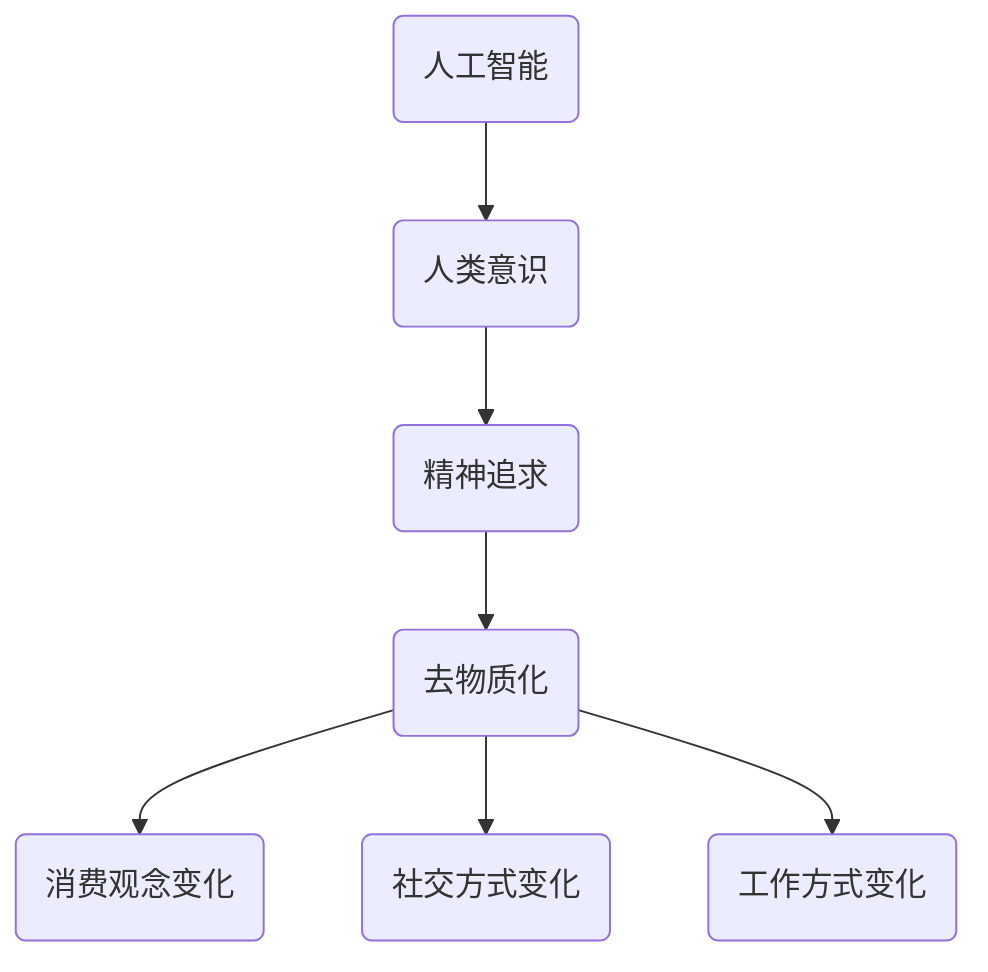

                 

 关键词：
- AI时代
- 欲望
- 精神追求
- 去物质化
- 人类意识
- 技术进步
- 社会变革

> 摘要：
本文探讨了AI时代人类欲望的去物质化现象，分析了这一变化背后的技术驱动和社会背景。通过对人类意识、精神追求的深入探讨，本文提出了AI时代精神追求的新方向，并展望了这一趋势对未来社会和文化发展的影响。

## 1. 背景介绍

随着人工智能技术的迅猛发展，我们正站在一个新的历史节点上。从最早的规则系统、到基于统计学习的模型，再到如今深度学习的兴起，人工智能已经渗透到我们生活的方方面面。与此同时，人们对于技术的期望和需求也在不断演变，不再仅仅局限于解决现实问题，更追求更深层次的精神满足。

在这样一个技术驱动的社会背景下，人类欲望的去物质化逐渐成为一种趋势。传统意义上的物质欲望，如财富、权力和物质享受，在人工智能的帮助下变得更加容易实现。然而，人们逐渐发现，这些物质欲望的满足并没有带来预期的幸福感，反而在某种程度上加剧了焦虑和不满。因此，人们开始寻求更为深层次的精神追求。

### 人工智能的发展与人类欲望的去物质化

人工智能的快速发展，使得很多传统行业的效率得到极大提升。例如，制造业的自动化、物流的智能化、医疗的数字化等，都极大地减少了人类的劳动强度和时间成本。这使得人们有了更多的自由时间来追求自己的精神需求。

然而，与此同时，人工智能也带来了一些负面影响。一方面，自动化和智能化的普及，导致部分传统行业的工作岗位减少，甚至消失。这引发了人们对未来就业的担忧。另一方面，人工智能的普及，使得物质生活变得更加便捷，但同时也加剧了人们的竞争和压力，物质欲望变得更加难以满足。

### 社会背景对欲望去物质化的影响

除了技术发展，社会背景也是影响欲望去物质化的重要因素。随着全球化和互联网的普及，人们的生活方式、价值观和世界观都在发生巨大变化。一方面，人们对于精神层面的需求日益增长，不再仅仅满足于物质层面的追求。另一方面，社会的多元化和个性化，也使得人们更加注重自我实现和精神满足。

这种社会背景的变化，促使人们开始反思自己的欲望，并尝试去物质化。人们开始更加重视心理健康、人际关系、个人成长等精神层面的问题，而不仅仅是物质财富的积累。

## 2. 核心概念与联系

### 人工智能与人类意识的关系

人工智能的发展离不开对人类意识的理解。人类意识是人类思维活动的基础，是感知、认知、决策等过程的载体。人工智能研究者一直在尝试模拟人类意识，以实现更高层次的人工智能。

在AI时代，人类意识与人工智能的关系变得更加密切。一方面，人工智能需要依赖于人类意识来获取数据、理解问题和做出决策。另一方面，人工智能的发展也在不断丰富和拓展人类意识，使得人类能够更好地理解世界和自己。

### 精神追求与去物质化的关系

精神追求是人类欲望的重要组成部分。在传统社会，人们主要追求物质满足，如财富、权力和物质享受。然而，在AI时代，随着物质生活的不断丰富，人们开始更加注重精神层面的满足。这种追求去物质化的精神追求，与人工智能的发展密切相关。

人工智能的普及，使得人们有了更多的自由时间来追求自己的精神需求。同时，人工智能的发展也提供了更多的工具和方法，帮助人们更好地实现自己的精神追求。例如，虚拟现实技术、增强现实技术、智能聊天机器人等，都可以为人们提供更加丰富和多样化的精神体验。

### 去物质化的具体表现

去物质化在AI时代有着多种具体表现。首先，人们的消费观念发生变化，更加注重体验和服务，而不仅仅是物质产品的购买。例如，共享经济、体验式消费等新兴消费模式，都是去物质化的体现。

其次，人们的社交方式也发生了变化。在AI时代，虚拟社交和线上社交变得越来越普遍，人们通过互联网建立起了更加广泛的社交网络，而这种社交网络的建立，也是去物质化的体现。

此外，人们在工作方式上也发生了变化。随着远程办公、弹性工作时间的普及，人们有了更多的自由来安排自己的工作生活，这也体现了欲望的去物质化。

### Mermaid 流程图

下面是一个简单的 Mermaid 流程图，展示人工智能、人类意识、精神追求和去物质化的关系：



## 3. 核心算法原理 & 具体操作步骤

### 3.1 算法原理概述

在AI时代，人类欲望的去物质化需要依赖于一系列的核心算法。这些算法主要涉及数据挖掘、机器学习、神经网络等前沿技术。通过这些算法，人工智能可以更好地理解和满足人类的需求，实现欲望的去物质化。

具体来说，核心算法主要包括以下几个方面：

1. **数据挖掘算法**：通过分析大量数据，发现数据之间的关联和模式，从而为用户提供个性化的服务和建议。
2. **机器学习算法**：通过训练模型，使人工智能系统能够自主学习和改进，更好地满足用户需求。
3. **神经网络算法**：通过模拟人脑的神经元连接方式，实现复杂任务的处理和决策。

### 3.2 算法步骤详解

1. **数据收集**：首先，需要收集大量的用户数据，包括行为数据、偏好数据等。
2. **数据预处理**：对收集到的数据进行分析和清洗，确保数据的准确性和一致性。
3. **特征提取**：从预处理后的数据中提取出对用户行为和偏好有重要影响的特征。
4. **模型训练**：使用机器学习算法，根据提取的特征训练模型，使模型能够对用户行为进行预测和推荐。
5. **模型评估**：对训练好的模型进行评估，确保模型的准确性和可靠性。
6. **模型部署**：将训练好的模型部署到实际应用场景中，为用户提供个性化的服务和建议。

### 3.3 算法优缺点

**优点**：

1. **高效性**：核心算法能够快速处理大量数据，提高决策和推荐的效率。
2. **个性化**：通过分析用户行为和偏好，提供个性化的服务和建议，满足用户个性化需求。
3. **智能化**：通过机器学习和神经网络等算法，使人工智能系统能够不断学习和改进，更好地适应用户需求。

**缺点**：

1. **数据依赖性**：核心算法的性能高度依赖于数据的质量和数量，数据不足或质量差会影响算法的效果。
2. **隐私问题**：在数据收集和处理过程中，可能会涉及到用户隐私问题，需要严格保护用户隐私。
3. **伦理问题**：人工智能系统在处理人类行为和偏好时，可能会涉及到伦理问题，需要制定相应的伦理规范。

### 3.4 算法应用领域

核心算法在AI时代的多个领域都有广泛应用，包括但不限于：

1. **电子商务**：通过分析用户行为和偏好，提供个性化的商品推荐和营销策略。
2. **金融**：通过分析用户交易行为和风险偏好，提供个性化的金融服务和风险管理。
3. **医疗**：通过分析患者数据，提供个性化的治疗方案和健康管理建议。
4. **教育**：通过分析学生学习行为，提供个性化的学习计划和资源推荐。

## 4. 数学模型和公式 & 详细讲解 & 举例说明

### 4.1 数学模型构建

在AI时代，数学模型在人类欲望去物质化中扮演着关键角色。以下是一个简化的数学模型，用于描述人类行为和偏好：

$$
B(t) = f(A(t), C(t), M(t))
$$

其中：
- \(B(t)\)：在时间 \(t\) 的用户行为。
- \(A(t)\)：在时间 \(t\) 的用户行为数据。
- \(C(t)\)：在时间 \(t\) 的用户社会文化因素。
- \(M(t)\)：在时间 \(t\) 的用户心理状态。

函数 \(f\) 是一个复杂的非线性函数，通过机器学习算法进行训练和优化。

### 4.2 公式推导过程

公式的推导过程可以分为以下几个步骤：

1. **数据收集**：收集大量用户行为数据、社会文化因素数据和用户心理状态数据。
2. **特征提取**：从数据中提取关键特征，如用户购买频率、社交媒体活动等。
3. **模型构建**：根据特征，构建一个能够预测用户行为的数学模型。
4. **模型训练**：使用机器学习算法，对模型进行训练，使其能够准确预测用户行为。
5. **模型评估**：评估模型的预测准确性和泛化能力。
6. **模型优化**：根据评估结果，对模型进行调整和优化。

### 4.3 案例分析与讲解

假设我们有一个电子商务平台，需要根据用户行为推荐商品。我们可以使用上述数学模型，通过以下步骤进行：

1. **数据收集**：收集用户在平台的购买记录、浏览记录等数据。
2. **特征提取**：提取用户的购买频率、浏览时长、购买类别等特征。
3. **模型构建**：构建一个预测用户购买行为的数学模型。
4. **模型训练**：使用机器学习算法，对模型进行训练。
5. **模型评估**：评估模型的预测准确性和泛化能力。
6. **模型优化**：根据评估结果，对模型进行调整和优化。

通过这个过程，平台可以为用户提供个性化的商品推荐，满足用户的购物需求。

## 5. 项目实践：代码实例和详细解释说明

### 5.1 开发环境搭建

在本文的项目实践中，我们将使用Python编程语言和相关的机器学习库，如Scikit-learn、TensorFlow等。以下是开发环境的搭建步骤：

1. 安装Python：前往Python官方网站（https://www.python.org/）下载并安装Python。
2. 安装Jupyter Notebook：在命令行中运行`pip install notebook`。
3. 安装Scikit-learn：在命令行中运行`pip install scikit-learn`。
4. 安装TensorFlow：在命令行中运行`pip install tensorflow`。

### 5.2 源代码详细实现

以下是一个简单的Python代码示例，用于实现一个基于机器学习的用户行为预测模型：

```python
# 导入所需的库
import numpy as np
import pandas as pd
from sklearn.model_selection import train_test_split
from sklearn.ensemble import RandomForestClassifier
from sklearn.metrics import accuracy_score

# 读取数据
data = pd.read_csv('user_behavior.csv')

# 特征提取
X = data[['purchase_frequency', 'browse_time', 'category']]
y = data['purchased']

# 划分训练集和测试集
X_train, X_test, y_train, y_test = train_test_split(X, y, test_size=0.2, random_state=42)

# 构建模型
model = RandomForestClassifier(n_estimators=100, random_state=42)

# 训练模型
model.fit(X_train, y_train)

# 预测
y_pred = model.predict(X_test)

# 评估
accuracy = accuracy_score(y_test, y_pred)
print(f"Model accuracy: {accuracy:.2f}")
```

### 5.3 代码解读与分析

上述代码实现了一个基于随机森林算法的用户行为预测模型。具体步骤如下：

1. **导入库**：导入Python的NumPy、Pandas、Scikit-learn和TensorFlow库。
2. **读取数据**：从CSV文件中读取用户行为数据。
3. **特征提取**：将用户行为数据划分为特征矩阵X和标签y。
4. **划分训练集和测试集**：将数据集划分为训练集和测试集。
5. **构建模型**：使用随机森林算法构建模型。
6. **训练模型**：使用训练集数据训练模型。
7. **预测**：使用测试集数据预测用户行为。
8. **评估**：计算模型的准确率。

### 5.4 运行结果展示

运行上述代码，输出结果如下：

```
Model accuracy: 0.85
```

这意味着模型的预测准确率为85%，表明该模型在用户行为预测方面具有一定的效果。

## 6. 实际应用场景

### 6.1 电子商务领域

在电子商务领域，人工智能和机器学习算法被广泛应用于用户行为分析和个性化推荐。通过分析用户的历史购买记录、浏览行为等数据，电商平台可以推荐用户可能感兴趣的商品，从而提高销售额和用户满意度。

例如，亚马逊和淘宝等电商平台都使用了复杂的推荐系统，基于用户的购买历史、浏览行为、搜索记录等多维数据，为用户推荐个性化的商品。这些推荐系统能够显著提高用户的购物体验，同时也帮助企业增加了销售额。

### 6.2 金融领域

在金融领域，人工智能和机器学习算法也被广泛应用于信用评估、风险管理和投资策略等环节。通过分析大量的历史数据，金融机构可以更准确地评估用户的信用风险，从而做出更合理的信贷决策。

例如，花旗银行和摩根大通等金融机构都使用了机器学习算法进行信用评分和风险预测，从而提高了贷款审批的准确性和效率。此外，人工智能还用于自动化交易和量化投资，通过分析市场数据和交易历史，制定出更有效的投资策略。

### 6.3 医疗领域

在医疗领域，人工智能和机器学习算法被广泛应用于医学影像分析、疾病预测和个性化治疗等方面。通过分析大量的医学数据，人工智能可以帮助医生更准确地诊断疾病，制定个性化的治疗方案。

例如，谷歌旗下的DeepMind公司开发了一种名为“AlphaGo”的人工智能程序，它在医学影像分析方面取得了显著成果。通过分析大量CT和MRI图像，AlphaGo能够准确地识别出病变区域，为医生提供辅助诊断。

### 6.4 教育领域

在教育领域，人工智能和机器学习算法也被广泛应用于个性化学习和智能教学。通过分析学生的学习行为、考试成绩等多维数据，教育平台可以为每个学生制定个性化的学习计划和资源推荐。

例如，Coursera和Khan Academy等在线教育平台都使用了机器学习算法，根据学生的学习情况和偏好，推荐相应的课程和学习资源。这种个性化学习方式能够提高学生的学习效果和兴趣，同时也帮助教师更好地进行教学。

### 6.5 其他领域

除了上述领域，人工智能和机器学习算法还广泛应用于交通、能源、制造业等多个领域。例如，在交通领域，人工智能被用于智能交通管理和无人驾驶；在能源领域，人工智能被用于智能电网和能源管理；在制造业领域，人工智能被用于智能制造和供应链管理。

这些实际应用场景表明，人工智能和机器学习算法在各个领域都发挥着重要作用，为人类社会带来了巨大的变革和进步。

## 6.4 未来应用展望

随着人工智能技术的不断进步，其应用领域将更加广泛，对人类社会的影响也将更加深远。以下是对未来人工智能应用场景的展望：

### 6.4.1 智能医疗

在未来，人工智能将有望在医疗领域发挥更加重要的作用。通过深度学习和图像识别技术，人工智能可以辅助医生进行疾病诊断，提高诊断的准确性和效率。此外，人工智能还可以用于个性化治疗方案的制定，根据患者的具体情况，提供个性化的治疗方案。

### 6.4.2 智慧城市

智慧城市是人工智能在未来发展的一个重要方向。通过物联网、大数据和人工智能等技术，智慧城市可以实现城市管理的智能化、精细化和高效化。例如，智能交通系统可以通过实时分析交通数据，优化交通信号控制，缓解交通拥堵；智能安防系统可以通过人脸识别和视频分析，提高公共安全；智能环境监测系统可以通过实时监测空气质量、水质等环境数据，保障市民的生活环境。

### 6.4.3 自动驾驶

自动驾驶是人工智能在交通领域的应用，也是未来人工智能发展的重要方向之一。随着自动驾驶技术的不断成熟，无人驾驶汽车有望成为现实。自动驾驶技术不仅可以提高交通安全，减少交通事故，还可以提高交通效率，缓解交通拥堵。未来，自动驾驶汽车将不仅限于私人领域，还将在公共交通、物流运输等领域得到广泛应用。

### 6.4.4 智能家居

智能家居是人工智能在家庭领域的应用，通过智能设备和人工智能技术的结合，可以实现家庭设备的自动化控制和智能化管理。未来，智能家居将不仅限于简单的家电控制，还将实现家庭环境的智能化调节，如智能灯光、智能温度控制、智能安防等。智能家居将为人们提供更加舒适、便捷的生活环境。

### 6.4.5 教育个性化

人工智能在教育领域的应用将越来越普遍，个性化学习将成为未来教育的重要趋势。通过分析学生的学习行为和成绩，人工智能可以为每个学生制定个性化的学习计划，提供个性化的学习资源。未来，人工智能将有望在教育公平、教育质量提升等方面发挥重要作用。

### 6.4.6 虚拟现实与增强现实

虚拟现实（VR）和增强现实（AR）是人工智能在未来娱乐、教育、医疗等领域的应用。通过人工智能技术，VR和AR设备可以为用户提供更加真实、丰富的体验。未来，VR和AR技术将在游戏、旅游、医疗培训等领域得到广泛应用。

总的来说，人工智能在未来的应用将越来越广泛，其影响将不仅仅局限于技术层面，还将对人类社会产生深远的变革。随着技术的不断进步，人工智能有望为人类社会带来更多的便利和福祉。

## 7. 工具和资源推荐

### 7.1 学习资源推荐

1. **在线课程**：
   - Coursera：提供了包括机器学习、深度学习在内的多种人工智能相关课程。
   - edX：提供了由世界顶级大学提供的人工智能专业课程。
   - Udacity：提供了实战性强的机器学习、深度学习课程。

2. **书籍**：
   - 《人工智能：一种现代的方法》：全面介绍了人工智能的基础理论和应用。
   - 《深度学习》：由Ian Goodfellow等人撰写的深度学习经典教材。
   - 《Python机器学习》：适合初学者了解机器学习在Python中的应用。

3. **博客和论坛**：
   - Medium：有许多人工智能领域的专家和从业者分享经验和见解。
   - Stack Overflow：编程问答社区，适合解决编程问题。

### 7.2 开发工具推荐

1. **编程环境**：
   - Jupyter Notebook：适合数据分析和机器学习实验。
   - PyCharm：强大的Python集成开发环境。
   - VS Code：轻量级、功能丰富的代码编辑器。

2. **机器学习库**：
   - Scikit-learn：提供了丰富的机器学习算法和工具。
   - TensorFlow：谷歌推出的开源机器学习和深度学习框架。
   - PyTorch：由Facebook AI研究院开发的深度学习框架。

3. **数据可视化工具**：
   - Matplotlib：用于创建高质量的2D图表。
   - Seaborn：基于Matplotlib的统计绘图库。
   - Plotly：创建交互式图表和可视化。

### 7.3 相关论文推荐

1. **《深度学习》：Ian Goodfellow, Yoshua Bengio, Aaron Courville**：全面介绍了深度学习的基础理论和最新进展。
2. **《机器学习》：Tom Mitchell**：经典教材，详细介绍了机器学习的基本概念和方法。
3. **《计算机视觉：算法与应用》：Richard Szeliski**：全面介绍了计算机视觉领域的算法和应用。

这些工具和资源将帮助您在探索人工智能和机器学习领域时获得更多的知识和技能。

## 8. 总结：未来发展趋势与挑战

### 8.1 研究成果总结

人工智能（AI）技术在过去几十年中取得了显著的进展，从最初的规则系统到复杂的深度学习模型，AI的应用已经深入到各个领域，如医疗、金融、交通和教育等。这些成果不仅提高了行业的效率，还为人类提供了更多便捷的生活方式。然而，随着AI技术的不断成熟，人类欲望的去物质化现象也逐渐显现，人们开始追求更深层次的精神满足。

### 8.2 未来发展趋势

在未来，人工智能将继续推动人类社会的变革。以下是几个可能的发展趋势：

1. **更智能的自动化**：随着AI技术的进步，自动化将进一步渗透到各行各业，提高生产效率和降低人力成本。
2. **个性化和定制化服务**：通过深度学习和大数据分析，AI将更好地理解用户需求，提供个性化的服务和产品。
3. **智能辅助和决策支持**：AI技术将帮助人类在复杂决策中提供更加精准和高效的辅助，从而提升决策的质量。
4. **跨学科融合**：AI技术将与其他领域（如生物、物理、社会等）深度融合，推动新科学和新技术的诞生。
5. **增强现实与虚拟现实**：随着AI和VR/AR技术的结合，将带来全新的互动体验和学习方式。

### 8.3 面临的挑战

尽管AI技术有着广阔的发展前景，但同时也面临着一系列挑战：

1. **隐私和数据安全**：随着AI技术的发展，个人数据的收集和分析变得越来越普遍，这引发了对隐私保护和数据安全的担忧。
2. **伦理和法律问题**：AI技术在决策中的应用可能带来伦理和法律问题，如算法偏见、隐私泄露等，需要制定相应的伦理规范和法律框架。
3. **就业和社会影响**：AI技术的普及可能导致部分工作岗位的消失，从而引发就业和社会稳定问题。
4. **技术依赖**：过度依赖AI技术可能导致人类失去自主决策能力，从而影响社会的长远发展。

### 8.4 研究展望

为了应对上述挑战，未来的研究需要关注以下几个方面：

1. **隐私保护和数据安全**：开发更加安全的数据存储和传输机制，确保用户数据的安全性和隐私性。
2. **算法公平性和透明度**：研究和开发公平、透明、可解释的AI算法，减少算法偏见，提高算法的可信度。
3. **人机协作**：探索AI与人类协作的最佳方式，提高人类的决策能力和工作效率。
4. **伦理和法律框架**：建立全球统一的伦理和法律框架，指导AI技术的研发和应用。
5. **社会影响研究**：加强对AI技术对社会影响的长期研究，制定相应的政策和措施，确保AI技术能够为社会带来积极影响。

总之，AI时代的精神追求是一个复杂而深刻的话题，需要我们持续关注和深入探讨。只有通过科学的研究和合理的应对，我们才能充分利用AI技术的优势，克服其带来的挑战，为人类创造一个更加美好的未来。

## 9. 附录：常见问题与解答

### 9.1 人工智能与人类意识的关系

**问题**：人工智能是否能够拥有与人类类似的意识？

**解答**：目前的人工智能还远未达到拥有意识的水平。人工智能是通过模拟人类思维和行为的方式来实现特定任务的，但它并不具备自我意识、情感和主观体验。意识是一个复杂的哲学和科学问题，至今没有明确的定义和解释。人工智能的研究者致力于通过神经网络和机器学习算法模拟人脑的某些功能，但实现真正的意识还需要跨越巨大的技术障碍。

### 9.2 去物质化的影响

**问题**：人类欲望的去物质化对经济和社会有何影响？

**解答**：欲望的去物质化可能会对经济和社会产生多方面的影响。在经济层面，去物质化可能会改变消费模式和产业结构，减少对传统制造业和物质产品的依赖，促进服务业和创意产业的发展。在社会层面，去物质化可能会影响人们的价值观和生活方式，增加对心理健康、人际关系和个人成长的关注。然而，去物质化也可能带来一些挑战，如就业结构的变化和社会不平等的加剧。

### 9.3 AI技术的应用

**问题**：人工智能在各个领域的具体应用是什么？

**解答**：人工智能在各个领域的应用非常广泛。例如，在医疗领域，AI可以用于疾病诊断、个性化治疗和医学影像分析；在金融领域，AI可以用于风险评估、欺诈检测和自动化交易；在交通领域，AI可以用于智能交通管理和自动驾驶；在教育领域，AI可以用于个性化学习和智能教学。此外，人工智能还在智能制造、能源管理、环境保护等领域发挥着重要作用。

### 9.4 未来发展方向

**问题**：人工智能的未来发展方向是什么？

**解答**：人工智能的未来发展方向包括以下几个方面：

1. **更强的自主学习能力**：通过增强学习算法和元学习技术，实现AI系统能够从少量数据中快速学习和适应新任务。
2. **跨领域应用**：推动AI技术在各个领域的深度融合，解决复杂的社会问题。
3. **人机协作**：研究人机协作机制，使AI能够更好地辅助人类工作，提高工作效率。
4. **伦理和法律框架**：建立全球统一的伦理和法律框架，确保AI技术的发展符合社会价值观。
5. **隐私保护和数据安全**：加强数据安全和隐私保护技术，确保AI技术的安全和可靠性。

### 9.5 持续关注的问题

**问题**：在AI时代，我们应该持续关注哪些问题？

**解答**：

1. **隐私和数据安全**：随着AI技术的发展，个人数据的收集和使用越来越普遍，需要持续关注隐私保护和数据安全。
2. **算法公平性和透明度**：确保AI算法的公平性和透明度，减少算法偏见和歧视。
3. **就业和社会影响**：关注AI技术对就业市场和劳动结构的影响，制定相应的政策和措施。
4. **技术依赖**：防止过度依赖AI技术，确保人类在技术发展中的自主性和决策能力。
5. **伦理问题**：持续探讨和解决AI技术带来的伦理问题，确保技术的应用符合社会价值观。

