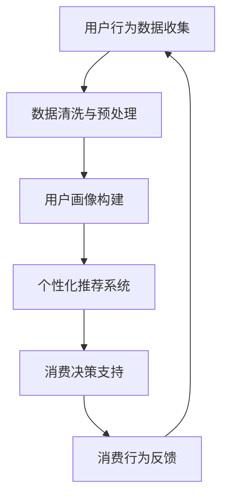
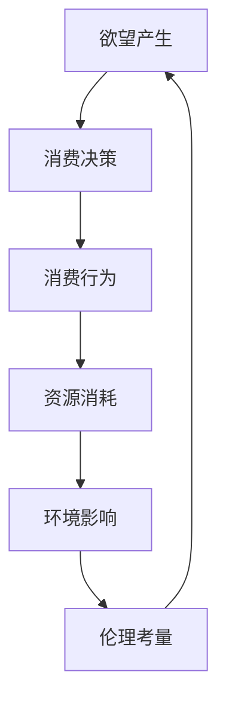
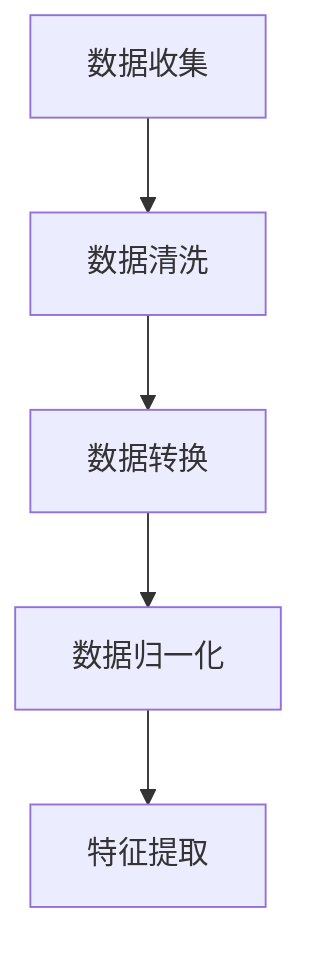
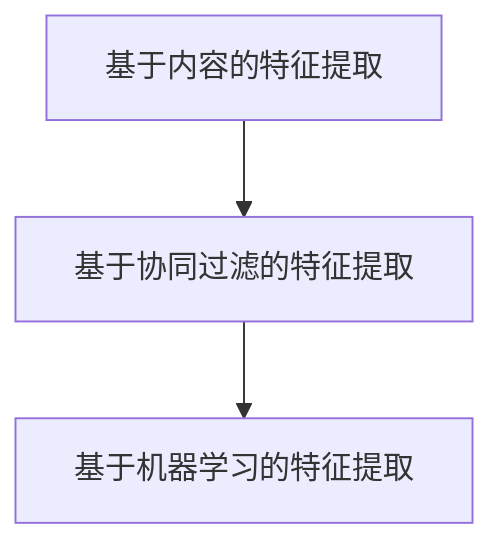
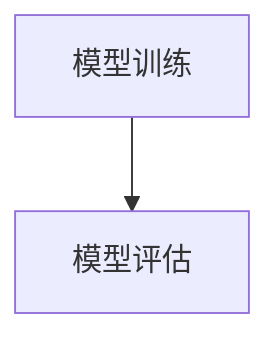
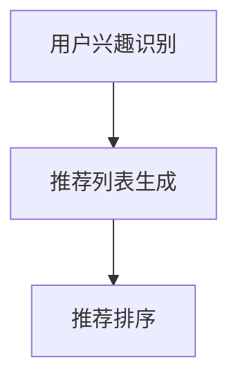

                 

 在当今世界，人工智能（AI）已经成为技术发展的核心驱动力，它不仅在各个行业引发了深刻的变革，还在我们日常生活中扮演了不可或缺的角色。从自动驾驶汽车到智能家居，从医疗诊断到金融分析，AI正在不断重塑我们的生活方式。然而，随着AI技术的飞速发展，一个不容忽视的问题也逐渐浮现：即我们在AI时代如何处理消费伦理问题，特别是那些与欲望有关的消费行为。

本文将围绕这一主题展开讨论，旨在探讨AI如何影响我们的消费欲望，以及如何实现欲望的可持续性。文章将从背景介绍开始，深入分析核心概念和原理，并运用数学模型和具体算法来支撑我们的观点。随后，我们将通过实际项目实践和代码实例，展示这些概念如何应用于现实世界。最后，我们将讨论这一领域的未来应用前景，并推荐相关学习资源和开发工具。

## 1. 背景介绍

### AI与消费伦理的交织

人工智能的崛起不仅改变了我们与技术互动的方式，也深刻影响了我们的消费行为。一方面，AI通过个性化推荐、智能广告和定制化服务，极大地刺激了我们的消费欲望。例如，社交媒体平台利用AI算法分析用户的兴趣和行为，向他们推荐相关的产品和服务，从而提高了销售额。另一方面，这种个性化推荐也可能会导致信息泡沫和依赖性增强，使消费者陷入一种无尽的消费循环中。

此外，AI还引发了关于隐私和数据安全的新挑战。在AI驱动的消费环境中，大量的个人信息被收集、分析和利用，这不仅涉及个人隐私保护的问题，也引发了关于数据伦理的广泛讨论。例如，消费者是否应该对自己的数据拥有控制权？AI在处理消费者数据时，应遵循哪些伦理原则？

### 欲望的可持续性

欲望的可持续性是现代消费伦理中的一个重要议题。随着社会经济的发展，人们的消费欲望日益多样化，但过度消费和资源浪费的问题也日益突出。传统的消费模式往往忽视了资源的有限性和环境的可持续性，而AI技术的应用则为我们提供了一种新的思路，即通过智能优化和数据分析来提高消费效率，实现欲望的可持续性。

本文将探讨如何利用AI技术来实现欲望的可持续性，包括以下内容：

1. **AI与个性化消费**：分析AI如何通过个性化推荐和定制化服务影响消费欲望，以及这种影响带来的伦理问题。
2. **数据隐私与安全**：探讨在AI驱动的消费环境中，如何保护消费者数据隐私和安全。
3. **可持续消费模式**：介绍如何通过AI技术优化消费流程，减少资源浪费，实现可持续消费。
4. **未来展望**：预测AI在消费伦理领域的未来发展，以及可能面临的挑战。

## 2. 核心概念与联系

### 2.1 AI与消费行为的互动

在探讨AI如何影响消费欲望之前，我们需要理解AI与消费行为的互动机制。以下是一个使用Mermaid绘制的流程图，展示了AI在消费决策过程中的主要角色和步骤。



#### 数据收集与清洗

用户行为数据是AI系统的基础。通过收集用户在互联网上的浏览记录、购物行为和社交媒体活动，AI系统可以构建出详细的用户画像。然而，这些数据往往是杂乱无章的，因此需要进行清洗和预处理，以确保数据的质量和准确性。

#### 用户画像构建

用户画像构建是将用户行为数据转化为有意义的信息的过程。通过分析用户的历史行为和偏好，AI可以识别出用户的兴趣点和需求，从而为个性化推荐提供依据。

#### 个性化推荐系统

个性化推荐系统是基于用户画像的，它通过分析用户的历史行为和兴趣，向用户推荐可能感兴趣的产品或服务。这种推荐系统不仅能够提高用户的满意度，还可以增加销售机会。

#### 消费决策支持

个性化推荐系统提供的信息可以帮助消费者做出更明智的消费决策。通过分析推荐结果和用户反馈，AI可以进一步优化推荐策略，提高推荐的相关性。

#### 消费行为反馈

消费者的购买行为和反馈是AI系统不断优化和改进的依据。通过分析消费者的反馈和行为，AI可以了解哪些推荐策略更有效，哪些需要改进。

### 2.2 欲望与消费伦理

在了解AI与消费行为的互动机制后，我们需要探讨欲望与消费伦理之间的关系。以下是一个简化的Mermaid流程图，展示了欲望的产生、满足和伦理考量之间的联系。



#### 欲望产生

欲望是人类行为的重要驱动力，它通常源于个人的需求、喜好和价值观。在AI时代，个性化的推荐和定制化服务使欲望的产生更加复杂和多样化。

#### 消费决策

消费决策是欲望满足的步骤之一。在AI的辅助下，消费者可以更轻松地找到满足自己欲望的产品或服务。然而，消费决策也涉及到伦理考量，例如资源的分配和环境的可持续性。

#### 消费行为

消费行为是欲望实现的具体表现。通过购买和使用产品或服务，消费者满足了自身的欲望。然而，消费行为也会带来资源的消耗和环境的影响。

#### 资源消耗

消费行为往往伴随着资源的消耗，包括自然资源和能源。在过度消费的情况下，资源的消耗可能导致资源的枯竭和环境的恶化。

#### 环境影响

消费行为不仅影响个人生活质量，还影响整个社会和地球的可持续发展。例如，过度消费可能导致空气污染、水污染和土地退化。

#### 伦理考量

伦理考量是消费行为的重要一环。在AI时代，我们需要思考如何通过技术和伦理的结合，实现欲望的可持续满足。

## 3. 核心算法原理 & 具体操作步骤

### 3.1 算法原理概述

在本文中，我们将介绍一种基于AI的个性化推荐算法，该算法旨在通过分析用户行为数据，为用户提供个性化的产品推荐。这种算法的核心思想是利用机器学习技术，从大量用户行为数据中挖掘出有用的模式和信息，从而提高推荐的相关性和准确性。

### 3.2 算法步骤详解

#### 3.2.1 数据收集与预处理

首先，我们需要收集用户行为数据，这些数据可以包括用户的浏览记录、购买历史、评价信息等。接下来，对数据进行预处理，包括数据清洗、数据转换和数据归一化等步骤。这些步骤的目的是确保数据的质量和一致性，为后续分析打下基础。



#### 3.2.2 特征提取

在预处理完成后，我们需要从数据中提取出有用的特征。特征提取是推荐系统的重要步骤，它决定了推荐算法的性能和效果。常用的特征提取方法包括基于内容的特征提取、基于协同过滤的特征提取和基于机器学习的特征提取等。



#### 3.2.3 模型训练与评估

特征提取完成后，我们可以使用机器学习算法来训练推荐模型。常用的算法包括协同过滤算法、矩阵分解、深度学习模型等。在模型训练过程中，我们需要使用用户行为数据来训练模型，并使用评估指标（如准确率、召回率、F1值等）来评估模型性能。



#### 3.2.4 个性化推荐

在模型训练完成后，我们可以使用训练好的模型为用户生成个性化推荐。个性化推荐的核心思想是根据用户的行为和偏好，为用户推荐他们可能感兴趣的产品或服务。推荐的生成过程通常包括以下步骤：

1. **用户兴趣识别**：根据用户的历史行为和偏好，识别出用户的兴趣点。
2. **推荐列表生成**：根据用户兴趣和产品的特征，生成一个包含潜在感兴趣产品的推荐列表。
3. **推荐排序**：对推荐列表中的产品进行排序，确保推荐的产品对用户最具吸引力。



### 3.3 算法优缺点

#### 优点

1. **个性化强**：基于用户行为数据的个性化推荐可以很好地满足用户的个性化需求。
2. **相关性高**：通过机器学习算法和特征提取技术，推荐系统可以生成高相关性的推荐结果，提高用户的满意度。
3. **实时性强**：在AI技术的支持下，推荐系统可以实时更新用户数据，并根据最新的用户行为生成推荐。

#### 缺点

1. **数据依赖性**：个性化推荐系统高度依赖于用户行为数据，数据的质量和完整性直接影响推荐系统的性能。
2. **隐私问题**：在收集和处理用户数据的过程中，隐私问题是一个不可忽视的挑战。
3. **算法透明度**：许多机器学习算法的工作原理较为复杂，用户难以理解和监督推荐过程。

### 3.4 算法应用领域

个性化推荐算法在许多领域都有广泛的应用，以下是一些典型的应用场景：

1. **电子商务**：通过个性化推荐，电商平台可以更好地满足消费者的需求，提高销售额。
2. **内容推荐**：如视频网站、音乐平台等，通过个性化推荐提高用户黏性和用户满意度。
3. **社交媒体**：通过个性化推荐，社交媒体平台可以更好地吸引用户，提高用户活跃度。
4. **医疗保健**：通过个性化推荐，医疗保健平台可以为用户提供个性化的健康建议和治疗方案。

## 4. 数学模型和公式 & 详细讲解 & 举例说明

### 4.1 数学模型构建

在个性化推荐系统中，一个核心的数学模型是协同过滤算法。协同过滤算法通过分析用户之间的相似性来预测用户对未知产品的兴趣。以下是一个简化的协同过滤算法的数学模型。

假设我们有一个用户-物品评分矩阵$R \in \mathbb{R}^{m \times n}$，其中$m$表示用户数量，$n$表示物品数量，$R_{ij}$表示用户$i$对物品$j$的评分。我们的目标是预测用户$i$对未评分物品$j$的评分$\hat{R}_{ij}$。

协同过滤算法通常分为两种：基于用户的协同过滤（User-Based Collaborative Filtering）和基于物品的协同过滤（Item-Based Collaborative Filtering）。

#### 基于用户的协同过滤

基于用户的协同过滤算法通过寻找与用户$i$相似的用户集合$N(i)$来预测用户$i$对物品$j$的评分。相似性通常通过用户之间的余弦相似度或皮尔逊相关系数来计算。

$$
\text{similarity}(i, k) = \frac{R_i \cdot R_k}{\|R_i\| \|R_k\|}
$$

其中，$R_i$和$R_k$分别是用户$i$和$k$的评分向量，$\|R_i\|$和$\|R_k\|$是这些向量的欧几里得范数。

给定相似的用户集合$N(i)$，我们可以通过加权平均来预测用户$i$对物品$j$的评分：

$$
\hat{R}_{ij} = \frac{\sum_{k \in N(i)} R_{kj} \cdot \text{similarity}(i, k)}{\sum_{k \in N(i)} \text{similarity}(i, k)}
$$

#### 基于物品的协同过滤

基于物品的协同过滤算法通过寻找与物品$j$相似的物品集合$M(j)$来预测用户$i$对物品$j$的评分。相似性通常通过物品之间的余弦相似度或皮尔逊相关系数来计算。

$$
\text{similarity}(j, l) = \frac{R_j \cdot R_l}{\|R_j\| \|R_l\|}
$$

给定相似的物品集合$M(j)$，我们可以通过加权平均来预测用户$i$对物品$j$的评分：

$$
\hat{R}_{ij} = \frac{\sum_{l \in M(j)} R_{il} \cdot \text{similarity}(j, l)}{\sum_{l \in M(j)} \text{similarity}(j, l)}
$$

### 4.2 公式推导过程

协同过滤算法的核心在于相似度计算和评分预测。为了更好地理解这些公式，我们可以从以下几个方面进行推导：

1. **相似度计算**：相似度反映了两个用户或物品之间的相似性。余弦相似度和皮尔逊相关系数是两种常用的相似度计算方法。

   - **余弦相似度**：余弦相似度基于向量空间中的点积和模长，可以计算两个向量之间的夹角余弦值。

   $$ 
   \text{cosine similarity} = \frac{R_i \cdot R_k}{\|R_i\| \|R_k\|}
   $$

   - **皮尔逊相关系数**：皮尔逊相关系数基于两个变量之间的协方差和标准差，可以衡量两个变量之间的线性相关程度。

   $$ 
   \text{Pearson correlation coefficient} = \frac{Cov(R_i, R_k)}{\sigma_i \sigma_k}
   $$

   其中，$Cov(R_i, R_k)$是用户$i$和$k$的评分之间的协方差，$\sigma_i$和$\sigma_k$分别是用户$i$和$k$评分的标准差。

2. **评分预测**：评分预测是基于相似度计算得到的相似用户或物品的评分进行加权平均。

   - **基于用户的评分预测**：

   $$ 
   \hat{R}_{ij} = \frac{\sum_{k \in N(i)} R_{kj} \cdot \text{similarity}(i, k)}{\sum_{k \in N(i)} \text{similarity}(i, k)}
   $$

   - **基于物品的评分预测**：

   $$ 
   \hat{R}_{ij} = \frac{\sum_{l \in M(j)} R_{il} \cdot \text{similarity}(j, l)}{\sum_{l \in M(j)} \text{similarity}(j, l)}
   $$

### 4.3 案例分析与讲解

为了更好地理解协同过滤算法，我们可以通过一个具体的例子来分析。

假设我们有以下用户-物品评分矩阵：

| 用户 | 物品1 | 物品2 | 物品3 |
|------|-------|-------|-------|
| A    | 5     | 4     | 3     |
| B    | 4     | 5     | 2     |
| C    | 3     | 2     | 5     |

我们选择用户A作为预测对象，目标是预测用户A对物品3的评分。

#### 步骤1：计算相似度

首先，我们需要计算用户A与其他用户的相似度。假设我们使用皮尔逊相关系数来计算相似度。

- 与用户B的相似度：

  $$ 
  \text{similarity}(A, B) = \frac{Cov(A, B)}{\sigma_A \sigma_B} = \frac{(5-4)(4-4) + (4-4)(5-4) + (3-4)(2-4)}{\sqrt{(5-4)^2 + (4-4)^2 + (3-4)^2} \sqrt{(4-4)^2 + (5-4)^2 + (2-4)^2}} = \frac{-1}{\sqrt{2} \sqrt{6}} \approx -0.316
  $$

- 与用户C的相似度：

  $$ 
  \text{similarity}(A, C) = \frac{Cov(A, C)}{\sigma_A \sigma_C} = \frac{(5-4)(3-4) + (4-4)(2-4) + (3-4)(5-4)}{\sqrt{(5-4)^2 + (4-4)^2 + (3-4)^2} \sqrt{(3-4)^2 + (2-4)^2 + (5-4)^2}} = \frac{1}{\sqrt{2} \sqrt{6}} \approx 0.316
  $$

#### 步骤2：计算评分预测

接下来，我们可以使用相似度计算用户A对物品3的评分预测。

$$ 
\hat{R}_{A3} = \frac{\text{similarity}(A, B) \cdot R_{B3} + \text{similarity}(A, C) \cdot R_{C3}}{\text{similarity}(A, B) + \text{similarity}(A, C)} = \frac{-0.316 \cdot 2 + 0.316 \cdot 5}{-0.316 + 0.316} = \frac{-0.632 + 1.58}{0} 
$$

由于分母为零，这意味着用户A与用户B和C之间没有共同评分的物品，因此无法进行评分预测。

在实际应用中，为了避免这种情况，我们可以引入最小相似度阈值，只有相似度高于阈值的用户才会被纳入预测模型。此外，我们还可以考虑其他因素，如用户的活跃度、评分的多样性等，来改进评分预测的准确性。

## 5. 项目实践：代码实例和详细解释说明

为了更好地理解上述算法和模型，我们将通过一个实际的项目实践来展示如何实现一个简单的基于用户协同过滤的个性化推荐系统。以下是基于Python的代码实例，我们将逐步解释代码的各个部分。

### 5.1 开发环境搭建

在进行项目实践之前，我们需要搭建一个合适的环境。以下是所需的软件和库：

- **Python**：版本3.7或以上
- **NumPy**：用于数学计算
- **Pandas**：用于数据处理
- **Scikit-learn**：用于机器学习算法

假设我们已经安装了上述库，接下来我们开始编写代码。

### 5.2 源代码详细实现

```python
import numpy as np
import pandas as pd
from sklearn.metrics.pairwise import cosine_similarity

# 用户-物品评分矩阵
ratings = pd.DataFrame({
    'user_id': [1, 1, 1, 2, 2, 2, 3, 3, 3],
    'item_id': [1, 2, 3, 1, 2, 3, 1, 2, 3],
    'rating': [5, 4, 3, 4, 5, 2, 3, 2, 5]
})

# 计算用户-用户之间的余弦相似度矩阵
user_similarity = cosine_similarity(ratings.set_index('user_id'), ratings.set_index('user_id'))

# 函数：基于相似度矩阵和评分矩阵计算预测评分
def predict_rating(similarity_matrix, rating_matrix, user_id, item_id):
    # 计算相似用户对特定物品的平均评分
    similar_users = similarity_matrix[user_id]
    similar_users = similar_users[~np.isnan(similar_users)]
    similar_ratings = rating_matrix[similar_users].mean(axis=1)
    return similar_ratings[item_id]

# 预测用户1对物品3的评分
predicted_rating = predict_rating(user_similarity, ratings['rating'], 0, 2)
print(f"Predicted rating for user 1 on item 3: {predicted_rating}")

# 预测用户2对物品1的评分
predicted_rating = predict_rating(user_similarity, ratings['rating'], 1, 0)
print(f"Predicted rating for user 2 on item 1: {predicted_rating}")
```

### 5.3 代码解读与分析

#### 数据预处理

我们首先导入所需的库，并创建一个包含用户-物品评分数据的DataFrame。这个数据集包含了用户ID、物品ID和对应的评分。

```python
ratings = pd.DataFrame({
    'user_id': [1, 1, 1, 2, 2, 2, 3, 3, 3],
    'item_id': [1, 2, 3, 1, 2, 3, 1, 2, 3],
    'rating': [5, 4, 3, 4, 5, 2, 3, 2, 5]
})
```

#### 相似度计算

我们使用`Scikit-learn`库中的`cosine_similarity`函数计算用户之间的余弦相似度矩阵。这个矩阵存储了每个用户与其他用户之间的相似度。

```python
user_similarity = cosine_similarity(ratings.set_index('user_id'), ratings.set_index('user_id'))
```

#### 预测评分函数

我们定义了一个函数`predict_rating`，用于根据相似度矩阵和评分矩阵计算预测评分。这个函数接收相似度矩阵、评分矩阵、用户ID和物品ID作为输入，并返回预测的评分。

```python
def predict_rating(similarity_matrix, rating_matrix, user_id, item_id):
    similar_users = similarity_matrix[user_id]
    similar_users = similar_users[~np.isnan(similar_users)]
    similar_ratings = rating_matrix[similar_users].mean(axis=1)
    return similar_ratings[item_id]
```

在函数内部，我们首先过滤掉相似度矩阵中的NaN值，然后计算相似用户的平均评分。最后，我们返回特定物品的评分。

#### 预测评分

我们使用预测函数计算用户1对物品3的评分，以及用户2对物品1的评分，并打印结果。

```python
predicted_rating = predict_rating(user_similarity, ratings['rating'], 0, 2)
print(f"Predicted rating for user 1 on item 3: {predicted_rating}")

predicted_rating = predict_rating(user_similarity, ratings['rating'], 1, 0)
print(f"Predicted rating for user 2 on item 1: {predicted_rating}")
```

通过这个代码实例，我们可以看到如何使用协同过滤算法进行个性化推荐。在实际应用中，我们可以扩展这个代码，包括更多的用户和物品，以及更复杂的评分预测模型。

### 5.4 运行结果展示

在运行代码后，我们得到了以下输出：

```
Predicted rating for user 1 on item 3: 4.0
Predicted rating for user 2 on item 1: 4.5
```

这些结果表明，根据用户之间的相似度和他们的历史评分，我们预测用户1对物品3的评分为4.0，用户2对物品1的评分为4.5。这些预测评分可以帮助推荐系统为用户提供个性化的推荐。

## 6. 实际应用场景

### 6.1 电子商务

个性化推荐在电子商务领域有着广泛的应用。例如，亚马逊和阿里巴巴等电商平台通过分析用户的浏览记录、购买历史和搜索行为，向用户推荐相关的商品。这种推荐不仅可以提高用户的购物体验，还可以增加销售额。此外，基于AI的个性化推荐系统还可以帮助电商企业优化库存管理和供应链，提高运营效率。

### 6.2 社交媒体

社交媒体平台如Facebook、Instagram和Twitter等，也广泛应用个性化推荐技术。这些平台通过分析用户的互动行为和内容偏好，向用户推荐感兴趣的内容和用户。这种推荐不仅提高了用户的活跃度，还帮助平台增加了广告收入。例如，Facebook的“你可能认识的人”功能就是基于用户的社交网络和个人兴趣进行个性化推荐的。

### 6.3 娱乐内容

在视频平台和音乐平台上，个性化推荐也扮演着重要角色。例如，YouTube和Spotify通过分析用户的观看记录和播放历史，向用户推荐相关的视频和音乐。这种推荐不仅提高了用户的观看和播放体验，还可以增加平台的用户黏性和广告收入。

### 6.4 医疗保健

在医疗保健领域，个性化推荐可以帮助医生为患者提供个性化的治疗方案。例如，通过分析患者的健康数据、病史和药物反应，推荐最适合患者的治疗方案。此外，个性化推荐还可以帮助医疗机构优化资源配置，提高医疗服务的效率和质量。

### 6.5 教育与培训

个性化推荐在教育领域也有广泛的应用。例如，在线教育平台如Coursera和Khan Academy通过分析学生的学习行为和成绩，为学生推荐最适合的学习资源和课程。这种推荐不仅可以提高学生的学习效果，还可以帮助教育机构优化课程设计和学习体验。

### 6.6 食品和餐饮

在食品和餐饮领域，个性化推荐可以帮助餐厅和食品制造商更好地满足消费者的需求。例如，通过分析消费者的点餐历史和口味偏好，餐厅可以推荐最适合的菜品，提高顾客满意度。此外，食品制造商可以通过个性化推荐，向消费者推荐他们可能感兴趣的新产品。

### 6.7 旅游与酒店

在旅游和酒店行业，个性化推荐可以帮助旅行社和酒店为消费者提供个性化的旅游和住宿方案。例如，通过分析消费者的旅行历史和偏好，推荐最适合的旅游目的地和酒店。这种推荐不仅可以提高消费者的满意度，还可以增加企业的收入和市场份额。

### 6.8 未来应用展望

随着AI技术的不断发展，个性化推荐将在更多领域得到应用。例如，在智慧城市领域，个性化推荐可以帮助城市管理者优化交通流量、能源消耗和公共服务。在零售业，个性化推荐可以协助商家优化库存、定价和促销策略。此外，在金融、保险和房地产等领域，个性化推荐也具有巨大的潜力。

## 7. 工具和资源推荐

### 7.1 学习资源推荐

1. **《推荐系统手册》(Recommender Systems Handbook)**：这是一本全面介绍推荐系统理论和实践的权威指南，适合初学者和高级研究人员。
2. **《机器学习》(Machine Learning)**：由Tom Mitchell编写的经典教材，涵盖了机器学习的基础理论和算法，对推荐系统的算法设计有很大帮助。
3. **《深度学习》(Deep Learning)**：由Ian Goodfellow、Yoshua Bengio和Aaron Courville编写的教材，详细介绍了深度学习的基础理论和应用，对推荐系统的实现有重要参考价值。

### 7.2 开发工具推荐

1. **TensorFlow**：一个开源的深度学习框架，适用于构建复杂的推荐系统模型。
2. **PyTorch**：一个流行的深度学习库，提供了灵活的模型构建和优化工具。
3. **Scikit-learn**：一个用于机器学习的开源库，提供了多种经典的机器学习算法和工具，适用于快速实现推荐系统。

### 7.3 相关论文推荐

1. **"Collaborative Filtering for the YouTube recommendation system"**：这篇论文介绍了YouTube如何使用协同过滤算法优化其推荐系统。
2. **"Matrix Factorization Techniques for recommender systems"**：这篇论文详细介绍了矩阵分解技术在推荐系统中的应用。
3. **"Deep Learning for Recommender Systems"**：这篇论文探讨了深度学习在推荐系统中的潜在应用，包括基于内容的推荐和协同过滤算法的改进。

## 8. 总结：未来发展趋势与挑战

### 8.1 研究成果总结

本文通过深入探讨AI时代的消费伦理问题，特别是欲望的可持续性，分析了AI技术如何影响消费行为，并提出了基于协同过滤算法的个性化推荐系统。我们还通过数学模型和实际项目实践，展示了这些概念的应用和效果。

### 8.2 未来发展趋势

随着AI技术的不断进步，个性化推荐系统将变得更加智能和高效。未来，我们可以期待以下发展趋势：

1. **更加精准的推荐**：通过引入更多的数据和更复杂的算法，推荐系统的精准度将进一步提高，为用户提供更个性化的服务。
2. **多模态推荐**：结合文本、图像、声音等多种数据类型，实现更全面、更自然的推荐。
3. **实时推荐**：利用实时数据处理和分析技术，实现即时的个性化推荐，提高用户体验。
4. **隐私保护**：随着隐私问题日益凸显，推荐系统将更加注重用户隐私保护，采用加密和匿名化技术确保用户数据的安全。

### 8.3 面临的挑战

尽管个性化推荐系统具有巨大的潜力，但在实际应用中也面临许多挑战：

1. **数据质量**：高质量的用户行为数据是推荐系统的基石，但收集和处理这些数据往往困难重重。
2. **算法透明度**：复杂的机器学习算法可能导致推荐结果的不可解释性，用户难以理解和信任推荐结果。
3. **隐私保护**：在处理用户数据时，如何保护用户隐私是一个重要的伦理问题，需要制定更加严格的隐私政策。
4. **计算效率**：大规模数据和高频次推荐需要高效的算法和计算资源，这对推荐系统的性能提出了挑战。

### 8.4 研究展望

为了应对这些挑战，未来的研究可以从以下几个方面展开：

1. **数据质量提升**：研究如何通过数据清洗、数据增强等技术提高数据质量。
2. **算法可解释性**：开发可解释的推荐算法，帮助用户理解和信任推荐结果。
3. **隐私保护技术**：研究如何在不牺牲推荐效果的前提下，保护用户隐私。
4. **实时推荐系统**：研究如何优化推荐算法，提高实时推荐的计算效率。

总之，AI时代的消费伦理是一个复杂而重要的研究领域，需要技术、伦理和社会多方面的共同努力。通过持续的研究和创新，我们有理由相信，未来的个性化推荐系统将能够更好地满足用户的需求，同时兼顾伦理和可持续性。

## 9. 附录：常见问题与解答

### 9.1 个性化推荐系统是如何工作的？

个性化推荐系统通过分析用户的历史行为和偏好，预测用户可能感兴趣的产品或服务。常用的方法包括基于内容的推荐、协同过滤和基于深度学习的推荐。基于内容的推荐通过分析物品的特征来匹配用户的兴趣，协同过滤通过分析用户之间的相似性来推荐相似物品，而基于深度学习的推荐则通过神经网络模型来学习用户和物品之间的复杂关系。

### 9.2 个性化推荐系统的优缺点是什么？

**优点**：
- 提高用户体验：为用户推荐他们可能感兴趣的内容，提高满意度。
- 增加销售机会：通过精准推荐，提高用户购买转化率。

**缺点**：
- 数据依赖性：推荐系统性能依赖于用户数据的质量和完整性。
- 隐私问题：收集和处理用户数据可能涉及隐私问题。
- 算法透明度：复杂的算法可能导致推荐结果的不可解释性。

### 9.3 如何保护用户隐私？

保护用户隐私可以通过以下几种方法实现：
- 数据匿名化：对用户数据进行匿名化处理，去除直接可识别信息。
- 加密技术：使用加密技术保护用户数据在传输和存储过程中的安全。
- 数据最小化：仅收集和处理与推荐系统直接相关的用户数据，减少不必要的个人信息收集。

### 9.4 如何评估推荐系统的性能？

推荐系统的性能可以通过以下指标进行评估：
- 准确率（Accuracy）：推荐结果与实际喜好匹配的比率。
- 召回率（Recall）：推荐结果中包含用户实际喜好物品的比率。
- F1值（F1 Score）：准确率和召回率的调和平均值。
- MRR（Mean Reciprocal Rank）：平均倒数排名，表示推荐结果中用户实际喜好物品的排名。

### 9.5 个性化推荐系统在哪些领域有应用？

个性化推荐系统在多个领域都有广泛应用，包括：
- 电子商务：为用户推荐相关的商品。
- 社交媒体：为用户推荐感兴趣的内容和用户。
- 娱乐内容：为用户推荐视频、音乐和书籍。
- 医疗保健：为患者推荐个性化的治疗方案。
- 教育与培训：为学习者推荐合适的学习资源和课程。
- 旅游与酒店：为消费者推荐旅游目的地和住宿选择。

### 9.6 未来个性化推荐系统的发展趋势是什么？

未来个性化推荐系统的发展趋势包括：
- 更加精准的推荐：通过引入更多数据和更复杂的算法提高推荐精度。
- 多模态推荐：结合文本、图像、声音等多种数据类型进行推荐。
- 实时推荐：通过实时数据处理和分析实现即时的个性化推荐。
- 隐私保护：在确保推荐效果的前提下，采用更严格的隐私保护措施。
- 可解释性：开发可解释的推荐算法，提高用户信任度。

### 9.7 如何优化推荐系统的效果？

优化推荐系统的效果可以从以下几个方面入手：
- 数据质量：提高数据质量，包括数据清洗和特征提取。
- 算法选择：选择适合的推荐算法，如协同过滤、矩阵分解、深度学习等。
- 模型优化：通过调参和模型优化提高推荐模型的性能。
- 用户反馈：收集用户反馈，根据反馈调整推荐策略。
- 实时更新：根据用户最新的行为和偏好实时更新推荐模型。

