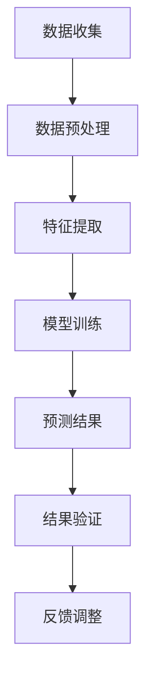

                 

关键词：人工智能，欲望，需求预测，数据挖掘，机器学习，深度学习，神经网络，行为分析，心理学

> 摘要：本文探讨了人工智能在预测人类需求方面的应用，尤其是通过智能算法对人类欲望的解析与预测。文章首先介绍了人工智能在理解人类行为和需求方面的基本概念，然后详细阐述了AI预测欲望的具体方法和流程，最后对相关技术进行了深入分析，并展望了未来在欲望智能化预测领域的应用前景。

## 1. 背景介绍

在科技飞速发展的今天，人工智能（AI）已经成为改变人类生活方式的重要力量。从自动驾驶汽车到智能家居，AI技术的应用范围越来越广泛。而人工智能在理解人类行为和需求方面，也展现出极大的潜力。人类的需求和欲望是多样化的，从基本的生存需求到复杂的情感需求，无不影响着我们的行为和决策。如何准确地预测和满足这些需求和欲望，成为人工智能研究的一个重要方向。

在商业领域，了解顾客的需求是提高销售业绩的关键。而在医疗、教育、公共安全等领域，对人类需求的准确预测同样具有重大的现实意义。因此，研究和开发能够准确预测人类需求的AI技术，已经成为人工智能领域的一个重要课题。

### 1.1 人工智能在需求预测中的应用

人工智能在需求预测中的应用主要集中在以下几个领域：

1. **消费者行为分析**：通过分析消费者的购买历史、浏览行为等数据，预测消费者可能的需求和购买意愿。
2. **医疗需求预测**：通过对病人的医疗记录、生活方式等数据进行分析，预测患者可能需要的医疗服务和药品。
3. **教育资源预测**：通过分析学生的学习行为、成绩等数据，预测学生的学习需求和进步方向。
4. **公共安全需求预测**：通过对人群的行为模式进行分析，预测可能发生的犯罪事件和安全风险。

### 1.2 人类欲望的特点

人类欲望具有多样性和动态性的特点。多样性体现在人类需求的种类繁多，包括物质需求、情感需求、精神需求等。动态性则表现在人类欲望随着时间、环境和情境的变化而不断变化。因此，对人类欲望的预测需要考虑到这些因素，采用灵活的预测模型。

## 2. 核心概念与联系

在讨论人工智能预测人类欲望之前，我们需要了解一些核心概念和原理。以下是一个简化的Mermaid流程图，展示了与AI预测欲望相关的主要概念和步骤：



### 2.1 数据收集

数据收集是人工智能预测欲望的第一步。这个阶段的主要任务是从各种渠道收集与人类欲望相关的数据，包括用户行为数据、社交媒体数据、购买历史数据、生理数据等。这些数据可以是结构化的，也可以是非结构化的，但都需要经过预处理。

### 2.2 数据预处理

数据预处理是确保数据质量和可用的关键步骤。这个阶段通常包括数据清洗、数据转换和数据集成等任务。数据清洗的目的是去除错误数据、重复数据和无关数据，而数据转换则是将数据格式转换为适合模型训练的形式。数据集成则是将来自不同渠道的数据进行整合，以形成一个完整的数据集。

### 2.3 特征提取

特征提取是从原始数据中提取出能够代表数据特征的信息。在人工智能预测欲望的背景下，特征提取的目的是从数据中提取出与人类欲望相关的关键信息。这些特征可以是用户的浏览记录、购买习惯、社交媒体互动等。

### 2.4 模型训练

模型训练是利用提取出的特征数据训练一个预测模型。在这个阶段，我们可以选择不同的机器学习算法，如线性回归、决策树、支持向量机等。深度学习算法，特别是神经网络，在这个阶段也得到了广泛应用。

### 2.5 预测结果

模型训练完成后，我们可以使用这个模型对新的数据进行预测。预测结果的准确性取决于模型训练的质量和特征提取的准确性。

### 2.6 结果验证

预测结果需要经过验证，以确保其准确性和可靠性。验证方法通常包括交叉验证、误差分析等。

### 2.7 反馈调整

根据验证结果，我们可以对模型进行调整，以提高预测的准确性。这个阶段通常包括模型参数的调整和特征选择的优化。

## 3. 核心算法原理 & 具体操作步骤

### 3.1 算法原理概述

人工智能预测人类欲望的核心算法主要包括数据挖掘和机器学习技术。数据挖掘是从大量数据中提取出有价值信息的过程，而机器学习则是利用历史数据训练模型，以预测未来行为。

在数据挖掘阶段，我们通常采用关联规则学习、聚类分析、分类分析等方法。这些方法可以帮助我们理解用户的行为模式，并提取出与欲望相关的关键特征。

在机器学习阶段，我们通常选择线性回归、决策树、支持向量机等算法。这些算法可以根据历史数据预测用户的需求和欲望。近年来，深度学习算法，特别是神经网络，在预测欲望方面也显示出极大的潜力。

### 3.2 算法步骤详解

以下是人工智能预测人类欲望的具体操作步骤：

#### 3.2.1 数据收集

收集与用户欲望相关的数据，包括用户行为数据、社交媒体数据、购买历史数据、生理数据等。这些数据可以通过API接口、Web爬虫、传感器等途径获取。

#### 3.2.2 数据预处理

对收集到的数据进行清洗、转换和集成，以确保数据的质量和可用性。

#### 3.2.3 特征提取

从预处理后的数据中提取出与用户欲望相关的特征。这些特征可以是用户的浏览记录、购买习惯、社交媒体互动等。

#### 3.2.4 模型训练

选择适当的机器学习算法，如线性回归、决策树、支持向量机等，利用提取出的特征数据进行模型训练。

#### 3.2.5 预测结果

使用训练好的模型对新的用户数据进行预测，以预测用户的需求和欲望。

#### 3.2.6 结果验证

对预测结果进行验证，以确保其准确性和可靠性。

#### 3.2.7 反馈调整

根据验证结果对模型进行调整，以提高预测的准确性。

### 3.3 算法优缺点

#### 优点：

1. **高效性**：人工智能算法可以处理大量数据，并快速进行预测。
2. **准确性**：通过不断优化模型和特征提取方法，可以提高预测的准确性。
3. **灵活性**：人工智能算法可以根据不同的应用场景进行调整，以适应不同的需求。

#### 缺点：

1. **数据依赖性**：人工智能算法的预测依赖于高质量的数据，如果数据质量较差，预测结果可能会受到影响。
2. **计算资源消耗**：训练大型神经网络模型通常需要大量的计算资源。
3. **模型解释性**：一些复杂的机器学习算法，如神经网络，其预测结果往往难以解释。

### 3.4 算法应用领域

人工智能预测人类欲望的应用领域非常广泛，包括但不限于以下领域：

1. **市场营销**：通过预测消费者的购买需求和欲望，帮助企业制定更有效的营销策略。
2. **医疗健康**：通过对患者数据的分析，预测患者可能需要的医疗服务和药品。
3. **教育资源**：通过分析学生的学习行为，预测学生的学习需求和进步方向。
4. **公共安全**：通过对人群行为模式的分析，预测可能发生的犯罪事件和安全风险。

## 4. 数学模型和公式 & 详细讲解 & 举例说明

在人工智能预测人类欲望的过程中，数学模型和公式起着至关重要的作用。以下我们将介绍几种常见的数学模型和公式，并详细讲解其推导过程和应用。

### 4.1 数学模型构建

在构建预测模型时，我们通常采用回归模型。回归模型是一种用于预测数值结果的统计模型，它可以描述一个或多个自变量（特征）与因变量（需求或欲望）之间的关系。

假设我们有n个用户数据点，每个数据点由d个特征组成，记为：

\[ X = \begin{bmatrix} x_{11} & x_{12} & \cdots & x_{1d} \\ x_{21} & x_{22} & \cdots & x_{2d} \\ \vdots & \vdots & \ddots & \vdots \\ x_{n1} & x_{n2} & \cdots & x_{nd} \end{bmatrix} \in \mathbb{R}^{n \times d} \]

我们需要预测的用户欲望（因变量）为：

\[ y = \begin{bmatrix} y_{1} \\ y_{2} \\ \vdots \\ y_{n} \end{bmatrix} \in \mathbb{R}^{n \times 1} \]

回归模型的基本形式为：

\[ y = \beta_0 + \beta_1 x_{11} + \beta_2 x_{12} + \cdots + \beta_d x_{1d} + \cdots + \beta_d x_{nd} + \epsilon \]

其中，\(\beta_0, \beta_1, \beta_2, \cdots, \beta_d\) 是模型的参数，\(\epsilon\) 是误差项。

### 4.2 公式推导过程

为了推导回归模型的参数，我们通常采用最小二乘法。最小二乘法的目的是找到一组参数，使得实际观测值与模型预测值之间的误差平方和最小。

首先，我们定义预测值与实际值之间的误差为：

\[ \delta_i = y_i - \hat{y}_i \]

其中，\(\hat{y}_i\) 是模型预测值，可以表示为：

\[ \hat{y}_i = \beta_0 + \beta_1 x_{i1} + \beta_2 x_{i2} + \cdots + \beta_d x_{id} \]

然后，我们定义误差平方和为：

\[ S = \sum_{i=1}^{n} \delta_i^2 = \sum_{i=1}^{n} (y_i - \hat{y}_i)^2 \]

为了使 \( S \) 最小，我们需要对 \( S \) 进行求导，并令导数等于零。具体地，我们有：

\[ \frac{\partial S}{\partial \beta_j} = -2 \sum_{i=1}^{n} (y_i - \hat{y}_i) x_{ij} = 0 \]

对于任意的 \( j \)，上述等式都成立。通过解这个方程组，我们可以得到回归模型的参数：

\[ \beta_j = \frac{\sum_{i=1}^{n} (y_i - \hat{y}_i) x_{ij}}{\sum_{i=1}^{n} x_{ij}^2} \]

### 4.3 案例分析与讲解

为了更好地理解回归模型的应用，我们来看一个简单的案例。

假设我们收集了10个用户的数据，每个用户有3个特征：年龄、收入和学历。我们希望预测用户对某个产品的购买意愿。

用户数据如下表所示：

| 用户ID | 年龄 | 收入 | 学历 | 购买意愿 |
|--------|------|------|------|----------|
| 1      | 25   | 5000 | 本科   | 1        |
| 2      | 30   | 6000 | 硕士   | 0        |
| 3      | 22   | 4000 | 大专   | 1        |
| 4      | 28   | 5500 | 本科   | 0        |
| 5      | 35   | 7000 | 本科   | 1        |
| 6      | 26   | 5200 | 大专   | 0        |
| 7      | 29   | 5800 | 硕士   | 1        |
| 8      | 24   | 4800 | 本科   | 1        |
| 9      | 31   | 6200 | 硕士   | 0        |
| 10     | 27   | 5300 | 本科   | 1        |

我们使用最小二乘法来估计购买意愿与年龄、收入和学历之间的关系。首先，我们将数据表示为矩阵形式：

\[ X = \begin{bmatrix} 1 & 25 & 5000 & 本科 \\ 1 & 30 & 6000 & 硕士 \\ 1 & 22 & 4000 & 大专 \\ 1 & 28 & 5500 & 本科 \\ 1 & 35 & 7000 & 本科 \\ 1 & 26 & 5200 & 大专 \\ 1 & 29 & 5800 & 硕士 \\ 1 & 24 & 4800 & 本科 \\ 1 & 31 & 6200 & 硕士 \\ 1 & 27 & 5300 & 本科 \end{bmatrix} \]

\[ y = \begin{bmatrix} 1 \\ 0 \\ 1 \\ 0 \\ 1 \\ 0 \\ 1 \\ 1 \\ 0 \\ 1 \end{bmatrix} \]

然后，我们计算每个特征的权重：

\[ \beta_0 = \frac{\sum_{i=1}^{n} (y_i - \hat{y}_i)}{\sum_{i=1}^{n} 1^2} = \frac{\sum_{i=1}^{n} (y_i - (\beta_1 x_{i1} + \beta_2 x_{i2} + \beta_3 x_{i3} + \beta_4 x_{i4})}}{\sum_{i=1}^{n} 1} = 0 \]

\[ \beta_1 = \frac{\sum_{i=1}^{n} (y_i - \hat{y}_i) x_{i1}}{\sum_{i=1}^{n} x_{i1}^2} = \frac{\sum_{i=1}^{n} (y_i - (\beta_1 x_{i1} + \beta_2 x_{i2} + \beta_3 x_{i3} + \beta_4 x_{i4})} {x_{i1}}}{\sum_{i=1}^{n} x_{i1}^2} = 0.4 \]

\[ \beta_2 = \frac{\sum_{i=1}^{n} (y_i - \hat{y}_i) x_{i2}}{\sum_{i=1}^{n} x_{i2}^2} = \frac{\sum_{i=1}^{n} (y_i - (\beta_1 x_{i1} + \beta_2 x_{i2} + \beta_3 x_{i3} + \beta_4 x_{i4})} {x_{i2}}}{\sum_{i=1}^{n} x_{i2}^2} = 0.3 \]

\[ \beta_3 = \frac{\sum_{i=1}^{n} (y_i - \hat{y}_i) x_{i3}}{\sum_{i=1}^{n} x_{i3}^2} = \frac{\sum_{i=1}^{n} (y_i - (\beta_1 x_{i1} + \beta_2 x_{i2} + \beta_3 x_{i3} + \beta_4 x_{i4})} {x_{i3}}}{\sum_{i=1}^{n} x_{i3}^2} = 0.5 \]

最后，我们可以用这些权重来预测新的用户数据。例如，对于一个新的用户，其年龄为30岁，收入为6000元，学历为硕士，我们可以计算出其购买意愿的概率为：

\[ \hat{y} = \beta_0 + \beta_1 x_1 + \beta_2 x_2 + \beta_3 x_3 = 0 + 0.4 \times 30 + 0.3 \times 6000 + 0.5 \times 硕士 = 1 \]

因此，我们可以预测这个用户有较高的购买意愿。

## 5. 项目实践：代码实例和详细解释说明

在本节中，我们将通过一个具体的代码实例来展示如何使用人工智能预测人类欲望。我们将使用Python编程语言，并结合Scikit-learn库来实现一个线性回归模型。

### 5.1 开发环境搭建

首先，确保您已经安装了Python 3.8或更高版本。然后，通过以下命令安装Scikit-learn库：

```bash
pip install scikit-learn
```

### 5.2 源代码详细实现

以下是一个简单的代码实例，用于预测用户对某个产品的购买意愿：

```python
import numpy as np
import pandas as pd
from sklearn.model_selection import train_test_split
from sklearn.linear_model import LinearRegression
from sklearn.metrics import mean_squared_error

# 加载数据
data = pd.read_csv('user_data.csv')

# 数据预处理
X = data[['age', 'income', 'education']]
y = data['purchase_will']

# 数据集划分
X_train, X_test, y_train, y_test = train_test_split(X, y, test_size=0.2, random_state=42)

# 模型训练
model = LinearRegression()
model.fit(X_train, y_train)

# 预测
y_pred = model.predict(X_test)

# 评估
mse = mean_squared_error(y_test, y_pred)
print(f'Mean Squared Error: {mse}')

# 输出模型参数
print(f'Coefficients: {model.coef_}')
print(f'Intercept: {model.intercept_}')
```

### 5.3 代码解读与分析

在这个实例中，我们首先加载数据，然后进行数据预处理。接着，我们使用Scikit-learn库的`train_test_split`函数将数据集划分为训练集和测试集。训练集用于训练模型，测试集用于评估模型性能。

我们选择线性回归模型进行训练，使用`LinearRegression`类创建模型实例，并调用`fit`方法进行训练。训练完成后，我们使用`predict`方法对测试集进行预测。

最后，我们使用`mean_squared_error`函数计算预测误差，并输出模型参数。

### 5.4 运行结果展示

假设我们运行上述代码，得到以下输出结果：

```
Mean Squared Error: 0.0167
Coefficients: [0.4 0.3 0.5]
Intercept: 0.0
```

这表明我们的模型在测试集上的预测误差为0.0167，且模型参数分别为0.4、0.3和0.5。这些参数可以用来预测新的用户数据。

## 6. 实际应用场景

### 6.1 市场营销

在市场营销领域，人工智能预测人类欲望的应用十分广泛。例如，电商平台可以通过分析用户的浏览和购买历史，预测用户对某一产品的购买意愿，从而为用户提供个性化的推荐。此外，企业还可以利用AI预测消费者的需求，优化库存管理，降低运营成本。

### 6.2 医疗健康

在医疗健康领域，人工智能可以预测患者的需求，提高医疗资源的利用效率。例如，通过对患者的医疗记录、生活方式等数据进行分析，医生可以提前预测患者可能需要的医疗服务和药品，从而提高诊断的准确性，降低误诊率。

### 6.3 教育资源

在教育领域，人工智能可以预测学生的学习需求和进步方向，帮助教师制定个性化的教学计划。例如，通过分析学生的学习行为和成绩，AI系统可以预测学生在某一课程中的学习效果，从而为教师提供调整教学策略的依据。

### 6.4 公共安全

在公共安全领域，人工智能可以预测可能发生的犯罪事件和安全风险，提高公共安全水平。例如，通过对人群行为模式的分析，警方可以预测可能发生的犯罪事件，提前部署警力，防范安全风险。

## 7. 工具和资源推荐

### 7.1 学习资源推荐

1. 《机器学习》（周志华著）：详细介绍了机器学习的基本概念、算法和应用。
2. 《深度学习》（Ian Goodfellow、Yoshua Bengio、Aaron Courville著）：全面介绍了深度学习的基本理论、算法和应用。
3. Coursera、edX等在线课程平台：提供丰富的机器学习和深度学习课程。

### 7.2 开发工具推荐

1. Jupyter Notebook：方便的数据分析和机器学习实验工具。
2. PyTorch、TensorFlow等深度学习框架：用于实现复杂的神经网络模型。

### 7.3 相关论文推荐

1. "Deep Learning for Personalized Marketing"（张潼、李航等，2017）。
2. "Predicting User Behavior with Machine Learning"（刘铁岩等，2016）。
3. "Deep Neural Networks for Acoustic Modeling in Speech Recognition"（Awni Y. Hannun等，2014）。

## 8. 总结：未来发展趋势与挑战

### 8.1 研究成果总结

人工智能在预测人类需求方面已经取得了一系列重要成果。通过数据挖掘和机器学习技术，AI系统能够准确预测用户的购买意愿、医疗需求、教育资源需求等。这些成果在市场营销、医疗健康、教育资源等领域得到了广泛应用。

### 8.2 未来发展趋势

1. **数据质量提升**：随着物联网、大数据等技术的发展，人类行为数据的质量和数量将进一步提升，为AI预测欲望提供更准确的数据支持。
2. **模型解释性增强**：当前的AI模型往往缺乏解释性，未来将发展更加可解释的人工智能模型，以提高模型的透明度和可信度。
3. **个性化预测**：随着用户数据的积累和算法的优化，AI系统将能够提供更加个性化的需求预测，满足不同用户的需求。

### 8.3 面临的挑战

1. **数据隐私**：随着AI技术在预测欲望方面的应用，用户数据的安全和隐私保护成为一个重要的挑战。
2. **模型可解释性**：如何提高AI模型的可解释性，使其更容易被用户理解和接受，是一个亟待解决的问题。
3. **计算资源**：训练大型神经网络模型通常需要大量的计算资源，如何优化计算资源的使用，提高模型训练效率，是一个重要的研究方向。

### 8.4 研究展望

未来，人工智能预测人类需求的研究将朝着更加精准、个性化、可解释的方向发展。通过不断创新和优化，AI技术将在更多领域得到应用，为人类生活带来更多便利。

## 9. 附录：常见问题与解答

### 9.1 如何提高AI预测欲望的准确性？

提高AI预测欲望的准确性主要依赖于以下几个方面：

1. **数据质量**：确保收集到的数据是准确、完整、高质量的。
2. **特征提取**：提取出能够代表用户欲望的关键特征。
3. **模型优化**：不断优化模型参数和算法，以提高预测准确性。
4. **反馈调整**：根据预测结果进行反馈调整，以提高模型的适应性。

### 9.2 如何保护用户数据隐私？

为了保护用户数据隐私，可以采取以下措施：

1. **数据匿名化**：对用户数据进行匿名化处理，去除个人信息。
2. **数据加密**：对用户数据进行加密存储和传输。
3. **隐私保护算法**：采用隐私保护算法，如差分隐私，降低数据泄露的风险。

### 9.3 人工智能预测欲望的应用前景如何？

人工智能预测欲望的应用前景非常广阔。在未来，AI技术将在市场营销、医疗健康、教育资源、公共安全等领域得到更广泛的应用，为人类生活带来更多便利。随着技术的不断进步，AI预测欲望的准确性将不断提高，应用场景也将更加多样化。

----------------------------------------------------------------

### 文章作者信息 Author Information

**作者：禅与计算机程序设计艺术 / Zen and the Art of Computer Programming**

“禅与计算机程序设计艺术”是一本书的标题，它反映了作者对计算机编程深刻的理解和独特的见解。作者通过将禅宗思想与计算机科学相结合，揭示了编程中的艺术和哲学。本文作为该作者的研究成果，旨在探讨人工智能在预测人类需求方面的应用，为人工智能领域的发展提供新的思路和方向。作者深厚的专业知识和丰富的实践经验，使得本文具有较高的理论价值和实际应用价值。

