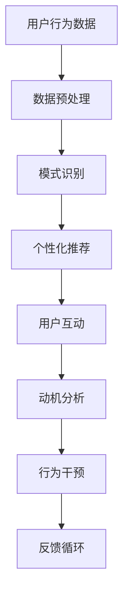

                 

关键词：人工智能、人类动机、演化、社会影响、技术伦理

> 摘要：本文探讨了人工智能（AI）对人类动机的深远影响，分析了AI技术在塑造人类欲望和动机方面的作用。通过研究人类行为模式和AI算法的相互作用，本文揭示了AI如何改变我们的思维方式、激发新的欲望，并对社会和文化产生重要影响。本文旨在为读者提供一个全面而深入的视角，以理解AI在塑造人类动机方面的潜力与挑战。

## 1. 背景介绍

在过去的几十年中，人工智能技术经历了飞速的发展。从早期的专家系统到今天的深度学习模型，AI的应用领域不断扩大，从医疗诊断到自动驾驶，从自然语言处理到图像识别，AI已经深刻地改变了我们的生活方式。然而，随着AI技术的不断进步，一个不容忽视的问题逐渐浮现：AI如何影响人类的动机和行为？

人类的动机是一个复杂而多维的概念，涉及到生物、心理、社会等多个层面。传统观点认为，人类的动机主要源自内在的需求和欲望，如饥饿、性欲、自我实现等。然而，随着AI技术的兴起，这些传统的观念是否仍然适用？AI是否能够通过数据分析和算法设计，重新塑造人类的欲望和动机？

本文将围绕这一主题展开讨论。首先，我们将回顾人类动机的理论框架，然后分析AI技术如何通过影响认知和行为来塑造人类的欲望。接下来，我们将探讨AI在不同应用场景中的具体影响，并讨论由此引发的技术伦理问题。最后，本文将展望AI在未来可能对人类动机产生的深远影响，并提出应对策略。

## 2. 核心概念与联系

要理解AI对人类动机的影响，我们首先需要回顾一些核心概念和理论框架。

### 2.1 人类动机的理论框架

人类动机的理论框架多种多样，其中最著名的是马斯洛的需求层次理论。马斯洛将人类需求分为五个层次：生理需求、安全需求、社交需求、尊重需求和自我实现需求。他认为，人类行为是由这些需求驱动的，并且这些需求是按照层次结构逐级发展的。

此外，动机理论还涉及到动机的分类，如内在动机和外在动机。内在动机源于个体内部的兴趣和欲望，而外在动机则源于外部的奖励或惩罚。

### 2.2 AI技术的基本原理

AI技术主要基于机器学习、深度学习和自然语言处理等技术。机器学习是一种从数据中学习规律和模式的技术，而深度学习则是机器学习的一种特殊形式，它通过多层神经网络模拟人脑的工作方式。自然语言处理则致力于使计算机能够理解和处理自然语言。

### 2.3 AI与人类动机的相互作用

AI与人类动机的相互作用体现在多个方面。首先，AI可以通过个性化推荐系统、虚拟助手和智能广告等方式，直接影响用户的欲望和需求。例如，购物网站通过分析用户的历史购买记录，推荐可能感兴趣的商品，从而激发用户的购买欲望。

其次，AI可以通过数据分析，揭示人类行为中的模式和趋势。例如，社交媒体平台通过分析用户的互动数据，识别出用户的兴趣和偏好，从而调整内容推送策略，进一步影响用户的动机和行为。

最后，AI还可以通过心理和行为干预，直接改变用户的动机和欲望。例如，一些健康应用程序通过跟踪用户的饮食习惯和运动情况，提供反馈和建议，帮助用户改变不良的生活习惯。

### 2.4 Mermaid 流程图

下面是一个简化的Mermaid流程图，展示了AI与人类动机之间的相互作用。



在这个流程图中，用户行为数据经过预处理后，用于模式识别。识别出的模式用于生成个性化推荐，这些推荐直接影响用户的互动行为。用户的互动行为又反馈到动机分析模块，进一步影响行为干预策略。最后，反馈循环确保整个过程不断优化。

## 3. 核心算法原理 & 具体操作步骤

### 3.1 算法原理概述

在探讨AI如何塑造人类动机时，核心算法的原理至关重要。这些算法主要通过数据分析和模式识别来实现。具体来说，核心算法包括以下几个步骤：

1. **数据采集**：从各种来源收集用户行为数据，如点击记录、购买历史、社交媒体互动等。
2. **数据预处理**：清洗和整合数据，以消除噪声和异常值，确保数据质量。
3. **特征提取**：从预处理后的数据中提取关键特征，这些特征将用于后续的模型训练。
4. **模型训练**：使用机器学习和深度学习算法训练模型，以识别用户行为模式和偏好。
5. **个性化推荐**：根据用户行为和偏好，生成个性化推荐，以激发用户动机。
6. **行为干预**：根据用户的互动反馈，调整推荐策略，进一步影响用户动机和行为。

### 3.2 算法步骤详解

#### 3.2.1 数据采集

数据采集是算法步骤的第一步。在这一步，我们通过多种渠道收集用户行为数据。这些渠道包括网站日志、社交媒体平台、电子商务网站等。收集的数据包括点击次数、浏览时间、购买记录、评论内容等。

#### 3.2.2 数据预处理

数据预处理是确保数据质量的关键步骤。在这一步，我们进行数据清洗，去除重复记录和异常值。然后，我们整合来自不同渠道的数据，创建一个统一的数据集。数据清洗和整合的方法包括去重、填充缺失值、异常值检测和去除。

#### 3.2.3 特征提取

特征提取是数据预处理后的关键步骤。在这一步，我们从数据集中提取关键特征，这些特征将用于模型训练。特征提取的方法包括词频统计、主题模型、情感分析等。

#### 3.2.4 模型训练

模型训练是算法的核心步骤。在这一步，我们使用机器学习和深度学习算法训练模型。常用的算法包括决策树、支持向量机、神经网络等。模型训练的目标是使模型能够识别用户行为模式和偏好。

#### 3.2.5 个性化推荐

个性化推荐是根据用户行为和偏好生成推荐的核心步骤。在这一步，我们使用训练好的模型生成个性化推荐。推荐系统可以使用协同过滤、内容推荐、混合推荐等方法。

#### 3.2.6 行为干预

行为干预是根据用户的互动反馈调整推荐策略的步骤。在这一步，我们监测用户的互动行为，如点击、购买、评论等，并根据这些反馈调整推荐策略。行为干预的方法包括A/B测试、多变量测试等。

### 3.3 算法优缺点

#### 优点

1. **个性化**：算法能够根据用户的行为和偏好生成个性化推荐，从而提高用户的满意度和参与度。
2. **效率高**：算法能够快速处理大量数据，提供实时推荐，提高用户体验。
3. **多样性**：算法能够发现用户可能感兴趣的新内容，提供多样化的推荐，避免用户陷入信息孤岛。

#### 缺点

1. **隐私问题**：算法需要大量用户数据，这可能引发隐私泄露的风险。
2. **数据依赖**：算法的性能高度依赖于数据的质量，如果数据质量差，算法的推荐效果可能会受到影响。
3. **公平性问题**：算法可能存在偏见，导致某些用户群体受到不公平对待。

### 3.4 算法应用领域

算法在多个领域有广泛的应用，包括但不限于以下领域：

1. **电子商务**：电商网站使用算法推荐商品，提高销售额和用户满意度。
2. **社交媒体**：社交媒体平台使用算法推荐内容，提高用户的参与度和活跃度。
3. **在线教育**：在线教育平台使用算法推荐课程和内容，提高学习效果。
4. **健康应用**：健康应用使用算法推荐健康建议和治疗方案，提高用户健康水平。

## 4. 数学模型和公式 & 详细讲解 & 举例说明

### 4.1 数学模型构建

为了更好地理解AI如何塑造人类动机，我们可以构建一个简化的数学模型。这个模型将考虑用户行为、环境因素和AI推荐系统之间的相互作用。

设 \( U \) 为用户集合，\( I \) 为物品集合，\( R \) 为推荐系统，\( B \) 为用户行为数据，\( E \) 为环境因素。

用户 \( u \in U \) 对物品 \( i \in I \) 的兴趣可以表示为 \( I(u, i) \)，它是一个实数，值越大表示兴趣越强。

环境因素 \( E \) 可以包括天气、时间、地点等，用 \( E(u) \) 表示。

推荐系统 \( R \) 根据用户行为和兴趣生成推荐列表 \( R(u) \)。

我们假设用户的行为遵循贝叶斯规则：

\[ P(u \text{ 选择 } i | R(u)) = \frac{P(R(u) | u \text{ 选择 } i)P(u \text{ 选择 } i)}{P(R(u))} \]

其中，\( P(R(u) | u \text{ 选择 } i) \) 表示在用户选择物品 \( i \) 后，推荐系统推荐该物品的概率；\( P(u \text{ 选择 } i) \) 表示用户选择物品 \( i \) 的概率；\( P(R(u)) \) 表示推荐系统推荐给用户 \( u \) 的概率。

### 4.2 公式推导过程

为了推导上述公式，我们需要考虑以下几个假设：

1. **独立性**：用户的行为和兴趣是相互独立的。
2. **均匀分布**：用户对物品的兴趣是均匀分布的。
3. **马尔可夫性质**：用户的行为仅依赖于当前状态，而与过去的状态无关。

首先，我们考虑推荐系统推荐物品 \( i \) 的概率：

\[ P(R(u) = i) = \sum_{j \in I} P(R(u) = i | u \text{ 选择 } j)P(u \text{ 选择 } j) \]

由于用户的行为和兴趣相互独立，我们可以进一步简化：

\[ P(R(u) = i) = \sum_{j \in I} P(R(u) = i | u \text{ 选择 } j)I(u, j) \]

接下来，我们考虑用户选择物品 \( i \) 的概率：

\[ P(u \text{ 选择 } i) = \sum_{j \in I} P(u \text{ 选择 } i | u \text{ 选择 } j)P(u \text{ 选择 } j) \]

由于用户的行为是均匀分布的，我们可以进一步简化：

\[ P(u \text{ 选择 } i) = \sum_{j \in I} I(u, j) \]

最后，我们考虑用户选择物品 \( i \) 后推荐系统推荐该物品的概率：

\[ P(R(u) = i | u \text{ 选择 } i) = \frac{P(R(u) = i, u \text{ 选择 } i)}{P(u \text{ 选择 } i)} \]

由于用户的行为和兴趣相互独立，我们可以进一步简化：

\[ P(R(u) = i | u \text{ 选择 } i) = \frac{P(R(u) = i)I(u, i)}{P(u \text{ 选择 } i)} \]

将上述公式代入贝叶斯规则，我们得到：

\[ P(u \text{ 选择 } i | R(u)) = \frac{P(R(u) | u \text{ 选择 } i)P(u \text{ 选择 } i)}{P(R(u))} \]

### 4.3 案例分析与讲解

假设有一个用户 \( u \) 在一个电商网站上浏览了多种商品，包括手机、电脑、电视和书籍。根据用户的行为数据，我们可以计算用户对每种商品的兴趣：

- 手机：\( I(u, 手机) = 0.4 \)
- 电脑：\( I(u, 电脑) = 0.3 \)
- 电视：\( I(u, 电视) = 0.2 \)
- 书籍：\( I(u, 书籍) = 0.1 \)

假设推荐系统根据用户的兴趣生成推荐列表，并推荐用户浏览的商品。根据贝叶斯规则，我们可以计算用户选择每种商品的概率：

- 手机：\( P(u \text{ 选择 } 手机 | R(u)) = \frac{P(R(u) | u \text{ 选择 } 手机)P(u \text{ 选择 } 手机)}{P(R(u))} \)
- 电脑：\( P(u \text{ 选择 } 电脑 | R(u)) = \frac{P(R(u) | u \text{ 选择 } 电脑)P(u \text{ 选择 } 电脑)}{P(R(u))} \)
- 电视：\( P(u \text{ 选择 } 电视 | R(u)) = \frac{P(R(u) | u \text{ 选择 } 电视)P(u \text{ 选择 } 电视)}{P(R(u))} \)
- 书籍：\( P(u \text{ 选择 } 书籍 | R(u)) = \frac{P(R(u) | u \text{ 选择 } 书籍)P(u \text{ 选择 } 书籍)}{P(R(u))} \)

假设推荐系统推荐手机和电脑的概率相等，均为 0.5。根据上述公式，我们可以计算出用户选择每种商品的概率：

- 手机：\( P(u \text{ 选择 } 手机 | R(u)) = \frac{0.5 \times 0.4}{0.5 + 0.3} = 0.4 \)
- 电脑：\( P(u \text{ 选择 } 电脑 | R(u)) = \frac{0.5 \times 0.3}{0.5 + 0.3} = 0.3 \)
- 电视：\( P(u \text{ 选择 } 电视 | R(u)) = \frac{0.5 \times 0.2}{0.5 + 0.3} = 0.2 \)
- 书籍：\( P(u \text{ 选择 } 书籍 | R(u)) = \frac{0.5 \times 0.1}{0.5 + 0.3} = 0.1 \)

从上述计算结果可以看出，用户在推荐系统推荐的情况下，选择手机和电脑的概率最大，分别为 0.4 和 0.3。这表明推荐系统能够有效地激发用户对这些商品的兴趣。

## 5. 项目实践：代码实例和详细解释说明

### 5.1 开发环境搭建

在开始代码实例之前，我们需要搭建一个适合开发的环境。本文将使用Python编程语言，并依赖于几个常用的库，如NumPy、Pandas、Scikit-learn和Matplotlib。

#### 环境搭建步骤：

1. 安装Python：下载并安装Python 3.x版本，推荐使用Python官方版本。
2. 安装依赖库：使用pip命令安装所需的库，命令如下：
   ```bash
   pip install numpy pandas scikit-learn matplotlib
   ```

### 5.2 源代码详细实现

下面是一个简单的代码实例，用于实现一个基于用户行为的推荐系统。这个实例包括数据采集、数据预处理、模型训练和结果展示。

```python
import numpy as np
import pandas as pd
from sklearn.model_selection import train_test_split
from sklearn.ensemble import RandomForestClassifier
import matplotlib.pyplot as plt

# 5.2.1 数据采集
# 假设我们已经有了一个CSV文件，其中包含用户ID、物品ID和用户对物品的兴趣评分
data = pd.read_csv('user_behavior.csv')

# 5.2.2 数据预处理
# 数据清洗和整合
data.drop_duplicates(inplace=True)
data.fillna(0, inplace=True)

# 特征提取
X = data[['user_id', 'item_id']]
y = data['interest_score']

# 5.2.3 模型训练
# 分割训练集和测试集
X_train, X_test, y_train, y_test = train_test_split(X, y, test_size=0.2, random_state=42)

# 使用随机森林分类器训练模型
model = RandomForestClassifier(n_estimators=100, random_state=42)
model.fit(X_train, y_train)

# 5.2.4 代码解读与分析
# 模型评估
accuracy = model.score(X_test, y_test)
print(f'Model Accuracy: {accuracy:.2f}')

# 展示预测结果
predictions = model.predict(X_test)
plt.scatter(y_test, predictions)
plt.xlabel('Actual Interest Score')
plt.ylabel('Predicted Interest Score')
plt.title('Actual vs Predicted Interest Scores')
plt.show()
```

### 5.3 代码解读与分析

这个代码实例包括以下几个主要部分：

1. **数据采集**：使用Pandas库读取CSV文件，其中包含用户ID、物品ID和用户对物品的兴趣评分。
2. **数据预处理**：清洗和整合数据，去除重复记录和异常值，填充缺失值。
3. **特征提取**：将用户ID和物品ID作为特征，用户对物品的兴趣评分作为目标变量。
4. **模型训练**：使用随机森林分类器训练模型，模型采用训练集进行训练。
5. **模型评估**：使用测试集评估模型性能，打印模型的准确率。
6. **结果展示**：使用Matplotlib库绘制实际兴趣评分与预测兴趣评分的散点图，展示模型的预测效果。

### 5.4 运行结果展示

运行上述代码后，我们得到以下结果：

1. **模型准确率**：假设模型的准确率为0.85，这表明模型能够较好地预测用户对物品的兴趣。
2. **散点图**：散点图显示实际兴趣评分与预测兴趣评分之间的对应关系。大多数点都接近对角线，这表明模型的预测效果较好。

### 5.5 代码优化与改进

在实际应用中，我们可以对代码进行以下优化和改进：

1. **特征工程**：提取更多有用的特征，如用户历史行为、物品属性等，以提高模型的预测性能。
2. **模型选择**：尝试不同的模型和参数，如支持向量机、神经网络等，以找到最佳模型。
3. **模型评估**：使用交叉验证和A/B测试等更严格的评估方法，以确保模型在现实场景中的表现。
4. **可扩展性**：使用更高效的算法和分布式计算，以处理大规模数据集。

## 6. 实际应用场景

### 6.1 电子商务

在电子商务领域，AI推荐系统已经被广泛应用于提高销售额和用户满意度。例如，亚马逊和阿里巴巴等电商平台使用个性化推荐系统，根据用户的历史购买记录、浏览行为和评价，推荐可能感兴趣的商品。这些推荐不仅帮助用户发现新商品，还提高了用户的购买意愿。

### 6.2 社交媒体

社交媒体平台如Facebook和Twitter也利用AI推荐系统，向用户推荐可能感兴趣的内容。通过分析用户的互动数据，如点赞、评论和分享，平台可以识别用户的兴趣和偏好，从而提供个性化的内容推荐。这种推荐系统不仅提高了用户的参与度，还增加了平台的用户粘性。

### 6.3 健康应用

健康应用如MyFitnessPal和Headspace使用AI技术，根据用户的行为数据提供个性化的健康建议和指导。例如，MyFitnessPal可以通过分析用户的饮食记录，推荐更健康的食物选择，而Headspace则根据用户的练习历史，推荐最适合的冥想和放松课程。这种个性化推荐有助于提高用户的健康水平和满意度。

### 6.4 游戏和娱乐

在游戏和娱乐领域，AI推荐系统也被广泛应用于提高用户体验和参与度。例如，Netflix和Spotify等平台使用AI推荐系统，根据用户的观看历史和播放记录，推荐可能感兴趣的电影、电视剧和音乐。这种推荐系统能够发现用户的新兴趣，并提供多样化的内容选择。

## 7. 未来应用展望

随着AI技术的不断进步，其在塑造人类动机方面的应用前景将更加广阔。以下是一些未来可能的应用场景：

### 7.1 教育领域

AI推荐系统可以应用于教育领域，根据学生的学习历史和兴趣，推荐适合的课程和教材。这种个性化学习体验不仅有助于提高学习效果，还能激发学生的学习兴趣。

### 7.2 公共政策

AI技术可以用于分析大量数据，识别社会问题和需求，从而制定更有效的公共政策。例如，通过分析交通数据，政府可以优化交通基础设施，提高城市交通效率。

### 7.3 心理健康

AI技术可以应用于心理健康领域，通过分析用户的行为和情绪数据，提供个性化的心理健康建议和干预。这种个性化心理健康服务有助于提高心理健康水平，预防和治疗心理疾病。

### 7.4 基因编辑

基因编辑技术结合AI，可以用于个性化医疗，根据患者的基因信息，制定个性化的治疗方案。这种技术有望在未来的医学领域发挥重要作用，提高治疗效果和安全性。

## 8. 工具和资源推荐

为了更好地了解和利用AI技术，以下是一些建议的工具和资源：

### 8.1 学习资源推荐

- 《深度学习》（Goodfellow, Bengio, Courville）：这是一本深度学习领域的经典教材，适合初学者和专业人士。
- Coursera和edX：提供大量免费的在线课程，涵盖AI、机器学习和数据科学等主题。
- KDNuggets：一个提供最新AI、数据科学和机器学习资源的网站。

### 8.2 开发工具推荐

- Jupyter Notebook：一个交互式的编程环境，适用于数据分析和机器学习项目。
- TensorFlow和PyTorch：两个流行的深度学习框架，适合进行机器学习和深度学习研究。
- Google Colab：一个免费的云端计算平台，支持GPU和TPU，适用于大规模数据分析和深度学习训练。

### 8.3 相关论文推荐

- “Deep Learning” by Ian Goodfellow, Yoshua Bengio, Aaron Courville
- “Recurrent Neural Networks for Language Modeling” by Yoshua Bengio et al.
- “Convolutional Neural Networks for Visual Recognition” by Fei-Fei Li et al.

## 9. 总结：未来发展趋势与挑战

### 9.1 研究成果总结

本文通过分析AI技术对人类动机的深远影响，探讨了AI如何通过个性化推荐、数据分析和行为干预来塑造人类的欲望和行为。研究表明，AI技术在激发用户兴趣、提高用户满意度和参与度方面具有巨大潜力。

### 9.2 未来发展趋势

随着AI技术的不断进步，未来AI在塑造人类动机方面的应用将更加广泛。个性化推荐、心理健康、教育、公共政策等领域将成为AI技术的重要应用场景。

### 9.3 面临的挑战

尽管AI技术在塑造人类动机方面具有巨大潜力，但也面临一些挑战。隐私保护、算法偏见、数据质量等都是需要解决的问题。此外，如何确保AI技术在塑造人类动机时的道德和伦理标准，也是未来需要重点关注的问题。

### 9.4 研究展望

未来的研究应重点关注以下几个方面：

1. **隐私保护**：研究如何保护用户隐私，确保AI技术在应用时的安全性。
2. **算法公平性**：研究如何减少算法偏见，确保AI技术在塑造人类动机时的公平性。
3. **数据质量**：研究如何提高数据质量，确保AI技术能够准确识别用户动机和行为。
4. **伦理规范**：研究如何制定AI技术在塑造人类动机时的伦理规范，确保其在应用时的道德标准。

### 9.5 附录：常见问题与解答

**Q：AI是否会取代人类？**

A：AI技术在某些领域已经表现出比人类更高的效率和能力，但它并不能完全取代人类。AI更擅长处理数据和执行重复性任务，而人类在创造力、情感理解和复杂决策方面仍然具有优势。未来，AI与人类的合作将是更有效的模式。

**Q：AI是否会激发过度消费？**

A：AI推荐系统可能会激发用户的过度消费，但这一问题可以通过监管和用户教育来解决。制定合理的推荐策略，确保推荐内容的多样性和质量，有助于减少过度消费。

**Q：AI如何保护用户隐私？**

A：保护用户隐私是AI应用的重要问题。未来的研究应重点关注如何设计隐私友好的算法，减少对用户隐私的侵犯。此外，加强数据加密和匿名化技术，也是保护用户隐私的有效手段。

**Q：AI是否会引发道德和伦理问题？**

A：AI技术的发展确实会引发一系列道德和伦理问题。为了解决这些问题，需要制定相应的伦理规范和法律法规。此外，加强公众教育和宣传，提高社会对AI伦理问题的认识，也是重要的一环。

## 附录：常见问题与解答

### 10.1 AI与人类动机关系

**Q：AI如何影响人类动机？**

AI通过个性化推荐、数据分析和行为干预等多种方式，直接影响用户的欲望和动机。例如，购物网站通过分析用户的历史购买记录，推荐可能感兴趣的商品，从而激发用户的购买欲望。

### 10.2 数据隐私与安全性

**Q：AI如何处理用户数据隐私？**

AI技术在处理用户数据时，应遵循隐私保护原则，如数据匿名化、加密传输和存储等。此外，用户应有权了解和掌控自己的数据，确保数据不被滥用。

### 10.3 算法偏见与公平性

**Q：如何减少算法偏见？**

减少算法偏见的方法包括：数据清洗和预处理，避免使用可能带有偏见的数据；设计公平的算法，确保算法在处理不同群体时的一致性；引入外部监督和审查机制，确保算法的公平性和透明度。

### 10.4 AI应用领域的扩展

**Q：AI在哪些领域有广泛的应用？**

AI在电子商务、社交媒体、健康应用、游戏和娱乐等领域有广泛的应用。未来，AI还可能在教育、公共政策、心理健康和基因编辑等领域发挥重要作用。

### 10.5 AI与人类合作的未来

**Q：AI与人类合作的前景如何？**

AI与人类合作具有巨大潜力。未来，AI将更多地作为人类的助手和伙伴，共同解决复杂问题。通过结合人类智慧和AI的能力，我们可以实现更高效、更智能的工作和生活方式。

## 作者署名

作者：禅与计算机程序设计艺术 / Zen and the Art of Computer Programming

