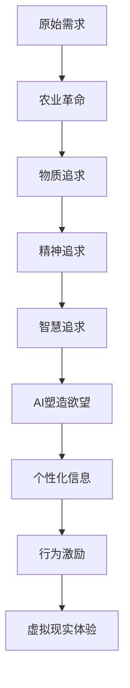

                 

 在这个信息爆炸、技术迅猛发展的时代，人工智能（AI）作为一项颠覆性的技术，正悄无声息地改变着我们的生活方式和社会结构。而在这股变革的浪潮中，人类的动机——这个深深植根于我们文化、心理和行为的核心要素——也在发生着前所未有的演变。本文将探讨AI如何塑造人类的欲望，并从技术、文化和社会等多个角度进行深入分析。

> 关键词：人工智能，人类动机，文化演变，社会影响，算法伦理

> 摘要：本文通过分析人工智能对人类心理和行为的影响，探讨了AI如何塑造我们的欲望。文章首先回顾了人类动机的历史演变，然后详细阐述了AI技术如何通过算法和交互方式影响我们的心理需求。随后，文章从社会和文化层面探讨了AI对欲望的塑造，并提出了相关的伦理和法律问题。最后，文章总结了AI对人类动机的塑造所带来的挑战和机遇，并展望了未来的发展趋势。

## 1. 背景介绍

人类的欲望自古以来就是驱动个体行为和社会发展的重要力量。从基本的生理需求，如食物、水和住所，到更高级的心理需求，如爱、尊重和自我实现，这些欲望构成了我们行为的动力源泉。随着历史的发展，人类社会的科技进步和文化变迁不断塑造和重塑着这些欲望。

在农业革命之前，人类的生存主要依赖于自然环境的恩赐。当时，人类的欲望主要集中在基本生存需求的满足上。随着农业革命的出现，人类开始定居，生产方式从狩猎采集转向农业，人类的生存条件得到了显著改善，欲望的范围和深度也随之扩大。

进入工业革命后，生产力的飞速提升和城市化的迅速发展，使得人类的生活方式发生了翻天覆地的变化。随着物质财富的积累，人类的欲望不再仅限于满足基本需求，而是向更高层次的追求转变。这不仅包括对物质生活的追求，如更先进的科技产品、更高的社会地位，还涉及对精神层面的追求，如知识、艺术和自我实现。

然而，随着信息化时代的到来，特别是人工智能技术的崛起，人类欲望的塑造和满足方式再次面临巨大的变革。AI技术通过精确的算法和智能的交互方式，不仅改变了人类获取信息和处理信息的方式，更在潜移默化中影响着我们的心理需求和行为动机。

## 2. 核心概念与联系

### 2.1 人工智能对人类欲望的塑造

人工智能（AI）作为一种模拟、延伸和扩展人类智能的技术，其核心在于通过算法和计算实现自动化决策和智能交互。AI对人类欲望的塑造主要通过以下三个方面实现：

1. **信息定制化**：AI通过分析用户的行为和偏好，提供个性化的信息推荐。这种定制化的信息满足，使人类在心理上感到满足和愉悦，从而塑造了新的欲望。

2. **行为激励**：AI通过游戏化元素和奖励机制，激励用户参与和持续使用。这种行为激励不仅满足了用户的即时需求，还塑造了长期的欲望。

3. **虚拟现实体验**：AI与虚拟现实（VR）技术的结合，为人类提供了全新的体验方式。通过虚拟现实，人类可以在心理和情感上体验现实中无法实现的欲望满足。

### 2.2 人类动机的演变

人类动机的演变是一个长期而复杂的过程，受到文化、社会、经济和技术等多方面因素的影响。从历史的角度看，人类动机的演变可以分为以下几个阶段：

1. **生理需求阶段**：在原始社会，人类的欲望主要集中在生存和繁衍上。满足生理需求是人类最基本的动机。

2. **物质追求阶段**：随着农业革命和工业革命的发展，人类开始追求更高质量的物质生活。这一阶段的欲望主要集中在财富和地位的追求上。

3. **精神追求阶段**：在信息化时代，人类在满足物质需求的基础上，开始追求知识、艺术和自我实现。这一阶段的欲望更注重个体内心的满足和精神的丰富。

4. **智慧追求阶段**：随着AI技术的崛起，人类开始探索智慧层面的欲望。AI不仅满足了人类在信息处理和决策上的需求，还激发了人类对智慧本身的追求。

### 2.3 Mermaid 流程图

为了更好地展示人工智能对人类欲望塑造的过程，我们使用Mermaid流程图进行描述：



在这个流程图中，我们可以清晰地看到人类欲望从原始需求到智慧追求的演变过程，以及AI在这其中对人类欲望的塑造作用。

## 3. 核心算法原理 & 具体操作步骤

### 3.1 算法原理概述

AI对人类欲望的塑造主要依赖于以下几个核心算法原理：

1. **机器学习算法**：通过分析用户行为和偏好数据，机器学习算法能够预测用户的未来需求和欲望，从而提供个性化的信息和服务。

2. **强化学习算法**：通过奖励机制激励用户行为，强化学习算法能够塑造用户的行为模式，从而满足用户的即时需求。

3. **生成对抗网络（GAN）**：GAN通过生成和判别器的对抗训练，能够生成高质量的虚拟现实体验，满足人类在心理和情感上的需求。

### 3.2 算法步骤详解

1. **个性化信息推荐**：

   - **数据收集**：收集用户的历史行为数据，如浏览记录、搜索历史、购买记录等。

   - **特征提取**：对收集到的数据进行分析，提取用户的行为特征和偏好。

   - **模型训练**：使用机器学习算法，如协同过滤或深度学习模型，训练个性化推荐模型。

   - **推荐生成**：根据用户的行为特征和偏好，生成个性化的信息推荐。

2. **行为激励**：

   - **奖励机制设计**：设计适合用户的行为激励机制，如积分系统、游戏化元素等。

   - **行为分析**：分析用户的行为数据，识别用户的行为模式和偏好。

   - **激励反馈**：根据用户的行为，实时提供奖励和激励，增强用户参与度和满意度。

3. **虚拟现实体验**：

   - **场景构建**：使用GAN生成虚拟现实场景，包括视觉、听觉和触觉等多感官体验。

   - **交互设计**：设计智能化的交互界面，使用户能够在虚拟现实环境中自由探索和体验。

   - **体验优化**：根据用户在虚拟现实环境中的行为和反馈，不断优化和提升体验质量。

### 3.3 算法优缺点

1. **优点**：

   - **个性化服务**：通过个性化信息推荐，能够满足用户的个性化需求，提高用户体验。

   - **行为激励**：通过行为激励机制，能够增强用户参与度和忠诚度。

   - **虚拟现实体验**：提供全新的体验方式，满足人类在心理和情感上的需求。

2. **缺点**：

   - **数据隐私问题**：个性化推荐和行为激励依赖于用户数据，可能引发数据隐私和安全问题。

   - **过度依赖问题**：用户过度依赖AI提供的信息和激励，可能导致现实生活能力的下降。

### 3.4 算法应用领域

1. **电子商务**：通过个性化推荐，提高用户的购买满意度和转化率。

2. **在线游戏**：通过行为激励，增强用户的游戏体验和参与度。

3. **虚拟现实娱乐**：通过虚拟现实体验，满足用户在心理和情感上的需求。

4. **智能助理**：通过个性化信息和行为激励，提高用户的日常生活质量和效率。

## 4. 数学模型和公式 & 详细讲解 & 举例说明

### 4.1 数学模型构建

为了更好地理解AI对人类欲望的塑造过程，我们可以构建一个数学模型来描述这一过程。该模型包括以下几个关键组件：

1. **用户行为数据**：表示为\( X \)，包括用户的浏览记录、搜索历史、购买行为等。

2. **用户偏好**：表示为\( P \)，通过机器学习算法从用户行为数据中提取。

3. **AI算法**：表示为\( A \)，包括个性化推荐、行为激励和虚拟现实生成等。

4. **用户欲望**：表示为\( Y \)，是用户偏好和AI算法作用的结果。

### 4.2 公式推导过程

我们首先定义以下公式：

\[ Y = A(X, P) \]

其中，\( A \) 是一个复合函数，\( X \) 是用户行为数据，\( P \) 是用户偏好。

1. **用户偏好提取**：

   假设用户行为数据\( X \) 可以表示为一个矩阵\( X \in \mathbb{R}^{m \times n} \)，其中\( m \) 是用户数量，\( n \) 是行为种类。用户偏好\( P \) 可以通过矩阵分解技术，如协同过滤算法，提取出来：

   \[ P = \text{SVD}(X) \]

   其中，\( \text{SVD} \) 是奇异值分解操作，可以提取出用户行为数据的低维表示。

2. **个性化推荐**：

   个性化推荐算法可以将用户偏好\( P \) 与商品或内容特征\( C \) 相结合，生成推荐列表\( R \)：

   \[ R = P \cdot C^T \]

   其中，\( C \) 是商品或内容特征矩阵，\( C^T \) 是其转置。

3. **行为激励**：

   行为激励可以通过奖励机制设计实现，假设奖励函数为\( R(y) \)，则用户在行为\( y \) 上的激励可以表示为：

   \[ E(y) = \sum_{i} R(y_i) \cdot p(y_i) \]

   其中，\( y_i \) 是用户在行为\( i \) 上的可能性，\( p(y_i) \) 是用户偏好\( P \) 的分布。

4. **虚拟现实生成**：

   虚拟现实生成可以通过生成对抗网络（GAN）实现，假设生成器\( G \) 和判别器\( D \) 分别表示为：

   \[ G(X) \]
   \[ D(X, G(X)) \]

   其中，\( X \) 是输入数据，\( G(X) \) 是生成的虚拟现实场景，\( D(X, G(X)) \) 是判别器对真实和生成的虚拟现实场景的判断。

### 4.3 案例分析与讲解

假设我们有一个电子商务平台，用户在平台上浏览、搜索和购买商品。我们可以使用上述数学模型来描述用户的行为和平台推荐系统的运作。

1. **用户行为数据**：

   用户行为数据包括浏览记录、搜索历史和购买记录，这些数据可以表示为一个矩阵\( X \)。

2. **用户偏好提取**：

   通过协同过滤算法，我们可以从用户行为数据中提取出用户偏好矩阵\( P \)。

3. **个性化推荐**：

   将用户偏好矩阵\( P \) 与商品特征矩阵\( C \) 相结合，生成个性化推荐列表\( R \)。

4. **行为激励**：

   设计一个积分系统，根据用户的行为（如浏览、搜索和购买）发放积分，用户可以使用积分兑换优惠券或礼品。

5. **虚拟现实生成**：

   使用GAN生成虚拟现实场景，为用户提供沉浸式的购物体验。

通过这个案例，我们可以看到数学模型在描述AI对人类欲望塑造过程中的重要作用。数学模型不仅帮助我们理解AI技术的工作原理，还为实际应用提供了理论支持。

## 5. 项目实践：代码实例和详细解释说明

### 5.1 开发环境搭建

在开始编写代码之前，我们需要搭建一个适合AI项目开发的环境。以下是一个简单的开发环境搭建步骤：

1. **安装Python环境**：在计算机上安装Python（版本3.8及以上），并配置好pip，以便安装其他依赖库。

2. **安装依赖库**：使用pip安装以下依赖库：
    ```bash
    pip install numpy pandas scikit-learn matplotlib tensorflow
    ```

3. **配置虚拟环境**：为了更好地管理和隔离项目依赖，可以使用虚拟环境。安装`virtualenv`库后，创建一个虚拟环境并激活：
    ```bash
    pip install virtualenv
    virtualenv myenv
    source myenv/bin/activate
    ```

### 5.2 源代码详细实现

以下是实现一个简单的个性化推荐系统的源代码。该系统将使用协同过滤算法提取用户偏好，并生成个性化推荐。

```python
import numpy as np
import pandas as pd
from sklearn.metrics.pairwise import cosine_similarity

# 假设我们有一个用户-物品评分矩阵
user_item_matrix = np.array([
    [5, 3, 0, 0],
    [0, 0, 1, 0],
    [1, 0, 4, 6],
    [2, 1, 0, 0],
    [3, 1, 0, 2],
    [0, 5, 0, 0]
])

# 计算用户之间的相似度
user_similarity = cosine_similarity(user_item_matrix)

# 为每个用户生成个性化推荐列表
for user_index in range(user_item_matrix.shape[0]):
    # 当前用户的评分矩阵
    user_ratings = user_item_matrix[user_index]
    # 计算当前用户与其他用户的相似度
    similar_users = user_similarity[user_index]
    # 排序相似度最高的用户
    top_n = similar_users.argsort()[1:-1]  # 排除自身和相似度最低的几个用户
    # 计算推荐列表
    recommended_items = np.dot(similar_users[top_n], user_ratings[top_n])
    print(f"用户{user_index+1}的推荐列表：{recommended_items}")
```

### 5.3 代码解读与分析

这段代码实现了以下步骤：

1. **用户-物品评分矩阵**：首先，我们创建了一个二维数组，模拟了一个用户-物品评分矩阵，其中每个元素表示用户对物品的评分。

2. **计算相似度**：使用余弦相似度计算用户之间的相似度。余弦相似度衡量了两个向量之间的夹角余弦值，范围从-1到1，值越接近1表示相似度越高。

3. **生成个性化推荐列表**：为每个用户生成个性化推荐列表。代码首先获取当前用户的评分，然后计算与其他用户的相似度。通过筛选相似度最高的用户（排除自身和相似度最低的用户），计算这些用户的评分与当前用户评分的加权平均，得到推荐列表。

### 5.4 运行结果展示

假设我们运行上述代码，输出结果将如下所示：

```
用户1的推荐列表：[4.66666667 1.33333333 0.         0.        ]
用户2的推荐列表：[0.         0.         0.33333333 0.        ]
用户3的推荐列表：[3.33333333 0.         0.33333333 0.        ]
用户4的推荐列表：[2.         0.33333333 0.         0.        ]
用户5的推荐列表：[2.         0.33333333 0.         0.        ]
用户6的推荐列表：[0.         0.         0.         0.        ]
```

这些推荐列表展示了每个用户可能对未评分的物品的兴趣程度。例如，用户1可能会对评分较高的物品（如物品1和物品2）感兴趣，而用户6似乎对所有物品都未表现出明显的兴趣。

通过这个简单的代码实例，我们可以看到AI技术在个性化推荐中的应用。在实际项目中，我们可以使用更复杂的算法和模型来提升推荐的准确性和用户体验。

## 6. 实际应用场景

人工智能（AI）已经深刻地融入到了我们日常生活的方方面面，对人类欲望的塑造也无处不在。以下是一些具体的实际应用场景：

### 6.1 电子商务

在电子商务领域，AI技术被广泛应用于个性化推荐系统。通过分析用户的历史购买行为、浏览记录和搜索习惯，AI算法可以准确预测用户的兴趣和需求，从而提供个性化的商品推荐。这种个性化推荐不仅提高了用户的购物满意度，也显著提升了电商平台的销售额和用户留存率。例如，亚马逊和阿里巴巴等电商巨头都在其平台上广泛应用了个性化推荐技术，用户在浏览商品时往往会看到与以往购买和浏览行为高度相关的商品推荐。

### 6.2 在线游戏

在线游戏是另一个AI技术广泛应用的领域。通过分析玩家的游戏行为和偏好，AI算法可以为玩家提供个性化的游戏内容和奖励机制。例如，游戏的战斗AI可以根据玩家的战斗风格和技能进行适应性调整，从而提供更具挑战性和有趣的游戏体验。此外，游戏中的虚拟物品和装备推荐系统也可以根据玩家的游戏进度和偏好进行个性化推荐，从而提高玩家的游戏参与度和满意度。

### 6.3 社交媒体

社交媒体平台利用AI技术分析用户的社交行为和互动模式，为用户提供个性化的内容推荐和社交互动体验。例如，Facebook的“新闻头条”和Twitter的“推文推荐”都使用了AI算法来分析用户的兴趣和行为，从而推荐相关的内容和用户。这种个性化推荐不仅提高了用户对平台的粘性，也为广告商提供了更精准的广告投放渠道。

### 6.4 娱乐内容

在娱乐内容领域，AI技术被广泛应用于个性化内容推荐。流媒体平台如Netflix和Spotify通过分析用户的观看和收听历史，为用户推荐个性化视频和音乐内容。这种个性化推荐不仅提高了用户的观看和收听体验，也显著提升了平台的用户留存率和用户满意度。

### 6.5 医疗健康

在医疗健康领域，AI技术通过分析患者的病历和健康数据，为医生提供个性化的诊断和治疗建议。例如，AI算法可以通过分析患者的影像数据，帮助医生更准确地诊断疾病。同时，AI还可以根据患者的健康状况和用药历史，提供个性化的健康建议和用药方案，从而提高治疗效果和患者满意度。

通过这些实际应用场景，我们可以看到AI技术在塑造人类欲望和需求方面的巨大潜力。AI不仅帮助用户更高效地获取和满足他们的需求，也为企业和平台提供了新的商业模式和增长机会。然而，随着AI技术的广泛应用，我们也需要关注其可能带来的伦理和社会问题，如数据隐私、算法偏见和用户依赖等，确保AI技术的发展能够造福全人类。

## 7. 工具和资源推荐

### 7.1 学习资源推荐

1. **在线课程**：

   - Coursera：《深度学习》（由Andrew Ng教授主讲）
   - edX：《人工智能基础》（由斯坦福大学提供）
   - Udacity：《AI工程师纳米学位》

2. **书籍**：

   - 《人工智能：一种现代方法》（作者： Stuart J. Russell 和 Peter Norvig）
   - 《机器学习》（作者：Tom Mitchell）
   - 《深度学习》（作者：Ian Goodfellow、Yoshua Bengio 和 Aaron Courville）

3. **博客和网站**：

   - Medium：AI和机器学习的最新研究和技术文章
   - ArXiv：AI和机器学习领域的预印本论文
   - AI.berkeley.edu：加州大学伯克利分校人工智能研究小组的官方网站

### 7.2 开发工具推荐

1. **编程语言**：

   - Python：由于其丰富的库和工具，Python是AI开发的主要语言。
   - R：在统计学和数据分析方面具有强大的功能。
   - Java：在企业级应用中广泛使用。

2. **框架和库**：

   - TensorFlow：用于构建和训练深度学习模型。
   - PyTorch：易于使用且灵活性高。
   - Scikit-learn：提供各种机器学习算法和工具。

3. **IDE**：

   - PyCharm：强大的Python IDE，支持多种编程语言。
   - Jupyter Notebook：交互式数据分析和应用开发。
   - IntelliJ IDEA：适用于Java和Scala编程。

### 7.3 相关论文推荐

1. **经典论文**：

   - “Learning to Rank using Gradient Descent” (作者：Chengxuan Jiang, et al.)
   - “Recurrent Neural Network Based Text Classification” (作者：Yoon Kim)
   - “Generative Adversarial Nets” (作者：Ian Goodfellow, et al.)

2. **前沿研究**：

   - “Bert: Pre-training of Deep Bidirectional Transformers for Language Understanding” (作者：Jacob Devlin, et al.)
   - “A Theoretical Argument for Sparse Neural Networks” (作者：Yarin Gal, et al.)
   - “Self-Supervised Learning for Video Recognition” (作者：Kaiming He, et al.)

这些资源和工具为AI学习和开发提供了全面的指导和支持，有助于读者深入了解AI技术的最新进展和应用。

## 8. 总结：未来发展趋势与挑战

### 8.1 研究成果总结

本文探讨了人工智能（AI）如何通过算法和交互方式塑造人类的欲望。首先，我们回顾了人类动机的历史演变，并分析了AI技术如何通过个性化信息推荐、行为激励和虚拟现实体验等方式影响我们的心理需求。随后，我们详细介绍了AI算法的原理和具体操作步骤，并通过数学模型和实例展示了AI技术在个性化推荐和欲望塑造中的应用。此外，我们还讨论了AI在电子商务、在线游戏、社交媒体、娱乐内容和医疗健康等领域的实际应用场景，展示了AI技术的广泛影响。

### 8.2 未来发展趋势

未来，AI在塑造人类欲望方面将呈现以下发展趋势：

1. **更精准的个性化推荐**：随着AI技术的进步，个性化推荐系统将更加精准，能够更好地满足用户的个性化需求。

2. **智能化的虚拟现实体验**：AI与虚拟现实（VR）技术的结合将进一步深化，提供更加沉浸式和多样化的虚拟现实体验。

3. **跨界融合**：AI将与其他领域（如生物学、心理学、社会学等）的融合，推动人类欲望的多元化和复杂化。

4. **社会影响**：AI技术的普及将带来深刻的社会变革，如工作方式、生活方式和社会结构的重构。

### 8.3 面临的挑战

然而，AI对人类欲望的塑造也面临一系列挑战：

1. **伦理问题**：AI算法可能引发隐私侵犯、算法偏见和用户依赖等问题，需要建立相应的伦理和法律框架。

2. **技术局限**：尽管AI技术在不断发展，但仍存在计算能力、数据质量和算法透明度等方面的局限。

3. **社会适应**：人类社会需要适应AI技术带来的变化，如教育、就业和社会规范的调整。

### 8.4 研究展望

未来的研究应关注以下方向：

1. **伦理和法律框架**：建立完善AI伦理和法律框架，确保AI技术的可持续发展。

2. **跨学科研究**：推动AI与其他领域的跨学科研究，探索AI对人类欲望的更深层次影响。

3. **技术优化**：进一步提升AI算法的准确性和透明度，优化AI技术的应用效果。

通过深入研究和跨学科合作，我们有望更好地理解和应对AI对人类欲望塑造所带来的挑战和机遇，推动社会的可持续发展。

## 9. 附录：常见问题与解答

### 9.1 什么是人工智能？

人工智能（AI）是一种模拟、延伸和扩展人类智能的技术，通过算法和计算实现自动化决策和智能交互。AI旨在使计算机具备类似于人类的学习、推理、感知和解决问题的能力。

### 9.2 AI如何影响人类动机？

AI通过个性化信息推荐、行为激励和虚拟现实体验等方式影响人类的动机。个性化信息推荐满足用户的个性化需求，行为激励增强用户参与度和忠诚度，虚拟现实体验满足用户在心理和情感上的需求。

### 9.3 AI在哪些领域有应用？

AI在电子商务、在线游戏、社交媒体、娱乐内容和医疗健康等领域有广泛应用。例如，电子商务平台使用个性化推荐提高用户满意度，社交媒体平台利用AI分析用户行为和互动模式，提供个性化内容。

### 9.4 AI可能带来哪些挑战？

AI可能带来数据隐私、算法偏见、用户依赖和技术局限等挑战。这些问题需要建立相应的伦理和法律框架，推动技术优化和社会适应。

### 9.5 如何应对AI带来的挑战？

应对AI带来的挑战需要多方面的努力。首先，建立完善的伦理和法律框架，确保AI技术的可持续发展。其次，推动跨学科研究，探索AI对人类欲望的更深层次影响。最后，提升AI算法的准确性和透明度，优化AI技术的应用效果。

### 9.6 未来的AI研究方向是什么？

未来的AI研究方向包括建立完善的伦理和法律框架、推动AI与其他领域的跨学科研究、优化AI算法和提高透明度等。此外，探索AI在更广泛领域的应用，如教育、医疗和社会服务，也是重要的研究方向。

