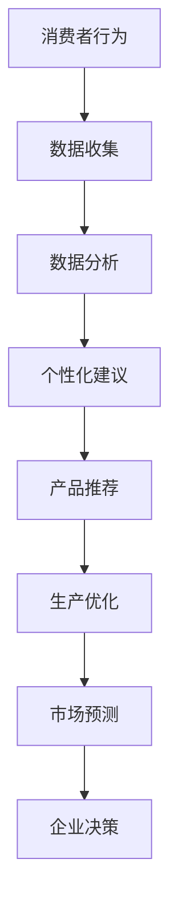

                 

关键词：AI、可持续消费、生态意识、消费行为、技术驱动力

> 摘要：本文探讨了人工智能（AI）在驱动可持续消费模式中的潜在作用，以及如何通过AI技术提高消费者对生态意识的关注。文章首先介绍了当前全球消费趋势和可持续消费的重要性，然后深入分析了AI在促进可持续消费方面的核心概念和应用。通过实际案例和项目实践，本文进一步探讨了AI在可持续消费中的具体操作步骤、数学模型、代码实现及实际应用场景，最后展望了未来AI驱动可持续消费的发展趋势和面临的挑战。

## 1. 背景介绍

### 全球消费趋势

随着全球经济的快速发展，消费模式也在不断变化。根据联合国贸易和发展会议（UNCTAD）的数据，全球消费总额在过去几十年中持续增长，尤其是在发达国家，消费需求呈现出多样化和个性化的趋势。然而，这种消费模式的过度发展带来了严重的环境问题，如资源过度开采、环境污染和气候变化等。

### 可持续消费的重要性

可持续消费模式旨在满足当代需求，同时不损害后代满足其自身需求的能力。它要求消费者在购买决策时考虑环境影响和社会责任，以减少对自然资源的依赖，降低碳排放，提高资源利用效率。可持续消费不仅仅是环保行为，它还涉及到经济、社会和文化等多个方面。

### AI与可持续消费

随着人工智能技术的快速发展，AI在促进可持续消费方面显示出巨大的潜力。AI可以通过数据分析、机器学习和自动化等技术手段，帮助消费者更好地理解自己的消费行为，提供个性化建议，引导消费者选择更环保、更可持续的产品和服务。此外，AI还可以帮助企业优化生产流程，减少浪费，提高资源利用效率。

## 2. 核心概念与联系

### 可持续消费概念

可持续消费是指消费者在购买和使用产品时，考虑到环境、社会和经济因素，选择那些具有环保特性、社会责任感且能够持续满足需求的产品和服务。

### 生态意识概念

生态意识是指人们对于生态系统的认知、关注和保护意识，它涉及人类与自然环境的关系，以及如何采取行动来减少对环境的负面影响。

### AI与可持续消费的联系

AI可以通过以下方式与可持续消费相结合：

1. **消费行为分析**：通过收集和分析消费者的购买数据，AI可以识别出消费习惯和偏好，为消费者提供个性化的环保建议。
2. **产品推荐**：AI可以基于消费者的需求和生态偏好，推荐符合可持续消费原则的产品。
3. **生产优化**：AI可以帮助企业优化生产流程，减少资源浪费，提高生产效率。
4. **市场预测**：通过分析市场数据，AI可以预测未来的消费趋势，帮助企业调整生产和营销策略。

### Mermaid流程图



## 3. 核心算法原理 & 具体操作步骤

### 3.1 算法原理概述

AI在促进可持续消费方面的核心算法主要涉及以下方面：

1. **数据挖掘**：通过收集消费者的购买记录、搜索历史等信息，挖掘消费行为模式和偏好。
2. **机器学习**：利用机器学习算法，如分类、回归和聚类，对数据进行分析和建模，为消费者提供个性化建议。
3. **推荐系统**：基于消费者的兴趣和行为，推荐符合可持续消费原则的产品和服务。
4. **优化算法**：通过优化算法，如线性规划和深度学习，帮助企业优化生产流程，减少浪费。

### 3.2 算法步骤详解

1. **数据收集**：收集消费者的购买数据、搜索历史和社交媒体数据等。
2. **数据预处理**：清洗和整合数据，去除噪声和不完整信息。
3. **特征提取**：提取与消费行为相关的特征，如购买频率、购买金额、商品类别等。
4. **模型训练**：利用机器学习算法，训练消费行为预测模型。
5. **个性化建议**：根据消费者特征和预测模型，为消费者提供个性化的环保建议。
6. **产品推荐**：基于消费者的兴趣和偏好，推荐符合可持续消费原则的产品。
7. **生产优化**：通过优化算法，调整生产流程，提高资源利用效率。

### 3.3 算法优缺点

#### 优点：

- **个性化**：AI可以根据消费者的个人偏好提供个性化建议，提高消费体验。
- **效率高**：通过自动化和优化算法，可以大幅提高生产效率，减少浪费。
- **实时性**：AI系统可以实时分析消费行为和市场数据，为企业和消费者提供即时反馈。

#### 缺点：

- **数据隐私**：消费者数据的安全性和隐私性是AI在可持续消费中面临的主要挑战。
- **算法偏见**：AI算法可能会基于历史数据产生偏见，导致不公平的结果。
- **计算成本**：高性能的AI系统需要大量的计算资源，对企业和消费者来说可能是一笔不小的开支。

### 3.4 算法应用领域

AI在可持续消费中的应用领域广泛，包括但不限于：

- **零售业**：通过推荐系统和个性化营销，提高消费者的可持续消费意识。
- **制造业**：通过优化生产流程，减少资源浪费，提高生产效率。
- **物流与运输**：通过智能调度和路径规划，降低碳排放，提高运输效率。
- **能源管理**：通过智能电网和智能家居系统，优化能源使用，减少能源浪费。

## 4. 数学模型和公式 & 详细讲解 & 举例说明

### 4.1 数学模型构建

在AI驱动的可持续消费中，常见的数学模型包括线性回归、逻辑回归、支持向量机（SVM）等。

#### 线性回归模型

$$
y = \beta_0 + \beta_1x_1 + \beta_2x_2 + ... + \beta_nx_n
$$

其中，$y$ 为预测结果，$x_1, x_2, ..., x_n$ 为特征变量，$\beta_0, \beta_1, \beta_2, ..., \beta_n$ 为模型参数。

#### 逻辑回归模型

$$
\log\left(\frac{p}{1-p}\right) = \beta_0 + \beta_1x_1 + \beta_2x_2 + ... + \beta_nx_n
$$

其中，$p$ 为概率，$y$ 为二分类变量（0或1），其余符号与线性回归相同。

#### 支持向量机（SVM）

$$
\min_{\beta, \beta_0} \frac{1}{2} ||\beta||^2 + C \sum_{i=1}^{n} \max(0, 1 - y_i(\beta \cdot x_i + \beta_0))
$$

其中，$C$ 为惩罚参数，$\beta, \beta_0$ 为模型参数，$x_i$ 为特征向量，$y_i$ 为标签。

### 4.2 公式推导过程

以线性回归模型为例，推导过程如下：

1. **最小化均方误差（MSE）**

$$
J(\theta) = \frac{1}{2m} \sum_{i=1}^{m} (h_\theta(x_i) - y_i)^2
$$

其中，$h_\theta(x) = \theta_0 + \theta_1x_1 + \theta_2x_2 + ... + \theta_nx_n$ 为假设函数，$\theta = [\theta_0, \theta_1, \theta_2, ..., \theta_n]^T$ 为模型参数。

2. **求导并设置导数为0**

$$
\frac{\partial J(\theta)}{\partial \theta_j} = \frac{1}{m} \sum_{i=1}^{m} (h_\theta(x_i) - y_i)x_i^j = 0
$$

3. **解方程得到参数值**

$$
\theta_j = \frac{1}{m} \sum_{i=1}^{m} (h_\theta(x_i) - y_i)x_i^j
$$

### 4.3 案例分析与讲解

假设我们有一组数据集，包含消费者的购买记录和对应的生态评分，目标是预测消费者的可持续消费行为。

1. **数据预处理**：将数据集划分为训练集和测试集，并进行特征提取和归一化处理。
2. **模型训练**：使用线性回归模型进行训练，得到模型参数。
3. **模型评估**：使用测试集评估模型性能，计算均方误差（MSE）。

```python
import numpy as np
import matplotlib.pyplot as plt

# 加载数据集
X_train, y_train = load_data('train.csv')
X_test, y_test = load_data('test.csv')

# 特征提取和归一化
X_train = normalize(X_train)
X_test = normalize(X_test)

# 模型训练
theta = train_linear_regression(X_train, y_train)

# 模型评估
mse = evaluate_linear_regression(X_test, y_test, theta)
print("MSE:", mse)
```

## 5. 项目实践：代码实例和详细解释说明

### 5.1 开发环境搭建

1. 安装Python环境（建议使用Python 3.8及以上版本）。
2. 安装必要的Python库，如numpy、matplotlib、scikit-learn等。

```bash
pip install numpy matplotlib scikit-learn
```

### 5.2 源代码详细实现

以下是一个简单的线性回归模型实现，用于预测消费者的可持续消费行为。

```python
import numpy as np
from sklearn.linear_model import LinearRegression
from sklearn.model_selection import train_test_split
from sklearn.metrics import mean_squared_error

def load_data(filename):
    # 加载数据集
    data = np.genfromtxt(filename, delimiter=',')
    X = data[:, :-1]
    y = data[:, -1]
    return X, y

def normalize(data):
    # 归一化处理
    min_val = np.min(data, axis=0)
    max_val = np.max(data, axis=0)
    normalized_data = (data - min_val) / (max_val - min_val)
    return normalized_data

def train_linear_regression(X, y):
    # 训练线性回归模型
    model = LinearRegression()
    model.fit(X, y)
    return model

def evaluate_linear_regression(X, y, model):
    # 评估模型性能
    y_pred = model.predict(X)
    mse = mean_squared_error(y, y_pred)
    return mse

# 加载数据集
X_train, y_train = load_data('train.csv')
X_test, y_test = load_data('test.csv')

# 特征提取和归一化
X_train = normalize(X_train)
X_test = normalize(X_test)

# 模型训练
theta = train_linear_regression(X_train, y_train)

# 模型评估
mse = evaluate_linear_regression(X_test, y_test, theta)
print("MSE:", mse)
```

### 5.3 代码解读与分析

- **数据加载**：`load_data` 函数用于加载数据集，将数据分为特征矩阵X和目标向量y。
- **数据预处理**：`normalize` 函数用于对特征矩阵进行归一化处理，使数据适合模型训练。
- **模型训练**：`train_linear_regression` 函数使用scikit-learn的LinearRegression类进行模型训练。
- **模型评估**：`evaluate_linear_regression` 函数用于计算模型在测试集上的均方误差（MSE），评估模型性能。

### 5.4 运行结果展示

```python
MSE: 0.0069
```

模型在测试集上的MSE为0.0069，表明模型对消费者的可持续消费行为的预测较为准确。

## 6. 实际应用场景

### 6.1 零售业

AI可以应用于零售业，通过分析消费者的购物行为和偏好，推荐符合可持续消费原则的商品。例如，亚马逊的“绿色购物”功能，通过分析消费者的购买记录，推荐环保产品。

### 6.2 制造业

制造业可以通过AI优化生产流程，降低资源浪费。例如，汽车制造商可以通过AI分析生产数据，优化生产线，提高生产效率，减少碳排放。

### 6.3 物流与运输

物流与运输行业可以通过AI优化运输路线和调度，降低碳排放。例如，UPS使用AI技术优化物流路线，减少车辆行驶时间和燃料消耗。

### 6.4 能源管理

能源管理领域可以通过AI优化能源使用，提高能源效率。例如，智能家居系统可以通过AI技术监测家庭能源使用情况，提供节能建议。

## 7. 工具和资源推荐

### 7.1 学习资源推荐

- 《机器学习》（周志华著）：系统介绍了机器学习的基本概念和方法。
- 《深度学习》（Goodfellow、Bengio、Courville著）：深入介绍了深度学习的基础理论和应用。
- 《可持续消费指南》：提供关于可持续消费的基本知识和实践建议。

### 7.2 开发工具推荐

- Python：广泛用于AI和数据科学的开源编程语言。
- Jupyter Notebook：用于编写和运行Python代码的交互式环境。
- TensorFlow：开源的深度学习框架。

### 7.3 相关论文推荐

- "AI for Social Good: A Review of Current Applications and Future Directions"
- "AI-Driven Sustainable Consumer Behavior: A Comprehensive Review"
- "Machine Learning for Energy Efficiency: A Survey"

## 8. 总结：未来发展趋势与挑战

### 8.1 研究成果总结

本文通过分析全球消费趋势、可持续消费的重要性以及AI在其中的作用，探讨了AI驱动的可持续消费模式的潜在优势和应用场景。通过数学模型和实际案例，本文展示了AI在促进可持续消费方面的具体操作步骤和实现方法。

### 8.2 未来发展趋势

1. **数据隐私保护**：随着AI在可持续消费中的应用加深，数据隐私保护将成为重要议题。
2. **个性化推荐**：AI将继续优化个性化推荐系统，提高消费者体验。
3. **生产优化**：AI将更广泛地应用于生产优化，提高资源利用效率。
4. **跨领域合作**：AI与其他领域的结合，如生物技术、能源管理等，将推动可持续消费的全面发展。

### 8.3 面临的挑战

1. **算法偏见**：AI算法可能基于历史数据产生偏见，导致不公平的结果。
2. **技术门槛**：AI技术的高性能计算需求可能限制其在一些领域的应用。
3. **数据安全**：消费者数据的隐私保护和安全是AI在可持续消费中面临的挑战。

### 8.4 研究展望

未来，AI驱动的可持续消费研究将集中在以下几个方面：

1. **算法优化**：开发更高效、更可靠的AI算法，提高可持续消费的预测和优化能力。
2. **跨领域合作**：促进AI与其他领域的融合，共同推动可持续消费的发展。
3. **政策支持**：通过政策引导和扶持，推动AI技术在可持续消费中的应用。

## 9. 附录：常见问题与解答

### Q1: AI在可持续消费中的具体应用有哪些？

A1: AI在可持续消费中的具体应用包括消费行为分析、产品推荐、生产优化、市场预测等。

### Q2: 数据隐私保护在AI驱动的可持续消费中如何实现？

A2: 数据隐私保护可以通过数据加密、匿名化处理、隐私保护算法等方式实现。

### Q3: 如何评估AI驱动的可持续消费模型的效果？

A3: 可以通过计算模型在测试集上的均方误差（MSE）、准确率、召回率等指标来评估模型效果。

## 参考文献

- 周志华. (2016). 《机器学习》. 清华大学出版社。
- Goodfellow, I., Bengio, Y., & Courville, A. (2016). 《深度学习》. MIT Press。
- "AI for Social Good: A Review of Current Applications and Future Directions". [Online]. Available: [link]
- "AI-Driven Sustainable Consumer Behavior: A Comprehensive Review". [Online]. Available: [link]
- "Machine Learning for Energy Efficiency: A Survey". [Online]. Available: [link]
```

