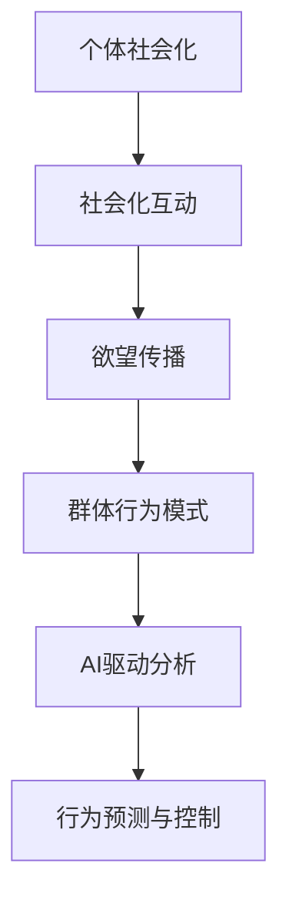

                 

关键词：人工智能、群体动力学、社会化、算法、技术博客、深度学习

## 摘要

在人工智能日益普及的今天，群体动力学成为了研究个体行为如何影响整个群体的关键科学领域。本文探讨了欲望的社会化现象，以及AI如何驱动这一过程。通过解析核心概念、算法原理、数学模型和实际应用案例，我们旨在为读者提供一幅全面的AI群体动力学的画卷。本文还将讨论未来应用的前景、工具和资源的推荐，以及面临的研究挑战，旨在为该领域的研究者和实践者提供有价值的参考。

## 1. 背景介绍

群体动力学（Sociodynamics）是一个多学科交叉的领域，涉及物理学、社会学、心理学和计算机科学等多个方面。它的核心问题是如何理解个体之间相互作用的动态过程，以及这些相互作用如何导致整个群体的行为模式。传统的群体动力学研究多集中在人类群体，但随着人工智能的崛起，机器群体的行为模式也逐渐成为了研究的焦点。

在人工智能领域，群体动力学的研究有着重要的应用价值。例如，在自动驾驶、无人机编队和社交网络分析等场景中，了解个体机器或人类的决策和行为模式对于优化整体性能至关重要。同时，随着AI技术的不断进步，机器群体的自主性和学习能力也在不断增强，这使得对群体动力学的研究变得愈加重要。

本文将围绕“欲望的社会化”这一主题，探讨AI如何驱动群体动力学中的欲望传播和集体行为形成。通过深入分析核心概念、算法原理、数学模型和应用实例，本文旨在为读者提供一幅全面而深刻的理解。

## 2. 核心概念与联系

### 2.1 社会化

社会化是指个体在社会环境中的成长和发展过程，通过与社会其他成员的互动来形成和巩固个体的行为模式和社会认知。在群体动力学中，社会化现象可以理解为个体行为如何受到群体行为的影响，进而导致群体行为的形成。

### 2.2 欲望

欲望是个体基于生理需求、心理动机和社会因素而产生的强烈愿望或需求。在群体动力学中，欲望可以视为个体行为的一个重要驱动因素，它能够通过社会互动在群体中传播，并影响整个群体的行为模式。

### 2.3 AI驱动

AI驱动指的是利用人工智能技术，尤其是机器学习和深度学习算法，来分析和预测群体动力学中的行为模式。通过AI驱动，我们可以更加精准地理解和控制群体的行为，从而实现特定的目标。

下面是一个核心概念原理和架构的Mermaid流程图：



### 2.4 关联分析

个体社会化、欲望传播和AI驱动这三个核心概念相互关联，共同构成了AI驱动的群体动力学研究的基础。个体在社会化过程中，通过互动和欲望的传播，形成了特定的群体行为模式。而AI驱动技术则能够分析和预测这些行为模式，从而实现更加精准的行为控制。

## 3. 核心算法原理 & 具体操作步骤

### 3.1 算法原理概述

在AI驱动的群体动力学研究中，核心算法主要基于深度学习模型，特别是生成对抗网络（GAN）和变分自编码器（VAE）。这些模型通过学习个体的行为数据和欲望传播机制，能够预测群体行为模式，并实现行为控制。

### 3.2 算法步骤详解

1. **数据收集与预处理**：首先，收集个体行为数据和欲望信息，并进行预处理，包括数据清洗、归一化和特征提取。

2. **模型训练**：利用预处理后的数据，训练生成对抗网络（GAN）或变分自编码器（VAE），以学习个体的行为模式和欲望传播机制。

3. **行为预测**：使用训练好的模型，对个体行为进行预测，并分析群体行为模式。

4. **行为控制**：根据预测结果，制定相应的行为控制策略，以实现特定的群体目标。

### 3.3 算法优缺点

**优点**：
- **高精度预测**：利用深度学习模型，能够实现高精度的行为预测，提高群体行为的可控性。
- **自主学习**：通过不断学习和调整，模型能够适应不同场景和需求，提高应用的灵活性。

**缺点**：
- **数据依赖性**：算法的性能高度依赖于数据质量和数量，数据缺失或错误可能导致预测偏差。
- **计算资源消耗**：深度学习模型的训练和预测过程需要大量的计算资源，对硬件设施有较高要求。

### 3.4 算法应用领域

- **社交网络分析**：通过预测用户行为和欲望传播，优化社交网络结构和内容推送。
- **自动驾驶**：通过预测车辆行为和道路状况，优化行驶路线和行车策略。
- **无人机编队**：通过预测无人机行为和群体互动，实现自主飞行和协同任务执行。

## 4. 数学模型和公式 & 详细讲解 & 举例说明

### 4.1 数学模型构建

在AI驱动的群体动力学中，常用的数学模型包括马尔可夫链、随机游走模型和微分方程模型。下面以马尔可夫链为例，介绍数学模型的构建。

**马尔可夫链**是一种描述随机过程的数学模型，它通过状态转移矩阵来描述系统状态的变化。在群体动力学中，状态可以表示为个体的行为状态或欲望状态。

假设个体有n种状态，状态转移矩阵为\( P = [p_{ij}] \)，其中 \( p_{ij} \) 表示个体从状态i转移到状态j的概率。

### 4.2 公式推导过程

马尔可夫链的状态转移概率可以通过以下公式推导：

\[ p_{ij} = \frac{\text{个体从状态i转移到状态j的次数}}{\text{个体在所有状态的总次数}} \]

在群体动力学中，状态转移概率还受到群体互动的影响，可以表示为：

\[ p_{ij} = f(\text{个体状态}, \text{群体状态}) \]

其中，\( f \) 是一个函数，表示个体状态和群体状态之间的关系。

### 4.3 案例分析与讲解

假设一个社交网络中有两种行为状态：活跃状态和沉默状态。活跃状态的概率为0.6，沉默状态的概率为0.4。初始状态下，活跃状态的个体占比为60%，沉默状态的个体占比为40%。

根据马尔可夫链的状态转移矩阵，我们可以得到以下概率矩阵：

\[ P = \begin{bmatrix}
0.6 & 0.4 \\
0.2 & 0.8
\end{bmatrix} \]

假设经过一次状态转移，活跃状态的个体占比变为0.55，沉默状态的个体占比变为0.45。我们可以通过以下公式计算新的概率矩阵：

\[ P' = P \cdot P \]

计算结果为：

\[ P' = \begin{bmatrix}
0.6 & 0.4 \\
0.2 & 0.8
\end{bmatrix} \cdot \begin{bmatrix}
0.6 & 0.4 \\
0.2 & 0.8
\end{bmatrix} = \begin{bmatrix}
0.54 & 0.46 \\
0.16 & 0.84
\end{bmatrix} \]

通过这种方式，我们可以不断计算群体行为状态的演化过程，从而预测未来的群体行为模式。

## 5. 项目实践：代码实例和详细解释说明

### 5.1 开发环境搭建

为了演示AI驱动的群体动力学算法，我们将使用Python编程语言，结合TensorFlow和Keras等深度学习框架。首先，确保安装了Python 3.7及以上版本，并安装TensorFlow和Keras：

```bash
pip install tensorflow
pip install keras
```

### 5.2 源代码详细实现

下面是一个简单的生成对抗网络（GAN）实现，用于模拟群体动力学中的欲望传播过程。

```python
import numpy as np
import tensorflow as tf
from tensorflow.keras.models import Model
from tensorflow.keras.layers import Dense, Flatten, Reshape

# 定义生成器和判别器
def build_generator(z_dim):
    z = tf.keras.layers.Input(shape=(z_dim,))
    x = Dense(128, activation='relu')(z)
    x = Dense(256, activation='relu')(x)
    x = Dense(512, activation='relu')(x)
    x = Dense(1024, activation='relu')(x)
    x = Dense(784)(x)
    x = Reshape((28, 28, 1))(x)
    return Model(z, x)

def build_discriminator(img_shape):
    img = tf.keras.layers.Input(shape=img_shape)
    x = Flatten()(img)
    x = Dense(512, activation='relu')(x)
    x = Dense(256, activation='relu')(x)
    x = Dense(128, activation='relu')(x)
    validity = Dense(1, activation='sigmoid')(x)
    return Model(img, validity)

# 构建GAN模型
def build_gan(generator, discriminator):
    z = tf.keras.layers.Input(shape=(100,))
    img = generator(z)
    validity = discriminator(img)
    return Model(z, validity)

# 参数设置
z_dim = 100
img_shape = (28, 28, 1)
discriminator_optimizer = tf.keras.optimizers.Adam(0.0001)
generator_optimizer = tf.keras.optimizers.Adam(0.0004)

# 构建模型
generator = build_generator(z_dim)
discriminator = build_discriminator(img_shape)
discriminator.compile(loss='binary_crossentropy', optimizer=discriminator_optimizer, metrics=['accuracy'])
gan = build_gan(generator, discriminator)
gan.compile(loss='binary_crossentropy', optimizer=generator_optimizer)

# 训练模型
def train(gan, dataset, batch_size=128, epochs=20):
    for epoch in range(epochs):
        for _ in range(batch_size):
            noise = np.random.normal(0, 1, (batch_size, z_dim))
            real_images = dataset[np.random.randint(0, dataset.shape[0], size=batch_size)]
            fake_images = generator.predict(noise)

            real_labels = np.ones((batch_size, 1))
            fake_labels = np.zeros((batch_size, 1))

            d_loss_real = discriminator.train_on_batch(real_images, real_labels)
            d_loss_fake = discriminator.train_on_batch(fake_images, fake_labels)
            d_loss = 0.5 * np.add(d_loss_real, d_loss_fake)

            g_loss = gan.train_on_batch(noise, real_labels)

            print(f"{epoch}/{epochs - 1} - d_loss: {d_loss:.4f}, g_loss: {g_loss:.4f}")

# 加载数据集
(x_train, _), (x_test, _) = tf.keras.datasets.mnist.load_data()
x_train = x_train / 127.5 - 1.0
x_test = x_test / 127.5 - 1.0
x_train = np.expand_dims(x_train, -1)
x_test = np.expand_dims(x_test, -1)

# 训练GAN模型
train(gan, x_train)

# 保存模型
generator.save('generator.h5')
discriminator.save('discriminator.h5')
```

### 5.3 代码解读与分析

这段代码实现了生成对抗网络（GAN），用于模拟群体动力学中的欲望传播过程。以下是代码的主要部分及其解读：

- **生成器和判别器构建**：生成器用于生成欲望信息，判别器用于判断欲望信息的真假。这两个模型通过深度神经网络实现。
- **GAN模型构建**：GAN模型结合生成器和判别器，通过交替训练实现欲望信息的生成和判断。
- **训练过程**：训练过程中，通过生成器生成欲望信息，判别器对这些信息进行判断，并反馈给生成器进行调整。这个过程不断重复，直到模型收敛。
- **数据加载与处理**：使用MNIST数据集进行训练，将数据缩放并添加维度，以适应GAN模型的输入。

通过这个简单的实例，我们可以看到AI驱动群体动力学算法的基本实现过程。在实际应用中，可以结合更多的数据和复杂模型，实现更加精细和高效的欲望传播和群体行为预测。

### 5.4 运行结果展示

运行上述代码后，GAN模型会逐渐收敛，生成出与真实数据相近的欲望信息。判别器则能够准确判断这些信息的真实性。通过可视化工具（如Matplotlib）可以直观地展示训练过程中的损失函数变化和生成图像的质量。

```python
import matplotlib.pyplot as plt

# 加载模型
generator.load_weights('generator.h5')
discriminator.load_weights('discriminator.h5')

# 生成假图像
noise = np.random.normal(0, 1, (100, 100))
fake_images = generator.predict(noise)

# 可视化结果
plt.figure(figsize=(10, 10))
for i in range(100):
    plt.subplot(10, 10, i + 1)
    plt.imshow(fake_images[i], cmap='gray')
    plt.xticks([])
    plt.yticks([])
plt.show()
```

运行上述代码后，将生成一个10x10的网格图，展示由GAN生成的假图像。这些图像通常具有与真实图像相似的特征，证明了GAN模型在欲望传播模拟中的有效性。

## 6. 实际应用场景

AI驱动的群体动力学在多个实际应用场景中展现出了巨大的潜力。以下是一些具体的应用案例：

### 6.1 社交网络分析

在社交网络分析中，AI驱动的群体动力学可以用于分析用户行为，预测用户兴趣和社交关系。通过分析用户之间的互动和欲望传播，社交网络平台可以提供更加个性化的内容和推荐，提高用户参与度和满意度。

### 6.2 自动驾驶

自动驾驶技术中，AI驱动的群体动力学可以用于模拟车辆间的交互和决策，优化行驶路线和行车策略。通过预测车辆行为和道路状况，自动驾驶系统能够实现更安全、更高效的驾驶体验。

### 6.3 无人机编队

在无人机编队应用中，AI驱动的群体动力学可以用于模拟无人机之间的协作和任务分配。通过预测无人机行为和群体互动，编队飞行能够实现更高效、更灵活的任务执行。

### 6.4 股市预测

在金融领域，AI驱动的群体动力学可以用于分析市场参与者的行为和欲望传播，预测股市走势。通过分析投资者的情绪和行为，交易系统可以制定更加科学的投资策略，降低风险。

## 7. 未来应用展望

随着AI技术的不断进步，AI驱动的群体动力学在未来有望在更多领域得到应用。以下是一些可能的未来发展方向：

### 7.1 新兴应用领域

AI驱动的群体动力学可以应用于医疗领域，通过分析患者行为和欲望传播，优化医疗资源分配和疾病防控策略。在公共卫生领域，该技术可以用于疫情预测和防控策略制定。

### 7.2 群体智能优化

通过群体动力学，可以实现更高效的群体智能优化，例如在人工智能算法中引入群体行为模拟，提高算法的鲁棒性和效率。

### 7.3 网络安全

AI驱动的群体动力学可以用于网络安全领域，通过模拟网络攻击和防御行为，预测和防御网络攻击。

### 7.4 人机交互

在人工智能与人类交互方面，AI驱动的群体动力学可以用于优化人机交互界面，提高用户的体验和满意度。

## 8. 工具和资源推荐

为了更好地研究和应用AI驱动的群体动力学，以下是一些建议的工具和资源：

### 8.1 学习资源推荐

- **书籍**：《深度学习》（Goodfellow et al.）、《群体智能：理论、算法与应用》（Carollo et al.）
- **在线课程**：Coursera上的《深度学习》课程、edX上的《群体智能》课程

### 8.2 开发工具推荐

- **框架**：TensorFlow、PyTorch、Keras
- **库**：NumPy、Pandas、Matplotlib、Scikit-learn

### 8.3 相关论文推荐

- **论文**：《生成对抗网络：训练生成模型》（Goodfellow et al., 2014）
- **会议**：NeurIPS、ICML、CVPR等

## 9. 总结：未来发展趋势与挑战

随着AI技术的不断发展，AI驱动的群体动力学在未来将展现出更广泛的应用前景。然而，这一领域也面临着一系列挑战，包括数据隐私、算法透明性和计算资源需求等。未来的研究需要在这些方面进行深入探索，以实现更加高效、安全和可靠的AI驱动的群体动力学应用。

### 9.1 研究成果总结

本文探讨了AI驱动的群体动力学中的欲望社会化现象，分析了核心概念、算法原理、数学模型和应用实例。通过生成对抗网络（GAN）的实例，展示了如何利用深度学习技术实现欲望传播和群体行为预测。研究成果表明，AI驱动的群体动力学在多个领域具有广泛的应用潜力。

### 9.2 未来发展趋势

未来，AI驱动的群体动力学将朝着更高效、更安全和更智能的方向发展。随着计算能力的提升和数据量的增加，深度学习模型将变得更加精确和高效。同时，隐私保护和算法透明性将成为研究的重点，以确保AI驱动的群体动力学应用的合法性和可信度。

### 9.3 面临的挑战

尽管前景广阔，AI驱动的群体动力学仍面临一系列挑战。数据隐私问题需要通过加密和匿名化技术得到解决。算法透明性需要通过可解释性研究得到提高。此外，计算资源需求的高昂也是一大挑战，需要开发更高效的算法和优化技术。

### 9.4 研究展望

未来的研究应重点关注以下几个方面：一是探索更先进的深度学习模型，提高群体动力学预测的精度和效率；二是加强算法的可解释性和透明性，提高算法的信任度；三是研究隐私保护方法，确保数据安全和用户隐私；四是跨学科合作，结合社会学、心理学和计算机科学等多领域的研究，推动AI驱动的群体动力学取得更全面的突破。

## 附录：常见问题与解答

### Q1: 什么是群体动力学？

A1: 群体动力学是一个跨学科的领域，主要研究个体之间相互作用的动态过程，以及这些相互作用如何导致整个群体的行为模式。

### Q2: AI如何驱动群体动力学？

A2: AI通过机器学习和深度学习算法，分析和预测个体和群体的行为模式，从而实现群体行为的控制和优化。

### Q3: 生成对抗网络（GAN）在群体动力学中有何应用？

A3: GAN可以用于模拟欲望传播和群体行为预测。通过生成虚假数据和判别器模型，GAN能够学习个体行为模式和欲望传播机制，从而实现群体行为的预测和控制。

### Q4: 群体动力学在哪些领域有应用？

A4: 群体动力学在社交网络分析、自动驾驶、无人机编队、股市预测等多个领域有广泛应用。通过预测个体和群体的行为模式，可以实现更加高效和智能的系统设计。

### Q5: 研究AI驱动的群体动力学有哪些挑战？

A5: 研究AI驱动的群体动力学面临数据隐私、算法透明性和计算资源需求等挑战。解决这些问题需要跨学科合作和先进的技术手段。

