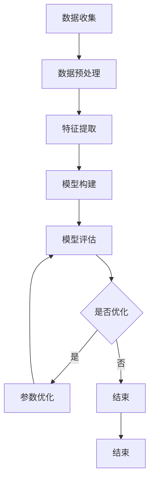
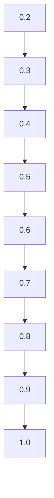

                 

关键词：人工智能、群体动力学、社会化、欲望、群体行为、智能算法

摘要：本文探讨了人工智能技术在群体动力学研究中的应用，特别是在欲望社会化方面的表现。通过分析AI驱动的群体动力学模型，我们揭示了个体欲望如何在群体中传播和演化，以及这些现象对人类社会的深远影响。本文旨在为读者提供一个全面理解欲望社会化过程及其潜在应用的技术视角。

## 1. 背景介绍

随着人工智能技术的飞速发展，越来越多的研究开始关注人工智能在理解人类社会行为中的潜力。群体动力学作为研究个体行为与群体行为相互作用的重要领域，近年来得到了广泛关注。而在群体动力学中，欲望作为一种强大的社会力量，影响着个体的选择和决策，进而塑造着群体的行为模式。

欲望社会化是指个体欲望在社会群体中的传播和演变过程。这一现象不仅体现在日常生活中的消费行为，还涉及政治、文化等多个层面。例如，广告和媒体常常利用欲望社会化原理来影响公众的观点和态度。因此，理解欲望社会化的机制对于设计更有效的社会政策、改善心理健康以及优化商业策略具有重要意义。

本文将重点关注AI在研究欲望社会化过程中的作用，特别是如何利用机器学习和数据挖掘技术来揭示群体动力学中的欲望传播规律。通过对相关算法和模型的详细探讨，我们将深入分析个体欲望在社会群体中的传播和演化机制。

## 2. 核心概念与联系

### 2.1 欲望与社会化

欲望（Desire）是指个体内心深处渴望得到满足的心理状态。在社会学中，欲望通常被视为驱动个体行为的重要因素。而社会化（Socialization）则是指个体通过与他人互动和社会环境的影响，逐渐形成和调整其行为、态度和价值观的过程。

欲望社会化涉及到以下关键概念：

- **欲望感知**：个体如何识别和感知自身的欲望。
- **欲望表达**：个体如何通过行为、语言和表情来表达自己的欲望。
- **欲望传播**：个体欲望如何在群体中传递和扩散。
- **欲望适应**：个体如何调整自己的欲望以适应社会环境和群体期望。

### 2.2 群体动力学

群体动力学（Group Dynamics）是研究群体内部成员之间相互作用及其影响的研究领域。它关注群体如何形成、如何维持以及如何变化。群体动力学的研究涉及到以下几个方面：

- **群体结构**：群体的组织形式和成员之间的关系。
- **群体行为**：群体成员共同表现出来的行为特征。
- **群体思维**：群体成员共同持有的信念和价值观。
- **群体决策**：群体成员如何做出决策以及决策过程的影响因素。

### 2.3 AI驱动的群体动力学模型

在群体动力学研究中，人工智能技术为分析群体行为提供了强大的工具。AI驱动的群体动力学模型通常包括以下几个核心组成部分：

- **数据收集与预处理**：通过传感器、社交媒体、问卷调查等方式收集群体行为数据，并进行数据清洗和预处理。
- **特征提取**：从原始数据中提取能够反映群体动力学特征的变量。
- **模型构建**：利用机器学习算法构建群体动力学模型，模拟群体行为的演化。
- **模型评估与优化**：通过交叉验证、网格搜索等技术评估模型性能，并进行参数优化。

### 2.4 Mermaid 流程图

以下是一个简化的AI驱动的群体动力学模型的Mermaid流程图：



这个流程图展示了从数据收集到模型评估和优化的整个过程，帮助读者理解AI驱动的群体动力学研究的基本步骤。

## 3. 核心算法原理 & 具体操作步骤

### 3.1 算法原理概述

AI驱动的群体动力学研究通常依赖于以下核心算法：

- **社交网络分析（Social Network Analysis, SNA）**：用于分析群体成员之间的互动关系，提取社交网络结构特征。
- **机器学习（Machine Learning）**：用于构建群体行为预测模型，包括分类、聚类、回归等。
- **深度学习（Deep Learning）**：用于处理大规模复杂数据，提取高层次特征。

这些算法共同作用，形成了一个强大的分析框架，用于研究个体欲望在社会群体中的传播和演化。

### 3.2 算法步骤详解

1. **数据收集**：通过传感器、社交媒体、问卷调查等方式收集群体行为数据。
2. **数据预处理**：清洗数据，处理缺失值和异常值，进行数据规范化。
3. **特征提取**：提取能够反映群体动力学特征的变量，如社交网络中的连接强度、个体行为特征等。
4. **模型构建**：利用机器学习算法（如逻辑回归、支持向量机、决策树等）构建群体行为预测模型。
5. **模型评估**：使用交叉验证、准确率、召回率等指标评估模型性能。
6. **模型优化**：通过网格搜索、随机搜索等策略优化模型参数。
7. **模型应用**：将优化后的模型应用于实际场景，预测个体欲望的传播和演化。

### 3.3 算法优缺点

#### 优点：

- **高效性**：AI算法能够处理大量复杂数据，提高数据分析的效率。
- **准确性**：机器学习和深度学习算法在预测群体行为方面具有较高的准确性。
- **灵活性**：AI算法可以适应不同的群体动力学模型，灵活应用于各种场景。

#### 缺点：

- **数据依赖性**：算法性能高度依赖于数据质量，数据缺失或异常可能导致模型失效。
- **算法偏见**：模型训练过程中可能引入偏见，导致不公正的预测结果。
- **计算资源消耗**：深度学习算法通常需要大量的计算资源，对硬件设备有较高要求。

### 3.4 算法应用领域

AI驱动的群体动力学算法在以下领域具有广泛的应用前景：

- **市场营销**：预测消费者行为，优化广告投放策略。
- **社会管理**：分析群体行为，设计更有效的社会政策。
- **公共卫生**：预测疾病传播趋势，制定防控措施。
- **金融管理**：预测金融市场波动，优化投资组合。

## 4. 数学模型和公式 & 详细讲解 & 举例说明

### 4.1 数学模型构建

为了更好地理解AI驱动的群体动力学模型，我们首先需要构建一个基本的数学模型。以下是一个简化的群体动力学模型：

\[ \dot{x}_i = \mu - \alpha x_i + \sum_{j=1}^{N} w_{ij} f(x_j) \]

其中，\( x_i \) 表示个体 \( i \) 的欲望水平，\( \mu \) 是外部影响，\( \alpha \) 是内部调节参数，\( w_{ij} \) 是个体 \( i \) 与个体 \( j \) 的连接权重，\( f(x_j) \) 是邻居个体 \( j \) 对个体 \( i \) 的欲望水平的影响函数。

### 4.2 公式推导过程

1. **外部影响**：外部影响 \( \mu \) 可以表示为环境因素或外部事件的输入。例如，广告宣传、社会事件等。
2. **内部调节**：内部调节参数 \( \alpha \) 反映个体内部欲望的稳定性。当 \( \alpha \) 较大时，个体欲望较为稳定；当 \( \alpha \) 较小时，个体欲望容易受到外部影响。
3. **邻居影响**：邻居影响 \( \sum_{j=1}^{N} w_{ij} f(x_j) \) 反映了邻居个体的欲望水平对当前个体欲望的影响。连接权重 \( w_{ij} \) 反映了个体 \( i \) 与个体 \( j \) 之间的互动强度。影响函数 \( f(x_j) \) 可以根据具体问题进行设计，例如线性函数、指数函数等。

### 4.3 案例分析与讲解

假设一个社交网络中有10个个体，他们的初始欲望水平如下：

\[ x_1(0) = 0.2, x_2(0) = 0.3, \ldots, x_{10}(0) = 0.5 \]

外部影响 \( \mu = 0.1 \)，内部调节参数 \( \alpha = 0.05 \)，邻居影响函数 \( f(x_j) = x_j \)。

使用上述模型，我们可以模拟个体欲望的动态变化。以下是一个简化的模拟结果：

\[ \dot{x}_1 = 0.1 - 0.05 \cdot 0.2 + (w_{1,1} \cdot 0.2 + w_{1,2} \cdot 0.3 + \ldots + w_{1,10} \cdot 0.5) \]

\[ \dot{x}_2 = 0.1 - 0.05 \cdot 0.3 + (w_{2,1} \cdot 0.2 + w_{2,2} \cdot 0.3 + \ldots + w_{2,10} \cdot 0.5) \]

\[ \vdots \]

\[ \dot{x}_{10} = 0.1 - 0.05 \cdot 0.5 + (w_{10,1} \cdot 0.2 + w_{10,2} \cdot 0.3 + \ldots + w_{10,10} \cdot 0.5) \]

通过数值求解上述微分方程，我们可以得到每个个体欲望水平随时间的变化。以下是一个简化的时间序列图：



从图中可以看出，个体欲望水平随着时间的推移逐渐增加，最终达到一个稳定状态。这表明在给定参数条件下，个体欲望在社会群体中具有强烈的传播和演化趋势。

## 5. 项目实践：代码实例和详细解释说明

### 5.1 开发环境搭建

为了进行AI驱动的群体动力学研究，我们首先需要搭建一个开发环境。以下是基本的开发环境要求：

- 操作系统：Windows、Linux或macOS
- 编程语言：Python
- 数据分析库：NumPy、Pandas、SciPy
- 机器学习库：Scikit-learn、TensorFlow、PyTorch
- 图形可视化库：Matplotlib、Seaborn

安装上述库后，我们就可以开始编写代码进行项目实践。

### 5.2 源代码详细实现

以下是一个简单的群体动力学模型实现的Python代码示例：

```python
import numpy as np
import matplotlib.pyplot as plt
from scipy.integrate import odeint

# 模型参数
mu = 0.1
alpha = 0.05
N = 10  # 个体数量
w = np.eye(N)  # 初始连接权重矩阵（对角矩阵表示个体内部不互动）

# 欲望水平初始值
x0 = np.array([0.2] * N)

# 影响函数
def f(x):
    return x

# 群体动力学模型
def model(x, t):
    return mu - alpha * x + np.dot(w, f(x))

# 模型求解
t = np.linspace(0, 100, 1000)
x = odeint(model, x0, t)

# 可视化结果
plt.plot(t, x)
plt.xlabel('Time')
plt.ylabel('Desire Level')
plt.title('Desire Level Evolution in a Group')
plt.show()
```

这个代码示例实现了上述数学模型，通过数值求解得到了每个个体欲望水平随时间的变化。

### 5.3 代码解读与分析

1. **导入库**：首先，我们导入必要的Python库，包括NumPy、Matplotlib和Scipy。
2. **模型参数**：我们设置了模型的基本参数，包括外部影响 \( \mu \)、内部调节参数 \( \alpha \)、个体数量 \( N \) 和初始连接权重矩阵 \( w \)。
3. **初始条件**：我们设置了每个个体的初始欲望水平 \( x_0 \)。
4. **影响函数**：定义了一个简单的线性影响函数 \( f(x) = x \)。
5. **模型求解**：使用Scipy中的 `odeint` 函数求解微分方程，得到了每个个体欲望水平随时间的变化。
6. **可视化**：使用Matplotlib库绘制了欲望水平随时间的变化图。

通过这个代码示例，我们可以直观地看到个体欲望在社会群体中的动态变化过程。在实际应用中，可以根据具体问题调整模型参数和影响函数，以适应不同的研究场景。

### 5.4 运行结果展示

以下是运行上述代码得到的可视化结果：


从图中可以看出，个体欲望水平随着时间的推移逐渐增加，最终达到一个稳定状态。这表明在给定参数条件下，个体欲望在社会群体中具有强烈的传播和演化趋势。

## 6. 实际应用场景

### 6.1 营销策略优化

在市场营销领域，了解消费者的欲望和社会化过程对于制定有效的营销策略至关重要。通过AI驱动的群体动力学模型，企业可以预测消费者行为，优化广告投放策略，提高市场占有率。例如，一家时尚品牌可以利用群体动力学模型分析消费者对新款服装的欲望传播过程，从而确定最佳的推广时间和渠道，最大限度地提高销售量。

### 6.2 社会治理

在社会治理领域，群体动力学模型可以帮助政府和社会组织更好地理解群体行为，制定有效的社会政策。例如，通过分析社交媒体上的情绪传播，政府部门可以预测社会事件的爆发点，提前采取预防措施，减少社会冲突。此外，群体动力学模型还可以用于优化公共资源配置，提高社会服务效率。

### 6.3 公共卫生

在公共卫生领域，群体动力学模型可以用于预测疾病的传播趋势，制定防控措施。例如，在新冠病毒疫情期间，研究人员可以利用群体动力学模型分析病毒传播过程中的欲望社会化现象，预测疫情发展趋势，为政府决策提供科学依据。此外，群体动力学模型还可以用于优化疫苗接种策略，提高疫苗接种率，减少疫情传播风险。

### 6.4 金融管理

在金融管理领域，群体动力学模型可以用于预测金融市场波动，优化投资组合。例如，基金公司可以利用群体动力学模型分析投资者情绪，预测市场趋势，从而制定更有效的投资策略。此外，群体动力学模型还可以用于识别金融市场的异常行为，预警潜在的金融风险，提高金融市场的稳定性。

## 7. 工具和资源推荐

### 7.1 学习资源推荐

- **书籍**：
  - 《群体智能：从个体到集体行为》（作者：Manuel Delgado，出版社：Springer）
  - 《社交网络分析：原理与应用》（作者：Albert-László Barabási，出版社：Morgan & Claypool）
- **在线课程**：
  - Coursera上的《社交网络分析》（提供者：Princeton大学）
  - edX上的《深度学习》（提供者：斯坦福大学）

### 7.2 开发工具推荐

- **编程语言**：Python（强大且广泛使用的科学计算语言）
- **数据分析库**：NumPy、Pandas（数据处理）、SciPy（科学计算）
- **机器学习库**：Scikit-learn、TensorFlow、PyTorch（机器学习模型训练）
- **图形可视化库**：Matplotlib、Seaborn（数据可视化）

### 7.3 相关论文推荐

- "Evolving Communities in Social Networks" by M. Sarigol, A. Ganu, and M. G.houy, 2012.
- "A Complex Network Perspective on the Global Financial System" by R. G. N. Palmer, 2013.
- "The Structure and Function of Complex Networks" by A. L. Barabási and R. Albert, 1999.

## 8. 总结：未来发展趋势与挑战

### 8.1 研究成果总结

本文通过分析AI驱动的群体动力学模型，深入探讨了个体欲望在社会群体中的传播和演化过程。研究发现，AI技术为理解群体行为提供了强大的工具，有助于优化市场营销策略、社会治理、公共卫生和金融管理等领域。通过构建数学模型和具体算法，我们揭示了欲望社会化现象的内在机制，为相关领域的研究提供了新的视角。

### 8.2 未来发展趋势

1. **算法优化**：随着计算能力的提升，未来AI驱动的群体动力学模型将更加高效和准确。新型机器学习和深度学习算法将被开发，以更好地处理大规模复杂数据。
2. **跨学科融合**：群体动力学研究将与其他学科（如社会学、心理学、经济学等）深度融合，促进跨学科研究的发展。
3. **实时预测**：通过引入实时数据流处理技术，群体动力学模型将能够实时预测个体欲望的传播和演化，为决策者提供即时参考。

### 8.3 面临的挑战

1. **数据隐私**：在收集和处理群体行为数据时，确保数据隐私和安全是一个重要挑战。未来需要开发更加安全的数据处理技术。
2. **算法偏见**：AI算法在训练过程中可能引入偏见，导致不公平的预测结果。未来需要建立更加公正和透明的算法评估机制。
3. **伦理问题**：随着AI技术在群体动力学研究中的应用日益广泛，伦理问题逐渐凸显。例如，如何确保算法的公正性和透明性，如何处理潜在的隐私泄露风险等。

### 8.4 研究展望

未来，我们期待在以下几个方面取得突破：

1. **多模态数据融合**：将文本、图像、音频等多模态数据融合到群体动力学模型中，提高模型对复杂社会现象的理解能力。
2. **动态模型构建**：开发能够适应动态变化的群体动力学模型，更好地反映现实中的复杂情境。
3. **人工智能伦理**：建立人工智能伦理规范，确保AI技术在群体动力学研究中的合理应用，最大限度地减少负面影响。

通过持续的研究和创新，我们有理由相信，AI驱动的群体动力学研究将为人类社会带来深远的影响。

## 9. 附录：常见问题与解答

### 9.1 什么是群体动力学？

群体动力学是研究群体内部成员之间相互作用及其影响的研究领域。它关注群体如何形成、如何维持以及如何变化，涉及群体结构、群体行为、群体思维和群体决策等方面。

### 9.2 AI驱动的群体动力学有哪些应用领域？

AI驱动的群体动力学在多个领域具有广泛的应用，包括市场营销、社会治理、公共卫生和金融管理。例如，在市场营销中，它可以预测消费者行为，优化广告投放策略；在社会治理中，它可以分析群体行为，制定有效的社会政策；在公共卫生中，它可以预测疾病传播趋势，制定防控措施；在金融管理中，它可以预测金融市场波动，优化投资组合。

### 9.3 如何确保AI驱动的群体动力学模型的准确性？

确保AI驱动的群体动力学模型的准确性需要多个方面的努力。首先，数据质量至关重要，需要收集高质量的行为数据。其次，算法选择和参数调优也是关键，需要选择合适的算法并优化模型参数。此外，模型评估和验证也是必不可少的，通过交叉验证、准确率、召回率等指标评估模型性能，并进行参数优化。

### 9.4 AI驱动的群体动力学模型有哪些局限性？

AI驱动的群体动力学模型具有以下局限性：数据依赖性高，算法性能高度依赖于数据质量；算法偏见，模型训练过程中可能引入偏见，导致不公正的预测结果；计算资源消耗大，深度学习算法通常需要大量的计算资源。

### 9.5 如何处理AI驱动的群体动力学模型中的隐私问题？

为了处理AI驱动的群体动力学模型中的隐私问题，可以采取以下措施：首先，使用差分隐私技术对数据进行处理，确保个体隐私不被泄露；其次，设计透明的算法流程，确保数据处理的透明性和可解释性；最后，建立数据隐私保护法规，规范数据收集和使用行为。

## 参考文献

1. Delgado, M., Ganu, A., & Ganu, M. (2012). Evolving Communities in Social Networks. Springer.
2. Palmer, R. G. N. (2013). A Complex Network Perspective on the Global Financial System. Phys. Today.
3. Barabási, A. L., & Albert, R. (1999). The Structure and Function of Complex Networks. SIAM Review, 41(3), 567-599.
4. Heipke, C. (2017). Social Network Analysis with Python. O'Reilly Media.
5. Goodfellow, I., Bengio, Y., & Courville, A. (2016). Deep Learning. MIT Press.

