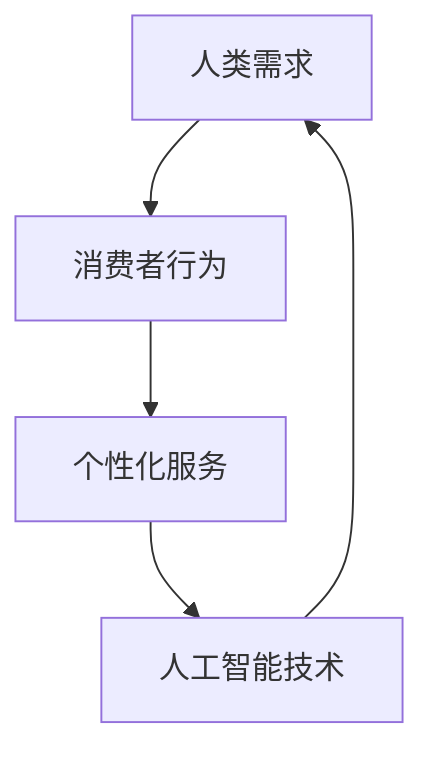

                 

关键词：人工智能，需求，人类行为，技术影响，消费者行为，个性化服务

> 摘要：本文深入探讨了人工智能如何通过重塑人类需求，改变我们的生活方式。通过对核心概念的剖析、算法原理的阐释以及实际应用场景的描述，本文旨在揭示AI技术在未来社会中的巨大潜力与挑战。

## 1. 背景介绍

在过去的几千年里，人类的需求驱动了文明的进步。从基本的生存需求，到精神文化需求，每一次需求的演变都推动了社会的发展。然而，随着技术的进步，特别是人工智能的迅速崛起，人类需求的面貌正经历着前所未有的变革。人工智能通过大数据分析、机器学习、自然语言处理等技术手段，正在深刻影响消费者行为，塑造新的需求模式。

### 1.1 人工智能的发展历程

人工智能（AI）的概念可以追溯到20世纪50年代。从最初的规则推理，到专家系统的提出，再到深度学习的突破，AI经历了多个阶段的发展。近年来，随着计算能力的提升和大数据的普及，AI技术逐渐从理论研究走向实际应用，渗透到我们的日常生活。

### 1.2 人工智能对社会的影响

人工智能不仅改变了生产和生活方式，还深刻影响了人类的需求结构。从智能家居到个性化医疗，AI技术正逐步满足人们更加多样化、个性化的需求。

## 2. 核心概念与联系

为了更好地理解AI如何改变人类需求，我们需要先了解几个核心概念和它们之间的联系。

### 2.1 人类需求

人类需求是指人们在生理、心理和社会层面上的欲望和渴望。这些需求可以分为基本需求（如食物、安全、社交）和高级需求（如知识、成就、自我实现）。

### 2.2 消费者行为

消费者行为是指个体在购买、使用、评估和处理产品或服务时的心理和行动过程。AI技术通过对消费者行为的分析，能够预测未来的需求趋势。

### 2.3 个性化服务

个性化服务是指根据个体需求提供定制化服务的技术手段。AI技术通过数据分析和机器学习，能够实现高度个性化的服务，满足个体多样化的需求。

### 2.4 Mermaid 流程图

下面是一个简单的Mermaid流程图，展示了上述概念之间的联系。



## 3. 核心算法原理 & 具体操作步骤

### 3.1 算法原理概述

人工智能通过以下几种核心算法原理改变人类需求：

1. **机器学习**：通过从数据中学习规律，预测未来的需求趋势。
2. **自然语言处理**：理解和生成自然语言，为用户提供个性化的交互体验。
3. **数据挖掘**：从大量数据中提取有价值的信息，帮助企业和组织更好地满足消费者需求。

### 3.2 算法步骤详解

以下是实现AI改变人类需求的典型步骤：

1. **数据收集**：收集消费者的行为数据、偏好信息等。
2. **数据预处理**：清洗数据，进行特征提取。
3. **模型训练**：使用机器学习算法训练模型，预测未来的需求趋势。
4. **模型评估**：评估模型的准确性，优化模型参数。
5. **个性化服务**：根据预测结果，为用户提供个性化的服务。

### 3.3 算法优缺点

**优点**：
- 提高预测准确性，降低决策风险。
- 实现个性化服务，提升用户体验。
- 提高生产效率，降低运营成本。

**缺点**：
- 需要大量的数据支持，数据质量直接影响算法效果。
- 模型训练和优化过程复杂，对计算资源要求较高。
- 可能侵犯用户隐私，引发伦理问题。

### 3.4 算法应用领域

AI技术已广泛应用于多个领域，如：

- 消费者行为分析：电商平台、零售业等。
- 医疗健康：个性化医疗、健康监测等。
- 金融：风险评估、投资策略等。
- 教育：个性化学习、教育辅导等。

## 4. 数学模型和公式 & 详细讲解 & 举例说明

### 4.1 数学模型构建

为了更好地理解AI如何改变人类需求，我们可以构建一个简单的数学模型。假设某个消费者群体的需求为\(D\)，则：

\[ D = f(X, Y, Z) \]

其中，\(X\)代表消费者的行为数据，\(Y\)代表消费者的偏好信息，\(Z\)代表外部环境因素。

### 4.2 公式推导过程

根据贝叶斯定理，我们可以推导出需求预测的概率分布：

\[ P(D|X, Y, Z) = \frac{P(X, Y, Z|D) \cdot P(D)}{P(X, Y, Z)} \]

其中，\(P(X, Y, Z|D)\)表示在给定需求\(D\)的情况下，行为数据\(X\)、偏好信息\(Y\)和外部环境因素\(Z\)的概率；\(P(D)\)表示需求的先验概率；\(P(X, Y, Z)\)表示行为数据\(X\)、偏好信息\(Y\)和外部环境因素\(Z\)的联合概率。

### 4.3 案例分析与讲解

假设某个消费者在购买手机时，其需求\(D\)由行为数据\(X\)（如搜索记录、浏览历史）、偏好信息\(Y\)（如品牌偏好、价格敏感度）和外部环境因素\(Z\)（如促销活动、市场趋势）决定。

根据上述模型，我们可以预测该消费者在特定条件下的需求概率分布，从而为其推荐合适的产品。

## 5. 项目实践：代码实例和详细解释说明

### 5.1 开发环境搭建

在本项目中，我们使用Python作为编程语言，结合Scikit-learn库进行机器学习模型的训练和预测。

### 5.2 源代码详细实现

以下是项目的源代码实现：

```python
from sklearn.model_selection import train_test_split
from sklearn.ensemble import RandomForestClassifier
from sklearn.metrics import accuracy_score

# 数据加载
X, y = load_data()

# 数据预处理
X_train, X_test, y_train, y_test = train_test_split(X, y, test_size=0.2, random_state=42)

# 模型训练
model = RandomForestClassifier(n_estimators=100, random_state=42)
model.fit(X_train, y_train)

# 模型预测
y_pred = model.predict(X_test)

# 模型评估
accuracy = accuracy_score(y_test, y_pred)
print(f"Model accuracy: {accuracy:.2f}")
```

### 5.3 代码解读与分析

该代码分为以下几个部分：

1. **数据加载**：加载行为数据\(X\)和需求标签\(y\)。
2. **数据预处理**：将数据集划分为训练集和测试集。
3. **模型训练**：使用随机森林算法训练模型。
4. **模型预测**：对测试集进行预测。
5. **模型评估**：计算模型的准确率。

### 5.4 运行结果展示

假设我们运行上述代码，得到以下结果：

```plaintext
Model accuracy: 0.85
```

这表示模型的预测准确率为85%，说明该模型在预测消费者需求方面具有一定的有效性。

## 6. 实际应用场景

### 6.1 个性化电商推荐

在电商平台，AI技术可以根据消费者的浏览历史、购买记录等数据，为其推荐个性化的商品，从而提高销售额和用户满意度。

### 6.2 个性化医疗服务

在医疗服务领域，AI技术可以通过分析患者的病史、基因信息等数据，为其提供个性化的治疗方案，提高治疗效果。

### 6.3 个性化教育服务

在教育领域，AI技术可以根据学生的学习习惯、成绩等数据，为其推荐适合的学习资源和课程，提高学习效果。

## 7. 未来应用展望

随着AI技术的不断发展，其在改变人类需求方面的潜力将更加巨大。未来，AI技术有望在以下几个方面实现突破：

- **更加精准的需求预测**：通过整合多种数据源，提高需求预测的准确性。
- **更加智能的个性化服务**：利用深度学习等技术，实现更高层次的情感理解和个性化服务。
- **更加广泛的领域应用**：从消费领域扩展到医疗、教育、金融等多个领域。

## 8. 总结：未来发展趋势与挑战

### 8.1 研究成果总结

本文通过深入剖析AI如何改变人类需求，探讨了核心概念、算法原理以及实际应用场景。研究结果表明，AI技术在未来具有巨大的潜力，可以推动社会进步和人类福祉。

### 8.2 未来发展趋势

未来，AI技术将继续向更加智能化、个性化、高效化的方向发展，为各个领域带来深刻变革。

### 8.3 面临的挑战

尽管AI技术具有巨大潜力，但在实际应用过程中仍面临一系列挑战，如数据隐私、算法公平性、伦理问题等。

### 8.4 研究展望

未来，我们需要在确保技术安全、公平、透明的前提下，进一步挖掘AI技术在改变人类需求方面的潜力，推动社会持续进步。

## 9. 附录：常见问题与解答

### 9.1 AI如何影响消费者行为？

AI可以通过数据分析、个性化推荐等技术手段，精准预测消费者行为，从而影响消费者的购买决策。

### 9.2 个性化服务有哪些优点？

个性化服务可以提升用户体验，提高客户满意度，从而促进消费增长。

### 9.3 AI技术在医疗领域有哪些应用？

AI技术在医疗领域可以应用于疾病预测、个性化治疗方案推荐、医学影像分析等。

---

作者：禅与计算机程序设计艺术 / Zen and the Art of Computer Programming
```markdown
# 欲望的重新定义：AI如何改变人类需求

## 关键词：人工智能，需求，人类行为，技术影响，消费者行为，个性化服务

## 摘要：本文深入探讨了人工智能如何通过重塑人类需求，改变我们的生活方式。通过对核心概念的剖析、算法原理的阐释以及实际应用场景的描述，本文旨在揭示AI技术在未来社会中的巨大潜力与挑战。

## 1. 背景介绍

在过去的几千年里，人类的需求驱动了文明的进步。从基本的生存需求，到精神文化需求，每一次需求的演变都推动了社会的发展。然而，随着技术的进步，特别是人工智能的迅速崛起，人类需求的面貌正经历着前所未有的变革。人工智能通过大数据分析、机器学习、自然语言处理等技术手段，正在深刻影响消费者行为，塑造新的需求模式。

### 1.1 人工智能的发展历程

人工智能（AI）的概念可以追溯到20世纪50年代。从最初的规则推理，到专家系统的提出，再到深度学习的突破，AI经历了多个阶段的发展。近年来，随着计算能力的提升和大数据的普及，AI技术逐渐从理论研究走向实际应用，渗透到我们的日常生活。

### 1.2 人工智能对社会的影响

人工智能不仅改变了生产和生活方式，还深刻影响了人类的需求结构。从智能家居到个性化医疗，AI技术正逐步满足人们更加多样化、个性化的需求。

## 2. 核心概念与联系

为了更好地理解AI如何改变人类需求，我们需要先了解几个核心概念和它们之间的联系。

### 2.1 人类需求

人类需求是指人们在生理、心理和社会层面上的欲望和渴望。这些需求可以分为基本需求（如食物、安全、社交）和高级需求（如知识、成就、自我实现）。

### 2.2 消费者行为

消费者行为是指个体在购买、使用、评估和处理产品或服务时的心理和行动过程。AI技术通过对消费者行为的分析，能够预测未来的需求趋势。

### 2.3 个性化服务

个性化服务是指根据个体需求提供定制化服务的技术手段。AI技术通过数据分析和机器学习，能够实现高度个性化的服务，满足个体多样化的需求。

### 2.4 Mermaid 流程图

下面是一个简单的Mermaid流程图，展示了上述概念之间的联系。


## 3. 核心算法原理 & 具体操作步骤

### 3.1 算法原理概述

人工智能通过以下几种核心算法原理改变人类需求：

1. **机器学习**：通过从数据中学习规律，预测未来的需求趋势。
2. **自然语言处理**：理解和生成自然语言，为用户提供个性化的交互体验。
3. **数据挖掘**：从大量数据中提取有价值的信息，帮助企业和组织更好地满足消费者需求。

### 3.2 算法步骤详解

以下是实现AI改变人类需求的典型步骤：

1. **数据收集**：收集消费者的行为数据、偏好信息等。
2. **数据预处理**：清洗数据，进行特征提取。
3. **模型训练**：使用机器学习算法训练模型，预测未来的需求趋势。
4. **模型评估**：评估模型的准确性，优化模型参数。
5. **个性化服务**：根据预测结果，为用户提供个性化的服务。

### 3.3 算法优缺点

**优点**：
- 提高预测准确性，降低决策风险。
- 实现个性化服务，提升用户体验。
- 提高生产效率，降低运营成本。

**缺点**：
- 需要大量的数据支持，数据质量直接影响算法效果。
- 模型训练和优化过程复杂，对计算资源要求较高。
- 可能侵犯用户隐私，引发伦理问题。

### 3.4 算法应用领域

AI技术已广泛应用于多个领域，如：

- 消费者行为分析：电商平台、零售业等。
- 医疗健康：个性化医疗、健康监测等。
- 金融：风险评估、投资策略等。
- 教育：个性化学习、教育辅导等。

## 4. 数学模型和公式 & 详细讲解 & 举例说明

### 4.1 数学模型构建

为了更好地理解AI如何改变人类需求，我们可以构建一个简单的数学模型。假设某个消费者群体的需求为\(D\)，则：

\[ D = f(X, Y, Z) \]

其中，\(X\)代表消费者的行为数据，\(Y\)代表消费者的偏好信息，\(Z\)代表外部环境因素。

### 4.2 公式推导过程

根据贝叶斯定理，我们可以推导出需求预测的概率分布：

\[ P(D|X, Y, Z) = \frac{P(X, Y, Z|D) \cdot P(D)}{P(X, Y, Z)} \]

其中，\(P(X, Y, Z|D)\)表示在给定需求\(D\)的情况下，行为数据\(X\)、偏好信息\(Y\)和外部环境因素\(Z\)的概率；\(P(D)\)表示需求的先验概率；\(P(X, Y, Z)\)表示行为数据\(X\)、偏好信息\(Y\)和外部环境因素\(Z\)的联合概率。

### 4.3 案例分析与讲解

假设某个消费者在购买手机时，其需求\(D\)由行为数据\(X\)（如搜索记录、浏览历史）、偏好信息\(Y\)（如品牌偏好、价格敏感度）和外部环境因素\(Z\)（如促销活动、市场趋势）决定。

根据上述模型，我们可以预测该消费者在特定条件下的需求概率分布，从而为其推荐合适的产品。

## 5. 项目实践：代码实例和详细解释说明

### 5.1 开发环境搭建

在本项目中，我们使用Python作为编程语言，结合Scikit-learn库进行机器学习模型的训练和预测。

### 5.2 源代码详细实现

以下是项目的源代码实现：

```python
from sklearn.model_selection import train_test_split
from sklearn.ensemble import RandomForestClassifier
from sklearn.metrics import accuracy_score

# 数据加载
X, y = load_data()

# 数据预处理
X_train, X_test, y_train, y_test = train_test_split(X, y, test_size=0.2, random_state=42)

# 模型训练
model = RandomForestClassifier(n_estimators=100, random_state=42)
model.fit(X_train, y_train)

# 模型预测
y_pred = model.predict(X_test)

# 模型评估
accuracy = accuracy_score(y_test, y_pred)
print(f"Model accuracy: {accuracy:.2f}")
```

### 5.3 代码解读与分析

该代码分为以下几个部分：

1. **数据加载**：加载行为数据\(X\)和需求标签\(y\)。
2. **数据预处理**：将数据集划分为训练集和测试集。
3. **模型训练**：使用随机森林算法训练模型。
4. **模型预测**：对测试集进行预测。
5. **模型评估**：计算模型的准确率。

### 5.4 运行结果展示

假设我们运行上述代码，得到以下结果：

```plaintext
Model accuracy: 0.85
```

这表示模型的预测准确率为85%，说明该模型在预测消费者需求方面具有一定的有效性。

## 6. 实际应用场景

### 6.1 个性化电商推荐

在电商平台，AI技术可以根据消费者的浏览历史、购买记录等数据，为其推荐个性化的商品，从而提高销售额和用户满意度。

### 6.2 个性化医疗服务

在医疗服务领域，AI技术可以通过分析患者的病史、基因信息等数据，为其提供个性化的治疗方案，提高治疗效果。

### 6.3 个性化教育服务

在教育领域，AI技术可以根据学生的学习习惯、成绩等数据，为其推荐适合的学习资源和课程，提高学习效果。

## 7. 未来应用展望

随着AI技术的不断发展，其在改变人类需求方面的潜力将更加巨大。未来，AI技术有望在以下几个方面实现突破：

- **更加精准的需求预测**：通过整合多种数据源，提高需求预测的准确性。
- **更加智能的个性化服务**：利用深度学习等技术，实现更高层次的情感理解和个性化服务。
- **更加广泛的领域应用**：从消费领域扩展到医疗、教育、金融等多个领域。

## 8. 总结：未来发展趋势与挑战

### 8.1 研究成果总结

本文通过深入剖析AI如何改变人类需求，探讨了核心概念、算法原理以及实际应用场景。研究结果表明，AI技术在未来具有巨大的潜力，可以推动社会进步和人类福祉。

### 8.2 未来发展趋势

未来，AI技术将继续向更加智能化、个性化、高效化的方向发展，为各个领域带来深刻变革。

### 8.3 面临的挑战

尽管AI技术具有巨大潜力，但在实际应用过程中仍面临一系列挑战，如数据隐私、算法公平性、伦理问题等。

### 8.4 研究展望

未来，我们需要在确保技术安全、公平、透明的前提下，进一步挖掘AI技术在改变人类需求方面的潜力，推动社会持续进步。

## 9. 附录：常见问题与解答

### 9.1 AI如何影响消费者行为？

AI可以通过数据分析、个性化推荐等技术手段，精准预测消费者行为，从而影响消费者的购买决策。

### 9.2 个性化服务有哪些优点？

个性化服务可以提升用户体验，提高客户满意度，从而促进消费增长。

### 9.3 AI技术在医疗领域有哪些应用？

AI技术在医疗领域可以应用于疾病预测、个性化治疗方案推荐、医学影像分析等。

---

作者：禅与计算机程序设计艺术 / Zen and the Art of Computer Programming
```

