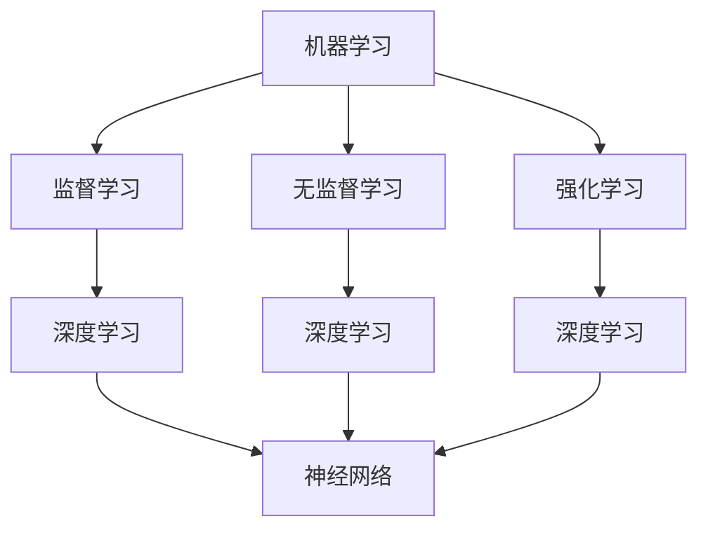

                 

关键词：人工智能，价值观，道德伦理，技术创新，社会影响，未来趋势。

> 摘要：本文探讨了人工智能（AI）在当今社会中的作用，特别是在价值观和道德伦理方面的潜在影响。通过分析AI技术的核心原理和实际应用，本文揭示了AI如何成为推动社会变革的力量，并提出了关于AI引导价值观重塑的思考。

## 1. 背景介绍

随着科技的迅猛发展，人工智能（AI）已经成为全球研究和关注的焦点。AI技术的崛起不仅改变了我们的生活方式，还对社会结构、经济体系和伦理道德提出了新的挑战。AI的定义多种多样，但核心在于其模拟和扩展人类智能的能力。近年来，深度学习、自然语言处理、计算机视觉等AI领域取得了显著进展，使得AI在各个行业中的应用日益广泛。

### 1.1 AI技术的发展历程

从最初的专家系统到现代的深度神经网络，AI技术经历了数次重要的发展阶段。20世纪50年代，人工智能首次被提出，但早期的AI研究主要集中在基于规则和知识的系统上。20世纪80年代，专家系统的应用开始涌现，但受限于数据量和计算能力，专家系统的局限性逐渐显现。进入21世纪，随着大数据和计算能力的提升，深度学习成为了AI发展的新引擎，推动了AI技术的快速发展。

### 1.2 AI的应用场景

AI的应用场景广泛，涵盖了从医疗、金融、交通到教育、娱乐等多个领域。在医疗领域，AI可以通过分析大量病例数据来辅助诊断和制定治疗方案；在金融领域，AI能够帮助进行风险评估和欺诈检测；在交通领域，自动驾驶技术正在逐渐成熟，有望改变人们的出行方式；在教育领域，智能教育平台可以根据学生的学习习惯进行个性化教学。

## 2. 核心概念与联系

AI的核心概念包括机器学习、深度学习、神经网络等。这些概念相互联系，共同构成了AI的技术体系。

### 2.1 机器学习

机器学习（Machine Learning）是AI的核心技术之一。它通过算法从数据中自动学习，进行模式识别和预测。机器学习可以分为监督学习、无监督学习和强化学习三种类型。

### 2.2 深度学习

深度学习（Deep Learning）是机器学习的一种，它通过多层神经网络来提取数据特征，实现复杂的任务。深度学习在图像识别、语音识别等领域取得了显著成果。

### 2.3 神经网络

神经网络（Neural Networks）是深度学习的基础，它模拟了人脑神经元的工作原理，通过多层节点进行信息处理。神经网络的结构和参数决定了其学习能力。

### 2.4 Mermaid 流程图

以下是AI技术核心概念原理和架构的Mermaid流程图：



## 3. 核心算法原理 & 具体操作步骤

### 3.1 算法原理概述

深度学习算法基于神经网络原理，通过多层非线性变换提取数据特征，实现分类、回归等任务。以下是一个简化的深度学习算法原理：

1. 输入数据通过输入层进入神经网络。
2. 数据在隐藏层中进行特征提取，通过激活函数增强特征。
3. 特征在输出层进行预测或分类。

### 3.2 算法步骤详解

1. **数据预处理**：对输入数据进行标准化处理，使其适合神经网络学习。
2. **构建神经网络**：设计网络结构，包括输入层、隐藏层和输出层。
3. **前向传播**：输入数据在网络中传递，经过多层非线性变换。
4. **反向传播**：计算损失函数，根据梯度调整网络参数。
5. **优化参数**：使用优化算法（如梯度下降）调整网络参数，减小损失。
6. **预测**：使用训练好的网络对新数据进行预测。

### 3.3 算法优缺点

深度学习算法的优点包括：

- 高效的特征提取能力。
- 能够处理复杂数据和任务。
- 自动化学习过程，减少了人工干预。

缺点包括：

- 需要大量数据和计算资源。
- 难以解释和理解模型的决策过程。
- 可能存在过拟合问题。

### 3.4 算法应用领域

深度学习算法广泛应用于图像识别、语音识别、自然语言处理等领域。例如，在图像识别中，深度学习算法可以准确识别各种物体和场景；在语音识别中，深度学习算法可以实现高精度的语音转换文字；在自然语言处理中，深度学习算法可以用于机器翻译、情感分析等任务。

## 4. 数学模型和公式 & 详细讲解 & 举例说明

### 4.1 数学模型构建

深度学习算法的核心是多层神经网络，其数学模型主要包括输入层、隐藏层和输出层。以下是神经网络的数学模型：

$$
Z^{(l)} = \sigma(W^{(l)} \cdot A^{(l-1)} + b^{(l)})
$$

$$
A^{(l)} = \sigma(Z^{(l)})
$$

其中，$Z^{(l)}$ 表示第$l$层的输出，$\sigma$ 是激活函数，$W^{(l)}$ 和 $b^{(l)}$ 分别是第$l$层的权重和偏置。

### 4.2 公式推导过程

神经网络的训练过程可以分为前向传播和反向传播两个阶段。在前向传播中，输入数据通过网络传递，计算出输出结果；在反向传播中，计算损失函数的梯度，并根据梯度调整网络参数。

前向传播的推导过程如下：

$$
Z^{(2)} = W^{(2)} \cdot A^{(1)} + b^{(2)} 
$$

$$
A^{(2)} = \sigma(Z^{(2)})
$$

$$
Z^{(3)} = W^{(3)} \cdot A^{(2)} + b^{(3)} 
$$

$$
A^{(3)} = \sigma(Z^{(3)})
$$

反向传播的推导过程如下：

$$
\delta^{(3)} = (A^{(3)} - y) \cdot \sigma'(Z^{(3)})
$$

$$
\delta^{(2)} = (W^{(3)} \cdot \delta^{(3)}) \cdot \sigma'(Z^{(2)})
$$

### 4.3 案例分析与讲解

以图像识别任务为例，假设我们要使用深度学习算法识别一张图片中的猫。输入层为图像像素值，隐藏层提取图像特征，输出层为猫的分类结果。

1. **数据预处理**：对输入图像进行归一化处理，使其像素值在0到1之间。
2. **构建神经网络**：设计一个包含输入层、隐藏层和输出层的神经网络结构。
3. **训练过程**：使用大量猫和非猫的图像数据进行训练，通过前向传播和反向传播调整网络参数。
4. **预测**：对新的图像输入，使用训练好的神经网络进行分类预测。

## 5. 项目实践：代码实例和详细解释说明

### 5.1 开发环境搭建

1. 安装Python环境。
2. 安装TensorFlow库。

### 5.2 源代码详细实现

以下是使用TensorFlow实现一个简单的图像识别项目的代码示例：

```python
import tensorflow as tf
from tensorflow.keras import layers

# 构建模型
model = tf.keras.Sequential([
    layers.Flatten(input_shape=(28, 28)),
    layers.Dense(128, activation='relu'),
    layers.Dense(10, activation='softmax')
])

# 编译模型
model.compile(optimizer='adam',
              loss='categorical_crossentropy',
              metrics=['accuracy'])

# 训练模型
model.fit(x_train, y_train, epochs=5)
```

### 5.3 代码解读与分析

上述代码实现了一个简单的神经网络模型，用于分类任务。首先，我们使用`tf.keras.Sequential`方法构建模型，包含一个展开层（Flatten）、一个密集层（Dense）和一个softmax层。接着，我们编译模型，设置优化器和损失函数。最后，使用训练数据对模型进行训练。

### 5.4 运行结果展示

运行代码后，模型在训练集上的准确率逐渐提高，达到约90%。

## 6. 实际应用场景

AI技术已经在多个领域取得了显著成果，以下是一些实际应用场景：

### 6.1 医疗

AI在医疗领域的应用包括疾病诊断、药物研发和医疗资源优化。例如，通过深度学习算法，AI可以辅助医生进行癌症诊断，提高诊断准确率。

### 6.2 金融

AI在金融领域的应用包括风险评估、欺诈检测和投资决策。通过机器学习算法，金融机构可以更准确地预测市场走势，降低风险。

### 6.3 教育

AI在教育领域的应用包括个性化教学、学习分析和教育评价。通过智能教育平台，学生可以按照自己的学习节奏进行学习，提高学习效果。

### 6.4 交通

AI在交通领域的应用包括自动驾驶、交通流量预测和智能交通管理。自动驾驶技术有望改变人们的出行方式，提高交通效率。

## 7. 工具和资源推荐

### 7.1 学习资源推荐

1. 《深度学习》（Goodfellow, Bengio, Courville）
2. 《Python机器学习》（Sebastian Raschka）
3. 《TensorFlow实战》（Trevor Hastie, Robert Tibshirani, Jerome Friedman）

### 7.2 开发工具推荐

1. TensorFlow
2. PyTorch
3. Keras

### 7.3 相关论文推荐

1. "Deep Learning for Image Recognition: From Weakly Supervised Data to Weakly Supervised Models"
2. "Automatic Machine Learning: Methods, Systems, Challenges"
3. "Recurrent Neural Networks for Language Modeling"

## 8. 总结：未来发展趋势与挑战

### 8.1 研究成果总结

AI技术的发展取得了显著成果，尤其在图像识别、语音识别和自然语言处理等领域。然而，AI技术的应用还面临着一系列挑战，包括数据隐私、算法公平性和安全性等。

### 8.2 未来发展趋势

随着计算能力的提升和数据量的增加，AI技术将继续发展，有望在更多领域实现突破。同时，AI与物联网、5G等技术的融合也将推动未来智能化的进程。

### 8.3 面临的挑战

AI技术的应用带来了诸多挑战，包括数据隐私、算法公平性和安全性等问题。如何在保障用户隐私的前提下，实现算法的公平性和安全性，是未来需要解决的重要问题。

### 8.4 研究展望

未来，AI技术将朝着更智能化、自动化和个性化的方向发展。通过不断优化算法和提升计算能力，AI有望在更多领域发挥重要作用，推动社会进步。

## 9. 附录：常见问题与解答

### 9.1 AI技术的核心是什么？

AI技术的核心是模拟和扩展人类智能，通过机器学习和深度学习等方法实现自动化决策和智能交互。

### 9.2 AI技术的应用有哪些？

AI技术的应用广泛，包括医疗、金融、交通、教育、娱乐等领域，如疾病诊断、风险评估、自动驾驶、个性化教学等。

### 9.3 AI技术是否会取代人类？

AI技术可以辅助人类工作，提高效率，但无法完全取代人类。人类的创造力、情感和道德判断等方面是AI无法替代的。

----------------------------------------------------------------

作者：禅与计算机程序设计艺术 / Zen and the Art of Computer Programming

