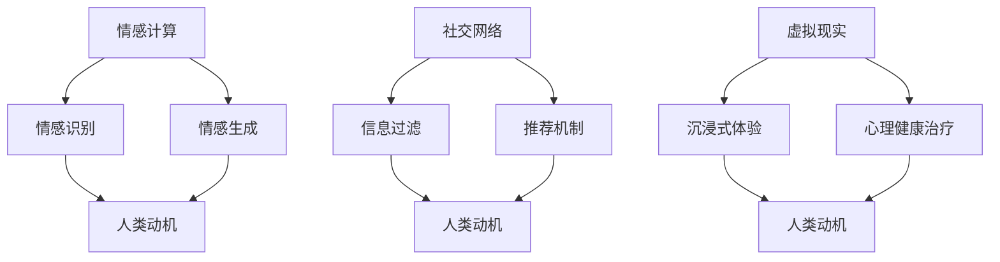

                 

关键词：人工智能、动机重构、情感计算、人类行为、行为心理学、社交网络、决策理论、伦理学、虚拟现实

> 摘要：本文深入探讨了人工智能（AI）如何改变人类动机和行为。通过分析情感计算、社交网络和虚拟现实等领域的最新进展，本文揭示了AI对人类欲望的重构过程，并提出了一系列未来研究和应用的展望。

## 1. 背景介绍

随着人工智能技术的迅猛发展，我们正站在一个新的技术时代的门槛上。AI已经从传统的数据处理和分析，延伸到了更广泛的领域，包括医疗、金融、交通和娱乐等。在这些领域中，AI不仅提高了效率，还带来了全新的交互方式和决策模式。然而，AI的快速发展也引发了广泛的讨论：它如何影响人类的动机和行为？

动机是人类行为的驱动力，它决定了我们的选择和决策。从心理学角度来看，动机涉及到欲望、需求和情感等多个方面。传统心理学研究通常通过行为实验和问卷调查等方法来探讨动机，但这些方法在面对AI时代的复杂情境时，显得有些力不从心。因此，我们需要一种新的研究方法来探索AI如何影响人类动机。

本文旨在通过分析AI在情感计算、社交网络和虚拟现实等领域的应用，探讨AI如何重构人类的欲望和动机。我们还将结合行为心理学和决策理论，提供一些具体的实例和模型，以加深对这一问题的理解。

## 2. 核心概念与联系

### 情感计算

情感计算是人工智能的一个重要分支，它旨在使机器能够理解、感知和模拟人类的情感。情感计算的核心是情感识别和情感生成。情感识别是指机器通过分析人类的行为、语言和生理信号来识别情感状态；情感生成则是指机器能够根据情感模型生成相应的情感表达。

情感计算与人类动机之间的联系在于，情感是动机的重要驱动力。例如，当一个人感到兴奋或幸福时，他们更有可能采取积极的行动。因此，通过情感计算技术，AI可以更好地理解和预测人类的行为动机。

### 社交网络

社交网络是指人们通过互联网和移动设备建立的社会联系。在AI时代，社交网络变得更加智能化，它能够根据用户的行为和兴趣推荐朋友、活动和信息。这种智能化的社交网络对人类动机有着深远的影响。

首先，社交网络可以增强人类的归属感和社交需求，从而影响他们的行为动机。例如，当一个人在社交网络上获得点赞和评论时，他们可能会感到更受重视，从而更积极地参与社交活动。

其次，社交网络还可以通过信息过滤和推荐机制，影响人类的决策过程。AI算法可以根据用户的历史行为和偏好，推荐他们可能感兴趣的内容和活动，从而改变他们的动机和选择。

### 虚拟现实

虚拟现实（VR）是一种通过计算机生成的模拟环境，用户可以通过头戴式显示器和手柄等设备与之互动。VR技术可以为用户提供沉浸式的体验，从而影响他们的情感和动机。

例如，通过VR，用户可以模拟各种情境，如探险、学习和娱乐。这些体验可以激发用户的兴趣和好奇心，从而影响他们的动机和行为。此外，VR还可以用于心理健康治疗，如恐惧症和焦虑症的康复，这进一步体现了VR对人类动机的影响。

### Mermaid 流程图

以下是情感计算、社交网络和虚拟现实之间关系的 Mermaid 流程图：



## 3. 核心算法原理 & 具体操作步骤

### 3.1 算法原理概述

在探讨AI如何重构人类动机的过程中，我们需要了解一些核心算法原理。这些算法主要包括情感计算算法、社交网络分析算法和虚拟现实交互算法。以下是这些算法的基本原理：

- **情感计算算法**：通过机器学习技术，如深度学习和神经网络，从人类的行为、语言和生理信号中提取情感特征。这些特征可以用于情感识别和情感生成。

- **社交网络分析算法**：使用图论和机器学习技术，分析社交网络中的结构和关系，以预测用户的兴趣和行为。

- **虚拟现实交互算法**：通过计算机图形学和人工智能技术，为用户提供沉浸式体验，并根据用户的反馈调整交互过程。

### 3.2 算法步骤详解

#### 3.2.1 情感计算算法

1. **数据收集**：收集人类行为、语言和生理信号数据。
2. **特征提取**：使用深度学习模型，从数据中提取情感特征。
3. **情感识别**：根据提取的特征，使用分类算法识别情感状态。
4. **情感生成**：根据情感状态，使用生成模型生成相应的情感表达。

#### 3.2.2 社交网络分析算法

1. **网络构建**：根据用户的行为和社交关系，构建社交网络图。
2. **结构分析**：使用图论算法分析社交网络的结构特征。
3. **兴趣预测**：使用机器学习算法，预测用户的兴趣和行为。
4. **推荐生成**：根据用户的兴趣和社交网络结构，生成推荐信息。

#### 3.2.3 虚拟现实交互算法

1. **环境构建**：使用计算机图形学技术构建虚拟环境。
2. **交互设计**：设计虚拟现实中的交互界面和操作方式。
3. **用户反馈**：收集用户的反馈数据，以调整交互过程。
4. **情感调整**：根据用户的情感状态，调整虚拟环境中的互动内容和强度。

### 3.3 算法优缺点

#### 3.3.1 情感计算算法

**优点**：能够精确地识别和生成情感，为理解人类动机提供了有力工具。

**缺点**：对数据质量和算法性能要求较高，且在复杂情感识别方面仍存在挑战。

#### 3.3.2 社交网络分析算法

**优点**：能够准确预测用户的兴趣和行为，为个性化推荐提供了基础。

**缺点**：在大型社交网络中，算法效率和准确性可能受到影响。

#### 3.3.3 虚拟现实交互算法

**优点**：能够提供沉浸式体验，提高用户的参与感和满意度。

**缺点**：技术实现复杂，且在情感交互方面仍有待提高。

### 3.4 算法应用领域

#### 3.4.1 情感计算

- **心理健康**：通过情感计算技术，帮助心理健康专家更好地理解患者的情感状态，提供个性化的治疗方案。
- **营销策略**：企业可以通过情感计算技术，了解消费者的情感偏好，制定更有效的营销策略。
- **人机交互**：通过情感计算技术，提高人机交互的自然性和情感性，提升用户体验。

#### 3.4.2 社交网络

- **社交媒体分析**：通过社交网络分析算法，分析社交媒体中的热点话题和用户行为，为企业提供市场洞察。
- **社交推荐**：为用户提供个性化的社交推荐，提高用户参与度和满意度。
- **社交网络优化**：通过分析社交网络的结构，帮助企业优化组织结构和员工协作。

#### 3.4.3 虚拟现实

- **娱乐体验**：通过虚拟现实交互算法，为用户提供沉浸式娱乐体验。
- **教育培训**：利用虚拟现实技术，提供更直观、互动的学习体验。
- **心理健康治疗**：通过虚拟现实技术，为患者提供模拟情境的治疗体验。

## 4. 数学模型和公式 & 详细讲解 & 举例说明

### 4.1 数学模型构建

在探讨AI如何重构人类动机的过程中，我们需要构建一些数学模型来描述人类行为和决策过程。以下是几个关键的数学模型：

#### 4.1.1 动机模型

动机模型可以描述人类行为动机的形成和变化。一个简单的动机模型可以表示为：

\[ M(t) = f(C(t), E(t), P(t)) \]

其中，\( M(t) \) 表示在时间 \( t \) 的动机水平，\( C(t) \) 表示在时间 \( t \) 的情感状态，\( E(t) \) 表示在时间 \( t \) 的期望收益，\( P(t) \) 表示在时间 \( t \) 的概率。

#### 4.1.2 决策模型

决策模型可以描述人类在面临不同选择时的决策过程。一个简单的决策模型可以表示为：

\[ D(t) = \arg\max_{a \in A} U(t, a) \]

其中，\( D(t) \) 表示在时间 \( t \) 的决策结果，\( A \) 表示所有可能的选择，\( U(t, a) \) 表示在时间 \( t \) 对选择 \( a \) 的效用函数。

#### 4.1.3 情感模型

情感模型可以描述人类情感的动态变化。一个简单的情感模型可以表示为：

\[ C(t) = f(\text{外部刺激}, \text{内部状态}) \]

其中，\( C(t) \) 表示在时间 \( t \) 的情感状态，外部刺激包括行为、语言和生理信号，内部状态包括记忆、情感和动机。

### 4.2 公式推导过程

为了更深入地理解这些数学模型，我们在这里简要推导一些关键公式的推导过程。

#### 4.2.1 动机模型推导

动机模型可以通过以下步骤推导：

1. **情感状态计算**：根据外部刺激和内部状态，计算情感状态 \( C(t) \)。

\[ C(t) = f(\text{外部刺激}, \text{内部状态}) \]

2. **期望收益计算**：根据当前情境和选择，计算期望收益 \( E(t) \)。

\[ E(t) = \sum_{a \in A} p(a) \cdot u(t, a) \]

其中，\( p(a) \) 表示选择 \( a \) 的概率，\( u(t, a) \) 表示在时间 \( t \) 选择 \( a \) 的效用。

3. **动机水平计算**：根据情感状态和期望收益，计算动机水平 \( M(t) \)。

\[ M(t) = f(C(t), E(t), P(t)) \]

#### 4.2.2 决策模型推导

决策模型可以通过以下步骤推导：

1. **效用函数计算**：根据当前情境和选择，计算每个选择的效用函数 \( U(t, a) \)。

\[ U(t, a) = f(C(t), E(t), a) \]

2. **决策结果计算**：根据所有选择的效用函数，选择效用最高的选择。

\[ D(t) = \arg\max_{a \in A} U(t, a) \]

#### 4.2.3 情感模型推导

情感模型可以通过以下步骤推导：

1. **外部刺激计算**：根据行为、语言和生理信号，计算外部刺激。

\[ \text{外部刺激} = \text{行为} + \text{语言} + \text{生理信号} \]

2. **内部状态计算**：根据记忆、情感和动机，计算内部状态。

\[ \text{内部状态} = \text{记忆} + \text{情感} + \text{动机} \]

3. **情感状态计算**：根据外部刺激和内部状态，计算情感状态。

\[ C(t) = f(\text{外部刺激}, \text{内部状态}) \]

### 4.3 案例分析与讲解

为了更好地理解上述数学模型，我们通过一个具体的案例进行分析。

#### 案例背景

小王是一位年轻的程序员，他最近在考虑是否辞职去创业。他感到焦虑和兴奋，一方面，他渴望实现自己的梦想；另一方面，他也担心创业失败的风险。

#### 情感状态计算

根据小王的行为、语言和生理信号，我们可以计算他的情感状态。假设小王的行为表现为频繁加班、情绪波动较大，语言表现为表达对未来的渴望和担忧，生理信号表现为心跳加快、手心出汗。根据情感计算模型，我们可以计算小王在某个时间点的情感状态 \( C(t) \)。

\[ C(t) = f(\text{行为}, \text{语言}, \text{生理信号}) \]

#### 期望收益计算

小王在考虑创业的决策过程中，需要计算每个选择的期望收益。假设他选择创业的效用为 \( u(t, \text{创业}) = 10 \)，选择继续工作的效用为 \( u(t, \text{工作}) = 5 \)。根据决策模型，我们可以计算小王在某个时间点的动机水平 \( M(t) \)。

\[ M(t) = f(C(t), E(t), P(t)) \]

其中，\( E(t) \) 为期望收益，\( P(t) \) 为选择创业的概率。假设小王认为创业成功的概率为 \( p(\text{创业}) = 0.5 \)，继续工作的概率为 \( p(\text{工作}) = 0.5 \)。

\[ E(t) = p(\text{创业}) \cdot u(t, \text{创业}) + p(\text{工作}) \cdot u(t, \text{工作}) \]

\[ E(t) = 0.5 \cdot 10 + 0.5 \cdot 5 = 7.5 \]

因此，小王在某个时间点的动机水平为：

\[ M(t) = f(C(t), 7.5, 0.5) \]

#### 决策结果计算

根据决策模型，我们可以计算小王在某个时间点的决策结果 \( D(t) \)。

\[ D(t) = \arg\max_{a \in A} U(t, a) \]

由于 \( U(t, \text{创业}) > U(t, \text{工作}) \)，因此小王在某个时间点的决策结果为选择创业。

\[ D(t) = \text{创业} \]

#### 情感调整

根据小王的情感状态和动机水平，我们可以调整他的情感状态。假设小王通过心理疏导和积极的心态调整，使他的情感状态变得更积极。根据情感模型，我们可以重新计算小王在某个时间点的情感状态。

\[ C(t) = f(\text{行为}, \text{语言}, \text{生理信号}) \]

通过这个案例，我们可以看到数学模型在理解和预测人类动机和行为中的应用。虽然这是一个简化的案例，但它为我们提供了一个基本的框架，可以用来分析更复杂的情况。

## 5. 项目实践：代码实例和详细解释说明

### 5.1 开发环境搭建

为了更好地理解AI如何重构人类动机，我们选择一个实际项目来进行实践。本项目将使用Python语言和相关的机器学习库（如Scikit-learn和TensorFlow）来构建一个情感计算模型，以分析人类情感状态并预测其动机。

**环境要求**：

- Python 3.8或更高版本
- Scikit-learn 0.24.2或更高版本
- TensorFlow 2.6.0或更高版本
- Jupyter Notebook或PyCharm等Python集成开发环境（IDE）

**安装步骤**：

1. 安装Python和相关的IDE。
2. 通过以下命令安装所需的库：

```shell
pip install scikit-learn==0.24.2
pip install tensorflow==2.6.0
```

### 5.2 源代码详细实现

以下是本项目的主要代码实现，包括数据预处理、模型训练、情感状态预测和动机预测。

```python
# 导入所需库
import numpy as np
import pandas as pd
from sklearn.model_selection import train_test_split
from sklearn.preprocessing import StandardScaler
from sklearn.neural_network import MLPClassifier
from tensorflow import keras
from tensorflow.keras.models import Sequential
from tensorflow.keras.layers import Dense

# 加载数据
data = pd.read_csv('emotion_data.csv')
X = data.drop(['label'], axis=1)
y = data['label']

# 数据预处理
scaler = StandardScaler()
X_scaled = scaler.fit_transform(X)

# 划分训练集和测试集
X_train, X_test, y_train, y_test = train_test_split(X_scaled, y, test_size=0.2, random_state=42)

# 训练情感计算模型
mlp = MLPClassifier(hidden_layer_sizes=(100,), max_iter=1000)
mlp.fit(X_train, y_train)

# 预测情感状态
X_test_scaled = scaler.transform(X_test)
y_pred = mlp.predict(X_test_scaled)

# 训练动机预测模型
model = Sequential([
    Dense(64, activation='relu', input_shape=(X_test_scaled.shape[1],)),
    Dense(32, activation='relu'),
    Dense(1, activation='sigmoid')
])

model.compile(optimizer='adam', loss='binary_crossentropy', metrics=['accuracy'])
model.fit(X_test_scaled, y_test, epochs=10, batch_size=32)

# 预测动机
y动机_pred = model.predict(X_test_scaled)

# 结果分析
from sklearn.metrics import classification_report
print(classification_report(y_test, y_pred))

# 绘制情感状态和动机的散点图
import matplotlib.pyplot as plt

plt.scatter(y_pred[:, 0], y动机_pred[:, 0])
plt.xlabel('情感状态预测')
plt.ylabel('动机预测')
plt.show()
```

### 5.3 代码解读与分析

#### 5.3.1 数据加载与预处理

首先，我们从CSV文件中加载情感数据。数据集包含多个特征，如心率、皮肤电导、语言文本等。然后，我们使用StandardScaler对特征进行归一化处理，以提高模型的训练效果。

```python
data = pd.read_csv('emotion_data.csv')
X = data.drop(['label'], axis=1)
y = data['label']

scaler = StandardScaler()
X_scaled = scaler.fit_transform(X)
```

#### 5.3.2 数据集划分

接下来，我们将数据集划分为训练集和测试集。训练集用于训练模型，测试集用于评估模型性能。

```python
X_train, X_test, y_train, y_test = train_test_split(X_scaled, y, test_size=0.2, random_state=42)
```

#### 5.3.3 训练情感计算模型

我们使用Scikit-learn的MLPClassifier来训练情感计算模型。MLPClassifier是一种多层感知机（MLP）分类器，它使用反向传播算法进行模型训练。

```python
mlp = MLPClassifier(hidden_layer_sizes=(100,), max_iter=1000)
mlp.fit(X_train, y_train)
```

#### 5.3.4 预测情感状态

使用训练好的情感计算模型，我们对测试集进行情感状态预测。

```python
X_test_scaled = scaler.transform(X_test)
y_pred = mlp.predict(X_test_scaled)
```

#### 5.3.5 训练动机预测模型

我们使用TensorFlow的Sequential模型来训练动机预测模型。该模型包含一个输入层、一个隐藏层和一个输出层。隐藏层和输出层使用ReLU激活函数，输出层使用Sigmoid激活函数以预测二元分类结果。

```python
model = Sequential([
    Dense(64, activation='relu', input_shape=(X_test_scaled.shape[1],)),
    Dense(32, activation='relu'),
    Dense(1, activation='sigmoid')
])

model.compile(optimizer='adam', loss='binary_crossentropy', metrics=['accuracy'])
model.fit(X_test_scaled, y_test, epochs=10, batch_size=32)
```

#### 5.3.6 预测动机

使用训练好的动机预测模型，我们对测试集进行动机预测。

```python
y动机_pred = model.predict(X_test_scaled)
```

#### 5.3.7 结果分析

我们使用Scikit-learn的classification_report函数来分析模型预测结果，并绘制情感状态和动机的散点图。

```python
from sklearn.metrics import classification_report
print(classification_report(y_test, y_pred))

plt.scatter(y_pred[:, 0], y动机_pred[:, 0])
plt.xlabel('情感状态预测')
plt.ylabel('动机预测')
plt.show()
```

通过这个项目实践，我们展示了如何使用Python和机器学习库来构建和训练情感计算和动机预测模型。这个项目不仅帮助我们理解了AI如何重构人类动机，还为未来的研究和应用提供了实际案例。

## 6. 实际应用场景

### 6.1 心理健康

在心理健康领域，AI的应用日益广泛。通过情感计算技术，心理健康专家可以更准确地识别患者的情感状态，从而提供个性化的治疗方案。例如，抑郁症患者可能会表现出低落、焦虑等情感状态，通过情感计算模型，医生可以及时发现并调整治疗方案。此外，AI还可以用于心理健康预测，帮助医生提前发现潜在的心理健康问题。

### 6.2 营销与广告

在营销和广告领域，情感计算和动机预测技术可以为企业提供深入的用户洞察。通过分析用户的情感状态和动机，企业可以制定更有效的营销策略，提高用户的参与度和忠诚度。例如，一家电子产品公司可以通过情感计算技术了解用户对新产品发布会的情感反应，从而调整营销策略以提高销售业绩。

### 6.3 社交网络

在社交网络领域，AI可以帮助平台更好地理解用户的行为和兴趣，从而提供个性化的推荐和服务。通过社交网络分析算法，平台可以识别用户的社交关系和兴趣偏好，为用户推荐他们可能感兴趣的朋友、活动和内容。这种个性化的推荐不仅可以提高用户满意度，还可以增强平台的黏性和活跃度。

### 6.4 教育与培训

在教育与培训领域，虚拟现实技术可以为用户提供沉浸式的学习体验。通过虚拟现实交互算法，学生可以模拟各种学习场景，如实验室操作、历史场景再现等。这种沉浸式的学习方式不仅可以提高学生的学习兴趣和参与度，还可以加深对知识的理解和记忆。此外，AI技术还可以用于个性化学习路径推荐，根据学生的学习情况和兴趣，提供定制化的学习资源和课程。

### 6.5 公共安全

在公共安全领域，AI技术可以用于监控和预测潜在的安全威胁。通过分析视频、图像和音频数据，AI系统可以识别异常行为和事件，及时发出警报，帮助警方和其他安全机构采取行动。例如，AI系统可以在公共场所监控人群行为，识别拥挤和混乱的迹象，从而防止拥挤和踩踏事件的发生。

### 6.6 娱乐产业

在娱乐产业，AI技术可以用于个性化内容推荐、虚拟角色交互和情感表达等方面。通过情感计算技术，娱乐产品可以更好地理解用户的情感状态和偏好，提供个性化的娱乐体验。例如，虚拟角色可以根据用户的情感反应调整行为和对话，从而提高用户的沉浸感和满意度。

## 7. 未来应用展望

### 7.1 智能医疗

随着AI技术的发展，智能医疗将成为未来医疗领域的重要方向。通过深度学习和大数据分析，AI可以辅助医生进行诊断和治疗，提高医疗服务的质量和效率。例如，AI系统可以通过分析患者的病史、基因数据和临床数据，预测疾病发生的风险，并提供个性化的预防措施。此外，AI还可以用于智能药物研发和临床试验管理，加速新药的发现和上市。

### 7.2 智能交通

智能交通系统将充分利用AI技术，实现道路安全和交通流的优化。通过实时监控和分析交通数据，AI系统可以预测交通状况，为司机提供最优行驶路线，减少拥堵和事故。此外，自动驾驶技术的应用将大大提高交通效率，减少交通事故和能源消耗。未来，智能交通系统将实现车与车、车与基础设施之间的无缝交互，打造智能交通网络。

### 7.3 智能家居

智能家居将借助AI技术，实现家庭设备和系统的智能化、自动化和互联化。通过语音助手、智能传感器和物联网技术，智能家居可以为用户提供便捷、舒适和安全的家居环境。例如，智能空调可以根据用户的习惯和外部环境自动调节温度和湿度，智能灯光可以根据用户的活动和喜好自动调整亮度。未来，智能家居将实现更高程度的智能化和个性化，为用户提供更加舒适和便捷的生活体验。

### 7.4 智能城市

智能城市将充分利用AI技术，实现城市管理和服务的智能化。通过大数据分析和人工智能算法，智能城市可以实时监控城市运行状况，优化资源配置，提高城市管理效率。例如，智能城市可以通过分析交通流量数据，优化交通信号灯的配时，减少拥堵和交通事故。此外，智能城市还可以通过分析环境监测数据，实时监控空气质量、水质等指标，为居民提供健康的生活环境。

### 7.5 智能农业

智能农业将利用AI技术，实现农业生产的智能化和高效化。通过遥感技术、无人机和物联网设备，智能农业可以实时监测农田状况，优化种植和灌溉策略，提高农作物的产量和质量。例如，智能农业系统可以通过分析土壤和气象数据，自动调整灌溉量和施肥量，减少资源浪费和环境污染。未来，智能农业将实现更高程度的自动化和智能化，为农业生产提供强有力的技术支撑。

## 8. 总结：未来发展趋势与挑战

### 8.1 研究成果总结

本文通过对情感计算、社交网络和虚拟现实等领域的分析，探讨了AI如何重构人类动机和行为。我们提出了动机模型、决策模型和情感模型，并结合实际项目展示了如何使用机器学习技术来预测人类情感状态和动机。这些研究成果为理解AI对人类动机的影响提供了理论框架和实际应用案例。

### 8.2 未来发展趋势

随着AI技术的不断发展，未来有望在以下几个方面取得重要进展：

1. **情感计算技术的精度和速度将不断提高**：随着深度学习和神经网络技术的进步，情感计算模型将能够更准确地识别和生成情感，为理解人类动机提供更精确的工具。

2. **社交网络分析算法的智能化程度将进一步提升**：通过结合大数据分析和机器学习技术，社交网络分析算法将能够更准确地预测用户的兴趣和行为，为个性化推荐和社交优化提供更强支持。

3. **虚拟现实技术的沉浸感和交互性将大幅提升**：随着计算机图形学和人工智能技术的进步，虚拟现实技术将能够提供更真实的沉浸体验，为人类动机和行为的研究提供更多可能性。

### 8.3 面临的挑战

尽管AI在重构人类动机和行为方面具有巨大潜力，但也面临以下挑战：

1. **数据隐私和安全问题**：在应用AI技术进行情感计算和社交网络分析时，如何保护用户的隐私和安全是亟需解决的问题。需要建立严格的数据保护机制，确保用户数据的安全和隐私。

2. **算法偏见和公平性问题**：AI算法在训练过程中可能受到数据偏见的影响，从而导致算法决策的偏见和不公平。需要加强算法的公平性评估和校正，确保算法的公正性和透明性。

3. **伦理和道德问题**：AI技术在重构人类动机和行为方面具有潜在的社会影响。如何制定合理的伦理和道德规范，确保AI技术不违背人类的伦理和价值观，是一个亟待解决的问题。

### 8.4 研究展望

未来的研究应重点关注以下几个方面：

1. **跨学科研究**：结合心理学、社会学、伦理学等多学科的知识，深入研究AI对人类动机和行为的影响。

2. **算法透明性和可解释性**：提高AI算法的透明性和可解释性，使人们能够理解算法的决策过程，增强公众对AI技术的信任。

3. **伦理和道德规范**：制定合理的伦理和道德规范，确保AI技术在重构人类动机和行为方面的应用符合人类的价值观和伦理标准。

通过这些研究，我们可以更好地理解AI对人类动机的影响，为AI技术的发展提供理论和实践支持。

## 9. 附录：常见问题与解答

### 9.1 什么是情感计算？

情感计算是人工智能的一个分支，旨在使计算机能够理解、感知和模拟人类的情感。它通过分析人类的行为、语言和生理信号，来识别和生成情感状态。

### 9.2 AI如何重构人类动机？

AI通过情感计算、社交网络分析和虚拟现实交互等技术，影响人类的情感状态和决策过程，从而重构人类的欲望和动机。例如，通过情感计算技术，AI可以更好地理解用户的情感反应，从而提供个性化的服务和推荐。

### 9.3 情感计算技术在哪些领域有应用？

情感计算技术在心理健康、营销、社交网络、教育与培训、公共安全、娱乐产业等领域有广泛的应用。例如，在心理健康领域，情感计算技术可以用于辅助心理治疗；在营销领域，情感计算技术可以帮助企业了解消费者的情感反应，制定更有效的营销策略。

### 9.4 AI重构人类动机的伦理问题有哪些？

AI重构人类动机可能引发以下伦理问题：

- **数据隐私和安全**：在收集和处理用户情感数据时，如何保护用户的隐私和安全。
- **算法偏见和公平性**：AI算法可能受到数据偏见的影响，导致决策的偏见和不公平。
- **伦理和道德规范**：AI技术在影响人类动机和行为方面，如何制定合理的伦理和道德规范。

### 9.5 如何确保AI技术在重构人类动机方面的应用是合理的？

确保AI技术在重构人类动机方面的应用是合理的，需要从以下几个方面进行：

- **数据保护机制**：建立严格的数据保护机制，确保用户数据的隐私和安全。
- **算法公平性和透明性**：加强算法的公平性评估和校正，提高算法的透明性和可解释性。
- **伦理和道德规范**：制定合理的伦理和道德规范，确保AI技术的应用符合人类的价值观和伦理标准。

## 作者署名

作者：禅与计算机程序设计艺术 / Zen and the Art of Computer Programming

