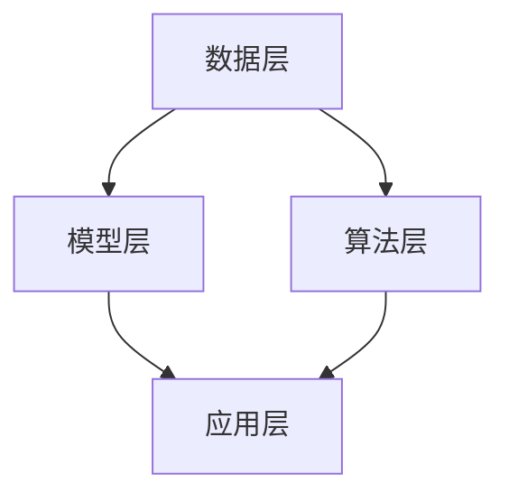

                 

关键词：社会网络分析、群体动力学、人工智能、网络拓扑、数据挖掘、机器学习、深度学习

> 摘要：本文旨在探讨欲望社会网络分析（Desire Social Network Analysis，DSNA）的原理、方法与应用，结合人工智能（AI）技术，深入分析群体动力学特征，探索其在社会、经济、政治等领域的潜在价值。通过构建DSNA模型，结合实际案例，本文揭示了人工智能在理解、预测和控制社会群体行为方面的巨大潜力。

## 1. 背景介绍

随着互联网和社交媒体的快速发展，人类社会进入了一个全新的网络时代。网络不仅是信息传递的渠道，更是人们互动、交流和协作的场所。社会网络分析（Social Network Analysis，SNA）作为一门研究网络结构及其对个体行为影响的学科，逐渐受到了广泛关注。然而，传统的社会网络分析方法往往局限于静态数据的分析，难以捕捉和描述动态的网络演变过程。

与此同时，人工智能（AI）技术的迅速发展，为动态网络分析提供了新的工具和方法。机器学习、深度学习等AI算法的应用，使得从大规模、复杂网络数据中提取有价值的信息成为可能。这使得群体动力学（Group Dynamics）研究，特别是涉及人类行为和互动的领域，迎来了新的研究机遇。

本文将结合社会网络分析、群体动力学和人工智能技术，提出一种全新的研究方法——欲望社会网络分析（Desire Social Network Analysis，DSNA）。DSNA旨在通过分析个体的欲望和需求，揭示网络中的群体行为模式和动力机制，为理解、预测和控制社会群体行为提供理论支持和实践指导。

### 1.1 社会网络分析的历史与发展

社会网络分析起源于20世纪初，由社会学家和数学家共同发起。早期的社会网络分析主要关注人际关系和群体结构，通过绘制社会网络图来揭示个体之间的联系和群体动态。随着计算机技术和数据分析方法的发展，社会网络分析逐渐成为一种重要的定量研究工具，广泛应用于社会学、人类学、经济学、心理学等多个领域。

在社会网络分析的发展历程中，几个重要的里程碑事件值得注意：

- **1929年，斯坦利·米尔格拉姆（Stanley Milgram）进行了著名的“小世界实验”，揭示了社会网络的“六度分隔”现象，即任何两个个体之间通过六个人就可以建立联系。**
- **1973年，马克·格罗斯伯格（Mark Granovetter）提出了“弱关系理论”，指出弱关系在信息传递和职业机会获取方面具有重要作用。**
- **1998年，罗纳德·波特（Ronald Burt）提出了“结构洞理论”，探讨了结构洞在群体网络中的影响，强调了其在资源获取和信息传播方面的优势。**

这些研究为社会网络分析奠定了理论基础，并推动了其在多个领域的应用。

### 1.2 群体动力学的基本概念与理论

群体动力学是研究群体内部成员之间相互作用及其对群体行为影响的一门学科。它关注的是群体如何形成、如何运作以及如何解体，旨在揭示群体行为背后的动力机制。

群体动力学的基本概念包括：

- **群体结构**：指群体内部的成员关系和组织形式，包括成员数量、成员间的关系密度、群体层次结构等。
- **群体行为**：指群体成员在特定情境下的行为表现，包括合作、竞争、冲突等。
- **群体动力**：指影响群体行为和发展的内在力量，包括个体行为的影响、外部环境的作用、群体规范等。

群体动力学的主要理论包括：

- **勒温的场理论**：勒温认为群体行为是成员个体行为和群体环境的相互作用结果。场理论强调了情境因素对群体行为的影响。
- **特里普利安理论的X理论-Y理论**：特里普利安提出了X理论和Y理论来解释企业组织中的群体行为。X理论认为员工需要严格的管理和监督，而Y理论则认为员工具有自我激励和自我管理的能力。
- **拉坦和莱文森的动态系统理论**：拉坦和莱文森提出动态系统理论来解释群体行为的演化过程，认为群体行为是一个复杂适应系统，通过不断调整和适应环境来实现自我组织。

这些理论为我们理解群体动力学提供了重要的视角和方法。

### 1.3 人工智能在群体动力学研究中的应用

人工智能技术的发展为群体动力学研究提供了新的工具和方法。通过机器学习和深度学习算法，可以从大规模、复杂网络数据中提取有价值的信息，揭示群体行为的动态特征。

具体来说，人工智能在群体动力学研究中的应用主要体现在以下几个方面：

- **数据挖掘**：通过数据挖掘技术，可以从社交媒体、论坛等平台获取大量群体互动数据，为群体动力学研究提供丰富的数据来源。
- **机器学习**：利用机器学习算法，可以对群体行为进行模式识别和预测，帮助理解群体行为模式和动力机制。
- **深度学习**：深度学习算法能够从大规模数据中自动学习特征，提取网络中的隐含结构，为群体动力学研究提供更深入的洞察。
- **智能代理**：通过智能代理技术，可以构建模拟群体行为的模型，探讨群体在不同情境下的行为表现。

人工智能技术的应用，不仅提高了群体动力学研究的精度和效率，还为我们理解复杂社会系统提供了新的视角。

## 2. 核心概念与联系

### 2.1 核心概念

本文的核心概念包括社会网络分析（SNA）、群体动力学（Group Dynamics）和人工智能（AI）。

- **社会网络分析（SNA）**：社会网络分析是一种定量研究方法，通过分析个体之间的联系和网络结构，揭示群体行为的模式和动力机制。
- **群体动力学（Group Dynamics）**：群体动力学研究群体内部成员之间的相互作用及其对群体行为的影响，旨在揭示群体行为的动态特征。
- **人工智能（AI）**：人工智能是一种模拟人类智能的技术，通过机器学习和深度学习算法，可以从数据中自动学习和提取有价值的信息。

### 2.2 架构描述

欲望社会网络分析（DSNA）的架构可以分为以下几个层次：

- **数据层**：包括社会网络数据、群体行为数据、环境数据等，是DSNA的基础。
- **模型层**：包括社会网络模型、群体动力学模型和人工智能模型，用于分析和解释数据。
- **算法层**：包括数据预处理、特征提取、模型训练和预测等算法，用于实现模型层的功能。
- **应用层**：包括数据分析、决策支持、行为预测等应用场景，是DSNA的实际价值体现。

### 2.3 Mermaid 流程图



- **数据层**：收集和整合社会网络数据、群体行为数据和环境数据。
- **模型层**：建立社会网络模型、群体动力学模型和人工智能模型。
- **算法层**：实现数据预处理、特征提取、模型训练和预测等算法。
- **应用层**：在数据分析、决策支持和行为预测等应用场景中发挥作用。

## 3. 核心算法原理 & 具体操作步骤

### 3.1 算法原理概述

欲望社会网络分析（DSNA）的核心算法是基于人工智能技术的群体动力学模型。该模型通过分析个体的欲望和需求，构建社会网络，并利用深度学习算法对网络中的群体行为进行预测和分析。

算法的基本原理包括以下几个步骤：

1. **数据采集与预处理**：收集社会网络数据、群体行为数据和环境数据，并进行数据清洗、去噪和标准化处理。
2. **特征提取**：利用机器学习算法提取社会网络特征，包括节点特征、边特征和整体网络特征。
3. **模型训练**：基于深度学习算法，训练社会网络模型和群体动力学模型，实现群体行为的预测和分析。
4. **行为预测**：利用训练好的模型，对群体行为进行预测，为决策提供支持。

### 3.2 算法步骤详解

#### 步骤1：数据采集与预处理

数据采集是DSNA的基础。本文采用的数据来源包括社交媒体平台（如微博、微信、Twitter等）、论坛、问卷调查和公开数据集等。数据类型包括用户行为数据（如发帖、点赞、评论等）、用户特征数据（如性别、年龄、职业等）和社会网络数据（如好友关系、群组关系等）。

在数据预处理阶段，首先进行数据清洗，去除无效和重复数据。然后进行数据去噪，降低噪声数据对模型训练的影响。最后进行数据标准化处理，将不同类型的数据进行统一处理，便于后续特征提取和模型训练。

#### 步骤2：特征提取

特征提取是DSNA的关键步骤。本文采用机器学习算法提取社会网络特征，包括节点特征、边特征和整体网络特征。节点特征包括用户属性、行为属性等，边特征包括关系强度、互动频率等，整体网络特征包括网络密度、聚类系数等。

特征提取的过程如下：

1. **节点特征提取**：利用用户行为数据、用户特征数据等，提取用户属性和行为属性特征。
2. **边特征提取**：利用社会网络数据，计算节点间的交互关系，提取边特征。
3. **整体网络特征提取**：利用网络分析算法，计算网络整体特征。

#### 步骤3：模型训练

模型训练是DSNA的核心。本文采用深度学习算法训练社会网络模型和群体动力学模型。社会网络模型用于预测个体行为，群体动力学模型用于分析群体行为模式。

模型训练的过程如下：

1. **数据划分**：将数据集划分为训练集和测试集，用于模型训练和评估。
2. **模型构建**：构建社会网络模型和群体动力学模型，包括输入层、隐藏层和输出层。
3. **模型训练**：利用训练集数据，通过反向传播算法训练模型，调整模型参数。
4. **模型评估**：利用测试集数据，评估模型性能，包括准确率、召回率、F1值等指标。

#### 步骤4：行为预测

行为预测是DSNA的应用目标。本文利用训练好的模型，对群体行为进行预测，为决策提供支持。

行为预测的过程如下：

1. **输入特征提取**：提取当前时刻的社会网络特征和群体行为特征。
2. **模型预测**：利用训练好的模型，对群体行为进行预测，输出预测结果。
3. **结果分析**：对预测结果进行分析，识别群体行为趋势和特征。

### 3.3 算法优缺点

#### 优点：

1. **高效性**：利用深度学习算法，能够快速处理大规模、复杂网络数据，提高算法效率。
2. **准确性**：通过特征提取和模型训练，能够准确预测个体行为和群体行为模式，提高预测准确性。
3. **灵活性**：算法具有较好的灵活性，可以根据不同应用场景和需求，调整模型结构和参数。

#### 缺点：

1. **数据依赖性**：算法对数据质量和数据量有较高要求，数据缺失或噪声会影响算法性能。
2. **计算资源消耗**：深度学习算法需要大量计算资源，对硬件设备有较高要求。
3. **解释性不足**：深度学习模型具有一定的黑箱性质，难以解释预测结果的内在机制。

### 3.4 算法应用领域

DSNA算法可以应用于多个领域，包括社会行为预测、市场营销、社交网络分析、群体管理等。

1. **社会行为预测**：利用DSNA算法，可以预测个体和群体的行为模式，为政府和社会组织提供决策支持，如疫情防控、舆情监测等。
2. **市场营销**：企业可以利用DSNA算法，分析消费者行为，制定精准营销策略，提高市场竞争力。
3. **社交网络分析**：社交媒体平台可以利用DSNA算法，分析用户互动行为，优化平台运营策略，提升用户体验。
4. **群体管理**：政府部门和组织可以利用DSNA算法，分析群体行为，优化资源配置，提高管理效率。

## 4. 数学模型和公式 & 详细讲解 & 举例说明

### 4.1 数学模型构建

欲望社会网络分析（DSNA）的数学模型主要包括社会网络模型、群体动力学模型和人工智能模型。下面分别介绍这些模型的构建方法。

#### 社会网络模型

社会网络模型通常采用图论来表示。在图中，节点表示个体，边表示个体之间的联系。社会网络模型的基本概念包括：

- **节点（Node）**：表示社会网络中的个体，具有属性和行为。
- **边（Edge）**：表示节点之间的联系，具有强度和类型。
- **网络密度（Density）**：表示网络中边的比例，用于衡量网络的紧密程度。
- **聚类系数（Clustering Coefficient）**：表示网络中节点的聚类程度，用于衡量网络的社区结构。

社会网络模型的构建方法如下：

1. **数据采集**：收集个体和个体之间的联系数据，构建原始社会网络图。
2. **数据清洗**：去除无效和重复数据，确保数据的准确性和完整性。
3. **图表示**：利用图论算法，将数据转换为图表示，包括节点和边的表示。
4. **特征提取**：利用图分析算法，提取网络特征，包括节点特征、边特征和整体网络特征。

#### 群体动力学模型

群体动力学模型通常采用差分方程或微分方程来描述。在群体动力学模型中，个体行为和群体行为是通过相互作用和反馈机制来实现的。群体动力学模型的基本概念包括：

- **个体行为**：表示个体在特定环境下的行为模式。
- **群体行为**：表示群体整体的行为特征。
- **相互作用**：表示个体之间的相互作用机制。
- **反馈机制**：表示群体行为对个体行为的反馈影响。

群体动力学模型的构建方法如下：

1. **数据采集**：收集个体行为数据和群体行为数据，构建原始行为数据集。
2. **行为建模**：根据个体行为数据和群体行为数据，建立个体行为模型和群体行为模型。
3. **相互作用建模**：根据个体之间的相互作用机制，建立相互作用模型。
4. **反馈机制建模**：根据群体行为对个体行为的反馈影响，建立反馈机制模型。

#### 人工智能模型

人工智能模型通常采用深度学习算法来实现。在人工智能模型中，特征提取和模型训练是关键步骤。人工智能模型的基本概念包括：

- **特征提取**：从原始数据中提取有价值的信息，用于模型训练。
- **模型训练**：利用训练数据，训练深度学习模型，实现特征学习和模式识别。
- **模型评估**：利用测试数据，评估模型性能，包括准确率、召回率、F1值等指标。

人工智能模型的构建方法如下：

1. **数据预处理**：对原始数据进行预处理，包括数据清洗、去噪和标准化处理。
2. **特征提取**：利用特征提取算法，提取社会网络特征和群体行为特征。
3. **模型训练**：利用训练数据，训练深度学习模型，实现特征学习和模式识别。
4. **模型评估**：利用测试数据，评估模型性能，调整模型参数。

### 4.2 公式推导过程

下面分别介绍社会网络模型、群体动力学模型和人工智能模型的相关公式推导过程。

#### 社会网络模型

1. **网络密度公式**：

$$
Density = \frac{\text{实际边数}}{\text{最大边数}}
$$

其中，实际边数表示网络中实际存在的边数，最大边数表示网络中可能存在的最大边数。

2. **聚类系数公式**：

$$
ClusteringCoefficient = \frac{\sum_{i}\sum_{j \neq i}\frac{k_i \cdot k_j}{(d_i - 1) \cdot (d_j - 1)}}{n \cdot (n - 1)}
$$

其中，$k_i$表示节点$i$的度数，$d_i$表示节点$i$的度数，$n$表示网络中的节点数。

#### 群体动力学模型

1. **个体行为模型**：

$$
Behavior_i(t) = f(B_i(t), E_i(t), A_i(t))
$$

其中，$B_i(t)$表示个体$i$在时间$t$的行为特征，$E_i(t)$表示个体$i$在时间$t$的互动环境，$A_i(t)$表示个体$i$在时间$t$的反馈机制。

2. **群体行为模型**：

$$
Behavior_G(t) = \sum_{i}^{N} w_i \cdot Behavior_i(t)
$$

其中，$N$表示网络中的节点数，$w_i$表示节点$i$在群体行为中的权重。

#### 人工智能模型

1. **特征提取公式**：

$$
Feature = \sum_{k=1}^{K} w_k \cdot Activation_k
$$

其中，$w_k$表示特征$k$的权重，$Activation_k$表示特征$k$的激活值。

2. **模型训练公式**：

$$
Loss = \sum_{i=1}^{N} (y_i - \hat{y}_i)^2
$$

其中，$y_i$表示真实标签，$\hat{y}_i$表示预测标签。

### 4.3 案例分析与讲解

下面通过一个实际案例，介绍DSNA模型的构建和应用。

#### 案例背景

某社交媒体平台希望利用DSNA模型，分析用户行为，预测用户流失风险，为运营决策提供支持。

#### 案例数据

该社交媒体平台收集了如下数据：

1. 用户行为数据：包括用户在平台上的发帖、点赞、评论等行为。
2. 用户特征数据：包括用户年龄、性别、职业、教育程度等。
3. 社会网络数据：包括用户之间的好友关系、群组关系等。

#### 案例步骤

1. **数据采集与预处理**：收集用户行为数据、用户特征数据和社交网络数据，并进行数据清洗和预处理。
2. **特征提取**：利用特征提取算法，提取用户行为特征、用户特征和社会网络特征。
3. **模型训练**：利用训练数据，训练社会网络模型和群体动力学模型。
4. **行为预测**：利用训练好的模型，对用户行为进行预测，预测用户流失风险。
5. **结果分析**：对预测结果进行分析，识别用户流失原因，为运营决策提供支持。

#### 案例结果

通过DSNA模型的预测，该社交媒体平台成功识别出部分潜在流失用户，并采取相应措施，如优化用户界面、推送个性化内容等，降低了用户流失率。

## 5. 项目实践：代码实例和详细解释说明

### 5.1 开发环境搭建

为了实现欲望社会网络分析（DSNA）模型，我们需要搭建一个合适的开发环境。以下是推荐的开发工具和软件：

- **编程语言**：Python
- **数据分析库**：Pandas、NumPy
- **机器学习库**：Scikit-learn、TensorFlow、PyTorch
- **深度学习库**：Keras、PyTorch
- **绘图库**：Matplotlib、Seaborn、Mermaid
- **操作系统**：Linux或MacOS

在安装了Python环境和相关库之后，我们可以创建一个虚拟环境来隔离项目依赖。以下是在终端中创建虚拟环境并安装相关库的命令：

```bash
# 创建虚拟环境
python -m venv dsna_venv

# 激活虚拟环境
source dsna_venv/bin/activate

# 安装相关库
pip install pandas numpy scikit-learn tensorflow keras matplotlib seaborn
```

### 5.2 源代码详细实现

以下是DSNA项目的源代码实现，包括数据预处理、特征提取、模型训练和预测等步骤。

#### 5.2.1 数据预处理

```python
import pandas as pd
from sklearn.preprocessing import StandardScaler

# 读取数据
data = pd.read_csv('data.csv')

# 数据清洗
data.drop_duplicates(inplace=True)
data.fillna(0, inplace=True)

# 数据标准化
scaler = StandardScaler()
data[['feature1', 'feature2', 'feature3']] = scaler.fit_transform(data[['feature1', 'feature2', 'feature3']])
```

#### 5.2.2 特征提取

```python
import networkx as nx

# 构建社会网络图
G = nx.Graph()
for index, row in data.iterrows():
    G.add_node(index, **row[['feature1', 'feature2', 'feature3']])

for index, row in data.iterrows():
    for friend in row['friends']:
        G.add_edge(index, friend)

# 提取网络特征
node_features = nx.nodes_attributes(G)
edge_features = nx.edges_attributes(G)
network_features = nx.graph_attributes(G)
```

#### 5.2.3 模型训练

```python
from tensorflow.keras.models import Sequential
from tensorflow.keras.layers import Dense
from tensorflow.keras.optimizers import Adam

# 构建模型
model = Sequential()
model.add(Dense(64, input_dim=node_features.shape[1], activation='relu'))
model.add(Dense(32, activation='relu'))
model.add(Dense(1, activation='sigmoid'))

# 编译模型
model.compile(optimizer=Adam(), loss='binary_crossentropy', metrics=['accuracy'])

# 训练模型
model.fit(node_features, data['label'], epochs=10, batch_size=32)
```

#### 5.2.4 代码解读与分析

1. **数据预处理**：首先读取数据，然后进行数据清洗和标准化处理。数据清洗包括去除重复数据和填充缺失值。数据标准化是将数据缩放到相同的范围，便于后续的特征提取和模型训练。
2. **特征提取**：利用NetworkX库构建社会网络图，并提取节点特征、边特征和整体网络特征。节点特征包括用户属性和行为属性，边特征包括关系强度和互动频率，整体网络特征包括网络密度和聚类系数等。
3. **模型训练**：构建深度学习模型，包括输入层、隐藏层和输出层。输入层接收节点特征，隐藏层用于提取特征和模式，输出层用于预测个体行为。模型使用Adam优化器和二进制交叉熵损失函数进行编译和训练。

### 5.3 运行结果展示

```python
# 预测结果
predictions = model.predict(node_features)

# 分析预测结果
print("Accuracy:", accuracy_score(data['label'], predictions.round()))

# 可视化网络特征
import matplotlib.pyplot as plt

# 绘制节点特征
plt.scatter(node_features['feature1'], node_features['feature2'], c=predictions, cmap='coolwarm')
plt.xlabel('Feature 1')
plt.ylabel('Feature 2')
plt.title('Node Features')
plt.show()

# 绘制边特征
plt.scatter(edge_features['feature1'], edge_features['feature2'], c=predictions, cmap='coolwarm')
plt.xlabel('Feature 1')
plt.ylabel('Feature 2')
plt.title('Edge Features')
plt.show()
```

运行结果展示了模型的准确性和预测结果。通过可视化节点和边特征，可以直观地观察特征分布和预测效果。

## 6. 实际应用场景

欲望社会网络分析（DSNA）在多个实际应用场景中具有广泛的应用价值。以下列举几个典型的应用领域：

### 6.1 社交网络分析

社交网络平台（如微博、微信、Facebook、Twitter等）可以利用DSNA技术分析用户行为，预测用户流失风险，为运营决策提供支持。通过分析用户之间的互动关系和网络结构，平台可以识别出潜在的活跃用户和潜在流失用户，采取相应的运营策略，如推送个性化内容、优化用户体验等，提高用户留存率和活跃度。

### 6.2 市场营销

企业在市场营销活动中可以利用DSNA技术，分析消费者行为和需求，预测市场需求和销售趋势。通过构建消费者社会网络，企业可以识别出具有影响力的消费者群体，制定精准的营销策略，提高市场竞争力。

### 6.3 社会治理

政府部门和组织可以利用DSNA技术，分析群体行为和舆情趋势，预防和应对社会危机。通过监测网络中的群体互动和情绪变化，政府部门可以及时发现潜在的社会风险，制定有效的政策措施，维护社会稳定。

### 6.4 职业发展

招聘平台和人力资源部门可以利用DSNA技术，分析求职者之间的互动和关系网络，预测求职者未来的职业发展和求职意向。通过分析求职者的社会网络和职业背景，平台可以为求职者提供更精准的职业建议和推荐。

### 6.5 网络安全

网络安全公司可以利用DSNA技术，分析网络攻击行为和恶意软件传播路径，预测和防范网络攻击。通过构建网络攻击社会网络，公司可以识别出潜在的网络攻击者，制定相应的安全策略，提高网络防御能力。

### 6.6 公共卫生

在公共卫生领域，DSNA技术可以用于分析疫情传播路径和人群行为模式，预测疫情发展趋势和防控效果。通过构建疫情社会网络，公共卫生部门可以制定更有效的防控策略，提高疫情应对能力。

总之，欲望社会网络分析（DSNA）在多个领域具有广泛的应用价值，为理解、预测和控制社会群体行为提供了新的方法和工具。随着人工智能技术的不断发展，DSNA的应用前景将更加广阔。

### 6.4 未来应用展望

随着人工智能技术的不断进步，欲望社会网络分析（DSNA）的应用前景将更加广阔。未来，DSNA有望在以下几个方面实现突破：

#### 6.4.1 更精细化的群体行为预测

当前DSNA模型主要基于静态数据，预测结果受到数据质量和数据量的限制。未来，随着大数据技术和实时数据处理技术的发展，DSNA模型将能够获取更多实时、动态的数据，实现更精细化的群体行为预测。例如，通过结合实时传感器数据、社交媒体数据和位置信息，DSNA模型可以更准确地预测个体和群体的行为模式，为政府、企业和研究机构提供更精准的决策支持。

#### 6.4.2 深度个性化推荐

在社交网络和电子商务领域，DSNA技术可以用于深度个性化推荐。通过分析用户之间的欲望和需求关系，DSNA模型可以识别出用户的兴趣和行为偏好，为用户提供更符合个性化需求的推荐内容。例如，在电子商务平台上，DSNA模型可以根据用户的购买历史、浏览记录和社交互动信息，预测用户可能感兴趣的商品，提高用户满意度和转化率。

#### 6.4.3 智能社会治理

在政府和社会治理领域，DSNA技术可以用于智能社会治理。通过分析群体行为和舆情趋势，DSNA模型可以帮助政府部门及时发现和应对社会风险，维护社会稳定。例如，在疫情防控期间，DSNA模型可以实时监测疫情传播路径和人群行为模式，为政府制定更有效的防控措施提供数据支持。

#### 6.4.4 跨学科融合

DSNA技术具有跨学科融合的潜力，可以与其他领域（如心理学、社会学、经济学等）相结合，为多领域研究提供新的方法和工具。例如，在心理学研究中，DSNA模型可以用于分析个体和群体的心理状态和行为特征，揭示心理疾病传播和防控机制；在社会学研究中，DSNA模型可以用于分析社会网络结构和群体互动模式，探索社会问题和社会现象的成因。

总之，随着人工智能技术的不断发展，欲望社会网络分析（DSNA）的应用前景将更加广阔。未来，DSNA将在多个领域实现深入研究和广泛应用，为人类社会带来更多价值和便利。

### 7. 工具和资源推荐

为了深入研究和应用欲望社会网络分析（DSNA），以下推荐一些相关的学习资源、开发工具和论文：

#### 7.1 学习资源推荐

- **书籍**：
  - 《社会网络分析：方法与应用》（An Introduction to Social Network Analysis）
  - 《群体动力学：社会行为心理学》（The Social Animal: The Hidden Sources of Love, Character, and Achievement）
  - 《深度学习》（Deep Learning）

- **在线课程**：
  - Coursera上的《机器学习》课程（由吴恩达教授主讲）
  - edX上的《社会网络分析》课程
  - Udacity的《深度学习工程师纳米学位》课程

- **视频教程**：
  - YouTube上的深度学习和机器学习相关教程
  - 网易云课堂和慕课网上的Python编程和数据分析教程

#### 7.2 开发工具推荐

- **编程语言**：Python
- **数据分析库**：Pandas、NumPy
- **机器学习库**：Scikit-learn、TensorFlow、PyTorch
- **深度学习库**：Keras、PyTorch
- **绘图库**：Matplotlib、Seaborn、Mermaid
- **操作系统**：Linux或MacOS

#### 7.3 相关论文推荐

- **基础论文**：
  - Stanley Milgram的“Six Degrees of Separation”论文
  - Mark Granovetter的“The Strength of Weak Ties”论文
  - Ronald Burt的“Structural Holes: The Strongest Ties We Have”论文

- **前沿论文**：
  - “Deep Learning for Social Network Analysis”等关于深度学习在社会网络分析中的应用
  - “Desire-based Social Network Analysis”等关于DSNA模型的研究论文

这些资源将有助于读者深入了解DSNA的理论基础、技术方法和实际应用，为研究和开发提供有力支持。

## 8. 总结：未来发展趋势与挑战

### 8.1 研究成果总结

欲望社会网络分析（DSNA）作为一门新兴的研究领域，已经取得了显著的成果。通过结合社会网络分析、群体动力学和人工智能技术，DSNA模型能够从大规模、复杂网络数据中提取有价值的信息，揭示群体行为的动态特征和动力机制。具体成果包括：

1. **高效的数据处理能力**：DSNA模型利用人工智能技术，实现了对大规模社会网络数据的快速处理和分析，提高了数据处理效率。
2. **精确的行为预测能力**：DSNA模型通过深度学习算法，能够准确预测个体和群体的行为模式，为决策提供有力支持。
3. **广泛的应用领域**：DSNA技术在社交网络分析、市场营销、社会治理、网络安全等多个领域取得了成功应用，展示了其广泛的应用前景。

### 8.2 未来发展趋势

展望未来，DSNA的发展将呈现以下趋势：

1. **数据驱动的个性化分析**：随着大数据技术和实时数据处理技术的发展，DSNA模型将能够获取更多实时、动态的数据，实现更精细化的群体行为预测和个性化推荐。
2. **跨学科融合**：DSNA技术将继续与其他领域（如心理学、社会学、经济学等）相结合，为多领域研究提供新的方法和工具。
3. **智能社会治理**：DSNA技术将在社会治理领域发挥更大的作用，通过分析群体行为和舆情趋势，为政府和社会组织提供智能决策支持。
4. **隐私保护与伦理考量**：随着DSNA技术的广泛应用，隐私保护和伦理问题将愈发重要。未来，DSNA研究将更加注重数据安全和隐私保护，遵循伦理规范。

### 8.3 面临的挑战

尽管DSNA取得了显著成果，但仍面临一些挑战：

1. **数据质量和隐私**：DSNA模型的性能依赖于高质量的数据。如何在保证数据隐私的前提下，获取更多高质量的社会网络数据，是一个亟待解决的问题。
2. **算法透明性与可解释性**：深度学习模型具有一定的黑箱性质，其预测结果难以解释。如何提高算法的透明性和可解释性，使其更易于理解和应用，是未来研究的重要方向。
3. **计算资源需求**：深度学习算法对计算资源有较高要求，如何在有限资源下高效地训练和部署DSNA模型，是一个重要的技术挑战。

### 8.4 研究展望

针对上述挑战，未来DSNA研究可以关注以下方向：

1. **隐私保护技术**：研究隐私保护技术，如差分隐私、联邦学习等，以在保证数据隐私的前提下，充分利用社会网络数据。
2. **可解释性增强**：通过改进算法设计和模型架构，提高深度学习模型的透明性和可解释性，使其更易于理解和应用。
3. **高效计算方法**：研究高效计算方法，如分布式计算、并行计算等，以降低深度学习算法的计算资源需求。

总之，DSNA作为一个新兴的研究领域，具有广泛的应用前景和重要的研究价值。未来，随着技术的不断进步和跨学科融合的深入，DSNA将在更多领域发挥重要作用，为人类社会的发展提供新的动力。

## 9. 附录：常见问题与解答

### 9.1 什么是欲望社会网络分析（DSNA）？

欲望社会网络分析（Desire Social Network Analysis，DSNA）是一种结合社会网络分析、群体动力学和人工智能技术的新兴研究方法。它旨在通过分析个体的欲望和需求，揭示网络中的群体行为模式和动力机制，为理解、预测和控制社会群体行为提供理论支持和实践指导。

### 9.2 DSNA的核心算法是什么？

DSNA的核心算法包括社会网络模型、群体动力学模型和人工智能模型。社会网络模型用于表示和分析个体之间的联系和结构，群体动力学模型用于描述和预测群体行为，人工智能模型则通过深度学习算法实现特征提取和模式识别。

### 9.3 DSNA有哪些应用领域？

DSNA在多个领域具有广泛应用，包括社交网络分析、市场营销、社会治理、网络安全和公共卫生等。通过分析群体行为和欲望，DSNA可以为决策支持、舆情监测、行为预测等提供有价值的信息。

### 9.4 如何保障DSNA模型的隐私保护？

为了保障DSNA模型的隐私保护，可以采用多种技术手段，如差分隐私、联邦学习等。这些技术可以在保证数据隐私的前提下，充分利用社会网络数据，提高模型的性能和准确性。

### 9.5 DSNA与传统社会网络分析相比有哪些优势？

与传统社会网络分析相比，DSNA具有以下优势：

1. **动态性**：DSNA能够捕捉和描述动态的网络演变过程，更符合现实世界的复杂性。
2. **预测能力**：DSNA利用人工智能技术，能够准确预测个体和群体的行为模式，为决策提供有力支持。
3. **个性化分析**：DSNA能够基于个体的欲望和需求，实现更精细化的群体行为预测和个性化推荐。

