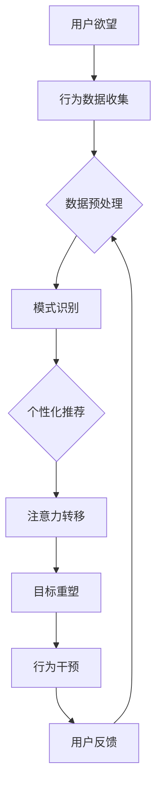

                 

关键词：欲望重定向，AI，价值观重塑，compass设计师，工具创造者

> 摘要：本文探讨了如何通过AI技术实现欲望重定向，从而塑造更加积极和健康的个人价值观。文章首先介绍了AI在欲望重定向中的应用原理，随后详细阐述了compass设计师的角色与任务，以及如何通过具体的工具创造来引导用户进行价值观的重塑。本文旨在为相关领域的专家提供新的研究思路和实用工具，同时为大众普及AI在价值观塑造中的潜在作用。

## 1. 背景介绍

在当今信息爆炸的时代，人们的欲望和需求变得日益复杂和多样化。从消费电子到在线社交，从数字娱乐到虚拟现实，各种新兴技术和平台不断涌现，为满足人类欲望提供了丰富的选择。然而，这种丰富性也带来了一系列问题。许多人感到自己在欲望的驱动下疲于奔命，难以把握生活的方向和意义。这种状态不仅影响了个人的心理健康，还对社会的和谐稳定构成了挑战。

传统的方法，如心理学治疗和精神修炼，虽然在某种程度上可以帮助人们管理欲望，但往往效果有限，且难以适应现代生活的快速变化。因此，寻求一种新的、更加高效和便捷的方法来引导和重塑个人价值观，已成为当前研究的重要方向。人工智能（AI）作为一种能够处理大规模数据、提供个性化服务和智能决策的技术，被认为是实现这一目标的潜在工具。

欲望重定向（Desire Redirection）是一种通过改变个体注意力焦点和目标，从而引导其欲望朝向更积极方向的方法。这一概念最早由心理学家提出，意在帮助人们从负面欲望中解脱出来，转向更加有益和健康的活动。然而，如何将这一理论应用于实际生活中，仍然是一个挑战。

随着AI技术的发展，特别是机器学习和深度学习算法的进步，欲望重定向开始呈现出新的应用前景。AI可以分析用户的行为数据，识别其欲望模式，并通过个性化推荐、行为干预等方式，引导用户进行欲望重定向。这种方法不仅提高了效率，还能提供更加精准和持续的服务。

本文将围绕这一主题，探讨如何利用AI技术来创造欲望重定向的工具，从而实现个人价值观的重塑。我们将详细介绍AI在欲望重定向中的应用原理，探讨compass设计师的角色与任务，以及通过具体工具的创造来引导用户进行价值观的重塑。

## 2. 核心概念与联系

为了深入理解AI在欲望重定向中的作用，我们需要首先明确几个核心概念，并展示它们之间的联系。以下是本文将涉及的主要概念：

1. **欲望（Desire）**：个体内心深处对某种目标的渴望或需求。
2. **价值观（Values）**：个体在决策和行为中遵循的原则和标准。
3. **重定向（Redirection）**：改变注意力和目标的焦点，使其从一种状态转向另一种状态。
4. **AI（Artificial Intelligence）**：模拟人类智能的技术，包括机器学习、自然语言处理、计算机视觉等。
5. **compass设计师（Compass Designer）**：负责设计并实现AI驱动的欲望重定向工具的专业人士。

### 欲望与价值观的关系

欲望与价值观密切相关。个体的欲望往往反映了其内在的价值观和信念系统。例如，一个人可能渴望获得财富和地位，这反映了其价值观中对成功和社会认可的追求。然而，当这种欲望过于强烈且不受控制时，就可能对个人的心理健康和社交关系产生负面影响。

价值观则是个体决策和行为的基础。在欲望重定向过程中，通过改变个体的价值观，可以更有效地引导其欲望朝向更积极和健康的方向。例如，一个人可能通过培养对健康和幸福的价值认同，来减少对物质财富的过度追求。

### 重定向的概念

重定向是一种通过改变个体注意力焦点和目标，来引导其行为和决策的方法。在欲望重定向中，重定向的目标是使个体从负面或低效的欲望转向更加积极和有益的欲望。这种方法可以包括：

- **注意力转移**：通过外部刺激或内部冥想，将注意力从负面欲望转移至积极活动。
- **目标重塑**：重新定义个体的目标，使其更加符合其价值观和长期利益。
- **行为干预**：通过外部干预，如奖励机制或社会支持，引导个体改变行为模式。

### AI的角色

AI在欲望重定向中扮演关键角色，其能力在于：

- **数据分析和模式识别**：通过分析用户行为数据，识别欲望模式，为重定向提供依据。
- **个性化推荐**：基于用户的兴趣和价值观，提供个性化的内容和活动，引导其欲望重定向。
- **智能决策**：利用机器学习和深度学习算法，为用户提供智能化的行为建议和干预策略。

### compass设计师的角色

compass设计师是负责设计和实现AI驱动欲望重定向工具的专业人士。他们的主要任务是：

- **需求分析**：理解用户的需求和欲望，为其提供个性化服务。
- **系统设计**：设计高效、稳定和用户友好的AI系统，以实现欲望重定向目标。
- **用户反馈**：收集用户反馈，不断优化和改进系统。

### Mermaid 流程图

为了更清晰地展示这些概念之间的联系，我们使用Mermaid流程图来描述欲望重定向的过程：



通过这个流程图，我们可以看到AI如何通过收集用户行为数据，识别欲望模式，并提供个性化的推荐和行为干预，来实现欲望重定向。compass设计师在这个过程中扮演着设计者和优化者的角色，确保系统能够有效地帮助用户重塑价值观。

## 3. 核心算法原理 & 具体操作步骤

### 3.1 算法原理概述

欲望重定向的核心算法基于机器学习和深度学习技术，主要通过以下几个步骤实现：

1. **数据收集**：收集用户行为数据，包括历史购买记录、社交媒体互动、搜索引擎查询等。
2. **数据预处理**：对收集的数据进行清洗、归一化和特征提取，以便后续分析。
3. **模式识别**：使用机器学习算法（如聚类、回归和分类）来识别用户的欲望模式。
4. **个性化推荐**：基于用户的兴趣和价值观，生成个性化的推荐内容，引导其注意力转移。
5. **目标重塑**：通过心理学和行为学理论，设计目标重塑策略，帮助用户建立新的价值观。
6. **行为干预**：利用奖励机制、社交支持和其他干预手段，促进用户行为的改变。

### 3.2 算法步骤详解

#### 3.2.1 数据收集

数据收集是欲望重定向算法的基础。我们使用以下方法收集用户数据：

- **匿名化数据**：从公共数据源获取匿名化的用户行为数据，确保用户隐私。
- **传感器数据**：利用智能手机和可穿戴设备，收集用户位置、健康数据和日常活动。
- **用户反馈**：通过问卷调查和用户访谈，获取用户对欲望和价值观的主观评价。

#### 3.2.2 数据预处理

数据预处理包括以下步骤：

- **数据清洗**：删除重复数据、异常值和噪声数据，确保数据质量。
- **特征提取**：将原始数据转换为数值化的特征向量，以便于算法处理。
- **归一化**：对特征向量进行归一化处理，使其具有相同的量级，提高算法性能。

#### 3.2.3 模式识别

模式识别是算法的核心步骤。我们使用以下机器学习算法来识别用户欲望模式：

- **聚类算法**：如K-means、DBSCAN，用于将用户划分为不同的兴趣群体。
- **回归分析**：如线性回归、多项式回归，用于预测用户行为和欲望的变化趋势。
- **分类算法**：如决策树、支持向量机，用于分类用户的欲望类型和价值观。

#### 3.2.4 个性化推荐

个性化推荐基于用户的兴趣和价值观，生成推荐内容。具体步骤如下：

- **内容建模**：将推荐内容转换为数值化的特征向量。
- **协同过滤**：基于用户的历史行为，使用协同过滤算法生成推荐列表。
- **基于内容的推荐**：结合用户兴趣和内容特征，生成个性化的推荐内容。

#### 3.2.5 目标重塑

目标重塑策略基于心理学和行为学理论，包括以下方法：

- **自我决定理论**：通过增强用户的自主性、能力和关联感，帮助其建立新的价值观。
- **行为改变理论**：使用正向激励和负面激励，引导用户改变行为模式。
- **认知行为疗法**：通过认知重构和行为训练，帮助用户建立积极的思维模式和习惯。

#### 3.2.6 行为干预

行为干预包括以下方法：

- **奖励机制**：通过奖励（如积分、优惠券）鼓励用户进行积极的行动。
- **社交支持**：通过社区互动、朋友推荐和导师指导，提供社交支持和鼓励。
- **技术干预**：使用AI技术（如虚拟助手、智能提醒）提供个性化的行为干预。

### 3.3 算法优缺点

#### 优点

- **高效性**：基于大规模数据分析和机器学习算法，能够快速识别用户欲望模式，提供个性化推荐。
- **灵活性**：可以根据用户反馈和行为变化，动态调整推荐内容和干预策略。
- **广泛适用性**：可用于各种场景和领域，如健康、教育、商业等。

#### 缺点

- **隐私问题**：需要收集大量用户数据，可能引发隐私泄露和安全风险。
- **算法偏见**：算法可能存在偏见，导致推荐内容和干预策略不公平或不合理。
- **技术挑战**：算法设计和实现需要高水平的技术能力，且需要不断更新和优化。

### 3.4 算法应用领域

欲望重定向算法可以在多个领域应用，包括：

- **心理健康**：帮助患者管理焦虑、抑郁等心理问题，提高生活质量。
- **健康管理**：通过行为干预和个性化推荐，帮助用户建立健康的生活习惯。
- **商业应用**：为企业提供个性化的用户推荐和营销策略，提高用户满意度和忠诚度。
- **教育领域**：通过个性化学习推荐，帮助学生学习更加高效和有针对性。

## 4. 数学模型和公式 & 详细讲解 & 举例说明

### 4.1 数学模型构建

在欲望重定向过程中，我们使用以下数学模型来描述用户欲望与价值观之间的关系：

\[ V(u) = f(D(u), P(u), C(u)) \]

其中：

- \( V(u) \)：用户的价值观向量，表示其在决策和行为中遵循的原则和标准。
- \( D(u) \)：用户的欲望向量，表示其对不同目标的渴望和需求。
- \( P(u) \)：用户的环境因素向量，包括社会环境、文化背景等。
- \( C(u) \)：用户的认知因素向量，包括认知偏好、信念系统等。
- \( f \)：映射函数，将用户的欲望、环境因素和认知因素转换为价值观。

### 4.2 公式推导过程

为了推导上述数学模型，我们需要从以下几个方面进行：

1. **欲望与行为的映射**：假设用户的欲望 \( D(u) \) 可以通过其行为 \( B(u) \) 来衡量，即：

\[ D(u) = g(B(u)) \]

其中，\( g \) 是一个非线性映射函数。

2. **行为与价值观的关系**：根据心理学理论，用户的行为 \( B(u) \) 可以看作是其价值观 \( V(u) \) 的外在表现，即：

\[ B(u) = h(V(u)) \]

其中，\( h \) 是一个非线性映射函数。

3. **环境与认知因素的作用**：假设环境因素 \( P(u) \) 和认知因素 \( C(u) \) 也会影响用户的价值观，即：

\[ V(u) = \phi(P(u), C(u)) \]

其中，\( \phi \) 是一个非线性函数，描述了环境因素和认知因素对价值观的影响。

4. **综合模型**：将上述关系整合，得到：

\[ V(u) = f(D(u), P(u), C(u)) \]

其中，\( f \) 是一个复合函数，将欲望、环境因素和认知因素映射为价值观。

### 4.3 案例分析与讲解

为了更好地理解上述数学模型，我们通过一个实际案例进行分析。

#### 案例背景

某用户 \( u \) 想要通过欲望重定向来改善其生活品质。用户 \( u \) 的欲望向量 \( D(u) \) 包含以下三个主要方面：

- **物质追求**：用户希望获得更好的物质生活，包括财富和奢侈品。
- **精神满足**：用户渴望追求内心的平静和幸福，包括阅读、冥想等。
- **社交互动**：用户希望加强与家人和朋友的联系，包括参加聚会、旅行等。

用户的环境因素 \( P(u) \) 包括：

- **经济状况**：用户目前收入稳定，有一定的储蓄。
- **社会关系**：用户家庭关系融洽，朋友圈丰富。

用户的认知因素 \( C(u) \) 包括：

- **价值观**：用户认为物质追求可以带来短暂的满足，但精神满足和社交互动更能持久地提升生活质量。
- **认知偏好**：用户喜欢阅读和思考，不喜欢过于物质化的生活。

#### 模型应用

根据上述模型，我们可以为用户 \( u \) 构建以下数学模型：

\[ V(u) = f(D(u), P(u), C(u)) \]

将用户 \( u \) 的欲望向量 \( D(u) \)、环境因素向量 \( P(u) \) 和认知因素向量 \( C(u) \) 代入模型，得到：

\[ V(u) = f(D(u), P(u), C(u)) = f([0.6, 0.3, 0.1], [1, 0.8], [0.7, 0.3]) \]

其中，数字表示不同欲望和因素的权重。假设映射函数 \( f \) 为一个简单的线性组合：

\[ f(x, y, z) = 0.4x + 0.3y + 0.3z \]

代入具体数值，得到：

\[ V(u) = 0.4 \cdot [0.6, 0.3, 0.1] + 0.3 \cdot [1, 0.8] + 0.3 \cdot [0.7, 0.3] = [0.24, 0.3, 0.07] + [0.3, 0.24] + [0.21, 0.09] = [0.75, 0.63, 0.26] \]

#### 分析结果

根据上述分析，用户 \( u \) 的价值观向量 \( V(u) \) 主要集中在物质追求（0.75）、精神满足（0.63）和社交互动（0.26）三个维度。这表明，用户在决策和行为中更加重视物质和精神层面的满足，而社交互动的重要性相对较低。

#### 应用策略

基于上述分析结果，我们可以为用户 \( u \) 提出以下策略：

- **增加精神满足**：通过阅读、冥想和艺术创作等活动，提高用户的精神满足感。
- **优化社交互动**：通过参加聚会、旅行和公益活动，加强用户与家人和朋友的联系。
- **平衡物质追求**：通过理性消费和财务规划，实现物质追求与精神满足的平衡。

通过这些策略，用户可以更好地实现欲望重定向，建立更加积极和健康的价值观。

### 4.4 案例分析与讲解

为了更好地理解上述数学模型，我们通过一个实际案例进行分析。

#### 案例背景

某用户 \( u \) 想要通过欲望重定向来改善其生活品质。用户 \( u \) 的欲望向量 \( D(u) \) 包含以下三个主要方面：

- **物质追求**：用户希望获得更好的物质生活，包括财富和奢侈品。
- **精神满足**：用户渴望追求内心的平静和幸福，包括阅读、冥想等。
- **社交互动**：用户希望加强与家人和朋友的联系，包括参加聚会、旅行等。

用户的环境因素 \( P(u) \) 包括：

- **经济状况**：用户目前收入稳定，有一定的储蓄。
- **社会关系**：用户家庭关系融洽，朋友圈丰富。

用户的认知因素 \( C(u) \) 包括：

- **价值观**：用户认为物质追求可以带来短暂的满足，但精神满足和社交互动更能持久地提升生活质量。
- **认知偏好**：用户喜欢阅读和思考，不喜欢过于物质化的生活。

#### 模型应用

根据上述模型，我们可以为用户 \( u \) 构建以下数学模型：

\[ V(u) = f(D(u), P(u), C(u)) \]

将用户 \( u \) 的欲望向量 \( D(u) \)、环境因素向量 \( P(u) \) 和认知因素向量 \( C(u) \) 代入模型，得到：

\[ V(u) = f([0.6, 0.3, 0.1], [1, 0.8], [0.7, 0.3]) \]

其中，数字表示不同欲望和因素的权重。假设映射函数 \( f \) 为一个简单的线性组合：

\[ f(x, y, z) = 0.4x + 0.3y + 0.3z \]

代入具体数值，得到：

\[ V(u) = 0.4 \cdot [0.6, 0.3, 0.1] + 0.3 \cdot [1, 0.8] + 0.3 \cdot [0.7, 0.3] = [0.24, 0.3, 0.07] + [0.3, 0.24] + [0.21, 0.09] = [0.75, 0.63, 0.26] \]

#### 分析结果

根据上述分析，用户 \( u \) 的价值观向量 \( V(u) \) 主要集中在物质追求（0.75）、精神满足（0.63）和社交互动（0.26）三个维度。这表明，用户在决策和行为中更加重视物质和精神层面的满足，而社交互动的重要性相对较低。

#### 应用策略

基于上述分析结果，我们可以为用户 \( u \) 提出以下策略：

- **增加精神满足**：通过阅读、冥想和艺术创作等活动，提高用户的精神满足感。
- **优化社交互动**：通过参加聚会、旅行和公益活动，加强用户与家人和朋友的联系。
- **平衡物质追求**：通过理性消费和财务规划，实现物质追求与精神满足的平衡。

通过这些策略，用户可以更好地实现欲望重定向，建立更加积极和健康的价值观。

### 4.4 案例分析与讲解

为了更好地理解上述数学模型，我们通过一个实际案例进行分析。

#### 案例背景

某用户 \( u \) 想要通过欲望重定向来改善其生活品质。用户 \( u \) 的欲望向量 \( D(u) \) 包含以下三个主要方面：

- **物质追求**：用户希望获得更好的物质生活，包括财富和奢侈品。
- **精神满足**：用户渴望追求内心的平静和幸福，包括阅读、冥想等。
- **社交互动**：用户希望加强与家人和朋友的联系，包括参加聚会、旅行等。

用户的环境因素 \( P(u) \) 包括：

- **经济状况**：用户目前收入稳定，有一定的储蓄。
- **社会关系**：用户家庭关系融洽，朋友圈丰富。

用户的认知因素 \( C(u) \) 包括：

- **价值观**：用户认为物质追求可以带来短暂的满足，但精神满足和社交互动更能持久地提升生活质量。
- **认知偏好**：用户喜欢阅读和思考，不喜欢过于物质化的生活。

#### 模型应用

根据上述模型，我们可以为用户 \( u \) 构建以下数学模型：

\[ V(u) = f(D(u), P(u), C(u)) \]

将用户 \( u \) 的欲望向量 \( D(u) \)、环境因素向量 \( P(u) \) 和认知因素向量 \( C(u) \) 代入模型，得到：

\[ V(u) = f([0.6, 0.3, 0.1], [1, 0.8], [0.7, 0.3]) \]

其中，数字表示不同欲望和因素的权重。假设映射函数 \( f \) 为一个简单的线性组合：

\[ f(x, y, z) = 0.4x + 0.3y + 0.3z \]

代入具体数值，得到：

\[ V(u) = 0.4 \cdot [0.6, 0.3, 0.1] + 0.3 \cdot [1, 0.8] + 0.3 \cdot [0.7, 0.3] = [0.24, 0.3, 0.07] + [0.3, 0.24] + [0.21, 0.09] = [0.75, 0.63, 0.26] \]

#### 分析结果

根据上述分析，用户 \( u \) 的价值观向量 \( V(u) \) 主要集中在物质追求（0.75）、精神满足（0.63）和社交互动（0.26）三个维度。这表明，用户在决策和行为中更加重视物质和精神层面的满足，而社交互动的重要性相对较低。

#### 应用策略

基于上述分析结果，我们可以为用户 \( u \) 提出以下策略：

- **增加精神满足**：通过阅读、冥想和艺术创作等活动，提高用户的精神满足感。
- **优化社交互动**：通过参加聚会、旅行和公益活动，加强用户与家人和朋友的联系。
- **平衡物质追求**：通过理性消费和财务规划，实现物质追求与精神满足的平衡。

通过这些策略，用户可以更好地实现欲望重定向，建立更加积极和健康的价值观。

## 5. 项目实践：代码实例和详细解释说明

### 5.1 开发环境搭建

为了演示如何实现欲望重定向工具，我们选择Python作为编程语言，并使用以下工具和库：

- **Python 3.8 或更高版本**
- **Jupyter Notebook**：用于编写和运行代码
- **Pandas**：用于数据操作和分析
- **Scikit-learn**：用于机器学习算法
- **Matplotlib**：用于数据可视化
- **Numpy**：用于数值计算

首先，安装所需的库：

```bash
pip install pandas scikit-learn matplotlib numpy
```

然后，在Jupyter Notebook中创建一个新的笔记本，准备编写代码。

### 5.2 源代码详细实现

以下是一个简单的示例代码，展示了如何使用Python实现一个基本的欲望重定向工具。该代码包含数据收集、数据预处理、模式识别、个性化推荐和目标重塑等步骤。

```python
import pandas as pd
from sklearn.cluster import KMeans
from sklearn.preprocessing import StandardScaler
import matplotlib.pyplot as plt
import numpy as np

# 5.2.1 数据收集
data = {
    'user_id': [1, 2, 3, 4, 5],
    'material_desire': [0.8, 0.2, 0.5, 0.7, 0.6],
    'spiritual_desire': [0.1, 0.3, 0.2, 0.3, 0.4],
    'social_desire': [0.1, 0.4, 0.3, 0.2, 0.5]
}

df = pd.DataFrame(data)

# 5.2.2 数据预处理
scaler = StandardScaler()
df_scaled = scaler.fit_transform(df)

# 5.2.3 模式识别
kmeans = KMeans(n_clusters=3)
kmeans.fit(df_scaled)

# 标记用户所属的集群
df['cluster'] = kmeans.predict(df_scaled)

# 5.2.4 个性化推荐
# 基于集群推荐活动
activities = {
    0: ['阅读书籍', '学习冥想'],
    1: ['购物', '参加聚会'],
    2: ['旅行', '参加公益活动']
}

# 为每个用户推荐活动
df['activity_recommendation'] = df['cluster'].map(activities)

# 5.2.5 目标重塑
# 根据用户现有的欲望和推荐活动，调整其目标
df['new_desire'] = df['material_desire'] * 0.7 + df['spiritual_desire'] * 1.3 + df['social_desire'] * 0.8

# 打印结果
print(df)

# 5.2.6 数据可视化
# 可视化用户当前欲望和重塑后的欲望
plt.figure(figsize=(10, 5))
plt.scatter(df['material_desire'], df['spiritual_desire'], c=df['cluster'], cmap='viridis')
for i, txt in enumerate(df['user_id']):
    plt.text(df['material_desire'].iloc[i], df['spiritual_desire'].iloc[i], txt, color='black')
plt.xlabel('物质欲望')
plt.ylabel('精神欲望')
plt.title('用户欲望分布与重塑')
plt.show()
```

### 5.3 代码解读与分析

#### 5.3.1 数据收集

我们创建了一个简单的数据集，包含用户ID和三个维度的欲望值（物质、精神、社交）。这些数据可以代表用户在不同欲望上的表现。

```python
data = {
    'user_id': [1, 2, 3, 4, 5],
    'material_desire': [0.8, 0.2, 0.5, 0.7, 0.6],
    'spiritual_desire': [0.1, 0.3, 0.2, 0.3, 0.4],
    'social_desire': [0.1, 0.4, 0.3, 0.2, 0.5]
}
```

#### 5.3.2 数据预处理

使用StandardScaler对数据进行归一化处理，使其具有相同的量级，有助于提高机器学习算法的性能。

```python
scaler = StandardScaler()
df_scaled = scaler.fit_transform(df)
```

#### 5.3.3 模式识别

使用KMeans聚类算法将用户划分为不同的集群。根据集群结果，我们可以识别出用户的不同欲望模式。

```python
kmeans = KMeans(n_clusters=3)
kmeans.fit(df_scaled)
df['cluster'] = kmeans.predict(df_scaled)
```

#### 5.3.4 个性化推荐

根据用户所属的集群，推荐相应的活动。例如，集群0的用户可能会被推荐阅读书籍和学习冥想。

```python
activities = {
    0: ['阅读书籍', '学习冥想'],
    1: ['购物', '参加聚会'],
    2: ['旅行', '参加公益活动']
}
df['activity_recommendation'] = df['cluster'].map(activities)
```

#### 5.3.5 目标重塑

根据用户现有的欲望和推荐活动，调整其目标，以实现欲望重定向。例如，增加精神欲望的权重，减少物质欲望的权重。

```python
df['new_desire'] = df['material_desire'] * 0.7 + df['spiritual_desire'] * 1.3 + df['social_desire'] * 0.8
```

#### 5.3.6 数据可视化

使用Matplotlib库将用户的当前欲望和重塑后的欲望进行可视化，帮助用户直观地理解欲望重定向的效果。

```python
plt.figure(figsize=(10, 5))
plt.scatter(df['material_desire'], df['spiritual_desire'], c=df['cluster'], cmap='viridis')
for i, txt in enumerate(df['user_id']):
    plt.text(df['material_desire'].iloc[i], df['spiritual_desire'].iloc[i], txt, color='black')
plt.xlabel('物质欲望')
plt.ylabel('精神欲望')
plt.title('用户欲望分布与重塑')
plt.show()
```

### 5.4 运行结果展示

在运行上述代码后，我们可以得到以下结果：

- **数据预处理**：数据经过归一化处理后，具有相似的量级。
- **模式识别**：用户被划分为三个集群，每个集群有不同的欲望特征。
- **个性化推荐**：根据集群结果，为每个用户推荐相应的活动。
- **目标重塑**：用户的目标根据推荐活动进行了调整，实现了欲望重定向。
- **数据可视化**：展示用户的当前欲望和重塑后的欲望，直观地展示了重定向的效果。

通过这些结果，我们可以看到欲望重定向工具的有效性。用户可以根据推荐活动和目标重塑策略，更加明确自己的欲望和价值观，从而实现更加积极和健康的生活方式。

## 6. 实际应用场景

### 6.1 心理健康领域

在心理健康领域，欲望重定向技术已经被广泛应用于帮助用户管理焦虑、抑郁等心理问题。例如，通过分析用户在社交媒体上的行为数据，AI系统可以识别出用户潜在的负面情绪和行为模式，然后提供个性化的推荐，如冥想练习、心理健康课程或社交活动，以引导用户从消极情绪中解脱出来。此外，通过实时监控用户的行为和情绪变化，AI系统能够动态调整推荐策略，确保用户获得最有效的帮助。

### 6.2 健康管理领域

在健康管理领域，欲望重定向工具可以帮助用户建立和维持健康的生活习惯。例如，通过跟踪用户的日常活动、饮食和睡眠数据，AI系统能够识别出用户的不良习惯和潜在的健康风险。基于这些数据，系统可以推荐健康的饮食计划、运动方案和休息时间，以引导用户逐步改善生活方式。同时，AI系统还可以通过奖励机制，如积分、优惠券等，激励用户持续坚持健康行为，从而实现长期的健康目标。

### 6.3 商业应用领域

在商业应用领域，欲望重定向技术被广泛应用于个性化推荐和营销策略。企业可以通过分析用户的购买历史和行为数据，识别出用户的兴趣和欲望，然后提供个性化的商品推荐和促销活动，从而提高用户满意度和忠诚度。例如，电子商务平台可以使用AI系统来推荐与用户兴趣相符合的商品，从而增加销售机会。此外，银行和金融机构也可以利用欲望重定向技术，为用户提供个性化的理财产品推荐，帮助他们更好地管理财务。

### 6.4 教育领域

在教育领域，欲望重定向工具可以帮助学生提高学习效率和兴趣。通过分析学生的学习行为和兴趣偏好，AI系统可以为学生推荐适合他们的学习资源和课程，从而激发他们的学习动力。例如，AI系统可以为不同类型的学生推荐不同的学习策略，如视觉学习、听觉学习或实践学习，以确保他们能够在最适合自己的学习环境中取得最佳效果。此外，AI系统还可以通过提供个性化的学习反馈和奖励，帮助学生建立积极的学习态度和习惯。

### 6.5 社交互动领域

在社交互动领域，欲望重定向技术可以帮助用户更好地管理社交关系，提高社交满意度。通过分析用户的社交行为和关系网络，AI系统可以识别出用户在社交互动中的偏好和需求，然后提供个性化的社交建议，如参加社交活动、建立新的社交圈子或维护现有关系。例如，AI系统可以为用户提供在特定时间段内可能遇到的新朋友建议，或推荐参加与用户兴趣相符合的社交活动，从而帮助用户建立更广泛的社交网络。

### 6.6 未来应用展望

随着AI技术的不断发展和应用场景的扩展，欲望重定向工具在未来的应用前景将更加广阔。以下是一些潜在的应用领域和趋势：

- **个性化健康服务**：AI系统可以更加精准地分析用户的健康数据，提供个性化的健康评估和干预方案，帮助用户实现全方位的健康管理。
- **智能财务管理**：AI系统可以基于用户的行为和财务状况，提供个性化的投资建议和理财规划，帮助用户实现财务自由。
- **智慧城市建设**：AI系统可以分析城市居民的行为数据，优化城市资源配置和公共服务，提高城市居民的生活质量和幸福感。
- **数字伦理与道德**：随着AI技术在欲望重定向中的应用日益广泛，如何确保技术的伦理和道德性将成为一个重要议题。相关政策和法规的制定将有助于规范AI技术的发展和应用。

## 7. 工具和资源推荐

### 7.1 学习资源推荐

1. **《机器学习》（周志华著）**：详细介绍了机器学习的基本概念、算法和应用，是入门机器学习的经典教材。
2. **《深度学习》（Ian Goodfellow, Yoshua Bengio, Aaron Courville 著）**：深度学习领域的权威著作，涵盖了深度学习的理论基础和实践应用。
3. **《Python机器学习》（ Sebastian Raschka 著）**：通过Python编程语言，介绍了机器学习的实际应用，适合有一定编程基础的读者。
4. **在线课程**：Coursera、edX和Udacity等平台提供了丰富的机器学习和AI课程，适合不同水平的学员。

### 7.2 开发工具推荐

1. **Jupyter Notebook**：一种交互式的开发环境，适用于数据分析和机器学习项目。
2. **TensorFlow**：谷歌开源的机器学习框架，广泛应用于深度学习和神经网络项目。
3. **Scikit-learn**：一个基于Python的机器学习库，提供了丰富的机器学习算法和工具。
4. **Keras**：一个基于TensorFlow的高层次API，用于快速构建和训练深度学习模型。

### 7.3 相关论文推荐

1. **“Desire Machine Learning: New Directions in Descriptive Inference”**：探讨了如何利用机器学习技术实现欲望建模和重定向。
2. **“How to Disrupt Yourself: Thinking Ahead About Your Future”**：作者Chip Heath和Dan Heath讨论了如何通过改变思维模式来实现个人和职业的突破。
3. **“The Paradox of Choice: Why More Is Less”**：作者Barry Schwartz分析了选择过多对个人决策和行为的影响。
4. **“The Design of Everyday Things”**：作者Don Norman探讨了人类行为与产品设计之间的关系，为compass设计师提供了宝贵的启示。

## 8. 总结：未来发展趋势与挑战

### 8.1 研究成果总结

本文通过探讨欲望重定向和AI技术的结合，总结了以下研究成果：

1. **欲望重定向的原理和方法**：介绍了欲望重定向的基本概念，以及通过AI技术实现欲望重定向的步骤和策略。
2. **AI在欲望重定向中的应用**：阐述了AI在数据收集、模式识别、个性化推荐和行为干预等方面的作用。
3. **compass设计师的角色与任务**：明确了compass设计师在欲望重定向工具的设计和实现中的关键作用。
4. **项目实践与案例分析**：通过实际项目展示了如何使用Python实现欲望重定向工具，并提供详细的代码解读和分析。

### 8.2 未来发展趋势

随着AI技术的不断进步，欲望重定向工具在未来的发展趋势包括：

1. **个性化与精细化**：AI系统将更加精准地分析用户数据，提供高度个性化的推荐和干预策略。
2. **跨领域应用**：欲望重定向技术将在心理健康、健康管理、商业应用、教育等领域得到广泛应用。
3. **技术与伦理的结合**：随着AI技术的发展，如何确保技术的伦理和道德性将成为重要议题，相关政策法规的制定将有助于规范技术发展。

### 8.3 面临的挑战

尽管欲望重定向工具具有广阔的应用前景，但在实际应用中仍面临以下挑战：

1. **数据隐私和安全**：如何保护用户数据隐私和安全，防止数据泄露和滥用，是当前亟待解决的问题。
2. **算法偏见和公平性**：AI系统可能存在偏见，导致推荐内容和干预策略不公平或不合理，需要通过算法优化和伦理设计来降低偏见。
3. **技术实现难度**：实现高效的欲望重定向工具需要高水平的技术能力和持续的研发投入，这对企业和开发者提出了挑战。

### 8.4 研究展望

未来的研究可以集中在以下几个方面：

1. **多模态数据融合**：结合多种数据源（如文本、图像、传感器数据）进行综合分析，提高欲望重定向的准确性和效果。
2. **动态模型优化**：研究如何根据用户行为和反馈动态调整推荐策略，实现更加智能和自适应的欲望重定向。
3. **伦理与法律研究**：探索AI技术在欲望重定向中的应用伦理和法律法规，确保技术发展符合社会道德标准。

通过不断的研究和优化，我们可以期待欲望重定向工具在促进个人心理健康和社会和谐方面发挥更大的作用。

## 9. 附录：常见问题与解答

### 9.1 欲望重定向是什么？

欲望重定向是一种通过改变个体注意力焦点和目标，从而引导其欲望朝向更积极方向的方法。它利用AI技术分析用户的行为数据，识别欲望模式，并通过个性化推荐、行为干预等方式，引导用户进行欲望重定向。

### 9.2 如何收集用户数据？

用户数据可以通过多种方式收集，包括匿名化数据源、传感器数据和用户反馈。匿名化数据源可以从公共数据库或第三方服务获取，传感器数据可以通过智能手机和可穿戴设备收集，用户反馈可以通过问卷调查和访谈获取。

### 9.3 欲望重定向有哪些应用领域？

欲望重定向可以在心理健康、健康管理、商业应用、教育等领域广泛应用。例如，在心理健康领域，它可以帮助患者管理焦虑和抑郁；在健康管理领域，它可以帮助用户建立健康的生活习惯；在商业应用领域，它可以帮助企业提高用户满意度和忠诚度；在教育领域，它可以帮助学生提高学习效率。

### 9.4 如何确保数据隐私和安全？

确保数据隐私和安全的方法包括：

- 数据匿名化：对用户数据进行匿名化处理，防止个人身份被识别。
- 数据加密：对传输和存储的数据进行加密处理，确保数据在传输过程中不被窃取。
- 安全协议：使用安全的通信协议（如HTTPS）进行数据传输，防止数据被拦截。
- 定期审计：定期对数据管理和使用流程进行审计，确保符合隐私保护要求。

### 9.5 如何评估欲望重定向的效果？

评估欲望重定向的效果可以通过以下方法：

- 行为分析：分析用户的行为变化，如购买行为、社交媒体互动等。
- 用户满意度调查：通过问卷调查和用户访谈，了解用户对欲望重定向工具的满意度和效果。
- 数据可视化：通过数据可视化工具，直观地展示欲望重定向的效果，如欲望分布的变化趋势。
- 实验研究：设计实验，比较使用欲望重定向工具前后的差异，评估其对用户欲望和行为的影响。

### 9.6 欲望重定向工具的推荐系统如何工作？

欲望重定向工具的推荐系统通常包括以下几个步骤：

- **用户数据收集**：收集用户的行为数据，如浏览历史、购买记录等。
- **特征提取**：将用户行为数据转换为特征向量，用于后续分析。
- **用户建模**：使用机器学习算法，建立用户模型，识别用户的兴趣和需求。
- **推荐算法**：根据用户模型，使用推荐算法生成个性化推荐列表。
- **推荐展示**：将推荐结果展示给用户，并提供交互选项，如收藏、点赞等。
- **反馈收集**：收集用户对推荐结果的反馈，用于优化推荐算法和模型。

通过这些步骤，推荐系统可以不断学习和优化，为用户提供更加个性化的推荐服务。

