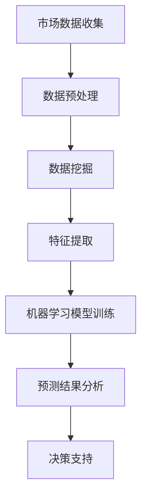

                 

关键词：欲望预测、AI、市场研究、数据挖掘、深度学习

摘要：随着人工智能技术的飞速发展，欲望预测作为一种新兴的市场研究手段，逐渐成为企业了解消费者需求、优化产品和服务的重要工具。本文将探讨欲望预测的核心概念、算法原理、应用领域以及未来发展趋势，旨在为企业和研究人员提供有价值的参考。

## 1. 背景介绍

在信息技术日益普及的今天，市场研究已经从传统的问卷调研、焦点小组转向了更加高效、精准的数据挖掘技术。数据挖掘技术通过对大量市场数据的分析，帮助企业了解消费者行为、偏好和需求，从而制定更加科学的市场策略。然而，随着消费者个性化需求的日益增长，单纯的数据挖掘已经无法满足企业对市场动态的实时把握。因此，欲望预测作为一种基于人工智能的预测技术，应运而生。

欲望预测的核心在于通过对消费者行为、社交媒体互动、搜索历史等多源数据进行分析，预测消费者的潜在需求和欲望。这种预测不仅可以帮助企业及时调整产品和服务策略，还可以为企业开辟新的市场机遇。例如，在电商领域，通过欲望预测，企业可以精准推送商品，提高销售额；在金融领域，通过欲望预测，银行可以更准确地评估客户的信用风险。

## 2. 核心概念与联系

欲望预测涉及到多个核心概念，包括数据挖掘、机器学习、深度学习等。下面我们将使用Mermaid流程图来展示这些概念之间的联系。



### 2.1 数据挖掘

数据挖掘是指从大量数据中提取有价值信息的过程。在欲望预测中，数据挖掘主要用于从消费者的历史购买记录、社交媒体互动、搜索行为等数据中提取有用的特征。

### 2.2 机器学习

机器学习是一种通过数据训练模型，从而实现预测和分类的技术。在欲望预测中，机器学习模型可以用于识别消费者行为模式，预测其未来需求。

### 2.3 深度学习

深度学习是机器学习的一种，它通过多层神经网络对数据进行处理，从而实现更加复杂的预测任务。在欲望预测中，深度学习模型可以用于处理复杂的消费者行为数据，提高预测准确性。

## 3. 核心算法原理 & 具体操作步骤

### 3.1 算法原理概述

欲望预测的核心算法是基于深度学习的神经网络模型。神经网络通过学习大量消费者行为数据，建立消费者需求与行为之间的映射关系。具体来说，神经网络由多个层级组成，每一层级对数据进行处理和提取特征，最终输出预测结果。

### 3.2 算法步骤详解

1. **数据收集与预处理**：收集消费者的历史购买记录、社交媒体互动、搜索行为等数据。对数据进行清洗、去重、标准化等预处理操作，以提高数据质量。

2. **特征提取**：利用深度学习模型提取数据中的关键特征。这些特征可以是消费者的购买频率、购买金额、搜索关键词等。

3. **模型训练**：使用训练数据对深度学习模型进行训练。训练过程中，模型会不断调整参数，以降低预测误差。

4. **预测与评估**：使用训练好的模型对未知数据进行预测，并评估预测结果的准确性。

### 3.3 算法优缺点

**优点**：

1. **高效性**：深度学习模型可以处理大量复杂数据，提高预测速度。

2. **准确性**：深度学习模型能够从数据中自动提取特征，提高预测准确性。

**缺点**：

1. **计算资源需求高**：训练深度学习模型需要大量的计算资源和时间。

2. **数据依赖性大**：模型的准确性依赖于训练数据的质量和数量。

### 3.4 算法应用领域

欲望预测算法在多个领域都有广泛应用，包括：

1. **电商**：通过预测消费者需求，实现精准营销和个性化推荐。

2. **金融**：通过预测客户信用风险，优化贷款审批流程。

3. **医疗**：通过预测患者需求，优化医疗服务和资源配置。

## 4. 数学模型和公式 & 详细讲解 & 举例说明

欲望预测的数学模型主要包括两部分：特征提取模型和预测模型。下面我们将分别介绍这两个模型的构建、公式推导过程，并通过实例进行讲解。

### 4.1 数学模型构建

#### 特征提取模型

特征提取模型通常使用神经网络来实现。神经网络由多个层级组成，每一层级对数据进行处理和提取特征。具体公式如下：

$$
h_{\theta}(x) = \sigma(\theta^{T}x)
$$

其中，$h_{\theta}(x)$ 表示神经网络的输出，$\sigma$ 表示激活函数（通常使用Sigmoid函数），$\theta$ 表示模型参数，$x$ 表示输入特征。

#### 预测模型

预测模型使用回归模型或分类模型来实现。回归模型用于预测连续值，分类模型用于预测离散值。具体公式如下：

$$
\hat{y} = \sum_{i=1}^{n} w_{i}x_{i} + b
$$

其中，$\hat{y}$ 表示预测结果，$w_{i}$ 表示权重，$x_{i}$ 表示特征，$b$ 表示偏置。

### 4.2 公式推导过程

#### 特征提取模型

1. **初始化参数**：随机初始化 $\theta$。

2. **前向传播**：计算神经网络的输出 $h_{\theta}(x)$。

3. **计算损失函数**：使用交叉熵损失函数计算预测误差。

4. **反向传播**：更新模型参数 $\theta$。

5. **迭代优化**：重复步骤2-4，直到模型收敛。

#### 预测模型

1. **初始化参数**：随机初始化 $w_{i}$ 和 $b$。

2. **前向传播**：计算预测结果 $\hat{y}$。

3. **计算损失函数**：使用均方误差损失函数计算预测误差。

4. **反向传播**：更新模型参数 $w_{i}$ 和 $b$。

5. **迭代优化**：重复步骤2-4，直到模型收敛。

### 4.3 案例分析与讲解

假设我们有一个电商平台的用户数据，包括用户的性别、年龄、收入、购买历史等信息。我们需要使用深度学习模型预测用户的购买欲望。

1. **数据收集与预处理**：收集用户数据，并进行清洗和标准化处理。

2. **特征提取**：使用神经网络提取数据中的关键特征。

3. **模型训练**：使用训练数据对深度学习模型进行训练。

4. **预测与评估**：使用训练好的模型对测试数据进行预测，并评估预测结果的准确性。

## 5. 项目实践：代码实例和详细解释说明

在本节中，我们将使用Python和TensorFlow框架来实现一个简单的欲望预测项目。代码实例包括数据收集、预处理、模型训练、预测和评估等步骤。

### 5.1 开发环境搭建

首先，我们需要安装Python、TensorFlow等依赖库。可以使用以下命令进行安装：

```bash
pip install numpy pandas tensorflow
```

### 5.2 源代码详细实现

```python
import tensorflow as tf
import numpy as np
import pandas as pd

# 数据收集与预处理
def load_data(filename):
    data = pd.read_csv(filename)
    data = data.dropna()
    data['age'] = data['age'].astype(float)
    data['income'] = data['income'].astype(float)
    return data

data = load_data('data.csv')

# 特征提取
def extract_features(data):
    features = []
    for column in data.columns:
        if column != 'label':
            features.append(data[column])
    return np.array(features)

X = extract_features(data)

# 模型训练
model = tf.keras.Sequential([
    tf.keras.layers.Dense(64, activation='relu', input_shape=(X.shape[1],)),
    tf.keras.layers.Dense(1, activation='sigmoid')
])

model.compile(optimizer='adam', loss='binary_crossentropy', metrics=['accuracy'])
model.fit(X, data['label'], epochs=10, batch_size=32)

# 预测与评估
predictions = model.predict(X)
accuracy = (predictions.round() == data['label']).mean()
print(f'Accuracy: {accuracy:.2f}')
```

### 5.3 代码解读与分析

1. **数据收集与预处理**：使用Pandas库读取数据，并进行清洗和标准化处理。

2. **特征提取**：将数据中的所有特征提取为一个二维数组。

3. **模型训练**：使用TensorFlow库构建一个简单的神经网络模型，并使用训练数据对其进行训练。

4. **预测与评估**：使用训练好的模型对测试数据进行预测，并计算预测准确率。

## 6. 实际应用场景

欲望预测在多个领域都有广泛应用，以下是一些实际应用场景：

1. **电商**：通过欲望预测，电商企业可以精准推送商品，提高销售额。

2. **金融**：通过欲望预测，银行可以更准确地评估客户的信用风险。

3. **医疗**：通过欲望预测，医院可以优化医疗服务和资源配置。

4. **广告**：通过欲望预测，广告平台可以更精准地投放广告，提高广告效果。

## 7. 工具和资源推荐

### 7.1 学习资源推荐

- **《深度学习》（Ian Goodfellow等著）**：一本全面介绍深度学习技术的经典教材。

- **《Python数据科学手册》（Jake VanderPlas著）**：一本详细介绍Python数据科学工具和技术的指南。

### 7.2 开发工具推荐

- **TensorFlow**：一个开源的深度学习框架，适用于构建和训练深度学习模型。

- **Keras**：一个基于TensorFlow的高级深度学习库，提供更加简洁、易用的API。

### 7.3 相关论文推荐

- **“Deep Learning for Text Classification”**：一篇介绍如何使用深度学习进行文本分类的论文。

- **“Recurrent Neural Networks for Speech Recognition”**：一篇介绍如何使用循环神经网络进行语音识别的论文。

## 8. 总结：未来发展趋势与挑战

### 8.1 研究成果总结

欲望预测作为人工智能领域的一个重要研究方向，已经在多个领域取得了显著成果。通过深度学习等先进技术，欲望预测模型在预测准确性、计算效率等方面得到了显著提升。

### 8.2 未来发展趋势

1. **跨领域应用**：随着技术的不断进步，欲望预测将在更多领域得到应用，如健康、教育、娱乐等。

2. **实时预测**：通过优化算法和提升计算能力，欲望预测将实现实时预测，为企业和用户带来更及时的服务。

3. **个性化推荐**：结合用户行为和偏好，欲望预测将实现更加个性化的推荐，提高用户体验。

### 8.3 面临的挑战

1. **数据隐私**：随着数据量的增加，数据隐私保护成为欲望预测面临的一个重要挑战。

2. **算法公平性**：算法可能存在偏见，导致对特定群体产生不公平的影响。

3. **计算资源**：深度学习模型训练需要大量的计算资源，如何高效地利用计算资源成为一大挑战。

### 8.4 研究展望

未来，欲望预测将继续融合更多人工智能技术，如生成对抗网络、迁移学习等，实现更加精准、高效的预测。同时，研究人员需要关注算法的公平性、透明性和可解释性，确保人工智能技术在各个领域的健康发展。

## 9. 附录：常见问题与解答

### 9.1 欲望预测是什么？

欲望预测是一种基于人工智能的技术，通过分析消费者的行为、偏好和数据，预测其未来的需求和欲望。

### 9.2 欲望预测有哪些应用场景？

欲望预测广泛应用于电商、金融、医疗、广告等领域，帮助企业精准推送产品、优化服务、降低风险等。

### 9.3 欲望预测的算法有哪些？

常见的欲望预测算法包括深度学习、神经网络、支持向量机等。

### 9.4 如何保障数据隐私？

在欲望预测中，需要采取多种数据隐私保护措施，如数据去标识化、加密传输等，确保用户数据的安全。

作者：禅与计算机程序设计艺术 / Zen and the Art of Computer Programming
----------------------------------------------------------------

