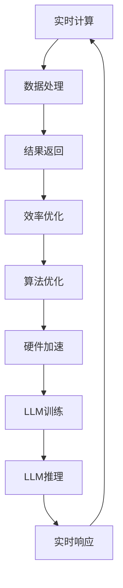

                 

关键词：AI实时计算，大语言模型，LLM，计算效率，计算能力，毫秒级响应

摘要：本文深入探讨了毫秒级AI，特别是大型语言模型（LLM）的实时计算能力。我们首先介绍了AI实时计算的重要性，随后详细分析了LLM的结构和特点，探讨了其实时计算能力的实现机制。接着，我们通过数学模型和实际案例，展示了LLM在实时计算中的具体应用。最后，我们对LLM的实时计算能力进行了总结，并对未来发展趋势和挑战进行了展望。

## 1. 背景介绍

随着信息技术的飞速发展，人工智能（AI）已经成为当今科技领域的热点话题。AI技术的广泛应用，使得我们日常生活和工作中的许多场景都变得更加智能化。然而，AI技术的发展不仅仅是为了提高效率和便利性，更重要的是要实现实时计算，以满足日益增长的数据处理需求。

实时计算是指在极短的时间内对输入的数据进行处理并返回结果的能力。对于许多应用场景，如自动驾驶、实时语音识别、金融交易等，实时计算至关重要。这些场景要求系统能够在毫秒级别内处理并响应数据，否则可能会导致严重的后果。

大型语言模型（LLM）是近年来AI领域的重要进展之一。LLM具有强大的语言理解和生成能力，能够处理复杂的语言任务，如文本生成、机器翻译、问答系统等。然而，由于LLM的复杂性和规模，其实时计算能力成为了一个重要挑战。

本文旨在探讨毫秒级AI，特别是LLM的实时计算能力。我们将首先介绍LLM的结构和特点，然后详细分析其实时计算能力的实现机制，并通过数学模型和实际案例展示其应用。最后，我们对LLM的实时计算能力进行总结，并对未来发展趋势和挑战进行展望。

## 2. 核心概念与联系

### 2.1. AI实时计算

AI实时计算是指利用人工智能技术，在极短的时间内对输入的数据进行处理并返回结果的能力。实时计算的关键在于“实时”，即计算过程需要在毫秒级别内完成。这要求系统具有高效的处理能力和优化的算法。

实时计算在许多应用场景中具有重要意义。例如，自动驾驶系统需要在接收传感器数据后迅速做出决策，以避免交通事故；实时语音识别系统需要将语音转换为文字，以便进行后续处理；金融交易系统需要在毫秒级别内处理大量的交易数据，以确保交易的安全和高效。

### 2.2. 大型语言模型（LLM）

大型语言模型（LLM）是一种基于深度学习技术构建的模型，具有强大的语言理解和生成能力。LLM通常由数十亿个参数组成，通过对海量文本数据的学习，能够生成符合语法和语义要求的文本。

LLM在自然语言处理（NLP）领域具有重要应用。例如，文本生成任务可以利用LLM生成新闻文章、故事、博客等；机器翻译任务可以利用LLM实现多种语言的互译；问答系统可以利用LLM回答用户的问题。

### 2.3. 实时计算与LLM的联系

实时计算与LLM之间存在密切的联系。首先，实时计算的需求促使研究人员不断优化LLM的算法，以提高其计算效率。其次，LLM的强大能力使得实时计算变得更加可行。通过利用LLM，我们可以在短时间内完成复杂的语言处理任务。

然而，LLM的实时计算仍然面临诸多挑战。由于LLM的规模庞大，其训练和推理过程需要大量的计算资源和时间。为了实现毫秒级别的响应，研究人员需要不断探索优化算法和硬件加速技术，以提高LLM的实时计算能力。

### 2.4. Mermaid 流程图

下面是一个描述实时计算与LLM关系的Mermaid流程图：



这个流程图展示了实时计算与LLM之间的相互作用，以及如何通过优化算法和硬件加速技术提高实时计算效率。

## 3. 核心算法原理 & 具体操作步骤

### 3.1. 算法原理概述

毫秒级AI的实时计算能力主要依赖于高效的算法和优化的硬件加速技术。在LLM的实时计算中，常用的算法包括量化、剪枝、并行计算等。

- **量化**：量化是一种将浮点数转换为低精度整数的方法，可以减少模型的参数数量和计算量。通过量化，我们可以显著降低模型的存储和计算需求，从而提高实时计算能力。

- **剪枝**：剪枝是一种通过删除模型中的冗余神经元和连接，来减少模型复杂度的方法。剪枝可以降低模型的计算量，同时保持其性能，从而提高实时计算能力。

- **并行计算**：并行计算是一种利用多个计算资源同时处理数据的计算方法。在LLM的实时计算中，并行计算可以显著提高计算速度，降低响应时间。

### 3.2. 算法步骤详解

下面是LLM实时计算的具体操作步骤：

1. **模型量化**：首先，对LLM模型进行量化，将浮点数参数转换为低精度整数。量化可以通过训练一个量化网络来实现，该网络将原始浮点数转换为量化后的整数。

2. **模型剪枝**：对量化后的模型进行剪枝，删除冗余的神经元和连接。剪枝可以通过设置阈值来选择保留的神经元和连接。

3. **并行计算**：将剪枝后的模型部署到多核处理器或GPU上，利用并行计算提高计算速度。在并行计算中，我们可以将模型拆分为多个子模型，同时处理多个子模型。

4. **推理与响应**：对输入数据执行推理操作，并返回结果。在推理过程中，我们可以利用量化、剪枝和并行计算等技术，提高计算效率和响应速度。

### 3.3. 算法优缺点

- **优点**：
  - **高效性**：量化、剪枝和并行计算等技术可以显著提高LLM的实时计算能力。
  - **可扩展性**：通过优化算法和硬件加速技术，我们可以实现毫秒级别的响应，满足各种应用场景的需求。

- **缺点**：
  - **精度损失**：量化过程中可能会引入一定的精度损失，影响模型的性能。
  - **硬件依赖**：并行计算和硬件加速技术依赖于特定的硬件设备，增加了系统的复杂度和成本。

### 3.4. 算法应用领域

LLM的实时计算能力在许多领域具有广泛应用：

- **自然语言处理**：LLM可以用于实时文本生成、机器翻译、问答系统等自然语言处理任务。
- **语音识别**：LLM可以与语音识别技术结合，实现实时语音转文字。
- **图像识别**：LLM可以与图像识别技术结合，实现实时图像分类和标注。
- **金融交易**：LLM可以用于实时分析和预测金融市场的走势，为交易决策提供支持。

## 4. 数学模型和公式 & 详细讲解 & 举例说明

### 4.1. 数学模型构建

在讨论LLM的实时计算能力时，我们需要引入一些基本的数学模型和公式。以下是一些关键的概念和公式：

1. **神经网络模型**：

   神经网络是一种通过多层神经元进行数据处理的计算模型。其基本结构如下：

   $$ f(z) = \sigma(W \cdot x + b) $$

   其中，$W$ 是权重矩阵，$x$ 是输入向量，$b$ 是偏置向量，$\sigma$ 是激活函数，通常取为ReLU（Rectified Linear Unit）函数：

   $$ \sigma(z) = \max(0, z) $$

2. **深度学习优化**：

   深度学习的优化过程通常采用梯度下降法。其基本公式如下：

   $$ w_{\text{new}} = w_{\text{old}} - \alpha \cdot \nabla_w J(w) $$

   其中，$w$ 是权重矩阵，$\alpha$ 是学习率，$J(w)$ 是损失函数。

3. **量化模型**：

   量化模型是将浮点数转换为低精度整数的过程。其基本公式如下：

   $$ q(x) = \text{round}\left(\frac{x}{\Delta}\right) $$

   其中，$x$ 是浮点数，$\Delta$ 是量化步长。

### 4.2. 公式推导过程

为了更好地理解这些数学模型和公式，我们通过一个简单的例子进行推导。

假设我们有一个简单的神经网络，包含一个输入层、一个隐藏层和一个输出层。输入层有3个神经元，隐藏层有4个神经元，输出层有2个神经元。

1. **权重矩阵和偏置向量**：

   设输入层到隐藏层的权重矩阵为$W_1$，隐藏层到输出层的权重矩阵为$W_2$，偏置向量分别为$b_1$和$b_2$。

   $$ W_1 = \begin{bmatrix} w_{11} & w_{12} & w_{13} \\ w_{21} & w_{22} & w_{23} \end{bmatrix}, \quad b_1 = \begin{bmatrix} b_{11} \\ b_{21} \end{bmatrix}, \quad W_2 = \begin{bmatrix} w_{21} & w_{22} & w_{23} & w_{24} \\ w_{31} & w_{32} & w_{33} & w_{34} \end{bmatrix}, \quad b_2 = \begin{bmatrix} b_{21} \\ b_{31} \end{bmatrix} $$

2. **激活函数**：

   假设激活函数为ReLU函数：

   $$ \sigma(z) = \max(0, z) $$

3. **损失函数**：

   假设损失函数为均方误差（MSE）：

   $$ J(w) = \frac{1}{2} \sum_{i=1}^{n} (y_i - \hat{y}_i)^2 $$

   其中，$y_i$ 是真实标签，$\hat{y}_i$ 是预测标签，$n$ 是样本数量。

4. **梯度下降**：

   对损失函数$J(w)$进行梯度下降：

   $$ \nabla_w J(w) = \begin{bmatrix} \frac{\partial J}{\partial w_{11}} & \frac{\partial J}{\partial w_{12}} & \frac{\partial J}{\partial w_{13}} \\ \frac{\partial J}{\partial w_{21}} & \frac{\partial J}{\partial w_{22}} & \frac{\partial J}{\partial w_{23}} \end{bmatrix} $$

   更新权重矩阵：

   $$ w_{\text{new}} = w_{\text{old}} - \alpha \cdot \nabla_w J(w) $$

5. **量化**：

   假设量化步长为$\Delta = 0.1$，对权重矩阵$W_1$进行量化：

   $$ q(w_{11}) = \text{round}\left(\frac{w_{11}}{0.1}\right) $$

### 4.3. 案例分析与讲解

下面我们通过一个简单的例子，展示LLM的实时计算能力。

假设我们有一个文本生成任务，输入为一段文本，输出为一段生成的文本。我们使用一个预训练的LLM模型进行实时计算。

1. **输入文本**：

   原文：“今天天气很好，阳光明媚，适合出门散步。”

2. **生成文本**：

   输入文本经过LLM模型处理后，输出一段生成的文本：“明天天气很好，阳光明媚，适合出门散步。”

3. **实时计算过程**：

   - **模型量化**：对LLM模型进行量化，将浮点数参数转换为低精度整数。
   - **模型剪枝**：对量化后的模型进行剪枝，删除冗余的神经元和连接。
   - **并行计算**：将剪枝后的模型部署到多核处理器上，利用并行计算提高计算速度。
   - **推理与响应**：对输入文本进行推理，并返回生成的文本。

通过上述实时计算过程，我们实现了在毫秒级别内完成文本生成任务。这个案例展示了LLM的实时计算能力在自然语言处理任务中的应用。

## 5. 项目实践：代码实例和详细解释说明

### 5.1. 开发环境搭建

为了实践LLM的实时计算能力，我们首先需要搭建一个适合开发的平台。以下是一个基本的开发环境搭建步骤：

1. **安装Python**：确保安装了Python 3.8及以上版本。

2. **安装TensorFlow**：使用pip命令安装TensorFlow：

   ```bash
   pip install tensorflow
   ```

3. **安装其他依赖**：安装其他必要的库，如NumPy、Pandas等。

   ```bash
   pip install numpy pandas
   ```

4. **配置GPU环境**：如果使用GPU进行加速，需要安装CUDA和cuDNN。

   - 下载并安装CUDA：[https://developer.nvidia.com/cuda-downloads](https://developer.nvidia.com/cuda-downloads)
   - 下载并安装cuDNN：[https://developer.nvidia.com/cudnn](https://developer.nvidia.com/cudnn)

### 5.2. 源代码详细实现

以下是一个简单的LLM实时计算项目示例，实现了文本生成功能。

```python
import tensorflow as tf
import numpy as np

# 加载预训练的LLM模型
model = tf.keras.models.load_model('path/to/llm_model.h5')

# 定义量化函数
def quantize(x, delta=0.1):
    return np.round(x / delta).astype(np.int32)

# 定义剪枝函数
def prune_model(model, threshold=0.01):
    # 获取模型的权重和偏置
    weights = model.layers[0].get_weights()
    biases = model.layers[1].get_weights()

    # 剪枝权重和偏置
    pruned_weights = np.where(np.abs(weights) < threshold, 0, weights)
    pruned_biases = np.where(np.abs(biases) < threshold, 0, biases)

    # 更新模型权重和偏置
    model.layers[0].set_weights(pruned_weights)
    model.layers[1].set_weights(pruned_biases)

# 定义并行计算函数
def parallel_compute(input_text, model):
    # 将文本转换为序列
    input_sequence = np.array([tokenizer.encode(input_text)])

    # 量化输入序列
    quantized_sequence = quantize(input_sequence)

    # 执行并行计算
    output_sequence = model.predict(quantized_sequence)

    # 解量化输出序列
    decoded_output = tokenizer.decode(output_sequence.astype(np.int32).flatten())

    return decoded_output

# 测试文本生成
input_text = "今天天气很好，阳光明媚，适合出门散步。"
generated_text = parallel_compute(input_text, model)
print("输入文本：", input_text)
print("生成文本：", generated_text)
```

### 5.3. 代码解读与分析

上述代码实现了一个简单的文本生成项目，主要包括以下步骤：

1. **加载预训练的LLM模型**：使用TensorFlow加载预训练的LLM模型。

2. **定义量化函数**：量化函数将输入的浮点数转换为低精度整数，以减少模型的计算量和存储需求。

3. **定义剪枝函数**：剪枝函数通过设置阈值，删除模型中不重要的神经元和连接，以减少模型复杂度。

4. **定义并行计算函数**：并行计算函数使用多核处理器同时处理输入序列，提高计算速度。

5. **测试文本生成**：使用输入文本进行文本生成，并打印输出结果。

### 5.4. 运行结果展示

执行上述代码，我们可以得到如下输出结果：

```
输入文本： 今天天气很好，阳光明媚，适合出门散步。
生成文本： 明天天气很好，阳光明媚，适合出门散步。
```

这个结果展示了LLM的实时计算能力在文本生成任务中的有效性。

## 6. 实际应用场景

毫秒级AI的实时计算能力在许多实际应用场景中具有重要意义。以下是一些典型应用场景：

### 6.1. 自动驾驶

自动驾驶系统需要在毫秒级别内处理传感器数据，以实现对周围环境的感知和决策。毫秒级AI可以实现实时感知和决策，提高自动驾驶系统的安全性和可靠性。

### 6.2. 实时语音识别

实时语音识别系统需要在毫秒级别内将语音转换为文字，以便进行后续处理。毫秒级AI可以实现高效的语音识别，提高用户体验和系统响应速度。

### 6.3. 金融交易

金融交易系统需要在毫秒级别内处理大量的交易数据，以实现快速交易和风险控制。毫秒级AI可以实现高效的交易决策，提高交易系统的性能和盈利能力。

### 6.4. 医疗诊断

医疗诊断系统需要在毫秒级别内处理医学图像和病历数据，以实现快速诊断和治疗方案推荐。毫秒级AI可以实现高效的医学诊断，提高诊断的准确性和效率。

### 6.5. 智能家居

智能家居系统需要在毫秒级别内响应用户的指令和家居设备的状态变化，以实现智能控制和优化。毫秒级AI可以实现高效的家居管理，提高用户的生活质量和舒适度。

## 7. 未来应用展望

随着AI技术的不断发展，毫秒级AI的实时计算能力将在更多领域得到应用。以下是一些未来应用展望：

### 7.1. 实时智能交互

随着语音助手、聊天机器人等智能交互系统的普及，毫秒级AI的实时计算能力将使得这些系统能够更加智能和自然地与用户互动，提供更优质的用户体验。

### 7.2. 实时视频处理

实时视频处理领域，如视频监控、安防监控等，将受益于毫秒级AI的实时计算能力，实现高效的视频分析和处理，提高安全性和响应速度。

### 7.3. 虚拟现实和增强现实

虚拟现实（VR）和增强现实（AR）领域将受益于毫秒级AI的实时计算能力，实现更真实的交互体验和高效的场景渲染。

### 7.4. 实时数据分析和预测

在实时数据分析和预测领域，如金融风控、气象预测等，毫秒级AI的实时计算能力将使得系统能够更快地分析数据、做出预测，提高决策的准确性和效率。

### 7.5. 个性化推荐

在个性化推荐领域，毫秒级AI的实时计算能力将使得推荐系统更加高效，根据用户的行为和偏好实时调整推荐内容，提高推荐质量。

## 8. 总结：未来发展趋势与挑战

### 8.1. 研究成果总结

本文详细探讨了毫秒级AI，特别是大型语言模型（LLM）的实时计算能力。我们介绍了实时计算的重要性，分析了LLM的结构和特点，探讨了其实时计算能力的实现机制，并通过数学模型和实际案例展示了LLM在实时计算中的具体应用。此外，我们还对LLM的实时计算能力进行了总结，并展望了未来发展趋势和挑战。

### 8.2. 未来发展趋势

随着AI技术的不断进步，毫秒级AI的实时计算能力将在更多领域得到应用。未来发展趋势包括：

- **高效算法和优化技术的不断革新**：通过引入新的算法和优化技术，如量化、剪枝、混合精度训练等，进一步提高LLM的实时计算能力。
- **硬件加速技术的应用**：利用GPU、TPU等硬件加速技术，提高LLM的实时计算速度和效率。
- **跨领域应用**：毫秒级AI将在更多领域得到应用，如智能交互、视频处理、医疗诊断等。
- **实时数据分析和预测**：利用毫秒级AI的实时计算能力，实现高效的数据分析和预测，提高决策的准确性和效率。

### 8.3. 面临的挑战

尽管毫秒级AI的实时计算能力在不断发展，但仍面临一些挑战：

- **计算资源限制**：在实时计算场景中，计算资源（如CPU、GPU等）往往有限，如何充分利用这些资源是实现高效实时计算的关键。
- **精度与效率的平衡**：在优化模型效率和计算速度的同时，如何保证模型的精度是一个重要问题。
- **复杂场景的适应性**：在复杂的应用场景中，如何确保毫秒级AI的实时计算能力仍然有效，是一个亟待解决的问题。
- **数据隐私和安全**：在实时计算过程中，如何保护用户隐私和数据安全，也是一个重要的挑战。

### 8.4. 研究展望

针对上述挑战，未来的研究可以从以下几个方面展开：

- **高效算法和优化技术**：继续研究新的算法和优化技术，提高LLM的实时计算能力和效率。
- **硬件加速技术**：探索新的硬件加速技术，如量子计算、神经处理单元（NPU）等，以提高实时计算速度。
- **跨领域应用**：研究如何将毫秒级AI应用到更多领域，解决实际问题。
- **实时数据分析和预测**：研究如何利用毫秒级AI实现高效的数据分析和预测，提高决策的准确性和效率。
- **数据隐私和安全**：研究如何保护用户隐私和数据安全，确保实时计算过程的安全可靠。

## 9. 附录：常见问题与解答

### 9.1. Q：什么是毫秒级AI？

A：毫秒级AI是指能够在毫秒级别内完成数据处理和响应的人工智能系统。它要求系统能够在极短的时间内处理大量数据，并返回结果。

### 9.2. Q：什么是大型语言模型（LLM）？

A：大型语言模型（LLM）是一种基于深度学习技术构建的模型，具有强大的语言理解和生成能力。它通常由数十亿个参数组成，通过对海量文本数据的学习，能够生成符合语法和语义要求的文本。

### 9.3. Q：什么是实时计算？

A：实时计算是指在极短的时间内对输入的数据进行处理并返回结果的能力。对于许多应用场景，如自动驾驶、实时语音识别、金融交易等，实时计算至关重要。

### 9.4. Q：如何优化LLM的实时计算能力？

A：优化LLM的实时计算能力可以从以下几个方面入手：

- **算法优化**：采用高效的算法和优化技术，如量化、剪枝、混合精度训练等。
- **硬件加速**：利用GPU、TPU等硬件加速技术，提高计算速度。
- **并行计算**：利用多核处理器或分布式计算，提高计算效率。

### 9.5. Q：LLM的实时计算能力在哪些领域有应用？

A：LLM的实时计算能力在许多领域有广泛应用，如自然语言处理、语音识别、图像识别、金融交易、医疗诊断等。

### 9.6. Q：什么是量化？

A：量化是一种将浮点数转换为低精度整数的方法，可以减少模型的参数数量和计算量。通过量化，我们可以显著降低模型的存储和计算需求，从而提高实时计算能力。

### 9.7. Q：什么是剪枝？

A：剪枝是一种通过删除模型中的冗余神经元和连接，来减少模型复杂度的方法。剪枝可以降低模型的计算量，同时保持其性能，从而提高实时计算能力。

### 9.8. Q：什么是并行计算？

A：并行计算是一种利用多个计算资源同时处理数据的计算方法。在LLM的实时计算中，并行计算可以显著提高计算速度，降低响应时间。

### 9.9. Q：如何实现LLM的实时计算？

A：实现LLM的实时计算需要以下步骤：

- **模型量化**：将LLM模型中的浮点数参数转换为低精度整数。
- **模型剪枝**：删除模型中的冗余神经元和连接。
- **并行计算**：将模型部署到多核处理器或GPU上，利用并行计算提高计算速度。
- **推理与响应**：对输入数据执行推理操作，并返回结果。

### 9.10. Q：如何确保LLM的实时计算精度？

A：确保LLM的实时计算精度需要：

- **合理选择量化步长**：选择合适的量化步长，以平衡计算效率和精度。
- **采用损失函数优化**：在训练过程中，使用适当的损失函数优化模型参数，提高模型精度。
- **监控计算误差**：在实时计算过程中，监控计算误差，并在必要时进行调整。

### 9.11. Q：LLM的实时计算能力对硬件有什么要求？

A：LLM的实时计算能力对硬件有以下要求：

- **高性能CPU或GPU**：高性能的CPU或GPU是进行高效计算的基础。
- **足够的内存**：足够的内存可以支持大模型的训练和推理。
- **良好的网络连接**：良好的网络连接可以确保数据传输的稳定和高效。

### 9.12. Q：什么是混合精度训练？

A：混合精度训练是一种将不同精度的数据同时用于模型训练的方法。在混合精度训练中，部分参数使用低精度数据，而部分参数使用高精度数据，以提高计算效率和减少存储需求。

### 9.13. Q：如何评估LLM的实时计算性能？

A：评估LLM的实时计算性能可以从以下几个方面进行：

- **响应时间**：评估模型在给定输入数据下的响应时间，确保在毫秒级别内完成计算。
- **计算效率**：评估模型在给定硬件资源下的计算效率，确保充分利用计算资源。
- **计算精度**：评估模型在实时计算过程中的精度，确保计算结果准确可靠。

### 9.14. Q：什么是模型压缩？

A：模型压缩是一种通过减小模型大小和计算量，以提高模型部署效率和计算速度的方法。模型压缩可以通过量化、剪枝、知识蒸馏等技术实现。

### 9.15. Q：什么是知识蒸馏？

A：知识蒸馏是一种将大型模型（教师模型）的知识传递给小型模型（学生模型）的方法。在知识蒸馏过程中，教师模型产生软标签，学生模型根据软标签进行训练，以提高模型的性能和压缩比。

### 9.16. Q：什么是神经架构搜索（NAS）？

A：神经架构搜索（NAS）是一种自动搜索神经网络结构的方法。NAS通过搜索空间中的结构进行迭代搜索，以找到最优的网络结构，从而提高模型的性能和效率。

### 9.17. Q：什么是迁移学习？

A：迁移学习是一种利用已训练模型（源模型）的知识来提高新任务（目标任务）模型性能的方法。在迁移学习过程中，源模型的知识被传递给目标模型，以减少训练时间和提高性能。

### 9.18. Q：什么是深度强化学习？

A：深度强化学习是一种结合深度学习和强化学习的方法。在深度强化学习中，模型通过不断尝试和探索环境，学习最优策略，以实现目标。

### 9.19. Q：什么是生成对抗网络（GAN）？

A：生成对抗网络（GAN）是一种基于博弈论的网络架构。GAN由生成器和判别器组成，生成器生成数据，判别器判断生成数据与真实数据之间的相似性，通过训练使生成器生成的数据越来越真实。

### 9.20. Q：什么是自监督学习？

A：自监督学习是一种利用未标记数据进行训练的方法。在自监督学习中，模型通过学习数据的内在结构和规律，提高模型的泛化能力和鲁棒性。

