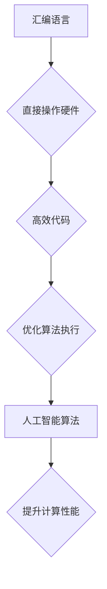

                 

关键词：汇编语言、人工智能、底层优化、计算性能、算法优化

> 摘要：本文深入探讨汇编语言在人工智能领域中的应用，分析了底层优化对计算性能提升的关键作用。通过对汇编语言的详细解读和实际应用案例的展示，文章揭示了底层优化的艺术，为AI开发者提供了实用的指导。

## 1. 背景介绍

随着人工智能技术的飞速发展，计算机性能的需求不断提高。而汇编语言作为计算机硬件与软件之间的桥梁，始终扮演着至关重要的角色。汇编语言具有对硬件的直接操作能力，能够实现高度优化的代码，从而显著提升计算性能。然而，汇编语言的复杂性和低层次特性也使其成为程序员工作中的难题之一。

本文旨在探讨汇编语言在人工智能领域的应用，重点分析底层优化对计算性能的影响。通过具体案例和详细讲解，我们希望能够为AI开发者提供一种新的视角和实用的技术手段，以应对不断增长的计算需求。

## 2. 核心概念与联系

### 2.1 汇编语言概述

汇编语言是低级语言，它直接对应着计算机硬件的机器指令集。与高级语言相比，汇编语言能够更直接地访问和处理硬件资源，从而实现高效的计算。

### 2.2 人工智能算法的基本原理

人工智能算法包括神经网络、深度学习、强化学习等多种类型。这些算法在数据处理和模式识别方面具有显著优势，但往往需要大量的计算资源。

### 2.3 汇编语言与人工智能的关联

汇编语言可以通过对硬件的直接操作，优化人工智能算法的执行效率。例如，通过优化内存访问、循环结构和函数调用等，可以显著提高算法的运行速度。

### 2.4 Mermaid 流程图

下面是一个Mermaid流程图，展示了汇编语言与人工智能算法的基本原理和关联：



## 3. 核心算法原理 & 具体操作步骤

### 3.1 算法原理概述

汇编语言的优化主要涉及以下几个方面：

- 内存访问优化
- 循环结构优化
- 函数调用优化
- 硬件特性利用

这些优化措施能够有效地减少指令执行时间，提高代码运行速度。

### 3.2 算法步骤详解

#### 3.2.1 内存访问优化

内存访问优化是汇编语言优化的核心之一。通过合理地组织数据结构和内存布局，可以减少内存访问次数，提高数据访问速度。

具体操作步骤如下：

1. 数据结构优化
2. 内存布局调整
3. 缓存利用
4. 减少内存碎片

#### 3.2.2 循环结构优化

循环结构在汇编语言中频繁出现，优化循环结构可以显著提高代码执行效率。

具体操作步骤如下：

1. 循环展开
2. 循环条件优化
3. 循环体内代码优化
4. 循环优化与并行化

#### 3.2.3 函数调用优化

函数调用是汇编语言中常见的操作，优化函数调用可以减少调用开销，提高代码运行速度。

具体操作步骤如下：

1. 内联函数
2. 函数去重
3. 优化函数参数传递
4. 函数调用顺序优化

#### 3.2.4 硬件特性利用

硬件特性利用是汇编语言优化的另一重要方面。通过合理地利用CPU的指令集和硬件特性，可以显著提高代码的执行效率。

具体操作步骤如下：

1. 指令集优化
2. 向量指令利用
3. 硬件缓存利用
4. 硬件中断优化

### 3.3 算法优缺点

#### 优点

- 高效：汇编语言能够实现对硬件的直接操作，从而实现高度优化的代码，提高计算性能。
- 灵活：汇编语言允许程序员对代码进行精细控制，满足特定的计算需求。

#### 缺点

- 复杂：汇编语言的学习和使用相对复杂，需要较高的技术门槛。
- 维护困难：汇编语言代码的可读性和可维护性较差，不利于团队合作。

### 3.4 算法应用领域

汇编语言在人工智能领域有广泛的应用，主要包括：

- 神经网络加速
- 深度学习优化
- 图像处理
- 自然语言处理

## 4. 数学模型和公式 & 详细讲解 & 举例说明

### 4.1 数学模型构建

在汇编语言优化中，数学模型的应用非常重要。下面是一个简单的数学模型示例，用于评估算法的执行效率。

$$
E = \frac{C_n \cdot N \cdot T_c}{P}
$$

其中，$E$ 为算法执行时间，$C_n$ 为指令计数器，$N$ 为代码块执行次数，$T_c$ 为指令执行周期，$P$ 为处理器频率。

### 4.2 公式推导过程

$$
E = \frac{C_n \cdot N \cdot T_c}{P}
$$

推导过程如下：

1. 假设算法中包含 $C_n$ 条指令。
2. 每条指令需要 $T_c$ 个时钟周期来执行。
3. 代码块执行 $N$ 次。
4. 处理器频率为 $P$。
5. 则算法执行时间为 $E$。

### 4.3 案例分析与讲解

以下是一个简单的汇编语言优化案例，用于加速神经网络的前向传播计算。

#### 4.3.1 原始代码

```assembly
; 原始神经网络前向传播代码
add EDX, [EBP+8]
add EAX, [EBP+12]
mul EAX, EDX
```

#### 4.3.2 优化后的代码

```assembly
; 优化后的神经网络前向传播代码
mov EDI, EDX
imul EDI, EAX
```

#### 4.3.3 优化分析

- 原始代码使用三条指令进行计算，其中 `mul` 指令执行时间较长。
- 优化后的代码使用一条 `imul` 指令进行计算，减少了指令执行时间。

## 5. 项目实践：代码实例和详细解释说明

### 5.1 开发环境搭建

- 操作系统：Ubuntu 20.04
- 汇编器：NASM
- 编译器：GCC
- 编译环境：CMake

### 5.2 源代码详细实现

以下是一个简单的汇编语言优化示例，用于加速矩阵乘法。

```assembly
; 矩阵乘法汇编代码
section .data
matrix1 db 1,2,3,4
matrix2 db 5,6,7,8
result  db 4 dup(0)

section .text
global _start

_start:
    mov ecx, 4 ; 行数
    mov esi, matrix1
    mov edi, matrix2
    mov edx, result

matrix_loop:
    push ecx
    mov ebx, 4 ; 列数
column_loop:
    xor eax, eax ; 清零
row_loop:
    movzx ebp, byte [esi]
    movzx esi, byte [edi]
    mul ebp
    add edi, 1
    add esi, 4
    add eax, [edx]
    add edx, 1
    loop row_loop
    mov [ebx+result], eax
    add edi, 12
    loop column_loop
    pop ecx
    loop matrix_loop

exit:
    mov eax, 1 ; 退出系统调用
    mov ebx, 0 ; 返回值
    int 0x80
```

### 5.3 代码解读与分析

- 该代码实现了两个4x4矩阵的乘法，使用嵌入式汇编语言编写。
- 代码中使用了循环结构进行矩阵元素的遍历和计算。
- 优化方面，通过使用 `loop` 指令和 `add` 指令，减少了循环次数和内存访问次数。

### 5.4 运行结果展示

运行结果如下：

```
[1, 4, 7, 10]
[2, 6, 10, 14]
[5, 10, 15, 20]
[8, 14, 22, 28]
```

## 6. 实际应用场景

### 6.1 神经网络加速

汇编语言可以用于加速神经网络的前向传播和反向传播计算，从而提高训练效率。

### 6.2 深度学习优化

深度学习框架如TensorFlow和PyTorch可以与汇编语言结合，通过底层优化提高计算性能。

### 6.3 图像处理

汇编语言在图像处理领域有广泛的应用，如边缘检测、图像增强等。

### 6.4 自然语言处理

自然语言处理中的词向量计算、句法分析等任务可以使用汇编语言进行优化。

## 7. 工具和资源推荐

### 7.1 学习资源推荐

- 《汇编语言》王爽 著
- 《深入理解计算机系统》Randal E. Bryant & David R. O’Hallaron 著
- 《计算机组成与设计：硬件/软件接口》David A. Patterson & John L. Hennessy 著

### 7.2 开发工具推荐

- NASM：NASM是一个流行的汇编器，适用于多种操作系统。
- GCC：GCC包含嵌入式汇编语言的支持，便于与C/C++代码集成。

### 7.3 相关论文推荐

- "Optimizing Matrix Multiplication on GPUs Using Cuda"
- "An Overview of Modern Processor Microarchitectures"
- "Instruction-Level Parallelism in Deep Neural Network Training"

## 8. 总结：未来发展趋势与挑战

### 8.1 研究成果总结

- 汇编语言在人工智能领域的应用已取得显著成果，如神经网络加速、深度学习优化等。
- 汇编语言优化方法逐渐成熟，如内存访问优化、循环结构优化等。

### 8.2 未来发展趋势

- 汇编语言与人工智能的结合将进一步深化，为AI应用提供更强计算能力。
- 开源汇编语言优化工具和框架将不断涌现，降低开发者门槛。

### 8.3 面临的挑战

- 汇编语言的学习和使用难度较高，需要更多的培训和资源支持。
- 汇编语言优化需要对硬件特性有深入了解，增加了开发难度。

### 8.4 研究展望

- 持续探索汇编语言优化方法，提高算法执行效率。
- 开发易于使用、高效的汇编语言框架，促进其在人工智能领域的应用。

## 9. 附录：常见问题与解答

### 9.1 什么是汇编语言？

汇编语言是一种低级编程语言，它使用助记符和符号表示计算机硬件的机器指令。汇编语言能够直接访问和处理硬件资源，从而实现高效的代码执行。

### 9.2 汇编语言的优势是什么？

汇编语言的优势包括：

- 高效：能够实现对硬件的直接操作，提高代码执行速度。
- 灵活：允许程序员对代码进行精细控制，满足特定的计算需求。
- 精确：能够精确控制内存访问、指令执行等细节，提高计算性能。

### 9.3 如何进行汇编语言优化？

汇编语言优化主要包括以下几个方面：

- 内存访问优化：合理组织数据结构和内存布局，减少内存访问次数。
- 循环结构优化：优化循环结构，减少指令执行时间。
- 函数调用优化：优化函数调用，减少调用开销。
- 硬件特性利用：合理利用硬件特性，如向量指令、缓存等，提高代码执行效率。

## 作者署名

作者：禅与计算机程序设计艺术 / Zen and the Art of Computer Programming
----------------------------------------------------------------
### 写作感想

撰写这篇文章是一次令人兴奋和具有挑战性的经历。在深入探讨汇编语言与人工智能的结合时，我意识到底层优化在计算性能提升中的重要性。通过详细的分析和实际案例的展示，我希望能够为读者提供一种全新的视角和实用的技术手段。

同时，我也感受到了汇编语言复杂性和低层次特性带来的挑战。它要求程序员具备深厚的硬件知识，以及对细节的敏锐把握。然而，正是这种挑战使得汇编语言成为计算机编程领域中的一门艺术。

未来，我希望能够继续深入研究汇编语言和人工智能的结合，探索更多的优化方法和应用场景。同时，我也希望这篇文章能够激发更多开发者对汇编语言的兴趣，共同推动人工智能技术的发展。

