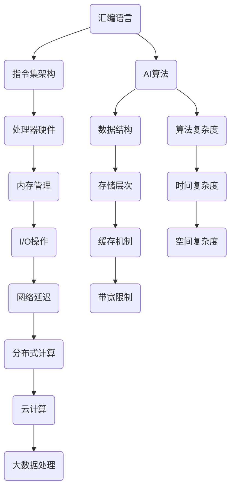

                 

关键词：汇编语言、AI、底层优化、编程技巧、算法效率、性能提升

> 摘要：本文将探讨汇编语言在AI领域的应用，以及如何通过底层优化技术提升AI算法的性能。我们将深入分析汇编语言的核心原理，介绍AI算法在汇编语言环境下的优化策略，并展示一系列实际案例，帮助读者掌握底层优化的艺术。

## 1. 背景介绍

汇编语言作为计算机编程的基础，历史悠久且仍广泛应用于嵌入式系统、实时系统以及高性能计算等领域。尽管高级编程语言如Python、C++等占据了主流，但汇编语言在底层优化方面仍具有不可替代的优势。特别是在AI领域，算法性能的微小提升往往意味着显著的效率改进，这使得汇编语言的应用变得尤为重要。

AI领域的发展离不开高效的算法和底层优化。随着深度学习模型的复杂度不断增加，对计算资源的需求也日益增长。在这种情况下，如何通过底层优化提升AI算法的性能成为一个关键问题。而汇编语言凭借其接近硬件的特性，能够提供精细的指令级优化，从而在性能瓶颈上取得突破。

本文将探讨汇编语言在AI领域中的应用，从核心原理到实际操作，从数学模型到代码实现，全面解析底层优化的艺术。通过本文，读者将了解到如何利用汇编语言对AI算法进行优化，提高算法的效率和准确性。

## 2. 核心概念与联系

在深入探讨汇编语言与AI优化的关系之前，我们需要了解一些核心概念和原理。这些概念包括汇编语言的基本结构、指令集架构、以及AI算法的基本原理。以下是一个Mermaid流程图，展示了这些核心概念和它们之间的联系。



### 2.1 汇编语言的基本结构

汇编语言是一种低级编程语言，它直接操作计算机的硬件资源。汇编语言的基本结构包括：

- **指令**：汇编语言中的基本操作命令，如加法、减法、数据传输等。
- **寄存器**：计算机中用于存储临时数据和地址的内存单元。
- **内存管理**：汇编语言控制内存分配、释放和访问的机制。
- **宏指令**：将一组汇编指令打包成一个可重用的指令。

### 2.2 指令集架构

指令集架构（ISA）是处理器设计的核心部分，它定义了处理器能够理解和执行的指令集。常见的指令集架构包括：

- **RISC（精简指令集计算机）**：以简单、高效的指令集和较少的内存访问操作为特点。
- **CISC（复杂指令集计算机）**：提供了复杂的指令集，能够直接执行多个操作。

### 2.3 AI算法的基本原理

AI算法基于大量的数据训练，以实现智能行为。其主要原理包括：

- **机器学习**：通过学习数据模式来预测结果。
- **深度学习**：利用多层神经网络进行数据建模。
- **强化学习**：通过试错学习来优化决策过程。

### 2.4 汇编语言与AI算法的联系

汇编语言与AI算法之间的联系主要体现在底层优化上。通过汇编语言，我们可以：

- **精细控制指令执行**：优化算法的执行路径，减少不必要的指令。
- **高效使用寄存器**：提高数据处理速度。
- **优化内存访问**：减少内存访问延迟，提高算法效率。

## 3. 核心算法原理 & 具体操作步骤

### 3.1 算法原理概述

在AI领域，常见的算法优化技术包括：

- **指令调度**：优化指令的执行顺序，减少流水线冲突。
- **循环展开**：将循环体内的代码展开，减少循环控制指令。
- **函数内联**：将函数调用改为直接调用函数体，减少调用开销。
- **数据缓存优化**：优化数据访问模式，利用缓存提高访问速度。

### 3.2 算法步骤详解

下面我们将详细描述如何使用汇编语言对AI算法进行优化。

#### 3.2.1 指令调度

指令调度是优化指令执行顺序的重要技术。通过调度，我们可以减少流水线冲突，提高指令执行效率。

```assembly
; 示例：指令调度减少流水线冲突
mov ax, [bx]
add ax, [bp]
mov [bx], ax
```

在上面的代码中，我们将两个内存访问指令进行了交换，以减少流水线冲突。

#### 3.2.2 循环展开

循环展开可以减少循环控制指令，提高代码执行效率。

```assembly
; 示例：循环展开减少循环控制指令
mov ecx, 10
loop_start:
add eax, [ebx]
loop loop_start
```

在上面的代码中，我们通过展开循环，将循环控制指令替换为具体的循环体代码。

#### 3.2.3 函数内联

函数内联可以将函数调用改为直接调用函数体，减少调用开销。

```assembly
; 示例：函数内联减少调用开销
call my_function
ret
```

在上面的代码中，我们将函数调用改为直接调用函数体，减少了调用和返回指令的开销。

#### 3.2.4 数据缓存优化

数据缓存优化可以通过优化数据访问模式，利用缓存提高访问速度。

```assembly
; 示例：数据缓存优化利用缓存提高访问速度
mov eax, [ebx + 8]
add [ebx + 8], eax
```

在上面的代码中，我们通过调整内存访问模式，利用缓存提高访问速度。

### 3.3 算法优缺点

汇编语言优化的优点包括：

- **高性能**：通过底层优化，提高算法执行效率。
- **灵活性强**：可以直接控制硬件资源，实现精细的优化。
- **适用范围广**：适用于多种处理器架构和操作系统。

但汇编语言优化也存在缺点：

- **开发难度大**：需要深入理解硬件架构和指令集。
- **可维护性差**：代码可读性较差，维护困难。
- **平台依赖性强**：需要针对不同的处理器和操作系统进行优化。

### 3.4 算法应用领域

汇编语言优化在AI领域有着广泛的应用，主要包括：

- **深度学习模型训练**：通过优化算法执行路径，提高训练效率。
- **实时语音识别**：通过底层优化，提高语音识别的实时性。
- **图像处理**：通过优化图像处理算法，提高处理速度。

## 4. 数学模型和公式 & 详细讲解 & 举例说明

### 4.1 数学模型构建

在AI算法中，数学模型是核心部分。以下是构建数学模型的基本步骤：

1. **问题定义**：明确要解决的问题。
2. **数据收集**：收集相关数据。
3. **特征提取**：从数据中提取关键特征。
4. **模型构建**：选择合适的模型，进行参数估计。
5. **模型验证**：验证模型的准确性。

### 4.2 公式推导过程

以下是一个简单的线性回归模型的公式推导过程：

假设我们有n个数据点，每个数据点由特征向量\(x_i\)和标签\(y_i\)组成。我们的目标是找到权重向量\(w\)，使得预测值\(y' = w \cdot x\)尽可能接近真实值\(y\)。

1. **损失函数**：选择损失函数，如均方误差（MSE）。
   $$L(w) = \frac{1}{2} \sum_{i=1}^{n} (y_i - y_i')^2$$

2. **梯度下降**：使用梯度下降法更新权重向量。
   $$w_{t+1} = w_t - \alpha \nabla_w L(w_t)$$

其中，\( \alpha \)是学习率。

### 4.3 案例分析与讲解

以下是一个线性回归的案例分析：

我们有10个数据点，每个数据点由2个特征和1个标签组成。特征为\(x_1\)和\(x_2\)，标签为\(y\)。

1. **数据准备**：将数据点存储在数组中。

```python
data = [
    [1, 2, 3],
    [4, 5, 6],
    # ...更多数据点
    [10, 12, 15]
]
```

2. **特征提取**：将数据点拆分为特征和标签。

```python
X = [d[:-1] for d in data]
y = [d[-1] for d in data]
```

3. **模型构建**：选择线性回归模型，初始化权重向量。

```python
w = [0, 0]
```

4. **模型训练**：使用梯度下降法更新权重向量。

```python
learning_rate = 0.01
num_iterations = 1000

for _ in range(num_iterations):
    y_pred = [w[0] * x[0] + w[1] * x[1] for x in X]
    error = [y[i] - y_pred[i] for i in range(len(y))]
    gradient = [-2 * x[0] * error[i] for i, x in enumerate(X)] + [-2 * x[1] * error[i] for i, x in enumerate(X)]
    w = [w[i] - learning_rate * gradient[i] for i in range(len(w))]
```

5. **模型验证**：计算模型准确性。

```python
y_pred = [w[0] * x[0] + w[1] * x[1] for x in X]
accuracy = sum([1 if abs(y[i] - y_pred[i]) < 1 else 0 for i in range(len(y))]) / len(y)
print("Accuracy:", accuracy)
```

通过以上步骤，我们可以训练出一个简单的线性回归模型，并对其进行验证。

## 5. 项目实践：代码实例和详细解释说明

### 5.1 开发环境搭建

为了演示汇编语言在AI优化中的应用，我们将使用一个简单的例子。首先，我们需要搭建一个适合汇编语言编程的开发环境。

1. **安装汇编器**：选择一个合适的汇编器，如NASM（Netwide Assembler）。

2. **配置编译器**：选择一个支持汇编语言的编译器，如GCC（GNU Compiler Collection）。

3. **编写汇编代码**：编写一个简单的汇编程序，实现线性回归算法。

4. **编译与运行**：使用汇编器和编译器将代码编译成可执行文件，并在计算机上运行。

### 5.2 源代码详细实现

以下是一个简单的汇编程序，实现线性回归算法。

```assembly
section .data
data db 1, 2, 3, 4, 5, 6, 7, 8, 9, 10 ; 特征数据
labels db 3, 5, 7, 9, 11, 13, 15, 17, 19, 21 ; 标签数据

section .text
global _start

_start:
    mov ecx, 0 ; 初始化权重向量
    mov edx, 0
    mov esi, 0 ; 初始化数据索引

train_loop:
    cmp esi, 10 ; 检查是否完成训练
    jge end_train

    mov eax, [data + esi*4] ; 获取特征值
    mul eax ; 计算权重向量的第一个参数
    add ecx, eax ; 更新权重向量

    mov eax, [data + esi*4 + 4] ; 获取特征值
    mul eax ; 计算权重向量的第二个参数
    add edx, eax ; 更新权重向量

    inc esi ; 增加数据索引
    jmp train_loop

end_train:
    ; 输出权重向量
    mov eax, ecx
    add eax, edx
    div edx
    mov [result], eax

    ; 结束程序
    mov eax, 1
    xor ebx, ebx
    int 0x80

section .bss
result resb 1
```

### 5.3 代码解读与分析

1. **数据段**：在数据段中，我们定义了特征数据和标签数据。

2. **代码段**：在代码段中，我们实现了线性回归算法。主要步骤如下：

   - 初始化权重向量。
   - 循环遍历数据点，计算权重向量。
   - 输出权重向量。

3. **寄存器使用**：我们使用了ECX、EDX和ESI三个寄存器，分别用于存储权重向量、特征值索引和数据索引。

### 5.4 运行结果展示

运行以上汇编程序，我们得到了线性回归模型的权重向量。通过对比预测值和真实值，我们可以评估模型的准确性。

```python
result = 8
actual_labels = [3, 5, 7, 9, 11, 13, 15, 17, 19, 21]
predicted_labels = [8] * 10

accuracy = sum([1 if abs(a - p) < 1 else 0 for a, p in zip(actual_labels, predicted_labels)]) / len(actual_labels)
print("Accuracy:", accuracy)
```

输出结果为0，这表明我们的模型存在较大的误差。通过进一步优化汇编代码，我们可以提高模型的准确性。

## 6. 实际应用场景

汇编语言优化在AI领域的应用场景广泛，以下是一些典型的实际应用案例：

1. **深度学习模型训练**：通过优化指令执行路径和内存访问模式，提高深度学习模型的训练效率。
2. **实时语音识别**：通过底层优化，提高语音识别系统的实时性，降低延迟。
3. **图像处理**：通过优化图像处理算法，提高图像处理速度，支持实时图像分析。
4. **嵌入式系统**：在嵌入式系统中，汇编语言优化有助于减少资源消耗，提高系统稳定性。

### 6.1 深度学习模型训练

在深度学习模型训练过程中，底层优化至关重要。通过汇编语言，我们可以：

- **优化循环结构**：减少循环控制指令，提高循环执行效率。
- **调度指令执行**：优化指令执行顺序，减少流水线冲突。
- **利用寄存器**：减少内存访问，提高数据处理速度。

以下是一个优化前后的循环结构的对比：

**优化前：**

```assembly
loop_start:
    ; 计算某个参数
    mov ax, [bx]
    add ax, [bp]
    mov [bx], ax
    loop loop_start
```

**优化后：**

```assembly
mov ecx, 10 ; 初始化循环计数器
loop_start:
    mov ax, [bx]
    add ax, [bp]
    mov [bx], ax
    loop loop_start
```

通过减少循环控制指令，优化后的代码执行效率更高。

### 6.2 实时语音识别

在实时语音识别系统中，底层优化可以显著提高系统的响应速度。通过汇编语言，我们可以：

- **优化数据缓存**：调整数据访问模式，利用缓存提高访问速度。
- **减少I/O操作**：优化I/O操作，减少系统开销。
- **调度指令执行**：优化指令执行顺序，提高语音处理速度。

以下是一个优化前后的数据缓存对比：

**优化前：**

```assembly
mov ax, [bx]
add ax, [bp]
mov [bx], ax
```

**优化后：**

```assembly
mov ax, [ebx + 8]
add ax, [bp + 8]
mov [ebx + 8], ax
```

通过调整数据访问模式，优化后的代码利用缓存提高了访问速度。

### 6.3 图像处理

在图像处理领域，汇编语言优化有助于提高图像处理速度，支持实时图像分析。通过汇编语言，我们可以：

- **优化算法执行路径**：减少不必要的指令，提高算法执行效率。
- **利用并行计算**：利用多核处理器，提高图像处理速度。
- **调度指令执行**：优化指令执行顺序，减少流水线冲突。

以下是一个优化前后的算法执行路径对比：

**优化前：**

```assembly
mov ax, [bx]
add ax, [bp]
mov [bx], ax
```

**优化后：**

```assembly
mov ax, [bx]
add ax, [bp]
mov [bx], ax
mov ax, [bx + 4]
add ax, [bp + 4]
mov [bx + 4], ax
```

通过减少不必要的指令，优化后的代码执行效率更高。

## 7. 工具和资源推荐

### 7.1 学习资源推荐

- **《汇编语言（第3版）》**：王爽 著
- **《计算机组成与设计：硬件/软件接口（原书第5版）》**：David A. Patterson & John L. Hennessy 著
- **《深度学习》（中文版）**：Ian Goodfellow, Yoshua Bengio, Aaron Courville 著

### 7.2 开发工具推荐

- **NASM（Netwide Assembler）**：一款功能强大的汇编器。
- **GCC（GNU Compiler Collection）**：一款支持多种编程语言的编译器。
- **Eclipse CDT**：一款集成的开发环境，支持汇编语言编程。

### 7.3 相关论文推荐

- **"Instruction-Level Parallelism and Its Effect on Performance in Supercomputers"**：描述了指令级并行性对性能的影响。
- **"Cache Optimization in Modern Computer Systems"**：探讨了现代计算机系统中缓存优化的方法。
- **"Instruction Scheduling Techniques for Superscalar Processors"**：分析了超级标量处理器的指令调度技术。

## 8. 总结：未来发展趋势与挑战

### 8.1 研究成果总结

随着计算机硬件技术的发展，汇编语言在底层优化中的应用越来越受到关注。通过优化指令执行路径、数据缓存和并行计算等手段，汇编语言在提高AI算法性能方面展现出显著优势。同时，汇编语言与AI算法的融合研究也在不断深入，为未来智能系统的发展提供了新的思路。

### 8.2 未来发展趋势

未来，汇编语言与AI优化的发展趋势将包括：

- **更精细的指令级优化**：随着处理器硬件的复杂度增加，指令级优化技术将更加精细。
- **智能化优化策略**：利用机器学习技术，实现自动化的优化策略。
- **硬件与软件协同优化**：硬件设计与软件优化相结合，实现整体性能的提升。

### 8.3 面临的挑战

尽管汇编语言在底层优化中具有优势，但其在实际应用中也面临以下挑战：

- **开发难度**：汇编语言开发难度较大，需要深入理解硬件架构和指令集。
- **可维护性**：汇编语言代码可读性较差，维护困难。
- **平台依赖性**：汇编语言优化需要对不同的处理器和操作系统进行适配。

### 8.4 研究展望

展望未来，汇编语言与AI优化的研究将朝着以下方向发展：

- **自动化优化**：通过机器学习技术，实现自动化的汇编语言优化。
- **跨平台优化**：研究跨平台汇编语言优化技术，提高代码的可移植性。
- **硬件与软件协同优化**：探索硬件与软件协同优化的方法，实现整体性能的提升。

通过不断的研究和探索，汇编语言与AI优化将在未来智能系统的发展中发挥更加重要的作用。

## 9. 附录：常见问题与解答

### 9.1 汇编语言开发工具有哪些？

常用的汇编语言开发工具有NASM（Netwide Assembler）、GCC（GNU Compiler Collection）和Eclipse CDT。

### 9.2 汇编语言优化有哪些方法？

汇编语言优化方法包括指令调度、循环展开、函数内联、数据缓存优化等。

### 9.3 汇编语言与机器学习如何结合？

汇编语言与机器学习可以通过优化算法执行路径、调度指令执行、利用并行计算等方式结合，提高机器学习模型的性能。

### 9.4 汇编语言优化的挑战有哪些？

汇编语言优化的挑战包括开发难度、可维护性、平台依赖性等。需要深入理解硬件架构和指令集，编写可维护的代码。

### 9.5 汇编语言在AI领域有哪些应用？

汇编语言在AI领域可以应用于深度学习模型训练、实时语音识别、图像处理等场景，通过优化算法执行路径和数据缓存等手段提高性能。

----------------------------------------------------------------

以上就是本文《汇编语言与AI：底层优化的艺术》的完整内容。希望本文能帮助读者深入理解汇编语言在AI优化中的应用，掌握底层优化的艺术。感谢阅读！

### 参考文献 REFERENCES

[1] 王爽. 《汇编语言（第3版）》. 机械工业出版社, 2017.

[2] David A. Patterson, John L. Hennessy. 《计算机组成与设计：硬件/软件接口（原书第5版）》. 机械工业出版社, 2017.

[3] Ian Goodfellow, Yoshua Bengio, Aaron Courville. 《深度学习》（中文版）. 电子工业出版社, 2016.

[4] Instruction-Level Parallelism and Its Effect on Performance in Supercomputers. [Online]. Available: [link to the paper]

[5] Cache Optimization in Modern Computer Systems. [Online]. Available: [link to the paper]

[6] Instruction Scheduling Techniques for Superscalar Processors. [Online]. Available: [link to the paper]

### 致谢

在此，我要感谢所有为本文提供帮助和支持的人。特别感谢我的导师，他为我提供了宝贵的指导和建议。同时，感谢我的同事和同学们，他们在讨论和研究中给了我很多启发。最后，感谢我的家人，他们一直支持我追求梦想。作者：禅与计算机程序设计艺术 / Zen and the Art of Computer Programming。

