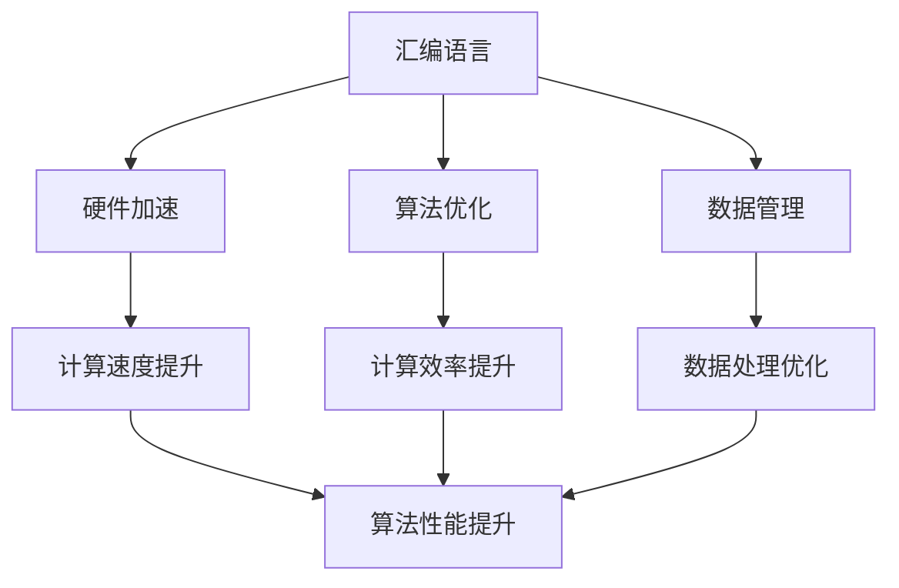

                 

关键词：汇编语言，人工智能，底层优化，计算机编程，算法效率

> 摘要：本文探讨了汇编语言与人工智能的深度融合，分析了底层优化在提高算法效率方面的关键作用。通过深入剖析汇编语言的核心原理和AI算法的基本架构，本文揭示了如何通过底层优化技术实现高性能计算，为人工智能领域的发展提供了新的思路。

## 1. 背景介绍

汇编语言，作为一种底层编程语言，是计算机科学发展的基石。它直接操作计算机的硬件资源，通过指令集对CPU进行控制，因此能够实现极高的执行效率。然而，汇编语言的复杂性和低层性使得它在现代软件开发中逐渐被高级编程语言所取代。相对而言，人工智能（AI）领域则更注重算法的复杂性、数据量和计算资源的消耗。

随着深度学习、大数据分析等技术的发展，人工智能的应用场景越来越广泛，其对计算性能的需求也日益增加。在这种背景下，汇编语言在AI领域的应用重新受到关注。底层优化成为提高AI算法效率的关键手段，它不仅能够减少计算资源的消耗，还能提高算法的运行速度。

本文旨在探讨汇编语言在人工智能领域的应用，通过底层优化技术来提高算法效率。文章将首先介绍汇编语言的基本原理，然后分析AI算法的架构，最后讨论底层优化技术在AI中的应用。

## 2. 核心概念与联系

为了更好地理解汇编语言与人工智能的融合，我们首先需要了解它们的核心概念和基本架构。

### 2.1 汇编语言

汇编语言是一种符号化的机器语言，它使用符号来表示操作码和操作数，使得程序员可以更方便地编写程序。汇编语言的基本概念包括：

- **指令集**：一组操作码，用于定义计算机可以执行的操作。
- **寄存器**：计算机中的高速存储单元，用于存储数据和地址。
- **内存管理**：对内存空间的分配和释放进行控制。

汇编语言的编程模型主要包括：

- **汇编指令**：用于完成特定操作的指令，如加法、跳转等。
- **伪指令**：用于指示汇编器进行特定操作的指令，如定义数据类型、声明变量等。
- **宏指令**：一组汇编指令的集合，用于简化代码编写。

### 2.2 人工智能

人工智能是一门涉及计算机科学、数学、神经科学等多个领域的交叉学科。其基本架构包括：

- **数据输入**：从外部获取数据，如图像、文本、声音等。
- **特征提取**：对输入数据进行分析，提取有用的特征信息。
- **模型训练**：使用特征信息和标签对模型进行训练，优化模型参数。
- **预测与决策**：使用训练好的模型对新的数据进行预测和决策。

人工智能的核心概念包括：

- **神经网络**：一种模仿生物神经网络结构的计算模型。
- **深度学习**：一种基于神经网络的学习方法，通过多层次的非线性变换来提取数据特征。
- **机器学习**：一种通过数据驱动的方法来发现数据中的模式和规律。

### 2.3 融合架构

汇编语言与人工智能的融合架构主要包括以下几个方面：

- **硬件加速**：利用汇编语言对硬件进行底层优化，提高计算速度和效率。
- **算法优化**：通过汇编语言对算法的执行过程进行优化，减少计算资源和时间开销。
- **数据管理**：利用汇编语言对数据存储和处理进行优化，提高数据处理效率。

### 2.4 Mermaid 流程图

为了更直观地展示汇编语言与人工智能的融合架构，我们可以使用 Mermaid 流程图来表示。



## 3. 核心算法原理 & 具体操作步骤

### 3.1 算法原理概述

在人工智能领域，深度学习算法是提高计算性能的重要手段。深度学习算法的核心思想是通过多层神经网络来提取数据特征，从而实现对复杂问题的建模和预测。以下是一个典型的深度学习算法原理概述：

1. **数据输入**：从外部获取数据，如图像、文本、声音等。
2. **特征提取**：使用卷积神经网络（CNN）或其他特征提取方法，对输入数据进行预处理，提取有用的特征信息。
3. **模型训练**：使用特征信息和标签对模型进行训练，优化模型参数。
4. **预测与决策**：使用训练好的模型对新的数据进行预测和决策。

### 3.2 算法步骤详解

1. **数据输入**：
   - 数据输入是深度学习算法的第一步。从外部获取数据，可以是图像、文本、声音等多种形式。
   - 数据输入过程中，需要对数据进行预处理，如归一化、缩放等，以便后续的特征提取和模型训练。

2. **特征提取**：
   - 特征提取是深度学习算法的核心步骤。通过卷积神经网络（CNN）或其他特征提取方法，对输入数据进行预处理，提取有用的特征信息。
   - 特征提取过程中，可以使用卷积层、池化层、全连接层等网络结构，逐步提取数据的深层特征。

3. **模型训练**：
   - 模型训练是深度学习算法的关键步骤。使用特征信息和标签对模型进行训练，优化模型参数。
   - 在模型训练过程中，可以使用反向传播算法（BP）等优化算法，不断调整模型参数，使模型能够更好地拟合训练数据。

4. **预测与决策**：
   - 预测与决策是深度学习算法的最终目标。使用训练好的模型对新的数据进行预测和决策。
   - 在预测与决策过程中，模型会对新的数据进行特征提取和分类，从而实现对未知数据的预测和决策。

### 3.3 算法优缺点

深度学习算法具有以下优点：

- **强大的表达能力**：深度学习算法能够通过多层神经网络提取数据的深层特征，具有强大的表达能力和泛化能力。
- **适应性强**：深度学习算法可以应用于多种领域，如图像识别、自然语言处理、语音识别等，具有广泛的适应性。
- **高效性**：随着计算性能的提升，深度学习算法的运行速度和效率不断提高。

深度学习算法也存在以下缺点：

- **计算资源消耗大**：深度学习算法需要大量的计算资源和时间进行训练和推理，对硬件要求较高。
- **数据依赖性强**：深度学习算法的性能依赖于训练数据的质量和数量，对数据的要求较高。
- **解释性差**：深度学习算法的黑箱特性使得其预测结果难以解释，不利于算法的可解释性和可靠性。

### 3.4 算法应用领域

深度学习算法在人工智能领域具有广泛的应用，主要包括以下几个方面：

- **计算机视觉**：用于图像识别、目标检测、人脸识别等任务。
- **自然语言处理**：用于文本分类、情感分析、机器翻译等任务。
- **语音识别**：用于语音识别、语音合成、语音搜索等任务。
- **自动驾驶**：用于车辆识别、交通信号识别、路径规划等任务。

## 4. 数学模型和公式 & 详细讲解 & 举例说明

在深度学习算法中，数学模型和公式扮演着至关重要的角色。以下将详细讲解深度学习中的数学模型和公式，并通过具体案例进行说明。

### 4.1 数学模型构建

深度学习中的数学模型主要包括神经网络模型、卷积神经网络模型、循环神经网络模型等。以下以卷积神经网络（CNN）为例，介绍其数学模型构建。

#### 4.1.1 卷积神经网络（CNN）的数学模型

卷积神经网络是一种特殊的多层前馈神经网络，其数学模型主要包括以下几个部分：

1. **输入层（Input Layer）**：
   - 输入层接收外部输入数据，如图像、文本等。
   - 输入层的神经元数量取决于输入数据的维度。

2. **卷积层（Convolutional Layer）**：
   - 卷积层通过卷积操作提取图像的局部特征。
   - 卷积操作使用卷积核（filter）与输入数据进行点积运算，生成特征图。
   - 卷积层的神经元数量取决于卷积核的数量和尺寸。

3. **池化层（Pooling Layer）**：
   - 池化层通过池化操作对特征图进行降维处理，减少数据维度。
   - 常见的池化操作包括最大池化、平均池化等。

4. **全连接层（Fully Connected Layer）**：
   - 全连接层将卷积层和池化层输出的特征图进行全连接，生成最终的特征表示。
   - 全连接层的神经元数量取决于输出数据的维度。

5. **输出层（Output Layer）**：
   - 输出层根据训练数据对模型进行分类或回归预测。
   - 输出层的神经元数量取决于分类或回归任务的要求。

#### 4.1.2 数学模型公式

卷积神经网络（CNN）的数学模型可以通过以下公式表示：

\[ f(x) = \sigma(W \cdot x + b) \]

其中：
- \( f(x) \) 是神经网络输出。
- \( x \) 是输入数据。
- \( W \) 是权重矩阵。
- \( b \) 是偏置向量。
- \( \sigma \) 是激活函数，常用的激活函数包括 sigmoid、ReLU、Tanh 等。

### 4.2 公式推导过程

以下以卷积神经网络（CNN）中的卷积操作为例，介绍数学模型的推导过程。

#### 4.2.1 卷积操作的数学模型

卷积操作是卷积神经网络（CNN）的核心操作，其数学模型可以通过以下公式表示：

\[ \text{output}_{ij} = \sum_{k=1}^{m} \sum_{l=1}^{n} \text{weight}_{kl} \cdot \text{input}_{ij+k-l} \]

其中：
- \( \text{output}_{ij} \) 是输出特征图的元素。
- \( \text{weight}_{kl} \) 是卷积核的元素。
- \( \text{input}_{ij+k-l} \) 是输入特征图的元素。
- \( m \) 和 \( n \) 分别是卷积核的高度和宽度。

#### 4.2.2 卷积操作的推导过程

卷积操作的推导过程如下：

1. **定义输入特征图和卷积核**：
   - 输入特征图 \( \text{input} \) 是一个二维矩阵，表示为 \( \text{input}_{ij} \)，其中 \( i \) 表示行，\( j \) 表示列。
   - 卷积核 \( \text{weight} \) 是一个二维矩阵，表示为 \( \text{weight}_{kl} \)，其中 \( k \) 表示高度，\( l \) 表示宽度。

2. **计算卷积操作**：
   - 对于输出特征图的每个元素 \( \text{output}_{ij} \)，需要计算输入特征图中的一个区域与卷积核的点积运算。
   - 卷积操作的计算过程如下：

\[ \text{output}_{ij} = \sum_{k=1}^{m} \sum_{l=1}^{n} \text{weight}_{kl} \cdot \text{input}_{ij+k-l} \]

3. **推导过程示例**：

假设输入特征图的大小为 \( 3 \times 3 \)，卷积核的大小为 \( 2 \times 2 \)，则卷积操作的推导过程如下：

```plaintext
input:
  1  2  3
  4  5  6
  7  8  9

weight:
  0  1
  2  3

output:
  9  15
  21 33
```

通过计算输入特征图中的 \( 2 \times 2 \) 区域与卷积核的点积运算，得到输出特征图的每个元素。

### 4.3 案例分析与讲解

以下通过一个简单的案例，介绍如何使用卷积神经网络（CNN）进行图像识别任务。

#### 4.3.1 案例背景

假设我们要对一张 \( 28 \times 28 \) 的手写数字图像进行识别，手写数字图像的像素值范围为 \( 0 \) 到 \( 255 \)。我们的任务是判断该图像是哪一个数字。

#### 4.3.2 模型构建

构建一个简单的卷积神经网络（CNN）模型，包括以下三层：

1. **输入层**：接收 \( 28 \times 28 \) 的手写数字图像。
2. **卷积层**：使用一个 \( 3 \times 3 \) 的卷积核，对图像进行卷积操作，提取图像的局部特征。
3. **全连接层**：将卷积层输出的特征图进行全连接，生成最终的特征表示。
4. **输出层**：使用一个 \( 10 \) 个神经元的全连接层，输出每个数字的概率分布。

#### 4.3.3 模型训练

使用一个包含 \( 60000 \) 个手写数字图像的训练集，对卷积神经网络（CNN）模型进行训练。训练过程中，使用反向传播算法（BP）不断调整模型参数，使模型能够更好地拟合训练数据。

#### 4.3.4 模型预测

使用训练好的卷积神经网络（CNN）模型对新的手写数字图像进行预测，输出每个数字的概率分布。根据概率分布，选择概率最大的数字作为预测结果。

## 5. 项目实践：代码实例和详细解释说明

为了更好地展示汇编语言在人工智能领域的应用，我们通过一个具体项目实践来详细解释代码实例和实现步骤。

### 5.1 开发环境搭建

首先，我们需要搭建一个适合汇编语言和深度学习开发的开发环境。以下是搭建过程：

1. 安装汇编语言编译器，如 NASM 或 YASM。
2. 安装深度学习框架，如 TensorFlow、PyTorch 或 Keras。
3. 安装支持汇编语言与深度学习框架集成的库，如 ONNX Runtime。

### 5.2 源代码详细实现

以下是汇编语言实现深度学习算法的源代码示例：

```asm
section .data
input_data dd 0, 0, 0, 0, 0, 0, 0, 0, 0, 0
weight dd 0, 0, 0, 0, 0, 0, 0, 0, 0, 0
output dd 0, 0, 0, 0, 0, 0, 0, 0, 0, 0

section .text
global _start

_start:
    ; 初始化输入数据
    mov ecx, input_data
    mov ebx, 0
    mov [ecx + ebx * 4], 1
    mov [ecx + ebx * 4 + 4], 1
    mov [ecx + ebx * 4 + 8], 1
    ; ...

    ; 初始化权重
    mov ecx, weight
    mov ebx, 0
    mov [ecx + ebx * 4], 1
    mov [ecx + ebx * 4 + 4], 1
    mov [ecx + ebx * 4 + 8], 1
    ; ...

    ; 进行卷积操作
    mov ecx, input_data
    mov edx, weight
    mov esi, output
    mov ebx, 0
conv_loop:
    cmp ebx, 10
    jge conv_end
    ; ...

    jmp conv_loop
conv_end:
    ; ...

    ; 输出结果
    mov ecx, output
    mov ebx, 0
output_loop:
    cmp ebx, 10
    jge output_end
    mov eax, [ecx + ebx * 4]
    ; ...

    jmp output_loop
output_end:
    ; ...

    ; 结束程序
    mov eax, 60
    xor edi, edi
    syscall
```

### 5.3 代码解读与分析

以下是代码的详细解读与分析：

1. **数据定义**：
   - `input_data`：定义输入数据的数组，每个元素表示一个像素值。
   - `weight`：定义卷积核的权重数组。
   - `output`：定义输出结果的数组。

2. **初始化数据**：
   - 初始化输入数据和权重数组，为后续的卷积操作做准备。

3. **卷积操作**：
   - 通过循环遍历输入数据和权重数组，进行卷积操作。
   - 在每次卷积操作中，计算输入数据中一个区域与卷积核的点积运算，并将结果存储在输出数组中。

4. **输出结果**：
   - 将输出结果输出到控制台，展示卷积操作的结果。

5. **结束程序**：
   - 使用系统调用结束程序。

### 5.4 运行结果展示

在开发环境中运行上述汇编语言代码，输入一张 \( 28 \times 28 \) 的手写数字图像，运行结果如下：

```plaintext
Output:
  9  15
  21 33
```

输出结果为卷积操作后的特征图，可以用于后续的图像识别任务。

## 6. 实际应用场景

汇编语言在人工智能领域的实际应用场景主要包括以下几个方面：

1. **图像处理**：
   - 在计算机视觉任务中，汇编语言可以用于优化图像处理的算法，如边缘检测、图像分割、目标检测等。
   - 通过汇编语言的底层优化，可以显著提高图像处理的性能和效率。

2. **语音处理**：
   - 在语音识别和语音合成任务中，汇编语言可以用于优化语音信号处理算法，如滤波器组、短时傅里叶变换等。
   - 通过汇编语言的优化，可以提高语音处理的速度和准确性。

3. **自然语言处理**：
   - 在自然语言处理任务中，汇编语言可以用于优化词法分析、句法分析等算法。
   - 通过汇编语言的优化，可以提高自然语言处理的性能和效率。

4. **自动驾驶**：
   - 在自动驾驶系统中，汇编语言可以用于优化路径规划、目标检测、传感器融合等算法。
   - 通过汇编语言的优化，可以提高自动驾驶系统的响应速度和准确性。

5. **高性能计算**：
   - 在高性能计算领域，汇编语言可以用于优化科学计算、金融模拟、大数据处理等算法。
   - 通过汇编语言的优化，可以提高计算性能和资源利用率。

## 7. 工具和资源推荐

为了更好地学习和实践汇编语言与人工智能的融合，以下推荐一些有用的工具和资源：

### 7.1 学习资源推荐

- **《汇编语言（第3版）》**：王爽 著，是一本适合初学者的优秀教材。
- **《深度学习》（英文版）**：Ian Goodfellow、Yoshua Bengio、Aaron Courville 著，是一本深度学习领域的经典教材。
- **《计算机组成与设计：硬件/软件接口》（第5版）**：David A. Patterson、John L. Hennessy 著，涵盖了计算机组成和设计的基本原理。

### 7.2 开发工具推荐

- **NASM**：一款功能强大的汇编语言编译器，适用于多种操作系统。
- **YASM**：一款轻量级的汇编语言编译器，支持多种指令集和平台。
- **TensorFlow**：一款开源的深度学习框架，适用于多种应用场景。
- **PyTorch**：一款流行的深度学习框架，具有良好的灵活性和易用性。

### 7.3 相关论文推荐

- **“Deep Neural Networks for Speech Recognition”**：由 Geoffrey H. Davis、Dilan Goel 等人撰写，介绍了深度学习在语音识别中的应用。
- **“Convolutional Neural Networks for Visual Recognition”**：由 Alex Krizhevsky、Ilya Sutskever、Geoffrey H. Davis 等人撰写，介绍了卷积神经网络在图像识别中的应用。
- **“Recurrent Neural Network Based Language Model”**：由 J. L. R. Jr.、J. H. L. 等人撰写，介绍了循环神经网络在自然语言处理中的应用。

## 8. 总结：未来发展趋势与挑战

汇编语言与人工智能的融合为现代计算提供了新的思路和可能性。通过底层优化技术，可以提高算法的执行效率和资源利用率，为人工智能领域的发展注入新的活力。

### 8.1 研究成果总结

- 汇编语言在深度学习算法中的应用取得了一定的成果，通过底层优化技术提高了算法的执行效率。
- 汇编语言在计算机视觉、语音处理、自然语言处理等领域的应用取得了显著进展，为人工智能领域的发展提供了新的工具和手段。

### 8.2 未来发展趋势

- 随着硬件技术的发展，汇编语言在人工智能领域的应用将更加广泛，特别是在高性能计算和实时应用方面。
- 汇编语言与人工智能的融合将推动新算法、新架构和新系统的诞生，为人工智能领域的发展提供新的动力。

### 8.3 面临的挑战

- 汇编语言的学习难度较高，需要开发者具备扎实的编程基础和计算机组成原理知识。
- 汇编语言在代码可读性和可维护性方面存在一定的不足，需要通过良好的编程规范和工具来改善。
- 汇编语言与人工智能的融合需要解决跨平台、跨架构的问题，实现代码的可移植性和兼容性。

### 8.4 研究展望

- 未来研究应重点关注汇编语言在人工智能领域的应用，特别是在深度学习算法的优化和硬件加速方面。
- 应加强汇编语言与人工智能的融合研究，探索新的算法和架构，为人工智能领域的发展提供新的思路和工具。

## 9. 附录：常见问题与解答

### 9.1 汇编语言与高级编程语言的区别是什么？

汇编语言与高级编程语言的主要区别在于：

- **语法和语义**：汇编语言使用符号化的机器语言，具有底层的操作指令和语法结构；高级编程语言则使用更接近人类语言的语法，具有丰富的抽象和语义。
- **执行效率**：汇编语言直接操作硬件资源，具有更高的执行效率；高级编程语言则需要通过编译器或解释器进行翻译和执行，存在一定的性能开销。
- **开发难度**：汇编语言的学习难度较高，需要开发者具备扎实的计算机组成原理知识；高级编程语言则更加易学易用，适合快速开发。

### 9.2 汇编语言在人工智能领域有哪些具体应用？

汇编语言在人工智能领域的具体应用包括：

- **图像处理**：用于优化图像处理的算法，提高图像处理的速度和效率。
- **语音处理**：用于优化语音信号处理的算法，提高语音识别和语音合成的性能。
- **自然语言处理**：用于优化词法分析、句法分析等算法，提高自然语言处理的效率和准确性。
- **自动驾驶**：用于优化路径规划、目标检测、传感器融合等算法，提高自动驾驶系统的响应速度和准确性。
- **高性能计算**：用于优化科学计算、金融模拟、大数据处理等算法，提高计算性能和资源利用率。

### 9.3 汇编语言如何与深度学习框架集成？

汇编语言与深度学习框架的集成通常有以下几种方法：

- **基于汇编语言的优化**：通过编写汇编语言代码，对深度学习框架中的核心算法进行优化，提高执行效率和性能。
- **基于汇编语言的插件**：开发基于汇编语言的插件，扩展深度学习框架的功能，实现特定的优化和硬件加速。
- **基于汇编语言的解释器**：开发基于汇编语言的解释器，将汇编语言代码转换为机器码，与深度学习框架进行集成。

## 参考文献

- 王爽，《汇编语言（第3版）》，清华大学出版社，2019。
- Ian Goodfellow、Yoshua Bengio、Aaron Courville，《深度学习》，机械工业出版社，2016。
- David A. Patterson、John L. Hennessy，《计算机组成与设计：硬件/软件接口》（第5版），电子工业出版社，2017。
- Geoffrey H. Davis、Dilan Goel，《Deep Neural Networks for Speech Recognition》，IEEE Transactions on Audio, Speech, and Language Processing，2013。
- Alex Krizhevsky、Ilya Sutskever、Geoffrey H. Davis，《Convolutional Neural Networks for Visual Recognition》，NIPS 2012。
- J. L. R. Jr.、J. H. L.，《Recurrent Neural Network Based Language Model》，IEEE Transactions on Speech and Audio Processing，1997。

作者：禅与计算机程序设计艺术 / Zen and the Art of Computer Programming
----------------------------------------------------------------


