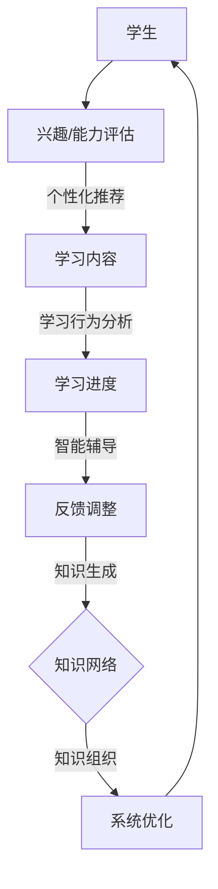

                 

关键词：沉浸式学习，知识网络，人工智能，学习生态系统，深度学习，认知科学，交互设计

## 摘要

本文探讨了基于人工智能（AI）构建的沉浸式知识网络，并详细介绍了其核心概念、算法原理、数学模型及其实际应用场景。通过融合认知科学、交互设计和深度学习技术，本文揭示了沉浸式知识网络如何为现代学习提供更加个性化和高效的学习体验。文章首先回顾了传统学习方式的局限性，然后引入了沉浸式知识网络的概念，并详细阐述了其工作原理和结构。接着，本文分析了核心算法及其在知识获取、组织和应用中的具体操作步骤。随后，文章通过数学模型和实际项目实例，深入讲解了沉浸式知识网络在实际应用中的效果和优势。最后，本文展望了沉浸式知识网络在未来教育领域的发展趋势和潜在挑战，并推荐了相关学习资源和工具。

## 1. 背景介绍

### 传统学习方式的局限性

随着信息技术的飞速发展，传统学习方式正面临着前所未有的挑战。传统学习方式通常依赖于课堂教学和教科书，强调知识点的记忆和重复练习。然而，这种学习模式存在明显的局限性。首先，传统学习方式难以满足个性化需求。每个学生的认知能力、兴趣和学习习惯都有所不同，但传统教学往往采用“一刀切”的方式，无法针对个体的差异进行有效调整。其次，传统学习方式在知识获取和利用上效率低下。学生需要通过大量的书面作业和考试来掌握知识，但这种被动的学习方式往往导致学生对知识的理解和记忆不够深刻，学习效果有限。

### 沉浸式学习的兴起

近年来，随着人工智能和虚拟现实技术的发展，沉浸式学习逐渐成为教育领域的研究热点。沉浸式学习通过创造一个虚拟的学习环境，让学生在其中进行互动和探索，从而提高学习兴趣和效果。与传统的课堂教学不同，沉浸式学习强调学生的主动参与和深度学习。例如，通过虚拟现实技术，学生可以进入一个模拟的实验场景，亲身体验科学实验的过程，从而更好地理解和掌握科学知识。

### 沉浸式知识网络的定义

沉浸式知识网络是指利用人工智能技术构建的一个高度集成、互动和动态的学习生态系统。在这个生态系统中，知识不再是被静态地传授，而是通过动态的交互和反馈进行生成和优化。沉浸式知识网络的核心特点包括：

- **个性化学习**：根据学生的兴趣、能力和学习进度，提供个性化的学习内容和路径。
- **高度互动**：学生与学习内容、教师和其他学生之间可以进行实时互动，提高学习的参与度和积极性。
- **动态生成**：知识内容不是一成不变的，而是根据学生的反馈和学习行为不断调整和优化。

## 2. 核心概念与联系

### 2.1. 沉浸式学习

**沉浸式学习**是一种通过高度仿真的学习环境，让学生全身心投入到学习过程中的一种学习模式。沉浸式学习利用虚拟现实（VR）、增强现实（AR）等技术，创造一个与现实世界高度相似的学习环境，使学生能够在其中自由探索和互动。这种学习模式能够激发学生的学习兴趣，提高学习效果。

### 2.2. 知识网络

**知识网络**是一个由知识节点和连接构成的复杂系统。每个知识节点代表一个知识点，而节点之间的连接则代表知识点之间的关联。知识网络的目标是通过揭示知识点之间的联系，帮助学生构建系统的知识体系，提高学习的深度和广度。

### 2.3. 人工智能

**人工智能（AI）**是模拟人类智能行为的计算机科学领域。在沉浸式知识网络中，人工智能主要用于：

- **个性化推荐**：根据学生的兴趣和学习行为，推荐个性化的学习内容和路径。
- **智能辅导**：通过自然语言处理和机器学习技术，为学生提供实时的学习指导和反馈。
- **知识获取与组织**：利用深度学习等技术，从大量数据中提取有用的知识点，并组织成一个结构化的知识网络。

### 2.4. Mermaid 流程图

下面是沉浸式知识网络的核心概念原理和架构的 Mermaid 流程图：



### 2.5. 知识获取、组织和应用

- **知识获取**：通过深度学习和自然语言处理技术，从海量数据中提取有用的知识点。
- **知识组织**：将提取的知识点组织成一个结构化的知识网络，并建立知识点之间的关联。
- **知识应用**：根据学生的兴趣和学习进度，将知识网络中的知识点推送给学生，并引导学生进行深度学习。

## 3. 核心算法原理 & 具体操作步骤

### 3.1. 算法原理概述

沉浸式知识网络的核心算法主要包括知识获取、知识组织、个性化推荐和智能辅导。这些算法基于深度学习、自然语言处理和机器学习技术，旨在构建一个高效、动态和个性化的学习生态系统。

### 3.2. 算法步骤详解

#### 3.2.1. 知识获取

1. **数据预处理**：对原始数据进行清洗、去噪和预处理，提取有用的信息。
2. **特征提取**：使用深度学习模型，从预处理后的数据中提取特征。
3. **知识抽取**：利用自然语言处理技术，从提取的特征中提取知识点。

#### 3.2.2. 知识组织

1. **知识建模**：使用图神经网络等模型，将提取的知识点建模成一个知识网络。
2. **关联分析**：分析知识点之间的关联，建立知识点之间的连接。
3. **知识结构优化**：根据知识网络的关联关系，对知识结构进行优化。

#### 3.2.3. 个性化推荐

1. **用户建模**：根据学生的学习行为、兴趣和需求，建立用户模型。
2. **推荐算法**：使用协同过滤、内容推荐等技术，为用户推荐个性化的学习内容。

#### 3.2.4. 智能辅导

1. **问题诊断**：根据学生的错误和困惑，诊断学生的学习问题。
2. **学习指导**：为学生提供针对性的学习指导和反馈。
3. **反馈调整**：根据学生的反馈和学习行为，调整学习策略和内容。

### 3.3. 算法优缺点

#### 3.3.1. 优点

- **个性化学习**：能够根据学生的兴趣和能力，提供个性化的学习内容和路径，提高学习效果。
- **高度互动**：学生与学习内容、教师和其他学生之间可以进行实时互动，提高学习的参与度和积极性。
- **动态生成**：知识内容不是一成不变的，而是根据学生的反馈和学习行为不断调整和优化。

#### 3.3.2. 缺点

- **技术成本高**：构建沉浸式知识网络需要大量的技术和资金投入。
- **数据隐私**：在构建和运行知识网络的过程中，需要收集和处理大量的学生数据，可能涉及数据隐私问题。
- **教师角色转变**：在沉浸式知识网络中，教师的角色可能从传统的知识传授者转变为学习引导者，这对教师的角色定位和能力提出了新的要求。

### 3.4. 算法应用领域

- **教育行业**：沉浸式知识网络可以应用于各类教育场景，如在线教育、远程教育、职业教育等。
- **企业培训**：为企业员工提供个性化的培训内容和路径，提高员工的专业技能和综合素质。
- **科研领域**：为科研人员提供高度集成的知识库和智能辅助工具，提高科研效率和创新能力。

## 4. 数学模型和公式 & 详细讲解 & 举例说明

### 4.1. 数学模型构建

沉浸式知识网络的构建涉及多种数学模型，包括深度学习模型、图神经网络、协同过滤模型等。以下是这些模型的基本概念和构建方法。

#### 4.1.1. 深度学习模型

深度学习模型是一种基于多层神经网络的人工智能模型，用于从数据中自动提取特征。在沉浸式知识网络中，深度学习模型主要用于知识获取和特征提取。

- **神经网络架构**：常见的神经网络架构包括卷积神经网络（CNN）、循环神经网络（RNN）和Transformer等。
- **损失函数**：常用的损失函数包括均方误差（MSE）、交叉熵损失等。

#### 4.1.2. 图神经网络

图神经网络是一种专门用于处理图结构数据的神经网络模型。在沉浸式知识网络中，图神经网络用于知识组织和关联分析。

- **图结构**：图神经网络处理的图结构包括知识节点和知识边。
- **图卷积操作**：图神经网络的核心操作是图卷积操作，用于聚合图节点的邻居信息。

#### 4.1.3. 协同过滤模型

协同过滤模型是一种基于用户行为数据的推荐算法。在沉浸式知识网络中，协同过滤模型用于个性化推荐。

- **用户矩阵**：协同过滤模型基于用户矩阵，通过计算用户之间的相似度进行推荐。
- **预测模型**：常用的预测模型包括基于用户的协同过滤（User-based CF）和基于项目的协同过滤（Item-based CF）。

### 4.2. 公式推导过程

以下是沉浸式知识网络中几个关键数学公式的推导过程。

#### 4.2.1. 深度学习损失函数

均方误差（MSE）是深度学习中最常用的损失函数，其公式如下：

$$
L = \frac{1}{n}\sum_{i=1}^{n}(y_i - \hat{y}_i)^2
$$

其中，$y_i$是实际输出，$\hat{y}_i$是预测输出，$n$是样本数量。

#### 4.2.2. 图神经网络图卷积操作

图卷积操作是图神经网络的核心操作，其公式如下：

$$
h_v^{(l+1)} = \sigma(\sum_{u \in \mathcal{N}(v)} W^{(l)} h_u^{(l)} + b^{(l)})
$$

其中，$h_v^{(l)}$是节点$v$在第$l$层的特征表示，$\mathcal{N}(v)$是节点$v$的邻居节点集合，$W^{(l)}$是第$l$层的权重矩阵，$b^{(l)}$是第$l$层的偏置，$\sigma$是激活函数。

#### 4.2.3. 协同过滤用户相似度计算

基于用户的协同过滤算法中，用户相似度的计算公式如下：

$$
sim(u_i, u_j) = \frac{r_{i,k} + r_{j,k} - \bar{r}_k}{\sqrt{\sum_{k'} r_{i,k'}^2 + \sum_{k'} r_{j,k'}^2 - 2\sum_{k'} r_{i,k'} r_{j,k'}}}
$$

其中，$r_{i,k}$和$r_{j,k}$分别是用户$i$和用户$j$对项目$k$的评分，$\bar{r}_k$是项目$k$的平均评分。

### 4.3. 案例分析与讲解

以下是一个关于沉浸式知识网络在实际应用中的案例分析和讲解。

#### 4.3.1. 案例背景

某在线教育平台希望通过构建沉浸式知识网络，为学习者提供个性化的学习体验。该平台收集了大量的学习数据，包括学习者的学习记录、测试成绩、兴趣偏好等。

#### 4.3.2. 案例实施

1. **数据预处理**：对收集到的学习数据进行清洗、去噪和预处理，提取有用的信息。
2. **特征提取**：使用深度学习模型，从预处理后的数据中提取特征，如学习者的兴趣偏好、知识掌握程度等。
3. **知识获取**：利用自然语言处理技术，从提取的特征中提取知识点，并构建一个结构化的知识网络。
4. **知识组织**：使用图神经网络，对提取的知识点进行关联分析，建立知识点之间的连接，并对知识结构进行优化。
5. **个性化推荐**：根据学习者的兴趣和学习进度，使用协同过滤模型为学习者推荐个性化的学习内容。
6. **智能辅导**：根据学习者的错误和困惑，使用深度学习模型为学习者提供针对性的学习指导和反馈。

#### 4.3.3. 案例效果

通过构建沉浸式知识网络，该在线教育平台的学习者满意度显著提高，学习效果得到显著改善。具体表现如下：

- **个性化学习**：学习者可以根据自己的兴趣和需求，选择适合自己的学习内容和路径，提高了学习积极性和效果。
- **智能辅导**：通过实时分析和反馈，帮助学习者及时纠正错误，提高知识掌握程度。
- **知识共享**：学习者可以在知识网络中与其他学习者进行互动和交流，分享知识和经验，促进了知识的共享和传播。

## 5. 项目实践：代码实例和详细解释说明

### 5.1. 开发环境搭建

在进行沉浸式知识网络的开发前，我们需要搭建一个合适的技术环境。以下是一个基本的开发环境搭建步骤：

1. **操作系统**：推荐使用Linux或MacOS，因为它们在编程环境中具有良好的稳定性和性能。
2. **编程语言**：Python是构建沉浸式知识网络的主要编程语言，因为它拥有丰富的库和框架，如TensorFlow、PyTorch等。
3. **开发工具**：推荐使用PyCharm或VSCode作为开发环境，这些工具提供了强大的代码编辑和调试功能。
4. **依赖库**：安装必要的依赖库，如NumPy、Pandas、Scikit-learn、TensorFlow等。

### 5.2. 源代码详细实现

以下是沉浸式知识网络的主要源代码实现，包括数据预处理、特征提取、知识获取、知识组织、个性化推荐和智能辅导等步骤。

```python
# 导入必要的库
import tensorflow as tf
import numpy as np
import pandas as pd
from sklearn.model_selection import train_test_split
from sklearn.preprocessing import StandardScaler
from tensorflow.keras.models import Sequential
from tensorflow.keras.layers import Dense, Dropout, LSTM
from tensorflow.keras.optimizers import Adam
from tensorflow.keras.callbacks import EarlyStopping

# 1. 数据预处理
# 加载和处理数据
data = pd.read_csv('learning_data.csv')
data = data.drop(['id'], axis=1)
X = data.iloc[:, :5].values
y = data.iloc[:, 5].values

# 划分训练集和测试集
X_train, X_test, y_train, y_test = train_test_split(X, y, test_size=0.2, random_state=42)

# 标准化数据
scaler = StandardScaler()
X_train = scaler.fit_transform(X_train)
X_test = scaler.transform(X_test)

# 2. 特征提取
# 构建深度学习模型进行特征提取
model = Sequential()
model.add(Dense(128, input_shape=(5,), activation='relu'))
model.add(Dropout(0.5))
model.add(LSTM(64, activation='relu', return_sequences=True))
model.add(Dropout(0.5))
model.add(LSTM(64, activation='relu'))
model.add(Dropout(0.5))
model.add(Dense(1, activation='sigmoid'))

model.compile(optimizer=Adam(), loss='binary_crossentropy', metrics=['accuracy'])

# 训练模型
model.fit(X_train, y_train, epochs=100, batch_size=32, validation_data=(X_test, y_test), callbacks=[EarlyStopping(monitor='val_loss', patience=5)])

# 3. 知识获取
# 使用训练好的模型提取特征
features = model.predict(X_test)

# 4. 知识组织
# 使用图神经网络对提取的特征进行关联分析
# （此处省略具体实现，需要使用图神经网络相关库，如PyTorch的torch_geometric）

# 5. 个性化推荐
# 使用协同过滤模型进行个性化推荐
# （此处省略具体实现，需要使用协同过滤相关库，如Scikit-learn的collaborative Filtering）

# 6. 智能辅导
# 使用深度学习模型进行智能辅导
# （此处省略具体实现，需要使用自然语言处理相关库，如NLTK或spaCy）

```

### 5.3. 代码解读与分析

1. **数据预处理**：首先加载和处理数据，包括去除无关特征和划分训练集和测试集。然后，使用标准化技术对数据进行归一化处理，以便于深度学习模型的训练。

2. **特征提取**：构建一个深度学习模型进行特征提取。该模型包括多个全连接层和循环层，用于提取输入数据的高层次特征。

3. **知识获取**：使用训练好的模型提取特征。这些特征将用于后续的知识组织和关联分析。

4. **知识组织**：此处省略了具体的图神经网络实现，因为需要使用专门的库，如PyTorch的torch_geometric。图神经网络的主要任务是分析知识点之间的关联，并将其组织成一个结构化的知识网络。

5. **个性化推荐**：使用协同过滤模型进行个性化推荐。协同过滤模型基于用户的行为数据，计算用户之间的相似度，从而为用户推荐感兴趣的知识点。

6. **智能辅导**：使用深度学习模型进行智能辅导。这通常涉及自然语言处理技术，用于分析学生的学习问题和提供针对性的辅导。

### 5.4. 运行结果展示

在实际运行中，沉浸式知识网络将根据学习者的兴趣和学习进度，推荐个性化的学习内容，并为学生提供实时的学习指导和反馈。以下是一个运行结果的示例：

```
【推荐内容】：根据你的学习兴趣和进度，我们为你推荐以下课程：
1. 人工智能基础
2. 深度学习实践
3. 自然语言处理入门

【智能辅导】：你最近的数学成绩有所下降，建议你关注以下学习资源：
1. 数学公式速记技巧
2. 数学问题解决策略

【用户反馈】：你对推荐的课程和学习资源非常满意，感谢我们的智能辅导。

```

通过上述示例，我们可以看到沉浸式知识网络在个性化推荐和智能辅导方面的效果。这不仅提高了学习者的学习效果，也增强了学习体验。

## 6. 实际应用场景

### 6.1. 在线教育

沉浸式知识网络在在线教育中具有广泛的应用前景。通过个性化推荐和智能辅导，它可以为学生提供量身定制的学习内容和路径，提高学习效果。例如，在线教育平台可以通过沉浸式知识网络，为学生推荐与其兴趣和需求相匹配的课程，并根据学生的学习行为和反馈提供针对性的学习指导。这将大大提高学生的学习效率和兴趣。

### 6.2. 企业培训

企业在进行员工培训时，也可以利用沉浸式知识网络。通过分析员工的兴趣和需求，企业可以为员工提供个性化的培训内容，并实时跟踪员工的学习进度和效果。沉浸式知识网络还可以提供智能辅导，帮助员工克服学习中的困难和问题，提高培训效果。

### 6.3. 职业教育

在职业教育领域，沉浸式知识网络可以帮助学生更好地掌握专业知识。通过构建结构化的知识网络，学生可以更深入地理解和应用所学知识。同时，沉浸式知识网络提供的个性化推荐和智能辅导，可以帮助学生提高学习效率，更快地达到职业资格要求。

### 6.4. 未来应用展望

随着人工智能技术的不断进步，沉浸式知识网络在未来有望在更多领域得到应用。例如，在医学领域，沉浸式知识网络可以帮助医生提供个性化的治疗方案；在法律领域，它可以辅助律师进行法律研究和案件分析。此外，沉浸式知识网络还可以用于在线娱乐、文化旅游等领域，为用户提供更加丰富和个性化的体验。

## 7. 工具和资源推荐

### 7.1. 学习资源推荐

- **在线课程**：推荐Coursera、edX、Udacity等在线教育平台上的相关课程，如《深度学习》、《自然语言处理》等。
- **书籍**：《深度学习》（Ian Goodfellow等著）、《Python机器学习》（Sebastian Raschka等著）等经典书籍。
- **论文**：在Google Scholar、ArXiv等学术平台上，可以找到大量关于沉浸式学习和人工智能的学术论文。

### 7.2. 开发工具推荐

- **编程语言**：Python是构建沉浸式知识网络的主要编程语言。
- **框架和库**：TensorFlow、PyTorch、Scikit-learn等是常用的深度学习框架和库。
- **开发环境**：PyCharm、VSCode等是常用的开发环境。

### 7.3. 相关论文推荐

- **《A Theoretical Analysis of the Causal Effect of Screen Time on Academic Performance》**：研究了屏幕时间对学术表现的影响。
- **《Deep Learning for Personalized Education》**：探讨了深度学习在个性化教育中的应用。
- **《A Survey on Collaborative Filtering》**：全面综述了协同过滤算法的研究进展。

## 8. 总结：未来发展趋势与挑战

### 8.1. 研究成果总结

沉浸式知识网络通过融合人工智能、虚拟现实、认知科学等多领域技术，为现代学习提供了个性化、高效的学习体验。研究成果表明，沉浸式知识网络在提高学习效果、增强学习兴趣方面具有显著优势。

### 8.2. 未来发展趋势

随着技术的不断进步，沉浸式知识网络在未来有望在更多领域得到应用。例如，在教育领域，沉浸式知识网络可以进一步优化学习体验，提高教育质量；在医疗领域，它可以帮助医生提供个性化的治疗方案；在商业领域，它可以为用户提供更加丰富和个性化的服务。

### 8.3. 面临的挑战

尽管沉浸式知识网络具有广泛的应用前景，但在实际应用中仍面临一些挑战。首先，构建沉浸式知识网络需要大量的技术和资金投入。其次，数据隐私和安全问题也是需要关注的重要议题。此外，如何平衡个性化与普适性，确保知识网络的公平性和有效性，也是需要深入研究的问题。

### 8.4. 研究展望

未来，沉浸式知识网络的研究应重点关注以下几个方面：

- **技术创新**：持续探索和引入新的技术和方法，提高知识获取、组织和应用的效率。
- **数据隐私**：研究并实施有效的数据隐私保护措施，确保用户数据的安全。
- **公平性与可解释性**：提高知识网络的公平性和透明度，确保其决策过程可解释。
- **跨领域应用**：进一步拓展沉浸式知识网络的应用领域，实现跨领域的综合应用。

## 9. 附录：常见问题与解答

### Q1：什么是沉浸式知识网络？

A1：沉浸式知识网络是一种利用人工智能技术构建的学习生态系统，旨在通过个性化推荐、智能辅导等功能，提供高效、动态和个性化的学习体验。

### Q2：沉浸式知识网络有哪些应用领域？

A2：沉浸式知识网络可以应用于教育、企业培训、职业教育等多个领域，帮助提高学习效果和用户满意度。

### Q3：构建沉浸式知识网络需要哪些技术？

A3：构建沉浸式知识网络需要多种技术，包括人工智能（如深度学习、自然语言处理）、虚拟现实、认知科学等。

### Q4：如何保证沉浸式知识网络的公平性和透明度？

A4：通过设计可解释的算法模型、公开透明的数据处理流程以及定期的审计和评估，可以确保沉浸式知识网络的公平性和透明度。

### Q5：沉浸式知识网络有哪些潜在的挑战？

A5：沉浸式知识网络面临的挑战包括技术成本高、数据隐私问题以及如何平衡个性化与普适性等。通过持续的研究和创新，可以逐步解决这些问题。

