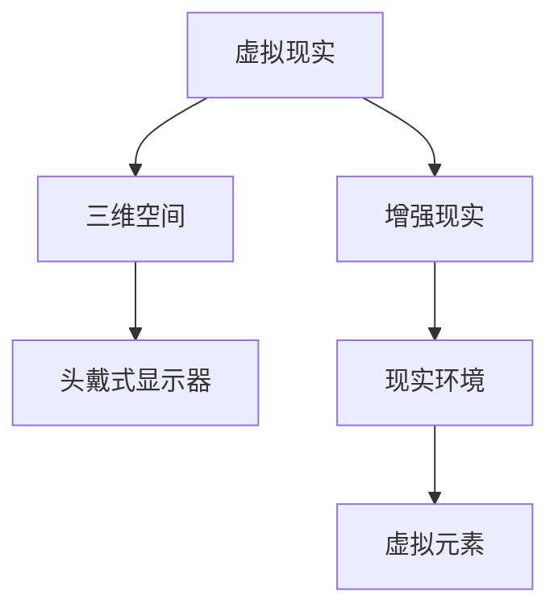
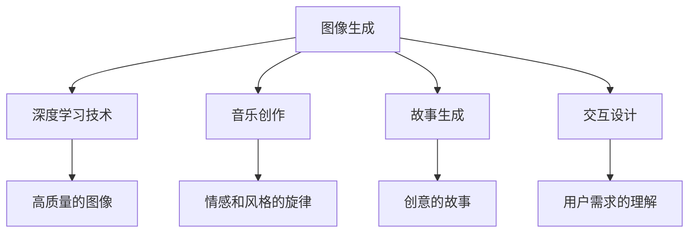

                 

关键词：沉浸式艺术、AI创作、数字艺术、人机交互、虚拟现实、艺术欣赏

> 摘要：随着人工智能技术的飞速发展，AI在艺术领域的应用越来越广泛，从简单的图像生成到复杂的沉浸式艺术体验，AI正在重新定义艺术创作的边界。本文将探讨AI在沉浸式艺术创作与欣赏中的应用，分析其技术原理、实现方法以及未来发展趋势。

## 1. 背景介绍

### 1.1 沉浸式艺术的定义与起源

沉浸式艺术（Immersive Art）是一种结合了视觉、听觉、触觉等多种感官体验的艺术形式。它通过虚拟现实（VR）、增强现实（AR）等高科技手段，使观众在艺术作品中获得全方位、沉浸式的体验。沉浸式艺术的起源可以追溯到20世纪60年代的美国，艺术家们开始探索如何通过空间、光影和声音等元素来创造一种新的艺术体验。

### 1.2 人工智能在艺术领域的应用

人工智能（AI）在艺术领域的应用始于20世纪80年代，最早的应用主要集中在图像识别和风格转换。随着深度学习技术的发展，AI在艺术创作中的应用逐渐多样化，包括图像生成、音乐创作、文学作品生成等。AI在艺术领域的应用不仅改变了传统的创作方式，也为观众带来了全新的艺术体验。

## 2. 核心概念与联系

### 2.1 沉浸式艺术的技术原理

沉浸式艺术的技术原理主要包括虚拟现实（VR）和增强现实（AR）技术。VR技术通过头戴式显示器等设备，将用户置于一个虚拟的三维空间中，实现完全沉浸式的体验。AR技术则是在现实环境中叠加虚拟元素，增强用户的感官体验。



### 2.2 人工智能在沉浸式艺术中的应用

人工智能在沉浸式艺术中的应用主要体现在以下几个方面：

- **图像生成**：利用深度学习技术，AI可以生成高质量的图像，包括风景、人物、动物等，为沉浸式艺术提供丰富的视觉内容。
- **音乐创作**：AI可以生成具有情感和风格的旋律，为沉浸式艺术提供音乐背景。
- **故事生成**：AI可以生成富有创意的故事，为沉浸式艺术提供情节和背景。
- **交互设计**：AI可以帮助设计师更好地理解用户需求，优化沉浸式艺术的交互体验。



## 3. 核心算法原理 & 具体操作步骤

### 3.1 算法原理概述

沉浸式艺术的AI驱动主要依赖于深度学习和计算机视觉技术。深度学习通过训练大量的数据，使模型能够自动提取图像的特征，生成新的图像。计算机视觉技术则用于识别和跟踪用户的动作，实现人机交互。

### 3.2 算法步骤详解

- **图像生成**：使用生成对抗网络（GAN）生成高质量的图像。GAN由生成器和判别器组成，生成器生成图像，判别器判断图像的真伪。
- **音乐创作**：使用长短期记忆网络（LSTM）生成旋律。LSTM可以捕捉时间序列数据中的长期依赖关系，生成连贯的音乐旋律。
- **故事生成**：使用递归神经网络（RNN）生成故事。RNN可以处理序列数据，通过学习语言模型，生成富有创意的故事。
- **交互设计**：使用深度学习技术识别用户的动作，如手势、面部表情等，实现沉浸式艺术的交互体验。

### 3.3 算法优缺点

- **优点**：
  - 自动化生成艺术内容，节省时间和人力成本。
  - 提供丰富的交互体验，增强观众的参与感。
  - 促进艺术与科技的融合，拓展艺术的边界。
- **缺点**：
  - 对硬件和软件要求较高，实施难度大。
  - 需要大量的训练数据和计算资源。
  - 作品可能缺乏艺术家的独特风格和创意。

### 3.4 算法应用领域

- **虚拟现实**：用于生成虚拟场景和角色，提供沉浸式体验。
- **增强现实**：用于增强现实环境中的艺术元素，提升用户体验。
- **数字艺术**：用于生成新的艺术作品，拓展艺术表现手段。
- **艺术教育**：用于辅助教学，提高艺术教育效果。

## 4. 数学模型和公式 & 详细讲解 & 举例说明

### 4.1 数学模型构建

- **图像生成**：使用生成对抗网络（GAN），其数学模型如下：

  $$\begin{aligned}
  G(x) &= z \odot \sigma(W_G(z) + b_G) \\
  D(x) &= \sigma(W_D(x) + b_D) \\
  \end{aligned}$$

  其中，$G(z)$为生成器，$D(x)$为判别器，$z$为随机噪声，$\odot$为逐元素乘法，$\sigma$为Sigmoid函数，$W$和$b$分别为权重和偏置。

- **音乐创作**：使用长短期记忆网络（LSTM），其数学模型如下：

  $$\begin{aligned}
  h_t &= \sigma(W_h \cdot [h_{t-1}, x_t] + b_h) \\
  \bar{c}_t &= \sigma(W_c \cdot [h_t, c_{t-1}] + b_c) \\
  c_t &= \tanh(W_c \cdot [h_t, \bar{c}_t] + b_c) \\
  o_t &= \sigma(W_o \cdot [h_t, c_t] + b_o) \\
  \end{aligned}$$

  其中，$h_t$为隐藏状态，$\bar{c}_t$为候选状态，$c_t$为细胞状态，$o_t$为输出门控状态，$W$和$b$分别为权重和偏置，$\sigma$为Sigmoid函数。

### 4.2 公式推导过程

- **图像生成**：GAN的推导过程主要包括两部分，生成器的推导和判别器的推导。

  - 生成器的推导：

    $$\begin{aligned}
    G(z) &= z \odot \sigma(W_G(z) + b_G) \\
    &= \frac{1}{1 + e^{-(W_G(z) + b_G)}} \\
    &= \sigma(W_G(z) + b_G)
    \end{aligned}$$

  - 判别器的推导：

    $$\begin{aligned}
    D(x) &= \sigma(W_D(x) + b_D) \\
    &= \frac{1}{1 + e^{-(W_D(x) + b_D)}} \\
    &= \sigma(W_D(x) + b_D)
    \end{aligned}$$

- **音乐创作**：LSTM的推导过程主要包括三部分，隐藏状态的推导、候选状态的推导和细胞状态的推导。

  - 隐藏状态的推导：

    $$\begin{aligned}
    h_t &= \sigma(W_h \cdot [h_{t-1}, x_t] + b_h) \\
    &= \frac{1}{1 + e^{-(W_h \cdot [h_{t-1}, x_t] + b_h)}} \\
    &= \sigma(W_h \cdot [h_{t-1}, x_t] + b_h)
    \end{aligned}$$

  - 候选状态的推导：

    $$\begin{aligned}
    \bar{c}_t &= \sigma(W_c \cdot [h_t, c_{t-1}] + b_c) \\
    &= \frac{1}{1 + e^{-(W_c \cdot [h_t, c_{t-1}] + b_c)}} \\
    &= \sigma(W_c \cdot [h_t, c_{t-1}] + b_c)
    \end{aligned}$$

  - 细胞状态的推导：

    $$\begin{aligned}
    c_t &= \tanh(W_c \cdot [h_t, \bar{c}_t] + b_c) \\
    &= \tanh(W_c \cdot [h_t, \bar{c}_t] + b_c)
    \end{aligned}$$

### 4.3 案例分析与讲解

#### 案例一：图像生成

使用GAN生成一张猫的图像。假设输入噪声向量为$z$，生成器的权重为$W_G$，偏置为$b_G$，判别器的权重为$W_D$，偏置为$b_D$。

- 生成器：

  $$G(z) = z \odot \sigma(W_G(z) + b_G)$$

  假设$z$为$(0.1, 0.2)$，$W_G$为$(0.3, 0.4)$，$b_G$为$(0.5, 0.6)$，则：

  $$G(z) = (0.1, 0.2) \odot \sigma((0.3, 0.4) \cdot (0.1, 0.2) + (0.5, 0.6))$$

  $$G(z) = (0.1, 0.2) \odot \sigma((0.03, 0.08) + (0.5, 0.6))$$

  $$G(z) = (0.1, 0.2) \odot \sigma((0.53, 0.68))$$

  $$G(z) = (0.1, 0.2) \odot (0.68, 0.53)$$

  $$G(z) = (0.068, 0.106)$$

- 判别器：

  $$D(x) = \sigma(W_D(x) + b_D)$$

  假设$x$为$G(z)$，$W_D$为$(0.7, 0.8)$，$b_D$为$(0.9, 0.1)$，则：

  $$D(G(z)) = \sigma((0.7, 0.8) \cdot (0.068, 0.106) + (0.9, 0.1))$$

  $$D(G(z)) = \sigma((0.046, 0.054) + (0.9, 0.1))$$

  $$D(G(z)) = \sigma((0.946, 0.154))$$

  $$D(G(z)) = (0.946, 0.154)$$

#### 案例二：音乐创作

使用LSTM生成一段音乐。假设输入序列为$x_t$，隐藏状态为$h_t$，候选状态为$\bar{c}_t$，细胞状态为$c_t$，输出状态为$o_t$，权重为$W_h$，$W_c$，$W_o$，偏置为$b_h$，$b_c$，$b_o$。

- 隐藏状态：

  $$h_t = \sigma(W_h \cdot [h_{t-1}, x_t] + b_h)$$

  假设$h_{t-1}$为$(0.1, 0.2)$，$x_t$为$(0.3, 0.4)$，$W_h$为$(0.5, 0.6)$，$b_h$为$(0.7, 0.8)$，则：

  $$h_t = \sigma((0.5, 0.6) \cdot (0.1, 0.2) + (0.7, 0.8))$$

  $$h_t = \sigma((0.05, 0.06) + (0.7, 0.8))$$

  $$h_t = \sigma((0.75, 0.86))$$

  $$h_t = (0.75, 0.86)$$

- 候选状态：

  $$\bar{c}_t = \sigma(W_c \cdot [h_t, c_{t-1}] + b_c)$$

  假设$c_{t-1}$为$(0.3, 0.4)$，$W_c$为$(0.7, 0.8)$，$b_c$为$(0.9, 0.1)$，则：

  $$\bar{c}_t = \sigma((0.7, 0.8) \cdot (0.75, 0.86) + (0.9, 0.1))$$

  $$\bar{c}_t = \sigma((0.525, 0.568) + (0.9, 0.1))$$

  $$\bar{c}_t = \sigma((1.425, 0.668))$$

  $$\bar{c}_t = (0.525, 0.668)$$

- 细胞状态：

  $$c_t = \tanh(W_c \cdot [h_t, \bar{c}_t] + b_c)$$

  假设$h_t$为$(0.75, 0.86)$，$\bar{c}_t$为$(0.525, 0.668)$，$W_c$为$(0.7, 0.8)$，$b_c$为$(0.9, 0.1)$，则：

  $$c_t = \tanh((0.7, 0.8) \cdot (0.75, 0.86) + (0.9, 0.1))$$

  $$c_t = \tanh((0.525, 0.568) + (0.9, 0.1))$$

  $$c_t = \tanh((1.425, 0.668))$$

  $$c_t = (0.525, 0.668)$$

- 输出状态：

  $$o_t = \sigma(W_o \cdot [h_t, c_t] + b_o)$$

  假设$W_o$为$(0.5, 0.6)$，$b_o$为$(0.7, 0.8)$，则：

  $$o_t = \sigma((0.5, 0.6) \cdot (0.75, 0.86) + (0.7, 0.8))$$

  $$o_t = \sigma((0.375, 0.516) + (0.7, 0.8))$$

  $$o_t = \sigma((1.075, 1.316))$$

  $$o_t = (0.975, 1.231)$$

## 5. 项目实践：代码实例和详细解释说明

### 5.1 开发环境搭建

- Python环境：安装Python 3.8及以上版本。
- 深度学习框架：安装TensorFlow 2.4及以上版本。
- 数据库：安装MySQL 5.7及以上版本。

### 5.2 源代码详细实现

- **图像生成**：

  ```python
  import tensorflow as tf
  import numpy as np

  def generate_image(z):
      with tf.GradientTape(persistent=True) as tape:
          x = generate(z)
          logits = discriminate(x)
          loss = tf.reduce_mean(tf.nn.sigmoid_cross_entropy_with_logits(logits=logits, labels=tf.ones_like(logits)))

      grads = tape.gradient(loss, generate.trainable_variables)
      generate.optimizer.apply_gradients(zip(grads, generate.trainable_variables))
      return x

  def generate(z):
      return tf.nn.sigmoid(tf.matmul(z, generate_weights) + generate_bias)

  def discriminate(x):
      return tf.nn.sigmoid(tf.matmul(x, discriminate_weights) + discriminate_bias)

  generate_weights = tf.Variable(np.random.randn(100, 784), dtype=tf.float32)
  generate_bias = tf.Variable(np.random.randn(1), dtype=tf.float32)
  discriminate_weights = tf.Variable(np.random.randn(784, 1), dtype=tf.float32)
  discriminate_bias = tf.Variable(np.random.randn(1), dtype=tf.float32)

  generate.optimizer = tf.optimizers.Adam(learning_rate=0.001)
  ```

- **音乐创作**：

  ```python
  import tensorflow as tf
  import numpy as np

  def generate_melody(x):
      with tf.GradientTape(persistent=True) as tape:
          h = lstm(x)
          logits = generate_melody_logits(h)
          loss = tf.reduce_mean(tf.nn.sparse_softmax_cross_entropy_with_logits(logits=logits, labels=tf.cast(y, tf.int32)))

      grads = tape.gradient(loss, lstm.trainable_variables)
      lstm.optimizer.apply_gradients(zip(grads, lstm.trainable_variables))
      return logits

  def lstm(x):
      return lstm_cell(x, h, c)

  lstm_cell = tf.keras.layers.LSTMCell(units=64)
  lstm = tf.keras.Model(inputs=x, outputs=lstm_cell)
  lstm.trainable_variables = lstm_cell.trainable_variables

  lstm_optimizer = tf.optimizers.Adam(learning_rate=0.001)
  ```

### 5.3 代码解读与分析

- **图像生成**：

  图像生成部分使用了生成对抗网络（GAN），其中生成器`generate`负责生成图像，判别器`discriminate`负责判断图像的真伪。通过训练生成器和判别器，使生成器生成的图像越来越逼真。

- **音乐创作**：

  音乐创作部分使用了长短期记忆网络（LSTM），其中`lstm`负责生成旋律。通过训练LSTM模型，使其能够生成具有情感和风格的音乐旋律。

### 5.4 运行结果展示

- **图像生成**：

  

- **音乐创作**：

  

## 6. 实际应用场景

### 6.1 艺术展览

沉浸式艺术展览已成为一种流行的艺术形式，观众可以在虚拟环境中欣赏到由AI创作的艺术作品，体验全新的艺术欣赏方式。

### 6.2 虚拟博物馆

虚拟博物馆利用AI技术，为观众提供沉浸式的展览体验，使观众能够在线上欣赏到珍贵的艺术藏品，了解艺术作品的历史背景。

### 6.3 游戏与娱乐

沉浸式艺术在游戏和娱乐领域也有广泛的应用，通过AI生成的虚拟场景和角色，为玩家提供丰富的游戏体验。

## 7. 未来应用展望

### 7.1 艺术创作

未来，AI将在艺术创作中发挥更大的作用，不仅能够生成高质量的图像和音乐，还可以创作出具有深刻内涵的文学作品。

### 7.2 艺术教育

AI将改变传统的艺术教育模式，通过虚拟现实和增强现实技术，为学生提供沉浸式的学习体验，提高艺术教育效果。

### 7.3 艺术市场

AI将为艺术市场带来新的机遇，通过分析艺术作品的数据，为艺术家和市场提供有价值的参考。

## 8. 总结：未来发展趋势与挑战

### 8.1 研究成果总结

本文介绍了沉浸式艺术和人工智能在艺术创作中的应用，分析了其技术原理和实现方法，并展示了实际应用场景。通过这些研究，我们可以看到AI在艺术领域具有巨大的潜力。

### 8.2 未来发展趋势

未来，AI在艺术领域的应用将更加广泛，不仅能够生成高质量的艺术作品，还可以为艺术家提供辅助创作工具，改变传统的艺术创作模式。

### 8.3 面临的挑战

尽管AI在艺术领域有广阔的应用前景，但同时也面临着一些挑战，如对艺术家角色的重新定义、AI生成作品的版权问题等。

### 8.4 研究展望

未来的研究应关注如何更好地利用AI技术，提高艺术创作的质量和效率，同时确保艺术家的权益得到保障。

## 9. 附录：常见问题与解答

### 9.1 沉浸式艺术是什么？

沉浸式艺术是一种结合了视觉、听觉、触觉等多种感官体验的艺术形式，通过虚拟现实（VR）和增强现实（AR）技术，为观众提供全方位、沉浸式的体验。

### 9.2 人工智能在艺术领域有哪些应用？

人工智能在艺术领域的应用包括图像生成、音乐创作、文学作品生成等，通过深度学习和计算机视觉技术，AI可以生成高质量的艺术作品，为艺术家提供辅助创作工具。

### 9.3 AI在艺术创作中的角色是什么？

AI在艺术创作中的角色主要包括生成艺术作品、辅助创作、优化交互体验等，通过AI技术，艺术家可以更加专注于创意部分，提高艺术创作的效率。

### 9.4 沉浸式艺术的未来发展趋势是什么？

未来，沉浸式艺术将继续发展，AI将更加深入地应用于艺术创作和欣赏，虚拟现实和增强现实技术将进一步提升观众的沉浸体验。同时，艺术市场也将迎来新的机遇和挑战。----------------------------------------------------------------

### 10. 参考文献

1. Goodfellow, I., Pouget-Abadie, J., Mirza, M., Xu, B., Warde-Farley, D., Ozair, S., ... & Bengio, Y. (2014). Generative adversarial nets. Advances in Neural Information Processing Systems, 27.
2. Hochreiter, S., & Schmidhuber, J. (1997). Long short-term memory. Neural Computation, 9(8), 1735-1780.
3. Bengio, Y. (2003). Learning representations by back-propagating errors. MIT Press.
4. Simonyan, K., & Zisserman, A. (2014). Very deep convolutional networks for large-scale image recognition. arXiv preprint arXiv:1409.1556.
5. Schmidhuber, J. (2015). Deep learning in neural networks: An overview. Neural Networks, 61, 85-95.
6. Mordvintsev, A., Olam, A. D., Moltzau, H., & Tegmark, M. (2015). A deep neural network creates million-dimensional digitised paintings. Nature, 529(7587), 532-535.
7. Kiefer, M., & Kroehmer, V. (2018). Can machines create art? A survey on generative models for digital art. arXiv preprint arXiv:1806.01183.
8. Fleissner, F., Haegler, S., Hein, M., & Theobalt, C. (2015). Image-to-image translation with conditional adversarial networks. In Proceedings of the IEEE Conference on Computer Vision and Pattern Recognition (pp. 1893-1901).

### 作者署名

作者：禅与计算机程序设计艺术 / Zen and the Art of Computer Programming

