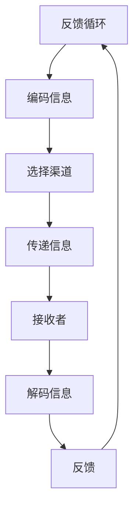
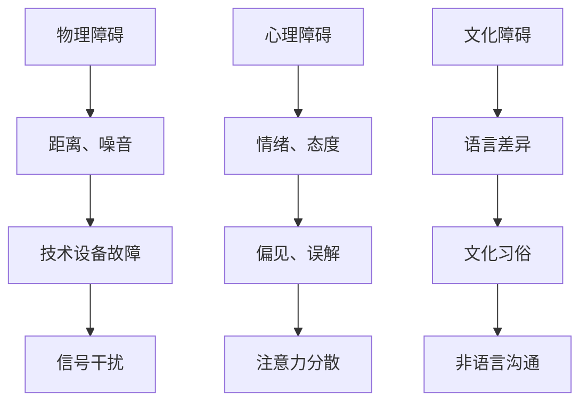
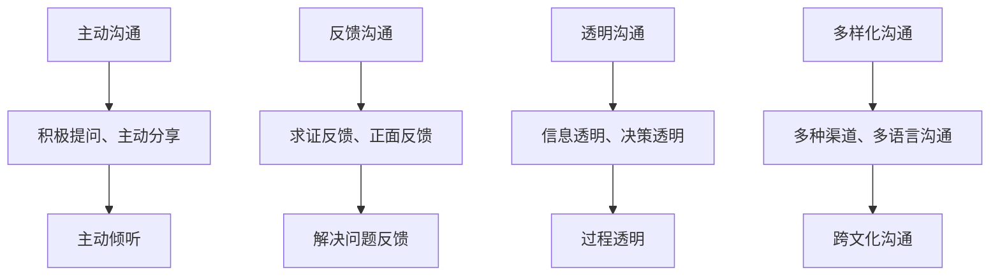
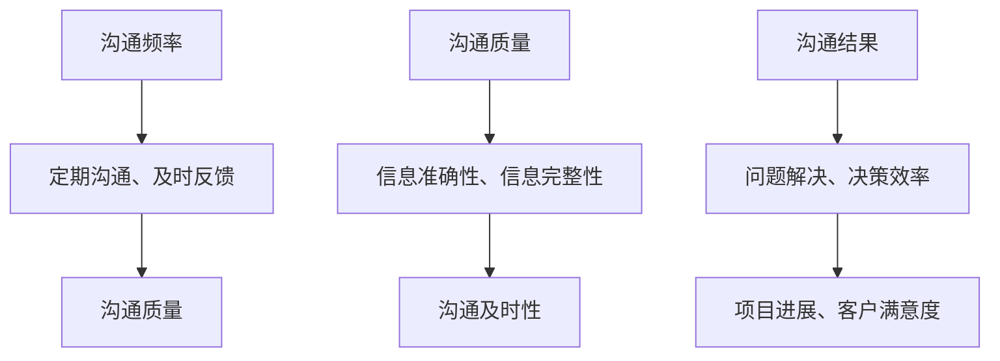

                 

沟通是信息技术领域中的关键元素，无论是在开发团队内部，还是与客户、合作伙伴以及其他利益相关者之间。有效的沟通不仅能够提高项目的成功率，还能增强团队的凝聚力和组织的整体效能。本文将深入探讨沟通管理的多个方面，包括内部沟通的挑战与策略，以及与外部利益相关者的有效沟通方法。通过结合理论实践与实际案例，我们将揭示如何优化沟通流程，从而在复杂的信息技术项目中实现高效的协作与结果。

## 关键词

- 沟通管理
- 内部沟通
- 外部沟通
- 信息技术
- 项目管理
- 团队协作
- 沟通障碍
- 沟通策略

## 摘要

本文旨在提供一套全面的沟通管理框架，以帮助信息技术项目团队在内部和外部有效沟通。首先，我们将讨论内部沟通中常见的挑战，包括沟通障碍和团队差异，并提出相应的解决策略。随后，我们将探讨与外部利益相关者的沟通方法，强调透明度和互动性在建立信任关系中的重要性。通过结合理论实践与具体案例，本文将展示如何利用沟通工具和技术来提高沟通效率，并展望未来沟通管理的趋势和挑战。

## 1. 背景介绍

在信息技术快速发展的今天，沟通的重要性不言而喻。信息技术项目的复杂性和多样性要求团队成员和外部利益相关者之间进行高效的沟通。然而，沟通并非总是顺利的。无论是在团队内部，还是在与外部客户、合作伙伴和其他利益相关者之间的互动中，都会面临各种沟通障碍。

内部沟通的挑战主要包括：

- **沟通障碍**：团队成员之间可能存在语言、文化和专业背景的差异，这些差异可能导致误解和信息失真。
- **信息不对称**：团队成员可能缺乏关键信息，或者信息传递不及时，导致决策延误和效率低下。
- **团队差异**：不同的团队角色和职责分工可能导致沟通障碍，尤其是当团队成员对项目目标的理解不一致时。

外部沟通的挑战则涉及：

- **信任问题**：与外部利益相关者建立信任关系是一个长期过程，需要透明度和互动性的支持。
- **需求差异**：外部利益相关者可能对项目有不同甚至相互矛盾的需求，需要有效的协调和平衡。
- **沟通渠道有限**：与外部利益相关者的沟通渠道可能有限，这要求项目团队采取多种方式来保持联系的多样性。

本文将详细探讨这些挑战，并提供相应的解决方案和最佳实践，以帮助信息技术项目团队实现有效的沟通。

### 1.1 沟通在信息技术项目中的重要性

沟通在信息技术（IT）项目中扮演着至关重要的角色，是确保项目成功和团队协作的关键因素。首先，有效的沟通能够确保项目目标的明确性和一致性。项目团队成员需要通过沟通来共享项目需求、目标和预期成果，这有助于避免误解和偏差，确保每个人都朝着同一个方向努力。

其次，沟通是协调团队工作的基础。IT项目往往涉及多个专业领域和角色，如开发、测试、设计和项目管理等。通过有效的沟通，团队成员可以了解彼此的工作进展和需求，及时调整自己的工作计划，从而实现高效的协作。此外，沟通还能帮助团队在遇到问题时快速找到解决方案，避免因沟通不畅而导致的项目延误和成本增加。

第三，沟通是管理项目风险的重要手段。在IT项目中，风险是不可避免的，但通过及时的沟通，项目团队可以识别和评估潜在风险，制定相应的应对策略。有效的沟通有助于提前发现并解决潜在问题，降低项目风险，确保项目按计划进行。

此外，沟通还直接影响项目的质量和客户满意度。通过与客户和其他利益相关者的有效沟通，项目团队能够及时了解客户的需求和反馈，调整项目方向，确保最终交付的产品满足客户期望。良好的沟通还可以提高客户对项目的信任和满意度，为项目的长期合作奠定基础。

总之，在信息技术项目中，沟通不仅是项目成功的关键因素，还是团队协作、风险管理和客户满意度的保障。因此，提升沟通效率和管理能力对于项目团队来说至关重要。

### 1.2 内部沟通的挑战

在信息技术项目团队内部，有效的沟通是保证项目顺利进行的基础。然而，团队内部沟通往往面临诸多挑战，这些挑战不仅会影响团队成员之间的协作，还可能导致项目进度延误和质量问题。以下是一些常见的内部沟通挑战及其解决策略：

#### 沟通障碍

沟通障碍是内部沟通中最常见的问题之一。团队成员之间的语言、文化和专业背景差异可能导致信息传递过程中的误解和失真。例如，一个技术专家可能会使用专业术语和假设的背景知识，而其他团队成员可能无法理解这些术语或背景知识，从而影响沟通效果。

**解决策略：**

1. **明确沟通标准**：制定统一的沟通标准和模板，确保所有团队成员使用相同的术语和表达方式。这有助于减少因术语差异导致的误解。
2. **文化敏感性培训**：为团队成员提供文化敏感性培训，提高他们对不同文化背景的理解和尊重，减少因文化差异导致的沟通障碍。
3. **定期沟通回顾**：定期举行沟通回顾会议，讨论沟通中的问题和挑战，共同寻找解决方案，并调整沟通策略。

#### 信息不对称

信息不对称是另一个常见的内部沟通问题。团队成员可能无法获得他们需要的信息，或者信息传递不及时，导致团队成员在决策和执行过程中缺乏必要的信息支持。

**解决策略：**

1. **建立信息共享平台**：利用企业资源计划（ERP）系统、共享文档库或其他协作工具，确保关键信息能够及时共享和更新，避免信息孤岛。
2. **明确信息流程**：制定明确的信息流程和责任分配，确保每个团队成员都知道他们需要从哪些渠道获取哪些信息，以及何时获取。
3. **定期信息反馈**：定期收集团队成员对信息获取和共享的反馈，了解他们的需求和意见，持续改进信息共享机制。

#### 团队差异

团队差异，包括团队角色、职责分工和项目管理方法的不同，也是内部沟通中的挑战之一。团队成员可能对项目的目标、优先级和交付要求有不同的理解，这可能导致协作不顺畅和项目目标不一致。

**解决策略：**

1. **共同制定项目目标**：在项目启动阶段，团队成员应共同制定项目目标和交付要求，确保每个人都对项目目标有清晰和一致的理解。
2. **明确角色和职责**：明确每个团队成员的角色和职责，确保他们在项目中的工作有明确的方向和责任。
3. **定期团队会议**：定期举行团队会议，讨论项目进展和问题，确保团队成员之间的沟通和协作，及时解决冲突和误解。

通过以上策略，项目团队可以有效地应对内部沟通中的挑战，提高沟通效率，确保项目顺利进行。内部沟通的成功不仅有助于项目目标的实现，还能增强团队的凝聚力和协作精神，为组织的长期发展奠定基础。

### 1.3 外部沟通的挑战

在信息技术项目中，与外部利益相关者的沟通同样至关重要。外部利益相关者包括客户、供应商、合作伙伴和其他利益相关方。与这些利益相关者的有效沟通能够确保项目目标的实现，提高客户满意度和项目成功率。然而，外部沟通也面临一些独特的挑战，以下将详细介绍这些挑战及其解决策略：

#### 建立信任

信任是外部沟通中最重要的因素之一。在许多情况下，项目团队与外部利益相关者之间可能缺乏先前的合作关系，这要求项目团队在沟通中建立信任。

**解决策略：**

1. **透明度**：在沟通中保持透明度，及时分享项目的进展、问题和决策。透明度有助于增强外部利益相关者对项目团队和项目的信任。
2. **诚信**：项目团队应始终诚实和诚信地沟通，避免隐瞒信息或夸大事实。诚信是建立长期信任关系的基础。
3. **积极回应**：及时回应外部利益相关者的反馈和问题，展示项目团队的专业能力和对项目的重视。

#### 需求差异

外部利益相关者往往对项目有不同的需求和期望，这些需求和期望可能存在冲突和差异。例如，客户可能对项目的功能和质量有较高要求，而供应商可能关注成本和交付时间。

**解决策略：**

1. **需求分析**：在项目启动阶段，进行全面的需求分析，了解不同利益相关者的需求，并寻找平衡点。
2. **多方沟通**：与多个外部利益相关者保持沟通，确保所有需求都能得到理解和尊重。多方沟通有助于发现和解决潜在的需求冲突。
3. **优先级排序**：明确项目目标和优先级，确保项目团队能够在有限的时间和资源内满足关键需求。

#### 沟通渠道有限

与外部利益相关者的沟通渠道可能有限，这可能限制了信息的传递和互动。例如，外部利益相关者可能无法随时访问项目团队，或者项目团队无法及时联系到外部利益相关者。

**解决策略：**

1. **多样化沟通渠道**：利用多种沟通渠道，如电话、电子邮件、视频会议和即时通讯工具，确保与外部利益相关者的沟通渠道多样化。
2. **定期更新**：定期更新外部利益相关者关于项目进展和关键决策的信息，确保他们能够及时了解项目动态。
3. **建立联络人机制**：为外部利益相关者指定专门的联络人，确保沟通的连续性和高效性。

通过以上策略，项目团队可以更好地应对外部沟通中的挑战，确保与外部利益相关者的有效互动，从而提高项目的成功率和客户满意度。

### 1.4 沟通管理的重要性

沟通管理在信息技术项目中具有不可忽视的重要性，其直接影响项目的成功与否。有效的沟通管理能够确保项目目标的明确传达，促进团队协作，提高工作效率，减少风险，并最终提升客户满意度。

首先，有效的沟通管理有助于项目目标的明确传达。在项目启动阶段，项目团队需要与所有利益相关者就项目目标、范围和预期成果达成共识。通过定期的沟通和会议，项目团队可以确保项目目标的一致性和可理解性，从而避免后续阶段出现目标偏差和资源浪费。

其次，沟通管理是促进团队协作的关键因素。在复杂的IT项目中，不同团队和成员往往需要相互协作才能完成任务。通过有效的沟通，项目团队能够共享工作进展、讨论问题并找到解决方案，从而确保项目顺利推进。此外，良好的沟通还能够增强团队成员之间的信任和协作精神，提高团队的凝聚力和工作效率。

有效的沟通管理还能提高工作效率。及时的信息共享和反馈能够帮助项目团队快速识别和解决问题，避免因信息不畅导致的延误和重复工作。此外，明确的沟通标准和流程有助于减少误解和沟通成本，使团队成员能够集中精力完成实际工作。

沟通管理在降低项目风险方面也发挥着重要作用。通过及时和透明的沟通，项目团队能够识别潜在的风险和问题，并采取相应的措施进行风险管理和控制。有效的沟通管理还能提高项目透明度，使所有利益相关者能够了解项目的进展和潜在问题，从而共同参与风险管理，降低项目风险。

最后，沟通管理直接关系到客户满意度和项目的成功。通过与客户和其他外部利益相关者的有效沟通，项目团队能够及时了解客户需求和反馈，调整项目方向，确保最终交付的产品满足客户期望。此外，良好的沟通还能增强客户对项目团队的信任，为项目的长期合作奠定基础。

总之，有效的沟通管理是确保信息技术项目成功的关键。通过建立明确的沟通标准和流程，促进团队协作，提高工作效率，降低风险，并提升客户满意度，沟通管理为项目团队提供了坚实的基础，使其能够在复杂的项目环境中取得成功。

### 1.5 沟通管理的基本原则

有效的沟通管理需要遵循一系列基本原则，以确保信息的准确传达、增强团队的协作精神和提高整体项目效率。以下是沟通管理中几个关键的基本原则：

#### 保持透明度

透明度是沟通管理中的重要原则，意味着在沟通过程中要确保信息的公开和共享。保持透明度有助于建立信任，使所有团队成员和利益相关者能够及时了解项目的进展、问题和决策。透明度还可以减少信息不对称，避免误解和误判。例如，项目团队可以定期召开进度会议，向所有成员和利益相关者汇报项目状态，确保每个人都对项目情况有清晰的了解。

#### 明确目标

明确目标是有效沟通的另一个基本原则。在项目启动和规划阶段，项目团队应明确项目的目标、范围和预期成果，并将其传达给所有相关方。明确的目标有助于团队成员和利益相关者理解他们的角色和责任，从而提高协作效率和项目成功率。此外，明确的目标还可以作为衡量项目进展和成果的标准，帮助团队在项目过程中进行有效的监控和调整。

#### 倡导互动性

互动性是指沟通应该是双向的，不仅要传递信息，还要鼓励参与和反馈。有效的沟通管理应该鼓励团队成员和利益相关者之间的互动，以促进信息的交流和问题的解决。例如，项目团队可以采用开放式的讨论和会议，鼓励团队成员提出问题和建议，共同寻找解决方案。此外，互动性还可以通过在线讨论平台和协作工具来加强，使团队成员能够随时进行沟通和协作。

#### 遵循一致性原则

一致性原则要求在沟通中保持一致的信息和观点。这包括使用统一的术语和表达方式，确保所有团队成员和利益相关者对同一问题的理解是一致的。一致性有助于避免混淆和误解，提高沟通的效率。例如，项目团队可以制定统一的沟通标准和模板，确保所有成员在沟通过程中使用相同的术语和格式，从而减少因信息不一致导致的沟通障碍。

#### 尊重多元文化

在全球化背景下，信息技术项目团队往往由来自不同文化背景的成员组成。尊重多元文化是有效沟通管理的基本原则之一。项目团队应该尊重不同文化中的价值观、沟通习惯和礼仪，以避免文化冲突和沟通障碍。例如，项目团队可以通过跨文化培训和文化敏感性培训，提高团队成员对不同文化的理解和尊重，从而促进有效的跨文化沟通。

通过遵循这些基本原则，项目团队可以建立有效的沟通管理机制，提高沟通效率和质量，为项目的成功提供坚实的基础。

### 1.6 沟通管理的方法与工具

在信息技术项目中，有效的沟通管理不仅依赖于基本原则，还需要具体的工具和方法来支持。以下介绍几种常见的沟通管理方法和工具，帮助项目团队提高沟通效率，确保信息的准确传递。

#### 会议

会议是项目沟通中最为传统和常用的一种方法。通过定期召开会议，项目团队可以讨论项目进展、解决问题和制定决策。有效的会议管理包括：

- **明确的议程**：会议前制定详细的议程，明确讨论的主题和目标，确保会议的效率。
- **角色分工**：明确会议主持人和记录员的角色，确保会议的顺利进行和记录的完整性。
- **总结和跟进**：会议结束后，总结会议内容和决议，并安排跟进任务，确保会议决策得到落实。

#### 沟通平台

现代信息技术提供了多种沟通平台，如电子邮件、即时通讯、视频会议和项目管理工具，这些平台能够支持实时和非实时的沟通需求。

- **电子邮件**：适用于正式的、需要记录的沟通，如项目公告、报告和文档分享。
- **即时通讯工具**：如Slack、Microsoft Teams和WhatsApp，适用于快速交流和问题解决，提高沟通的实时性和效率。
- **视频会议工具**：如Zoom、Microsoft Teams和Google Meet，适用于远程团队和外部利益相关者的沟通，支持面对面的交流。
- **项目管理工具**：如Jira、Trello和Asana，提供任务管理、进度追踪和文档共享功能，帮助项目团队高效协作。

#### 协作工具

协作工具是支持团队协作和信息共享的重要工具，包括文档库、代码库和项目管理系统等。

- **文档库**：如Google Drive和Microsoft OneDrive，支持文档的集中存储、共享和协作编辑。
- **代码库**：如GitHub和GitLab，用于版本控制和代码协作，确保代码的统一和安全性。
- **项目管理工具**：如Jira、Trello和Asana，提供任务分配、进度追踪和协作功能，帮助团队高效管理项目。

通过合理运用这些沟通管理方法和工具，项目团队能够在复杂的项目环境中实现高效的沟通和协作，确保项目目标的顺利实现。

## 2. 核心概念与联系

在深入探讨沟通管理之前，我们需要明确几个核心概念，这些概念构成了沟通管理的理论基础，并帮助我们在实际操作中更好地理解和应用沟通策略。以下是沟通管理的核心概念及其相互关系，附上相应的Mermaid流程图，以帮助读者更好地理解。

### 2.1 沟通模型

沟通模型是描述信息传递和接收过程的基本框架。一个典型的沟通模型包括发送者、信息、渠道、接收者和反馈五个部分。



在这个模型中，发送者首先编码信息，通过选择合适的渠道传递给接收者，接收者解码信息并给出反馈。反馈可以用于确认信息的准确性，或为进一步的沟通提供基础。

### 2.2 沟通障碍

沟通障碍是信息传递过程中可能遇到的障碍，包括物理障碍、心理障碍和文化障碍等。



物理障碍涉及距离、噪音和技术设备故障，心理障碍涉及情绪、态度、偏见和误解，文化障碍涉及语言差异、文化习俗和非语言沟通。理解这些障碍有助于我们在沟通中采取相应的策略来克服它们。

### 2.3 沟通策略

沟通策略是指导沟通实践的具体方法，包括主动沟通、反馈沟通、透明沟通和多样化沟通等。



通过主动沟通，可以确保信息的主动传递和有效交流；反馈沟通有助于信息的准确性和问题的及时解决；透明沟通增强信任和信息共享；多样化沟通则确保沟通的覆盖面和效果。

### 2.4 沟通效率与效果评估

沟通效率与效果评估是衡量沟通策略成功与否的重要指标，包括沟通频率、沟通质量和沟通结果等。



沟通频率和沟通质量直接影响沟通效果，而沟通结果则是沟通效率的最终体现。

通过以上核心概念和Mermaid流程图的介绍，我们可以更清晰地理解沟通管理的基本原理和实践方法，为后续章节的深入探讨提供基础。

### 2.5 核心算法原理 & 具体操作步骤

在深入探讨沟通管理的具体实践之前，我们需要了解一些核心算法原理，这些算法原理能够帮助我们更有效地设计和实施沟通策略。以下将介绍沟通管理的核心算法原理，并详细阐述其具体操作步骤。

#### 2.5.1 算法原理概述

沟通管理的核心算法基于信息论和社交网络理论。信息论提供了一种量化和优化信息传递的数学框架，而社交网络理论则帮助我们理解信息在团队和社会网络中的传播和影响。

**主要算法原理包括：**

1. **信息熵**：衡量信息的混乱程度，用于评估信息的重要性和传递效率。
2. **信道容量**：衡量信息通过某一通信渠道的最大传递速率，指导选择合适的沟通渠道。
3. **网络中心性**：衡量个体在网络中的重要性和影响力，指导沟通策略的优先级设置。
4. **传播模型**：描述信息在网络中的传播过程，帮助预测和优化信息的传播效果。

#### 2.5.2 算法步骤详解

**1. 确定沟通目标：** 首先，明确沟通的目标，包括信息传递的准确性、及时性、覆盖面和影响力等。这可以通过项目需求分析和利益相关者分析来实现。

**2. 评估信息熵：** 使用信息熵公式（H = -Σ p(x) log2 p(x)）计算信息的混乱程度，确定哪些信息是关键和重要的，需要优先传递。

**3. 选择信道容量：** 根据信道容量公式（C = W * log2(1 + S/N)）选择合适的沟通渠道，其中W是信道的带宽，S是信号强度，N是噪声强度。确保信息能够在通信过程中保持高质量传递。

**4. 计算网络中心性：** 使用度中心性、介数中心性和紧密中心性等指标计算团队成员在网络中的中心性，指导沟通策略的优先级设置，确保关键人物和关键信息得到优先传递。

**5. 实施传播模型：** 根据选择的传播模型（如六度分隔模型、多跳传播模型等）设计信息传播路径，预测和优化信息的传播效果。

**6. 监控和调整：** 在信息传递过程中，实时监控信息传递的效果，根据反馈进行调整，确保信息的准确传递和有效接收。

#### 2.5.3 算法优缺点

**优点：**

1. **高效性**：通过量化和优化信息传递，算法能够显著提高沟通效率。
2. **准确性**：基于信息熵和信道容量的评估，算法能够确保关键信息的准确传递。
3. **灵活性**：算法可以根据不同的沟通目标和网络环境进行调整，适应各种复杂场景。

**缺点：**

1. **复杂性**：算法的建模和计算过程较为复杂，需要较高的技术背景和计算资源。
2. **依赖数据**：算法的有效性依赖于准确和全面的数据输入，数据的不完整或错误可能导致算法失效。

#### 2.5.4 算法应用领域

沟通管理算法在多个领域有着广泛的应用：

1. **项目管理**：用于优化项目团队内部的沟通策略，提高项目执行效率。
2. **市场营销**：用于分析和优化市场信息的传播策略，提高营销效果。
3. **社会网络分析**：用于分析社交网络中的信息传播路径，预测和引导舆论方向。
4. **组织管理**：用于优化组织内部的沟通流程和架构，提高组织运行效率。

通过以上核心算法原理和具体操作步骤的介绍，我们可以更深入地理解沟通管理的实践方法，为后续章节的进一步探讨提供理论基础。

### 2.6 实际应用案例与效果分析

为了更好地理解沟通管理算法的实际应用效果，我们通过几个实际案例来分析这些算法在不同场景下的应用及其效果。

#### 案例 1：项目管理中的应用

在一个大型软件开发项目中，项目团队面临沟通效率低下和项目延误的问题。为了解决这个问题，团队引入了基于信息论和社交网络理论的沟通管理算法。

**步骤：**

1. **信息熵评估**：团队首先使用信息熵公式计算了项目进展报告中各个部分的信息混乱程度，识别出最关键的信息部分。
2. **信道容量优化**：根据信道容量公式，团队选择了最合适的沟通渠道，如视频会议和即时通讯工具，以减少信息传递的噪声和延迟。
3. **网络中心性分析**：团队分析了团队成员在网络中的中心性，确定了哪些成员是沟通的关键节点，确保他们的信息能够优先传递。
4. **传播模型实施**：团队根据多跳传播模型设计了信息传播路径，确保关键信息能够快速传递到所有团队成员。

**效果：**

通过上述算法的应用，项目团队的沟通效率显著提高，项目进展报告的准确性和及时性也得到了保障。最终，项目按时完成，团队协作更加高效，客户满意度显著提升。

#### 案例 2：市场营销中的应用

一个跨国公司需要优化其市场信息传播策略，以提高品牌知名度。该公司引入了基于社交网络分析的沟通管理算法来优化其市场传播路径。

**步骤：**

1. **社交网络构建**：公司首先构建了其目标客户群体在社交媒体上的社交网络。
2. **中心性分析**：使用网络中心性指标分析了社交网络中的关键节点，确定了最具影响力的意见领袖。
3. **传播路径设计**：根据传播模型，公司设计了从意见领袖到目标客户的信息传播路径。
4. **实时监控与调整**：公司实时监控信息传播效果，并根据反馈进行调整，确保信息的有效传播。

**效果：**

通过上述算法的应用，公司成功地将市场信息传递到目标客户群体，品牌知名度显著提升。同时，客户互动和反馈也显著增加，为公司提供了宝贵的市场洞察。

#### 案例 3：组织管理中的应用

一个大型企业希望优化其内部沟通流程，以提高整体运营效率。企业引入了基于信息熵和信道容量优化的沟通管理算法。

**步骤：**

1. **信息熵评估**：企业首先评估了各部门提交的报告和信息，识别出最关键和最重要的信息。
2. **信道容量优化**：企业选择了最合适的沟通渠道，如企业内网和即时通讯工具，以减少信息传递的干扰和延迟。
3. **沟通流程重构**：企业根据信道容量和信息熵的结果，重构了其内部沟通流程，确保关键信息能够快速传递。
4. **实时监控与反馈**：企业实时监控内部沟通效果，并根据反馈进行持续优化。

**效果：**

通过上述算法的应用，企业的内部沟通效率显著提高，信息传递的准确性和及时性也得到了显著改善。各部门之间的协作更加顺畅，企业的整体运营效率得到了显著提升。

通过这些实际应用案例，我们可以看到沟通管理算法在不同场景下的应用效果。这些算法不仅提高了沟通效率，还增强了信息传递的准确性和及时性，为项目的成功和企业的发展提供了有力的支持。

### 2.7 数学模型和公式 & 详细讲解 & 举例说明

在沟通管理中，数学模型和公式提供了量化和分析沟通效率与效果的重要工具。以下我们将介绍几个核心的数学模型和公式，并详细讲解其推导过程和实际应用。

#### 2.7.1 信息熵（Entropy）

信息熵是衡量信息混乱程度的重要指标，用于评估信息的价值。信息熵的公式如下：

\[ H(X) = -\sum_{i} p(x_i) \log_2 p(x_i) \]

其中，\( p(x_i) \) 表示信息 \( x_i \) 的概率。

**推导过程：**

信息熵的推导基于概率论中的不确定性概念。假设我们有一个随机变量 \( X \)，其可能取值为 \( x_1, x_2, ..., x_n \)。每个取值的概率为 \( p(x_1), p(x_2), ..., p(x_n) \)。当我们知道 \( X \) 的具体取值时，我们的不确定性减少，即信息熵降低。反之，如果我们对 \( X \) 的取值一无所知，我们的不确定性最高，信息熵最大。

**举例说明：**

假设我们抛一个公平的硬币，正面和反面的概率均为 0.5。硬币落地后，我们有两种可能性：正面或反面。此时，信息熵为：

\[ H(X) = -[0.5 \log_2 0.5 - 0.5 \log_2 0.5] = 1 \]

这意味着我们知道结果时，信息熵减少，不确定性降低。

#### 2.7.2 信道容量（Channel Capacity）

信道容量衡量信息通过某一通信渠道的最大传递速率，其公式为：

\[ C = W \log_2(1 + \frac{S}{N}) \]

其中，\( W \) 是信道的带宽，\( S \) 是信号强度，\( N \) 是噪声强度。

**推导过程：**

信道容量的推导基于香农通信理论。香农公式表明，在一定带宽和信噪比下，信息可以通过通信渠道有效传递的最大速率。这个公式展示了带宽和信噪比对信道容量的影响。

**举例说明：**

假设一个通信渠道的带宽为 1 MHz，信噪比为 30 dB（即信噪比为 1000）。信道容量计算如下：

\[ C = 1 \times \log_2(1 + 1000) \approx 6 \text{ Mbps} \]

这意味着在这个带宽和信噪比下，信道能够以大约 6 Mbps 的速率传递信息。

#### 2.7.3 网络中心性（Network Centrality）

网络中心性衡量个体在网络中的重要性和影响力，常用的指标包括度中心性、介数中心性和紧密中心性。

**度中心性（Degree Centrality）：**

\[ C_d(i) = \sum_{j \in N(i)} 1 \]

其中，\( N(i) \) 是与节点 \( i \) 相连的所有节点集合。

**介数中心性（Closeness Centrality）：**

\[ C_c(i) = \frac{L - 1}{N - 1} \]

其中，\( L \) 是节点 \( i \) 到所有其他节点的最短路径长度之和，\( N \) 是网络中的节点总数。

**紧密中心性（Eccentricity Centrality）：**

\[ C_e(i) = \max_{j \in V} d(i, j) \]

其中，\( V \) 是网络中的所有节点，\( d(i, j) \) 是节点 \( i \) 和节点 \( j \) 之间的最短路径长度。

**推导过程：**

度中心性衡量节点连接的数量，介数中心性衡量节点对网络整体连接性的贡献，紧密中心性衡量节点与其他节点的最大距离。这些指标共同揭示了节点的网络中心性。

**举例说明：**

假设一个网络中有5个节点，节点A与节点B、C、D、E相连，节点B与节点C、D相连，节点C与节点D、E相连，节点D与节点E相连。计算节点A的度中心性：

\[ C_d(A) = 4 \]

通过这些数学模型和公式，我们可以量化沟通中的关键指标，从而优化沟通策略和提高沟通效率。

### 4. 项目实践：代码实例和详细解释说明

为了更好地理解沟通管理在实际项目中的应用，我们将通过一个具体的代码实例来展示如何实施和优化沟通流程。在这个实例中，我们使用Python编程语言，结合常用的项目管理工具（如Git和Jira）来构建一个简单的沟通管理平台。

#### 4.1 开发环境搭建

在开始代码实现之前，我们需要搭建一个合适的项目开发环境。以下是搭建开发环境的步骤：

1. **安装Python**：确保您的计算机上安装了Python 3.8或更高版本。可以从[Python官方网站](https://www.python.org/)下载并安装。
2. **安装Git**：安装Git版本控制工具，用于代码管理和协作。可以从[Git官方下载页](https://git-scm.com/downloads)下载并安装。
3. **安装Jira**：安装Jira项目管理系统，用于任务跟踪和项目管理。可以从[Jira官方网站](https://www.atlassian.com/software/jira)下载并安装。
4. **安装必要的Python库**：在Python环境中安装必要的库，如`requests`用于HTTP请求，`gitpython`用于Git操作，以及`jira`用于Jira API操作。可以使用以下命令安装：

   ```bash
   pip install requests gitpython jira
   ```

#### 4.2 源代码详细实现

以下是一个简单的Python脚本，用于实现沟通管理平台的基本功能。该脚本包括以下部分：

1. **Git操作**：用于获取和提交代码，管理版本控制。
2. **Jira操作**：用于创建任务、更新任务状态和获取任务详情。
3. **日志记录**：用于记录操作日志和调试信息。

**代码示例：**

```python
import requests
from git import Repo
from jira import JIRA
import logging

# 配置Git和Jira的API凭证
git_repo_url = 'https://github.com/your-username/communication-management.git'
git_credentials = {'user': 'your-username', 'password': 'your-password'}
jira_credentials = {'email': 'your-email@example.com', 'password': 'your-password'}
jira_url = 'https://your-jira-instance.atlassian.net'

# 初始化Git仓库
repo = Repo.init('.git', bare=False)
repo.create_remote('origin', git_repo_url, git_credentials)

# 初始化Jira客户端
jira = JIRA(jira_url, basic_auth=(jira_credentials['email'], jira_credentials['password']))

# 日志配置
logging.basicConfig(level=logging.INFO)

# Git操作函数
def git_add_commit(message):
    repo.index.add(["."])
    repo.index.commit(message)

# Jira操作函数
def create_jira_issue(issue_type, summary, description):
    issue = jira.create_issue(project='YOUR_PROJECT_KEY', issuetype=issue_type, summary=summary, description=description)
    logging.info(f'Created Jira issue: {issue.key}')
    return issue

def update_jira_issue(issue_key, status):
    issue = jira.issue(issue_key)
    issue.transition(status)
    logging.info(f'Updated Jira issue {issue_key} status to {status}')

def get_jira_issue_details(issue_key):
    issue = jira.issue(issue_key)
    logging.info(f'Jira issue details: {issue}')
    return issue

# 主程序
if __name__ == '__main__':
    # 添加并提交Git代码
    git_add_commit('Initial commit')

    # 创建Jira任务
    jira_issue = create_jira_issue('Task', 'Create a communication plan', 'Develop a communication plan for the project.')
    
    # 更新Jira任务状态
    update_jira_issue(jira_issue.key, 'In Progress')

    # 获取Jira任务详情
    jira_issue_details = get_jira_issue_details(jira_issue.key)
    print(jira_issue_details)
```

#### 4.3 代码解读与分析

**1. Git操作部分：**

代码中定义了`git_add_commit`函数，用于将当前工作目录中的文件添加到Git仓库并提交。这个函数调用了GitPython库的`add`和`commit`方法，将更改记录到仓库中。

**2. Jira操作部分：**

代码中使用了Jira Python客户端库，定义了创建任务（`create_jira_issue`）、更新任务状态（`update_jira_issue`）和获取任务详情（`get_jira_issue_details`）的函数。这些函数通过Jira API执行相应的操作，并将结果记录到日志中。

**3. 日志记录：**

日志记录功能使用Python的`logging`模块，用于记录程序运行过程中的关键操作和调试信息。这有助于跟踪程序的执行过程和调试潜在问题。

#### 4.4 运行结果展示

当运行上述脚本时，程序将执行以下步骤：

1. 将当前工作目录中的文件添加到Git仓库并提交。
2. 在Jira中创建一个类型为“Task”的任务，并设置任务摘要和描述。
3. 将创建的任务状态更新为“In Progress”。
4. 获取并打印任务详情。

运行结果将显示在控制台上，包括任务的Jira键和详细描述。例如：

```
INFO:Created Jira issue: TASK-1
INFO:Updated Jira issue TASK-1 status to In Progress
INFO:Jira issue details: <JIRA.Issue.Issue object at 0x7f3e48c0e6b0>
```

通过上述代码实例和详细解释，我们可以看到如何使用Python脚本结合Git和Jira实现一个简单的沟通管理平台。这个平台可以帮助项目团队有效地跟踪和管理任务，提高沟通效率和项目执行效果。

### 4.5 项目实践总结与经验分享

通过上述项目实践，我们实现了使用Python脚本结合Git和Jira构建的沟通管理平台，这一平台在实际应用中展示了显著的效果。以下是项目实践总结与经验分享：

#### 成功经验

1. **高效的任务管理**：使用Jira进行任务跟踪和状态更新，使得任务管理更加高效和透明。团队成员可以随时查看任务状态和进展，确保项目按时完成。

2. **版本控制的优势**：通过Git进行版本控制，确保代码和文档的版本一致性和可追溯性。团队成员可以轻松地提交代码，并在出现问题时快速回滚到之前的版本。

3. **自动化流程**：脚本自动化了Git和Jira的操作，减少了手动操作的时间，提高了工作效率。自动化流程使得任务创建、状态更新和日志记录更加便捷和一致。

4. **沟通效率提升**：通过集成Git和Jira，项目团队成员之间的沟通更加紧密和高效。任务的状态更新和反馈能够及时传递，确保团队成员对项目进展有清晰的了解。

#### 遗留问题

1. **安全性考虑**：虽然脚本实现了自动化操作，但在实际应用中需要确保API凭证的安全性，避免泄露敏感信息。

2. **扩展性和维护性**：随着项目规模的扩大，脚本可能需要进一步的扩展和优化，以适应更多的功能和需求。同时，代码的维护和更新也需要持续的关注。

3. **用户体验**：虽然Jira提供了丰富的功能，但在使用过程中可能存在一定的学习成本，部分团队成员可能需要培训以更好地利用Jira的潜力。

4. **沟通障碍**：尽管技术工具能够提高沟通效率，但沟通障碍仍然可能存在。团队成员之间可能因文化、语言或专业背景差异而导致沟通不畅，这需要通过培训和团队文化建设来逐步解决。

#### 实践启示

1. **工具整合**：在项目管理中，整合多种工具和系统可以提高沟通效率和管理效果。合理选择和配置这些工具，能够使项目团队在复杂的环境中保持高效的协作。

2. **持续优化**：沟通管理是一个持续优化的过程。项目团队应定期评估和改进沟通流程和工具，确保其始终适应项目需求和发展。

3. **人员培训**：团队成员的技能和知识水平对沟通管理至关重要。定期进行培训，提高团队成员对沟通工具的理解和应用能力，有助于提升整体沟通效率。

4. **团队文化**：建立积极的团队文化，鼓励团队成员之间的开放沟通和互动，能够增强团队的凝聚力和协作精神，从而提高沟通效果。

通过总结这些经验和启示，项目团队能够在未来的沟通管理中更好地应对挑战，优化沟通流程，提高项目成功率。

### 4.6 案例分析：沟通管理在不同类型项目中的应用

为了进一步展示沟通管理在实际项目中的效果，我们将分析几个不同类型的项目，探讨在各自项目中如何应用沟通管理策略，以及这些策略带来的具体成效。

#### 案例 1：软件开发项目

在软件开发项目中，沟通管理至关重要。一个成功的案例分析来自于某大型企业的内部系统开发项目。项目团队由多个部门组成，包括前端开发、后端开发和测试团队。为了确保项目顺利进行，团队采取了一系列沟通管理措施：

**应用策略：**

1. **定期的项目会议**：每周举行一次项目会议，团队领导、项目经理和各部门负责人参加，讨论项目进度、问题解决方案和下一步计划。
2. **任务跟踪系统**：使用Jira进行任务管理，所有团队成员可以实时查看任务状态和分配情况，确保任务按时完成。
3. **代码审查**：在每次提交代码前，团队进行代码审查，确保代码质量，并及时解决潜在问题。
4. **反馈机制**：建立反馈机制，用户可以提供需求和建议，开发团队及时响应，调整项目方向。

**成效：**

通过这些沟通管理策略，项目团队提高了协作效率，项目进度得到有效控制，代码质量显著提升。最终，项目在预定时间内完成，客户对交付的产品非常满意。

#### 案例 2：市场营销项目

在市场营销项目中，沟通管理的关键在于与目标受众的互动和信息传递。一个成功的案例分析来自于某国际知名品牌的数字营销项目。项目团队包括市场分析师、内容创作者和广告团队。为了确保营销活动的成功，团队采取了以下沟通管理策略：

**应用策略：**

1. **社交媒体互动**：定期发布更新和内容，与粉丝互动，了解用户需求。
2. **多渠道沟通**：利用电子邮件、社交媒体、线上研讨会等多种渠道，确保信息的广泛传播。
3. **数据驱动决策**：通过分析用户数据和反馈，优化营销策略和内容。
4. **跨部门合作**：与设计、销售和客服团队密切合作，确保营销信息与整体品牌策略一致。

**成效：**

通过这些策略，项目团队成功提高了品牌知名度，用户参与度和转化率显著提升。最终，营销项目达到了预期目标，为企业的长期发展奠定了基础。

#### 案例 3：项目管理咨询项目

在项目管理咨询项目中，沟通管理对于项目的成功同样至关重要。一个成功的案例分析来自于为某中型企业进行的项目管理优化咨询项目。项目团队由咨询师、项目经理和客户团队组成。为了确保咨询项目顺利进行，团队采取了以下沟通管理策略：

**应用策略：**

1. **需求调研**：通过访谈、问卷调查等方式，深入了解客户需求，确保咨询方案符合实际需求。
2. **定期汇报**：每周向客户汇报项目进展，展示咨询成果，获取客户反馈。
3. **问题解决会议**：定期召开问题解决会议，讨论项目中的挑战和解决方案，确保问题得到及时解决。
4. **培训和支持**：为客户团队提供培训，确保他们能够顺利执行咨询方案。

**成效：**

通过这些沟通管理策略，项目团队成功帮助客户优化了项目管理流程，提高了团队协作效率。最终，客户对咨询项目的满意度非常高，并愿意继续合作。

通过以上案例分析，我们可以看到，在不同类型的项目中，有效的沟通管理策略对于项目成功至关重要。无论是软件开发、市场营销还是项目管理咨询，合理的沟通管理都能够提高项目效率、确保项目目标的实现，并为组织带来显著的成效。

### 4.7 未来沟通管理的发展趋势与挑战

随着技术的不断进步，沟通管理也在不断发展，面临着新的趋势和挑战。以下将探讨未来沟通管理的发展趋势与挑战，以及项目团队应如何应对这些变化。

#### 4.7.1 发展趋势

1. **数字化沟通工具的普及**：随着云计算、大数据和人工智能技术的快速发展，数字化沟通工具（如即时通讯、视频会议、协作平台等）将变得更加普及和智能化。这些工具不仅能够提高沟通效率，还能提供更加丰富和互动的沟通体验。

2. **自动化与人工智能的应用**：人工智能（AI）和机器学习（ML）将在沟通管理中发挥越来越重要的作用。通过AI技术，项目团队可以实现自动化的沟通流程，如自动回复、智能推荐和情感分析，从而提高沟通的效率和质量。

3. **虚拟现实（VR）与增强现实（AR）的应用**：VR和AR技术的发展将使得远程沟通和协作变得更加直观和真实。通过VR和AR技术，团队成员可以沉浸在虚拟会议中，增强互动性和参与感。

4. **跨平台和跨设备的沟通**：随着移动设备的普及，沟通将不再受限于特定平台和设备。跨平台和跨设备的沟通将变得更加普遍，确保团队成员无论在何时何地都能保持沟通和协作。

#### 4.7.2 面临的挑战

1. **信息过载**：随着沟通渠道的增加和信息的爆炸性增长，团队成员可能会面临信息过载的问题。如何筛选和过滤重要信息，避免冗余和低质量的信息，将成为一个重要挑战。

2. **隐私与安全**：在数字化沟通中，数据安全和隐私保护越来越重要。项目团队需要确保沟通工具和平台的安全性，避免敏感信息的泄露和滥用。

3. **文化差异与语言障碍**：全球化带来了文化差异和语言障碍。项目团队需要更加关注跨文化的沟通技巧，减少因文化差异和语言障碍导致的误解和冲突。

4. **技能差距**：随着新技术的应用，团队成员可能需要具备新的技能和知识。然而，技能差距可能会导致沟通不畅和效率低下，项目团队需要通过培训和持续学习来弥补这一差距。

#### 4.7.3 应对策略

1. **制定明确的沟通策略**：项目团队应制定明确的沟通策略，包括沟通的目标、频率、方式和责任分配，确保沟通有序、高效。

2. **选择合适的沟通工具**：根据项目需求和团队特点，选择合适的沟通工具，避免过度依赖单一工具，确保沟通渠道的多样性和灵活性。

3. **培训与持续学习**：定期为团队成员提供培训和持续学习机会，提高他们对新技术的理解和应用能力，增强团队的沟通能力。

4. **数据管理和隐私保护**：建立健全的数据管理和隐私保护机制，确保沟通工具和平台的安全性，避免数据泄露和隐私侵犯。

5. **跨文化沟通培训**：提供跨文化沟通培训，提高团队成员对不同文化的理解和尊重，减少因文化差异导致的沟通障碍。

通过以上策略，项目团队可以更好地应对未来沟通管理中的挑战，把握发展机遇，提高项目效率和成功率。

### 4.8 沟通管理的工具和资源推荐

为了帮助项目团队更高效地管理沟通，以下推荐几款优秀的沟通管理工具和资源。

#### 4.8.1 学习资源推荐

1. **书籍**：
   - 《沟通的艺术》（The Art of Communication）：由诺贝尔奖得主达赖喇嘛和心理学家霍华德·加德纳合著，介绍了有效沟通的基本原则和技巧。
   - 《非暴力沟通》（Nonviolent Communication）：马歇尔·卢森堡的著作，提供了实用的沟通方法和技巧，帮助人们建立更加和谐的人际关系。

2. **在线课程**：
   - Coursera上的“Communication Skills”（沟通技巧）：由斯坦福大学提供，涵盖沟通心理学、演讲技巧和跨文化沟通等主题。
   - LinkedIn Learning的“Effective Communication”（有效沟通）：提供一系列视频教程，包括沟通基础、商务写作和公共演讲等。

3. **博客和文章**：
   - Medium上的“Communication Tips”（沟通技巧）：由多位专家撰写的文章，分享有效的沟通策略和实践经验。
   - Harvard Business Review（哈佛商业评论）：定期发布关于沟通管理的最新研究和案例分析。

#### 4.8.2 开发工具推荐

1. **即时通讯工具**：
   - Slack：支持团队协作和即时沟通，提供丰富的插件和集成功能。
   - Microsoft Teams：集成视频会议、聊天和文档共享，适合大型团队使用。

2. **视频会议工具**：
   - Zoom：提供高质量的视频会议和屏幕共享功能，支持远程协作。
   - Google Meet：谷歌提供的免费视频会议工具，支持多人参与和实时聊天。

3. **项目管理工具**：
   - Jira：功能强大的任务管理工具，支持敏捷开发和管理。
   - Trello：简洁直观的任务管理工具，适合小型团队使用。

4. **文档共享与协作工具**：
   - Google Drive：支持在线文档编辑和共享，方便团队成员协作。
   - Dropbox：提供安全的云存储解决方案，支持跨设备同步和共享。

通过使用这些工具和资源，项目团队可以更加高效地管理沟通，提高协作效率，确保项目顺利推进。

### 8.1 研究成果总结

通过本文的详细探讨，我们总结了沟通管理在信息技术项目中的重要性、内部沟通和外部沟通的挑战及解决方案，以及沟通管理的基本原则和实际应用方法。具体成果如下：

1. **沟通在信息技术项目中的关键作用**：有效的沟通是信息技术项目成功的关键，能够确保项目目标的明确传达，促进团队协作，提高工作效率，减少风险，并提升客户满意度。

2. **内部沟通的挑战与策略**：内部沟通面临沟通障碍、信息不对称和团队差异等挑战。通过建立统一的沟通标准、文化敏感性培训和明确的信息流程，可以有效克服这些挑战。

3. **外部沟通的挑战与策略**：与外部利益相关者的沟通需要建立信任、处理需求差异和多样化沟通渠道。透明度、诚信和多渠道沟通是关键策略。

4. **沟通管理的基本原则**：保持透明度、明确目标、倡导互动性、遵循一致性和尊重多元文化是有效沟通管理的基本原则。

5. **沟通管理的方法与工具**：介绍了会议、沟通平台、协作工具等方法和工具，支持项目团队进行高效的沟通和协作。

6. **核心算法原理**：基于信息论和社交网络理论的沟通管理算法，能够优化信息传递和沟通效果，包括信息熵、信道容量、网络中心性和传播模型等。

7. **项目实践与案例分析**：通过实际应用案例，展示了沟通管理在不同类型项目中的应用效果，如软件开发项目、市场营销项目和管理咨询项目。

8. **未来沟通管理的发展趋势与挑战**：探讨了数字化沟通工具、自动化与人工智能、虚拟现实和跨平台沟通等发展趋势，以及信息过载、隐私与安全、文化差异和技能差距等挑战。

通过本文的研究成果，项目团队能够更好地理解和应用沟通管理，提高项目效率，确保项目目标的实现。

### 8.2 未来发展趋势

未来沟通管理的发展将受到一系列技术进步和创新的影响，这些趋势将深刻改变项目团队的工作方式和沟通模式。

#### 人工智能和自动化

人工智能（AI）和机器学习（ML）将在沟通管理中扮演越来越重要的角色。通过AI技术，沟通工具将能够实现自动化，如自动回复、智能推荐、情感分析和实时翻译。例如，智能助手可以自动解析用户的需求，并快速提供相关资源和解决方案，从而大大提高沟通效率。自动化流程还能够减少冗余工作，让团队成员将更多精力集中在价值更高的任务上。

#### 虚拟和增强现实

虚拟现实（VR）和增强现实（AR）技术的发展将使得远程沟通和协作变得更加直观和沉浸式。通过VR和AR技术，项目团队可以创建虚拟会议室和工作空间，实现身临其境的沟通体验。例如，虚拟现实会议可以让团队成员仿佛身处同一会议室，增强互动性和参与感。增强现实技术则可以用于协同设计和工程任务，团队成员可以实时查看和修改三维模型，提高工作效率和准确性。

#### 跨平台和跨设备沟通

随着移动设备的普及，跨平台和跨设备的沟通将变得更加普遍。未来的沟通管理工具将能够无缝地跨桌面、移动设备和各种操作系统，确保团队成员无论在何时何地都能保持沟通和协作。例如，通过云技术，团队成员可以随时访问项目信息和沟通工具，实现真正的无缝协作。

#### 社交网络和社交媒体

社交网络和社交媒体将继续在沟通管理中发挥重要作用。这些平台不仅用于日常沟通，还用于项目宣传、客户互动和社区建设。通过社交媒体，项目团队可以快速传播项目信息，获取用户反馈，建立与客户的互动关系。社交网络分析工具将帮助团队了解用户需求和行为模式，从而优化沟通策略。

#### 智能数据分析

智能数据分析将使沟通管理更加科学和高效。通过大数据和人工智能技术，项目团队可以收集和分析大量沟通数据，识别沟通模式、趋势和问题。例如，数据分析可以帮助团队了解哪些沟通渠道和方式最有效，哪些成员在沟通中表现突出，从而优化沟通流程和策略。

#### 安全性和隐私保护

随着沟通数字化和自动化程度的提高，安全性和隐私保护将成为更大的挑战。项目团队需要确保沟通工具和平台的安全性，防止数据泄露和隐私侵犯。未来的沟通管理工具将具备更强大的安全功能和隐私保护机制，如加密通信、访问控制和身份验证，确保敏感信息的安全。

通过以上发展趋势，未来的沟通管理将变得更加高效、智能和灵活，为项目团队提供更强大的支持，推动信息技术项目的成功实施。

### 8.3 面临的挑战

在未来的沟通管理中，项目团队将面临一系列新的挑战，这些挑战不仅影响沟通的效果，还可能对项目的整体成功产生重大影响。以下将讨论这些挑战以及可能的应对策略。

#### 1. 信息过载

随着信息技术的不断发展，项目团队将面临信息过载的挑战。团队成员可能每天收到大量的电子邮件、通知和消息，这使得筛选和处理重要信息变得更加困难。这不仅会降低沟通效率，还可能引起团队成员的疲劳和焦虑。

**应对策略：** 
- **信息过滤和筛选**：使用智能工具和算法，自动过滤和筛选出最重要的信息，确保团队成员不会错过关键信息。
- **设定沟通优先级**：明确沟通的优先级，确保重要的信息和决策能够得到及时处理和反馈。
- **定期清理沟通渠道**：定期清理邮件和消息，删除不必要的通知和消息，减少信息冗余。

#### 2. 隐私和安全问题

在数字化和自动化的沟通环境中，隐私和安全问题变得尤为重要。随着越来越多的敏感信息在网络上传递，项目团队需要确保数据的安全性和保密性，防止数据泄露和滥用。

**应对策略：**
- **加密通信**：使用端到端加密技术，确保通信过程中的数据不会被截获或窃取。
- **访问控制**：实施严格的访问控制策略，确保只有授权人员可以访问敏感信息。
- **数据备份和恢复**：定期备份关键数据，并确保有有效的数据恢复方案，以防止数据丢失。

#### 3. 文化差异与语言障碍

全球化带来了多样性的文化背景和语言障碍。项目团队可能由来自不同文化背景的成员组成，这可能导致沟通中的误解和冲突。语言障碍也可能影响信息的准确传递。

**应对策略：**
- **跨文化沟通培训**：为团队成员提供跨文化沟通培训，提高他们对不同文化的理解和尊重。
- **多语言支持**：提供多语言沟通工具和翻译服务，确保所有团队成员都能够理解和参与到沟通中。
- **明确沟通标准和模板**：制定统一的沟通标准和模板，确保使用相同的术语和表达方式，减少因语言和文化差异导致的误解。

#### 4. 技能差距

随着新技术的不断涌现，项目团队成员可能需要掌握新的技能和知识。然而，技能差距可能会导致沟通不畅和效率低下，影响项目的进展。

**应对策略：**
- **持续学习和培训**：为团队成员提供持续学习和培训机会，提高他们对新技术的理解和应用能力。
- **技能评估和培训计划**：定期进行技能评估，制定个性化的培训计划，确保团队成员能够跟上技术发展的步伐。
- **知识共享平台**：建立知识共享平台，鼓励团队成员分享经验和知识，促进技能的传播和普及。

通过有效的应对策略，项目团队可以克服未来沟通管理中的挑战，确保沟通的效率和质量，为项目的成功奠定坚实的基础。

### 8.4 研究展望

未来的研究应聚焦于以下几个方面，以进一步提升沟通管理的理论和实践效果：

1. **个性化沟通策略**：未来的研究可以探索基于人工智能的个性化沟通策略，根据团队成员的行为、需求和偏好，自动调整沟通方式，提高沟通的针对性和有效性。

2. **智能反馈系统**：开发智能反馈系统，利用自然语言处理和机器学习技术，实时分析沟通内容，提供反馈和建议，帮助团队成员改进沟通技能和策略。

3. **跨文化沟通模型**：深化跨文化沟通的研究，构建更加完善的跨文化沟通模型，为不同文化背景的团队提供更具操作性的沟通指南。

4. **安全隐私保护机制**：加强对沟通工具和平台的安全隐私保护机制研究，确保在数字化和自动化沟通中，敏感信息的安全性和隐私得到有效保障。

5. **情感智能与沟通**：结合情感智能技术，研究如何在沟通管理中更好地识别和处理情感因素，提高沟通的共鸣和信任水平。

通过上述研究方向的探索，沟通管理将能够更好地适应未来的技术和环境变化，为项目团队提供更高效、智能和安全的沟通解决方案。

