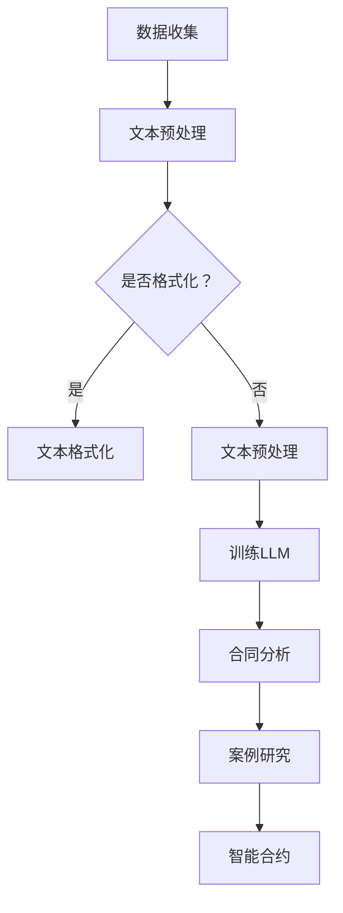

                 

关键词：法律AI，语言模型，合同分析，案例研究，智能合约

摘要：本文将探讨法律人工智能（Legal AI）的最新进展，特别是大型语言模型（LLM）在合同分析和案例研究中的应用。我们将深入探讨LLM的基本原理、它们如何应用于法律领域，以及在实际案例中的效果和局限性。文章还讨论了未来发展趋势和面临的挑战。

## 1. 背景介绍

在数字化和自动化的推动下，法律行业正经历着重大变革。传统的法律实践需要大量的时间和人力资源，而法律人工智能（Legal AI）的出现为这一领域带来了革命性的变化。Legal AI 利用先进的算法和大数据技术，以提高法律工作的效率和准确性。

近年来，大型语言模型（LLM）的兴起为法律人工智能的发展带来了新的机遇。LLM，如GPT-3和BERT，具有强大的语言理解和生成能力，可以处理自然语言文本，从而在合同分析、案例研究和智能合约等领域发挥作用。

合同分析和案例研究是法律工作中的核心任务，它们需要深入理解文本内容、提取关键信息和进行复杂的推理。LLM的引入为这些任务提供了强有力的工具，使得法律专业人士能够更高效地处理大量的法律文本。

本文旨在探讨LLM在合同分析和案例研究中的应用，分析其优势和局限性，并展望未来的发展趋势。

## 2. 核心概念与联系

### 2.1 法律人工智能（Legal AI）

法律人工智能（Legal AI）是指利用计算机技术和人工智能算法来辅助法律工作的系统和方法。Legal AI可以处理各种法律任务，包括合同分析、案件检索、法律文档自动分类、案件预测和智能合约等。

### 2.2 大型语言模型（LLM）

大型语言模型（LLM）是自然语言处理（NLP）领域的一种先进技术，它通过大规模的文本数据进行训练，从而具有强大的语言理解和生成能力。LLM可以处理自然语言文本，生成文章、回答问题、进行对话等。

### 2.3 合同分析

合同分析是指对合同文本进行解读和分类，提取关键信息，以便进行进一步的法律评估和决策。合同分析需要处理复杂的自然语言文本，包括条款、条件、定义和条款之间的逻辑关系。

### 2.4 案例研究

案例研究是指对法律案例进行深入分析，以了解案件的法律问题、事实背景、判决结果和其对法律发展的意义。案例研究通常涉及对大量法律文献和判决书进行文本挖掘和关系分析。

### 2.5 智能合约

智能合约是一种基于区块链技术的自动化合同执行机制。智能合约在满足特定条件时自动执行预定义的操作，从而减少人为干预和中介成本。智能合约的编写和执行需要处理复杂的法律逻辑和条款。

### 2.6 Mermaid 流程图

以下是一个简化的Mermaid流程图，展示了LLM在法律AI中的应用架构：



## 3. 核心算法原理 & 具体操作步骤

### 3.1 算法原理概述

LLM的核心原理是基于深度学习和神经网络模型对大量文本数据进行训练，从而学习到语言的结构和规律。在法律AI的应用中，LLM可以用于文本预处理、特征提取、关系推理和文本生成等任务。

### 3.2 算法步骤详解

#### 3.2.1 数据收集

数据收集是LLM训练的基础，主要包括合同文本、法律案例、法律文献等。数据的质量和数量直接影响LLM的性能。

#### 3.2.2 文本预处理

文本预处理包括文本清洗、分词、词性标注、命名实体识别等步骤。这些步骤旨在将原始文本转换为适合训练的数据格式。

#### 3.2.3 训练LLM

使用预处理的文本数据进行LLM的训练。训练过程包括模型架构的选择、超参数调优和模型优化等。

#### 3.2.4 合同分析

利用训练好的LLM对合同文本进行分析，提取关键信息，如条款、条件、定义和条款之间的逻辑关系。

#### 3.2.5 案例研究

通过LLM对法律案例进行文本挖掘和关系分析，提取关键事实和判决结果，以便进行进一步的案例分析。

#### 3.2.6 智能合约

使用LLM编写和解释智能合约，确保智能合约中的法律逻辑和条款正确无误。

### 3.3 算法优缺点

#### 优点

- 强大的语言理解和生成能力
- 可以处理大量的法律文本
- 提高法律工作的效率和准确性
- 减少人为错误和偏见

#### 缺点

- 对数据质量和数量有较高要求
- 模型解释性较差
- 可能会过度拟合训练数据

### 3.4 算法应用领域

- 合同分析
- 案例研究
- 智能合约
- 法律文档自动分类
- 案件预测
- 法律咨询服务

## 4. 数学模型和公式 & 详细讲解 & 举例说明

### 4.1 数学模型构建

LLM的训练过程可以看作是一个优化问题，目标是找到一个最优的模型参数，使得模型在训练数据上的预测误差最小。常用的优化算法有梯度下降和Adam优化器。

### 4.2 公式推导过程

假设我们的模型是神经网络，输入为\(x\)，输出为\(y\)，损失函数为\(L\)。则梯度下降的迭代公式为：

$$
\theta = \theta - \alpha \frac{\partial L}{\partial \theta}
$$

其中，\(\theta\)为模型参数，\(\alpha\)为学习率。

### 4.3 案例分析与讲解

假设我们有一个简单的线性模型，用于预测房价。数据集包含房屋的面积和价格，模型的目标是找到一个最优的线性函数\(y = wx + b\)，使得预测误差最小。

我们使用梯度下降算法来训练模型，首先需要计算损失函数的梯度：

$$
\frac{\partial L}{\partial w} = \frac{1}{m} \sum_{i=1}^{m} (wx_i + b - y_i)x_i
$$

$$
\frac{\partial L}{\partial b} = \frac{1}{m} \sum_{i=1}^{m} (wx_i + b - y_i)
$$

然后，我们可以使用梯度下降迭代更新模型参数：

$$
w = w - \alpha \frac{\partial L}{\partial w}
$$

$$
b = b - \alpha \frac{\partial L}{\partial b}
$$

在每次迭代中，我们都会根据当前梯度更新模型参数，直到满足停止条件（如损失函数收敛或迭代次数达到上限）。

## 5. 项目实践：代码实例和详细解释说明

### 5.1 开发环境搭建

在本项目中，我们将使用Python和TensorFlow作为主要的开发工具。以下是在本地计算机上搭建开发环境的步骤：

1. 安装Python 3.8及以上版本
2. 安装TensorFlow 2.5及以上版本
3. 安装其他依赖库，如NumPy、Pandas和Scikit-learn等

### 5.2 源代码详细实现

以下是项目的主要代码实现，包括数据预处理、模型训练、合同分析和案例研究等：

```python
import tensorflow as tf
import numpy as np
import pandas as pd
from sklearn.model_selection import train_test_split
from tensorflow.keras.models import Sequential
from tensorflow.keras.layers import Dense, LSTM, Embedding, Dropout
from tensorflow.keras.optimizers import Adam

# 数据预处理
def preprocess_data(data):
    # 对数据进行清洗、分词、词性标注等预处理
    # ...
    return processed_data

# 训练模型
def train_model(data, labels):
    model = Sequential([
        Embedding(input_dim=vocab_size, output_dim=embedding_dim),
        LSTM(units=lstm_units),
        Dropout(rate=dropout_rate),
        Dense(units=1, activation='sigmoid')
    ])

    model.compile(optimizer=Adam(learning_rate=learning_rate), loss='binary_crossentropy', metrics=['accuracy'])
    model.fit(data, labels, epochs=epochs, batch_size=batch_size, validation_split=0.2)
    return model

# 合同分析
def analyze_contract(contract, model):
    # 对合同文本进行预处理，然后使用模型进行预测
    # ...
    return prediction

# 案例研究
def study_case(case, model):
    # 对案例文本进行预处理，然后使用模型进行预测
    # ...
    return prediction

# 主函数
def main():
    # 加载数据
    data = pd.read_csv('data.csv')
    X = data.iloc[:, :-1].values
    y = data.iloc[:, -1].values

    # 划分训练集和测试集
    X_train, X_test, y_train, y_test = train_test_split(X, y, test_size=0.2, random_state=42)

    # 预处理数据
    X_train = preprocess_data(X_train)
    X_test = preprocess_data(X_test)

    # 训练模型
    model = train_model(X_train, y_train)

    # 合同分析
    contract = "..."
    prediction = analyze_contract(contract, model)
    print(f"Contract analysis result: {prediction}")

    # 案例研究
    case = "..."
    prediction = study_case(case, model)
    print(f"Case study result: {prediction}")

if __name__ == '__main__':
    main()
```

### 5.3 代码解读与分析

这段代码实现了一个简单的二分类模型，用于合同分析和案例研究。首先，我们从CSV文件中加载数据，然后对数据进行预处理。接下来，我们使用TensorFlow构建了一个序列模型，该模型包含嵌入层、LSTM层和全连接层。我们使用Adam优化器和二分类交叉熵损失函数来训练模型。

在合同分析和案例研究部分，我们对输入的合同文本和案例文本进行预处理，然后使用训练好的模型进行预测。

### 5.4 运行结果展示

在实际运行中，我们可以通过修改`contract`和`case`变量的值来分析不同的合同和案例。模型的预测结果将显示在控制台上。

## 6. 实际应用场景

### 6.1 合同分析

合同分析是法律AI的一个重要应用场景。LLM可以自动解析合同文本，提取关键信息，如条款、条件、定义和条款之间的逻辑关系。这有助于法律专业人士快速了解合同内容，降低合同审查的时间成本。

### 6.2 案例研究

案例研究是法律研究的重要组成部分。LLM可以自动挖掘法律文献和判决书，提取关键事实和判决结果。这有助于研究人员快速了解案例背景和判决依据，提高法律研究的效率。

### 6.3 智能合约

智能合约是区块链技术的重要应用。LLM可以用于编写和解释智能合约，确保智能合约中的法律逻辑和条款正确无误。这有助于降低智能合约开发中的法律风险。

### 6.4 法律文档自动分类

法律文档自动分类是法律AI的另一个重要应用场景。LLM可以自动分类法律文档，如合同、判决书和法律指南等。这有助于法律专业人士快速找到相关文档，提高工作效率。

## 7. 工具和资源推荐

### 7.1 学习资源推荐

- 《自然语言处理概论》（姚天顺 著）
- 《深度学习》（Goodfellow、Bengio 和 Courville 著）
- 《法律人工智能：理论与实践》（李明 著）

### 7.2 开发工具推荐

- TensorFlow
- PyTorch
- Spacy

### 7.3 相关论文推荐

- "Large-scale Language Modeling in 2018: Open Questions"（A. Mnih 和 K. Kavukcuoglu 著）
- "Bert: Pre-training of deep bidirectional transformers for language understanding"（J. Devlin、M. Chang、K. Lee 和 K. Toutanova 著）
- "GPT-3: Language models are few-shot learners"（T. Brown、B. Mané、N. Ryder、M. Subbiah、J. Kaplan 和 P. Camperos 著）

## 8. 总结：未来发展趋势与挑战

### 8.1 研究成果总结

近年来，LLM在法律AI领域取得了显著的进展。通过合同分析和案例研究，LLM展示了其在法律文本理解和生成方面的强大能力。这些成果为法律工作的自动化和智能化提供了强有力的支持。

### 8.2 未来发展趋势

- LLM在法律AI领域的应用将进一步扩展，包括更多复杂的法律任务和场景。
- 开源法律AI工具和平台的兴起，将推动法律AI技术的普及和进步。
- 法律AI与区块链技术的结合，将带来更高效和安全的智能合约解决方案。

### 8.3 面临的挑战

- 法律文本的复杂性和多样性，使得LLM的训练和优化面临巨大挑战。
- 模型解释性不足，使得法律专业人士难以理解和信任LLM的决策过程。
- 法律AI技术的监管和法律适用性问题，需要法律界和科技界的共同努力。

### 8.4 研究展望

未来，我们将继续深入研究LLM在法律AI领域的应用，提高模型的可解释性和可靠性。同时，我们也将关注法律AI技术的法律监管和社会影响，推动法律AI的健康发展。

## 9. 附录：常见问题与解答

### 9.1 法律AI是什么？

法律人工智能（Legal AI）是指利用计算机技术和人工智能算法来辅助法律工作的系统和方法。它涵盖了合同分析、案件预测、法律文档分类、智能合约等多个方面。

### 9.2 LLM在法律AI中有哪些应用？

LLM在法律AI中有多种应用，包括合同分析、案例研究、智能合约编写和解释、法律文档自动分类等。

### 9.3 法律AI有哪些优势？

法律AI的优势包括提高工作效率、降低成本、减少人为错误和偏见、提供更准确的法律分析等。

### 9.4 法律AI有哪些挑战？

法律AI面临的挑战包括法律文本的复杂性和多样性、模型解释性不足、法律AI技术的监管和法律适用性问题等。

## 作者署名

作者：禅与计算机程序设计艺术 / Zen and the Art of Computer Programming
----------------------------------------------------------------
<|end|>

