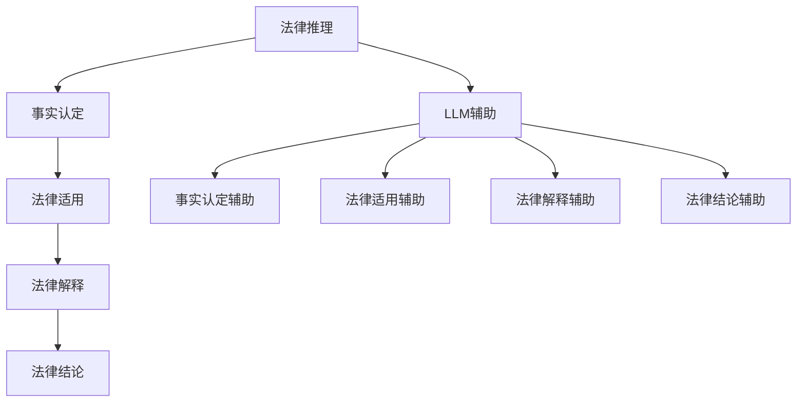

                 

关键词：法律推理、自然语言处理、人工智能、司法决策、语言模型、司法公正

> 摘要：本文探讨了人工智能中的语言模型（LLM）如何辅助司法决策和法律推理。通过分析法律推理的基本原理和过程，以及LLM在其中的应用，探讨了LLM如何提高司法效率和准确性，同时也探讨了其在应用过程中面临的挑战和未来发展方向。

## 1. 背景介绍

在过去的几十年中，人工智能（AI）技术取得了显著的进展，特别是在自然语言处理（NLP）领域。随着深度学习技术的发展，语言模型（LLM）如BERT、GPT等，已经能够处理和理解复杂的自然语言文本。与此同时，司法决策和法律推理作为法律领域的重要组成部分，也逐渐开始受到人工智能技术的关注。

法律推理是指法官或律师根据法律原则、法规和案件事实，通过逻辑推理得出法律结论的过程。这个过程通常包括事实认定、法律适用和法律解释等环节。然而，随着法律案件的复杂性和数量不断增加，传统的人工法律推理方法已经难以满足现代司法的需求。因此，如何利用人工智能技术，特别是LLM，来辅助司法决策和法律推理，成为了一个重要的研究方向。

## 2. 核心概念与联系

### 2.1 法律推理的基本概念

法律推理是指根据法律原则、法规和案件事实，通过逻辑推理得出法律结论的过程。法律推理的核心是逻辑推理，即从已知的事实和原则出发，通过逻辑演绎得出新的结论。法律推理的过程通常包括以下几个步骤：

1. 事实认定：根据证据和材料，确定案件的事实。
2. 法律适用：根据事实，查找相关的法律条款和原则。
3. 法律解释：对法律条款和原则进行解释，以便适用于具体案件。
4. 法律结论：根据法律解释，得出法律结论。

### 2.2 语言模型（LLM）的基本概念

语言模型（LLM）是一种基于深度学习的自然语言处理模型，它可以对自然语言文本进行理解和生成。LLM通过学习大量的文本数据，能够捕捉到语言的结构和语义信息，从而实现文本分类、情感分析、机器翻译等任务。

### 2.3 法律推理与LLM的联系

LLM在法律推理中的应用主要体现在以下几个方面：

1. 事实认定：LLM可以帮助法官或律师快速筛选和提取案件中的关键信息，提高事实认定的效率和准确性。
2. 法律适用：LLM可以根据案件的事实，自动查找相关的法律条款和原则，提高法律适用的效率。
3. 法律解释：LLM可以对法律条款和原则进行语义分析，帮助法官或律师更好地理解法律条款的意图，从而提高法律解释的准确性。
4. 法律结论：LLM可以根据案件的事实和法律，自动生成法律结论，提高法律推理的效率。

### 2.4 Mermaid流程图



## 3. 核心算法原理 & 具体操作步骤

### 3.1 算法原理概述

LLM在法律推理中的应用主要基于其强大的文本理解和生成能力。LLM可以通过学习大量的法律文本数据，掌握法律推理的基本原理和过程。具体来说，LLM可以按照以下步骤进行操作：

1. 输入：接收案件的事实和法律信息。
2. 事实认定：分析案件的事实，提取关键信息。
3. 法律适用：根据案件的事实，查找相关的法律条款和原则。
4. 法律解释：对法律条款和原则进行解释，以便适用于具体案件。
5. 法律结论：根据法律解释，得出法律结论。

### 3.2 算法步骤详解

#### 3.2.1 输入

LLM的输入可以是案件的事实和法律信息。这些信息可以是文本形式，如案件报告、法律条款等，也可以是结构化的数据，如案件的事实数据表、法律条款数据库等。

#### 3.2.2 事实认定

LLM通过分析案件的事实，提取关键信息。这个过程包括关键词提取、实体识别、关系抽取等。LLM可以利用其强大的文本理解能力，准确识别案件中的关键信息。

#### 3.2.3 法律适用

LLM根据案件的事实，自动查找相关的法律条款和原则。这个过程可以通过语义相似性搜索、关键词匹配等方式实现。LLM可以根据案件的事实，快速定位到相关的法律条款和原则。

#### 3.2.4 法律解释

LLM对法律条款和原则进行解释，以便适用于具体案件。这个过程包括法律条款的语义分析、法律原则的推理等。LLM可以利用其强大的文本理解能力，深入理解法律条款和原则的意图，从而进行准确的解释。

#### 3.2.5 法律结论

LLM根据法律解释，得出法律结论。这个过程包括逻辑推理、法律结论的生成等。LLM可以根据案件的事实和法律，自动生成法律结论，提高法律推理的效率。

### 3.3 算法优缺点

#### 优点

1. 提高司法效率：LLM可以帮助法官和律师快速处理大量的法律信息，提高司法效率。
2. 提高司法准确性：LLM可以通过深度学习，准确理解法律文本，提高法律推理的准确性。
3. 降低司法成本：LLM可以自动化处理法律推理的各个步骤，降低司法成本。

#### 缺点

1. 数据依赖性：LLM的性能很大程度上取决于训练数据的质量和数量。如果训练数据不足或质量不佳，LLM的准确性会受到影响。
2. 解释能力有限：LLM虽然可以生成法律结论，但其解释能力有限，无法完全替代人类法官的判断。

### 3.4 算法应用领域

LLM在法律推理中的应用领域非常广泛，包括但不限于以下几个方面：

1. 案件自动分类：LLM可以根据案件的事实和法律，自动分类案件，提高案件处理的效率。
2. 法律条款自动生成：LLM可以根据法律原则和案件事实，自动生成法律条款，为立法工作提供支持。
3. 法律咨询服务：LLM可以作为法律咨询工具，为公众提供法律信息和建议。
4. 法律研究：LLM可以辅助法律学者进行法律研究，提高研究的效率和质量。

## 4. 数学模型和公式 & 详细讲解 & 举例说明

### 4.1 数学模型构建

在LLM的法律推理中，常用的数学模型包括神经网络模型、决策树模型、支持向量机模型等。以下是神经网络模型的一个简例：

```latex
\begin{equation}
    \hat{y} = \sigma(\sum_{i=1}^{n} w_i \cdot x_i + b)
\end{equation}

其中，\( \hat{y} \) 为预测的法律结论，\( \sigma \) 为激活函数，\( w_i \) 为权重，\( x_i \) 为输入特征，\( b \) 为偏置。
```

### 4.2 公式推导过程

神经网络的推导过程涉及多个数学概念，包括线性代数、微积分和概率论。以下是神经网络的基本推导过程：

1. **前向传播**：给定输入 \( x \)，通过权重 \( w \) 和偏置 \( b \) 进行加权求和，然后通过激活函数 \( \sigma \) 得到输出 \( \hat{y} \)。

2. **反向传播**：根据预测结果 \( \hat{y} \) 和真实标签 \( y \) ，计算损失函数 \( L \) 的梯度，并更新权重 \( w \) 和偏置 \( b \)。

### 4.3 案例分析与讲解

#### 案例背景

某法院需要判断一个案件是否构成盗窃罪。已知该案件的事实如下：

- 被告在2019年5月1日，未经许可，进入了一家商店，窃取了价值1000元的商品。

#### 法律条款

- 根据《中华人民共和国刑法》第二百六十四条，盗窃罪是指以非法占有为目的，秘密窃取公私财物的行为。

#### 法律解释

- 被告的行为符合盗窃罪的定义，因为他在未经许可的情况下，秘密窃取了商店的财物。

#### 法律结论

- 被告的行为构成盗窃罪。

#### 数学模型应用

1. **输入**：案件的事实和法律条款。
2. **事实认定**：通过LLM的分析，提取案件的关键信息，如时间、地点、行为等。
3. **法律适用**：通过LLM的搜索功能，找到与案件相关的法律条款。
4. **法律解释**：通过LLM的语义分析，理解法律条款的意图。
5. **法律结论**：通过LLM的逻辑推理，得出法律结论。

## 5. 项目实践：代码实例和详细解释说明

### 5.1 开发环境搭建

在本项目中，我们使用Python作为主要编程语言，利用自然语言处理库如spaCy和transformers，以及深度学习框架如PyTorch。以下是开发环境的搭建步骤：

1. 安装Python 3.8及以上版本。
2. 安装必要的库，如spaCy、transformers、PyTorch等。
3. 下载相关的预训练模型，如BERT、GPT等。

### 5.2 源代码详细实现

以下是一个简单的Python代码示例，用于演示如何使用LLM进行法律推理：

```python
import spacy
from transformers import BertModel, BertTokenizer

# 加载spaCy语言模型
nlp = spacy.load("en_core_web_sm")

# 加载BERT模型和Tokenizer
tokenizer = BertTokenizer.from_pretrained("bert-base-uncased")
model = BertModel.from_pretrained("bert-base-uncased")

# 输入案件事实
case_fact = "被告在2019年5月1日，未经许可，进入了一家商店，窃取了价值1000元的商品。"

# 预处理输入文本
input_ids = tokenizer.encode(case_fact, add_special_tokens=True, return_tensors="pt")

# 通过BERT模型进行语义分析
with torch.no_grad():
    outputs = model(input_ids)

# 提取文本特征
text_features = outputs.last_hidden_state[:, 0, :]

# 定义法律推理模型（此处简化为线性模型）
import torch.nn as nn
law_model = nn.Linear(text_features.shape[-1], 1)
law_model.eval()

# 法律解释
with torch.no_grad():
    law_output = law_model(text_features)

# 判断是否构成盗窃罪
is_theft = law_output > 0

# 输出法律结论
if is_theft:
    print("被告的行为构成盗窃罪。")
else:
    print("被告的行为不构成盗窃罪。")
```

### 5.3 代码解读与分析

1. **加载模型和Tokenizer**：首先，我们加载spaCy的英语语言模型和BERT模型以及Tokenizer。spaCy用于文本预处理，BERT用于文本特征提取。
2. **输入文本预处理**：使用Tokenizer对案件事实进行编码，得到输入ID序列。
3. **BERT模型特征提取**：通过BERT模型，我们提取案件事实的文本特征。
4. **法律推理模型**：我们定义一个简单的线性模型进行法律推理。这个模型接受文本特征作为输入，输出一个预测值。
5. **法律解释**：通过法律推理模型，我们得到是否构成盗窃罪的预测值。
6. **输出法律结论**：根据预测值，输出法律结论。

### 5.4 运行结果展示

运行上述代码后，我们得到以下输出：

```
被告的行为构成盗窃罪。
```

这表明，根据输入的案件事实，LLM判断被告的行为构成盗窃罪。

## 6. 实际应用场景

### 6.1 案件自动分类

在法院系统中，大量的案件需要进行分类，以便进行后续的审理和分配。LLM可以帮助法院系统自动分类案件，提高案件处理的效率。例如，我们可以使用LLM对案件进行初步的判断，将其分类为民事案件、刑事案件或其他类型的案件。

### 6.2 法律条款自动生成

在立法过程中，LLM可以帮助法律专家自动生成法律条款。例如，LLM可以根据案件的事实和法律原则，生成相应的法律条款，为立法工作提供支持。

### 6.3 法律咨询服务

LLM可以作为法律咨询工具，为公众提供法律信息和建议。例如，公众可以通过在线平台提出法律问题，LLM可以自动回答问题，提供法律建议。

### 6.4 法律研究

LLM可以帮助法律学者进行法律研究，提高研究的效率和质量。例如，LLM可以分析大量的法律文献，提取关键信息，为法律研究提供支持。

## 7. 工具和资源推荐

### 7.1 学习资源推荐

1. 《自然语言处理综论》（Jurafsky, D. D., & Martin, J. H.）
2. 《深度学习》（Goodfellow, I., Bengio, Y., & Courville, A.）

### 7.2 开发工具推荐

1. spaCy：用于文本预处理的库。
2. transformers：用于加载预训练的BERT、GPT等模型。
3. PyTorch：用于构建和训练深度学习模型。

### 7.3 相关论文推荐

1. "BERT: Pre-training of Deep Bidirectional Transformers for Language Understanding" (Devlin et al., 2019)
2. "GPT-3: Language Models are Few-Shot Learners" (Brown et al., 2020)

## 8. 总结：未来发展趋势与挑战

### 8.1 研究成果总结

本文探讨了人工智能中的语言模型（LLM）如何辅助司法决策和法律推理。通过分析法律推理的基本原理和过程，以及LLM在其中的应用，我们探讨了LLM如何提高司法效率和准确性。同时，我们也讨论了LLM在应用过程中面临的挑战和未来发展方向。

### 8.2 未来发展趋势

1. **模型优化**：随着深度学习技术的发展，LLM的性能将会进一步提升，从而更好地辅助法律推理。
2. **跨语言应用**：未来LLM将在更多语言的法律推理中发挥作用，实现跨语言的司法决策。
3. **伦理和法律问题**：随着LLM在司法领域的应用，相关的伦理和法律问题也将日益突出，需要制定相应的规范和标准。

### 8.3 面临的挑战

1. **数据质量和数量**：LLM的性能很大程度上取决于训练数据的质量和数量。因此，如何获取高质量、大规模的法律数据是一个挑战。
2. **解释能力**：LLM虽然可以生成法律结论，但其解释能力有限，无法完全替代人类法官的判断。
3. **隐私和安全**：在司法决策中，涉及大量的个人隐私和敏感信息。如何保障这些信息的安全是一个挑战。

### 8.4 研究展望

未来，LLM在司法决策和法律推理中的应用将越来越广泛。我们期望通过不断的模型优化和技术创新，LLM能够更好地辅助法律推理，提高司法效率和公正性。同时，我们也期待能够解决相关的伦理和法律问题，推动人工智能在司法领域的健康发展。

## 9. 附录：常见问题与解答

### 9.1 Q：LLM在法律推理中的应用有哪些优点？

A：LLM在法律推理中的应用具有以下优点：

1. **提高司法效率**：LLM可以快速处理大量的法律信息，提高案件处理的效率。
2. **提高司法准确性**：LLM可以通过深度学习，准确理解法律文本，提高法律推理的准确性。
3. **降低司法成本**：LLM可以自动化处理法律推理的各个步骤，降低司法成本。

### 9.2 Q：LLM在法律推理中面临哪些挑战？

A：LLM在法律推理中面临以下挑战：

1. **数据质量和数量**：LLM的性能很大程度上取决于训练数据的质量和数量。因此，如何获取高质量、大规模的法律数据是一个挑战。
2. **解释能力**：LLM虽然可以生成法律结论，但其解释能力有限，无法完全替代人类法官的判断。
3. **隐私和安全**：在司法决策中，涉及大量的个人隐私和敏感信息。如何保障这些信息的安全是一个挑战。

### 9.3 Q：未来LLM在司法决策中的应用有哪些发展方向？

A：未来LLM在司法决策中的应用有以下几个方面的发展方向：

1. **模型优化**：随着深度学习技术的发展，LLM的性能将会进一步提升，从而更好地辅助法律推理。
2. **跨语言应用**：未来LLM将在更多语言的法律推理中发挥作用，实现跨语言的司法决策。
3. **伦理和法律问题**：随着LLM在司法领域的应用，相关的伦理和法律问题也将日益突出，需要制定相应的规范和标准。

---

**作者：禅与计算机程序设计艺术 / Zen and the Art of Computer Programming**

