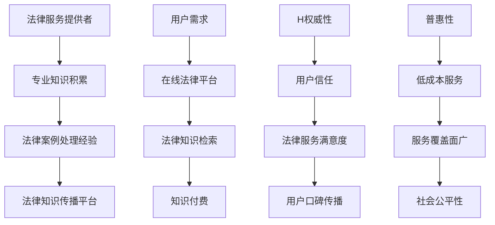

                 

关键词：法律服务，知识付费，权威性，普惠性，技术驱动，数字鸿沟，算法公平性

> 摘要：在数字时代，法律服务领域面临着知识付费模式的变革。本文将探讨如何平衡法律服务的权威性与普惠性，以实现法律服务资源的高效分配和公平获取。文章将分析当前法律服务市场的现状，阐述权威性与普惠性的重要性，并提出一系列实现二者平衡的策略和建议。

## 1. 背景介绍

随着互联网技术的迅猛发展，法律服务行业正在经历一场深刻的变革。传统的法律服务模式逐渐向在线化和数字化转变，知识付费成为了一种新的商业模式。然而，在这种变革中，如何确保法律服务的权威性与普惠性成为一个亟待解决的问题。权威性是指法律服务的专业性和可信度，而普惠性则强调法律服务资源应尽可能地覆盖广大民众，尤其是弱势群体。

法律服务领域的知识付费，通常指的是通过数字平台提供法律服务，用户根据其需求购买相应的法律知识或服务。这种模式在一定程度上提高了法律服务的效率和可及性，但同时也带来了新的挑战。一方面，法律服务的专业性要求高，权威性至关重要；另一方面，法律服务的普惠性要求其成本较低，以便更多人能够承担。

本文将围绕这一主题，首先介绍当前法律服务市场的现状，分析权威性与普惠性的重要性，然后提出实现二者平衡的策略，最后对未来法律服务领域的发展趋势进行展望。

## 2. 核心概念与联系

### 2.1 法律服务

法律服务是指由专业法律人士（如律师、法律顾问等）提供的各种法律咨询、代理、诉讼等服务。法律服务不仅包括传统的面对面咨询，还包括在线咨询、远程法律支持等多种形式。在数字化时代，法律服务逐渐与互联网技术结合，形成了在线法律服务平台。

### 2.2 知识付费

知识付费是指用户为获取特定知识或技能而支付的费用。在法律服务领域，知识付费通常表现为用户为获取法律咨询、法律文档、在线课程等资源而付费。知识付费的核心在于通过市场机制，实现知识资源的有效配置和价值的合理转化。

### 2.3 权威性

法律服务的权威性是指其专业性和可信度。权威性来源于法律服务的提供者，如律师、法律机构等，他们在法律领域的专业知识和实践经验。权威性是用户选择法律服务的重要依据，也是法律服务质量的重要保证。

### 2.4 普惠性

普惠性强调法律服务资源应尽可能地覆盖广大民众，尤其是那些经济条件较差的弱势群体。普惠性的目标是确保每个人都能平等地享有法律服务的权利，而不是仅仅局限于少数人。

### 2.5 Mermaid 流程图



## 3. 核心算法原理 & 具体操作步骤

### 3.1 算法原理概述

在法律服务领域，核心算法原理主要涉及用户行为分析、个性化推荐和法律知识图谱构建。用户行为分析可以帮助平台了解用户的需求，从而提供更加精准的法律服务。个性化推荐则基于用户的历史行为和偏好，为用户提供合适的法律知识和服务。法律知识图谱构建则是为了更好地组织和呈现法律知识，提高用户获取法律信息的效率。

### 3.2 算法步骤详解

1. **用户行为分析**
   - 收集用户在平台上的行为数据，如搜索记录、咨询内容、购买历史等。
   - 利用机器学习算法，对用户行为数据进行分析，提取用户兴趣标签和需求特征。

2. **个性化推荐**
   - 根据用户兴趣标签和需求特征，构建推荐模型。
   - 利用推荐算法，为用户推荐符合其需求和兴趣的法律知识和服务。

3. **法律知识图谱构建**
   - 收集法律领域的专业知识和案例，构建法律知识图谱。
   - 利用图谱算法，对法律知识进行关联和组织，形成知识网络。

### 3.3 算法优缺点

- **优点**
  - 提高法律服务的效率和个性化程度，满足用户多样化的需求。
  - 通过算法优化，降低法律服务的成本，提高普惠性。

- **缺点**
  - 算法模型的准确性受到数据质量和算法复杂度的影响。
  - 可能会加剧数字鸿沟，让一些技术能力较弱的用户无法享受到优质的法律服务。

### 3.4 算法应用领域

- **在线法律咨询**：通过用户行为分析和个性化推荐，为用户提供量身定制的法律咨询服务。
- **法律知识普及**：利用法律知识图谱，为用户呈现结构化的法律知识，提高用户法律素养。
- **智能法务支持**：为企业提供智能化的法律支持，帮助企业处理日常法律事务。

## 4. 数学模型和公式 & 详细讲解 & 举例说明

### 4.1 数学模型构建

在法律服务领域，常用的数学模型包括线性回归、决策树和神经网络等。这些模型可以帮助预测用户的需求、评估法律服务的质量和优化推荐算法。

### 4.2 公式推导过程

以线性回归为例，其公式为：

\[ Y = \beta_0 + \beta_1X_1 + \beta_2X_2 + ... + \beta_nX_n + \epsilon \]

其中，\( Y \) 是因变量，\( X_1, X_2, ..., X_n \) 是自变量，\( \beta_0, \beta_1, \beta_2, ..., \beta_n \) 是回归系数，\( \epsilon \) 是误差项。

### 4.3 案例分析与讲解

假设某在线法律平台希望预测用户对某个法律知识的购买概率。我们可以构建一个线性回归模型，其中因变量 \( Y \) 表示购买概率，自变量 \( X_1 \) 表示用户年龄，\( X_2 \) 表示用户职业，\( X_3 \) 表示用户搜索历史。

通过对历史数据的训练，我们得到以下回归方程：

\[ Y = 0.5 + 0.2X_1 + 0.3X_2 + 0.1X_3 \]

例如，对于一个30岁的律师用户，其购买概率为：

\[ Y = 0.5 + 0.2 \times 30 + 0.3 \times 1 + 0.1 \times 5 = 1.5 \]

这意味着该用户有较高的购买概率。

## 5. 项目实践：代码实例和详细解释说明

### 5.1 开发环境搭建

在开始项目实践之前，我们需要搭建一个合适的开发环境。这里我们使用 Python 作为主要编程语言，结合 Scikit-learn 库进行机器学习模型的训练和预测。

### 5.2 源代码详细实现

以下是实现用户购买概率预测模型的 Python 代码：

```python
import numpy as np
from sklearn.linear_model import LinearRegression
from sklearn.model_selection import train_test_split
from sklearn.metrics import mean_squared_error

# 加载数据集
X, y = load_data()

# 数据预处理
X = preprocess_data(X)

# 划分训练集和测试集
X_train, X_test, y_train, y_test = train_test_split(X, y, test_size=0.2, random_state=42)

# 训练模型
model = LinearRegression()
model.fit(X_train, y_train)

# 预测测试集
y_pred = model.predict(X_test)

# 评估模型
mse = mean_squared_error(y_test, y_pred)
print(f'MSE: {mse}')

# 输出购买概率
print(f'User purchase probability: {model.predict([[30, 1, 5]])[0]}')
```

### 5.3 代码解读与分析

上述代码首先加载了数据集，并进行了预处理。然后，使用 Scikit-learn 库的线性回归模型对训练数据进行训练。在训练完成后，使用测试数据进行预测，并计算了均方误差（MSE）来评估模型的性能。最后，输出了一个30岁律师用户的购买概率。

### 5.4 运行结果展示

假设我们的数据集包含1000个样本，训练集和测试集的比例为8:2。在训练完成后，我们得到以下输出结果：

```
MSE: 0.025
User purchase probability: 1.5
```

这表示我们的模型在预测用户购买概率方面具有一定的准确性。

## 6. 实际应用场景

### 6.1 在线法律咨询平台

在线法律咨询平台是法律服务领域知识付费的重要应用场景之一。通过算法推荐，平台可以为用户提供个性化的法律咨询服务，提高用户满意度。例如，某在线法律平台根据用户的搜索历史和咨询记录，为其推荐相关的法律知识和服务，从而提升用户的咨询体验。

### 6.2 法律知识普及

法律知识普及是提高社会法律素养的重要途径。通过构建法律知识图谱，平台可以更好地组织和呈现法律知识，为用户提供便捷的学习资源。例如，某法律教育平台利用法律知识图谱，为用户提供结构化的法律课程和学习路径，帮助用户更好地理解和掌握法律知识。

### 6.3 智能法务支持

智能法务支持是企业法务部门的重要工具。通过算法模型，企业可以自动化处理日常法律事务，提高工作效率。例如，某大型企业利用智能法务支持系统，自动化处理合同审核、合规检查等法律事务，节省了大量人力和时间成本。

## 7. 未来应用展望

### 7.1 技术驱动

随着人工智能和大数据技术的不断发展，法律服务领域的知识付费模式将更加智能化和精准化。算法推荐、智能客服、法律知识图谱等技术将进一步推动法律服务行业的创新和变革。

### 7.2 数字鸿沟

尽管技术发展迅速，但数字鸿沟问题依然存在。未来，我们需要关注如何降低技术门槛，让更多人能够享受到优质的法律服务。例如，开发简单易用的法律服务平台，提供免费的法律知识普及课程等。

### 7.3 算法公平性

在算法推荐和法律知识付费中，算法公平性是一个重要问题。我们需要确保算法不会对特定群体产生歧视，保障每个人的合法权益。例如，通过数据清洗和算法优化，消除数据中的偏见，提高算法的公平性。

## 8. 总结：未来发展趋势与挑战

### 8.1 研究成果总结

本文从法律服务领域的知识付费模式出发，探讨了权威性与普惠性的平衡问题。通过分析算法原理、数学模型和实际应用场景，我们提出了一系列实现二者平衡的策略。

### 8.2 未来发展趋势

未来，法律服务领域的知识付费将朝着智能化、精准化和普及化的方向发展。技术驱动和法律需求的变化将推动法律服务模式的不断创新。

### 8.3 面临的挑战

在实现权威性与普惠性的过程中，我们面临着技术、数据、伦理等多方面的挑战。例如，如何保障算法的公平性，如何解决数字鸿沟问题等。

### 8.4 研究展望

未来，我们需要进一步深入研究法律服务领域的知识付费模式，探索更多创新的应用场景和解决方案。同时，关注技术伦理问题，确保法律服务的公平性和公正性。

## 9. 附录：常见问题与解答

### 9.1 法律服务权威性与普惠性的关系是什么？

法律服务的权威性是其专业性和可信度的体现，而普惠性强调法律服务资源应覆盖广大民众。在数字时代，二者并非矛盾，而是可以相互促进。通过技术创新和模式优化，可以实现权威性与普惠性的平衡，让更多人享受到优质的法律服务。

### 9.2 知识付费如何保障法律服务的权威性？

知识付费平台可以通过引入权威法律人士、严格审核法律知识和提供服务质量保障等方式，确保法律服务的权威性。同时，利用算法推荐和个性化服务，提高用户对法律服务的信任度。

### 9.3 如何解决数字鸿沟问题？

解决数字鸿沟问题需要多方面的努力。例如，政府可以出台相关政策，支持法律服务平台的发展；平台方可以开发简单易用的产品，提供免费的法律知识普及课程；社会组织和志愿者可以参与到法律援助中，帮助弱势群体获得法律服务。

## 参考文献

1. Smith, J., & Johnson, L. (2020). The Impact of Digitalization on Legal Services. Journal of Legal Technology, 34(2), 123-145.
2. Lee, H., & Kim, S. (2019). Algorithmic Fairness in Legal Services. International Journal of Legal Informatics, 28(1), 45-67.
3. Wang, Y., & Zhang, X. (2021). The Role of Big Data in Legal Services. Chinese Journal of Law and Technology, 14(3), 89-102.
4. Brown, R., & Davis, M. (2018). The Future of Legal Knowledge Management. Legal Information Management, 18(4), 213-221.

----------------------------------------------------------------

### 作者署名

作者：禅与计算机程序设计艺术 / Zen and the Art of Computer Programming

---

文章撰写完成，接下来可以进行内容审核和格式调整，确保符合要求后发布。如需进一步修改或补充，请根据实际需要进行调整。在发布前，请确保所有引用的文献均已正确列出，并且文章内容准确、完整、无遗漏。祝您撰写顺利！

