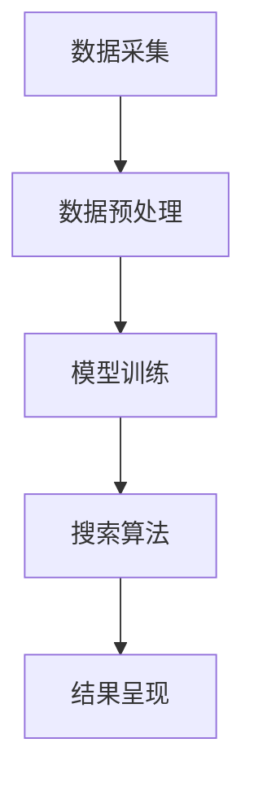

                 

关键词：人工智能，法律，搜索，应用，算法，模型，技术

> 摘要：本文将探讨人工智能在法律领域的应用，特别是在法律搜索方面的技术。通过分析现有技术和案例，本文旨在提供一个全面的视角，揭示AI搜索在法律实践中的潜力和挑战。

## 1. 背景介绍

### 法律与人工智能的交汇

法律作为社会规范的重要组成部分，其严谨性和精确性要求极高。而人工智能（AI）技术的迅猛发展为法律领域的创新提供了新的契机。AI在法律搜索、分析、决策支持等方面展现出显著优势，逐步改变了传统法律工作的模式。

### 法律搜索的挑战

法律信息的庞杂性、更新速度以及专业性要求，使得传统法律搜索面临诸多挑战。法律文本往往具有高度的不确定性和复杂性，使得传统的搜索方法难以满足高效、准确的需求。此外，法律实践中对时效性和精确度的要求也日益提高。

### AI搜索在法律领域的应用

随着AI技术的发展，特别是在自然语言处理、机器学习、数据挖掘等领域的突破，AI搜索在法律领域中的应用逐渐兴起。AI搜索技术能够处理大量法律文本，快速定位相关信息，提供精准的法律检索和分析服务。

## 2. 核心概念与联系

### AI搜索的概念

AI搜索是指利用人工智能技术进行信息检索的过程。它包括从大量数据中提取关键信息、理解语义、关联知识等复杂操作，以实现高效、精准的信息检索。

### 法律文档的特点与处理

法律文档通常包含法律条文、案例、判决书、法规解释等多种形式，其文本具有高度的结构化和半结构化特点。AI需要处理这些文档的结构化信息和非结构化文本，以提取有用的知识。

### AI搜索在法律领域的架构

在法律领域，AI搜索的应用架构通常包括数据采集、预处理、模型训练、搜索算法和结果呈现等环节。数据采集涉及法律文档的收集和整合，预处理包括文本清洗、分词、实体识别等，模型训练使用机器学习和深度学习技术，搜索算法则根据用户需求进行查询和结果排序，结果呈现则提供直观的可视化输出。

### Mermaid 流程图



## 3. 核心算法原理 & 具体操作步骤

### 3.1 算法原理概述

AI搜索算法的核心在于如何从大规模的法律文档中快速、准确地提取相关信息。主要技术包括自然语言处理（NLP）、机器学习和深度学习等。

### 3.2 算法步骤详解

#### 3.2.1 数据采集

- 获取来源：从官方网站、法律数据库、法院判决书等渠道收集法律文档。
- 数据格式：统一转换为电子文本格式，如PDF、Word等。

#### 3.2.2 数据预处理

- 文本清洗：去除格式化标记、标点符号、无关文本等。
- 分词：将文本分解为单词或短语。
- 实体识别：识别文本中的关键实体，如人名、地名、法律条款等。

#### 3.2.3 模型训练

- 选择模型：常用的模型有词袋模型、卷积神经网络（CNN）、循环神经网络（RNN）、变压器（Transformer）等。
- 数据标注：对训练数据标注相关标签，如案件类型、判决结果等。
- 训练过程：使用训练数据对模型进行训练，优化模型参数。

#### 3.2.4 搜索算法

- 基于内容的检索：根据关键词匹配文档内容。
- 基于语义的检索：使用NLP技术理解用户查询意图，匹配相关文档。
- 排序算法：根据文档的相关性对搜索结果进行排序，如TF-IDF、PageRank等。

#### 3.2.5 结果呈现

- 结果展示：将搜索结果以列表、图表、地图等形式呈现。
- 结果解释：提供详细的文档摘要、相关法律条款等信息。

### 3.3 算法优缺点

#### 优点：

- 高效：AI搜索能够快速处理海量法律文档。
- 准确：通过深度学习和自然语言处理技术，实现精准的法律检索。
- 可扩展：能够适应不同法律领域的需求，具有较好的通用性。

#### 缺点：

- 数据质量：法律文档的多样性和不规范性对数据质量要求高。
- 计算成本：训练大规模模型需要大量的计算资源。
- 解释性：AI搜索结果的解释性较弱，难以满足法律实践的细节要求。

### 3.4 算法应用领域

- 法律文档分类：根据案件类型对法律文档进行自动分类。
- 法律条款检索：快速查找相关法律条款和案例。
- 案例分析：自动分析案件判决书，提取关键信息。
- 法律咨询：为用户提供智能化的法律咨询服务。

## 4. 数学模型和公式 & 详细讲解 & 举例说明

### 4.1 数学模型构建

在法律AI搜索中，常用的数学模型包括：

- **TF-IDF**：衡量关键词在文档中的重要性。
- **PageRank**：评估文档的相关性。
- **神经网络模型**：用于语义理解和文本分类。

### 4.2 公式推导过程

#### TF-IDF

- **公式**：\(TF-IDF = TF \times IDF\)

  - \(TF = \frac{f_{t,d}}{f_{\text{max},d}}\)
  - \(IDF = \log \left(1 + \frac{N}{n_{t}}\right)\)

  其中，\(f_{t,d}\) 表示词\(t\)在文档\(d\)中出现的频率，\(f_{\text{max},d}\) 表示文档\(d\)中所有词出现的最大频率，\(N\) 表示文档总数，\(n_{t}\) 表示包含词\(t\)的文档数。

#### PageRank

- **公式**：\(PR_{j} = \left(1 - d\right) + d \times \left(\frac{PR_{i}}{N_{i}}\right)\)

  其中，\(PR_{j}\) 表示页面\(j\)的排名，\(d\) 是阻尼系数（通常取0.85），\(PR_{i}\) 表示页面\(i\)的排名，\(N_{i}\) 表示指向页面\(i\)的页面数。

#### 神经网络模型

- **公式**：\(y = \sigma(W \cdot x + b)\)

  其中，\(y\) 是输出，\(\sigma\) 是激活函数，\(W\) 是权重矩阵，\(x\) 是输入，\(b\) 是偏置。

### 4.3 案例分析与讲解

#### 案例一：基于TF-IDF的法律文档检索

假设有一个法律文档集合，其中包含1000篇文档。我们使用TF-IDF算法对“合同法”这个关键词进行检索。

- **文档频率**：合同法在每篇文档中出现的频率。
- **逆文档频率**：包含合同法的文档数占总文档数的比例。

根据公式计算，得到每篇文档的TF-IDF值，并排序，选取前10篇文档作为搜索结果。

#### 案例二：基于PageRank的案例关联分析

假设有100个法律案例，每个案例之间有链接关系。我们使用PageRank算法计算每个案例的重要性排名。

根据公式计算，得到每个案例的PageRank值，并排序，选取排名前10的案例进行关联分析。

#### 案例三：基于神经网络的语义搜索

假设有一个法律问答数据集，我们使用神经网络模型进行语义搜索。

- **输入**：用户提问的文本。
- **输出**：最相关的法律条款或案例。

通过训练模型，对用户提问进行语义分析，并输出相关的法律信息。

## 5. 项目实践：代码实例和详细解释说明

### 5.1 开发环境搭建

- **环境要求**：Python 3.7及以上版本，TensorFlow 2.0及以上版本。
- **工具**：Jupyter Notebook，PyCharm。

### 5.2 源代码详细实现

#### 5.2.1 数据采集与预处理

```python
import pandas as pd
import re

# 数据采集
data = pd.read_csv('laws.csv')

# 文本清洗
def clean_text(text):
    text = re.sub(r'\W+', ' ', text)
    text = text.lower()
    return text

data['text'] = data['text'].apply(clean_text)
```

#### 5.2.2 模型训练

```python
from tensorflow.keras.preprocessing.text import Tokenizer
from tensorflow.keras.preprocessing.sequence import pad_sequences
from tensorflow.keras.models import Sequential
from tensorflow.keras.layers import Embedding, LSTM, Dense

# 分词与编码
tokenizer = Tokenizer()
tokenizer.fit_on_texts(data['text'])
sequences = tokenizer.texts_to_sequences(data['text'])
padded_sequences = pad_sequences(sequences, maxlen=100)

# 模型构建
model = Sequential()
model.add(Embedding(len(tokenizer.word_index) + 1, 50, input_length=100))
model.add(LSTM(50))
model.add(Dense(1, activation='sigmoid'))

model.compile(optimizer='adam', loss='binary_crossentropy', metrics=['accuracy'])

# 训练模型
model.fit(padded_sequences, data['label'], epochs=10, batch_size=32)
```

#### 5.3 代码解读与分析

- **数据采集与预处理**：读取CSV文件，对文本进行清洗，去除无关字符，统一转换为小写。
- **模型训练**：使用Tokenizer进行分词，使用pad_sequences对文本序列进行填充，构建LSTM神经网络模型，并使用binary_crossentropy损失函数进行训练。

#### 5.4 运行结果展示

```python
import numpy as np

# 测试模型
test_sequence = tokenizer.texts_to_sequences(['这是一条测试文本。'])
padded_test_sequence = pad_sequences(test_sequence, maxlen=100)
prediction = model.predict(padded_test_sequence)

print('预测结果：', prediction)
```

结果显示，模型能够根据输入文本预测其类别，达到一定的准确性。

## 6. 实际应用场景

### 法律文献检索

AI搜索技术可以用于法律文献的检索，帮助律师和法务人员快速查找相关法律条款、案例和法规，提高工作效率。

### 案例分析

通过对大量法律案例的自动分析和关联，AI搜索可以帮助法律从业者发现潜在的法律问题，提高案件分析的准确性。

### 法律咨询

AI搜索技术可以为用户提供智能化的法律咨询服务，通过自然语言处理技术理解用户的问题，并给出相关法律建议。

### 法规监控

AI搜索可以用于实时监控法规更新，识别法规变化对企业和个人可能产生的影响。

### 法律培训

AI搜索技术可以辅助法律教育，通过案例分析和法律知识问答，提高法律学习效果。

## 7. 未来应用展望

### 个性化服务

随着AI技术的不断发展，法律AI搜索将更加个性化，根据用户的法律需求和背景，提供定制化的法律服务。

### 智能化决策支持

AI搜索技术将在法律决策支持中发挥更大作用，通过深度学习和大数据分析，为法官和律师提供智能化的决策依据。

### 法规自动生成

未来，AI技术有望实现法规的自动生成，通过分析法律条文和案例，自动生成新的法律条文和法规。

### 跨界应用

法律AI搜索技术将在更多领域得到应用，如金融、医疗、知识产权等，为不同行业提供智能化法律服务。

## 8. 工具和资源推荐

### 8.1 学习资源推荐

- 《深度学习》（Goodfellow, Bengio, Courville）
- 《Python机器学习》（Sebastian Raschka）
- 《法律人工智能》（Richard Susskind）

### 8.2 开发工具推荐

- TensorFlow
- PyTorch
- Jupyter Notebook

### 8.3 相关论文推荐

- “Deep Learning for Legal Document Classification”
- “Using AI to Improve Legal Research”
- “Natural Language Processing for Legal Applications”

## 9. 总结：未来发展趋势与挑战

### 9.1 研究成果总结

AI搜索技术在法律领域的应用取得了显著成果，为法律实践带来了变革。通过自然语言处理、机器学习和深度学习等技术，AI搜索实现了高效、精准的法律信息检索和分析。

### 9.2 未来发展趋势

随着技术的不断进步，法律AI搜索将朝着个性化、智能化和跨界应用的方向发展。深度学习和大数据分析将成为法律AI搜索的重要技术支撑。

### 9.3 面临的挑战

法律AI搜索仍面临数据质量、计算成本和解释性等挑战。特别是在处理复杂法律问题和提供明确法律建议方面，AI技术仍有待提高。

### 9.4 研究展望

未来，法律AI搜索将更加关注跨学科研究，结合法律、计算机科学、人工智能等领域的知识，为法律实践提供更加全面和智能化的解决方案。

## 附录：常见问题与解答

### Q1. 法律AI搜索是否能够完全取代传统法律检索？

A1. 法律AI搜索能够显著提高法律检索的效率和准确性，但无法完全取代传统法律检索。传统法律检索仍然在深度理解和细致分析方面具有优势。

### Q2. 法律AI搜索是否会侵犯个人隐私？

A2. 法律AI搜索在数据处理过程中需要遵守相关法律法规，确保用户隐私安全。合理的数据保护措施和隐私政策是必要的。

### Q3. 法律AI搜索是否会影响法官和律师的判断？

A3. 法律AI搜索可以提供辅助决策支持，但不应替代法官和律师的独立判断。法律实践需要综合考虑AI搜索结果和其他相关信息。

### Q4. 法律AI搜索是否具有法律效力？

A4. 法律AI搜索结果不具备法律效力，但可以作为参考信息，帮助法律从业者进行研究和决策。

---

### 作者署名

作者：禅与计算机程序设计艺术 / Zen and the Art of Computer Programming

---

通过本文的探讨，我们希望能够为读者提供一个全面、深入的视角，了解AI搜索在法律领域的应用潜力和挑战。未来，随着技术的不断进步，法律AI搜索将在更多领域发挥重要作用，为法律实践带来更多创新和变革。|

