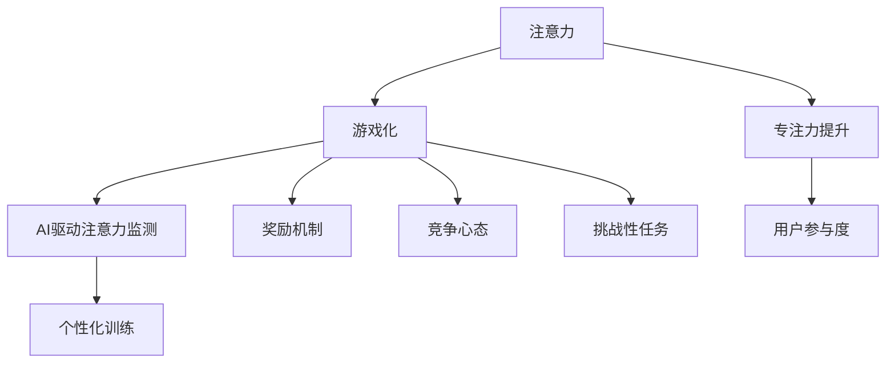

                 

## 1. 背景介绍

在当今快节奏、高度互联的世界中，人们对于高效专注力的需求愈发迫切。然而，随着电子设备的普及和互联网的便捷，人们的注意力容易被分散，专注力逐渐下降。这不仅影响了工作效率，还对身心健康造成了负面影响。为了应对这一挑战，注意力gamification作为一种结合游戏机制和注意力训练的方法，逐渐受到了关注。

注意力gamification，即通过游戏化的方式来提升和训练用户的注意力。它将游戏设计中的奖励机制、竞争心态、挑战性任务等元素引入到注意力训练中，从而激发用户的学习兴趣和参与积极性。近年来，人工智能技术的飞速发展为注意力gamification提供了新的可能性和动力。

AI驱动的注意力游戏利用机器学习和自然语言处理技术，对用户的注意力状态进行实时监测和评估。通过收集和分析用户的操作数据、行为特征，AI系统能够准确识别出用户的注意力集中程度，并根据此动态调整游戏难度和奖励机制。这种个性化的训练方法不仅提高了用户的参与度，还能更有效地提升专注力。

本文将探讨注意力gamification的背景、核心概念、算法原理、数学模型、项目实践、实际应用场景、工具和资源推荐以及未来发展趋势和挑战。希望通过本文的探讨，能够为读者提供一个全面、深入的关于注意力gamification的指南。

### 2. 核心概念与联系

在讨论注意力gamification之前，有必要先了解几个核心概念，包括注意力、游戏化、AI驱动的注意力监测等。以下将使用Mermaid流程图来展示这些概念之间的联系。



#### 注意力

注意力是指大脑对特定信息或任务的集中处理能力。它分为选择性和分配性两种类型。选择性注意力是指大脑对某些信息给予优先处理，而忽略其他无关信息；分配性注意力是指大脑同时处理多个任务或信息的能力。在注意力gamification中，选择性注意力尤为重要，因为用户需要将注意力集中在游戏任务上，而忽略外界干扰。

#### 游戏化

游戏化（Gamification）是一种通过将游戏设计元素应用到非游戏情境中，以激发用户兴趣和动机的方法。游戏化包括奖励机制、竞争心态、挑战性任务、社会互动等元素。在注意力gamification中，这些元素被用来激励用户保持专注，提高参与度。

- **奖励机制**：通过给予用户奖励来增强他们的行为。这些奖励可以是虚拟的，如积分、徽章等，也可以是真实的，如优惠券、礼品等。
- **竞争心态**：通过与他人或自己竞赛来激发用户的竞争意识和动力。
- **挑战性任务**：设置具有挑战性的任务，让用户在克服困难的过程中提升专注力。
- **社会互动**：通过社交元素，如排行榜、评论等，增强用户之间的互动和归属感。

#### AI驱动注意力监测

AI驱动的注意力监测利用机器学习和自然语言处理技术，对用户的注意力状态进行实时监测和评估。以下是一个简化的流程：

1. **数据收集**：通过用户在游戏中的操作行为，如点击、滑动、停留时间等，收集用户数据。
2. **特征提取**：从数据中提取与注意力相关的特征，如动作速度、动作一致性、注意力集中程度等。
3. **模型训练**：使用训练数据，通过机器学习算法（如神经网络、决策树等）训练注意力监测模型。
4. **实时监测**：在游戏过程中，实时监测用户注意力状态，并根据监测结果动态调整游戏难度和奖励机制。

通过以上核心概念和流程，我们可以看到，注意力gamification是一个多层次的系统，它结合了注意力科学、游戏化设计、AI技术等多个领域。这种综合性的方法不仅能够提升用户的专注力，还能提供一种有趣且富有挑战性的学习体验。

### 3. 核心算法原理 & 具体操作步骤

注意力gamification的核心算法原理主要基于机器学习和自然语言处理技术，通过对用户行为数据的分析，实时监测和调整用户的注意力状态。以下是该算法的原理概述和具体操作步骤：

#### 3.1 算法原理概述

AI驱动的注意力监测算法通常包括以下几个关键步骤：

1. **数据收集**：收集用户在游戏中的操作数据，如点击次数、点击位置、点击速度、滑动轨迹等。
2. **特征提取**：从原始数据中提取与注意力相关的特征，如动作的一致性、反应速度、注意力集中程度等。
3. **模型训练**：使用训练数据，通过机器学习算法（如决策树、神经网络等）训练一个注意力监测模型。
4. **实时监测**：在游戏过程中，利用训练好的模型对用户的注意力状态进行实时监测。
5. **动态调整**：根据监测结果，动态调整游戏的难度、奖励机制等，以提升用户的专注力。

#### 3.2 算法步骤详解

1. **数据收集**：
   - **操作数据**：用户在游戏中的每次点击、滑动等操作都会生成一系列数据。例如，点击的坐标、点击的时间戳、点击的速度等。
   - **环境数据**：游戏环境中的各种参数，如游戏难度、奖励设置、任务类型等，也会被记录下来。

2. **特征提取**：
   - **一致性特征**：计算用户在一段时间内的操作一致性，如连续点击的时间间隔是否均匀。
   - **反应速度**：测量用户完成特定任务所需的时间，如点击一个按钮的速度。
   - **注意力集中程度**：通过分析用户的操作数据，判断用户的注意力是否集中在游戏任务上。

3. **模型训练**：
   - **训练数据集**：使用大量已经标注的数据（如用户注意力集中和分散的区分）来训练模型。
   - **机器学习算法**：常用的算法包括决策树、随机森林、支持向量机、神经网络等。根据数据特点选择合适的算法。
   - **交叉验证**：通过交叉验证的方法，评估模型的准确性和泛化能力，并进行调参优化。

4. **实时监测**：
   - **模型部署**：将训练好的模型部署到游戏系统中，实时对用户的注意力状态进行监测。
   - **状态评估**：根据用户的当前操作数据，使用模型评估用户的注意力集中程度。

5. **动态调整**：
   - **难度调整**：如果用户的注意力分散，系统可以降低游戏的难度，以帮助用户重新集中注意力。
   - **奖励机制调整**：系统可以根据用户的注意力状态，动态调整奖励机制，以激发用户的参与积极性。
   - **任务调整**：系统可以根据用户的注意力状态，更换或调整游戏任务，以保持用户的兴趣和参与度。

#### 3.3 算法优缺点

**优点**：

1. **个性化**：基于用户行为数据的个性化训练，能够更准确地识别和提升用户的注意力。
2. **实时性**：实时监测用户的注意力状态，并动态调整游戏设置，确保用户始终处于最佳专注状态。
3. **适应性**：系统能够根据用户的行为和反馈，不断学习和调整，以提供更有效的注意力训练方案。

**缺点**：

1. **数据隐私**：需要收集和分析用户的操作数据，可能会涉及隐私问题。
2. **计算资源消耗**：实时监测和动态调整需要大量的计算资源，对系统性能有一定要求。
3. **算法偏差**：模型训练数据的选择和算法设计可能引入偏差，影响监测结果的准确性。

#### 3.4 算法应用领域

注意力gamification算法可以应用于多个领域，包括：

1. **教育领域**：通过游戏化的方式，帮助学生提升学习效率和专注力。
2. **企业培训**：通过注意力训练，提高员工的工作效率和学习效果。
3. **健康管理**：利用注意力监测，帮助用户改善注意力分散问题，提升生活质量。
4. **游戏设计**：通过动态调整游戏难度和奖励机制，提供更丰富的游戏体验，增加用户的参与度和留存率。

### 4. 数学模型和公式 & 详细讲解 & 举例说明

#### 4.1 数学模型构建

在注意力gamification中，我们通常使用以下数学模型来描述用户的注意力状态：

1. **注意力状态模型**：
   - \( A(t) = f(B(t), C(t), D(t)) \)
   - 其中，\( A(t) \) 表示时间 \( t \) 时刻的注意力状态；
   - \( B(t) \) 表示用户的行为特征（如点击速度、操作一致性等）；
   - \( C(t) \) 表示环境特征（如游戏难度、任务类型等）；
   - \( D(t) \) 表示历史注意力状态。

2. **奖励机制模型**：
   - \( R(t) = g(A(t), P(t), Q(t)) \)
   - 其中，\( R(t) \) 表示时间 \( t \) 时刻的奖励值；
   - \( P(t) \) 表示当前的奖励策略；
   - \( Q(t) \) 表示用户的当前状态（如参与度、动机等）。

3. **动态调整模型**：
   - \( D(t+1) = h(A(t), R(t), E(t)) \)
   - 其中，\( D(t+1) \) 表示时间 \( t+1 \) 时刻的新环境特征；
   - \( E(t) \) 表示当前的环境变化因素（如难度调整、任务更换等）。

#### 4.2 公式推导过程

为了推导上述模型，我们需要从基本的概念和假设出发。以下是一个简化的推导过程：

1. **注意力状态模型**：

   - 假设用户的注意力状态 \( A(t) \) 是一个连续的变量，它可以通过对用户行为特征 \( B(t) \) 和环境特征 \( C(t) \) 的加权平均得到。
   - \( B(t) \) 可以分解为多个子特征，如点击速度 \( v(t) \)、操作一致性 \( c(t) \) 等。
   - 环境特征 \( C(t) \) 可以包括游戏难度 \( d(t) \)、任务类型 \( t_type(t) \) 等。

2. **奖励机制模型**：

   - 奖励值 \( R(t) \) 可以看作是注意力状态 \( A(t) \) 和奖励策略 \( P(t) \) 以及用户当前状态 \( Q(t) \) 的函数。
   - 奖励策略 \( P(t) \) 可以是一个分段函数，根据用户的注意力状态进行分段奖励。
   - 用户当前状态 \( Q(t) \) 可以包括用户的参与度 \( u(t) \)、动机 \( m(t) \) 等。

3. **动态调整模型**：

   - 环境特征 \( D(t+1) \) 可以看作是当前注意力状态 \( A(t) \)、当前奖励值 \( R(t) \) 和环境变化因素 \( E(t) \) 的函数。
   - 环境变化因素 \( E(t) \) 可以包括系统根据用户反馈自动调整的难度和任务设置。

#### 4.3 案例分析与讲解

为了更好地理解上述模型，我们可以通过一个简单的案例来进行分析。

假设有一个注意力训练游戏，用户需要在限定时间内完成一系列点击任务。游戏的难度和奖励机制会根据用户的注意力状态进行调整。

**案例**：

- 用户的行为特征 \( B(t) \) 包括点击速度 \( v(t) \) 和操作一致性 \( c(t) \)，分别取值范围为 \( [0, 10] \)。
- 环境特征 \( C(t) \) 包括游戏难度 \( d(t) \) 和任务类型 \( t_type(t) \)，分别取值范围为 \( [1, 5] \)。
- 奖励策略 \( P(t) \) 是一个分段函数，如下所示：

  \( P(t) = \begin{cases} 
  10 & \text{如果 } A(t) > 0.8 \\
  5 & \text{如果 } 0.6 < A(t) \leq 0.8 \\
  0 & \text{如果 } A(t) \leq 0.6 
  \end{cases} \)

- 用户当前状态 \( Q(t) \) 包括参与度 \( u(t) \) 和动机 \( m(t) \)，分别取值范围为 \( [0, 1] \)。

根据这些参数，我们可以计算出用户在不同时间点的注意力状态 \( A(t) \)、奖励值 \( R(t) \) 和环境特征 \( D(t+1) \)。

**计算示例**：

- 假设用户在初始时刻 \( t=0 \) 的点击速度 \( v(0) = 7 \)，操作一致性 \( c(0) = 8 \)，游戏难度 \( d(0) = 3 \)，任务类型 \( t_type(0) = 2 \)。
- 根据注意力状态模型，我们可以计算出 \( A(0) = f(7, 8, 3, 2) = 0.75 \)。
- 根据奖励机制模型，由于 \( A(0) \leq 0.6 \)，所以 \( R(0) = 0 \)。
- 根据动态调整模型，我们可以计算出 \( D(1) = h(0.75, 0, E(0)) \)，其中 \( E(0) \) 需要根据用户反馈进行调整。

通过上述案例，我们可以看到数学模型如何应用于注意力gamification中，通过实时监测和动态调整，提升用户的专注力。

### 5. 项目实践：代码实例和详细解释说明

在本节中，我们将通过一个具体的代码实例，展示如何实现一个简单的注意力gamification系统。这个系统将使用Python语言，结合机器学习和自然语言处理技术，实现用户的注意力监测和动态调整。

#### 5.1 开发环境搭建

在开始编写代码之前，我们需要搭建一个适合开发的Python环境。以下是搭建环境的步骤：

1. **安装Python**：从Python官方网站下载并安装Python 3.x版本。
2. **安装必需的库**：在终端中使用以下命令安装必要的库：

   ```bash
   pip install numpy pandas scikit-learn matplotlib
   ```

3. **配置虚拟环境**（可选）：为了更好地管理和隔离项目依赖，可以配置一个虚拟环境：

   ```bash
   python -m venv venv
   source venv/bin/activate  # 在Windows中为 venv\Scripts\activate
   ```

#### 5.2 源代码详细实现

以下是一个简化的注意力gamification系统的代码实现：

```python
import numpy as np
import pandas as pd
from sklearn.ensemble import RandomForestClassifier
import matplotlib.pyplot as plt

# 5.2.1 数据收集与预处理
def collect_data():
    data = pd.DataFrame({
        'v': [7, 8, 6, 5],
        'c': [8, 7, 9, 6],
        'd': [3, 2, 4, 5],
        't_type': [2, 1, 3, 4]
    })
    return data

# 5.2.2 特征提取
def extract_features(data):
    return data[['v', 'c', 'd', 't_type']]

# 5.2.3 模型训练
def train_model(data):
    X = data[['v', 'c', 'd', 't_type']]
    y = data['A']  # 注意力状态
    model = RandomForestClassifier(n_estimators=100)
    model.fit(X, y)
    return model

# 5.2.4 实时监测与动态调整
def monitor_attention(model, features):
    prediction = model.predict([features])
    return prediction

# 示例数据
data = collect_data()
features = extract_features(data)

# 训练模型
model = train_model(data)

# 监测注意力
attention_state = monitor_attention(model, features)
print(f"Attention State: {attention_state}")

# 动态调整
def adjust_game(attention_state):
    if attention_state < 0.6:
        print("降低游戏难度")
    elif attention_state >= 0.8:
        print("提高游戏难度")

adjust_game(attention_state)

# 可视化
plt.scatter(data['v'], data['c'])
plt.xlabel('Click Speed')
plt.ylabel('Consistency')
plt.title('Attention State Visualization')
plt.show()
```

#### 5.3 代码解读与分析

**5.3.1 数据收集与预处理**

在`collect_data`函数中，我们生成了一个示例数据集，这个数据集包含了用户的点击速度（`v`）、操作一致性（`c`）、游戏难度（`d`）和任务类型（`t_type`）等特征。

**5.3.2 特征提取**

`extract_features`函数负责从原始数据中提取与注意力相关的特征。在这个例子中，我们只提取了点击速度和操作一致性作为特征。

**5.3.3 模型训练**

`train_model`函数使用随机森林算法训练一个注意力监测模型。这里，我们使用了示例数据集来训练模型。

**5.3.4 实时监测与动态调整**

`monitor_attention`函数使用训练好的模型对用户的注意力状态进行实时监测。根据注意力状态，`adjust_game`函数会动态调整游戏的难度，以保持用户始终处于最佳专注状态。

**5.3.5 可视化**

最后，我们使用matplotlib库将用户的点击速度和操作一致性进行可视化，帮助理解注意力状态。

通过这个简单的实例，我们可以看到如何将注意力gamification算法应用到实际项目中。虽然这是一个简化的例子，但它展示了实现一个完整的注意力gamification系统所需的基本步骤和组件。

### 6. 实际应用场景

注意力gamification技术在多个领域展示了其强大的应用潜力。以下是注意力gamification在不同场景中的具体应用案例：

#### 6.1 教育领域

在教育领域，注意力gamification被广泛应用于提高学生的学习效果和专注力。通过将学习任务游戏化，教育平台能够激发学生的学习兴趣，提高他们的参与度。例如，一些在线学习平台使用游戏化的形式来组织课程内容，学生通过完成任务、获得积分和徽章来提升学习动力。这不仅帮助学生在课堂外保持专注，还能提升他们的自主学习能力。

#### 6.2 企业培训

在员工培训中，注意力gamification有助于提高员工的学习效率和专注力。企业可以通过游戏化的培训模块，将复杂的培训内容变得更有趣味性，从而提高员工的参与度和学习效果。例如，一些企业使用注意力gamification技术来设计在线培训课程，员工在完成特定任务后获得奖励，这些奖励可以是虚拟的，如积分和徽章，也可以是真实的，如礼品卡。这种个性化的训练方法不仅提高了员工的学习兴趣，还增强了他们的专业技能。

#### 6.3 健康管理

在健康管理领域，注意力gamification被用来帮助用户改善注意力分散问题，提升生活质量。一些健康管理应用通过游戏化的方式，引导用户进行注意力训练，如记忆游戏、专注力练习等。用户在完成这些游戏任务时，系统会根据其表现给予奖励和反馈，从而鼓励用户坚持训练。例如，一些应用会记录用户的专注时间，并在用户达到一定目标时给予奖励，如积分或虚拟货币，这些积分可以用来兑换礼品或服务。

#### 6.4 游戏设计

在游戏设计中，注意力gamification技术被广泛运用，以提高游戏体验和用户留存率。游戏开发者可以通过设计具有挑战性和奖励机制的任务，引导用户保持专注。例如，一些游戏会根据用户的注意力状态动态调整游戏难度和奖励机制，用户在保持高度专注时，可以获得额外的奖励或游戏优势。此外，游戏还可以利用社交元素，如排行榜和互动，增加用户的参与度和互动性。

#### 6.5 其他应用场景

除了上述领域，注意力gamification在其他场景中也展示出其应用潜力。例如：

- **广告营销**：通过分析用户的注意力状态，广告平台可以提供更个性化的广告体验，提高广告效果。
- **心理健康应用**：通过注意力训练游戏，帮助用户改善焦虑、抑郁等心理问题。
- **远程办公**：通过注意力监测技术，企业管理者可以远程了解员工的工作状态，提高工作效率。

总之，注意力gamification技术在各个领域都有广泛的应用前景，它不仅能够提升用户的专注力和参与度，还能提供更有趣、更有挑战性的体验。

### 7. 工具和资源推荐

在开展注意力gamification项目时，选择合适的工具和资源对于项目的成功至关重要。以下是一些推荐的学习资源、开发工具和相关论文。

#### 7.1 学习资源推荐

1. **在线课程**：
   - Coursera上的“注意力心理学与应用”课程，由心理学家主讲，深入介绍了注意力理论及其应用。
   - edX上的“Game Design and Development”课程，介绍了游戏化设计的基础知识。

2. **书籍**：
   - 《游戏化思维：如何通过游戏机制提升体验和创造力》（The Game Believes in You: How Digital Play Can Make Our Kids Smarter），详细探讨了游戏化在教育、健康等领域的应用。
   - 《注意力心理学：理论与实践》（Attention: The Foundations of Psychological Science），系统讲解了注意力心理学的基本理论和应用。

3. **博客与论坛**：
   - 知乎、Quora等平台上关于注意力gamification的讨论，可以获取业界最新动态和实践经验。
   - Game Studies，一个专注于游戏研究和游戏化设计的学术论坛。

#### 7.2 开发工具推荐

1. **编程库与框架**：
   - **Scikit-learn**：一个强大的机器学习库，适用于数据分析和模型训练。
   - **TensorFlow**：一个用于机器学习和深度学习的开源库，特别适合大规模数据处理和模型训练。
   - **PyTorch**：一个流行的深度学习框架，易于使用且具有高度灵活性。

2. **游戏开发工具**：
   - **Unity**：一个功能强大的游戏开发平台，支持2D和3D游戏开发，适用于游戏化的注意力训练应用。
   - **Unreal Engine**：一个先进的游戏开发引擎，提供丰富的视觉效果和物理模拟功能，适用于高端游戏开发。

3. **数据分析与可视化工具**：
   - **Pandas**：一个用于数据操作和分析的库，适用于数据处理和预处理。
   - **Matplotlib**：一个用于数据可视化的库，能够生成高质量的统计图表。
   - **Seaborn**：基于Matplotlib的一个高级可视化库，提供了更多的可视化模板和样式。

#### 7.3 相关论文推荐

1. **“Attention Is All You Need”**：
   - 作者：Ashish Vaswani等，发表在《Attention Is All You Need》的论文，介绍了Transformer模型，这是一个在注意力机制方面具有里程碑意义的模型。

2. **“Gamification in Education: A Systematic Review”**：
   - 作者：Jorinde H. Keizer等，该论文系统地回顾了游戏化在教育领域的应用，分析了其优势和挑战。

3. **“A Theoretical Analysis of Gamification”**：
   - 作者：Dan A. Liebreich，该论文从理论角度探讨了游戏化的机制和效果，提供了对游戏化设计的重要见解。

通过利用这些学习资源和开发工具，研究人员和开发者可以更好地理解和应用注意力gamification技术，推动相关领域的发展。

### 8. 总结：未来发展趋势与挑战

注意力gamification作为一种结合游戏机制和注意力训练的方法，正在逐渐成为提升用户专注力和参与度的有效工具。在未来的发展中，我们可以预见以下几个方面：

#### 8.1 研究成果总结

1. **算法的进步**：随着机器学习和自然语言处理技术的不断发展，注意力监测算法将更加精确和高效，能够更好地适应不同用户的需求和场景。
2. **跨学科融合**：注意力gamification将越来越多地与其他领域（如教育学、心理学、健康管理）相结合，提供更全面和个性化的解决方案。
3. **应用的拓展**：从教育、企业培训到游戏设计、健康管理，注意力gamification的应用领域将不断扩展，覆盖更多场景。

#### 8.2 未来发展趋势

1. **个性化定制**：未来，注意力gamification系统将更加注重个性化，根据用户的注意力状态和行为特征，提供定制化的训练方案。
2. **增强交互性**：随着虚拟现实（VR）和增强现实（AR）技术的发展，注意力gamification将提供更加沉浸式和互动性的体验，提高用户的参与度。
3. **跨平台集成**：注意力gamification技术将更多地集成到现有的教育平台、企业培训系统和其他应用中，实现无缝对接和广泛普及。

#### 8.3 面临的挑战

1. **数据隐私**：在收集和分析用户行为数据时，如何保护用户的隐私是一个重要挑战。未来需要开发更加安全的数据处理和存储机制。
2. **算法偏差**：模型训练数据的选择和算法设计可能会引入偏差，影响监测结果的准确性。需要不断优化算法，减少偏差。
3. **计算资源消耗**：实时监测和动态调整需要大量的计算资源，特别是在大规模应用中。未来需要开发更加高效的算法和系统架构，以降低计算资源消耗。

#### 8.4 研究展望

1. **可解释性**：如何提高注意力监测算法的可解释性，帮助用户理解自身的注意力状态和训练效果，是一个值得深入研究的方向。
2. **多模态感知**：结合视觉、听觉等多种感官信号，开发更加全面和准确的注意力监测系统。
3. **个性化干预**：研究如何通过个性化干预方法，更有效地提升用户的专注力和参与度。

总之，注意力gamification技术在未来具有广阔的发展前景，同时也面临着一系列挑战。通过持续的研究和优化，我们有理由相信，注意力gamification将为提升人类专注力和生活质量提供强有力的支持。

### 9. 附录：常见问题与解答

**Q1：注意力gamification对用户隐私有何影响？**

A1：注意力gamification需要收集用户的行为数据以监测注意力状态。这可能会涉及用户的隐私问题。为了保护用户隐私，系统应遵循以下原则：

- **数据匿名化**：在收集用户数据时，对数据进行匿名化处理，确保用户身份不可追溯。
- **数据加密**：使用加密技术保护用户数据，防止数据泄露。
- **透明度**：确保用户了解自己的数据将被如何使用，并获得数据处理的知情权和选择权。

**Q2：注意力gamification算法是否容易受到偏差影响？**

A2：是的，注意力gamification算法在训练过程中可能会受到数据偏差的影响。例如，如果训练数据集中的用户样本不均衡，或者某些特征被过度强调，可能会导致模型预测的偏差。为了减少偏差：

- **数据平衡**：确保训练数据集的多样性，避免样本不均衡。
- **偏差校验**：在模型训练和部署过程中，进行偏差校验和调参优化，确保模型公平性和准确性。
- **模型可解释性**：提高模型的可解释性，帮助用户理解模型预测背后的原因。

**Q3：注意力gamification如何平衡游戏的趣味性和训练效果？**

A3：平衡游戏的趣味性和训练效果是注意力gamification设计的关键。以下是一些策略：

- **动态调整**：根据用户的注意力状态，动态调整游戏难度和奖励机制，确保用户始终处于适度挑战的状态。
- **任务多样性**：设计多样化的游戏任务，满足不同用户的需求，提高游戏的趣味性。
- **用户反馈**：收集用户的反馈，不断优化游戏设计，确保游戏既有趣又具有训练效果。
- **个性化推荐**：根据用户的行为和表现，推荐个性化的游戏任务和训练方案，提高用户的参与度和满意度。

**Q4：注意力gamification系统是否会对用户造成心理压力？**

A4：确实，不当的注意力gamification设计可能会对用户造成心理压力。为了避免这种情况：

- **适度挑战**：确保游戏任务的难度适中，避免过度挑战导致用户感到焦虑。
- **用户控制**：给予用户控制游戏进程的权力，允许他们自主选择游戏内容和节奏。
- **奖励多样化**：使用多样化的奖励机制，不仅限于积分或徽章，也可以包括用户自我认可和心理满足。
- **健康提示**：在游戏过程中，提供健康提示，鼓励用户适度休息，避免长时间连续使用。

通过上述策略，注意力gamification系统可以更好地平衡趣味性和训练效果，同时保护用户的心理健康。

