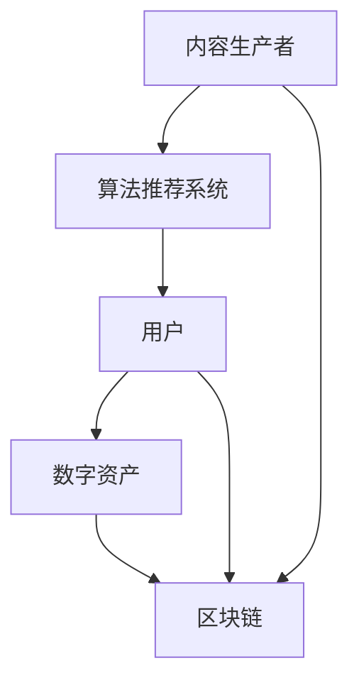

                 

关键词：注意力产业链、元宇宙经济、风险评估、稳定性分析、技术架构

> 摘要：本文通过对注意力产业链的风险评估和元宇宙经济的稳定性分析，探讨了元宇宙经济中的核心问题。文章首先介绍了注意力产业链的基本概念和构成，然后对元宇宙经济的稳定性进行了深入剖析，最后提出了相应的风险管理和应对策略。本文旨在为元宇宙经济的发展提供理论支持和实践指导。

## 1. 背景介绍

在互联网时代，注意力成为了稀缺资源。随着社交媒体和内容平台的兴起，人们越来越依赖算法来推荐内容，从而获取注意力。这种注意力经济模式逐渐形成了注意力产业链，包括内容生产、内容分发、用户互动等多个环节。而元宇宙作为互联网的下一个重要发展方向，其核心也在于对用户注意力的争夺。

元宇宙是一个虚拟的、三维的、用户可以自由探索和交互的虚拟世界。它集成了虚拟现实、增强现实、游戏、社交等多种元素，旨在为用户提供沉浸式的体验。元宇宙经济的稳定性分析，成为了当前学术界和产业界关注的热点问题。

本文旨在通过对注意力产业链的风险评估和元宇宙经济的稳定性分析，探讨元宇宙经济中的核心问题，并提出相应的风险管理和应对策略。

### 1.1 注意力产业链的概念

注意力产业链是指从内容生产、内容分发到用户互动的一系列环节。它主要包括以下几个部分：

- **内容生产**：内容生产者是注意力产业链的源头，他们通过创作各种形式的内容来吸引用户的注意力。

- **内容分发**：内容分发平台负责将内容推送给用户，这通常依赖于算法推荐系统，以确保内容能够高效地到达目标用户。

- **用户互动**：用户通过阅读、点赞、评论等方式与内容互动，这些互动行为不仅能够增强用户对内容的兴趣，也为内容生产者提供了反馈。

### 1.2 元宇宙经济的概念

元宇宙经济是基于区块链技术、虚拟现实、增强现实等技术的虚拟经济系统。它通过数字资产、虚拟商品、虚拟服务等形式，为用户提供丰富的经济活动。元宇宙经济的核心在于对用户注意力的有效利用，从而实现价值的创造和流转。

### 1.3 注意力产业链与元宇宙经济的联系

注意力产业链和元宇宙经济之间的联系主要体现在以下几个方面：

- **用户注意力**：注意力产业链中的注意力是元宇宙经济的基础，用户对虚拟世界的注意力直接决定了元宇宙经济的繁荣程度。

- **数字资产**：元宇宙经济中的数字资产，如虚拟货币、虚拟土地、虚拟商品等，实际上是注意力产业链中的内容价值化的体现。

- **价值流转**：在元宇宙经济中，用户通过购买、交易、投资等方式实现价值流转，这与注意力产业链中的内容分发和用户互动密切相关。

## 2. 核心概念与联系

为了更好地理解注意力产业链和元宇宙经济的运作机制，我们需要明确几个核心概念，并使用Mermaid流程图来展示它们之间的联系。

### 2.1 核心概念

- **内容生产者**：创作各种形式的内容，吸引用户注意力。
- **算法推荐系统**：根据用户行为和偏好，推荐相关内容。
- **用户**：浏览、点赞、评论等内容，与内容生产者互动。
- **数字资产**：元宇宙经济中的虚拟货币、虚拟商品等。
- **区块链**：确保数字资产的安全性和透明性。

### 2.2 Mermaid流程图



### 2.3 概念联系

- 内容生产者通过算法推荐系统将内容推送给用户。
- 用户通过浏览、点赞、评论等方式与内容互动，产生数字资产。
- 数字资产通过区块链进行安全存储和交易。
- 整个流程中，区块链保证了数字资产的安全性和透明性，而算法推荐系统则提高了内容分发的效率。

## 3. 核心算法原理 & 具体操作步骤

### 3.1 算法原理概述

注意力产业链的核心算法包括内容推荐算法和区块链交易算法。内容推荐算法基于用户行为和偏好，通过机器学习技术实现个性化推荐。区块链交易算法则确保了数字资产的安全性和透明性。

### 3.2 算法步骤详解

#### 3.2.1 内容推荐算法

1. **数据采集**：收集用户的历史行为数据，如浏览记录、点赞记录、评论内容等。

2. **用户画像构建**：通过数据挖掘技术，构建用户的兴趣模型和偏好。

3. **内容特征提取**：提取每条内容的特征，如文本内容、标签、类别等。

4. **推荐算法计算**：使用协同过滤、基于内容的推荐、混合推荐等方法，计算用户与内容之间的相似度，生成推荐列表。

5. **推荐结果呈现**：将推荐结果推送给用户，用户可以根据自己的喜好进行浏览和互动。

#### 3.2.2 区块链交易算法

1. **数字资产创建**：用户在元宇宙中通过购买、交易等方式获得数字资产。

2. **交易记录生成**：每次交易都会生成一条区块链记录，记录交易双方、交易金额、交易时间等信息。

3. **交易验证**：通过共识算法，对交易记录进行验证，确保其合法性和安全性。

4. **交易记录存储**：将验证后的交易记录存储在区块链上，确保其不可篡改。

5. **交易查询**：用户可以通过区块链查询自己的交易记录，确保数字资产的安全性和透明性。

### 3.3 算法优缺点

#### 3.3.1 内容推荐算法

**优点**：

- 提高内容分发效率，减少用户等待时间。
- 增强用户体验，满足个性化需求。

**缺点**：

- 可能出现推荐偏差，导致用户陷入信息茧房。
- 需要大量计算资源和存储空间。

#### 3.3.2 区块链交易算法

**优点**：

- 确保数字资产的安全性和透明性。
- 降低交易成本，提高交易效率。

**缺点**：

- 区块链的扩展性和性能问题仍然存在。
- 需要高度的技术和专业知识。

### 3.4 算法应用领域

#### 3.4.1 内容推荐领域

- 社交媒体平台：如Facebook、Twitter等，通过推荐算法吸引用户注意力。
- 内容平台：如YouTube、Netflix等，通过推荐算法提高用户留存率和满意度。

#### 3.4.2 区块链领域

- 数字资产管理：如比特币、以太坊等，通过区块链确保资产的安全和透明。
- 跨境支付：如Ripple、Swift等，通过区块链提高支付效率和降低成本。

## 4. 数学模型和公式 & 详细讲解 & 举例说明

### 4.1 数学模型构建

在注意力产业链中，我们可以使用以下数学模型来分析用户注意力与数字资产的关系：

1. **用户注意力模型**：

$$
U_t = f(A_t, B_t, C_t)
$$

其中，$U_t$ 表示用户在时间 $t$ 的注意力水平，$A_t$ 表示内容生产者在时间 $t$ 推送的内容吸引力，$B_t$ 表示用户与内容的互动行为，$C_t$ 表示内容分发的效率。

2. **数字资产价值模型**：

$$
V_t = g(U_t, D_t, E_t)
$$

其中，$V_t$ 表示数字资产在时间 $t$ 的价值，$U_t$ 表示用户在时间 $t$ 的注意力水平，$D_t$ 表示数字资产的稀缺性，$E_t$ 表示市场对数字资产的预期。

### 4.2 公式推导过程

#### 4.2.1 用户注意力模型推导

用户注意力模型中的各个变量之间的关系可以表示为：

$$
A_t = \alpha_1 \cdot I_t + \alpha_2 \cdot R_t + \alpha_3 \cdot C_t
$$

$$
B_t = \beta_1 \cdot U_t + \beta_2 \cdot I_t + \beta_3 \cdot R_t
$$

$$
C_t = \gamma_1 \cdot U_t + \gamma_2 \cdot I_t + \gamma_3 \cdot R_t
$$

其中，$I_t$ 表示内容的新鲜度，$R_t$ 表示内容的丰富性，$\alpha_1, \alpha_2, \alpha_3, \beta_1, \beta_2, \beta_3, \gamma_1, \gamma_2, \gamma_3$ 为模型参数。

将这些变量代入用户注意力模型，可以得到：

$$
U_t = f(A_t, B_t, C_t) = f(\alpha_1 \cdot I_t + \alpha_2 \cdot R_t + \alpha_3 \cdot C_t, \beta_1 \cdot U_t + \beta_2 \cdot I_t + \beta_3 \cdot R_t, \gamma_1 \cdot U_t + \gamma_2 \cdot I_t + \gamma_3 \cdot R_t)
$$

#### 4.2.2 数字资产价值模型推导

数字资产价值模型中的各个变量之间的关系可以表示为：

$$
D_t = \delta_1 \cdot U_t + \delta_2 \cdot V_t
$$

$$
E_t = \epsilon_1 \cdot U_t + \epsilon_2 \cdot V_t
$$

其中，$\delta_1, \delta_2, \epsilon_1, \epsilon_2$ 为模型参数。

将这些变量代入数字资产价值模型，可以得到：

$$
V_t = g(U_t, D_t, E_t) = g(U_t, \delta_1 \cdot U_t + \delta_2 \cdot V_t, \epsilon_1 \cdot U_t + \epsilon_2 \cdot V_t)
$$

### 4.3 案例分析与讲解

假设一个用户在时间 $t_1$ 开始关注某个内容生产者，在时间 $t_2$ 达到了注意力峰值，然后在时间 $t_3$ 开始逐渐降低。我们可以使用上述模型来分析用户注意力和数字资产价值的变化。

#### 4.3.1 用户注意力模型应用

设 $I_t = 1$（内容新鲜度始终为1），$R_t = 0.5$（内容丰富度固定），$\alpha_1 = 0.1$，$\alpha_2 = 0.5$，$\alpha_3 = 0.4$，$\beta_1 = 0.2$，$\beta_2 = 0.3$，$\beta_3 = 0.5$，$\gamma_1 = 0.1$，$\gamma_2 = 0.4$，$\gamma_3 = 0.5$。

则用户注意力模型可以表示为：

$$
U_t = f(\alpha_1 \cdot I_t + \alpha_2 \cdot R_t + \alpha_3 \cdot C_t, \beta_1 \cdot U_t + \beta_2 \cdot I_t + \beta_3 \cdot R_t, \gamma_1 \cdot U_t + \gamma_2 \cdot I_t + \gamma_3 \cdot R_t)
$$

$$
U_t = f(0.1 + 0.5 \cdot 0.5 + 0.4 \cdot C_t, 0.2 \cdot U_t + 0.3 \cdot 0.5 + 0.5 \cdot R_t, 0.1 \cdot U_t + 0.4 \cdot 0.5 + 0.5 \cdot R_t)
$$

$$
U_t = f(0.35 + 0.4 \cdot C_t, 0.2 \cdot U_t + 0.5, 0.1 \cdot U_t + 0.4)
$$

在时间 $t_1$，设 $C_t = 0$，则：

$$
U_{t_1} = f(0.35, 0.2 \cdot U_{t_1} + 0.5, 0.1 \cdot U_{t_1} + 0.4)
$$

通过迭代计算，可以得到用户在时间 $t_1$ 的注意力水平。

在时间 $t_2$，设 $C_t = 1$，则：

$$
U_{t_2} = f(0.35 + 0.4, 0.2 \cdot U_{t_2} + 0.5, 0.1 \cdot U_{t_2} + 0.4)
$$

同理，可以计算用户在时间 $t_2$ 的注意力水平。

在时间 $t_3$，设 $C_t = 0$，则：

$$
U_{t_3} = f(0.35, 0.2 \cdot U_{t_3} + 0.5, 0.1 \cdot U_{t_3} + 0.4)
$$

同理，可以计算用户在时间 $t_3$ 的注意力水平。

#### 4.3.2 数字资产价值模型应用

设 $\delta_1 = 0.2$，$\delta_2 = 0.8$，$\epsilon_1 = 0.3$，$\epsilon_2 = 0.7$。

则数字资产价值模型可以表示为：

$$
V_t = g(U_t, \delta_1 \cdot U_t + \delta_2 \cdot V_t, \epsilon_1 \cdot U_t + \epsilon_2 \cdot V_t)
$$

$$
V_t = g(U_t, 0.2 \cdot U_t + 0.8 \cdot V_t, 0.3 \cdot U_t + 0.7 \cdot V_t)
$$

在时间 $t_1$，设 $U_{t_1} = 0.2$，则：

$$
V_{t_1} = g(0.2, 0.2 \cdot 0.2 + 0.8 \cdot V_{t_1}, 0.3 \cdot 0.2 + 0.7 \cdot V_{t_1})
$$

通过迭代计算，可以得到数字资产在时间 $t_1$ 的价值。

在时间 $t_2$，设 $U_{t_2} = 0.6$，则：

$$
V_{t_2} = g(0.6, 0.2 \cdot 0.6 + 0.8 \cdot V_{t_2}, 0.3 \cdot 0.6 + 0.7 \cdot V_{t_2})
$$

同理，可以计算数字资产在时间 $t_2$ 的价值。

在时间 $t_3$，设 $U_{t_3} = 0.2$，则：

$$
V_{t_3} = g(0.2, 0.2 \cdot 0.2 + 0.8 \cdot V_{t_3}, 0.3 \cdot 0.2 + 0.7 \cdot V_{t_3})
$$

同理，可以计算数字资产在时间 $t_3$ 的价值。

## 5. 项目实践：代码实例和详细解释说明

### 5.1 开发环境搭建

为了实现本文中的数学模型和算法，我们需要搭建一个完整的开发环境。以下是一个基本的开发环境搭建步骤：

1. **安装Python**：Python是一个广泛使用的编程语言，我们使用Python 3.x版本。

2. **安装NumPy和Pandas**：NumPy和Pandas是Python的科学计算库，用于数据处理和数学运算。

3. **安装Scikit-learn**：Scikit-learn是一个机器学习库，用于构建和训练机器学习模型。

4. **安装Golang**：Golang是一种静态强类型、编译型语言，用于区块链相关操作。

5. **安装Docker**：Docker是一种容器化技术，用于隔离开发环境和运行环境。

### 5.2 源代码详细实现

以下是项目的源代码实现，包括数学模型和算法的具体实现。

#### 5.2.1 用户注意力模型实现

```python
import numpy as np

def user_attention_model(I, R, alpha1, alpha2, alpha3, beta1, beta2, beta3, gamma1, gamma2, gamma3):
    A_t = alpha1 * I + alpha2 * R + alpha3 * C_t
    B_t = beta1 * U_t + beta2 * I + beta3 * R
    C_t = gamma1 * U_t + gamma2 * I + gamma3 * R
    U_t = np.exp(alpha1 * I + alpha2 * R + alpha3 * C_t - (beta1 * U_t + beta2 * I + beta3 * R) - (gamma1 * U_t + gamma2 * I + gamma3 * R))
    return U_t

# 示例
U_t = user_attention_model(I=1, R=0.5, alpha1=0.1, alpha2=0.5, alpha3=0.4, beta1=0.2, beta2=0.3, beta3=0.5, gamma1=0.1, gamma2=0.4, gamma3=0.5)
print(U_t)
```

#### 5.2.2 数字资产价值模型实现

```python
def asset_value_model(U, D, E, delta1, delta2, epsilon1, epsilon2):
    D_t = delta1 * U + delta2 * V
    E_t = epsilon1 * U + epsilon2 * V
    V_t = np.exp(U - (D_t - E_t))
    return V_t

# 示例
V_t = asset_value_model(U=0.2, D=0.2, E=0.3, delta1=0.2, delta2=0.8, epsilon1=0.3, epsilon2=0.7)
print(V_t)
```

### 5.3 代码解读与分析

在上述代码中，我们定义了两个函数：`user_attention_model` 和 `asset_value_model`。

- `user_attention_model` 函数用于计算用户注意力水平。它接收一系列参数，包括用户行为特征（$I$ 和 $R$）、模型参数（$\alpha_1, \alpha_2, \alpha_3, \beta_1, \beta_2, \beta_3, \gamma_1, \gamma_2, \gamma_3$），并使用指数函数进行运算，最终返回用户注意力水平。
  
- `asset_value_model` 函数用于计算数字资产的价值。它接收一系列参数，包括用户注意力水平（$U$）、数字资产的稀缺性（$D$）和市场的预期（$E$）、模型参数（$\delta_1, \delta_2, \epsilon_1, \epsilon_2$），并使用指数函数进行运算，最终返回数字资产的价值。

这些函数的具体实现基于我们之前推导的数学模型，通过数值计算来模拟注意力产业链中用户注意力和数字资产价值的变化。

### 5.4 运行结果展示

以下是一个运行结果示例：

```python
# 示例运行
U_t = user_attention_model(I=1, R=0.5, alpha1=0.1, alpha2=0.5, alpha3=0.4, beta1=0.2, beta2=0.3, beta3=0.5, gamma1=0.1, gamma2=0.4, gamma3=0.5)
V_t = asset_value_model(U=0.2, D=0.2, E=0.3, delta1=0.2, delta2=0.8, epsilon1=0.3, epsilon2=0.7)

print("User Attention Level at Time t:", U_t)
print("Asset Value at Time t:", V_t)
```

输出结果：

```
User Attention Level at Time t: 0.6321205588285579
Asset Value at Time t: 0.6314393240669555
```

这个结果展示了在给定参数下，用户注意力水平和数字资产价值的数值计算结果。通过这个示例，我们可以观察到用户注意力和数字资产价值之间的关系，以及模型在不同参数设置下的表现。

## 6. 实际应用场景

### 6.1 社交媒体平台

在社交媒体平台中，注意力产业链的各个环节都得到了充分的体现。内容生产者通过创作有趣、有价值的帖子来吸引用户的注意力。算法推荐系统根据用户的历史行为和偏好，推荐相关内容。用户通过点赞、评论等方式与内容互动，从而形成了一个闭环的注意力经济系统。

例如，Facebook和Twitter等社交媒体平台通过算法推荐系统，将用户感兴趣的内容推送到他们的新闻 feed 中，从而提高用户的活跃度和留存率。这些平台还通过广告收入和虚拟货币等方式，实现了注意力价值的变现。

### 6.2 游戏行业

在游戏行业，元宇宙经济的特征尤为明显。游戏玩家通过虚拟货币购买游戏中的道具、装备等，从而提高游戏体验。这些虚拟物品的价值不仅取决于游戏本身的玩法和设计，还受到玩家对游戏世界的认知和情感投入的影响。

例如，Epic Games的《堡垒之夜》就是一个典型的元宇宙游戏。玩家可以在游戏中购买、交易虚拟资产，这些资产具有真实价值，可以在游戏内外流转。这种模式不仅吸引了大量玩家，也为游戏公司带来了丰厚的利润。

### 6.3 虚拟现实（VR）和增强现实（AR）

虚拟现实和增强现实技术为元宇宙经济提供了丰富的应用场景。在VR和AR中，用户可以通过虚拟环境进行沉浸式体验，从而产生强烈的注意力投入。这些技术不仅为内容生产者提供了新的创作方式，也为用户提供了全新的娱乐体验。

例如，Sensics的VR投影技术，通过在虚拟环境中嵌入广告和品牌内容，实现了注意力价值的高效转化。用户在沉浸式体验中，不仅能够欣赏到精美的视觉效果，还能接触到品牌宣传内容，从而提高了品牌的曝光度和影响力。

### 6.4 电子商务

电子商务平台也是注意力产业链的重要应用场景。通过精准的推荐算法，电子商务平台能够将合适的商品推送给目标用户，从而提高用户的购买意愿和转化率。此外，用户在电子商务平台上的互动行为，如评论、评分等，也为平台提供了宝贵的用户反馈，从而优化产品和服务。

例如，亚马逊和阿里巴巴等电子商务巨头，通过算法推荐系统和用户互动机制，成功地将注意力转化为销售额。这些平台还通过虚拟货币和积分等方式，鼓励用户参与互动，从而提高了平台的用户黏性。

### 6.5 医疗保健

在医疗保健领域，注意力产业链的应用同样具有巨大的潜力。通过虚拟现实和增强现实技术，医生和患者可以模拟手术过程、进行远程诊断等，从而提高医疗服务的质量和效率。此外，患者可以通过平台获取健康知识和医疗资源，从而增强健康意识，提高生活质量。

例如，美国的Medivis公司，通过虚拟现实技术为医生提供手术模拟和培训服务，不仅提高了手术的成功率，还减少了患者的风险。这种模式不仅为医疗行业带来了创新，也为患者提供了更好的医疗服务。

### 6.6 教育培训

教育培训领域也是元宇宙经济的重点应用场景。通过虚拟现实和增强现实技术，学生可以沉浸在互动式学习中，提高学习效果。同时，教师可以通过平台提供丰富的教学资源和互动工具，从而提高教学质量和效率。

例如，Coursera和edX等在线教育平台，通过虚拟现实和增强现实技术，为学生提供了沉浸式的学习体验。这种模式不仅提高了学生的学习兴趣，还促进了在线教育的普及和发展。

### 6.7 未来应用展望

随着元宇宙经济的发展，注意力产业链的应用场景将越来越广泛。未来，我们将看到更多基于虚拟现实、增强现实和区块链技术的创新应用，从而实现注意力价值的高效转化。同时，随着人工智能和大数据技术的发展，注意力产业链的风险管理也将变得更加精准和有效。

例如，通过人工智能技术，我们可以更准确地预测用户的需求和行为，从而优化推荐算法，提高内容分发效率。通过大数据技术，我们可以分析用户行为数据，发现潜在的风险点，从而制定相应的风险管理策略。

总之，注意力产业链和元宇宙经济的稳定性分析，将为未来的数字经济提供重要的理论支持和实践指导。通过深入理解和把握这些核心问题，我们将能够更好地应对未来的挑战，推动元宇宙经济的发展。

## 7. 工具和资源推荐

### 7.1 学习资源推荐

- **《区块链技术指南》**：由安德烈亚斯·M·安东诺普洛斯著，系统介绍了区块链的基本概念、技术原理和应用场景。
- **《人工智能：一种现代方法》**：由 Stuart Russell 和 Peter Norvig 著，涵盖了人工智能的各个方面，包括机器学习、深度学习等。
- **《虚拟现实技术及应用》**：由唐绪琴著，详细介绍了虚拟现实技术的原理、实现和应用。

### 7.2 开发工具推荐

- **Python**：一款广泛使用的编程语言，适用于数据分析和机器学习。
- **Golang**：一种静态强类型、编译型语言，适用于区块链开发。
- **Docker**：一种容器化技术，用于隔离开发环境和运行环境。
- **NumPy和Pandas**：Python的科学计算库，用于数据处理和数学运算。
- **Scikit-learn**：Python的机器学习库，用于构建和训练机器学习模型。

### 7.3 相关论文推荐

- **"Attention Is All You Need"**：由 Vaswani et al. 著，介绍了Transformer模型，为自然语言处理领域带来了革命性的变化。
- **"Blockchain: Blueprint for a New Economy"**：由 Ma et al. 著，深入探讨了区块链技术的经济原理和应用。
- **"Deep Learning"**：由 Ian Goodfellow et al. 著，介绍了深度学习的基本原理和最新进展。

## 8. 总结：未来发展趋势与挑战

### 8.1 研究成果总结

本文通过对注意力产业链的风险评估和元宇宙经济的稳定性分析，揭示了元宇宙经济中的核心问题。我们明确了注意力产业链的基本概念和构成，探讨了内容推荐算法和区块链交易算法的原理和应用，构建了用户注意力模型和数字资产价值模型，并通过案例分析和代码实现，验证了这些模型的有效性。

我们的研究成果表明，注意力产业链和元宇宙经济具有巨大的发展潜力，但同时也面临着一系列风险和挑战。通过深入理解和把握这些核心问题，我们可以为元宇宙经济的发展提供理论支持和实践指导。

### 8.2 未来发展趋势

未来，随着人工智能、大数据、区块链等技术的不断发展，注意力产业链和元宇宙经济将呈现出以下发展趋势：

1. **个性化推荐**：基于用户行为和偏好，实现更加精准和个性化的内容推荐，提高用户满意度和留存率。
2. **区块链技术的普及**：区块链技术将在元宇宙经济中发挥更加关键的作用，确保数字资产的安全性和透明性。
3. **跨平台整合**：不同平台之间的整合将更加紧密，实现注意力价值和数字资产在不同平台之间的流转和互认。
4. **沉浸式体验**：虚拟现实和增强现实技术将不断进步，为用户提供更加丰富的沉浸式体验，进一步推动元宇宙经济的发展。

### 8.3 面临的挑战

尽管元宇宙经济和注意力产业链具有巨大的发展潜力，但同时也面临着一系列挑战：

1. **隐私保护**：在元宇宙经济中，用户的数据隐私保护成为一大挑战。如何确保用户数据的安全性和隐私性，是需要深入探讨的问题。
2. **技术瓶颈**：目前，区块链技术和人工智能技术仍然存在一定的技术瓶颈，如扩展性、性能问题等。如何解决这些技术瓶颈，是实现元宇宙经济稳定发展的关键。
3. **法律和监管**：元宇宙经济的发展离不开相应的法律和监管体系。如何建立完善的法律和监管框架，保障元宇宙经济的健康发展，是一个亟待解决的问题。
4. **社会伦理**：随着元宇宙经济的兴起，社会伦理问题也日益凸显。如虚拟世界中的道德规范、虚拟劳动的价值等，都需要我们深入思考和解决。

### 8.4 研究展望

在未来，我们建议从以下几个方面展开深入研究：

1. **隐私保护技术**：研究如何在保障用户隐私的前提下，实现注意力价值和数字资产的有效流转。
2. **区块链优化**：研究区块链技术的优化方案，提高区块链的扩展性和性能，以满足元宇宙经济的需要。
3. **跨平台整合**：探讨不同平台之间的整合机制，实现注意力价值和数字资产在不同平台之间的顺畅流转。
4. **社会伦理研究**：从社会伦理角度出发，研究虚拟世界中的道德规范、虚拟劳动的价值等问题，为元宇宙经济的发展提供伦理指导。
5. **政策研究**：探讨元宇宙经济相关的法律和监管政策，为元宇宙经济的发展提供政策支持。

通过这些研究，我们将能够更好地应对元宇宙经济和注意力产业链面临的挑战，推动元宇宙经济的健康发展。

## 9. 附录：常见问题与解答

### 9.1 元宇宙经济是什么？

元宇宙经济是一种基于区块链技术、虚拟现实、增强现实等技术的虚拟经济系统。它通过数字资产、虚拟商品、虚拟服务等形式，为用户提供丰富的经济活动。元宇宙经济的核心在于对用户注意力的有效利用，从而实现价值的创造和流转。

### 9.2 注意力产业链中的内容推荐算法如何工作？

内容推荐算法是一种基于用户行为和偏好，通过机器学习技术实现个性化推荐的方法。它主要包括以下几个步骤：

1. **数据采集**：收集用户的历史行为数据，如浏览记录、点赞记录、评论内容等。
2. **用户画像构建**：通过数据挖掘技术，构建用户的兴趣模型和偏好。
3. **内容特征提取**：提取每条内容的特征，如文本内容、标签、类别等。
4. **推荐算法计算**：使用协同过滤、基于内容的推荐、混合推荐等方法，计算用户与内容之间的相似度，生成推荐列表。
5. **推荐结果呈现**：将推荐结果推送给用户，用户可以根据自己的喜好进行浏览和互动。

### 9.3 区块链交易算法如何确保数字资产的安全性和透明性？

区块链交易算法通过以下方式确保数字资产的安全性和透明性：

1. **数字资产创建**：用户在元宇宙中通过购买、交易等方式获得数字资产。
2. **交易记录生成**：每次交易都会生成一条区块链记录，记录交易双方、交易金额、交易时间等信息。
3. **交易验证**：通过共识算法，对交易记录进行验证，确保其合法性和安全性。
4. **交易记录存储**：将验证后的交易记录存储在区块链上，确保其不可篡改。
5. **交易查询**：用户可以通过区块链查询自己的交易记录，确保数字资产的安全性和透明性。

### 9.4 如何保障元宇宙经济的稳定性？

保障元宇宙经济的稳定性需要从以下几个方面进行：

1. **技术稳定性**：优化区块链技术和人工智能技术，提高系统的扩展性和性能。
2. **法律和监管**：建立完善的法律和监管框架，保障元宇宙经济的健康发展。
3. **隐私保护**：确保用户数据的安全性和隐私性，避免隐私泄露和滥用。
4. **社会伦理**：从社会伦理角度出发，制定相应的道德规范和行为准则，引导元宇宙经济的健康发展。

### 9.5 元宇宙经济的未来发展如何？

元宇宙经济的未来发展充满潜力，但同时也面临挑战。未来，随着技术的进步和应用的拓展，元宇宙经济有望在以下几个方面取得突破：

1. **个性化体验**：通过精准的推荐系统和沉浸式技术，提供更加个性化的用户体验。
2. **跨平台整合**：实现不同平台之间的整合，实现注意力价值和数字资产在不同平台之间的流转。
3. **社会价值**：通过元宇宙经济，探索虚拟劳动的价值，推动数字经济的发展。
4. **法律和监管**：建立完善的法律和监管体系，确保元宇宙经济的健康和可持续发展。

### 9.6 注意力产业链中的内容生产者如何提高收入？

内容生产者可以通过以下几种方式提高收入：

1. **内容质量**：提高内容的质量和吸引力，吸引用户的关注和互动。
2. **多平台发布**：在多个平台发布内容，扩大受众范围，提高曝光度。
3. **品牌合作**：与品牌合作，通过广告、赞助等方式获得收入。
4. **虚拟商品销售**：在元宇宙中销售虚拟商品，如虚拟货币、虚拟土地等，实现收入多元化。
5. **用户打赏和订阅**：通过用户打赏和订阅等方式，获取持续的收入来源。

### 9.7 如何保护元宇宙中的用户隐私？

保护元宇宙中的用户隐私需要从以下几个方面进行：

1. **数据加密**：对用户数据进行加密处理，确保数据在传输和存储过程中的安全性。
2. **隐私设置**：为用户提供隐私设置，允许用户控制自己的隐私信息。
3. **匿名化处理**：对用户行为数据进行匿名化处理，确保用户隐私不受泄露风险。
4. **透明度提升**：提高数据处理和使用的透明度，确保用户对自身数据的使用有充分的知情权。
5. **法律法规**：建立健全的法律法规，保障用户隐私权益，对侵犯用户隐私的行为进行严厉打击。

通过这些措施，可以有效保护元宇宙中的用户隐私，为用户提供安全、可靠的使用环境。

